<a id="sec-000"></a>

# 关于本合订本

《AI Agent HandBook》是阿里云与一线实践团队共同编写的开源白皮书。它沿着 Agent 的生命周期展开：先判断什么样的任务值得交给 Agent、该选多深的架构，再讲 Harness 如何组织任务、上下文与工具调用，Agent 在生产环境里怎样运行、被观测和约束，以及上线之后如何用轨迹数据、黄金数据集和 Badcase 回归把它持续调好。书的后半部分收录了研发效能、设计工程、智能运维、客户与运营等场景的一线案例。

原项目一章一个文件，在 GitHub 上挑着看很顺手；想从头到尾读一遍，或者丢进阅读器、整本发给同事，就有点费劲。这个仓库做的事情很简单：把三十章按原顺序接成一份完整文档，插图一张没少，目录点得动，另外出了 EPUB 和 PDF 两个适合离线看的版本。原项目 README 里那几张分章导航表在这里用不上了，下面的目录就是它；README 剩下的内容放在文末的「附录：关于本书」。

- 原项目：<https://github.com/aliyun/ai-agent-handbook>
- 本仓库：<https://github.com/AldenWangExis/ai-agent-handbook>
- 在线阅读（单页 Markdown）：<https://aldenwangexis.github.io/posts/ai-agent-handbook-offline-bundle/>
- 创建日期：2026-09-23
- 许可：原项目采用 Apache License 2.0，本合订本沿用同一许可；转载或再分发时请保留许可声明与原作者署名。

<a id="toc"></a>

# 目录

- [前言](#sec-001)
- [2026 Agent 开发者调研报告](#sec-002)
- [架构篇](#sec-003)
  - [架构篇导读](#sec-004)
  - [第 1 章　AI 原生应用的新阶段](#sec-005)
  - [第 2 章　Agentic Application 参考架构](#sec-006)
- [构建篇](#sec-007)
  - [构建篇导读](#sec-008)
  - [第 3 章　范式：Harness 的主流构建方式和责任边界](#sec-009)
  - [第 4 章　任务：编排、长程推进与协作流转](#sec-010)
  - [第 5 章　信息：上下文、状态与可复用能力资产](#sec-011)
  - [第 6 章　行动：受控执行、验证反馈与交付准备](#sec-012)
- [运行篇](#sec-013)
  - [运行篇导读](#sec-014)
  - [第 7 章　Agent 运行时与沙箱](#sec-015)
  - [第 8 章　Agent 状态存储与语义资产](#sec-016)
  - [第 9 章　AI 网关与统一流量治理](#sec-017)
  - [第 10 章　Agent 异步任务与自动化流程](#sec-018)
  - [第 11 章　Multi-Agent 协作与编排](#sec-019)
  - [第 12 章　Agent 分布式通信](#sec-020)
- [治理篇](#sec-021)
  - [治理篇导读](#sec-022)
  - [第 13 章　Agent 的可观测性](#sec-023)
  - [第 14 章　Agent 安全](#sec-024)
  - [第 15 章　AI 资产的发现与管理](#sec-025)
  - [第 16 章　Agent 行为生成与质量验证](#sec-026)
- [调优篇](#sec-027)
  - [调优篇导读](#sec-028)
  - [第 17 章　模型调优](#sec-029)
  - [第 18 章　Agent 调优总览](#sec-030)
  - [第 19 章　Agent 轨迹数据](#sec-031)
  - [第 20 章　Agent 运行时数据处理](#sec-032)
  - [第 21 章　Agent 黄金数据集](#sec-033)
  - [第 22 章　Agent 优化：Badcase](#sec-034)
  - [第 23 章　受控自进化](#sec-035)
  - [第 24 章　Agent 边缘运行时与全球优化](#sec-036)
- [实践篇](#sec-037)
  - [实践篇导读](#sec-038)
  - [第 25 章　研发效能](#sec-039)
    - [ABACI 内核补丁定向测试与缺陷检测智能体](#sec-040)
    - [Kitta：领域专用 Code Review Agent](#sec-041)
    - [PatchPilot Agents：让内核补丁交付成为可编排、可验证的工程闭环](#sec-042)
    - [从报警到自动修复，PolarDB-X 的 Loop 工程实践](#sec-043)
    - [从编码提效到端到端交付，云通信的人机协作实践](#sec-044)
    - [从评测驱动到端到端交付：AI Agent 安全产品研发提效实践](#sec-045)
    - [多 Agent 组成研发小队：AI 研发如何从写代码走向端到端交付](#sec-046)
  - [第 26 章　设计工程](#sec-047)
    - [GenUI：让 Agent 从给出答案走向交付结果](#sec-048)
    - [Vibe Designing：意图驱动的AI设计范式进化](#sec-049)
  - [第 27 章　运维、安全与企业 IT](#sec-050)
    - [吉利汽车智能运维的落地实践](#sec-051)
    - [塔斯汀万店连锁的智能运维闭环实](#sec-052)
    - [畅捷通的可观测与智能运维实践](#sec-053)
  - [第 28 章　客户、销售与运营](#sec-054)
    - [MiniMax 构建海量长周期记忆数据底座的实践](#sec-055)
    - [会计师事务所信永中和的办公提效探索](#sec-056)
    - [哔哩哔哩构建全域内容洞察的实践](#sec-057)
    - [运营分析 Data Agent 实践](#sec-058)
  - [第 29 章　GOAI Agent Infra 赛道：多 Agent 协同的前沿实践探索](#sec-059)
- [总结与展望篇](#sec-060)
  - [第 30 章　从 Agentic Application 到 Agentic OS](#sec-061)
- [附录：关于本书](#sec-062)


<a id="sec-001"></a>

# 前言
## 智以致用：从造出智能，到用好智能

一年之前，我们在《AI原生应用架构白皮书》的开篇写下“云智一体，碳硅共生”。那时，我们试图回答的是：当模型从实验室走向产业，云与智应当以怎样的关系存在。答案是让云成为智能的基础设施，让碳基的组织与硅基的算力相互协同，使智能拥有一个可以持续生长的家园。

一年之后，一个更深刻的变化正在发生：思考本身，正在成为一种价格快速下降、供给持续扩大的商品。

工业革命把“力”从人的肌肉中解放出来，使机器生产的力量变得廉价而充沛；今天，人工智能正在把“认知”从个体的时间与经验中解放出来。理解、推理、规划、判断和生成，这些曾经稀缺而昂贵的能力，开始以模型调用的方式被大规模生产。

这并不意味着人的价值被削弱。当越来越多可计算、可重复的思考交给机器，人将更聚焦于机器无法替代的事情：提出渴望、作出取舍、承担责任、建立信任。机器可以生成无数种答案，但为什么出发、选择哪一种结果、愿意为哪一种后果负责，仍然属于人。

当思考的价格持续下降，过去被成本压制的大量需求将被释放。但更廉价的思考，并不会自动转化为更有价值的结果。今天的 AI 仍处于早期产品阶段。蒸汽机最先被用来抽水，真正重塑社会的却是后来出现的铁路、工厂与现代城市；同样，Chatbot、Copilot 乃至今天的 Agent，或许仍只是智能时代的“抽水泵”，真正定义这个时代的产品形态还没有完全出现。

这正是“智以致用”要回答的问题：智能已经被造出来，接下来如何把它组织起来、约束起来，并转化为可以规模化交付的生产力。

把智能真正用出去，首先要从“会回答问题”走向“能完成任务”。上一阶段的AI原生应用大多停留在Chatbot与Copilot：人作出判断，模型提供建议；下一阶段则走向Agent与Managed Agent，由智能承担一个环节、一个岗位，乃至一段完整的业务流程，人只在关键处进行授权、审阅与兜底。

把智能真正用出去，还要从“能演示完成任务”走向“能稳定完成任务”。Demo 验证的是模型能力，生产系统检验的则是确定性：面对长周期、多步骤和不断变化的环境，Agent 能否保持状态、正确调用工具、从失败中恢复；它的行为能否被观察、评估、审计和约束；它能否在性能、成本与安全之间取得平衡。企业真正的挑战，已经不是有没有 Agent，而是 Agent 能否跨角色、跨系统、跨边界地进入核心流程。

从“能对话”到“能交付”，从“点上的智能”到“面上的智能”，需要两条同时向下扎根的主线：全模态与全栈。

全模态，是 AI 理解世界、服务人类的必要界面。仅靠文本，无法完整理解由声音、图像、视频、代码、结构化数据以及物理信号共同构成的世界。如果把大模型看作下一代操作系统，基座模型是内核，芯片是硬件支撑，多模态就是连接人与世界的交互界面。当模型能够自然地读、写、看、听、说，能够理解环境与人的真实意图，应用层将变得更薄，智能能力则会下沉为系统的默认组成部分。

全栈，是智能规模化供给的经济基础，也是 Agent 可靠运行的工程前提。当思考成为商品，决定其能否普及的就不只是能力上限，还有生产和使用智能的成本。从模型、芯片、网络、存储，到推理系统、运行时和安全体系，任何一层的瓶颈，都会在海量 Token 和持续任务中被放大。只有形成端到端协同的全栈体系，才能让 Agent 跑得起来、跑得足够久、成本足够低，并始终运行在可控的边界之内。模型、芯片与 AI 云相互支撑：模型提供智能，芯片持续提升计算效率，AI 云则提供承载各类 AI 应用所需的计算、数据、连接、运行与治理能力。

回到“智以致用”这四个字。“智”是可以被规模化生产的认知能力，“用”是能够被可靠交付的任务结果，而中间这个“以”，正是这本白皮书要讨论的实践命题。

上一版白皮书沿着模型、框架、Prompt、RAG、工具、网关、运行时、可观测、评估和安全，梳理了 AI 原生应用的关键要素。今天，模型仍然是智能的源头，却不再单独构成应用架构的中心。真正的工程中心正在转向 Harness 工程，包括 Agent 运行时与沙箱、AI Gateway、工具与协议连接层、记忆与技能资产、可观测评估与调试，以及持续学习与自进化闭环。

这些能力共同构成了从 AI Native 到 Agent Native 的演进：从“被 AI 增强的应用”，走向“由 Agent 围绕目标动态组织起来的应用”；从围绕一次模型调用优化，走向围绕一项任务的成功交付进行设计；从生产更多 Token，走向用更低的成本、更高的成功率，创造更确定的结果。

如果说“云智一体”回答的是智能生长在哪里，“碳硅共生”回答的是智能与人如何共同工作；那么“智以致用”要回答的，就是一个更迫切的问题：当思考开始变得前所未有地充沛，我们应当以怎样的架构，把它转化为真实、可靠且值得信任的价值？

这本白皮书想给出的，是我们目前所看到的、最接近工程真相的一份答案。

## 为什么要升级这本白皮书

2025年9月，我们发布了[《AI 原生应用架构白皮书》](https://developer.aliyun.com/ebook/8479)，围绕 AI 原生应用的 DevOps 全生命周期，从架构设计、技术选型、工程实践到运维优化，对概念和重难点进行体系化的拆解，并尝试提供一些解题思路。但随着模型和智能体技术的快速发展，我们发现，市场的关注度已经从快速构建智能体，转向以下三大新挑战：

*   工程化挑战：从概率智能到可靠生产力，Agent 能够承担关键任务。
    
*   规模化挑战：稳定、安全、性能、成本，从单点试验到智能基础设施，Agent 能够被大规模部署。
    
*   组织化挑战：从 Agent 孤岛到智能组织，Agent 能够进入核心业务流程。
    

去年的那本白皮书，显然难以应对这些新的诉求。

因此，我们重新梳理了白皮书的架构，希望通过更与时俱进的内容，更高的实践篇幅占比，以及更社区化的协作，为企业选型和内部立项提供参考，并计划长期维护该白皮书，持续呈现 AI 原生应用架构的前沿思考和落地实践。

我们非常欢迎业内各方一道，无论您是研究学者、开发者、或是企业客户等，邀请您共贡献白皮书，共同定义行业共识，加速"智以致用"，让 AI 真正成为驱动全球产业升级与社会进步的核心力量。

若白皮书能对各个人学习和企业落地起到一点点的促进作用，将是我们莫大的荣幸。

谨以此项目，献给参与 AI 建设的所有同行者们。

## AI 如此强大的当下，白皮书还有价值么

去年发布[《AI 原生应用架构白皮书》](https://developer.aliyun.com/ebook/8479)后，我们收到了大量企业的积极反馈，认为这是非常体系化的科普读物，有利于组织内对齐概念，也是 AI 项目立项的重要参考资料。但是这一年，AI 在加速发展，能力之强大、应用范围之广，已经远超去年。很多开发者可能会问，现在 AI 分分钟能写10本质量不错的白皮书出来，你们还有必要再去写一本白皮书吗？

是的，这也是我们集结众多一线研发工程师前，扪心自问过的问题。文字生产成本虽然下降了，但并没有让写作失去价值，稀缺的东西不会消失，只会转移。

比如自洽的概念和语言：Harness、Runtime、Agent、Workflow 这些词，不同人、不同视角，讲的可能并不完全是一件事。AI 会放大这种混乱，我们希望通过白皮书建立一套自洽的概念和叙事框架，让不同团队之间能够在同一个上下文里讨论问题、做决策。这件事虽然没有什么技术含量，但需要有实践经验的团队统筹各个领域的一线工程师，有意识地去梳理，和做取舍。

比如判断：模型很擅长把已经存在的信息重新组织成通顺的表达，但它提供的，往往是一个看起来很合理的平均值。例如以什么样的叙事结构来讲 Agent Handbook 才能引起读者的共鸣，这是需要作者自行判断的。

比如经验：模型的语料，本质上是已公开文本的再混合。某个系统在真实生产环境里到底发生过什么，什么地方反复出问题，这些来自一线工程师的一手经验，已经内化成工程师们的技艺，AI 很难替代，尤其是涉及多方依赖的软件系统，运用到严肃场景、需要长期维护、规模化使用的场景。

比如教训：内容越是丰富，什么不该做就比什么可以做更稀缺。真实的失败模式是从实际生产环境人为提炼出来，不是语言模型顺着上下文续写出来的。我们希望能把这些教训显式地写下来，哪怕它们看上去不那么光鲜，帮读者节省试错成本。

Agent 变化太快，这本书里的体系、判断、经验、教训，也许在不久的时间里就会被修正甚至推翻。我们期望白皮书不是一本写完就封存的文档，而是让白皮书保持持久的生命力，这也是我们以开源方式撰写白皮书的初衷。

## 这本白皮书主要讲什么

白皮书围绕智能体应用的全生命周期展开，依次为架构-构建-运行-治理-调优。

架构篇（第 1–2 章）Agent 不是一上来就动手构建，而是要先从业务场景、目标和需求出发，做好架构的设计与选型。方向对了，后面的构建、运行、治理、调优才能事半功倍。这一篇回顾了 AI 应用的发展历程，以及当前主流的 AI 应用形态和构建范式，并给出一套 Agentic Application 的选型参考指南，为统一后边各章节的概念框架和责任划分，建立统一的认知框架。

构建篇（第 3–6 章）围绕 Harness 依次讲范式（Harness 的主流构建方式和责任边界）、任务（编排、长程推进与协作流转）、信息（上下文、状态与可复用能力资产）、行动（受控执行、验证反馈与交付准备），还原 Agent 完整的构建过程。

运行篇（第 7–12 章）从单个 Agent 的执行环境、状态存储和流量网关，到多个 Agent 的异步任务、协作编排与分布式通信，解决 Agent 运行过程中遇到的稳定性、性能、安全合规、成本等工程问题。

治理篇（第 13–16 章）Agent 实际执行了什么，我们看不看得见；它会不会越过授权边界，或者被外部内容操纵；它依赖的 Prompt、Skill、MCP、Agent 散落在各处，有没有统一管理；它的行为在上线之前，能不能先验证一遍。治理篇让 Agent 的运行实现可观测、行为有边界、依赖的资产可管理、上线前的行为可验证，让一个自主运行的系统变得可信。

调优篇（第 17–24 章）从治理沉淀下来的可信事实出发，沿模型和 Agent 两条主线，讲清轨迹数据、运行时数据处理、黄金数据集、Badcase 优化、受控自进化和边缘运行时优化，把运行和治理产生的证据转化为实实在在的能力提升。

业内实践篇（第 25–29 章）覆盖研发效能、设计工程、客服销售与运营、运维安全与企业 IT、法务税务与财务等领域，同时我们把世界人工智能开源大赛中的优秀作品也纳入进来，既有企业实践，也有来自开发者的前沿探索。

总结与展望篇（第 30 章）从 Agentic Application 望向 Agentic OS，讨论这条路可能通向哪里。


<a id="sec-002"></a>

# 2026 Agent 开发者调研报告
今年，我们在北京、深圳、广州、上海、杭州等城市举办了多场线下开发者沙龙，旨在了解 Agent 在各行业的发展现状。此次开发者调研回收了有效问卷 1906 份，受访者以企业的技术决策者、架构师、一线工程师和产品经理为主。本节将呈现我们的调研详情，希望对从业者们提供一些参考。

## 一、核心发现：

**1、Agent 投入已成共识，但生产化仍是少数派。**

是否要做 Agent 已不再是议题，明确表示暂无开发计划的受访者从去年的22%降至 15%，正在调研和计划开发的从去年的47%降至25%，已开发完成或开发中的合计 46%，去年这一数据是36%，但真正部署到生产环节的只有 18%。

**2、单 Agent、多 Agent、人在回路，是长期共存的三种选择，不是新旧替代。** 

以单 Agent 为主要架构的企业占 40%，开始引入多 Agent 为的企业有 42%，另有15% 的企业已讲Human in the Loop（关键步骤交由人确认）当作主要架构来设计。自主度是一个可调参数，混合形态会长期存在。

**3、Agent 最先在写代码这件事上实现了规模化，但供应商呈现碎片化。** 

AI Coding 是被验证的商业市场，企业采购 Claude Code、Codex、Cursor、Qoder 等 Coding 工具的企业占 57%，使用通用 Agent 框架的占 78%，还有近四成企业同时在用编程 Agent 与通用 Agent 框架。市场尚未形成寡头格局，供应商呈现碎片化，可迁移的工程抽象比押注某个厂商更有价值。当然，随着办公 Agent 的普及，编程 Agent 和通用 Agent 的边界越加模糊。

**4、信息管理、任务治理、行动优化是 Agent 构建后的难点。**

一是上下文与记忆管理，90% 的企业有明确的需求；二是多模型的路由与成本治理，63% 的企业把它列为当前阶段最需要补齐的能力；三是评估与可观测，判断 Agent 好不好用，55% 的企业仍靠人工抽查，能基于运行轨迹自动评估的不足 8%。这三点也映射了本白皮书构建篇的第4章、第5章、第6章，我们会详细展开。

**5、算力、模型、应用碎片化已是既定事实，需要统一的流量入口管理。**

多模型路由与自动降级被 63% 的企业列为最需要的网关能力，是本次调研中比例最高的单项需求。不同任务匹配不同模型、主模型不可用时降级、按成本与延迟动态选择。这类需求无法在应用代码里逐个解决，需要一个统一的流量入口来承接。

**6、评估能力是提升 Agent 生产可靠性的必经之路。**

评估目标不明确、基建不成熟的后果，体现在任务成功率上。Agent 任务成功率达到 90% 以上的企业仅约一成，70% 以上约 55%，而 16% 的受访者根本没有量化过成功率。这部分企业实际上无法判断自己的 Agent 是否在正常工作。

## 二、Agent 开发进程与生产化水平

### 1. Agent 投入已成共识，但生产化仍是少数派

是否要做 Agent 已不再是议题，明确表示暂无开发计划的受访者从去年的22%降至 15%，正在调研和计划开发的从去年的47%降至25%，已开发完成或开发中的合计 46%，去年这一数据是36%，但真正部署到生产环节的只有 18%。

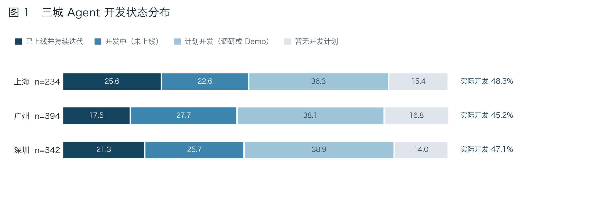

### 2. Agent 策略受阻的不是意愿，而是工程能力储备

上线率的差距普遍大于开发率的差距。上海的大型企业已上线率 45%，小微企业 16%；深圳则是 38% 和 17%。差异并不在是否愿意投入，而是是否具备持续演进 Agent 的工程能力，包括 Agent 的组织和协作、治理、优化和沉淀等。

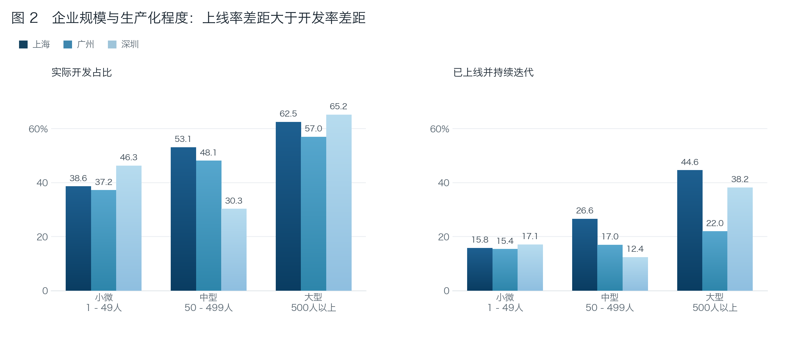

> 我们在白皮书架构篇《第 1 章　AI 原生应用的新阶段》引入了智能体 L1—L4 成熟度的分级。 L1 是辅助生成，L2 是受控自动化，L3 Agentic Execution 仅在部分场景成立，L4 Managed & Optimizing 尚属少数。白皮书构建、运行、治理、调优，本质上都在回答如何从 L2 演进到 L3、L4。

## 三、Agent 架构的选型分布

### 1. 新旧形态是共存，不是替代

以单 Agent 为主要架构的企业占 40%，开始引入多 Agent 为的企业有 42%，自主度是一个可调参数，混合形态会长期存在。这份数据支持白皮书在第 1 章与第 12 章提出的判断：Chat/RAG、Workflow、Copilot、Agent 与 Managed Agentic Application 在同一家企业内部往往同时存在，选择取决于任务的确定性程度与容错空间，而非技术新旧。此外，15%的企业把"人在回路"（Human-in-the-Loop，HITL，指关键步骤必须由人确认后才继续执行）作为 Agent 落地生产环境的架构原则，而非仅当作附加的审批开关。

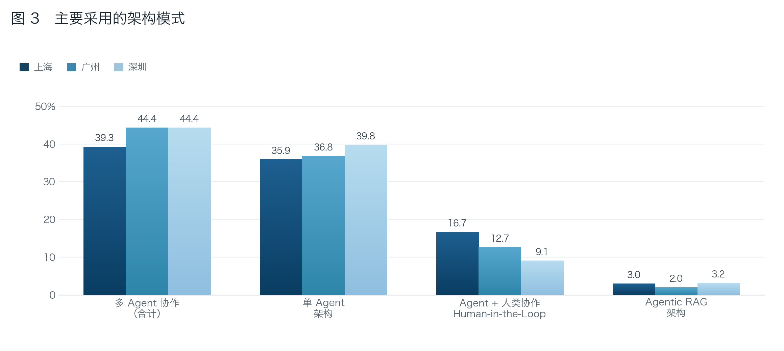

> 白皮书架构篇《第 1 章　AI 原生应用的新阶段》系统总结了当前阶段 Agent 的形态、特点和发展趋势。

### 2. 信息管理、任务治理、行动优化是 Agent 构建后的难点。

受访者反馈的最大痛点是状态与上下文在多 Agent 协作中衰减，占 60%。第二和第三大痛点分别是死锁雪崩与成本失控，本质也是调用链与状态缺乏约束的后果。被问到最希望补齐哪些能力时，两项诉求的比例更高：研发—测试闭环 65%、端侧与开源运行底座 73%。前者说明多 Agent 的验证成本已被感知为主要负担，后者说明企业对运行底座的自主可控有明确诉求。

**图 4　多 Agent 的主要挑战与最期待补齐的能力**

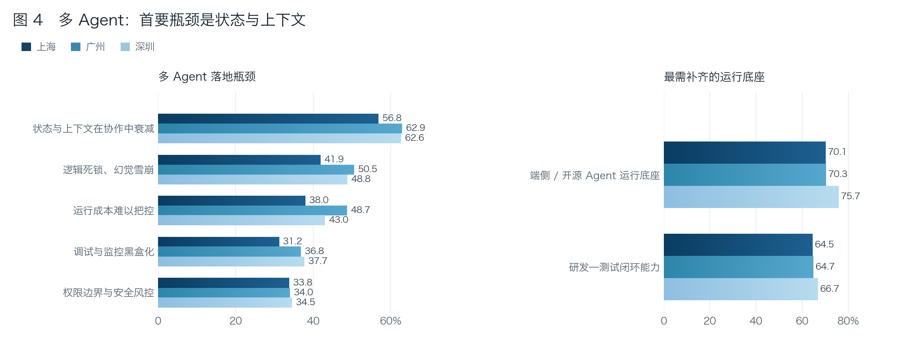

> 白皮书构建篇《第 4 章 任务：编排、长程推进与协作流转》、《第 5 章 信息：上下文、状态与可复用能力资产》、《第 6 章 行动：受控执行、验证反馈与交付准备》，并且运行篇中《第 8 章 Agent 状态存储与语义资产》，回应的都是这三大痛点。此外，端侧与开源底座的高诉求也解释了第 7、12 章讨论 Runtime、沙箱与部署拓扑的必要性。

## 四、优先落地场景与工具链渗透

### 1. 编码先行，但竞争激烈

AI Coding 是被验证的商业市场，企业采购 Claude Code、Codex、Cursor、Qoder 等 Coding 工具的企业占 57%，使用通用 Agent 框架的占 78%，还有近四成企业同时在用编程 Agent 与通用 Agent 框架。市场尚未形成寡头格局，供应商呈现碎片化，可迁移的工程抽象比押注某个厂商更有价值。当然，随着办公 Agent 的普及，编程 Agent 和通用 Agent 的边界越加模糊。

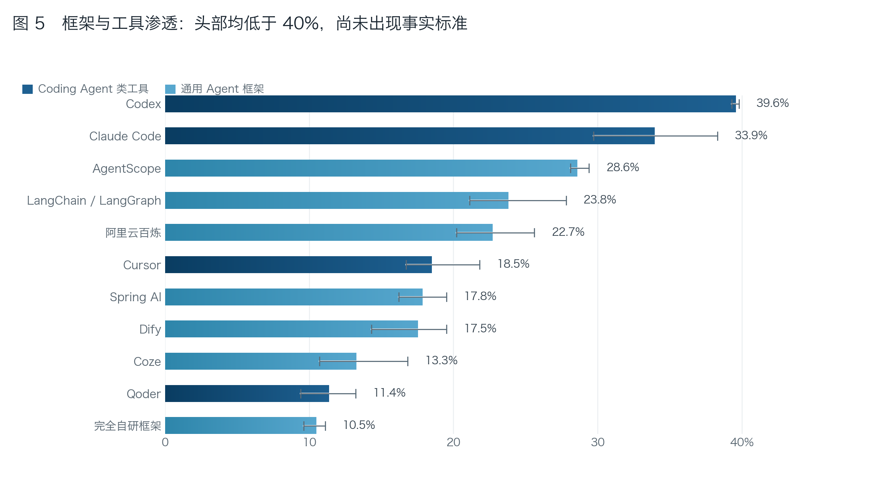

*   Coding 是目前唯一实现规模化落地的付费场景。原因不难理解：反馈信号明确（能否编译、测试是否通过）、环境边界清晰（代码仓库与工作区）、错误代价可控（可回滚）。这三项恰好是 Agent 稳定运行的前提条件。
    
*   还没有出现事实标准。前十位呈平缓下降而非陡峭长尾，多数企业仍在多框架并行试用。围绕单一框架构建企业内部标准的做法风险较高。
    
*   同时使用编程 Agent 和通用 Agent 的比例接近四成，说明能力正在互相渗透。从编程 Agent 沉淀出的工程范式，Skill 的组织方式、工作区隔离、工具调用的权限约束、上下文的分层加载，正在被迁移到企业的办公场景。
    

### 2. 优先落地容错空间大、能人工兜底的场景

在落地场景上，最广泛的是员工效能、代码工程、数据分析。将 Agent 引入企业核心业务流程的占比不到40%，比例明显略低。这一排序与第一章的上线率自洽：Agent 优先进入可人工兜底的场景，进入核心业务流程这些严肃场景，则需要更完整的治理配套。

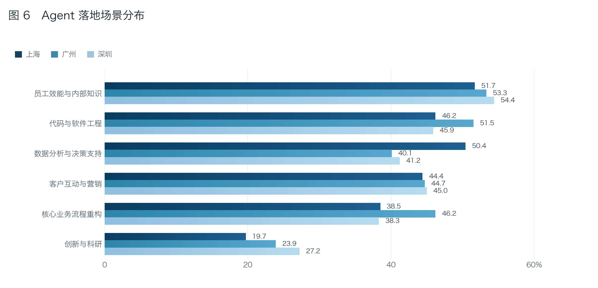

> 白皮书构建篇以 Harness 作为核心抽象，把 Skill、Memory、Knowledge、Tool 作为可组合能力分别成章，是为了给出一套不绑定具体框架的构建范式。在选型尚未收敛的市场条件下，可迁移的抽象比选定框架更具实际价值。

## 五、上下文、工具与协议层的能力瓶颈

### 1. 上下文的问题不在窗口大小，而在写入、淘汰与检索策略

在记忆与上下文、工具调研存在哪些痛点的调研中，表示无明显痛点的仅不到 10%。排在前两位的是检索不准（54%）与记忆更新与遗忘机制缺失（48%），都不是靠扩大上下文窗口能解决的问题；窗口限制只排第三。工具侧结构类似，工具过多、选择困难占比（52%），幻觉调用（50%），总的来看，工具的组织方式与描述质量，比工具数量更决定调用成功率。

> 白皮书运行篇《第 8 章　Agent 状态存储与语义资产》将讨论持久化、向量索引与检索，为记忆落地提供底座；治理篇《第 15 章　AI 资产的发现与管理》讨论如何对工具描述、版本与按需发现的组织方式。

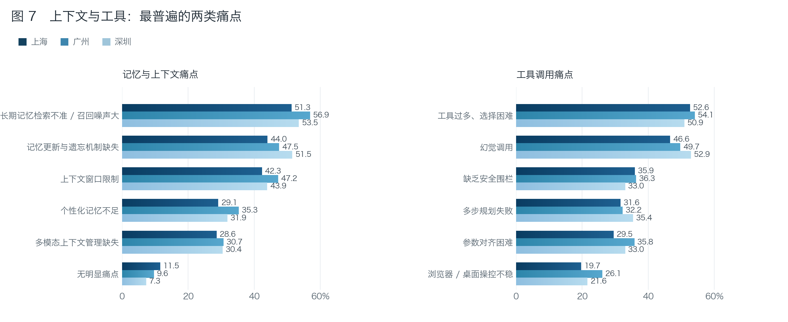

### 2. MCP 差的是企业级配套，不是协议理解

已经关注或已经落地 MCP 的企业合计 37%，而真正完成企业内私有部署的只有 9%。要在企业内真正跑起 MCP，需要私有注册中心、统一身份与鉴权、版本与灰度管理、审计留痕，以及与网关的集成，这些都不是协议规范本身提供的。同时有 28% 的受访者明确提出 MCP 服务管理与注册中心的需求，这一比例与已落地比例接近，说明需求正从认知转向工程实施。

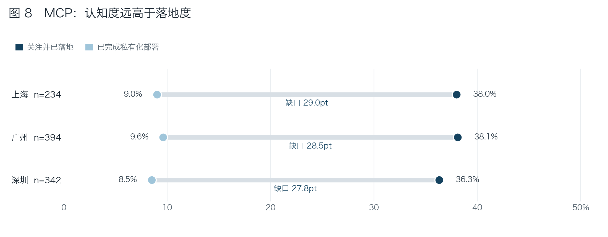

> 白皮书治理篇《第 15 章　AI 资产的发现与管理》给出 Agentic Resource Registry，把 Prompt、Skill、MCP Server、Agent 纳入统一注册、版本与按需发现。《第 9 章　AI 网关与统一流量治理》中将阐述 MCP 管控的落地实践。

## 六、运行底座与网关层的能力诉求

### 1. 多模型并用已是既定事实，需要一个统一入口承接

多模型路由与自动降级被 63% 的企业列为最需要的网关能力，是本次调研中比例最高的单项需求。不同任务匹配不同模型、主模型不可用时降级、按成本与延迟动态选择。这类需求无法在应用代码里逐个解决，需要一个统一的流量入口来承接。

### 2. 成本归因比合规更早成为观测重点

在可观测能力的诉求里，成本归因（50%）排位仅次于全链路追踪，高于审计合规与语义质量监控。多数企业 Token 用量还不算大，但已经在为成本的可见性与可分摊做准备。这更接近一种预防性诉求，在规模上来之前先建立成本的观测与约束能力，而不是等账单失控后再补。

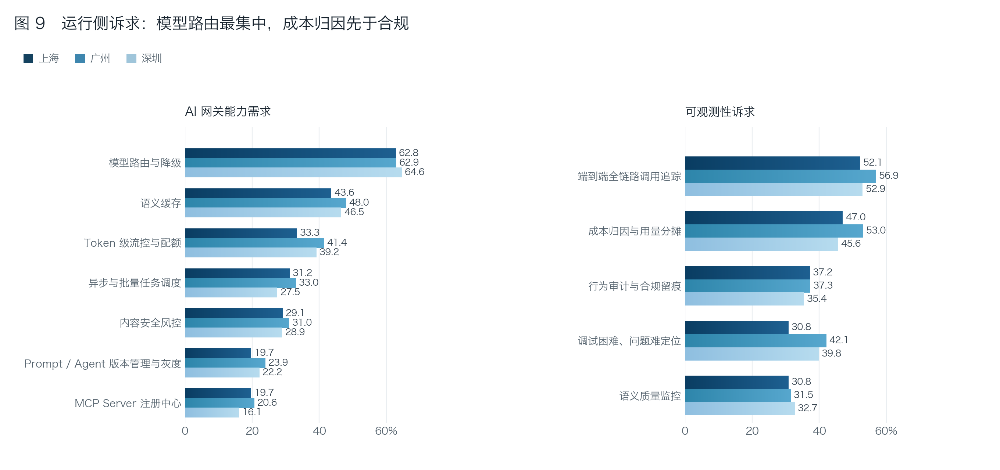

> 白皮书运行篇将 《Agent 运行时与沙箱》、《Agent 异步任务与自动化流程》、《Agent 分布式通信与消息治理》、《Agent 状态存储与语义资产》、《AI 网关与统一流量治理》分别成章，并组成了运行篇。其中把 AI 网关 从流量入口扩展为统一治理入口，集中承接工具注册与检索、参数校验、模型路由、熔断重试、链路追踪与成本标签，正是对这组需求的直接回应。

## 七、调优是智能体落地的重难点，但缺少高效的执行框架

### 1. 越来越多团队开始做 Agent 的评估，但普遍停留在人工抽查的阶段

被问到用什么方法评估 Agent 的效果时，人工抽查以 55% 稳居第一，而基于运行轨迹（Trajectory）自动评估的只有 6%，用公开 Benchmark 的只有不到 5%；另有 28% 还没有建立系统性的评估体系。把 LLM-as-Judge（用模型给模型的输出打分）、A/B 实验、离线数据集回归这三类常见评估手段里，用上其中任一种的企业为 34%。

评估目标不明确、基建不成熟的后果，体现在任务成功率上。Agent 任务成功率达到 90% 以上的企业仅约一成，70% 以上约 55%，而 16% 的受访者根本没有量化过成功率。这部分企业实际上无法判断自己的 Agent 是否在正常工作。

### 2. 评估能力是提升 Agent 生产可靠性的必经之路

使用了评估手段的企业中，任务成功率达 70% 以上，是没有评估体系的企业的约两倍；而在已上线并持续迭代的企业里，这一比例达 84%。三者是相互关联的：评估能力支撑迭代，迭代提升可靠性，可靠性才使持续进行评估成为可能。 反过来，缺乏评估的团队既无法定位问题，也无法证明改动有效，容易长期停在试点阶段。这与第一章"近一半在开发、仅约五分之一上线"的分布形成呼应。

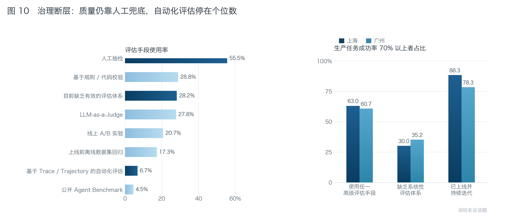

> 白皮书专门设置了调优篇，从模型调优和智能体调优详细阐述了完整的调优的方法论和相关实践。其中，智能体调优业内缺少相关标准，我们从轨迹数据、运行时数据处理、黄金数据集构建、基于 Badcase 的优化、受控自进化等。

## 八、总结：从可行性验证转向可靠性与成本

投入侧已经越过验证期，近一半受访企业在做 Agent，但只有约五分之一把 Agent 部署到生产环境，持续迭代的不到10%。卡点不是企业意愿，也不是模型能力，而是能优化 Harness 层开箱即用的工程配套。

在 Agent 形态上，呈现碎片化的现象。单 Agent 与多 Agent 体量接近，Hybrid 是长期状态，而不是过渡阶段。同样地，工具与框架选型也没有收敛，这意味着可迁移的抽象，比押注某个具体框架更有价值。

统一路由与成本治理、上下文与记忆的优化、不成熟的评估基建，

本白皮在设计目录的时候，参考了这份开发者调研报告，针对企业遇到的落地痛点，设计了相关章节。架构篇阐述了业内主流的 Agent 应用形态和构建范式，并给出了主流的设计架构，选型是基于成熟度与责任边界来定义。构建篇以 Harness 为核心抽象，给出不绑定框架的组合方式。运行篇设计了运行时与沙箱、分布式部署、AI 网关与统一流量治理、Agent 异步任务与自动化流程、Multi-Agent 协作与编排、Agent 分布式通信与消息治理，回应最集中的基础设施诉求。治理篇处理可观测与安全，把质量从人工兜底转为可规模化的机制；调优篇沿 Trace 到 Trajectory 的路径，让系统具备持续变好的能力。

调研报告中提出的问题，白皮书将尝试逐一给一些可落地的参考答案。


<a id="sec-003"></a>

# 架构篇


<a id="sec-004"></a>

## 架构篇导读
过去一年，AI 原生应用的构建起点发生了位移。模型不再只是被应用调用的生成引擎，而是能够维持任务状态、分解目标、调用工具并根据执行反馈调整行为的执行主体。Codex、Claude Code、Qoder 等 Coding Agent 率先在软件研发中验证了这种形态：它们不只给出代码建议，还读取代码仓库、维护任务计划、修改文件、运行终端与测试，并在长时间任务中持续接受人的引导。

模型获得更大的任务自主权，并不意味着模型本身即构成 Agent。任务越长、工具越多、环境影响越大，模型之外的工程系统就越关键。上下文组织、任务状态、工具控制、环境隔离、失败恢复、结果评估与风险约束共同构成 Harness，Agent 由 Model 与 Harness 共同构成。这一判断改变了架构对象：企业需要设计的不再是一次模型调用，而是一个跨越认知、状态、执行、控制与持续改进的完整系统。

架构篇处理生命周期五阶段中的第一个阶段。它给出判断与边界：采用什么应用形态、授予多大自主权、哪些能力自建、哪些由共享平台提供、什么结果构成完成。这些边界若推迟到构建阶段再确定，后续运行、治理与调优将出现混乱。

| 对应章节 | 主线 | 架描述 |
| --- | --- | --- |
| 第 1 章 | 应用构建范式 | 应用形态如何演进、Agentic Application 的定义与边界、企业成熟度如何判定。 |
| 第 2 章 | 建立架构 | 系统由什么组成、组件在哪里运行由谁负责、如何从决策走向运行并被改进。 |

第 1 章解决对象界定。应用形态不是一条简单的替代链，Workflow 与 Agent 将长期共存；Single-Agent 沿时间跨度扩展为 Long-Horizon Agent，沿协作结构扩展为 Multi-Agent，两者可独立采用，也可组合使用，但都不是所有应用必经的升级阶段。成熟度同样不由产品名称决定，判据是自主性能否与任务风险相匹配，并选择成本与风险可接受的最低充分架构。

第 2 章解决结构落位。三个视图互不推导：组件视图避免能力遗漏，平台视图避免责任混乱，生命周期视图避免把一次演示误判为可运营系统。同一个 State Store，在组件视图中是任务事实的持久化能力，在平台视图中属于数据与资源面，在生命周期视图中则是运行阶段产生、调优阶段被反复读取的证据来源。讨论任何能力时先确认其所处视图，是这套参考架构可用的前提。

两章构成前后依赖，建议顺序阅读。本篇需要带走的判断有两条：形态与成熟度不由产品名称决定；架构的目的不是把系统做大，而是为每一项被授予的自主性建立对等的执行、观测、安全与评估能力。


<a id="sec-005"></a>

## 第 1 章　AI 原生应用的新阶段
仅仅一年以前，企业构建 AI 应用的起点仍是“如何将大模型接入业务”：应用向模型发送提示词，通过检索增强生成（RAG）补充企业知识，使用工作流（Workflow）串联应用程序接口（API），再将生成结果交给人处理。在这一阶段，模型的主要价值是理解与生成，应用代码仍然掌握完整的执行路径。

过去一年，这一关系开始发生变化。模型不再只是被动调用的生成引擎，而是逐步成为能够维持任务状态、分解目标、调用工具、操作环境，并根据执行反馈调整行为的执行主体。以 Codex、Claude Code、Qoder 为代表的编程智能体（Coding Agent）率先在软件研发中验证了这种应用形态：它们不仅能够给出代码建议，还可以读取代码仓库、维护任务计划、修改文件、运行终端与测试，并在长时间任务中持续接受人的引导。

模型获得更大的任务自主权和环境操作权限，并不意味着模型可以独立构成 Agent。相反，任务越长、工具越多、环境影响越大，模型之外的工程系统就越重要。企业需要系统解决上下文组织、任务状态、工具控制、环境隔离、失败恢复、结果评估和风险约束等问题。这些能力共同构成 Harness，并在工程实现中进一步拆解为 Context、State、Memory、Tool、Skill、Runtime、Sandbox、Observability、Evaluation 和 Governance 等架构能力。

因此，新阶段的 AI 原生应用并不是能力更强的 Chatbot，而是一种新的软件执行形态：Model 负责理解、推理、生成与决策，Harness 负责组织、约束并承载执行，二者共同构成 Agent。本白皮书在讨论应用形态时使用 Agentic Application，强调 Agent 与业务逻辑、数据、工具、环境和用户交互结合，并交付可验证的业务结果。

本章沿两条相互关联的主线展开。第一，应用形态正在从 Chat/RAG、Workflow 和 Copilot 演进到 Agentic Application：其基础形态是由单个 Agent 完成有界任务的 Single-Agent，并可沿时间跨度与协作结构两个方向扩展为 Long-Horizon Agent 与 Multi-Agent。第二，形态演进不等于等级越高越好。企业需要使自主性与任务风险相匹配，并为每类任务选择成本与风险可接受的最低充分架构。前一条主线解释应用能力与系统复杂度如何演进，后一条主线回答企业应当在何处采用何种形态。

### 1.1 从生成内容到完成任务：AI 原生应用的生产拐点

#### 1.1.1 上一阶段的 AI 原生应用

上一阶段的 AI 原生应用主要呈现三个特征。

第一，应用以“请求—回答”为主要交互单元。即使加入 RAG、函数调用（Function Calling）或多轮对话，一次调用的边界通常仍较为明确，任务多在秒级或分钟级完成。

第二，执行路径主要由应用代码或 Workflow 预先确定。模型可以承担分类、参数生成或有限的工具选择，但通常不会持有完整的任务循环。

第三，模型的输出主要是内容，而不是外部环境中可验证的任务结果。回答是否流畅，可以通过人的阅读进行判断；但任务是否正确完成，则必须检查工具调用轨迹、文件变更、数据库状态、测试结果或其他环境事实。

这一阶段为 AI 进入企业业务奠定了重要基础。Chat/RAG 使企业知识能够通过自然语言访问，Workflow 使模型可以参与业务流程，Copilot 则通过人的实时判断弥补模型能力与可靠性的不足。但这些应用形态通常依赖两个前提：应用对任务路径具有较强的先验知识，或者人愿意在执行过程中持续参与决策和接管。

#### 1.1.2 Coding Agent 为什么构成拐点

Coding Agent 的价值不只在于软件研发本身是一个高价值场景，更在于它集中暴露了 Agentic Application 进入生产必须处理的大部分工程问题。

*   一是代码仓库的规模往往超过模型的单次上下文窗口，Agent 必须对信息进行检索、筛选、摘要与外置存储。
    
*   二是任务会跨越多个步骤和多次模型调用，Agent 必须维护计划、进度和待办事项。
    
*   三是工具调用会真实修改文件、运行命令或访问网络，系统必须提供权限控制、环境隔离和不可逆操作审批。
    
*   四是中间尝试可能失败，执行系统必须支持错误观测、重试、检查点和任务恢复。
    
*   五是任务结果不能只由模型自评，还需要通过测试、构建、静态检查、文件差异（Diff）或独立评估器进行验证。
    
*   六是人无法逐 Token 监督 Agent，需要在目标、计划、高风险动作和最终结果等关键节点提供引导（Steering）并实施人在回路（Human-in-the-loop）控制。
    

Anthropic 的长时任务实践将 Session、Harness 与 Sandbox 分离，使模型循环可以持续演进，同时保持任务事件、执行工具和隔离边界的稳定。OpenAI 的长时工作实践则强调 Durable Thread、可审阅的外部记忆、Skills、Steering 和人工复核。虽然具体实现有所不同，但二者指向了相同的工程结论：长任务并不是简单延长一段对话，而是需要将认知、状态、执行与控制分层，构成能够持续运行的系统。

#### 1.1.3 从专用场景走向通用架构

Coding Agent 是 Agentic Application 的重要验证场，但不是其应用边界。能够在工作区中读写文件、调用工具、维持状态、执行长任务并接受人类引导的 Agent，同样可以用于生成并验证研究报告、处理数据分析任务、执行企业 IT 操作、协调客服工单、维护知识库，或在高风险业务中为人提供可验证的执行草案。

这些场景处理的业务对象不同，但对架构能力的要求具有较强的共性，主要包括模型接入与路由、上下文管理、工具与协议、状态与工作区、沙箱与权限、长任务恢复、可观测与评估、安全治理和持续优化。当这些能力在不同应用中反复出现时，它们就会逐步从单一业务应用中抽离，沉淀为通用的 Harness 和 Agent Platform。

| 上一阶段的 AI 原生应用 | Agentic Application |
| --- | --- |
| 生成一次回答 | 交付一个可验证的任务结果 |
| 单轮或短会话 | 多步骤、有状态，并可扩展为长时与异步执行 |
| 主要由 Prompt 和 RAG 驱动 | 由 Model 与 Harness 共同驱动 |
| 应用代码调用模型 | Agent 在受控边界内使用工具并操作环境 |
| 以输入和输出评估质量 | 同时评估执行轨迹、环境状态和最终结果 |
| 开发完成后上线 | 在运行、治理和评估中持续演进 |

表 1-1 展示了上一阶段的 AI 原生应用与 Agentic Application 在架构重心上的变化

### 1.2 从 Chat/RAG 到 Agentic Application：应用形态的演进

#### 1.2.1 应用形态不是一条简单的替代链

随着 Agent 成为产业关注的重点，Chat/RAG、Workflow、Copilot、Single-Agent、Long-Horizon Agent 与 Multi-Agent 容易被理解为一条线性的产品代际演进链，仿佛后一种形态必然取代前一种形态。这种认识忽视了不同任务对确定性、自主性、持续时间、协作结构和风险控制的差异，容易误导企业的技术选型。

这些形态的根本区别，不在于界面是否采用对话方式，而在于任务循环由谁掌握、执行路径在什么阶段确定、系统能够在多大程度上影响外部环境，以及任务是否需要跨会话持续运行或由多个 Agent 分工协作。需要说明的是，Single-Agent、Long-Horizon Agent 与 Multi-Agent 都属于 Agentic Application：Single-Agent 是其基础形态，其中的“单”既指由单个 Agent 持有任务循环，也指任务在明确边界内闭环；Long-Horizon Agent 和 Multi-Agent 则分别沿时间跨度与协作结构两个方向扩展，可以独立采用，也可以在同一应用中组合，并不构成所有 Agentic Application 必须经历的升级阶段。

| 应用形态 | 主要价值 | 任务路径 | 状态与执行跨度 | 人的角色 | 典型适用条件 |
| --- | --- | --- | --- | --- | --- |
| Chat/RAG | 理解、生成与知识访问 | 由应用预先确定 | 单轮或短会话 | 提问、阅读和判断 | 结果主要是内容，不直接改变外部系统 |
| Workflow | 可重复的流程自动化 | 设计时预定，运行时仅有局部分支 | 步骤有限，状态结构明确 | 设计和审批流程 | 任务稳定、路径可穷举、错误代价较高 |
| Copilot | 提升人在回路的工作效率 | 由人持续决定目标和下一步 | 可以跨多轮，但任务控制权在人 | 驾驶、验收并对结果负责 | 专业判断难以完全自动化，但局部工作可以委托 |
| Single-Agent | 由单个 Agent 围绕目标动态完成有界任务 | 由 Agent 在运行时决定部分或大部分路径 | 多步骤、有状态，任务边界明确，通常在一次任务或一个会话内闭环 | 定义目标、约束和关键审批点，验收任务结果 | 路径难以预知，环境可以提供反馈，结果可以验证，且任务能够在有界时间内完成 |
| Long-Horizon Agent & Multi-Agent | Long-Horizon Agent 持续推进长任务；Multi-Agent 通过分工协作完成复杂目标 | 前者根据长期执行反馈动态调整，后者由多个 Agent 通过编排、移交或评审共同决定 | 前者跨会话、跨进程并支持暂停与恢复；后者维护多个角色及其任务状态 | 为长程任务设置检查点与例外处理机制，或为多个 Agent 设定角色、权限和协作边界 | 单个 Agent 受到时间跨度或角色复杂度限制，且引入长程执行或多 Agent 协作的收益能够覆盖新增复杂度；二者可以独立采用或组合使用 |

表 1-2　不同 AI 应用形态的主要差异

#### 1.2.2 Workflow 与 Agent 将长期共存

Workflow 的优势是确定性强、易测试、易审计；Agent 的优势是在路径无法穷举时，根据环境反馈进行动态决策。一个企业流程往往同时包含这两类问题。例如，资格校验、账务入账和交易审批适合采用确定性流程；材料理解、异常调查、方案生成和动态工具选择则更适合由 Agent 处理。

因此，企业级应用的主流形态不会是“将所有步骤都交给 Agent”，而是 Workflow 与 Agent 相结合的混合形态（Hybrid）。具体而言，可以在业务 Workflow 中嵌入 Agent，将不确定性限制在清晰的边界内；也可以由 Agent 调用经过测试的 Workflow 或 Skill，将成熟做法从重复推理中抽离。对于低风险、可逆的操作，系统可以赋予 Agent 较高的自主性；对于高风险、不可逆的操作，则需要增加确定性检查和人工审批。

Google 对 Agent 设计模式的总结将顺序执行、并行执行、协调器、层级分解、评审与改进等模式并列，并强调延迟、成本、共享状态和失败传播之间的权衡。这说明，自主性与任务风险相匹配这一原则并不是某个局部控制项，而是贯穿应用形态选择与架构设计的决策原则。它既决定单个任务采用 Workflow、Single-Agent 还是 Hybrid，也决定是否需要将执行跨度扩展为 Long-Horizon Agent，或将协作结构扩展为 Multi-Agent。只有当任务价值、风险和复杂度足以支撑相应的工程成本时，这些扩展才具有必要性。

#### 1.2.3 从单智能体到长程智能体与多智能体

当 Single-Agent 从有界任务走向跨会话的持续执行，系统面对的问题会发生变化。模型上下文不能再作为任务事实的唯一载体，进程持续存活也不能成为任务连续性的前提。系统需要通过持久状态、检查点、任务调度、失败恢复和可审阅的外部记忆，使 Agent 能够在上下文压缩、模型切换、人工暂停或执行中断后继续工作。这一扩展形成 Long-Horizon Agent，其核心不是“运行得更久”，而是在更长时间尺度上保持目标、状态、责任和结果的一致性。

当任务跨越多个专业角色、工具权限或组织边界时，将所有能力集中在单个 Agent 中可能带来上下文膨胀、职责冲突、权限过宽和故障定位困难。Multi-Agent 通过顺序、并行、协调器、层级分解、移交或评审等机制，使不同 Agent 在明确的角色和权限边界内协作。其价值不在于增加模型调用数量，而在于让任务分工、上下文隔离、专业能力和相互校验成为可设计的系统结构。

Long-Horizon Agent 与 Multi-Agent 不是同一维度。前者解决任务如何跨时间持续，后者解决多个执行主体如何协作。单个 Agent 可以执行长任务，Multi-Agent 系统也可以只完成短时任务；在研究、研发、运维或复杂业务流程中，二者也可以组合使用。无论采用哪种形态，系统都需要相应增加 Runtime、Sandbox、Observability、Evaluation 和 Governance 能力，并评估额外的延迟、成本、共享状态、失败传播和责任边界。更复杂的形态只有在解决了单 Agent 无法以合理成本可靠完成的问题时才是合理选择。

### 1.3 Agentic Application 的定义、边界与核心特征

#### 1.3.1 定义

本白皮书将 Agentic Application 定义为：

> _Agentic Application 是 Agent 在应用形态层的完整表达：它以 Model 与 Harness 共同构成的执行主体为核心，与业务逻辑、数据、工具、环境和用户交互相结合，能够围绕业务目标维护上下文与状态、动态规划步骤、采取行动，并在确定性边界内交付可验证的任务结果。_

以下面的非形式化公式作为理解 Agent 架构的基础：

> _Agent = Model + Harness_

这一公式首先强调责任边界。Model 提供理解、推理、生成与决策能力，但模型本身不能独立承担上下文准备、任务状态维护、工具执行、权限控制、故障恢复和结果验证。Harness 是模型之外用于组织、约束并承载模型驱动任务执行的工程系统。只有二者结合，模型能力才能转化为可持续执行的 Agent。

这一公式不是完整的组件清单，也不意味着 Harness 是不可拆分的黑盒。为了突出模型之外工程系统的重要性，本白皮书在抽象层使用广义 Harness；在工程落地中，则将其进一步拆解为 Agent Loop；Context、State 与 Memory；Tool、Skill 与 Protocol；Runtime 与 Sandbox；Observability 与 Evaluation；以及 Security 与 Governance 等能力。不同产品可以采用不同的组件边界和实现方式，但都需要回答这些能力由谁提供、如何协同，以及如何形成模型不能自行绕过的确定性约束。

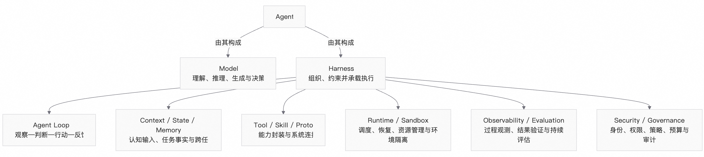

图 1-1　从 Agent 基础公式到工程架构拆解

图 1-1 表达的是从抽象共识到工程实现的两层关系：在概念层，Agent 由 Model 与 Harness 构成；在实现层，Harness 被拆解为一组彼此协同的架构能力。在应用形态层，Agentic Application 强调将这一执行主体放入具体业务边界，使其连接业务逻辑、数据、工具、环境和用户交互。后续章节将围绕这些能力说明架构如何设计，以及应用如何构建、运行、治理和调优。

#### 1.3.2 六个判定特征

一个应用是否进入 Agentic 阶段，可以通过以下六个特征进行判断。

第一，以目标和任务结果为中心。 用户提供的不再只是一个待回答的问题，而是需要完成的任务和可验收的结果。

第二，在运行时决定部分执行路径。 系统能够根据中间结果、工具返回和环境状态调整后续行为，而不是只执行一条完全预编排的路径。

第三，能够对外部环境产生作用。 Agent 可以调用 API、检索数据、修改文件、运行代码、操作浏览器，或将任务委派给另一个 Agent。

第四，维持跨步骤、跨请求的任务状态。 任务状态不只存在于一次模型上下文中；当任务需要更长时间运行时，还可以暂停、恢复、重试或转交给另一个执行实例。

第五，自主行为受到确定性机制约束。 权限、沙箱、预算、中间件、结构化输出、人工审批和失败处理共同构成模型不能自行绕过的工程边界。

第六，通过可观测与评估持续改进。 系统不仅保存最终输出，还记录执行轨迹、工具调用、状态变化、资源消耗和人工反馈，使新版本能够经过回归、灰度和审批后进入生产。

这六项特征是判断应用架构形态的依据，而不是必须同时启用的功能清单。Agentic Application 不需要在所有任务中采用最高自主性，也不必默认采用 Long-Horizon Agent 或 Multi-Agent，但应当具备在受控边界内将业务目标转化为执行过程的能力。

#### 1.3.3 概念边界

为避免将 Model、Agent、Harness、Single-Agent、Long-Horizon Agent、Multi-Agent、完整应用和共享平台混为一谈，本白皮书对相关概念作如下界定。

| 概念 | 在本白皮书中的含义 | 不等同于 |
| --- | --- | --- |
| Model | 提供语言理解、推理、多模态、生成和工具调用决策能力的概率性认知核心 | 完整 Agent 或完整应用 |
| Agent | 由 Model 与 Harness 共同构成，能够围绕目标观察、判断、行动并接受反馈的执行主体；其在应用形态层的完整表达为 Agentic Application | 任意使用模型的软件，或单独的模型调用 |
| Harness | 模型之外，用于组织、约束并承载模型驱动任务执行的工程系统；在落地时可拆解为上下文、状态、能力调用、运行、隔离、观测、评估和治理等机制 | 单一 Prompt、简单 Agent Loop，或某个具体 Agent 框架 |
| Single-Agent | 由单个 Agent 持有任务循环、在明确任务边界内完成有界任务的基础形态 | 需要跨会话持续执行的单个 Agent 应用（属 Long-Horizon Agent），或只调用一次模型、不具备工具与状态能力的对话应用 |
| Long-Horizon Agent | 能够跨多轮、跨会话或跨进程持续执行任务，并通过持久状态、检查点、恢复和人工引导维持任务连续性的 Agent | 单纯扩大上下文窗口，或一次持续时间较长的模型调用 |
| Multi-Agent | 多个具有不同角色、能力或权限边界的 Agent，通过明确的编排、通信、移交或评审机制共同完成任务的系统形态 | 简单并发调用多个模型，或将同一任务机械拆成多个提示词 |
| Agentic Application | Agent 在应用形态层的完整表达，强调其与业务逻辑、数据、工具、环境和用户交互结合并交付业务价值；在形态谱系上涵盖 Single-Agent、Long-Horizon Agent 与 Multi-Agent | 单一模型调用、SDK、Agent 框架或共享平台 |
| Agent Platform | 为 Agentic Application 提供共享设计、构建、运行、治理和优化能力的企业平台 | 单个业务 Agent 或具体 Agentic Application |

表 1-3　Agentic Application 相关概念及其边界

其中有三个边界尤其重要。

首先，Agent 不等于 Agent 框架。本白皮书将 Agentic Application 作为 Agent 在应用形态层的完整表达，二者并非前后递进的两种形态。Agent 框架可以提供 Agent Loop、Tool、Memory 等开发抽象，但框架本身不会自动形成能够围绕目标持续执行、连接业务环境并交付可验证结果的 Agent。企业仍需结合具体场景完成上下文组织、状态管理、工具接入、权限约束、运行保障和结果评估。

其次，Long-Horizon Agent 与 Multi-Agent 不代表天然更高的智能或成熟度。长程执行会增加状态漂移、失败恢复和成本控制难度；多智能体协作会增加通信开销，并带来共享状态、失败传播和责任划分方面的问题。企业应先验证边界明确的 Single-Agent 应用，只有在单个 Agent 受到时间跨度、上下文容量、职责冲突、权限隔离或并行效率限制时，才引入相应的长程或多智能体结构。

最后，应用形态不等于平台形态。Single-Agent、Long-Horizon Agent 与 Multi-Agent 描述任务如何执行，以及执行主体如何跨时间持续或相互协作；Agent Platform 则为多个应用提供共享的构建、运行、治理和调优能力。同一种应用形态既可以依托统一平台运行，也可以采用独立的工程实现；即使平台能力更完整，也不意味着具体应用必须采用长程或多智能体结构。

### 1.4 从可演示到可运营：企业成熟度与升级判断

#### 1.4.1 成熟度不由产品名称决定

一个产品即使名称中包含 Agent，也可能只能完成单轮生成；另一个以 Workflow 为核心的系统，则可能已经具备持久状态、权限控制、可观测和持续评估等能力。因此，Agentic Application 的成熟度不能由产品名称或技术标签决定，而应从任务循环、执行跨度、环境影响和生产治理四个维度进行综合判断。

本白皮书将 Agentic Application 的企业成熟度划分为四个级别。该模型是本白皮书基于应用架构维度提出的分析框架，用于判断单个应用的能力形态，不等同于以战略、组织、流程和文化为对象的企业 AI 采纳成熟度模型。

| 成熟度 | 典型应用与运行状态 | 核心能力 | 典型局限 | 升级门槛 |
| --- | --- | --- | --- | --- |
| L1 辅助生成 | Chat、RAG、基础 Copilot | 内容生成、知识检索、简单工具调用 | 任务闭环由人完成，系统很少维护执行状态 | 建立可复用的 Prompt、知识和基础评测 |
| L2 受控自动化 | Workflow、在 Workflow 中局部使用 Agent | 预定流程、结构化输出、局部动态决策、审批 | 对未知路径和异常情况的适应性有限 | 明确自主边界，引入 Harness、工具策略和轨迹评估 |
| L3 Agentic Execution | 由 Agent 持有任务循环的 Agentic Application（Single-Agent、Long-Horizon Agent 或 Multi-Agent 均可）、Hybrid | 动态规划、工具与环境操作、多步骤任务、持久状态、故障恢复 | 容易在成本、权限、失败放大和版本漂移等方面遇到生产问题 | 建立 Runtime、Sandbox、Observability、Security 和 Evaluation |
| L4 规模运营与持续优化 | 已实现规模化运行、统一治理和持续优化的 Agentic Application | 多任务与多租户运行、策略控制、可观测、安全、离线与在线评估、灰度和持续优化 | 体系复杂，需要平台、组织和治理能力共同演进 | 通过共享平台、组织知识、标准和自动化降低治理成本 |

表 1-4　Agentic Application 企业成熟度模型

L4 描述的是应用规模化运行、统一治理和持续优化的能力水平，而不是一种新的应用形态。Agent Platform 可以为多个应用提供共享的设计、构建、运行、治理和调优能力；企业进入 L4 时，通常需要同时补齐具体应用、共享平台和组织治理三方面的能力。需要区分的是，Single-Agent、Long-Horizon Agent 与 Multi-Agent 都可以处于 L3 或 L4：采用哪种形态取决于任务结构，而处于哪个成熟度取决于运行与治理能力的完备程度。

这四个级别描述了企业应用从辅助生成、受控自动化和自主执行，进一步走向规模化运行与持续优化的能力演进。它们并不意味着每个应用都必须依次升级：低风险的知识助手可以长期停留在 L1，交易审批系统可以选择 L2，以确定性 Workflow 保持核心路径；研发、运维、研究和复杂客服等路径难以预知的场景，可能进入 L3；当应用进入规模化运行，并涉及多任务并发、共享资源、企业数据、多租户或高影响操作时，则需要补齐 L4 所要求的运行与治理能力。

因此，企业应当结合任务价值、风险、运行规模和工程成本，为每类任务选择成本与风险可接受的最低充分架构。这是贯穿本章的决策原则。成熟度模型一方面用于识别应用当前具备的能力，以及进入更高成熟度仍需补齐的运行、治理和优化条件；另一方面也为升级判断提供参照：只有在当前架构无法以可接受的风险和成本交付任务，而新增能力具有明确价值时，升级才有必要。

#### 1.4.2 从成熟度走向架构决策

当企业将一个 AI 应用从演示推向生产时，架构设计应当先于具体构建。架构设计不是在组件清单中选择尽可能多的能力，而是根据任务目标、风险、执行跨度、协作边界和运行规模，对参考架构进行裁剪，并确定 Model 与 Harness、确定性流程与自主决策、Single-Agent 与 Multi-Agent、人与系统之间的责任边界。在这一前置决策之后，企业需要依次回答以下五个相互衔接的问题。

*   如何设计架构？ 应采用 Workflow、Single-Agent 还是 Hybrid？是否确有必要使用 Long-Horizon Agent 或 Multi-Agent？任务边界、自主程度、人机协作方式、Agent 分工、确定性控制点和参考架构的裁剪原则应如何确定？
    
*   如何构建？ Model、Agent Loop、Context、State、Memory、Tool、Skill 和 Protocol 应当如何组合？业务逻辑中哪些部分由 Agent 动态决策，哪些部分应固化为 Workflow、规则或可复用 Skill？
    
*   如何运行？ 任务如何调度，状态如何持久化，工具在哪种环境中执行，失败后如何恢复，不同任务和租户之间如何隔离？
    
*   如何治理？ Agent 由谁负责，能以什么身份访问哪些资源，哪些操作必须审批，如何进行观测、审计和异常处置？
    
*   如何调优？ 如何判断任务结果的质量，如何从 Trace 和反馈中定位问题，如何调整 Model、Prompt、Context、Skill 或 Harness，并通过回归、仿真和灰度验证新版本，在效果不达预期时及时回滚？
    

这五个问题共同构成企业级 Agentic Application 的主要架构问题。架构设计是构建、运行、治理和调优的前置决策，后四者则形成持续迭代的工程闭环。下一章将给出 Agentic Application 的完整参考架构，说明如何以 Agent = Model + Harness 为基础拆解工程能力，并为后续构建、运行、治理和调优提供统一地图。

#### 1.4.3 从管理软件到管理 Agent：引入操作系统视角

前两节回答了企业如何判断成熟度，以及如何在构建之前完成架构决策。但当多个 Agentic Application 进入生产、在同一批机器上长期并发运行时，会浮现一个被 Harness 与 Agent Platform 讨论所掩盖的问题：谁来承载并约束这些 Agent 的运行。这与操作系统当年要解决的问题同形——多个互不信任的程序共享硬件，必须被统一调度、隔离、计量与审计。今天 Agent 成为新的被运行对象，而承载它们的这批公共职责，尚未收敛为一个清晰的层次。

经典操作系统的抽象建立在一个前提之上：程序的执行路径由开发者在编写时确定，因而可预知、可复现、可静态审查。进程是执行单元，文件与内存是状态，系统调用是能力，用户与权限位是授权。正因为路径是确定的，权限可以在进程创建时一次授予、越权即拒；故障恢复可以以进程为单位、退出即回收；审计可以以系统调用为粒度，事后即可还原谁做了什么。

如 1.3.2 的第二个特征所述，Agentic Application 的部分执行路径由模型在运行时决定，这动摇了上述几乎每一个前提。管理职责的名字没有变——仍然是调度、隔离、资源、授权、恢复、审计——但每一项的假设都被改写了。

| 管理维度 | 传统软件（确定性程序） | Agentic Application（运行时决定部分路径） |
| --- | --- | --- |
| 执行单元 | 进程或线程，路径在编写时确定 | 任务运行实例（Run），路径在运行时决定，可跨进程与副本 |
| 状态 | 随进程内存存活，进程退出即释放 | 外置、持久、可恢复，独立于承载实例 |
| 能力接口 | 启动时确定的系统调用与设备 | 运行时动态接入的工具与 MCP 端点 |
| 授权 | 创建时一次性授予，越权即拒 | 每次高影响操作按策略强制判定，且需可撤销 |
| 故障恢复 | 以进程为单位，退出即回收 | 以任务为单位，需检查点、幂等与跨系统补偿 |
| 审计 | 系统调用与文件访问粒度 | 意图、工具调用、环境反馈与结果的关联链路 |

表 1-5　传统软件与 Agentic Application 在管理假设上的差异

其中两点尤其关键。授权不能只在启动时授予，而要在每次高影响操作时按策略强制判定；并且模型可能尝试绕过，边界必须是它无法自行跨越的（见 1.3.2 第五个特征）。恢复也不能只看承载进程是否存活：一个 Run 可能已经挂起等待审批，且已经向外部系统发出副作用，重启并不等于正确恢复（见 1.3.2 第四个特征）。

这些职责正在从单个应用中反复浮现。1.1.3 已经指出，模型接入与路由、上下文管理、工具与协议、状态与工作区、沙箱与权限、长任务恢复、可观测与评估、安全治理和持续优化等能力会在不同应用中反复出现，并逐步从单一业务应用中抽离，沉淀为通用的 Harness 和 Agent Platform。从操作系统视角还可以再进一步：其中一部分并不属于某个 Harness，而属于所有 Agent 共享的承载与治理层。Harness 决定任务在什么上下文、用什么能力、按什么循环执行，承载的是任务语义，因业务而异，不宜下沉；而沙箱的轻量创建与回收、高影响操作在哪里被强制拦截、跨会话记忆与工作区快照、预算与授权如何随子任务派生又能一次性撤销，这类会被多个 Agent 重复实现、且更适合由被约束方之外保证的职责，才是应当收敛的部分。

因此，在 Harness 与硬件之间正浮现一个尚无清晰名字的层次：它不持有任务语义，却为所有 Agent 提供公共的运行对象、能力接入、可强制的边界与统一的证据来源。本书第 22 章称之为 Agentic OS。

这里只给出一个判断：当企业从运行一个 Agent 走向规模化运营多个 Agent 与长任务，即进入 1.4.1 所述的 L4 规模运营与持续优化，缺了这一层，每个应用都被迫各自重造调度、隔离、授权与审计，既重复，也难以相互信任。

有人会问，云平台与 Kubernetes 不是早已提供这些能力。区别在于它们管理的是 Pod 而不是 Run：重启一个探针失败的容器，不等于正确恢复一个已经发出副作用的任务；它们把基础设施调和到一份声明式描述，却不判断任务是否真正且安全地完成。因此云与 Kubernetes 是这一层的底座，而不是它的替代；缺的是把容器、配额与身份访问管理（IAM）翻译成 Run、预算租约与操作记录的 Agent 原生抽象。

这也对应 1.4.2 提出的五个架构问题：如何设计架构与如何构建，主要关乎形态选择与 Harness 的能力组合；如何运行、如何治理、如何调优，则大量落在这一公共层上。第 2 章先给出完整参考架构，第 22 章再回到这一层次，讨论它的雏形、边界与仍然开放的问题。

### 1.5 本章小结

AI 原生应用正在从将模型接入软件进入让 Agent 在受控系统中完成任务的新阶段。Coding Agent 率先验证了多步骤、有状态、能够操作环境的模型系统可以产生真实生产力，其背后的 Harness、Context、State、Memory、Runtime、Sandbox、Observability 和 Evaluation 等工程实践，正在逐步扩展到更多任务和行业。

本章以 Agent = Model + Harness 作为理解 Agent 架构的基础。该公式强调，模型能力只有与组织、约束并承载执行的工程系统结合，才能形成 Agent；在具体落地中，广义 Harness 还需要进一步拆解为 Agent Loop；Context、State 与 Memory；Tool、Skill 与 Protocol；Runtime 与 Sandbox；Observability 与 Evaluation；以及 Security 与 Governance 等架构能力。在应用形态层，本白皮书使用 Agentic Application 强调 Agent 与业务逻辑、数据、工具、环境和用户交互的结合，以及对可验证业务结果的交付。

在应用形态上，Agentic Application 以 Single-Agent 为基础形态，并可以沿两个方向继续扩展：Long-Horizon Agent 将任务从有界执行延伸到跨会话、可暂停和可恢复的持续执行；Multi-Agent 将单一执行主体扩展为具有角色、能力和权限分工的协作系统。三者都属于 Agentic Application，后两者可以独立采用，也可以组合使用，但都不是所有应用必须经历的升级阶段。应用采用何种形态，与其能否被规模化运行、统一治理和持续优化，是两个需要分别判断的问题。

本章同时强调，自主程度必须与任务风险相匹配，企业应当选择能够满足任务目标且成本与风险可接受的最低充分架构。架构设计需要先于构建，并为后续运行、治理和调优确定边界。只有当更复杂的形态和更高成熟度能够解决当前场景的实际问题时，架构演进才具有业务与工程上的必要性。

最后我们还引入了一个视角上的转换：当多个 Agent 长期并发运行，调度、隔离、授权、恢复与审计这些经典的操作系统职责会重新出现，但其假设已被运行时生成的执行路径改写，对于这类不归属任何单个 Harness 的公共职责，我们会在 Agentic OS 一章中详细展开。


<a id="sec-006"></a>

## 第 2 章　Agentic Application 参考架构
在上一章中，我们将 Agentic Application 定义为 Agent 在应用形态层的完整表达，并将 Agent 拆解为 Model 与 Harness 两个部分。模型是认知核心，但可靠性不能寄托于模型本身；Agent 需要获得一定的任务自主权，同时必须由确定性系统来约束其能力、环境和影响范围。这一判断直接改变了架构对象：企业需要设计的不再仅是一次模型调用，而是一个跨越认知、状态、执行、控制和持续改进的完整系统。

架构设计的难点不在于罗列尽可能多的组件，而在于划分责任边界。Model 与 Harness 的边界不清，会让模型升级变成应用重构；组织任务循环的编排逻辑与承载任务的 Runtime 不分，会让任务语义与基础设施强绑定；Context 与 State 不分，会将不完整的对话历史误当成可恢复的任务事实；沙箱、权限和工具描述混在一起，则会将模型知道某个工具误解为模型有权执行某个操作。这四类边界问题在演示阶段通常不会暴露，却会在任务变长、工具变多和租户变多之后集中出现。

本章节给出一套厂商中立的 Agentic Application 企业级参考架构。它不要求每个应用都建设全部组件，而是为先识别业务与应用约束，再确定 Agent 的构建与编排方式、生产运行条件、治理控制要求和调优闭环，从而形成与任务风险相匹配的最低充分架构。

第 1 章提供应用形态和核心概念，本章把这些概念落实到责任域、组件关系、平台边界和生命周期决策，并为后续的构建、运行、治理与调优四篇建立统一坐标系。

### 2.1 架构全景

#### 2.1.1 用三个视图理解同一套系统

对 Agentic Application 进行架构设计时，需要同时使用三个互相正交的视图，它们描述的是同一套系统的不同侧面，而不是三套可以互相替代的架构。

组件视图回答：系统由什么组成。

它关注 Model、Harness 编排层、Context、State、Memory、Knowledge、Skill、Tool、Runtime、Sandbox、Gateway、Observability、Evaluation 和 Security 等能力，以及它们之间的调用与依赖关系。组件视图的价值是避免能力遗漏，尤其是避免把上下文管理、状态持久化和结果验证当成实现细节。

平台视图回答：这些组件在哪里运行，由谁负责。

它把企业系统划分为执行面、数据与资源面以及控制面，并解释 Gateway、身份、租户、策略和可观测如何联动。平台视图的价值是避免责任混乱：同一个能力可能由应用团队实现，也可能由共享平台提供，二者的成本、扩展性和治理强度并不相同。

生命周期视图回答：系统如何从架构决策走向运行，并在运行中被治理和改进。

它将架构决策、版本、任务、Trace、Policy、Dataset、Evaluator 和 Patch 组织成架构设计、构建、运行、治理、调优的闭环。生命周期视图的价值是避免把一次性的 Agent 演示误当成可持续运营的企业系统。

三个视图不能互相推导。组件齐全并不意味着责任清晰，责任清晰也不意味着变更可控。因此，在讨论某个能力时，需要明确当前处于哪个视图：同一个 State Store，在组件视图中是任务事实的持久化能力，在平台视图中属于数据与资源面，在生命周期视图中则是运行阶段产生、调优阶段被反复读取的证据来源。

#### 2.1.2 五个能力责任域

图 2-1 从组件视图展示参考架构的五个能力责任域。图中粗实线表示从业务目标到任务执行的主要关系，域内细实线表示组件之间的调用与读写，虚线表示版本、身份、策略、观测、评估和变更证据等横向作用。这里的“层”用于组织架构责任，不表示严格的调用栈或建设顺序。图中缩写包括大型语言模型（Large Language Model，LLM）、应用程序编程接口（Application Programming Interface，API）、模型上下文协议（Model Context Protocol，MCP）和智能体间协议（Agent-to-Agent，A2A）。

图 2-1　Agentic Application 企业级参考架构（组件视图）



业务与应用层

定义用户、业务目标、交互方式、任务组织形态和验收条件。一个 Agentic Application 可以由对话触发，也可以由 API、消息、定时器或业务事件触发；任务可以由 Single-Agent 承担，也可以因跨时间持续执行形成 Long-Horizon Agent，或因角色分工与协作形成 Multi-Agent，还可以与 Workflow 组合为 Hybrid。这些名称分别描述执行主体、时间跨度和组合方式，并非互斥的同一分类维度。该层不实现通用 Agent 能力，而是明确系统为什么存在、需要完成什么，以及什么结果可以被业务接受。

Agent 构建与编排层

将 Model、Harness 编排逻辑、Context 策略、Memory、Knowledge、Skill，以及 Tool、Protocol 和 Connector 的能力定义组合成能够观察、判断、行动并接受反馈的任务循环。这里的“构建”不是一次性的开发活动：被构建出的编排逻辑会在每次任务运行时持续工作。外部系统、浏览器、Shell 和代码执行环境不属于这一层；本层只描述和绑定可用能力，实际执行及影响范围由生产运行层承载。

生产运行层

承载跨时间、跨请求的任务，提供调度、状态持久化、工作区、隔离、恢复、流量治理和资源管理。治理与控制层定义谁可以发布、运行和修改 Agent，哪些资源可以被访问，版本如何流转，以及策略如何下发、执行和审计。前者回答任务能否稳定执行，后者回答哪些版本和动作被允许发生。治理判定点可以分布在 Harness、Gateway、Runtime 与 Sandbox 的请求路径上，但策略、版本和审计语义需要集中管理。

治理和控制层

调优层

从运行中获得 Trace、Metric、Log、成本、结果和反馈，通过评估、安全分析、仿真和实验定位问题，形成候选变更与验证证据。调优层不直接修改生产中的 Agent；变更必须回到 Agent 构建与编排层形成新版本，并经过治理与控制层的准入门禁后再进入生产运行层。Trace、Metric 与 Log 的采集发生在运行路径上，指标口径、评估基线和准入阈值则由治理与调优责任共同定义。

其中，Security 不是只属于调优层的单一组件，而是横跨五层的架构责任：业务层确定风险与验收边界，构建层实现安全约束和验证逻辑，运行层提供隔离与执行控制，治理与控制层定义身份、策略和审计，调优层通过安全评估、红队和仿真验证这些措施是否有效。图中的 Security Analysis 仅表示调优侧的安全分析能力。

#### 2.1.3 企业级架构设计原则

结合 AWS、Google、Microsoft、Anthropic、LangChain 和 OpenAI 自 2025 年下半年以来的公开架构与工程实践，企业级 Agentic Application 呈现出五项相对稳定的设计原则。

原则一是 Model 与 Harness 解耦。模型是可替换的认知核心，Harness 是与任务、环境和组织要求相关的工程外壳。模型升级可能使某些补偿性 Prompt、工具或循环控制失效，因此模型与 Harness 必须放在一起评估，但不应在实现上强绑定。

原则二是编排层与 Runtime 解耦。编排层定义 Agent 如何思考和行动，Runtime 定义任务在什么资源和故障条件下持续运行。将两者分开，才能在不重写任务逻辑的前提下切换托管或自托管 Runtime，也能在 Runtime 更换进程、节点或区域时恢复同一任务。

原则三是状态外置，执行实例可替换。会话、计划、待办、工具结果、工作区、记忆和制品不应只存在于模型上下文或某个 Runtime 的内存中。持久事件、Checkpoint 和外部工作区是长任务恢复与分布式运行的前提。

原则四是自主性必须与权限和可验证性匹配。Agent 获得的工具、网络、数据和凭证越多，潜在的影响半径（Blast Radius）越大。系统应通过最小权限、短期凭证、网络出站控制、Sandbox 隔离、结果校验和高风险动作审批共同建立边界。

原则五是可观测、安全和评估是运行前提，而不是上线补丁。Agent 的输出取决于模型、编排逻辑、工具、上下文、预算和环境的组合。如果不记录轨迹和环境结果，不但无法定位问题，也无法复现评估或证明版本改进。

这五项原则本身不要求把系统做大：它们要求的是，凡是被授予的自主性，都必须有与之匹配的边界、证据和验证手段；凡是暂时不需要的能力，可以不建设，但需要明确在什么条件下必须补齐。

### 2.2 构建与编排：Model、Harness 编排、Context 与能力连接

#### 2.2.1 Model：可替换、可路由的认知核心

在 Agentic Application 中，Model 承担语义理解、推理、规划、结构化生成、多模态处理和工具调用决策。但模型选择不应简化为一次性的厂商选型，而应当是一个与任务、Harness 和运行策略相关的持续决策。

企业至少需要从五个维度评估模型：对目标领域和任务类型的基础能力；长上下文中的指令遵循、信息筛选和抗干扰能力；工具参数生成、工具结果理解、错误修正和多步调用的稳定性；延迟、价格、上下文成本、并发限制和区域可用性；以及数据保留、隐私、合规、私有化和运营边界。前三项决定 Agent 能否完成任务，后两项决定它能否在企业内规模化运行。

复杂的 Agentic Application 不必依赖单一模型完成所有任务。规划、执行、摘要、检索、评审和内容审核对模型能力、延迟和成本的要求不同，可以通过 Model Router 按任务类型、预算、数据边界和当前负载进行路由。但每一条路由和降级策略都会改变 Agent 行为，因此必须与完整 Harness 一起进行回归评估，不能把协议兼容当成能力等价。一种需要防范的失败模式是：降级模型在协议层可以正常返回工具调用，但在多步任务中丢失中间约束，最终产生的是一次结构合法却结果错误的执行。

#### 2.2.2 Harness 编排：把概率性判断组织成可控执行

本白皮书在第 1 章使用的广义 Harness 一词，指模型之外用于组织、约束并承载模型驱动任务执行的全部工程系统，其中包含 Runtime、Sandbox、Observability 与 Governance。业界的用法与此接近：LangChain 将 Harness 概括为“模型之外的一切”，Microsoft 则将它描述为让语言模型能够执行工作的运行时脚手架（Runtime Scaffolding）。

进入工程实现层后，广义 Harness 需要继续拆分，否则“Harness”会同时指代任务语义与基础设施，使责任无法归属。因此本章将其中直接组织任务循环的这一子域称为 Harness 编排层，并给出一个更窄、责任更易归属的定义：

> _Harness 编排层是位于模型与运行环境之间，用于构造上下文、组织任务循环、提供能力、约束行为并验证中间结果的代码、配置与执行逻辑。_

Harness 编排层是 Agentic Core 的中枢，也是责任边界所在：它决定模型看到什么、能调用什么、什么时候停止，以及结果在交付前需要通过哪些验证。需要强调的是，Harness 编排层与广义 Harness 不是两个概念，而是同一概念在不同粒度上的表达：广义 Harness 回答模型之外还需要什么，Harness 编排层回答其中哪一部分持有任务语义。当本章将 Runtime、Sandbox、Gateway、Observability 和 Governance 与 Harness 编排层并列时，是在广义 Harness 内部做责任划分，而不是把它们排除在 Harness 之外。

一个生产级的 Harness 编排层通常包含表 2-2 所列能力。表中第三列是本白皮书对生产失效模式的归纳，用于说明该能力为何不可省略，而不是对公开案例的统计。

| 能力 | 主要职责 | 缺失时的常见失效模式 |
| --- | --- | --- |
| Agent Loop 与终止条件 | 模型调用、工具调用、结果回送、重试、停止、恢复与预算约束 | 任务无法收敛，出现无终止循环或预算失控 |
| Instruction 与 Context Engineering | 系统指令、任务说明、历史、工具描述、记忆、检索结果与环境状态的选择与编排 | 关键信息被淹没，模型在长上下文中偏离目标 |
| Planning 与 Delegation | 待办列表、阶段目标、子 Agent、并行执行、Handoff 与结果聚合 | 复杂任务缺少阶段划分，失败后无法定位与续接 |
| Tool 与 Skill 管理 | 能力注册、渐进式披露、参数校验、结果截断、大结果外置与工具失败分类 | 工具描述挤占上下文，工具错误被当成模型错误 |
| Middleware 与 Policy Hook | 在模型调用、工具调用、状态变更和输出前后执行权限、审批、审计、内容过滤与自定义逻辑 | 策略只能依赖提示词，模型可以绕过约束 |
| Compaction 与 Continuation | 对话压缩、上下文重置、文件式交接与跨上下文窗口的任务续行 | 长任务在上下文耗尽时中断，或压缩过程改变任务事实 |
| Steering、人在回路（HITL，Human-in-the-loop）与 Verification | 运行中修正目标、在关键动作前请求审批，并在结束前执行测试、评审、结果完整性检查与环境状态验证 | 高风险动作缺少人类监督，任务“看起来完成”但结果不可信 |

表 2-2　Harness 编排层的核心能力

Harness 编排层不是静态能力清单，而是一个需要与模型共同演进的系统。Anthropic 在长时间运行的应用开发中发现，模型能力增强后，为弥补旧模型缺陷而设计的复杂脚手架可能反而限制新模型，因此脚手架需要随模型迭代重新评估甚至简化。另一方面，LangChain 公开的工程实践表明，在模型固定的前提下，通过 Trace 分析、错误聚类、完成前验证和循环检测（Loop Detection）优化编排逻辑，同样可以改变任务的完成质量。这两类证据共同说明：编排层本身是决定 Agent 能力的可评估对象，既不能一次设计定型，也不能默认越复杂越好。

Harness 编排层与 Agent Runtime 的分工需要在架构设计阶段就明确。编排层负责语义层面的决策：下一步做什么、是否需要审批、上下文如何重建、任务是否达成。Runtime 负责物理层面的保障：任务在哪个实例执行、如何排队与限流、进程中断后从哪个 Checkpoint 恢复、资源与配额如何回收。二者的接口应当是任务与状态，而不是函数调用细节；一旦编排层直接依赖某个 Runtime 的内存结构，原则二就已经被破坏。

#### 2.2.3 Context、State、Memory、Knowledge 与 Skill：不要用一个上下文包含一切

上下文窗口是模型当前能够看到的内容，而 Agentic Application 需要管理的信息远超一个上下文窗口所能容纳的范围。架构上至少应区分五类对象，如表 2-3 所示。

| 对象 | 主要问题 | 典型内容 | 生命周期与一致性要求 |
| --- | --- | --- | --- |
| Context | 这一次模型调用应该看到什么 | System Prompt、任务说明、历史摘要、工具描述、检索结果、当前环境状态 | 单次模型调用级，持续被重建，不作为事实来源 |
| State | 任务已经发生了什么，应从哪里恢复 | Session、Task、Plan、Todo、Checkpoint、工具调用状态 | 任务级，需要强一致的事实记录与持久化 |
| Memory | 过去哪些交互经验对当前任务有用 | 用户偏好、历史决策、跨会话事实、任务经验 | 跨任务与跨会话，需要写入策略、更新、遗忘与隐私治理 |
| Knowledge | 组织已有哪些外部知识可供检索 | 业务文档、规范制度、产品资料、RAG 索引与知识库 | 与组织内容同步，需要权限过滤、时效管理与来源可追溯 |
| Skill | 某类任务应该怎么做 | 说明、脚本、模板、Workflow、检查清单与可验证方法 | 作为版本化能力资产发布、复用与回滚 |

表 2-3　Context、State、Memory、Knowledge 与 Skill 的区分

本白皮书将 Memory 与 Knowledge 分列，原因是二者的写入方式与治理责任不同：Memory 由 Agent 在运行中生成，风险在于错误经验被反复沿用，因此需要写入门槛与遗忘机制；Knowledge 来自组织既有内容，风险在于权限越界与信息过期，因此需要与源系统的权限模型和更新周期对齐。把两者放进同一个向量库，往往会同时失去这两类治理能力。

Context Engineering 的本质不是把所有内容塞进更长的窗口，而是在正确的时间选择正确的信息。可以通过摘要、工具结果卸载、按需检索、Skill 渐进式披露、子 Agent 上下文隔离和文件式交接，把稀缺的模型注意力留给当前决策。同时，必须将可恢复任务的真实状态保存在模型上下文之外：如果压缩、截断或模型误读能够改变任务事实，任务就失去了可恢复性，长任务与多智能体协作也无从谈起。

#### 2.2.4 Tool、Protocol 与 Environment：从接口调用到受控行动

Tool 是 Agent 可以请求的一项能力，Protocol 定义能力如何被描述、发现、调用和返回，Environment 则是这些能力真正产生影响的空间。三者经常被混为一谈，但它们的失效方式并不相同：Tool 的问题通常是描述不清或参数校验缺失，Protocol 的问题通常是能力发现与权限授予被混淆，Environment 的问题则是影响范围超出预期。

Function Calling 为模型提供结构化工具调用；MCP（Model Context Protocol，模型上下文协议）将工具、资源和 Prompt 抽象为可以跨应用复用的协议能力；A2A（Agent-to-Agent）与其他 Agent 协作协议则用于 Agent 之间的能力发现、任务委派和状态交换。Browser Use、Computer Use、Shell 和 Code Interpreter 进一步将能力从粗粒度 API 扩展到通用计算环境，使 Agent 能够处理没有 API 的系统，同时也明显扩大了影响半径。

但能力被发现，不等于能力已被授权；工具参数符合 Schema，不等于工具意图符合用户目标；命令在 Sandbox 中成功运行，也不等于结果可以安全地影响生产系统。因此，一次受控行动至少需要经过六个环节：能力选择、身份与权限判定、参数校验、隔离环境执行、结果校验，以及状态与审计记录。这六个环节分布在 Harness 编排层、Gateway、Sandbox 和平台控制面，任何一个环节缺失，都会把模型建议的动作直接变成系统执行的事实。

上述 Agentic Core 的具体构建方法，将在第 3 至第 6 章分别从任务组织、Harness 工程、能力资产以及工具与协议四个方面展开。

### 2.3 生产运行与治理控制：Runtime、Sandbox、State 与 Gateway

#### 2.3.1 从能跑到能够持续运行

开发者可以在一个进程内构建完整的 Agent Loop，并让它在本地终端中完成任务。但当任务持续时间从秒级延长到小时级、天级甚至周级，当同一 Agent 同时服务多个用户和租户，当它拥有文件、网络、数据库和企业凭证时，问题就从一个程序内的循环扩展为分布式系统、安全隔离和企业治理问题。

生产执行基础需要回答一组具体问题：任务如何被接收、排队、调度和取消；长任务在实例重启、节点故障或模型上下文重置后如何继续；文件、命令、包管理器、浏览器、网络和 Secrets 如何隔离；不同租户的状态和成本如何归属；以及模型、工具和 Agent 调用如何经过统一的流量入口。这些问题在演示环境中可以回避，在生产环境中无法回避，因此它们属于架构设计阶段必须给出答案的内容，而不是上线后的运维细节。

#### 2.3.2 三个平面的责任划分

传统基础设施中的 Data Plane 常指真实处理请求与转发流量的那一平面。在 Agent 系统中，“数据面”这一译法容易与业务数据、记忆和任务状态混淆。本白皮书因此将企业 Agent Platform 划分为执行面、数据与资源面，以及控制面，如表 2-4 所示。

| 平面 | 主要责任 | 管理对象 | 关键性质 |
| --- | --- | --- | --- |
| 执行面 | 真实运行 Agent Loop、工具与环境操作 | Runtime Worker、Task、Session、Queue、Sandbox、Gateway 数据路径 | 可弹性、可失败、需隔离，尽可能不持有唯一真实状态 |
| 数据与资源面 | 保存可恢复事实，并提供 Agent 可访问的能力 | Task State、Event Log、Checkpoint、Workspace、Artifact、Memory、Knowledge、Model、Tool、MCP Server | 必须定义一致性、所有权、保留期、隐私和租户边界 |
| 控制面 | 定义版本、身份、策略、部署、配额与改进动作 | Agent Registry、Model/Tool Registry、Tenant、IAM（身份与访问管理）、Policy、Budget、Deployment、Observability、Evaluation、Audit | 集中定义、版本化、可审计、可回滚，判定点可分布 |

表 2-4　执行面、数据与资源面、控制面的责任划分

控制面不应成为每次模型或工具调用的强同步依赖。一种更稳健的模式是策略集中定义，判定点分布式执行：控制面管理策略、版本和发布，Harness 编排层的 Middleware，以及 Gateway、Runtime 与 Sandbox，在请求路径上根据已下发策略进行判定，并将审计事件异步送回控制面。这样既能保持统一治理，又能避免控制面故障直接中断所有 Agent 任务。这一模式的代价是策略存在传播延迟，因此高风险策略（如凭证吊销、租户封禁）通常需要辅以强制刷新、短期凭证或集中校验等机制来兜底。

#### 2.3.3 Runtime 与 Sandbox 的边界

Agent Runtime 管理任务生命周期。它将外部请求转换为 Task，为任务绑定 Harness 版本、身份、租户、预算和执行环境，处理排队、并发、暂停、取消、超时、重试、Checkpoint 和 Recovery。对长任务而言，Runtime 不只是托管一个 Web 进程，而是一套持续执行系统：它必须假设任何一次执行都可能在任意步骤被中断，并保证任务可以从外部状态继续，而不是从头重试。

Sandbox 限制行动的影响范围。它需要同时控制文件系统、进程、CPU、内存与存储、包安装、网络访问、Secrets 注入和数据出站。隔离粒度应根据风险选择：进程级隔离成本低但边界弱，容器适合大多数通用任务，微虚拟机、独立虚拟机或独立账号适合执行不可信代码和处理高敏感数据的任务。需要明确的是，Sandbox 是基础隔离，它约束的是行动的技术可达范围，不回答某个动作是否获得授权、是否符合业务意图，以及结果是否正确。这三个问题分别由工具权限判定、业务审批和结果校验承担。

#### 2.3.4 State Store、Workspace 与 AI Gateway

State Store 与 Workspace 使任务脱离单个执行实例。Event Log 记录发生过的事实，Checkpoint 保存可恢复位置，Workspace 保存 Agent 可读写的文件、中间产物和能力配置，Artifact Store 保存可交付结果，Memory 与 Knowledge 则提供跨任务信息。这些对象的一致性要求并不相同：Event Log 与 Checkpoint 需要强一致与顺序保证，Workspace 需要可快照与可回滚，Artifact 需要可寻址与可保留，Memory 与 Knowledge 需要可检索与可治理。把它们全部放入同一个向量库或会话记录中，通常意味着放弃了其中大部分要求。

AI Gateway 是跨执行面和控制面的策略执行点。按治理对象的粒度，可以区分三层：LLM Gateway 以模型调用为粒度，处理协议适配、路由、限流、降级、容灾和 Token 成本；MCP Gateway 以工具调用为粒度，处理 Server Registry、凭证托管、工具级 ACL 和审计；Agent Gateway 以任务为粒度，处理 Agent 路由、会话连续性、租户配额和预算。上述三层划分是本白皮书为区分治理粒度所做的归纳，并非某一厂商的既有产品定义；在具体实现中，三者可以是同一 Gateway 的不同能力，但治理对象和粒度必须区分，否则模型成本、工具权限和任务预算会在同一处策略中互相覆盖。

#### 2.3.5 部署拓扑与企业选型

参考架构不要求企业从第一天就建设一个大而全的 Agent Platform。表 2-5 列出四种常见的部署形态。

| 部署形态 | 适用场景 | 优势 | 主要代价 |
| --- | --- | --- | --- |
| 应用内嵌 SDK，直连模型与工具 | 原型、低风险、单应用 | 简单、快速，调试链路短 | 状态、密钥、观测与策略容易分散到各应用 |
| 托管 Harness 与 Runtime | 快速进入生产，数据边界允许 | 持久执行、隔离、扩缩容和可观测由平台提供 | 厂商绑定、扩展边界受限，数据与合规需逐项确认 |
| 托管控制面 + 私有执行面 | 希望共享管理能力，同时保持数据和工具在域内 | 管理与执行解耦，平衡效率与数据边界 | 控制面连通、版本兼容和跨域审计更复杂 |
| 全自托管或混合云 Agent Platform | 高合规、大规模，需深度定制或多环境运行 | 数据、策略、扩展和基础设施完全可控 | 建设和长期运营成本最高，需要专门平台团队 |

表 2-5　四种部署形态的适用场景与代价

选型时，应先判断哪些能力构成企业自身的差异化资产，再判断哪些横切能力适合平台化。业务特有的 Prompt、Skill、Tool、评估标准和人机协作流程通常属于差异化资产；模型接入、任务托管、沙箱、状态存储、身份、可观测、评估基础设施和安全策略更适合成为共享平台能力。

一个实用的原则是：平台提供安全且可运营的默认路径，应用保留对模型、Harness 编排和业务能力的组合选择权。如果平台试图封装所有 Agent 差异，就会迅速退化为只能满足最低共同需求的平台，业务团队将绕过平台自建；如果平台只提供计算而没有策略、状态、观测和评估，则无法解决企业 Agent 的真实共性问题，每个应用都要重复解决同一批治理问题。

### 2.4 生命周期架构：架构设计 → 构建 → 运行 → 治理 → 调优

#### 2.4.1 Agent Release：生命周期的最小可复现单元

传统应用也有开发、测试、部署和运维生命周期，但 Agentic Application 增加了一个特殊问题：应用行为不仅取决于代码，还取决于模型、Prompt、当前 Context、Memory、Knowledge、Skill、Tool、Harness 编排逻辑、预算和运行环境的组合。其中任意一项变化，都可能改变 Agent 的执行轨迹与最终结果。

因此，生命周期的最小发布单元不应只是一份应用代码，而应是一个可复现的 Agent Release。它至少需要绑定六类要素：模型及其版本、参数、推理预算与路由策略；Harness 编排代码、配置、循环控制、Middleware 与终止条件；Prompt、Context Policy、Memory Policy、Skill 与 Knowledge 版本；Tool、MCP 与 Agent 能力清单、权限策略和凭证范围；Runtime、Sandbox、资源、网络与数据保留配置；以及评估数据集、Evaluator、基线、准入阈值和已知风险。

只有当这些要素可追踪时，企业才能回答生产中某个任务究竟使用了哪一个 Agent Release，才能对失败进行复现，并在变更后证明质量确实提升，而不是仅仅发生了变化。反过来，如果 Prompt 可以在生产中随时修改而不留版本，任何评估结论都只对当时那一刻成立。

#### 2.4.2 五阶段闭环

图 2-2 展示本白皮书的生命周期主线。这不是一条只向前的瀑布流程，而是一个由生产事实驱动新版本、并在必要时回到架构决策的循环。

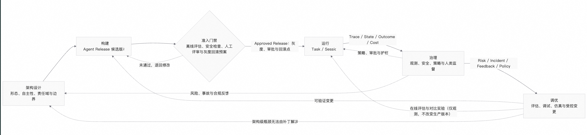

图 2-2　架构设计 → 构建 → 运行 → 治理 → 调优的生命周期闭环

| 阶段 | 核心问题 | 主要输入 | 主要产物 | 准入或反馈机制 |
| --- | --- | --- | --- | --- |
| 架构设计 | 用什么形态、多大的自主性和什么边界来解决这个业务问题 | 业务目标、任务结构、风险等级、数据敏感度、时间跨度与合规要求 | 形态选择、责任域划分、Harness 与 Runtime 边界、权限与数据边界、可观测与评估口径、架构决策记录 | 架构评审、威胁建模、影响半径评估与最低充分架构判断 |
| 构建 | 如何把架构决策实现为可复现的 Agent Release | 架构决策、能力资产、模型、工具与知识 | Agent 定义、Harness 编排、Prompt、Context Policy、Skill、Tool Policy、评估基线、候选版本 | 离线评估、安全检查、人工评审与发布门禁，通过后成为 Approved Release |
| 运行 | 如何可靠、隔离且可恢复地执行任务 | Agent Release、任务、身份、租户、预算和环境 | Task、Session、Event、Checkpoint、Artifact、Trace、Cost、Incident | Runtime 状态机、Sandbox、Gateway、实时策略与失败恢复 |
| 治理 | 如何看见、约束、审批和追责 | Trace、身份、工具调用、数据访问、成本、反馈和异常 | Policy、Approval、Audit、Alert、SLO（服务水平目标）、风险发现与治理动作 | 最小权限、在线检查、行为监测、人类监督与应急处置 |
| 调优 | 如何复现并证实问题、生成改进并安全发布 | 生产 Trace、失败案例、用户反馈、标注和安全发现 | Dataset、Evaluator、Experiment，以及 Prompt、Context、Skill 与 Harness 补丁、仿真结果 | 回归、对比实验、红队、仿真、灰度、审批和回滚 |

表 2-6　五阶段生命周期的责任划分

本白皮书把架构设计列为生命周期的第一个阶段，而不是让它隐含在构建之中。原因是形态选择、自主性授予、责任域划分和权限边界一旦确定，后续构建、运行、治理和调优的成本区间基本被锁定。把这些决策留给构建阶段隐式完成，等价于让实现细节反向定义架构约束，而这类问题往往只能通过重构而非补丁解决。图 2-2 中由治理和调优指回架构设计的两条虚线，正是为了给这种情况留出显式路径：当风险来自形态选择或权限模型本身，而不是某个 Prompt 或某次工具调用时，正确的动作是重新设计架构，而不是继续叠加补丁。

#### 2.4.3 治理既是阶段，也是横切约束

本白皮书将治理作为独立的一篇展开，是因为 Agent 进入生产后，可观测、多智能体身份、工具权限、数据边界、成本、人工审批和安全责任会成为集中问题，需要统一的方法与责任人。但这不意味着治理只在运行之后发生。

治理能力在生命周期各阶段有不同形态：权限模型和数据边界在架构设计阶段确定，工具策略、审批点和审计字段在构建阶段实现，Sandbox、Gateway 与 Runtime 在运行阶段执行既定策略，Observability 与安全分析在治理阶段持续检测风险，Evaluation 与 Simulation 在调优阶段验证变更是否引入新风险。因此，治理既是一类持续运营活动，也是贯穿全生命周期的架构约束。一个可用于自检的标准是：如果某项治理要求只能在上线后通过流程和人工补齐，而不能在架构和构建阶段落到策略、接口或数据结构上，那么它在规模化之后很可能会失效。

#### 2.4.4 从生产证据到受控变更

调优不等于让 Agent 在生产中自由修改自己。任何由模型、反馈或轨迹生成的 Prompt、Memory、Skill 或 Harness 补丁，都应被视为候选变更，需要经过可复现评估、安全检查、版本化、灰度和可回滚发布之后才能进入生产。这正是图 2-2 中调优产生的变更不直接进入运行、而是回流到构建并重新经过准入门禁的原因：可控的改进比无审批的自我修改更符合企业级自进化的定义。图中由调优指向运行的虚线只表示在线评估与对比实验的观测通道，用于在真实流量中获取证据，并不意味着变更可以绕过构建与门禁进入生产。

这一约束也解释了为什么运行阶段必须产出结构化的 Trace、状态和成本事实。没有可复现的证据，调优只能依赖主观印象；没有版本化的发布单元，即使找到了改进方向，也无法证明改进确实来自这次变更。观测、评估与发布三者构成同一条链路，缺少任何一环，闭环都会退化为一次性的人工调参。

### 2.5 本章小结

Agentic Application 的核心不是某一个框架、模型或托管服务，而是一组责任清晰、可独立演进又能通过生命周期闭环协作的系统能力。Model 提供认知核心；Harness 编排层组织和约束行为；Context、State、Memory、Knowledge 与 Skill 管理信息与能力；Tool、Protocol 与 Environment 连接真实世界；Runtime、Sandbox、State Store 与 Gateway 承载生产执行；平台控制面、Observability、Security 与 Evaluation 则建立责任与改进闭环。

除 Model 之外，上述能力在抽象层均属于第 1 章所说的广义 Harness，本章的工作是把它们落位到明确的责任域，并说明哪些适合由应用自建、哪些适合由共享平台提供。业务与应用层不属于广义 Harness，它定义的是这套系统要解决的业务问题与交互边界。

三个视图各自解决一类风险：组件视图避免能力遗漏，平台视图避免责任混乱，生命周期视图避免把一次演示误当成可运营的系统。五阶段闭环则把架构决策纳入生命周期，使形态选择、权限边界和评估口径成为可以被复核和修订的对象，而不是隐含在实现中的假设。

这套参考架构不要求所有应用使用同样复杂的组件组合。架构的目的不是把系统做大，而是对每一项被授予的自主性建立对等的执行、观测、安全和评估能力。企业应当根据任务路径的可预知程度、环境影响、数据敏感度、时间跨度和业务风险，选择足以解决问题的最低充分架构，并在生产事实的驱动下逐步演进。


<a id="sec-007"></a>

# 构建篇


<a id="sec-008"></a>

## 构建篇导读
上一篇确立了架构对象与责任划分，本篇进入生命周期的第二个阶段。构建阶段的核心工作有两项：决定 Harness 由谁实现，以及把模型的离散判断组织为可持续推进、可中断恢复、可验证结束的任务过程。

Coding Agent 为这项工作提供了一个可观察的工程样本。在代码、文件与测试构成的环境中，模型可以通过工具持续行动，系统也可以用编译、测试和文件差异验证结果。它说明模型能力只有经过上下文组织、任务循环、状态管理、工具执行、权限控制与结果验证，才可能稳定转化为任务结果。但编码场景不能替代全部企业任务：审批、交易、客服与运营具有不同的业务状态、权限边界与成功标准，企业应复用其中可泛化的 Harness 机制，而非照搬一套 Coding Agent 流程。

构建是本书五个持续责任域中的 Agent 构建与编排域。这里的构建不是一次性开发活动，被构建出的编排逻辑会在每次任务运行时持续工作，其质量直接决定运行篇要承载什么、治理篇要观测什么、调优篇能改什么。同时，本篇只描述并绑定可用能力，物理执行、状态落盘与环境隔离由运行篇承担，这条边界贯穿四章。

| 对应章节 | 主线 | 构建对象或问题 | 主要机制 |
| --- | --- | --- | --- |
| 第 3 章 | 范式：Harness 由谁实现 | 定制深度、数据边界、运行责任与交付方式的取舍。 | 四类构建入口：高代码框架、产品化 Harness（Coding Agent CLI / SDK 与工作区助手）、Managed Agents、Agent 云产品；Agent Platform 的规模化交付与多源纳管。 |
| 第 4 章 | 工程契约：任务 | 任务如何推进、中断如何恢复、完成如何判定。 | Agent Loop 与任务状态机、Planning 与阶段门禁、Subagent 受控委派、异步续行、由证据决定完成。 |
| 第 5 章 | 工程契约：信息 | 有限模型窗口与持续增长的任务世界之间如何取舍。 | Context 构建管线与 Manifest、压缩与卸载、Session / Task State / Workspace 的区分、Memory 与 Knowledge 的分工、Skill 的渐进式披露。 |
| 第 6 章 | 工程契约：行动 | 行动意图如何被授权、执行与验证。 | 统一 Action Plane、Function Calling / MCP / A2A 的职责分层、Environment Contract 与 Sandbox、Permission 与 HITL、Trace 与 Evaluation 闭环。 |

第一条主线是构建入口的选择。当前存在四类主要起点：高代码框架提供代码级控制；产品化 Harness 以 Coding Agent CLI、SDK 与工作区助手的形式复用成熟能力；Managed Agents 将约定范围内的 Harness 与运行基础服务化；Agent 云产品提供原生创建与共享资源入口。四类入口不构成成熟度阶梯，也不互斥，选择依据是任务结构、定制深度、数据边界、环境影响、团队能力与交付方式。当多团队、多来源 Agent 同时存在时，Agent Platform 负责统一创建、接入、规模化交付、运行、治理、协作、观测与优化，它不是第五类入口。

第二条主线把 Harness 拆为任务、信息、行动三类工程契约。任务契约解决推进与终止：Agent Loop 以 Prepare、Model、Act、Observe、Verify 推进，显式状态与多维预算提供确定性边界，完成由环境证据判定而非由模型停止判定。信息契约解决模型此刻应当看见什么：Context Builder 按身份、可信度、相关性与 Token 预算动态编译输入，压缩与卸载控制窗口增长，但任何关键事实必须先落入权威状态；Session 表达交互连续性，Task 表达可验收目标，Workspace 承载模型窗口之外的工作记忆。行动契约解决意图如何成为受控的环境事实：统一 Action Plane 按 Schema、身份、Policy、审批、执行、Observation 与 Trace 推进，Environment Contract 与 Sandbox 提供文件、进程、网络与 Secret 的真实隔离，Trace 与 Evaluation 把真实失败转化为有针对性的 Harness 改动。

三类契约存在内在顺序：任务定义流转，信息定义每一步的可见范围，行动定义副作用与验收依据。第 4 至 6 章共用同一贯穿案例，即生产服务漏洞修复与变更发布 Agent，跨章跟读同一任务比分别阅读更容易看清三类契约的咬合关系。

本篇构建出的 Agent 随后需要进入真实的执行环境、状态存储与流量通道，那是第三篇运行的主题。


<a id="sec-009"></a>

## 第 3 章　范式：Harness 的主流构建方式和责任边界
上一章从组件、平台和生命周期三个视图给出了 Agentic Application 的参考架构，并将“架构设计”明确为生命周期的第一个阶段。本章进入第二篇“构建”，从 Harness 主流的构建路径、任务&信息&行动三类工程契约，阐述如何构建可靠的 Agent。

编码 Agent 为这项工作提供了一个可观察的工程样本。在代码、文件和测试构成的环境中，模型可以通过工具持续行动，系统也可以用编译、测试和文件差异验证结果。它说明，模型能力只有经过上下文组织、任务循环、状态管理、工具执行、权限控制和结果验证，才可能稳定转化为任务结果。但编码场景不是所有企业任务的替代物。审批、交易、客服和运营任务具有不同的业务状态、权限边界和成功标准，企业不能照搬一套 Coding Agent 流程，而应复用其中可泛化的 Harness 机制。

从工程视角看，构建 Agent 的主要工作，是为模型建立与任务结构、风险等级相匹配的 Harness。这并不意味着企业必须从零实现模型之外的全部系统。面向不同的定制深度、产品抽象和运行责任，当前可以归纳出四种主要构建起点：

*   基于高代码 Agent Framework 自主构建 Harness
    
*   复用产品化的 Harness
    
*   基于模型构建 Agent
    
*   在云产品的预置能力之上，快速构建 Agent
    

在单个 Agent 之外，企业还需要 Agent Platform 创建和接入这些 Agents，并提供规模化交付、运行、治理、协作、观测和优化能力。

本章分别以 AgentScope、QwenPaw、Qoder Cloud Agents 和阿里云 AgentCore 作为四种构建方式的示例，并以阿里云 AgentCore 作为 Agent Platform，展示如何统一创建、接入、交付、纳管和运营多源 Agent。四种起点不是由低到高的成熟度阶梯，也不必互斥。同一企业可以用高代码框架构建需要深度定制的核心 Agent，用 Coding Agent 将产品化 Harness 嵌入现有应用，也可以通过云产品中组合的预置能力快速创建 Agent，再由统一 Agent Platform 纳管和运营。

### 3.1 Agent = Model + Harness

#### 3.1.1 Harness 是模型之外的工程系统

本白皮书将 Agent Harness 定义为：

> **模型之外、围绕 Agent Loop 组织上下文、能力、状态、环境与控制机制，并将模型判断转化为可执行、可恢复、可验证任务过程的代码、配置和执行逻辑。**

这个定义包含三层含义。

*   第一，Harness 不是一个更长的 System Prompt。Prompt 只是它在某一轮推理中生成的输入之一。Harness 还包括任务状态机、工具注册、计划管理、权限检查、环境适配、事件处理、错误恢复和完成验证等确定性逻辑。
    
*   第二，Harness 不是某一种 Agent Framework 的同义词。Framework 可以帮助企业实现 Harness；成熟的 Coding Agent CLI 或 SDK 可以提供一套现成 Harness；Managed Agents 还可以把 Harness 连同执行服务一起托管。Harness 描述的是 Agent 如何工作的系统层，而不是某一类产品形态。
    
*   第三，Harness 不是 Runtime 或 Sandbox。Harness 决定下一步应为模型提供什么、允许模型提出什么行动、怎样推进任务；Runtime 负责持续承载这个过程；Sandbox 负责把实际行动限制在可控环境中。三者协同，但责任不同。
    

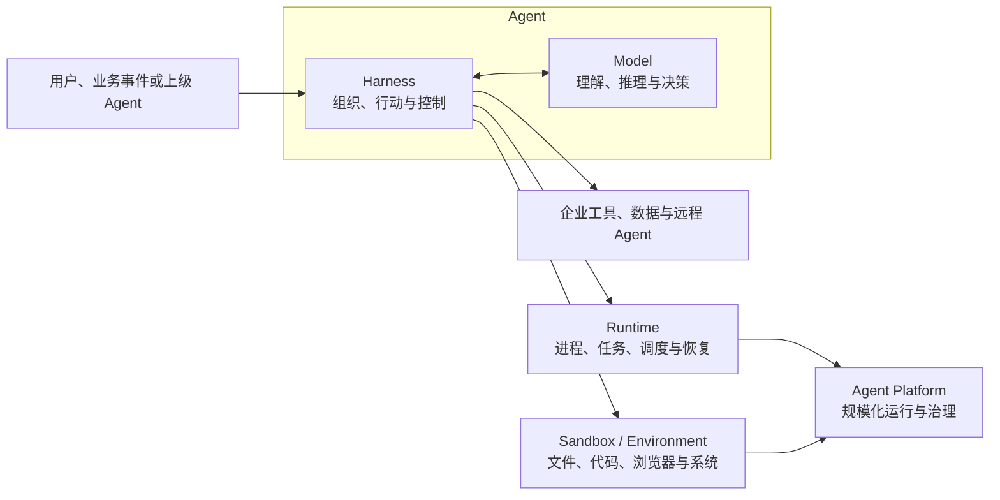
```mermaid
flowchart LR
    U[用户、业务事件或上级 Agent] --> H

    subgraph A[Agent]
        direction LR
        M[Model<br/>理解、推理与决策]
        H[Harness<br/>组织、行动与控制]
        H <--> M
    end

    H --> R[Runtime<br/>进程、任务、调度与恢复]
    H --> S[Sandbox / Environment<br/>文件、代码、浏览器与系统]
    H --> X[企业工具、数据与远程 Agent]
    R --> P[Agent Platform<br/>规模化运行与治理]
    S --> P

```

一次模型调用没有可靠的跨轮状态，也不知道任务是否已经在其他节点推进；上下文窗口有限，无法自然保留长任务中的全部事实；工具调用只表达行动意图，并不等于当前用户获得执行授权；模型可以声称任务完成，却不能证明文件已经生成、测试已经通过、订单已经提交或审批已经生效。

Harness 因而要把概率性的模型判断嵌入确定性的系统边界。模型决定 Agent 能理解和推理到什么程度，Harness 决定这些能力怎样持续转化为任务结果，Runtime 与 Sandbox 则决定这个过程如何被承载和限制。

| 层次 | 核心问题 | 主要责任 |
| --- | --- | --- |
| Model | Agent 能理解和推理到什么程度 | 语义理解、规划判断、生成与工具选择 |
| Harness 编排 | Agent 如何工作 | Loop、Context、State、Plan、Tool、Skill、Subagent、Permission 与 Verification |
| Runtime | Agent 如何持续运行 | 进程承载、任务调度、并发、等待与故障恢复 |
| Sandbox / Environment | Agent 在哪里行动、影响范围多大 | 文件、进程、网络、Secret、资源和环境隔离 |
| Agent Platform | 如何规模化交付和治理 | 多租户、发布、网关、配额、观测、评估、安全和运营 |

这些逻辑边界不一定对应五个独立产品或部署单元。一个 SDK 可以同时包含 Harness 和本地 Runtime，托管服务也可以同时提供 Harness、Runtime 与 Sandbox。但在架构设计中仍要保留边界，否则企业无法判断故障归属、数据位置、迁移成本和最终责任。

#### 3.1.2 开发 Harness 要实现哪些对象

从开发者视角看，构建 Harness 不是罗列功能，而是让一组工程对象在同一个任务生命周期中协同工作：

| 构建对象 | 开发阶段需要回答的问题 | 主要交付物 |
| --- | --- | --- |
| Agent Contract | Agent 为谁工作、目标是什么、允许和禁止什么 | 角色指令、任务输入输出和成功标准 |
| Execution | 模型怎样循环、规划、等待、委派和结束 | Agent Loop、状态机、预算与 Verifier |
| Context & State | 每轮看见什么，任务事实保存在何处 | Context Policy、Session / Task Schema、Workspace 与 Memory |
| Capability | Agent 可以使用哪些方法和外部能力 | Tool Schema、MCP、Skill、Subagent 与能力目录 |
| Environment | 文件、命令、浏览器或企业系统在哪里运行 | Environment Contract、Sandbox 与 Artifact 边界 |
| Control | 以谁的身份行动，哪些动作要拒绝或审批 | Permission Policy、HITL 与短时凭证 |
| Interaction | 用户和上层应用如何看进度、干预和恢复 | Event Schema、Streaming、Channel 与恢复游标 |
| Quality | 如何证明一次任务完成，并判断新版本是否更好 | Trace、Outcome、测试用例和评估基线 |

一个最小 Agent 可以只实现其中一部分，但进入企业生产环境后，这些问题都必须有明确责任人。选择 Harness 构建路径，本质上就是决定哪些对象由企业开发，哪些对象复用现有产品，哪些对象交给托管平台承载。

这些对象可以进一步归纳为三个能力域：执行与编排、上下文与状态、行动与反馈。这里只把它们作为构建检查表；第 4—6 章将分别展开它们的内部原理、实现方式和调优方法。

图 3-1　企业 Agent 的构建与承载关系



构建 Agent 不能从选择框架或打开工具开始，而应先固定任务契约（Agent Contract）。任务契约说明 Agent 为谁工作、接受什么输入、交付什么结果、允许影响哪些系统、哪些动作必须拒绝或审批，以及什么证据能够证明任务完成。同一个修复高危依赖漏洞目标，可以只生成分析报告，也可以在隔离环境中修改代码并运行测试，还可以创建合并请求；除非契约明确授予发布权限并规定审批条件，这些 Agent 都不应把修复完成解释为已经发布生产。

#### 3.1.3 四类构建入口解决不同责任问题

在选择具体实现之前，企业还要判断任务路径由谁控制。步骤、分支和异常在设计时已经明确的任务，更适合使用 Workflow；执行路径必须根据中间结果和环境反馈动态决定时，可以由 Agent 持有部分决策权；高风险主流程稳定、局部判断复杂的任务，则可以使用 Hybrid，由 Workflow 固定审批、交易和发布边界，由 Agent 负责检索、分析和方案生成。Workflow、Agent 主导与 Hybrid 描述路径控制方式，不是与 Single-Agent、Long-Horizon Agent 和 Multi-Agent 并列的应用形态。

在此基础上，高代码框架自行构建Harness、产品化Harness、Managed Agents 服务和 Agent 云产品构成四类常见的构建入口。它们最显著的差异，不是模型能力，也不是应用形态，而是 Harness 的通用行为由谁实现，Runtime 与 Sandbox 由谁提供，以及企业应用需要补齐哪些控制和验收责任。Single-Agent、Long-Horizon Agent 和 Multi-Agent 都可以从其中任一入口构建；应用形态决定需要怎样的任务组织、持久状态与协作契约，构建入口则决定这些能力主要由企业、产品还是平台实现。AgentScope、QwenPaw、Qoder Cloud Agents 和阿里云 AgentCore 分别作为本章的代表案例。表 3-2 对四类入口的控制重点、可复用能力、企业责任和适用条件进行比较。

| 构建入口 | 示例 | 企业直接控制的重点 | 可复用或托管的能力 | 企业仍需承担的责任 | 更适合的条件 |
| --- | --- | --- | --- | --- | --- |
| 高代码 Agent Framework 自主构建 Harness | AgentScope、LangChain、DeepSeek Harness | Loop、Context、Planning、状态语义、工具策略和验证逻辑 | Framework 提供模型、消息、工具、状态和编排等基础抽象 | 组合后的行为、执行基础、安全、恢复、评估和业务验收 | 任务逻辑独特，需要深度定制，或数据与环境必须由企业控制 |
| 产品化 Harness | QwenPaw、Hermes | 业务目标、工具扩展、权限回调、Workspace 和应用集成 | 工作区理解、任务规划、工具执行、Session、事件和过程干预 | 多租户接入、业务 Task、隔离环境、凭证、Artifact 和 Outcome | 希望复用既有工作方式，同时嵌入现有产品或企业流程 |
| 基于模型构建Agent | Qoder Cloud Agents、Claude Managed Agent | Agent 定义、Environment 配置、企业能力接入、任务委派和验收 | 约定范围内的 Harness、Session 推进、事件流、隔离执行与云端运行资源 | 身份映射、业务状态、审批、数据边界、结果验收和退出机制 | 在线服务、异步任务、批量任务和快速生产化 |
| 基于云产品构建Agent | 阿里云 AgentCore、 | 业务目标、Agent 配置、共享资源组合、发布范围和验收规则 | 产品预置的模型、知识、工具、运行环境及管理能力，具体范围以版本为准 | 业务 Task、数据与权限边界、扩展集成、效果评估和最终验收 | 希望以云产品入口快速创建 Agent，并与企业共享资源和平台治理衔接 |

表 3-2　四类 Agent 构建入口的主要差异

四类入口不是严格互斥的技术分类。高代码框架构建的 Agent 可以使用托管 Runtime；产品化 Harness 可以运行在企业集群，也可以被平台调度；基于模型构建Agent 仍需接入企业工具、身份和业务系统；基于云产品构建 Agent 既可以提供平台内的原生构建入口，也可以进一步承担多源 Agent 的目录、运行和治理能力。选择时应分别判断任务效果是否依赖修改 Loop 或 Context、数据和执行环境能否托管、团队是否愿意维护状态恢复与 Sandbox，以及最终交付对象是个人工作区、嵌入式应用、异步任务服务还是平台内业务 Agent。

### 3.2 基于高代码框架自主构建 Harness

高代码 Agent Framework 提供模型、消息、工具、Agent、状态和编排等代码级抽象，应用团队在其上定义任务循环、上下文策略、能力组合和企业集成。这里的“高代码”强调开发团队可以直接控制和扩展 Harness 机制，与依靠可视化配置或预置模板的构建入口相区分，并不表示框架路径一定更复杂或更成熟。以 AgentScope Java 为例，HarnessAgent 将工作区、状态、Memory、Context 压缩、Plan Mode、Skill、Subagent、Sandbox 和交互控制等能力组织在统一运行上下文中，使团队可以按业务需要自主构建 Harness。这里的自主构建指开发团队使用框架设计和实现 Harness，并不是 Agent 自己生成或重构 Harness。

Framework 路径的核心价值是任务语义控制。企业可以决定每轮 Context 怎样组成、哪些错误可以重试、计划何时生成和更新、何时请求审批、怎样创建子任务，以及什么证据算完成。与之对应，Framework 提供的是构建材料，不会自动补齐多租户隔离、状态恢复、Sandbox、安全策略、评估基线和业务验收。

一个最小 AgentScope Harness 可以先确定三件事：使用什么模型、Agent 在哪个 Workspace 工作、一次调用属于哪个用户和 Session。

```java
HarnessAgent agent = HarnessAgent.builder()
    .name("remediation-agent")
    .model(model)
    .workspace(Paths.get(".agentscope/workspace"))
    .build();

agent.call(message, RuntimeContext.builder()
    .userId("u-1842")
    .sessionId("remediation-2026-0917")
    .build()).block();

```

这段代码已经建立了最小 Harness 边界，但还不是完整的企业 Agent。`name` 标识行为主体，`model` 提供推理能力，`workspace` 为指令、文件、计划、Memory、Skill 和任务产物提供外部空间，`RuntimeContext` 则把用户与 Session 身份带入当前调用。

接下来不应一次性打开所有能力，而应从任务成功标准反推需要的 Harness。例如，漏洞修复 Agent 至少需要读取代码、生成补丁、执行测试和验证安全扫描；如果计划未经确认不能修改代码，就需要 Plan Mode 与 Permission；如果分析和评审可以并行，就需要 Subagent；如果任务跨越多个调用，就需要外置状态和可恢复 Workspace。

#### 3.2.1 按业务需求组合 Harness 能力

AgentScope 使用 Builder、Middleware 和工作区资产逐步叠加能力。下面的示例在最小 Agent 上增加计划、Todo、上下文压缩、大工具结果卸载和 E2B Sandbox：

```java
HarnessAgent agent = HarnessAgent.builder()
    .name("remediation-agent")
    .model(model)
    .workspace(Paths.get(".agentscope/workspace"))
    .enablePlanMode()
    .enableTaskList()
    .compaction(CompactionConfig.builder()
        .triggerMessages(30)
        .keepMessages(10)
        .build())
    .toolResultEviction(ToolResultEvictionConfig.defaults())
    .filesystem(new DockerFilesystemSpec()
        .image("ubuntu:24.04"))
    .build();

```

真正的构建工作不在于调用多少 Builder 方法，而在于定义这些能力之间的契约：

| 能力 | AgentScope 中的构建入口 | 应用团队需要决定什么 |
| --- | --- | --- |
| 指令与上下文 | `AGENTS.md`、附加 Context、Middleware | 指令层级、动态信息、Token 预算和冲突规则 |
| 状态与记忆 | Workspace、StateStore、Memory、Compaction | Session / Task 边界、写入规则、恢复和多租户隔离 |
| 计划与任务 | Plan Mode、Todo、Task State | 何时先规划、谁批准、阶段目标如何验收 |
| 能力资产 | Tool、Skill Repository、Subagent | 能力发现、版本、权限、委派和输出契约 |
| 执行环境 | FileSystem、Docker 或其他 Sandbox | 文件、网络、Secret、资源、快照和隔离范围 |
| 控制与交互 | Permission、Channel、Middleware | ALLOW / DENY / ASK、用户干预和事件映射 |
| 质量与反馈 | Trace、Verifier、评估接口 | 完成证据、观测字段和版本回归标准 |

稳定、确定性的步骤应尽量沉淀为 Tool、脚本或策略；需要模型理解目标和权衡方案的部分留在 Agent Loop；可能影响外部世界的动作统一经过权限和 Sandbox。这样构建出来的 Harness 才具有可测试边界，而不是由 Prompt 驱动的一组隐式行为。

#### 3.2.2 从单机进程走向分布式服务

本地 HarnessAgent 解决的是单个 Agent 如何工作。要把它变成企业在线服务，还需要在外围建立多租户接入、任务调度、共享状态、隔离环境、能力网关和观测评估系统。

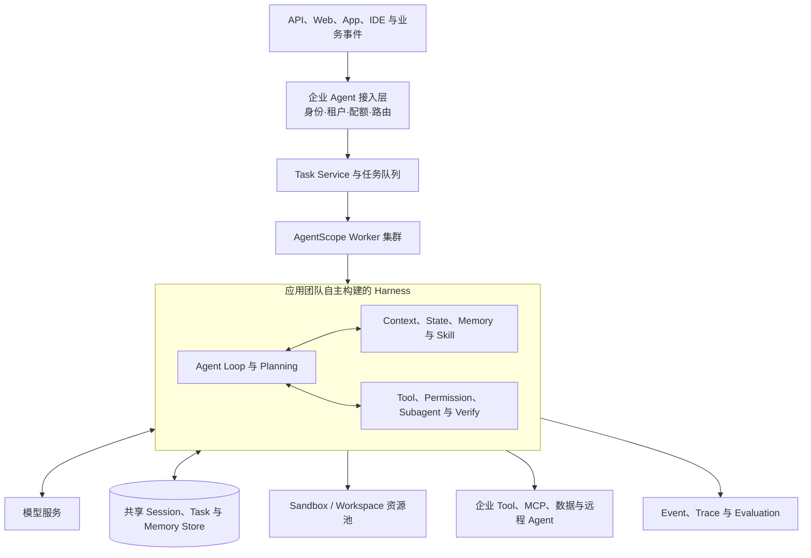
```mermaid
flowchart TB
    C[API、Web、App、IDE 与业务事件] --> G[企业 Agent 接入层<br/>身份·租户·配额·路由]
    G --> Q[Task Service 与任务队列]
    Q --> W[AgentScope Worker 集群]

    subgraph H[应用团队自主构建的 Harness]
        L[Agent Loop 与 Planning]
        C1[Context、State、Memory 与 Skill]
        A[Tool、Permission、Subagent 与 Verify]
        L <--> C1
        L <--> A
    end

    W --> H
    H <--> M[模型服务]
    H <--> S[(共享 Session、Task 与 Memory Store)]
    H --> X[Sandbox / Workspace 资源池]
    H --> T[企业 Tool、MCP、数据与远程 Agent]
    H --> O[Event、Trace 与 Evaluation]

```

在线实例不应依赖进程内消息历史恢复任务。应用团队需要把 Session、Task、Plan、子任务和 Artifact 映射到共享状态接口；为同一任务设置并发写入或执行租约；在 Worker 失效后从安全点恢复；按租户创建或复用 Sandbox；使用短时身份访问企业工具。物理存储、调度和容灾属于 Runtime，但 Harness 必须先定义相应逻辑契约。

工作区 Agent 的架构重心会有所不同：它可以直接运行在 IDE、CLI 或团队 Workspace 中，保留更长生命周期的文件和用户交互；但只要进入多人、多项目或后台执行，同样需要身份、状态、权限、Artifact 和 Trace 边界。

#### 3.2.3 适用边界与构建交付物

Framework 路径适合业务逻辑独特、数据或执行环境不能交给外部托管、需要改变 Loop 或 Context 策略，或者企业希望沉淀统一 Agent 技术底座的场景。它也要求团队具备模型应用、分布式系统、安全和效果评估能力。

这一条路径在 Build 阶段至少应形成：可测试的 Harness 代码、Agent Contract、状态 Schema、Context Policy、Tool 与 Skill 清单、Environment Contract、Permission Policy、Verifier、事件模型和回归用例。只有模型与这些行为配置被共同版本化，线上结果才能被复现和回滚。

### 3.3 复用产品化的 Harness

Coding Agent 的生产实践，以及 Claw 形态的工作区助手已经形成一套可复用的工作模式：检查工作区、制定计划、调用文件和命令工具、维护 Session、请求权限、生成 Artifact，并在长任务中接受用户在执行过程中的干预。这套机制也适用于围绕文件、工具和可验证环境展开的企业任务，例如读取数据并调用分析脚本、采集日志并定位故障、汇总材料并生成报告。企业如果不需要从零设计这些通用行为，可以通过 CLI 直接使用，也可以通过 SDK 将产品化 Harness 嵌入业务应用，再接入业务工具、权限规则和验收标准。

#### 3.3.1 区分 CLI、SDK、工作区助手

Coding Agent CLI 适合开发者直接在工作区中操作，SDK 适合将相同或相近的 Harness 嵌入既有应用，工作区助手则强调跨入口的连续使用和个人化状态。三者的区别不是模型能力高低，而是 Harness 由谁发起、状态由谁保存、事件由谁消费，以及面向个人工作区还是企业业务系统交付。

Qoder CLI 和 Qoder Agent SDK 是 Coding Agent 的代表案例。Agent SDK 是应用侧编程接口，负责提交目标与选项、消费事件、处理权限请求和续接 Session；配套的 CLI 运行组件负责运行 Qoder 产品提供的 Harness，在目标工作区规划任务、调用模型并执行工具。

工作区助手则把同类 Harness 扩展到更广泛的个人知识、办公协同、消息处理和自动化任务，OpenClaw、Hermes Agent 和 QwenPaw 可以作为代表。两者可以相互组合，也都不能仅凭产品侧 Session 或运行结果替代企业 Task、权限判定和 Outcome 验收。

#### 3.3.2 Coding Agent CLI 与 SDK

Qoder CLI 和 Agent SDK 是这条路径的代表。Agent SDK 是应用侧编程接口，负责提交 Prompt 与 Options、消费事件和控制 Session；Qoder CLI 是底层 Agent Runtime，负责规划任务、调用模型并在目标环境中执行工具。SDK 包通常会携带兼容的 CLI Runtime，应用不必把 CLI 另外安装成一项远程服务。

直接使用 CLI 适合个人和团队工作区；使用 SDK 则可以把 Agent 接入 IDE、研发平台、故障处理系统、企业工作台或自动化任务。二者的区别不是模型能力，而是 Harness 由谁发起、怎样接收事件，以及企业是否需要建立自己的应用与控制面。

**用 Agent SDK 嵌入业务应用**

下面的 TypeScript 示例把成熟 Harness 嵌入一个漏洞修复服务。应用设置工作目录、可用工具集合和预授权范围，通过审批回调处理需要确认的操作，再持续消费文本、工具调用与运行结果：

```ts
import { accessTokenFromEnv, query } from '@qoder-ai/qoder-agent-sdk';

for await (const message of query({
  prompt: '分析 payment-service 的高危依赖漏洞，修改代码并补充测试；不要发布。',
  options: {
    auth: accessTokenFromEnv(),
    cwd: '/workspace/payment-service',
    tools: ['Read', 'Write', 'Edit', 'Glob', 'Grep', 'Bash'],
    allowedTools: ['Read', 'Glob', 'Grep'],
    permissionMode: 'default',
    async canUseTool(toolName, input, context) {
      // 宿主应用实现审批；取消或超时应拒绝执行。
      const approved = await requestToolApproval({
        toolName, input, signal: context.signal,
      });
      return approved
        ? { behavior: 'allow', updatedInput: input, toolUseID: context.toolUseID }
        : { behavior: 'deny', message: '操作未获批准。', toolUseID: context.toolUseID };
    },
  },
})) {
  if (message.type === 'assistant') {
    for (const block of message.message.content) {
      if (block.type === 'text') publishText(block.text);
      if (block.type === 'tool_use') publishToolEvent(block.name);
    }
  }
  // 保存运行结果；通过测试、安全扫描和业务验收后再确认 Outcome。
  if (message.type === 'result') await persistRunResult(message);
}
```

这段代码复用了任务规划、模型调用、工具执行、上下文与 Session 等 Harness 能力。tools 限定可用工具集合，allowedTools 仅预授权读取和检索工具；需要确认的文件修改或命令调用，由 canUseTool 交给应用审批。requestToolApproval、publishText、publishToolEvent 和 persistRunResult 均由宿主应用实现。审批界面应展示实际操作及其输入，并在拒绝、取消或超时时终止该操作。

企业还要把 cwd 指向受控 Workspace，不向该环境注入生产发布凭据，并通过身份与网络策略阻断生产发布通路，落实“不要发布”的限制。result 只作为运行结果保存；应用应依据变更文件、测试、安全扫描和业务状态验证成功标准，再确认业务 Outcome、交付成果并记录反馈。

SDK 还可以接入 MCP、Skill、Plugin、Subagent、Hooks、Memory 和外部 Session Store。构建时应优先使用已经存在的扩展点，而不是在外围 Prompt 中模拟相同机制；只有当现成 Harness 的行为与业务成功标准不匹配时，才评估是否需要转向 Framework 路径。

**将成熟 Harness 封装为分布式服务**

当然不能把一个 CLI 进程直接当作多租户在线服务，企业需要在 SDK 外围增加身份和任务控制面，并把每次 Agent 执行调度到受控 Worker 与 Workspace。

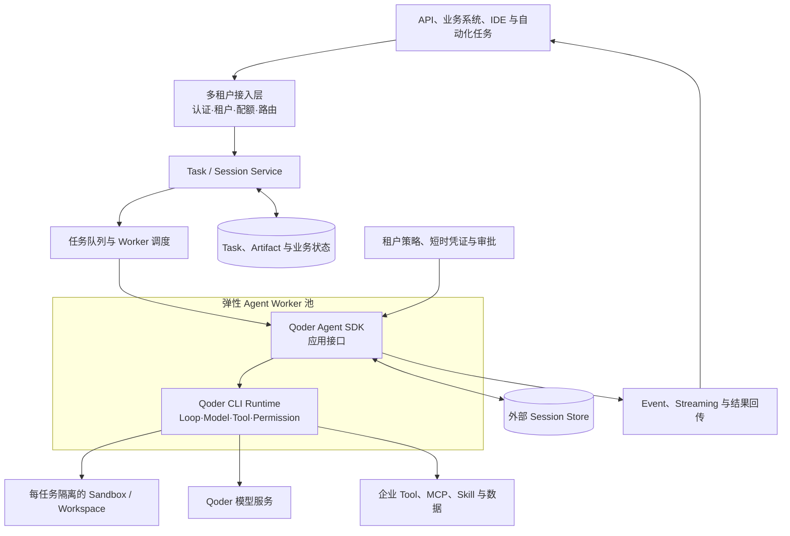
```mermaid
flowchart TB
    C[API、业务系统、IDE 与自动化任务] --> G[多租户接入层<br/>认证·租户·配额·路由]
    G --> T[Task / Session Service]
    T --> Q[任务队列与 Worker 调度]

    subgraph W[弹性 Agent Worker 池]
        S[Qoder Agent SDK<br/>应用接口]
        R[Qoder CLI Runtime<br/>Loop·Model·Tool·Permission]
        S --> R
    end

    Q --> S
    R --> X[每任务隔离的 Sandbox / Workspace]
    R --> M[Qoder 模型服务]
    R --> E[企业 Tool、MCP、Skill 与数据]
    S <--> SS[(外部 Session Store)]
    T <--> DS[(Task、Artifact 与业务状态)]
    P[租户策略、短时凭证与审批] --> S
    S --> V[Event、Streaming 与结果回传]
    V --> C

```

外部 Session Store 可以镜像 Session 历史，并允许后续请求在另一台主机上通过 `session_id` 继续执行。但它只负责 Session Transcript，不等于完整的企业任务存储，也不保存认证状态、应用配置、文件 Checkpoint 或保留策略。企业仍要分别管理 Task State、Artifact、Sandbox Snapshot、凭证和业务 Outcome。

共享 Session Store 还必须保证租户与项目键隔离、同一键的追加顺序、幂等写入和并发控制。Worker 失效后，任务服务先确认原行动和工作区状态，再决定 Resume、Retry 或转人工，不能因为 Session 能被读取就直接重放最后一次工具调用。

#### 3.3.3 工作区助手

QwenPaw 官方将产品定位为可部署在本地或云端环境中的个人人工智能助手，并提供 Web Console、桌面应用、终端用户界面（Terminal User Interface，TUI）、CLI 和消息 Channel 等入口。其架构以 Agent Workspace 为持续边界，每个 Agent 对应一个工作区，工作区承载配置、Memory、Skill 和历史等状态；MCP、Subagent、Cron 与 Sandbox 则扩展能力调用、并行任务、定时执行和受控运行。这里的“云端环境”表示软件可以部署到云上，不等于官方提供了企业级托管 Agent 服务。

下面的命令只用于说明 QwenPaw 从初始化工作区到打开应用或进入 Coding 模式的基本入口，具体安装条件和命令应以所用版本的官方文档为准。

```plaintext
pip install qwenpaw
qwenpaw init --defaults
qwenpaw app
qwenpaw .
```

工作区助手带来的复用，不只是少写一段 Agent Loop 代码。用户通过不同 Channel 进入同一个 Agent 时，可以继续使用既有 Memory、Skill 和 MCP 工具；Cron 可以在独立 Session 中推进定时任务，Subagent 可以执行后台工作。企业仍要逐项确认这些状态是否具备所需的并发控制、恢复、保留和审计语义。以 QwenPaw 为例，官方文档明确提示后台 Subagent 不可恢复，Sandbox 在未启用约束时不会自动提供隔离，因此不能把功能可用直接等同于生产责任已经满足。

**将工作区助手接入企业应用与平台**

个人工作区中的连续体验，不能直接替代企业级任务服务。企业接入工作区助手时，需要在外围增加身份、租户、Task、审批和 Outcome 控制，并为每个用户、团队或任务明确 Workspace、Memory、Credential 与 Sandbox 的隔离边界。图 3-3 以 QwenPaw 为例展示目标架构：产品化 Harness 保留工作区、Memory、Skill、MCP、Subagent 和 Channel 等能力，企业接入层负责将其映射到业务对象和控制要求。

图 3-3　工作区助手的企业接入封装——以 QwenPaw 为例（目标架构示意）



图中的多租户入口、任务队列和实例调度属于目标架构，不是对 QwenPaw 当前产品能力的直接陈述。QwenPaw Hub 可以让互信团队在一台服务器上使用各自实例，但官方将其标为早期版本，并明确不构成面向陌生用户的强多租户边界。企业不能把共享部署直接解释为强隔离平台，也不能因为工作区历史可读就机械重放失效前的高影响操作。恢复前仍要核对幂等键、外部系统状态和已生成 Artifact。

**适用边界与构建交付物**

这条路径适合希望复用产品化 Harness、工作区和多 Channel 能力，同时将 Agent 接入个人知识、研发协作、办公自动化或企业流程的团队。Coding Agent CLI 和 SDK 更适合围绕开发工作区进行直接操作或编程集成；工作区助手更适合需要持续 Memory、跨入口交互、定时任务和通用工具组合的场景。选择时应优先判断任务是否依赖代码级修改 Loop 或 Context、状态是否需要跨 Channel 延续，以及数据、凭证和执行环境能否进入该工作区。

构建阶段至少应形成产品与版本清单、Workspace 和 Memory 策略、Tool、MCP 与 Skill 清单、Channel 接入、身份与 Credential 边界、Sandbox 策略、Task 与 Session 映射、Event 与 Artifact 处理、业务 Verifier 和退出机制。若任务效果依赖修改底层规划算法、Context 编译顺序或特殊状态迁移，而产品没有相应扩展点，高代码 Framework 路径可能更合适；若任务需要强多租户、弹性调度和长时恢复，也不能仅依赖个人工作区或单个助手进程。

### 3.4 基于模型构建 Agent

Qoder Cloud Agents 把通用 Harness 与运行基础进一步服务化，相比 SDK 侧重将成熟 Harness 的执行能力嵌入应用，Qoder Cloud Agents 围绕目标、执行、成果交付和结果反馈组织任务过程，云端托管为这一过程提供运行基础。 

沿用前面的漏洞修复案例，企业通过 SDK 构建服务时，还需要部署和调度承载 SDK 的 Worker 与 Workspace，为任务准备执行环境，并建设面向业务的会话服务。采用 Qoder Cloud Agents 后，平台承担基础 Agent Loop、Session 推进、工具运行和 Serverless 的隔离环境，持续执行漏洞分析、代码修改和测试，向应用交付变更文件与执行结果。企业的集成重点由组织一次次执行，转向定义任务目标、处理必要干预和验收最终成果。

企业仍负责接入代码仓库和业务工具、映射用户身份与权限、管理业务任务状态，并定义审批和验收流程。应用侧也需处理事件消费与断线续接。任务是否达到成功标准，应结合变更文件、测试、安全扫描和真实业务状态判断；提交或发布生产环境仍由企业策略决定。

#### 3.4.1 用四个对象定义托管任务

Qoder Cloud Agents 使用四个核心对象组织构建与运行：

| 对象 | 作用 | 企业主要配置 |
| --- | --- | --- |
| Agent | 可复用的 Agent 定义 | 模型、System Prompt、工具、Skill 和行为配置 |
| Environment | Session 使用的容器运行环境 | 依赖、启动配置、资源、环境变量和凭证 |
| Session | 一次具体任务或持续交互实例 | Agent、Environment、用户目标和业务关联信息 |
| Event | Session 的输入与实时执行事件 | 用户消息、状态、工具、进度、结果和系统联动 |

构建流程可以归纳为五步：准备访问身份，创建 Environment，定义 Agent，绑定二者创建 Session，最后接通事件通道并发送 user.message。使用 SSE 时，应先确认连接建立，再提交任务；历史事件可通过列表接口分页读取。

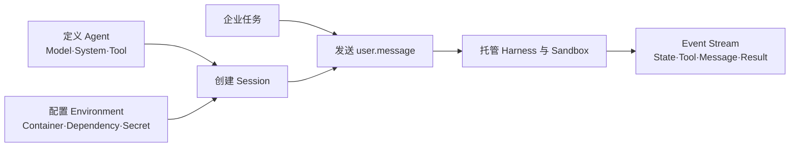
```mermaid
flowchart LR
    D[定义 Agent<br/>Model·System·Tool] --> S[创建 Session]
    E[配置 Environment<br/>Container·Dependency·Secret] --> S
    U[企业任务] --> V[发送 user.message]
    S --> V
    V --> H[托管 Harness 与 Sandbox]
    H --> O[Event Stream<br/>State·Tool·Message·Result]

```

#### 3.4.2 通过 API 创建并运行 Agent

下面的精简示例创建一个 Agent，将它与已有 Environment 绑定为 Session，先建立事件订阅，再提交任务。示例分两个终端执行：终端 A 创建 Session 并保持 SSE 连接，终端 B 使用相同访问身份和 Session ID 提交任务。确认 A 收到 HTTP 200 与 text/event-stream 响应头后，再执行 B 中的请求。真实应用应使用服务身份、Secret 管理和错误处理。

```bash
# 终端 A：创建 Agent 和 Session，再建立事件订阅。
AGENT_RESPONSE=$(curl -s -X POST "$QODER_API_BASE_URL/api/v1/cloud/agents" \
  -H "Authorization: Bearer $QODER_ACCESS_TOKEN" \
  -H "Content-Type: application/json" \
  -d '{
    "name": "remediation-agent",
    "model": "ultimate",
    "system": "分析依赖漏洞并生成可审批变更，不得直接发布生产环境。",
    "tools": [{
      "type": "agent_toolset_20260401",
      "enabled_tools": ["Bash", "Read", "Write", "Edit", "Glob", "Grep"]
    }]
  }')
AGENT_ID=$(echo "$AGENT_RESPONSE" | jq -r '.id')

SESSION_RESPONSE=$(curl -s -X POST "$QODER_API_BASE_URL/api/v1/cloud/sessions" \
  -H "Authorization: Bearer $QODER_ACCESS_TOKEN" \
  -H "Content-Type: application/json" \
  -d "{\"agent\":\"$AGENT_ID\",\"environment_id\":\"$ENV_ID\"}")
SESSION_ID=$(echo "$SESSION_RESPONSE" | jq -r '.id')

printf 'SESSION_ID=%s\n' "$SESSION_ID"

# 先订阅：-i 显示响应头；确认 HTTP 200 和 text/event-stream 后再发送任务。
# 此连接持续运行，展示后续任务的进度与结果。
curl -i -sS -N "$QODER_API_BASE_URL/api/v1/cloud/sessions/$SESSION_ID/events/stream" \
  -H "Authorization: Bearer $QODER_ACCESS_TOKEN" \
  -H "Accept: text/event-stream"

# 终端 B：单独执行以下命令，不要排在终端 A 的长连接命令后顺序执行。
# 配置相同的 QODER_API_BASE_URL、QODER_ACCESS_TOKEN，
# 并将 SESSION_ID 设置为终端 A 输出的值；确认 A 已成功建连。
curl -sS -X POST "$QODER_API_BASE_URL/api/v1/cloud/sessions/$SESSION_ID/events" \
  -H "Authorization: Bearer $QODER_ACCESS_TOKEN" \
  -H "Content-Type: application/json" \
  -d '{"events":[{"type":"user.message","content":[{"type":"text","text":"修复 payment-service 的高危依赖漏洞并运行测试"}]}]}'
```

应用可以从事件流中接收 session.status\_running、agent.message、agent.tool\_use、agent.tool\_result 和 session.status\_idle 等事件，并把它们映射到自己的任务状态、进度界面、审批系统和 Trace。session.status\_idle 表示当前回合结束；任务是否成功完成，还应结合交付成果和验收标准判断。Agent 定义可以被多个 Session 复用，每个 Session 则承载独立任务与隔离执行环境。

自 2026 年 8 月 24 日起，不带 Last-Event-ID 的新 SSE 连接只接收建连之后产生的事件，因此需要先确认订阅建立，再提交任务。应用应在事件处理成功后保存事件 ID，断线时通过 Last-Event-ID 续接，并按事件 ID 去重；已有或遗漏的事件通过 List Events 分页读取。提交任务若超时，应先核对服务端状态，再决定是否重试，避免重复执行。

从应用集成看，Qoder Agent SDK 主要提供调用和扩展成熟 Harness 的编程接口；QCA 则以业务目标为起点，组织任务持续执行、成果交付与结果反馈。应用通过 Agent、Environment、Session 和 Event 将任务委派给平台，并围绕交付成果进行验收。企业仍需保存业务 task\_id 与 Cloud session\_id 的映射，关联 Artifact、测试和扫描结果、审批记录及业务 Outcome，使执行过程与任务完成结果可以相互追溯。

#### 3.4.3 接入企业工具、权限和反馈闭环

托管 Agent 只有连接企业能力后才能完成真实业务任务。企业需要将 Tool、MCP、代码仓库、数据和凭证接入 Environment 或受控 Gateway，并依据当前租户和任务目的限制访问。托管 Sandbox 提供执行隔离，企业 Policy 仍要决定业务上是否允许一次读取、修改、发送或发布。

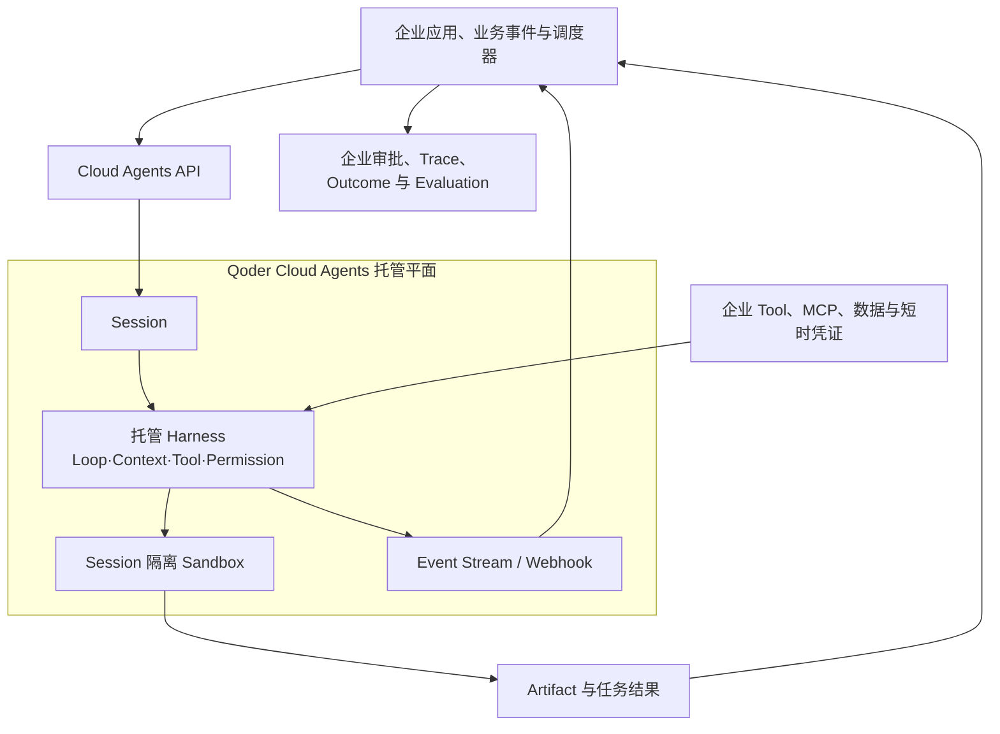
```mermaid
flowchart TB
    C[企业应用、业务事件与调度器] --> API[Cloud Agents API]
    API --> S[Session]

    subgraph P[Qoder Cloud Agents 托管平面]
        S --> H[托管 Harness<br/>Loop·Context·Tool·Permission]
        H --> X[Session 隔离 Sandbox]
        H --> V[Event Stream / Webhook]
    end

    T[企业 Tool、MCP、数据与短时凭证] --> H
    V --> C
    X --> A[Artifact 与任务结果]
    A --> C
    C --> E[企业审批、Trace、Outcome 与 Evaluation]

```

平台可以推进基础 Harness、执行工具并产生 Event，但不能替企业定义业务正确性。例如，平台能够运行测试和创建变更文件，是否允许发布生产环境仍取决于企业审批；Agent 声称修复完成，也需要企业依据安全扫描、测试和真实系统状态验收。

因此，Managed Agents 的开发重点是把责任边界写成机器可执行契约：Agent 能看见什么工具，Environment 能访问什么资源，凭证以谁的身份发放，哪些事件需要人工参与，什么 Outcome 才能使企业 Task 完成。

#### 3.4.4 适用边界与构建交付物

托管路径适合长时异步任务、后端 API 集成、批量处理、计划任务，以及希望快速获得弹性 Runtime 和隔离 Sandbox 的团队。

Build 阶段至少应形成：版本化 Agent 定义、Environment 模板、Tool / MCP 与 Skill 清单、企业身份和权限策略、业务 Task 与 Session 映射、Event 消费与 Channel 适配、Artifact 去向、Verifier 和评估基线。托管越多，企业越应把工具、数据、权限和成功标准定义清楚，否则只是把不明确的 Agent 行为转移到了云端。

### 3.5 使用云产品快速构建 Agent

高代码框架强调对 Harness 机制的代码级控制，Coding Agent CLI 与 SDK 强调复用既有工作方式，Managed Agents 强调把约定范围内的 Harness 和运行责任交给服务提供方。除此之外，企业还可以使用 Agent 云产品，将模型、指令、知识、Memory、Tool、Skill、Credential 和运行环境等资源通过产品界面或开放接口组合为 Agent。其价值不只是减少初始化代码，而是让 Agent 从创建开始就进入统一的资源、身份、版本和质量体系。

阿里云智能体构建和治理平台 AgentCore 可以作为这一路径的代表案例。官方将其能力概括为构建与运行、协作与治理、观测与评估，并提供 Agent 创建与管理、模型连接、Skill、MCP 工具、凭证、Team、Channel、运行监控和 Trace 等能力。

#### 3.5.1 云产品构建入口的能力边界

云产品快速构建不等于用可视化页面替代工程设计。产品可以预置模型访问、能力目录、运行环境、身份策略、观测和评估入口，但业务目标、任务状态、数据边界、工具授权和 Outcome 标准仍由企业定义。即使 Agent 可以在平台内完成配置和运行，也不能据此假定它已经满足多租户隔离、长任务恢复、业务审批或生产准入要求；这些能力仍要按具体产品版本、部署方式和企业策略逐项确认。

这一路径与 Managed Agents 的区别主要在控制面。Managed Agents 侧重把一个已经定义的 Agent 作为服务持续执行；Agent 云产品还承担 Agent 的创建、资源装配、版本管理和发布配置。二者可能由同一产品同时提供，也可能组合使用，因此不能按自建、半托管、全托管简单排列为成熟度阶梯。

#### 3.5.2 从共享资源组合为可交付 Agent

企业在云产品中构建 Agent 时，应先从任务契约反推资源组合，而不是先把所有可用模型、知识和工具都加入 Agent。AgentCore 官方资料明确列出 Agent 与模板、模型连接、Skill、MCP 工具、凭证、Team、Channel、运行状态、Trace 和评估等能力，并在场景说明中涉及知识库、记忆库和沙箱运行时。表 3-6 将这些产品能力映射为构建对象和企业责任；具体对象名称、地域、计费和可用范围仍应以正式使用时的对应版本文档为准。

| 构建对象 | 在云产品中的作用 | 企业需要确定的内容 |
| --- | --- | --- |
| Agent 定义与版本 | 组织模型、指令、能力引用和默认运行配置 | 目标、输入输出、行为边界、版本归属和变更策略 |
| Model、Knowledge 与 Memory | 提供推理能力、受控知识和跨轮信息 | 模型选择、数据范围、检索策略、写入规则和保留周期 |
| Tool、MCP 与 Skill | 连接确定性能力、外部系统和可复用任务方法 | 能力契约、参数校验、风险分级、审批点和失败处理 |
| Credential 与 Identity | 约束 Agent 代表谁访问何种资源 | 身份映射、最小权限、短时凭证、租户边界和审计要求 |
| Runtime、Sandbox 与 Channel | 承载执行、隔离环境并连接用户或业务入口 | 资源规格、网络边界、Workspace、超时恢复和交互方式 |
| Event、Trace 与 Evaluation | 记录过程事实并形成质量反馈 | Task 关联、Artifact 去向、评估集、准入阈值和 Outcome 判定 |

表 3-6　云产品快速构建 Agent 的对象与责任

这些对象共同构成构建输入，不意味着它们都属于 Harness 编排层。Agent 定义中的 Loop、Context 和能力选择属于 Agentic Core；Runtime、Sandbox 和资源调度属于生产执行基础；身份策略、观测和评估更多由平台控制面承担。沿用第 2 章的责任域，可以避免把在一个产品界面中完成配置误解为所有能力属于同一个架构层。

#### 3.5.3 从平台内 Agent 定义到业务交付

云产品构建出的 Agent 需要经过版本化、评估和准入后再进入业务入口。平台侧的发布或部署状态只说明某个 Agent 定义已经可以被调用，不等于业务任务已经完成。企业还要建立业务 Task 与平台执行对象的映射，把 Event、Trace 和 Artifact 关联到具体版本，并由业务应用或其授权 Verifier 根据真实系统状态形成 Outcome。

构建阶段至少应交付可追溯的 Agent 定义、资源引用、身份与权限策略、运行环境配置、Channel 或 API 接入、测试样例、评估基线和回滚方案。对于会修改外部系统的 Agent，还要把审批、幂等、超时、补偿和人工接管条件落实为确定性机制。这样，云产品带来的速度提升才不会以放弃业务控制为代价。

#### 3.5.4 与多源 Agent 管理能力衔接

AgentCore 既提供平台内 Agent 构建入口，也将自研 Agent、开源 Harness 和商业 SaaS Agent 作为统一管理对象，并通过身份鉴权、Team 协作、运行观测和评估能力连接构建与治理。两种角色通过同一组公共对象衔接：平台内创建的 Agent 直接形成受管定义，外部 Agent 则通过平台支持的接入方式注册或调用。平台统一的是身份、资源、版本、任务和质量事实，不要求外部 Agent 改用同一种 Harness。

### 3.6 用 Agent Platform 规模化交付企业 Agent

前四节解决的是单个 Agent 从哪里起步，以及 Harness、运行和控制能力由谁实现。企业同时拥有多个团队、多种 Agent 和不同执行环境后，如果每个项目分别建设模型接入、Tool 目录、凭证管理、Session、Sandbox、部署、观测和评估，不仅会重复投入，也会形成彼此隔离的 Agent、数据和权限孤岛。

因此，企业需要在这些构建入口之上形成共同的 Agent Platform。平台不仅提供原生 Agent 创建入口，还要接入和规模化交付由高代码框架、Coding Agent CLI 与 SDK、Managed Agents 和其他远程服务形成的多源 Agent，并覆盖其运行、治理、协作、观测、评估和持续优化。阿里云 AgentCore 在本章中同时承担这两个视角：第 3.5 节讨论其平台内构建能力，本节讨论其对自研 Agent、开源 Harness 和商业 SaaS Agent 的统一管理，以及由此形成的规模化交付能力。

#### 3.6.1 企业级 Agent Platform 的能力边界

本白皮书将企业级 Agent Platform 定义为面向多个团队、多个 Agent 和多种执行形态的平台系统。它以统一对象和接口支持 Agent 的创建、接入、交付、运行、治理、协作、观测和优化，提供共享能力资源、身份策略和质量数据，并通过分布式执行基础连接模型、Runtime、Sandbox、Tool 与远程 Agent。

Harness 决定单个 Agent 如何理解目标和采取行动，Agent Platform 则决定企业中的一组 Agent 如何被创建、发现、复用、组合、交付、运行和治理。平台可以提供或托管 Harness 编排能力，但不能因此替业务应用定义任务目的、授权范围和 Outcome 标准；平台负责汇聚执行证据，业务应用或其授权 Verifier 负责最终业务判断。表 3-7 从创建、接入、交付、运行、治理、协作、观测和优化等方面归纳平台能力。

表 3-7　企业级 Agent Platform 的主要能力

| 平台能力 | 主要管理对象 | 对构建和交付的价值 |
| --- | --- | --- |
| Agent 创建与目录 | Agent Definition、Template、Version、Owner、Tenant | 统一创建入口、资产目录、所有权、复用、变更和回滚 |
| 异构接入与交付 | Workload、Worker、Endpoint、Deployment、Channel | 接入不同 Framework、SDK Worker 和托管 Agent，并面向应用或用户交付 |
| 能力与数据资源 | Model、Tool、MCP、Skill、Memory、Knowledge、Credential | 复用经过审核的企业能力，避免重复集成和凭证散落 |
| 协作与任务组织 | Agent Team、Task、Dependency、Delegation、Handoff、Event、Approval | 组织本地与远程 Agent 分工，管理依赖、结果汇聚和人工干预 |
| 运行与资源调度 | Runtime、Worker、Queue、Sandbox、Workspace、Browser、CPU、GPU、Budget | 按租户、优先级、数据位置和预算分配资源，支持弹性、隔离和恢复 |
| 身份与策略治理 | User、Service Identity、Role、Policy、Secret、Audit | 统一人和 Agent 的身份委派、最小权限、审批和审计边界 |
| 观测、评估与优化 | Event、Trace、Artifact、Outcome、Evaluator、Feedback、Cost | 跨实现关联执行过程和业务结果，为验收、回归、灰度和持续优化提供依据 |

这里的统一不等于把所有能力收进一个单体系统。Registry、Runtime、Sandbox、Gateway、Memory、Observability 和 Evaluation 可以由不同服务实现；Agent Platform 的关键，是让这些服务共享一致的身份、租户、版本、Task 和质量语义，并向开发团队提供一条可重复的企业交付路径。责任域回答谁负责什么，执行面、数据与资源面、控制面则回答能力在哪里运行和由谁托管，两种视图不能互相替代。

#### 3.6.2 让原生与外部 Agent 进入同一个平台

Agent Platform 应统一公共对象和接入契约，而不是抹平 Harness 实现差异。平台内原生构建的 Agent 可以直接引用共享模型、工具、知识、身份和运行配置；基于高代码框架构建的 Workload、基于 Coding Agent SDK 封装的 Worker，以及 Managed Agents 或其他远程端点，则保留各自的 Loop、Context、工具执行和状态方式。平台通过 Agent Definition、Task、Session、Event、Identity、State、Checkpoint、Artifact、Trace 和 Outcome 等公共对象连接这些来源。

图 3-5 以目标架构展示同一 Agent Platform 的两个作用面。AgentCore 等平台既可以提供原生构建入口，也可以通过统一契约接入外部异构 Agent。统一的是目录、身份、资源、任务、运行和质量事实，而不是要求不同实现采用同一种内部架构。执行位置可以位于平台托管域、企业自建集群和工作区，也可以是远程托管 Agent 或软件即服务（Software as a Service，SaaS）Agent。

图 3-5　原生与外部 Agent 接入企业 Agent Platform（目标架构示意）



图中的平台内原生入口和三类外部入口需要通过不同方式进入共同对象体系，平台内外的责任也不能因统一管理而混淆。

平台对多源 Agent 的统一管理至少要满足三个条件。首先，版本与归属必须可追溯，不能只记录一个 Agent 名称而不知道实际模型、Harness 配置、能力和环境版本。其次，Event、Artifact 和 Trace 必须关联 Task、Identity 与 Tenant，才能支持跨系统审计和成本归因。最后，远程 Agent 不能只返回自然语言结论，还应提供可验收的 Artifact、事件或环境事实，否则平台无法把它纳入统一质量闭环。

#### 3.6.3 从规模化运行走向协作、治理和优化

资源调度是 Agent Platform 区别于单一开发框架的重要能力。Agent Task 可能持续数小时，并在模型推理、工具执行、人工审批和外部事件之间反复等待；平台不应让等待中的任务长期占用完整计算资源，而应将可恢复状态与执行实例解耦，根据任务优先级、租户配额、Sandbox 类型、数据位置、模型容量和成本预算进行排队与调度。

平台还需要把 Agent Team 视为一组具有目标、身份、权限和依赖关系的任务主体，而不是把每次 Agent 调用当作互不相关的 API 请求。协作关系应明确委派、移交、共享状态、结果聚合和失败传播规则；平台负责提供通信、注册、调度和治理机制，具体业务分工仍由应用和 Harness 定义。这样既能支持 AgentScope 子任务、SDK Worker 与远程托管 Agent 的组合，也能避免多个 Agent 在共享凭证和无边界上下文中相互触发。

观测和评估则把交付延伸到持续优化。平台需要把模型调用、工具执行、状态转换、Artifact、人工反馈、Outcome、成本和安全事件关联到同一 Task 与版本，才能判断问题来自模型、Context、Tool、环境、权限还是任务设计。调优产生的 Prompt、模型、路由、Skill、Tool 或 Harness 变更不能直接影响运行环境，而应回到构建阶段，通过回归评估、安全检查、灰度和回滚门禁后再进入生产。

从构建阶段看，Agent Platform 的最小交付物包括统一 Agent 定义与版本规范、能力资源目录、异构接入适配器、身份与租户模型、Runtime Profile 与资源配额、Task、Session、Event、Artifact、Trace 和 Outcome 契约，以及发布前评估基线。

### 3.7 本章小结

构建企业级 Agent 的核心，是决定怎样实现 Harness，以及由谁承担其行为、运行和效果责任。高代码框架提供代码级控制，AgentScope 展示了如何自主组合 Harness；Coding Agent CLI 和 SDK 或工作区助手提供产品化 Harness，QwenPaw 展示了如何通过持续工作区、Memory、Skill、MCP 和 Channel 复用这些能力。Managed Agents 将约定范围内的 Harness 和运行基础服务化，Qoder Cloud Agents Managed Mode 展示了托管执行与企业验收的责任边界；Agent 云产品则提供原生创建和共享资源入口，阿里云 AgentCore 展示了如何把构建与平台能力衔接。

四类构建入口不是成熟度高低关系，也不必互斥。企业应根据任务结构、定制深度、数据边界、环境影响、团队能力和交付方式选择最低充分方案。无论选择哪种入口，都要区分 Task 与 Session、Event 与 Trace、Artifact 与 Outcome，把权限与验证落实为确定性机制，并让模型、Harness 配置、能力、环境、策略和评估基线共同受版本控制。

当多个团队和多种 Agent 同时存在时，Agent Platform 不只是创建 Agent 的入口，而是支持 Agent 创建、接入、规模化交付、运行、治理、协作、观测和优化的综合平台。AgentCore 同时体现了平台内原生构建和多源 Agent 统一管理两个作用面；具体到 AgentScope、QwenPaw 和 Qoder Cloud Agents 的接入，仍应以统一契约表达目标架构，不能推断为已发布的直连能力。平台统一公共对象和质量事实，但不抹平实现差异，也不替业务应用定义任务目的和正确性。这一边界使不同入口构建的 Agent 能够进入同一套运行、治理与调优体系，并为后续章节建立共同的工程接口。

接下来，第 4 至第 6 章将从任务、信息、行动三类工程契约继续展开 Agent 的构建。


<a id="sec-010"></a>

## 第 4 章　任务：编排、长程推进与协作流转
上一章讨论了企业构建 Agent 的不同入口，包括基于高代码 Agent Framework 自主构建 Harness、复用产品化的 Harness、使用 Managed Agents 服务托管交付 Agent、在云产品的预置能力之上，快速构建 Agent。本章沿着“构建入口”继续向下，关注一个更具体的问题：当任务不能通过一次模型调用完成时，Harness 如何把模型的离散判断组织为可持续推进、可中断恢复、可验证结束的任务过程。

模型的一次输出只是离散判断，而要解决一个企业级任务通常是一个持续的过程。它可能需要先理解环境、再制定计划，连续调用多个工具，在关键动作前等待审批，把部分工作委派给子代理，经历失败和恢复，最后还要用环境事实证明目标已经达成。Harness 执行内核的职责，就是把模型的每一次判断组织成有状态、可控制、可恢复的任务过程。

本章聚焦 Harness 的执行与编排系统：Agent Loop 如何推进任务，Planning 和 Todo 如何把目标外部化，Subagent 如何形成受控委派，异步任务如何跨越请求、进程和上下文窗口，以及如何判断 Agent 是真正完成，而不是仅仅停止。Context、Memory 与 Workspace 的信息组织将在第 5 章展开；工具、Sandbox、权限、Streaming、Trace 与 Evaluation 则在第 6 章主讲。

本章使用同一个企业案例贯穿全章，这个案例既包含长程执行，也包含并行委派、异步等待、人工介入和确定性验证，能够代表大量企业工程任务。

> **生产服务漏洞修复与变更发布 Agent**：收到支付服务高危依赖漏洞任务后，Agent 需要定位受影响代码和运行实例，制定升级方案，将依赖分析、代码修改和独立评审分配给不同执行者，在隔离环境中修改代码并运行测试，生成变更单；涉及发布时等待责任人审批，最后以代码差异、测试报告、安全扫描和发布状态验证任务是否完成。

---

### 4.1 Agent Loop 与任务状态机

#### 4.1.1 从模型调用到任务循环

Agent Loop 是 Harness 最稳定的内核。它不要求模型一次性给出完整答案，而是允许模型根据当前目标和环境反馈，重复执行“判断—行动—观察—再判断”，直到任务被验证完成、进入等待、失败或取消。

一个最小但完整的 Loop 可以抽象为五个阶段：

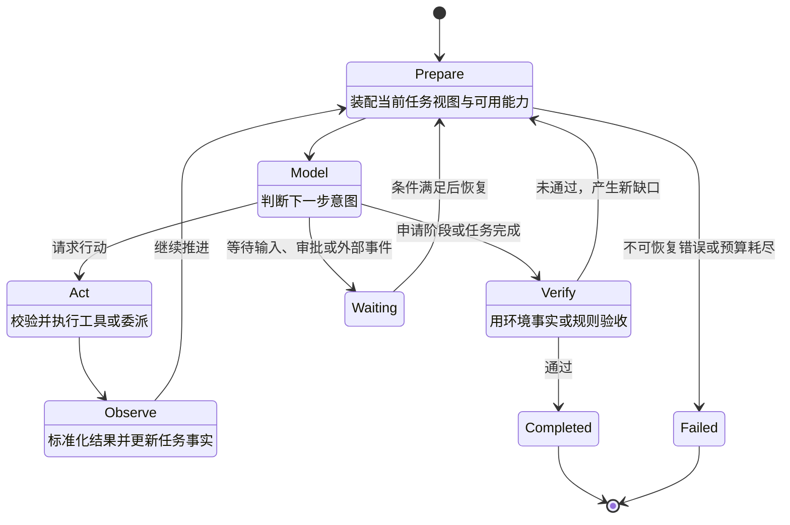
```mermaid
stateDiagram-v2
    [*] --> Prepare
    Prepare: Prepare
    Prepare: 装配当前任务视图与可用能力
    Prepare --> Model
    Model: Model
    Model: 判断下一步意图
    Model --> Act: 请求行动
    Act: Act
    Act: 校验并执行工具或委派
    Act --> Observe
    Observe: Observe
    Observe: 标准化结果并更新任务事实
    Observe --> Prepare: 继续推进
    Model --> Verify: 申请阶段或任务完成
    Verify: Verify
    Verify: 用环境事实或规则验收
    Verify --> Prepare: 未通过，产生新缺口
    Verify --> Completed: 通过
    Model --> Waiting: 等待输入、审批或外部事件
    Waiting --> Prepare: 条件满足后恢复
    Prepare --> Failed: 不可恢复错误或预算耗尽
    Completed --> [*]
    Failed --> [*]

```

*   **Prepare** 读取权威任务状态，确定本轮目标，并向第 5 章的 Context Builder 请求模型输入。
    
*   **Model** 调用模型，由模型判断下一步应行动、委派、询问、等待还是申请完成。
    
*   **Act** 将模型意图交给第 6 章的 Action Plane，完成参数、身份、策略、审批和执行。
    
*   **Observe** 将工具、环境、子任务或用户反馈转换为结构化 Observation，并更新任务事实。
    
*   **Verify** 不接受“我已经完成”作为唯一依据，而是运行与任务相匹配的验收器。
    

浏览文件、执行代码、查询业务系统和调度远程 Agent，都是 Act 的不同实现；用户追加要求、工具返回和异步任务完成，都是 Observe 的不同来源。核心 Loop 保持稳定，具体能力通过扩展点加入。

#### 4.1.2 用权威状态驱动任务

消息历史记录了模型和用户曾经交换的内容，却不应成为任务状态的唯一来源。企业 Harness 至少要维护一份可机读的权威状态：目标、当前阶段、Plan 与 Todo、已确认事实、阻塞项、子任务、Artifact、剩余预算、等待原因和完成依据。

| 状态 | 语义 | 允许的下一步 |
| --- | --- | --- |
| `CREATED` | 任务已经建立但尚未开始 | 进入运行或取消 |
| `RUNNING` | 正在准备、推理或行动 | 继续、暂停、等待、验证、失败或取消 |
| `WAITING_INPUT` | 缺少用户或业务信息 | 接收输入后恢复，或超时结束 |
| `WAITING_APPROVAL` | 行动明确但需要批准 | 批准、拒绝、修改或取消 |
| `WAITING_EVENT` | 等待工具、子任务或外部系统 | 收到事件后恢复，或按策略超时 |
| `PAUSED` | 用户或系统主动暂停 | 恢复、修改规则或取消 |
| `VERIFYING` | 正在核验阶段或最终结果 | 通过、生成修复项或失败 |
| `COMPLETED` | 验收条件已经满足 | 交付结果与证据 |
| `FAILED` | 当前策略下不能继续 | 重开尝试、转人工或结束 |
| `CANCELLED` | 任务被显式终止 | 清理资源并保留审计事实 |

`WAITING` 不是失败，`PAUSED` 也不是结束。只有把这些状态显式化，上层 Runtime 才能在等待期间释放计算资源并准确恢复；交互界面才能说明 Agent 在等什么；观测系统才能区分执行慢、审批慢和工具慢。

Loop 还必须有外部终止边界。步骤数、总时长、Token 与费用、工具调用次数、子任务并发数、高风险动作次数都应进入预算。预算接近阈值时，Harness 可以要求模型收敛范围、停止新委派、优先完成可交付部分或请求用户选择；预算耗尽时，则应产生明确终态与未完成清单，而不是悄然截断。

#### 4.1.3 案例：一次修复任务如何推进

漏洞修复任务进入系统后，不应只生成一串聊天消息，而应形成持续更新的任务对象。例如在完成影响分析后，权威状态可以表示为：

```yaml
task_id: remediation-2026-0917
goal: 修复 payment-service 中 CVE-XXXX 并形成可审批变更
state: RUNNING
stage: implement_fix
facts:
  affected_module: payment-core
  current_version: 4.2.1
  target_version: 4.2.4
todos:
  - {id: t1, title: 确认影响范围, status: completed}
  - {id: t2, title: 修改依赖并补充测试, status: in_progress}
  - {id: t3, title: 独立评审变更, status: pending}
artifacts:
  - impact-report.md
budgets:
  remaining_steps: 36
  remaining_minutes: 48

completion_evidence: [ ]


```

模型看到的是由这份状态生成的当前任务视图，而不是被迫从几百条历史消息中猜测进度。当安全扫描还未通过时，即使模型输出“修复已完成”，状态也只能进入 `VERIFYING`；只有验收器补齐证据，才能提交 `COMPLETED`。

---

### 4.2 Planning、Todo 与阶段目标

#### 4.2.1 把计划变成外部控制对象

Planning 的价值不是展示模型隐藏的思考过程，而是把任务结构外部化为 Harness 和用户都能读取、修改和验证的控制对象：要达到什么阶段目标、有哪些依赖、哪一步正在执行、用什么证据判定完成。

根据任务复杂度，Harness 可以使用三种控制方式：

| 模式 | 表示方式 | 适用任务 |
| --- | --- | --- |
| 轻量 Todo | 简短、有序的待办列表 | 目标明确、步骤少、反馈快 |
| Plan Mode | 只读探索、形成计划、确认后执行 | 影响面较大、需要审阅、环境尚不清楚 |
| Planner–Executor | Planner 维护阶段和依赖，Executor 逐项执行 | 长任务、多依赖、可并行或需要专业角色 |

计划必须允许修订。工具结果可能推翻假设，用户可能改变目标，环境也可能暴露新约束。每次重规划都应说明触发事实并保留已完成项，不能通过改写目标掩盖失败。Todo 则不需要记录每次微小工具调用，只记录会改变任务可交付状态的事项，并保持唯一的当前进行项或明确的并行分组。

#### 4.2.2 用阶段门禁约束执行

长任务不应直到最后才验证。漏洞修复案例可以划分为五个阶段：

| 阶段 | 主要产物 | 进入下一阶段的门禁 |
| --- | --- | --- |
| 影响分析 | 受影响模块、依赖链、运行实例清单 | 影响范围可追溯，版本事实已核验 |
| 修复规划 | 升级方案、兼容风险、回滚方案 | 计划获批准，写操作权限被放开 |
| 变更实施 | 代码差异、依赖锁文件、测试补充 | 修改仅发生在授权工作区 |
| 独立验证 | 单测、集成测试、安全扫描、评审意见 | 所有强制检查通过或缺口被显式接受 |
| 发布准备 | 变更单、发布窗口、回滚入口 | 责任人审批；本章不自动执行生产发布 |

阶段门禁既降低错误方向上的继续投入，也为 Context 压缩、人工接管和跨窗口续行提供稳定边界。有效的阶段描述必须回答“输出是什么、证据在哪里、谁来确认”，而不是只写“分析问题”“处理代码”“确保质量”。

#### 4.2.3 将探索、计划和执行分开

在 Framework 路径中，应用团队可以直接把计划能力组合进 Harness。下面的 AgentScope 示例为修复 Agent 启用 Plan Mode 与任务列表：

```java
HarnessAgent agent = HarnessAgent.builder()
    .name("remediation-agent")
    .model(model)
    .workspace(workspace)
    .enablePlanMode()
    .planFileDirectory("plans")
    .enableTaskList()
    .build();

```

Plan Mode 将执行过程分为“只读探索—写入计划—人工确认—进入执行”。探索阶段只开放只读工具以及 `plan_enter`、`plan_write`、`plan_exit`、`todo_write` 等计划工具；`plan_exit` 触发人工确认，获批后才进入可修改工作区的阶段。计划写入 `plans/PLAN.md`，Todo 保存在 Agent 状态中，因此两者都能跨调用恢复。

这一实现展示了 Prompt 与 Harness 控制的区别：Prompt 可以要求模型“先规划再修改”，但只有权限模式、工具白名单、持久状态与 HITL 共同生效，系统才真正具备“计划获批前不可写”的约束。

---

### 4.3 Subagent 与任务委派

#### 4.3.1 何时值得委派

Subagent 的价值不是把一个 Agent 包装成多个角色，而是解决三个具体问题：

1.  **上下文隔离**：子任务只加载相关文件、工具和历史，避免主 Agent 的窗口被探索过程占满。
    
2.  **能力隔离**：不同子任务使用不同模型、指令、Skill、工具与权限。
    
3.  **并行执行**：互不依赖的检索、实现或验证可以同时推进，缩短墙钟时间。
    

任务很短、步骤高度依赖或共享对象频繁变化时，委派会增加通信和合并成本。只有隔离、专业化或并行收益超过这些成本时，Subagent 才有价值。

#### 4.3.2 建立清晰的委派契约

主 Agent 负责全局目标、计划、预算、依赖和最终结果，不应把“任务完成”的责任一并交出去。研究 Subagent 收集事实与候选方案，执行 Subagent 在限定范围内产生变更，评审 Subagent 使用相对独立的上下文寻找缺口。这些是运行时职责，不一定是永久角色。

每个子任务都应携带可机读契约：

| 契约项 | 需要回答的问题 |
| --- | --- |
| 目标与边界 | 交付什么；哪些目录、系统和动作在范围内 |
| 已知上下文 | 哪些事实已确认；哪些决定不可自行改变 |
| 能力与权限 | 可用模型、Skill、Tool、环境和权限是什么 |
| 预算 | 最大时间、步骤、Token、费用和并发是多少 |
| 输出与证据 | 结果采用何种结构，证据和来源如何附带 |
| 失败语义 | 何时重试、返回部分结果、升级或终止 |
| 验收条件 | 父 Agent 用什么条件判断结果可采用 |

**Delegation** 是父任务保留责任，将有边界的子任务委派出去；结果返回后仍由父 Agent 整合和验收。**Handoff** 则是任务控制权发生转移，接收者成为当前责任人，并获得继续推进所需的目标、状态和恢复位置。二者都不能只通过一条自然语言消息实现；至少要有任务关系、状态与责任变更记录。

#### 4.3.3 案例：分析、修改和评审如何协同

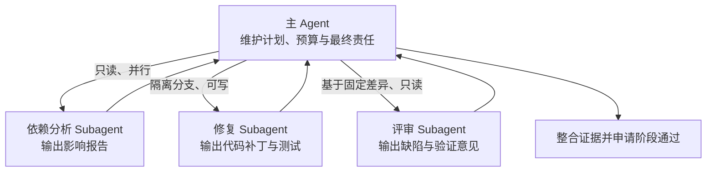
```mermaid
flowchart TB
    P[主 Agent<br/>维护计划、预算与最终责任]
    P -->|只读、并行| R[依赖分析 Subagent<br/>输出影响报告]
    P -->|隔离分支、可写| I[修复 Subagent<br/>输出代码补丁与测试]
    R --> P
    I --> P
    P -->|基于固定差异、只读| V[评审 Subagent<br/>输出缺陷与验证意见]
    V --> P
    P --> G[整合证据并申请阶段通过]

```

分析与代码库探索可以并行，但代码修改需要基于已确认目标版本；评审必须读取固定的差异和测试结果，而不能与执行者共享未经提交的中间判断。多个执行者若同时修改同一工作区，应使用隔离分支、对象级锁或补丁合并，不能依赖“大家小心不要冲突”。

AgentScope 支持把子代理声明为工作区中的版本化规格。例如：

```markdown
---
description: 对漏洞修复补丁进行独立评审，检查兼容性、测试和回滚风险。
workspace:
  mode: isolated
steps: 8
tools: [read_file, grep_files]
---

只审查已生成的差异和测试证据，不修改代码。
按“阻断问题、一般问题、证据缺口”输出结构化结果。

```

主 Agent 可通过 `agent_spawn` 同步调用，也可以设置后台执行并获得 `task_id`。子代理默认不应继承父任务的全部上下文和权限；父任务有权委派，并不意味着子 Agent 自动获得同等授权。

#### 4.3.4 合并结果与传播失败

父任务需要显式定义子任务失败策略：关键分析失败时 `FAIL_FAST`；非关键探索可以 `BEST_EFFORT`；瞬时故障可以 `RETRY_OR_REASSIGN`；需要业务决定时进入 `ESCALATE`。合并结果时还要校验输入版本和证据时间，避免采用基于旧代码或旧业务状态得出的结论。

Subagent 的产物不是主 Agent 可以直接复述的“答案”，而是新的 Observation。只有经过 Schema 校验、版本检查和父任务验收后，才能进入权威任务状态。

---

### 4.4 异步任务与长程续行

#### 4.4.1 让任务脱离当前连接持续存在

企业任务经常超过一次 HTTP 请求、一个终端进程或一个模型上下文的生命周期。Harness 必须把任务身份与当前连接分离：调用方提交任务后获得稳定 `task_id`，可以持续消费事件，也可以断开；任务进入等待或后台运行时，Runtime 可以释放当前计算资源；条件满足后，从权威状态恢复，而不是依赖原进程仍然存在。

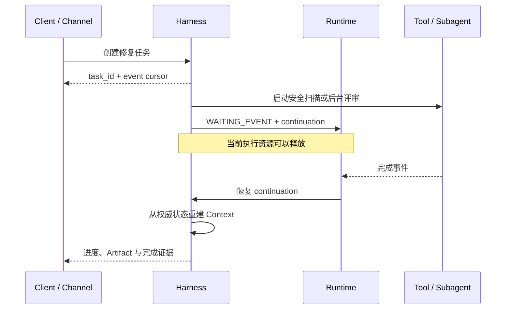
```mermaid
sequenceDiagram
    participant C as Client / Channel
    participant H as Harness
    participant R as Runtime
    participant X as Tool / Subagent

    C->>H: 创建修复任务
    H-->>C: task_id + event cursor
    H->>X: 启动安全扫描或后台评审
    H->>R: WAITING_EVENT + continuation
    Note over H,R: 当前执行资源可以释放
    X-->>R: 完成事件
    R->>H: 恢复 continuation
    H->>H: 从权威状态重建 Context
    H-->>C: 进度、Artifact 与完成证据

```

后台任务、事件和恢复应共用一套契约：稳定任务 ID、父任务 ID、当前状态、创建者与执行者、输入和 Artifact 引用、事件序号、超时、取消与幂等语义、结果位置、错误分类，以及恢复所需的 Continuation。

暂停前，Harness 应停止创建新行动，处理可中断操作并保存最新状态；恢复时重新检查目标、外部条件、工具是否实际执行、权限是否仍有效、工作区是否变化以及剩余预算。取消需要沿父子任务传播，但已发生的外部副作用不能假装消失，必须保留事实并在必要时执行补偿。

Context Reset 只负责控制语义：在旧窗口结束前形成一致的继续点，在新窗口中从权威状态重建当前任务视图。Continuation 应包含目标、当前 Plan、已确认事实、失败尝试、Artifact、等待项、剩余预算和权限模式。其具体存储、压缩和装配方式将在第 5 章展开。

#### 4.4.2 将成熟 Harness 嵌入企业服务

Coding Agent SDK 适合希望复用成熟执行内核、同时保留业务服务入口的企业。下面的 TypeScript 示例通过 Qoder Agent SDK 提交漏洞修复任务，限制可用工具，并消费模型消息、工具调用与最终结果：

```ts
import { accessTokenFromEnv, query } from '@qoder-ai/qoder-agent-sdk';

for await (const message of query({
  prompt: '分析 payment-service 的高危依赖漏洞，修改代码并补充测试；不要发布。',
  options: {
    auth: accessTokenFromEnv(),
    cwd: '/workspace/payment-service',
    allowedTools: ['Read', 'Write', 'Edit', 'Glob', 'Grep', 'Bash'],
    permissionMode: 'acceptEdits',
  },
})) {
  if (message.type === 'assistant') {
    for (const block of message.message.content) {
      if (block.type === 'text') publishText(block.text);
      if (block.type === 'tool_use') publishToolEvent(block.name);
    }
  }
  if (message.type === 'result') persistOutcome(message);
}

```

SDK 在应用进程中提供调用与事件接口，底层 CLI Runtime 负责计划、模型调用和工具执行。企业服务仍需在外围补齐租户身份、任务队列、Session 索引、Artifact 存储、权限策略和业务验收，不能把一个本地 SDK 进程直接等同于分布式在线服务。

在多实例或弹性环境中，Session 应保存到共享存储。调用方记录首次运行返回的 `session_id`，后续请求通过 `resume` 恢复；任意实例都可以读取同一 Session，而不是依赖最初的容器。外部 Session Store 解决的是会话接续，任务队列、并发控制和业务幂等仍需要企业服务层负责。

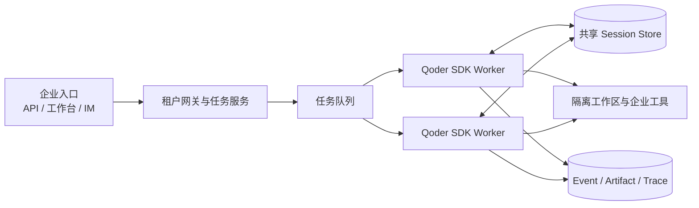
```mermaid
flowchart LR
    U[企业入口<br/>API / 工作台 / IM] --> G[租户网关与任务服务]
    G --> Q[任务队列]
    Q --> W1[Qoder SDK Worker]
    Q --> W2[Qoder SDK Worker]
    W1 <--> S[(共享 Session Store)]
    W2 <--> S
    W1 --> E[隔离工作区与企业工具]
    W2 --> E
    W1 --> O[(Event / Artifact / Trace)]
    W2 --> O

```

#### 4.4.3 由平台承载长任务

如果企业不希望自行维护 Agent Loop、Session 接续和执行基础，可以选择 Qoder Cloud Agents。Qoder Cloud Agents 以 Agent、Environment、Session、Event 为核心对象：Agent 固化模型与行为，Environment 定义代码和运行条件，Session 承载一次持续任务，Event 负责输入与流式输出。应用侧保存业务任务与 Session 的映射，并消费状态、工具和结果事件。

这一路径降低了执行内核的建设成本，但业务责任不会消失。企业仍要定义工具与数据边界、任务目标、审批人、成功标准和最终验收。第 6 章将用同一案例展示托管 Session 的事件流、审批与 Sandbox 连接。

---

### 4.5 Middleware 与执行内核测试

#### 4.5.1 保持核心 Loop 稳定

一个常见演进问题是：每加入压缩、计划、权限、模型路由或观测能力，就在 Loop 中增加一组条件分支。短期直接，长期会使状态迁移不可预测。更稳健的结构是“稳定内核 + 可插拔能力”：核心 Loop 只定义阶段与状态迁移；Middleware、Hook 或 Ability 在明确的生命周期点读取 Runtime Context，返回放行、修改、短路或追加行为。

| 扩展时机 | 可加入的能力 | 不应做的事 |
| --- | --- | --- |
| Task 创建前后 | 任务分类、初始预算、版本绑定 | 隐式改变用户目标 |
| Prepare 前后 | 计划提醒、Context 请求、模型路由 | 把持久状态只写进 Prompt |
| Model 调用前后 | 参数策略、输出解析、无进展检测 | 记录不应保留的敏感推理内容 |
| Action 前后 | 预算检查、结果标准化 | 绕过第 6 章统一 Action Plane |
| State 变化前后 | 状态校验、Checkpoint、通知 | 多处各自维护权威状态 |
| Verify 前后 | 选择验收器、生成缺口、质量门禁 | 仅凭模型自述标记完成 |

扩展本身也需要顺序、读写范围、冲突规则、失败语义和可观测性。最好让扩展返回结构化 Decision 或 Patch，由核心 Loop 统一提交，而不是任意修改共享对象。

AgentScope 的 HarnessAgent 采用能力组合方式，将工作区、状态存储、计划、Subagent、Memory、压缩、Skill、Sandbox 与 Channel 叠加到统一运行上下文中。Framework 路径因此具有最大的业务调优空间，也意味着应用团队要为能力组合、生命周期顺序和最终效果负责。

#### 4.5.2 对确定性部分做契约测试

Harness 测试不能只看最终回答。执行内核至少需要四类确定性测试：

*   **状态迁移测试**：每个状态只接受合法事件，暂停、取消和失败正确传播。
    
*   **扩展顺序测试**：Middleware 在确定时机运行，冲突与短路行为稳定。
    
*   **恢复测试**：在任意安全点中断后，任务能够重建且不重复副作用。
    
*   **预算与边界测试**：达到步骤、时间、费用和风险阈值后，Loop 按设计收敛。
    

例如，修复 Agent 的恢复测试可以在“补丁已写入但测试结果尚未返回”时强制中断：恢复后应先查询原测试任务，而不是再次修改文件或重复启动发布。模型输出可通过固定样本、录制回放或模拟器替代，以验证 Harness 的确定性控制；真实模型的端到端效果进入第 6 章的 Evaluation。

---

### 4.6 可靠性与完成验证

#### 4.6.1 针对失败类型选择恢复策略

“Agent 失败”不是一个可执行的诊断。瞬时模型或网络错误适合有界退避；参数错误需要修正；环境缺失需要重建；权限拒绝应等待或终止；重复探索需要重新规划；业务条件不满足则要明确缺口。盲目重试只会增加成本和风险。

有副作用的行动在重试前必须先回答“上一次究竟有没有发生”。对于发布、通知、写数据库等操作，超时可能只是响应丢失。Harness 应生成幂等键，记录请求与结果，并优先查询状态；无法证明未执行时，不应直接重复。切换模型、工具或环境的降级路径也要被记录，因为能力、权限和结果质量可能已经变化。

无进展检测比单纯的最大步数更早发现问题。常见信号包括：连续调用相同工具且参数高度相似、反复得到同一错误、Plan 长时间不变、工作区没有新增事实、模型在少数行动间循环。检测后可以先要求模型根据结构化证据重新规划，再逐步采取缩小任务、切换能力、创建独立评审或转人工。

#### 4.6.2 让完成由证据决定

模型只能提出完成申请，Harness 才能提交完成状态。验证强度应与风险匹配：

| 层级 | 验证方式 | 适用结果 |
| --- | --- | --- |
| 结构验证 | Schema、必填字段、格式和文件存在 | 低风险结构化产物 |
| 环境验证 | 查询真实系统、检查文件差异与执行结果 | 工具和工作区任务 |
| 确定性验证 | 测试、规则、静态检查和业务校验 | 可编码成功条件 |
| 独立模型验证 | 使用独立 Context 检查质量与遗漏 | 开放式分析和复杂内容 |
| 人工验收 | 责任人审阅、签署或批准 | 高影响、主观或合规任务 |

Verifier 应返回结构化缺口、失败证据和可修复性。验证失败不是简单结束，而是新的 Observation：Harness 决定继续修复、重新规划、转交还是失败。Verifier 是单次任务的完成门禁；跨版本判断某个 Harness 是否更好，则属于第 6 章的 Evaluation Harness。

#### 4.6.3 案例：什么才算漏洞修复完成

对贯穿案例而言，以下事实必须同时成立：

1.  依赖清单证明受影响版本已经被替换，且没有通过传递依赖重新引入。
    
2.  代码差异仅落在授权目录，变更与已批准计划一致。
    
3.  单元测试、集成测试和安全扫描均有可寻址报告，强制项全部通过。
    
4.  独立评审没有未关闭的阻断问题。
    
5.  变更单包含影响范围、回滚方案和证据引用。
    
6.  如果目标只到“形成可审批变更”，系统不得把“尚未发布”误判为未完成；如果目标包含发布，则必须进一步核验审批和真实部署状态。
    

因此，最终结果不是一句“已完成”，而是一组目标相关的事实：

```yaml
state: COMPLETED
outcome: change_ready_for_approval
evidence:
  dependency_check: artifacts/dependency-tree.json
  code_diff: artifacts/remediation.patch
  unit_tests: artifacts/unit-test.xml
  integration_tests: artifacts/integration-test.xml
  security_scan: artifacts/security-scan.sarif
  review: artifacts/review.json
  change_request: CR-18427
remaining_actions:
  - 由服务负责人审批并安排发布窗口

```

这套结构可以直接迁移到其他场景：合同审查以条款覆盖、来源和责任人签署为证据；数据修复以影响行数、抽样校验和回滚点为证据；客户工单以系统状态、沟通记录和用户确认作为证据。变化的是 Verifier，稳定的是“模型申请完成、Harness 依据事实提交完成”的原则。

#### 4.6.4 加速观测、评估基建，并完成智能体验证

Agent 云产品可以为长任务验证提供统一的运行信号，但不应替代业务完成语义。以阿里云 AgentCore 为例，其产品概述支持在统一平台中管理 Agent，连接模型、Skill 与 MCP 工具，并管理访问外部系统所需的凭证。平台还提供运行监控、Trace 与评估能力，并可统一纳管不同来源的 Agent，使企业在同一控制面观察执行过程和质量信号。

企业接入 AgentCore 时，仍需由业务 Task 管理机制维护 Task 标识、状态版本、幂等键、审批条件和 Artifact 引用，并将 AgentCore 的 Agent 与可观测数据映射到任务契约。获得授权的 Verifier 再联合确定性测试、真实业务系统状态和人工授权判定 Outcome。平台统一纳管多个 Agent，也不意味着这些 Agent 天然共享同一父子任务语义或完成标准。企业可以复用 AgentCore 既有的资源装配、运行观测和评估能力，减少重复建设；业务完成责任仍由企业应用定义和承担。

---

### 4.7 本章小结

Harness 执行内核把模型的离散判断组织成可靠任务过程。稳定的 Agent Loop 以 Prepare、Model、Act、Observe、Verify 推进任务；显式状态和多维预算提供确定性边界；Planning、Todo 与阶段门禁把任务控制外部化；Subagent 通过上下文、能力和责任隔离实现受控委派；异步任务、Continuation 与共享 Session 让任务跨越连接、进程和上下文窗口；Middleware 则使能力可以在不重写核心 Loop 的前提下组合演进。

下一章进入 Harness 的信息工程，即上下文、状态与可复用能力资产：如何在有限模型窗口与持续增长的任务事实之间，组织 Context、Session、Workspace、Memory、Knowledge 和 Skill。


<a id="sec-011"></a>

## 第 5 章　信息：上下文、状态与可复用能力资产
长程任务每推进一轮，广义 Harness 都要重新回答一个看似简单、实际决定执行质量的问题：模型此刻应当看见什么。把完整对话、全部文件、所有工具说明和长期经验同时放入模型窗口，不仅会增加成本与延迟，也会让关键约束被重复信息和低可信内容淹没；只保留最近几轮交互，又会丢失目标变更、已确认事实、外部副作用、验收缺口和恢复位置。模型窗口有限，而任务世界持续增长，两者之间必须存在一套独立的信息组织机制。

因此，Harness 需要一套独立的上下文与状态系统。它不是把更多文本喂给模型，而是持续完成四项工作：如何把多来源信息编译成本轮 Context；把不断增长的历史信息进行压缩和卸载；如何把任务事实保存在模型窗口之外；如何把长期 Memory、企业 Knowledge 与可复用 Skill 在正确权限下按需提供给模型。

本章与上一章有明确边界：第 4 章定义任务如何流转，本章定义任务过程中的信息和状态如何表示、保存和进入模型。物理数据库、索引、对象存储和跨副本恢复将在“运行”篇展开；本章聚焦 Harness 所依赖的逻辑模型、构建管线和资产契约。

本章继续使用“生产服务漏洞修复与变更发布 Agent”作为贯穿案例。进入本章后，我们关心的不再是任务如何推进，而是 Agent 在每一步应看见什么：初始漏洞公告、项目规则、当前依赖版本和计划如何进入 Context；长日志和测试报告如何退出模型窗口但仍可查询；计划、补丁和证据如何保存在 Workspace；一次成功修复又如何沉淀为后续任务可以发现但不会被误用的 Memory 与 Skill。

---

### 5.1 Context 构建管线

#### System Context 的动态编译

生产级 Agent 的 System Prompt 不应只是仓库中的一个长字符串。模型每轮实际接收到的 System Context，需要根据 Agent 版本、当前任务阶段、用户身份、工作区规则、剩余预算、可用工具和选中的 Skill 动态生成。其角色更接近一次“编译”：多个来源按优先级合并，冲突被处理，超出预算的内容被压缩或移除，最终得到本轮可执行的模型视图。

```text
System Context
├── Platform Policy        平台安全边界、不可覆盖规则
├── Agent Contract         角色、目标、能力边界与输出要求
├── Tenant / Project Rule  租户制度、项目约定与工作区规则
├── Runtime Reminder       当前阶段、预算、等待项与操作模式
├── Selected Skill         本轮所需方法、脚本与参考资料
└── Tool Descriptors       本轮允许披露的能力与参数 Schema

Task Context
├── User Goal / Steering   原始目标和最新纠偏
├── Plan / Todo            当前阶段和未解决事项
├── Recent Interaction     最近消息和 Observation
├── Compacted History      早期过程的结构化摘要
├── Retrieved Memory       与当前任务相关的历史经验
├── Retrieved Knowledge    带来源、权限和时效的企业事实
└── Workspace References   文件、Artifact 和大结果引用

```

这套分层解决的是责任问题。平台策略不能被项目文档覆盖；用户最新要求可以改变任务方向，却不能突破企业安全边界；Memory 中的历史偏好不能替代当前业务事实；工具返回的外部内容也不能自动升级为系统指令。若所有内容被拼接成同一层文本，Harness 将很难判断冲突来自哪里，更无法进行独立版本和回归。

#### Context Builder 的处理流程

Context Builder 在每次模型调用前执行一条确定性管线：

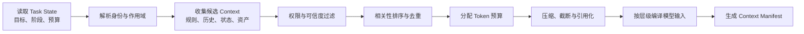
```mermaid
flowchart LR
    S[读取 Task State<br/>目标、阶段、预算] --> I[解析身份与作用域]
    I --> C[收集候选 Context<br/>规则、历史、状态、资产]
    C --> F[权限与可信度过滤]
    F --> R[相关性排序与去重]
    R --> B[分配 Token 预算]
    B --> M[压缩、截断与引用化]
    M --> P[按层级编译模型输入]
    P --> L[生成 Context Manifest]

```

候选信息至少从 Agent 配置、Task State、Session、Workspace、Memory、Knowledge、Skill Registry 和 Tool Registry 中产生。管线应先做身份和权限过滤，再做相关性排序，不能为了排序方便先把跨租户内容交给检索器或模型。对于外部内容，还要保留来源和信任等级，避免检索到的文档或网页把自身文本伪装成高优先级指令。

#### 优先级与 Token 预算

Context 构建不能只按相似度排序。一个实用的优先级函数通常同时考虑：

*   **约束强度**：平台政策和明确业务规则高于经验性建议。
    
*   **任务相关性**：是否直接影响当前阶段的判断与行动。
    
*   **时间有效性**：当前环境事实高于已经过期的历史结论。
    
*   **来源可信度**：权威系统事实高于未经确认的模型摘要。
    
*   **执行依赖**：即将调用的工具说明和验收条件应优先保留。
    
*   **信息增量**：与已选内容重复的信息应合并或移除。
    
*   **Token 成本**：同等价值下优先采用更紧凑、可引用的表达。
    

Harness 可以把可用窗口划分为若干预算区，例如为不可覆盖规则、当前目标和状态保留固定下限，为最近交互、检索知识、Skill 和工具 Schema 分配动态额度，并预留模型输出与后续 Observation 空间。预算不是静态百分比：当任务进入工具密集阶段时，工具定义和环境状态权重上升；进入最终综合阶段时，证据和验收条件更重要。

#### 用 Context Policy 与 Manifest 管理模型输入

每次模型调用都应生成一份 Context Manifest，记录模型究竟看到了什么，而不只是保存最终拼接文本。Manifest 至少包括：

| 字段 | 说明 |
| --- | --- |
| `source_type` / `source_id` | 来源类型与稳定标识 |
| `scope` | Global、Tenant、Project、User、Session 或 Task |
| `version` | 指令、文档、Skill、Tool Schema 或摘要版本 |
| `trust_level` | 平台规则、企业事实、用户输入、外部内容等可信等级 |
| `permission_basis` | 本轮为何有权读取该内容 |
| `selected_reason` | 规则命中、当前阶段、检索相关或显式引用 |
| `token_count` | 实际占用窗口大小 |
| `transform` | 原文、摘要、截断、去重或引用化 |
| `content_hash` | 支持回放与变更检测的内容摘要 |

Manifest 为三类工作提供基础：开发时解释模型为什么遗漏某项信息；评估时比较两个 Agent 版本的 Context 差异；安全审计时确认某条敏感内容为什么进入了模型输入。只记录 Prompt 文本无法稳定完成这些任务，因为同一文本片段的来源、权限和版本可能完全不同。

企业应把上下文层级、检索范围、预算分配、压缩阈值、工具披露和敏感内容处理统一定义为 Context Policy，并与可运行的 Agent 版本绑定。模型、Prompt、Skill 或 Knowledge 索引变化后，Context Policy 仍决定它们如何组合。这样才能把“偶然在某次调用中看见了什么”转化为可测试、可回放的工程行为。

在漏洞修复任务的“变更实施”阶段，一份精简的 Manifest 可以是：

```yaml
model_call_id: call-083
context_policy: remediation-context@2.3
sources:
  - {type: platform_policy, id: prod-change-policy, version: 7, tokens: 620}
  - {type: agent_instruction, id: remediation-agent, version: 12, tokens: 480}
  - {type: task_state, id: remediation-2026-0917, version: 19, tokens: 910}
  - {type: workspace_rule, id: payment-service/AGENTS.md, version: a83c1e, tokens: 740}
  - {type: skill, id: dependency-remediation, version: 3.1, tokens: 530}
  - {type: artifact_ref, id: impact-report.md, transform: summary, tokens: 360}
omitted:
  - {id: raw-security-scan.sarif, reason: artifact_reference_only}
  - {id: unrelated-user-memory, reason: scope_mismatch}

```

这份 Manifest 不保存敏感内容本身，却能回答本轮采用了哪些版本、为何选择、如何变换以及为何排除。出现错误时，团队可以先检查“模型是否看见了正确材料”，再判断模型推理或工具执行是否有问题。

---

### 5.2 Context 生命周期与压缩

随着任务推进，消息、工具结果和文件内容会持续增长。将完整历史永久放进窗口，会同时带来成本、延迟和注意力退化；简单截断最早内容，又容易丢失初始目标和关键决定。Harness 应把原始历史保存在外部状态中，并根据当前阶段构造一个：

```text
Active Context
├── Stable goal and constraints  长期稳定、不可遗漏
├── Current task state           当前阶段、Plan、Todo、预算和阻塞
├── Recent verbatim turns        需要精确理解的最近交互
├── Structured history summary   更早过程的压缩表示
├── Retrieved facts              本轮相关 Memory / Knowledge
└── Artifact references          可按需继续读取的外部内容

```

“最近”不只按时间定义。用户对目标的最新修改、尚未解决的工具错误、待审批动作和验收失败证据，即使产生得更早，也应被视为活动状态；已经完成且可由 Artifact 证明的探索过程，则可以退出活动窗口。

#### Commit、Compact、Rebuild 与 Validate

对话压缩不是普通摘要。它要支持下一轮继续执行，因此至少保留：

*   原始目标、成功标准和不可变约束；
    
*   已确认事实及其来源，区分事实、假设和模型建议；
    
*   已做决定、决定原因和被否决方案；
    
*   已执行行动、工具结果和副作用；
    
*   当前 Plan、Todo、阻塞与下一步；
    
*   Artifact、工作区路径和外部对象 ID；
    
*   用户偏好、审批结果和权限模式；
    
*   失败尝试及避免重复的原因。
    

摘要应采用结构化 Schema，并携带覆盖的事件范围、生成版本和来源引用。高风险事实不能只由模型自由归纳，最好从 Task State、工具结果和审批记录中确定性提取，再让模型压缩叙述性内容。

一次日志查询、网页抓取、代码搜索或数据分析可能返回数万行内容。大结果不应反复进入每轮 Context。Harness 可以将原始结果写入 Workspace 或 Artifact Store，只保留结果摘要、首尾或关键片段、内容类型、大小、生成工具、权限范围和可继续读取的引用。

模型需要细节时，通过搜索、范围读取或分页工具按需取回。引用必须稳定且受权限保护；如果只给出一个临时 URL，任务恢复时可能已经失效。如果结果会随时间变化，还要记录读取时版本、时间或快照标识，避免后续将新内容与旧推理混为一谈。

任何会影响后续行动的事实，都应先进入权威状态，再允许从活动上下文中移除。典型包括审批、工具提交结果、Plan 状态、Artifact、外部对象 ID、预算消耗和用户变更。否则一次不准确的摘要就可能改变任务真实状态。

完整的生命周期可以归纳为四步：

1.  **Commit**：将结构化事实提交到 Task State、Workspace 或相应资产库。
    
2.  **Compact**：把可叙述历史转换为摘要，附带来源和覆盖范围。
    
3.  **Rebuild**：用新摘要、当前状态和最近消息重新构造 Context，并检查关键约束是否仍在。
    
4.  **Validate**：对目标、未解决项、权限模式和关键证据做完整性检查，并用续行用例验证行为没有明显漂移。
    

当多次压缩仍不足以维持有效窗口，或任务进入新的大阶段时，可以进行 Context Reset。Reset 的前提是第 4 章所述 Continuation 已经形成一致继续点。本章负责把它表达为可重新加载的信息包：

```text
Continuation Package
├── Goal & Acceptance Criteria
├── Current Plan / Todo / Blockers
├── Structured Facts & Decisions
├── Workspace / Artifact Manifest
├── Active Async Tasks & Approvals
├── Relevant Memory / Knowledge References
├── Permission & Budget Snapshot
└── Next-step Brief

```

新窗口不需要重放全部对话，而是从 Continuation Package、权威 Task State 和当前环境重新构建。文件式交接特别适合工作区 Agent：计划、进度、发现和测试结果可以由人和 Agent 共同检查，也不会因为一次模型上下文结束而消失。

压缩质量不能只看节省多少 Token。至少要同时衡量：

*   **事实保留率**：关键事实、约束和决定是否完整保留。
    
*   **继续成功率**：压缩或 Reset 后能否在不重复大量探索的情况下继续。
    
*   **矛盾率**：摘要是否与工具事实、Task State 或最新指令冲突。
    
*   **引用可用率**：外部 Artifact 和分页引用是否仍可访问。
    
*   **成本收益**：减少的 Token 与额外压缩调用、读取轮次之间的平衡。
    

压缩器、摘要 Schema 和阈值都应版本化，并进入 Agent 版本的回归范围。

#### AgentScope：让大结果退出窗口而不退出任务

Framework 路径下，应用团队可以根据场景定义压缩阈值与保留尾部，并把超大工具结果卸载到 Workspace。下面的 AgentScope 配置表示：历史达到 30 条消息时进行压缩，保留最近 10 条；过大的工具结果不继续内嵌，而是写入外部文件并在 Context 中留下引用。

```java
HarnessAgent agent = HarnessAgent.builder()
    .name("remediation-agent")
    .model(model)
    .workspace(workspace)
    .compaction(CompactionConfig.builder()
        .triggerMessages(30)
        .keepMessages(10)
        .build())
    .toolResultEviction(ToolResultEvictionConfig.defaults())
    .build();

```

在漏洞修复案例中，完整安全扫描结果可以保存为 `evidence/security-scan.sarif`，活动 Context 只保留漏洞数量、阻断项摘要和文件引用。Agent 若需要查看某条漏洞，再按范围读取原始 Artifact。由此节省的不是一次输入长度，而是后续每一轮都不再重复携带同一大结果。

---

### 5.3 Session、Task State 与 Workspace

#### 区分 Call、Session 与 Task

这三个边界经常被合并为“会话”，但它们解决不同问题：

| 对象 | 定义 | 生命周期 | 典型内容 |
| --- | --- | --- | --- |
| Call | 一次应用对 Agent 的请求或恢复动作 | 秒到分钟 | 请求 ID、当前身份、临时凭证、输入和返回游标 |
| Session | 某个用户或调用方与 Agent 的连续交互边界 | 分钟到数天 | 参与者、Channel、消息、偏好和可见任务 |
| Task | 围绕一个可验收目标持续存在的执行对象 | 可跨 Call、Session、进程和节点 | 目标、状态、计划、子任务、预算、Artifact 和完成证据 |

一个 Session 可以发起多个 Task；一个长 Task 也可以在多个 Session 中被查看、干预和恢复。将 Task ID 绑定为消息线程 ID，会限制后台执行、多人协作和跨渠道续接。Harness 应分别保留两者，并显式记录关联关系。

#### 用状态事实支持恢复

任务状态可以用三种互补表示：

*   **Event Log** 记录发生过什么，适合追踪因果、审计和重建。
    
*   **Snapshot** 记录某一时刻的聚合状态，适合快速读取当前视图。
    
*   **Checkpoint** 表示可以安全恢复执行的位置，除 Snapshot 外还要包含 Continuation、幂等和环境依赖。
    

三者不能互相替代。只有 Event Log，恢复成本会随任务长度增长；只有 Snapshot，无法解释状态如何形成；把每次状态保存都称作 Checkpoint，则会掩盖某些工具事务仍在进行、不能安全重放的事实。

Harness 应定义状态 Schema、事件到状态的归并规则、乐观并发版本和安全点语义；“运行（Run）”篇再决定这些对象落在数据库、日志系统、对象存储还是其他后端。

Harness 还应面向逻辑状态接口编程，而不是把恢复能力绑定到本地内存或某个数据库：

*   `append_event`：追加带版本与因果关系的事件；
    
*   `load_task_state` / `commit_task_patch`：读取和提交权威状态；
    
*   `save_snapshot` / `load_snapshot`：保存和读取聚合视图；
    
*   `put_artifact` / `get_artifact`：存取带元数据的对象；
    
*   `create_checkpoint` / `resume_checkpoint`：在安全点保存与恢复；
    
*   `search_workspace` / `read_range`：为 Context Builder 提供按需访问。
    

本地 Agent 可以把这些接口映射到文件和进程内状态；分布式在线 Agent 则映射到外置状态服务。只要逻辑语义一致，Framework、SDK 和托管路径就能接入同一企业状态平台。

#### Workspace 的外部工作记忆模型

Workspace 为 Agent 提供可寻址、可检查、可逐步修改的外部工作空间。它可以是代码目录、文档空间、数据分析目录、远程文件系统或受控对象存储视图。与 Memory 的主要区别是：Workspace 服务当前任务的显式工作过程，内容通常可被用户直接查看和编辑；Memory 则是跨任务选择性保留的经验和事实。

```text
Workspace
├── inputs/       用户提供或任务同步的输入
├── scratch/      临时分析、搜索结果和中间文件
├── state/        Plan、Todo、Continuation 和结构化任务视图
├── artifacts/    可交付产物与机器可读结果
├── evidence/     测试、查询、审批和验证证据
└── manifest      来源、版本、权限、状态和保留策略

```

目录形式只是示意，核心是区分生命周期和责任。输入应保持来源；Scratch 可以在任务结束后清理；状态文件由 Harness 管理；Artifact 是可能交付、发布或进入下游系统的结果；Evidence 用于证明完成。不能因为它们都存在文件系统中，就使用同样的保留和权限策略。

#### 文件与 Artifact 的生命周期

Harness 对 Workspace 中的对象至少要记录：稳定 ID、路径或对象引用、内容类型、创建者、来源、版本、权限范围、所属任务、状态、校验摘要和保留期限。

Artifact 可以经历：

```text
Draft → Validating → Ready → Published / Rejected → Archived / Deleted

```

模型写出文件不等于产物已经完成。进入 `Ready` 前应通过格式、测试或业务验收；进入 `Published` 往往还需要权限审批和提交动作。第 6 章的 Action Plane 负责这些状态变化对应的实际外部行动，本章负责保存对象与版本事实。

#### 案例：把任务世界放在模型窗口之外

在 AgentScope 的 Workspace 约定中，指令、长期记忆、知识、Skill、Subagent、Plan 与任务状态可以形成可检查的文件结构。结合本章案例，可以组织为：

```text
.agentscope/workspace/
├── AGENTS.md                         # 项目级工作规则
├── MEMORY.md                         # 已整理的长期经验
├── knowledge/KNOWLEDGE.md            # 企业知识入口
├── skills/dependency-remediation/    # 漏洞修复 Skill
├── subagents/security-reviewer.md    # 独立评审者规格
├── plans/PLAN.md                     # 当前修复计划
├── tasks/remediation-2026-0917/
│   ├── STATE.yaml                    # 当前阶段与 Todo
│   ├── CONTINUATION.md               # 跨窗口交接
│   ├── scratch/                      # 临时分析
│   ├── artifacts/remediation.patch   # 变更产物
│   └── evidence/security-scan.sarif  # 完成证据
└── sessions/                         # 会话历史与摘要

```

真实产品不必采用完全相同的目录，但必须具备相同的逻辑边界。这样即使模型窗口被重置、执行节点被替换，新的 Worker 仍能通过 Task State、Continuation 和 Artifact 引用恢复；用户也可以直接审查计划、差异和证据，而不必阅读完整对话历史。

---

### 5.4 Memory 与企业知识

#### 四类 Memory

Memory 不是一个无限增长的历史数据库。它是 Harness 有选择地写入、检索、更新和遗忘的信息，用于改善后续决策。按功能可分为四类：

| 类型 | 内容 | 典型作用域 | 进入 Context 的方式 |
| --- | --- | --- | --- |
| Working Memory | 当前任务的临时事实、变量和未解决项 | Task / Session | 直接来自 Task State 或 Workspace |
| Episodic Memory | 过去任务、行动和结果的经验片段 | User / Project / Tenant | 按当前任务相似性和结果质量检索 |
| Semantic Memory | 稳定事实、偏好、实体和关系 | User / Project / Tenant | 按实体、主题和权限检索 |
| Procedural Memory | 已验证的方法、步骤和注意事项 | Project / Tenant / Global | 通常沉淀为 Skill、规则或策略 |

Working Memory 与第 5.3 节的 Task State 关系最紧密，不一定长期保留。Episodic Memory 要保留当时条件和 Outcome，避免把一次偶然成功当成普遍规律。Semantic Memory 需要来源与更新时间。Procedural Memory 如果已经稳定且可复用，最好升级为受版本治理的 Skill，而不是长期停留在自由文本记忆中。

#### Memory 的写入与使用

“每次任务结束自动总结并写入 Memory”很容易造成污染。Harness 在写入前应判断：

1.  这条信息是否会在未来任务中产生可预期价值？
    
2.  它是经过环境验证的事实，还是模型推测或用户临时表达？
    
3.  它应属于哪个用户、项目、租户和保留周期？
    
4.  是否包含敏感、受限或依法不应长期保存的数据？
    
5.  是否已经存在，应该新增、合并、更新还是标记冲突？
    
6.  如果未来错误，谁可以纠正或删除，派生索引如何清理？
    

高价值 Memory 应包含内容之外的元数据：来源事件、证据、可信度、适用条件、作用域、创建者、最近验证时间、使用次数、成功或失败反馈、过期策略和版本。

Memory 检索应同时考虑语义相关性、实体匹配、时间、作用域、可信度和历史效果。被检索到并不代表可以直接写入 Context；Context Builder 还要依据当前身份和任务目的过滤，并把它标记为历史经验而不是当前事实。

当新信息与旧 Memory 冲突时，Harness 不应静默覆盖。可以保留多个版本和来源，按时间或权威性选择当前值，并在高影响场景请求确认。长期未使用、长期未验证或持续导致错误结果的 Memory 应衰减权重、进入复核或被遗忘。

遗忘不是只删向量。它要同时处理原文、摘要、索引、缓存、派生实体关系和可能引用该 Memory 的 Skill 或评估样本。删除语义将在第 5.6 节统一说明。

#### 让 Knowledge 提供事实、Memory 提供经验

企业 Knowledge 是由组织维护、具有来源和时效的业务事实，例如制度、产品说明、技术文档、数据字典和经营数据；Memory 是 Agent 从任务和用户交互中选择性积累的经验或个体信息。两者都可以通过检索进入 Context，但治理责任不同：

| 维度 | Knowledge | Memory |
| --- | --- | --- |
| 主要来源 | 企业权威文档、数据库、知识系统 | Agent 任务、用户反馈、历史行动与结果 |
| 权威责任 | 内容所有者和业务系统 | Harness、用户或项目责任人 |
| 更新方式 | 同步、发布、索引刷新与数据查询 | 写入、合并、纠正、衰减和遗忘 |
| 使用风险 | 过期、权限泄漏、来源冲突 | 污染、错误固化、跨用户混淆 |
| 进入 Context | 带来源、权限、时间和版本 | 带来源、作用域、可信度和适用条件 |

通用知识库的切分、向量化和召回算法不是本章重点。Harness 更关心的是：当前任务是否需要这项事实；调用方是否有权获得；来源是否仍有效；多个来源冲突时如何呈现；答案是否需要引用证据；检索结果是否含有试图改变 Agent 行为的非可信指令。

面向 Harness 的知识接口应返回结构化证据，而不仅是一段拼接文本：

```text
Knowledge Evidence
├── content / structured value
├── source and stable identifier
├── version or effective time
├── owner and authority level
├── tenant / project / ACL scope
├── retrieval reason and score
├── freshness / expiration
└── citation or query trace

```

对实时经营数据或强一致事实，优先查询权威工具，而不是依赖离线索引；对稳定文档，可使用检索索引定位，再读取原始来源。任何检索结果在进入模型前都必须完成租户和用户权限过滤，权限不能仅靠向量库中的自然语言标签推断。

#### AgentScope：用双层记忆保留经验

一种实用实现是把“原始记忆流水”和“已整理长期记忆”分开。AgentScope 将当日抽取的事实追加到 `memory/YYYY-MM-DD.md`，再周期性合并、去重到 `MEMORY.md`；前者保留来源过程，后者在每轮按策略进入 System Context。对话压缩前还可以先 Flush 关键事实，避免摘要把可复用经验一起抹掉。

在漏洞修复任务中，下面的内容适合写入不同位置：

| 信息 | 去向 | 原因 |
| --- | --- | --- |
| 当前补丁、测试状态和待审批项 | Task State / Workspace | 只服务当前任务，必须精确恢复 |
| 某依赖在 payment-service 中存在特殊兼容约束 | Project Memory 候选 | 后续升级可能复用，但需来源与验证时间 |
| 企业批准的依赖升级与发布制度 | Knowledge | 由制度所有者维护，不应由 Agent 自行改写 |
| 已验证的影响分析与测试步骤 | Skill 候选 | 稳定方法应被测试、版本化和发布 |
| 模型曾猜测某版本“不兼容”但未验证 | 不写入长期 Memory | 推测不应固化为事实 |

这一区分可以阻止最常见的记忆误用：把一次任务的临时状态当成长期经验，把模型总结当成企业事实，或把尚未验证的方法直接推广到所有项目。

---

### 5.5 Skill 与渐进式能力披露

#### Skill 的能力资产模型

Tool 告诉 Agent “能做什么动作”，Skill 告诉 Agent “在某类任务中如何正确使用若干动作”。一个 Skill 可以由指令、脚本、模板、示例、检查清单和参考资料组成，封装经过验证的任务方法，例如服务故障排查、合同审阅、数据质量分析或发布前检查。

Skill 不等于一段 Prompt，也不等于 Tool 的别名。它通常包含模型需要判断的步骤，也可以调用确定性脚本和工具；它不直接拥有额外权限，只有在当前用户、任务和环境允许时，相关能力才能执行。

```text
Skill Package
├── manifest
│   ├── name / version / owner
│   ├── description / applicability
│   ├── required tools / permissions / environment
│   └── input / output / acceptance contract
├── instructions
├── scripts
├── templates
├── examples
├── references
└── tests / evaluation cases

```

#### 发现与按需加载

当企业积累数百个 Skill 时，全部注入每轮 Context 会迅速耗尽窗口，也会让模型选择错误能力。渐进式披露可分为三层：

1.  **发现层**：模型只看见名称、简短描述、适用条件和主要风险。
    
2.  **选择层**：Harness 根据任务、权限和环境解析候选 Skill，加载完整 Manifest。
    
3.  **执行层**：只有真正需要某一步时，才读取详细指令、脚本、模板和参考资源。
    

Skill 选择不应只依赖模型语义匹配。Harness 还应检查模型兼容性、工具依赖、环境条件、租户许可、数据范围和版本状态。若 Skill 要求写生产系统，而当前任务处于只读探索阶段，它可以被发现，但不能进入可执行状态。

**确定性步骤与模型判断的边界。**

Skill 中稳定、重复、可编码且失败代价高的步骤，适合沉淀为脚本、工具或规则，例如格式转换、固定校验、权限查询和测试执行；需要理解模糊目标、比较方案、解释异常或根据新证据调整方向的部分，保留为模型指令。

这个边界可以降低成本和方差：模型负责语义判断，确定性组件负责可以明确表达的执行。但脚本不能藏在说明文本中被不受控地运行，仍要通过第 6 章的 Action Plane、环境和权限契约。

#### 案例：把成功修复沉淀为 Skill

一次任务成功，不意味着它已经成为可复用能力。团队应先从 Trace 中提取稳定步骤，移除特定任务 ID、临时路径和一次性判断，为脚本和模板补充测试，再形成 Skill。下面是一份精简的 `SKILL.md`：

```markdown
---
name: dependency-remediation
description: 当企业代码库需要分析并修复第三方依赖漏洞、生成可审批变更时使用。
---

# Dependency Remediation

1. 读取项目规则和漏洞公告，确认坐标、受影响版本与修复版本。
2. 运行 `scripts/dependency-tree.sh`，将完整结果保存到 evidence/。
3. 先生成影响报告与回滚方案；计划获批前不得修改文件。
4. 只在隔离工作区升级依赖并补充必要测试。
5. 运行 `scripts/verify.sh`，不得跳过失败检查。
6. 输出补丁、测试、安全扫描和未解决风险；不得自行发布生产环境。

```

Skill 的描述决定它何时进入候选集合，正文说明模型判断步骤，脚本承担确定性动作，参考目录保存项目规范和兼容矩阵。完整内容只在任务真正需要时加载；若当前用户没有仓库写权限或任务处于 Plan Mode，Skill 仍不能绕过 Action Plane 获得写能力。

#### 将 Skill 纳入发布与回归

企业需要把 Skill 当作软件资产管理。Skill Registry 至少记录所有者、作用域、版本、依赖、权限需求、支持的 Agent / Model、测试结果、发布日期、弃用状态和使用效果。

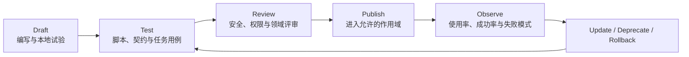
```mermaid
flowchart LR
    D[Draft<br/>编写与本地试验] --> T[Test<br/>脚本、契约与任务用例]
    T --> R[Review<br/>安全、权限与领域评审]
    R --> P[Publish<br/>进入允许的作用域]
    P --> O[Observe<br/>使用率、成功率与失败模式]
    O --> U[Update / Deprecate / Rollback]
    U --> T

```

Skill 的评估不应只看是否被模型选中。还要比较启用前后的任务成功率、步骤数、工具错误、人工修改量、成本和安全事件；对于很少被采用或持续降低效果的 Skill，应调整描述、缩小适用范围或下线。

线上 Trace 必须能够定位到具体 Skill 版本。`latest` 指针适合开发，不适合不可追溯的生产执行。Agent 版本可以锁定允许的 Skill 集与版本范围；紧急修复通过新 Agent 版本、受控热补丁或明确的策略覆盖生效，并触发相关回归集。

AgentScope 的 Skill Repository 可以连接项目目录、Git 或企业 Registry，使 Framework 路径下的能力资产按需发现；Qoder CLI / SDK 的 Skill 机制则复用成熟 Harness 的加载入口。无论入口如何，Skill 的所有权、依赖、权限、评估和版本都应纳入企业统一治理。

---

### 5.6 多租户资产治理与反退化

#### 用作用域和元数据建立资产边界

Context、Memory、Knowledge 和 Skill 都可能跨任务复用，但不能默认全局可见。企业应建立一致的作用域模型：

| 作用域 | 典型资产 | 默认可见范围 |
| --- | --- | --- |
| Global | 平台安全策略、通用基础 Skill | 所有获授权 Agent，通常只读 |
| Tenant | 企业制度、租户 Knowledge、租户 Skill | 单一企业或组织 |
| Project | 项目规则、代码规范、项目 Memory | 项目成员和关联 Agent |
| User | 个人偏好、个人历史经验 | 用户本人及明确委派任务 |
| Session | 当前交互偏好和临时输入 | 当前 Session |
| Task | Plan、Todo、Scratch、Artifact 和证据 | 当前 Task 及获授权父子任务 |

检索和 Context 构建必须先确定调用身份、租户、项目和任务，再查询允许作用域。不要先跨作用域召回再在生成端“提醒模型不要泄漏”，因为内容进入模型输入时，隔离已经失败。

每项资产都应携带最小治理元数据：来源、所有者、作用域、版本、创建与更新时间、权限、敏感级别、保留周期、内容摘要、派生关系和状态。Memory 还需要可信度与适用条件，Knowledge 需要生效时间与权威来源，Skill 需要依赖和评估基线，Context Summary 需要覆盖事件范围。

统一元数据使 Harness 可以用同一套 Policy 决定“能否读取、能否写入、如何引用、何时过期、如何删除”，也使 Agent 版本能准确绑定所依赖的资产版本。

#### 防止污染并支持真正的删除

1.  **记忆污染**：错误推测、失败轨迹或恶意输入被长期写入，并在未来任务中被当作经验。
    
2.  **指令污染**：外部文档、工具结果或 Memory 中的文字被错误提升为高优先级行为规则。
    
3.  **跨租户污染**：索引、缓存、摘要、Artifact 或评估数据把一个租户的信息带入另一个租户。
    

防护需要覆盖写入和读取两端。写入时进行来源识别、验证、敏感数据检测、作用域绑定和冲突检查；读取时进行身份过滤、信任标记、指令与数据分离、最小披露和输出审查。高风险 Memory 可以先进入候选区，经过人工或规则验证后再发布。

企业要能够从稳定资产 ID 追踪派生链：原始文档产生了哪些切片、向量、摘要和实体；某条 Memory 是否被合并到更高层总结；某个 Skill 是否引用了已经下线的模板。当用户请求删除、数据保留期到期或来源失效时，系统需要：

*   禁止新的读取与 Context 注入；
    
*   删除或隔离原始内容；
    
*   清理索引、缓存、摘要和其他派生数据；
    
*   更新引用该资产的 Manifest 与 Skill；
    
*   保留法律允许且最小化的审计证明；
    
*   触发受影响 Agent 版本的验证或重新发布。
    

“遗忘”有时是权重衰减，有时是彻底删除，二者必须在策略中区分。需要撤回的数据不能只通过降低检索分数来处理。

#### 把资产变更纳入反退化闭环

Context Policy、Memory、Knowledge 和 Skill 的任何更新都可能改变 Agent 行为。企业应把资产变更纳入与代码相同的发布链：

```text
资产变更
  → 结构与权限校验
  → 受影响 Agent / 用例分析
  → 离线回放与安全评估
  → 灰度进入新 Agent 版本
  → Trace 与 Outcome 监测
  → 保留、修订或回滚

```

反退化不仅是防止成功率下降，还要监测成本、延迟、引用准确性、跨租户泄漏、错误 Memory 使用、Skill 误选和上下文膨胀。一个资产可能提升某类任务，却损害另一类任务，因此评估必须按场景、租户、风险和任务复杂度分层。

#### 三种构建路径如何实现上下文与状态

同一套逻辑能力在不同构建路径中的责任边界不同：

| 能力 | AgentScope Framework | Qoder CLI / Agent SDK | Qoder Cloud Agents |
| --- | --- | --- | --- |
| Context 装配 | 应用团队组合规则、Middleware、Workspace 与检索器 | 复用成熟 Harness，应用通过指令、项目文件、Skill 和 SDK 选项提供业务上下文 | 平台推进 Session，企业通过 Agent 配置、Environment 和 Event 提供上下文 |
| Session / Task | 团队定义状态 Schema 与存储接口，调优空间最大 | SDK 提供 Session 与 Resume；企业补齐多租户任务服务和外部 Session Store | 平台托管 Session 与 Event；企业保存业务任务映射和结果 |
| Workspace / Artifact | 自定义本地、共享或沙箱文件系统及生命周期 | 以 `cwd` 和工作区运行，企业外置重要 Artifact | 由 Environment 和托管执行环境承载，应用通过事件与结果引用访问 |
| Memory / Knowledge | 可深度定制写入、检索、双层记忆和权限策略 | 利用项目上下文、Skill 与外部工具接入企业事实 | 企业将权威数据和工具接入托管 Agent，长期资产仍由企业治理 |
| Skill | 自建 Repository、版本和效果评估 | 复用 CLI / SDK 的 Skill 加载机制 | 固化进 Agent 配置或由工具与环境提供，随可运行版本受控发布 |

Framework 路径由企业为 Context 选择和状态正确性负责，适合业务差异大、资产治理要求高的场景；SDK 路径复用成熟 Harness，但多租户隔离、共享存储和业务验收仍由企业补齐；Managed Agents 托管更多 Session 与执行基础，却不会替企业决定哪些知识可见、哪些记忆可写、哪些 Skill 可以在某个租户中使用。

---

### 5.7 本章小结

Harness 上下文与状态系统的目标，是在有限模型窗口与持续增长的任务世界之间建立可靠边界。Context Builder 将平台策略、Agent 指令、任务状态、历史、Memory、Knowledge、Skill 和 Tool 描述按身份、可信度、相关性与 Token 预算动态编译，并用 Context Manifest 保持可解释性。压缩、卸载和 Reset 负责控制窗口增长，但任何关键事实都必须先保存到权威状态。

Session 表达交互连续性，Task 表达可验收目标，Workspace 承载模型窗口之外的工作记忆；Event Log、Snapshot 和 Checkpoint 分别记录过程、当前视图和安全恢复点。Memory 保存经选择的经验，Knowledge 提供带来源和权限的企业事实，Skill 则把可复用行动方法变成可发现、可测试、可发布的能力资产。所有这些资产都必须具有明确作用域、版本、所有者、保留与删除语义，并与 Agent 版本绑定。

下一章将进入 Harness 的第三类工程契约：行动。即模型产生行动意图之后，系统如何连接 Tool、MCP、远程 Agent 和执行环境，如何用 Sandbox、Permission 与 HITL 控制副作用，并通过交互事件、Trace 和 Evaluation 把真实结果反馈到下一次 Harness 迭代。


<a id="sec-012"></a>

## 第 6 章　行动：受控执行、验证反馈与交付准备
模型输出的工具调用只是一项行动意图。它没有自动获得当前用户身份，不等于企业策略允许执行，也不能证明远程系统已经产生预期结果。真正把意图转化为行动的是 Harness：它选择并披露能力，校验参数，绑定身份与凭证，执行权限和审批策略，在隔离环境中运行，将结果转换为 Observation，再把任务过程交给用户、观测和评估系统。

本章把这些能力统一称为 Harness 的行动与反馈系统。它包含两条相连的链路：Action Plane 负责连接外部世界并限制影响范围；Feedback Plane 负责把执行进度、状态、结果和质量信号反馈给用户与下一个 Agent 版本。Tool、MCP、A2A、Sandbox、HITL、AG-UI、A2UI、Trace 和 Evaluation 在这套架构中各有位置，而不是一组并列的协议或产品名称。

第 4 章已经定义何时行动和如何推进任务，第 5 章定义行动所依赖的上下文与状态。本章进一步回答：行动怎样被注册、授权和执行，人与应用怎样持续干预，真实执行结果又怎样成为 Harness 演进的依据。

本章继续使用“生产服务漏洞修复与变更发布 Agent”作为贯穿案例。前两章已经让它完成计划、补丁和测试，本章将重点观察最后一公里：Agent 如何获得仓库和安全扫描工具，代码如何在隔离环境中执行，变更单为什么可以自动创建而生产发布必须等待审批，用户如何在断线后继续查看任务，以及一次失败怎样从 Trace 进入下一版 Harness。

---

### 6.1 Harness Action Plane

#### 6.1.1 从模型意图到环境事实

一个完整的行动链不应从“调用 Tool”开始，也不应在“返回文本”处结束：

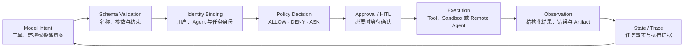
```mermaid
flowchart LR
    M[Model Intent<br/>工具、环境或委派意图] --> S[Schema Validation<br/>名称、参数与约束]
    S --> I[Identity Binding<br/>用户、Agent 与任务身份]
    I --> P[Policy Decision<br/>ALLOW · DENY · ASK]
    P --> H[Approval / HITL<br/>必要时等待确认]
    H --> E[Execution<br/>Tool、Sandbox 或 Remote Agent]
    E --> O[Observation<br/>结构化结果、错误与 Artifact]
    O --> T[State / Trace<br/>任务事实与执行证据]
    T --> M

```

这条链路建立三个必须区分的事实：

1.  **模型看见某个工具**，表示 Tool 描述进入了当前 Context。
    
2.  **Harness 注册某个工具**，表示系统知道如何调用和解析它。
    
3.  **当前用户和任务获得执行授权**，才表示这次具体行动可以发生。
    

三者不是同一件事。企业可以在 Registry 中注册大量能力，却只向当前模型披露少数相关能力；模型能够描述高风险动作，也仍需 Policy 和审批决定是否执行。若“出现在 Tool Schema 中”就等价于“可以调用”，最小权限、用户委派和阶段性只读模式都无法成立。

#### 6.1.2 用统一行动契约约束不同能力

模型可能通过 Function Calling 请求 Tool，也可能要求 Shell、浏览器、Computer Use 或远程 Agent。Harness 应先把这些不同表达转换为统一 Action Request：

```text
Action Request
├── action_id / task_id / parent_event_id
├── capability_id / version
├── arguments and expected output schema
├── actor: user / service / agent identity
├── purpose and current task stage
├── requested environment and resource scope
├── side-effect / reversibility / risk classification
├── idempotency key and timeout
└── approval and audit requirements

```

统一请求使预算、权限、审计、重试和 Trace 不必为每一种连接方式重新实现。模型产生的自由文本说明只能作为 `purpose` 的候选输入，能力名称、参数类型、影响范围和身份必须由确定性代码解析与校验。

Action 本身也应有生命周期：`REQUESTED → VALIDATED → AUTHORIZED / WAITING_APPROVAL → RUNNING → SUCCEEDED / FAILED / CANCELLED`。对于外部异步系统，还可能进入 `ACCEPTED` 或 `WAITING_RESULT`。任务状态与 Action 状态相关，但不能混为一谈：一个 Tool 失败不一定使整个 Task 失败，一个 Task 取消也可能需要等待已提交 Action 返回后再补偿。

Action Result 不应只有模型可读文本，至少应包括：

*   成功、失败、未知或部分完成状态；
    
*   结构化数据与面向模型的紧凑 Observation；
    
*   原始结果、日志或 Artifact 的稳定引用；
    
*   错误类别、可重试性和是否已产生副作用；
    
*   实际执行身份、环境、时间、版本和成本；
    
*   对 Task State 的候选 Patch；
    
*   可供 Verifier 使用的环境证据。
    

Harness 统一提交 State Patch，避免每个 Tool 任意修改任务权威状态。大结果按第 5 章的规则卸载，敏感字段在进入 Context 和交互事件前分别脱敏。

每个 Agent 版本都应明确：可发现和可执行的能力集合、Action Schema、身份传递方式、风险等级、超时与幂等、环境需求、Observation 格式和验收证据。Runtime、Sandbox 和 Gateway 可以采用不同实现，但必须兑现这份契约。

这也是自建与托管路径的共同边界。AgentScope 路径由应用团队实现 Action Plane 或接入企业网关；Qoder CLI / SDK 复用成熟的工具和权限执行能力；Qoder Cloud Agents 在托管 Session 与隔离环境中执行工具。无论谁承载，企业都要知道一次行动以谁的身份、在哪个环境、依据什么策略发生，并能够关联到最终 Outcome。

#### 6.1.3 案例：创建变更单与执行发布是两个 Action

漏洞修复 Agent 已经生成补丁和验证报告。此时“创建变更单”与“发布生产环境”不能被包装成一个模糊工具，因为它们的身份、风险、可逆性和审批要求完全不同。创建变更单的请求可以表示为：

```yaml
action_id: act-241
task_id: remediation-2026-0917
capability: change.create@v3
actor:
  user: u-1842
  agent: remediation-agent@12
purpose: 为已验证的漏洞修复创建待审批变更
arguments:
  service: payment-service
  patch_ref: artifacts/remediation.patch
  evidence_refs:
    - evidence/unit-test.xml
    - evidence/security-scan.sarif
risk: medium
reversible: true
idempotency_key: remediation-2026-0917:create-change
policy_decision: ALLOW

```

`production.deploy` 则应成为新的 Action：它引用已经创建的变更单和批准版本，风险为高，Policy 返回 `ASK`，进入 `WAITING_APPROVAL`。即使两个动作最终调用同一变更平台，Harness 也能分别授权、审计、重试和验证。企业 Tool 设计应优先暴露这种业务语义，而不是让模型通过通用 HTTP 或 Shell 自行拼接生产操作。

---

### 6.2 工具、MCP 与远程 Agent

#### 6.2.1 Function Calling、MCP 与 A2A 的职责边界

这三者处理的是不同连接层次：

*   **Function Calling** 让模型用结构化形式表达“想调用哪个能力、提供什么参数”。它是模型与 Harness 之间的意图接口。
    
*   **MCP** 让 Agent Host 以标准方式发现和连接工具、资源等外部能力。它是 Harness 与能力提供方之间的连接协议。
    
*   **A2A** 面向拥有独立任务循环、状态和自主性的远程 Agent。它传递任务、消息、状态和 Artifact，而不只是执行一个函数。
    

协议不会替 Harness 完成授权、租户隔离、业务语义验证和效果评估。MCP Server 能描述工具，不代表调用方有权访问底层数据；A2A Agent 声明任务完成，也仍需委派方按契约验收。

#### 6.2.2 面向 Agent 的 Tool 设计

Tool 是 Harness 交给模型的行动单元。模型能否正确使用，取决于 Tool 是否提供清晰、稳定、可约束的语义，而不仅是 API 能否调用。

一个适合 Agent 的 Tool 应做到：

*   名称和描述说明业务目的、适用条件与非目标。
    
*   输入 Schema 使用明确类型、枚举、边界和示例，避免让模型拼接任意请求。
    
*   输出区分结构化结果、面向模型的摘要和原始证据引用。
    
*   明确是否只读、是否有副作用、是否可逆、是否支持预览和幂等。
    
*   错误采用稳定分类，告诉 Harness 能否重试、需要修正参数还是转人工。
    
*   将认证和 Secret 留在执行侧，不放入 Tool 描述或模型 Context。
    

工具粒度过粗，会让一次调用影响范围过大，审批和验证都难以精确；粒度过细，则需要模型编排大量低级步骤，增加错误与成本。合理粒度通常对应一个可描述、可授权、可观察和可验证的业务动作。

例如，`change.create` 的 Schema 应要求服务名、补丁引用、验证证据和回滚说明，而不是只接收一段自由文本；返回值应包括稳定 `change_id`、对象版本、可审批状态和系统查询入口。这样模型负责选择与补齐业务参数，Harness 负责确定性校验，Verifier 能再次查询真实变更单，而不必解析自然语言回执。

#### 6.2.3 Registry、Gateway 与渐进式披露

Tool、MCP Server 和 Remote Agent 都应进入统一或可关联的能力目录。Registry 负责能力元数据、所有者、版本、健康、作用域和依赖；Gateway 负责协议入口、身份、凭证、路由、限流、审计和策略执行；Harness 则根据任务选择候选能力，并向模型渐进式披露。

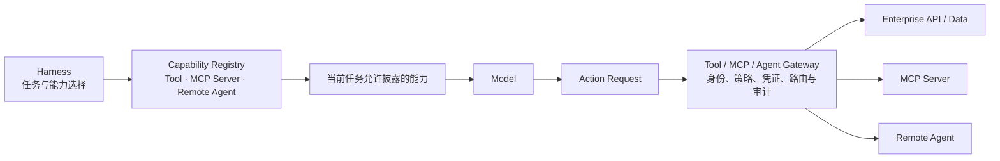
```mermaid
flowchart LR
    H[Harness<br/>任务与能力选择] --> R[Capability Registry<br/>Tool · MCP Server · Remote Agent]
    R --> D[当前任务允许披露的能力]
    D --> M[Model]
    M --> A[Action Request]
    A --> G[Tool / MCP / Agent Gateway<br/>身份、策略、凭证、路由与审计]
    G --> T[Enterprise API / Data]
    G --> S[MCP Server]
    G --> X[Remote Agent]

```

当能力数量较少且信任边界简单时，Harness 可以直连；当多个 Agent、框架和团队共享大量能力时，Registry 与 Gateway 可以避免凭证和治理逻辑在每套 Harness 中重复。详细的网关实现将在第 10 章展开。

#### 6.2.4 Tool、MCP Server、Skill、Subagent 与 Remote Agent 的边界

| 对象 | 是否有独立 Agent Loop | 主要封装 | 状态与责任 | Harness 中的使用方式 |
| --- | --- | --- | --- | --- |
| Tool | 否 | 一个可执行动作 | 调用方负责组合和验收 | 产生一次 Action Request |
| MCP Server | 否，协议本身不要求 | 一组工具、资源等能力 | Server 负责能力实现，Host 负责选择、授权与集成 | 发现后注册为 Tool / Resource |
| Skill | 否 | 完成某类任务的方法、脚本和资料 | 当前 Agent 仍负责 Loop 与结果 | 按需加载到 Context 并调用 Tool |
| Subagent | 是，通常由同一 Harness 或平台承载 | 有边界的子任务执行者 | 父 Agent 保留总体责任 | 本地 Delegation，父子状态可直接关联 |
| Remote Agent | 是，独立部署和治理 | 可持续执行的外部任务能力 | 远程 Agent 对其任务承诺负责，委派方负责最终采用 | 通过 A2A 或 Agent API 建立远程任务 |

这张表能避免两种常见混淆。把固定 API 包装成“Agent”不会自动获得规划和恢复能力；把复杂远程 Agent 当作同步 Tool，则会丢失任务状态、异步事件和 Artifact 语义。

#### 6.2.5 连接远程 Agent

第 4 章已经定义 Delegation 的编排语义。跨系统委派还要增加互操作契约：

*   远程 Agent 的身份、能力声明、版本和服务边界；
    
*   任务目标、输入、上下文引用与数据使用限制；
    
*   `remote_task_id` 与本地 `task_id` 的关联；
    
*   状态、进度、消息、Artifact 和错误的映射；
    
*   超时、取消、幂等、重试与回调语义；
    
*   凭证委派、租户边界和可审计的代表关系；
    
*   结果 Schema、证据和最终验收标准。
    

远程 Agent 不应获得父 Agent 的全部 Context。委派方发送最小必要信息，并将数据使用限制作为机器可执行策略一并传递。接收方返回的消息和 Artifact 都是外部输入，必须经过 Schema、权限和内容安全检查，不能因为来源是另一个 Agent 就被视为可信系统指令。

如果能力是短时、参数明确且结果可立即返回的动作，优先使用 Tool / Function Calling；如果需要跨 Host 复用工具或数据能力，可采用 MCP；如果能力拥有自己的任务循环，需要异步状态、进度、消息和 Artifact，则使用 A2A 或等价 Agent API。企业可以在内部保留专有协议，但应在 Harness 边界转换为统一 Action 与 Event 语义，避免协议差异侵入核心 Loop。

在本章案例中，读取依赖清单适合本地 Tool，连接企业安全扫描平台可以使用 MCP Server，委派给独立安全团队维护的审计 Agent 则适合 A2A 或企业 Agent API。协议选择由能力是否拥有独立任务循环、是否需要异步状态和 Artifact 决定，而不是由协议的新旧或流行程度决定。

---

### 6.3 执行环境与 Sandbox 契约

Agent 不只通过业务 API 行动，还可能直接使用 File、Shell、Code Interpreter、Browser 和 Computer Use。这些能力给模型提供了通用操作空间，也显著扩大了副作用和攻击面。Harness 需要声明完成任务所需的 Environment，Runtime 与 Sandbox 则负责真正创建、隔离和销毁它。

| 环境能力 | 典型用途 | 主要风险 | 必要控制 |
| --- | --- | --- | --- |
| File | 读取、搜索、修改工作区文件 | 越界读取、覆盖、路径穿越、敏感文件泄漏 | 根目录、读写范围、版本和变更集 |
| Shell | 执行命令、构建、测试和系统检查 | 任意代码、进程逃逸、网络与 Secret 暴露 | 命令策略、用户权限、资源和网络隔离 |
| Code Interpreter | 数据处理、代码运行与文件生成 | 不受控依赖、资源耗尽、恶意输入执行 | 临时环境、包策略、CPU/内存/时间限制 |
| Browser | 页面检索、表单和 Web 系统操作 | Prompt Injection、会话劫持、误提交 | 域名策略、下载隔离、操作确认、内容信任标记 |
| Computer Use | 操作通用桌面和应用 | 影响面难预测、视觉误判、不可逆操作 | 应用范围、屏幕/输入隔离、预览与人工确认 |

Tool 常把复杂操作压缩成受 Schema 约束的业务动作，环境接口则更通用、更灵活。能用窄 Tool 完成的高风险动作，通常不应优先开放通用 Shell 或 Computer Use；当企业需要处理长尾应用和非结构化工作区时，再用 Sandbox 把通用能力限制在可接受边界内。

#### 6.3.1 声明并兑现 Environment Contract

Harness 不应假定“本机一定有某目录、某版本依赖或可访问公网”，而应提交 Environment Contract：

```text
Environment Contract
├── image / OS / architecture
├── filesystem mounts and read-write scope
├── network egress / ingress policy
├── secret references and delegated identity
├── required tools, packages and versions
├── CPU / memory / storage / GPU quotas
├── timeout, idle policy and concurrency
├── persistence / snapshot requirement
└── audit and cleanup policy

```

Runtime 根据契约选择本地、共享、托管或自托管环境，Sandbox 将逻辑要求落实为进程、容器、虚拟机或其他隔离机制。如果环境无法满足，Action 应在执行前失败或请求降级，而不是让模型进入不确定状态后自行猜测。

| 形态 | 优点 | 限制 | 适合场景 |
| --- | --- | --- | --- |
| 本地工作区 | 访问用户真实文件和应用，交互延迟低 | 环境差异大，影响用户设备，难以集中治理 | IDE、CLI、个人工作区 Agent |
| 共享远程环境 | 复用基础设施和缓存 | 租户隔离、并发冲突与残留数据风险高 | 受控内部开发与低风险任务 |
| 托管隔离环境 | 按 Session / Task 快速创建，生命周期清晰 | 数据边界、镜像定制和网络接入需评估 | 在线、异步、批量 Agent |
| 企业自托管 Sandbox | 数据和工具执行留在企业网络 | 企业承担容量、补丁和隔离质量 | 强合规、私域数据和内网工具 |

托管 Harness 与自托管 Sandbox 可以组合：推理和任务编排由平台管理，实际工具执行留在企业环境。关键是 Session、Harness 与 Sandbox 之间使用稳定事件、状态和身份契约，不能把长期 Secret 或完整企业数据复制到托管控制侧。

环境可以按 Agent、Session、Task 或 Action 隔离。粒度越细，污染和横向移动风险越低，但创建成本和状态传递成本越高。在线多租户任务通常至少按 Task 或 Session 隔离；同一用户的长期工作区可以持久化，但要把可共享基础镜像与私有可写层分开。

环境生命周期包括：创建、准备、挂载输入、运行、快照、恢复、清理和销毁。销毁前应明确 Artifact 和证据已经转存，临时凭证已经撤销；恢复时要验证镜像、依赖、文件版本和外部对象是否仍与 Checkpoint 一致。

Qoder Cloud Agents 以 Environment 描述运行配置：在 cloud 模式下为每个 Session 提供托管隔离环境，也支持通过 self\_hosted 环境由企业侧承载工具执行；AgentScope 可通过可插拔 FileSystem 和 Sandbox 适配本地、远程或企业自建环境。产品实现不同，Harness 依赖的仍是同一 Environment Contract。

#### 6.3.2 让代码修改只发生在隔离工作区

Framework 路径中，应用团队可以把 Sandbox 作为 Harness 的文件系统实现，而不是让模型直接操作宿主机。下面的 AgentScope 示例为每个 Session 绑定 Docker 文件系统；项目规则、Skill 和输入文件投影到隔离工作区，补丁与测试结果再作为 Artifact 取回。

```java
HarnessAgent agent = HarnessAgent.builder()
    .name("remediation-agent")
    .model(model)
    .workspace(workspace)
    .filesystem(new DockerFilesystemSpec()
        .image("ubuntu:24.04"))
    .build();

agent.call(message, RuntimeContext.builder()
    .userId("u-1842")
    .sessionId("remediation-2026-0917")
    .build()).block();

```

生产部署还要为镜像固定摘要，限制网络与资源，为持久工作区配置快照，并在多副本并发恢复时增加执行租约。AgentScope 也可以将 `StateStore` 与 Sandbox Snapshot 接到 Redis、数据库和对象存储，或通过统一分布式存储配置完成多节点接续。代码示例展示的是 Harness 接口，不代表默认 Docker 配置已经满足生产隔离要求。

对贯穿案例而言，Sandbox 允许修改 `payment-service` 副本并执行构建，却不提供生产集群凭证；发布只能通过受控 `production.deploy` Tool 发起。即使工作区中的恶意文件诱导模型执行部署命令，Sandbox 网络与 Secret 边界仍阻止它绕过企业 Action Plane。

#### 6.3.3 Secret、网络与数据出站

Secret 不应出现在 System Prompt、Tool Schema、Task State 或模型可见环境变量中。执行侧应根据 Action、身份和目的获取短时凭证，只注入目标工具或进程，并记录使用而不记录密文本身。

网络策略应默认限制出站目标、协议和数据量。浏览器访问的网页、下载文件和工具返回必须被标记为不可信内容；高敏数据出站需要额外策略或审批。Sandbox 防止进程越界，Policy 决定业务上是否允许，二者缺一不可。

运行时资源调度、镜像供应链、快照后端、容灾和规模化 Sandbox 将在第 7—9 章展开；本章的 Build 交付物是可验证、可移植的环境与隔离要求。

---

### 6.4 Permission、HITL 与安全控制

#### 6.4.1 让身份、资源与风险共同参与决策

Harness 需要同时记录三类信息：发起任务的用户或服务身份、发起行动的 Agent 版本、实际执行 Tool 或 Sandbox Action 的 Runtime 身份。一次调用可以使用服务身份，也可以传递用户委派，但必须明确数据访问和副作用最终归属于谁。

权限决策至少考虑：主体、租户、任务目的、能力、参数、目标资源、环境、当前阶段、数据敏感度、影响范围、可逆性、预算和历史审批。仅按 Tool 名称做静态白名单，无法区分“读取一条测试记录”和“导出整个生产库”。

Harness 可以将策略结果统一为三类：

*   **ALLOW**：当前条件下可直接执行，并记录决策依据。
    
*   **DENY**：无论模型如何解释都不得执行，向 Loop 返回结构化原因和允许替代项。
    
*   **ASK**：动作可以执行，但需要指定的人或系统确认。
    

`ASK` 不是默认兜底。过多审批会让用户形成机械确认，也让 Agent 失去连续性。应该优先通过更窄 Tool、参数约束、预览、资源范围和 Sandbox 降低风险，只在目的或后果无法由策略充分判断时请求人工参与。

| 风险示例 | 建议默认策略 |
| --- | --- |
| 读取当前项目内非敏感文件 | ALLOW，记录范围 |
| 查询当前用户有权查看的业务数据 | ALLOW 或基于数据等级 ASK |
| 修改工作区文件但尚未提交外部系统 | ALLOW，并提供 Diff 与可撤销能力 |
| 发送外部消息、发布、支付、删除或改变生产数据 | ASK 或 DENY，要求预览和明确影响 |
| 访问跨租户数据、绕过安全控制、请求长期 Secret | DENY |

#### 6.4.2 在真正需要判断的位置引入 HITL

HITL 可以出现在三个层次：

1.  **Plan 审批**：在进入执行前确认目标、范围、方案和影响面。
    
2.  **Action 审批**：对某次具体 Tool、环境或远程 Agent 调用进行批准、拒绝或修改。
    
3.  **结果验收**：对高影响 Artifact 或业务结果做最终签署。
    

审批请求应包含：Agent 想做什么、为什么、以谁的身份、作用于什么对象、预计影响、参数和差异、是否可逆、失败如何处理，以及批准范围是仅本次、当前 Task 还是一类受限动作。用户批准后，Harness 仍要重新校验对象版本和策略，防止等待期间环境已经变化。

不可逆或高影响动作可以统一采用“Preview—Approve—Commit—Verify”模式：Preview 展示接近实际提交的内容和影响；Approve 绑定身份、范围和对象版本；Commit 使用幂等键执行；Verify 查询真实系统状态。无法回滚的动作必须在 Preview 中明确说明，验证失败则进入 Repair、Compensate 或 Escalate，而不是把已发送的请求当作成功。

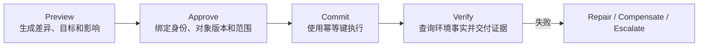
```mermaid
flowchart LR
    P[Preview<br/>生成差异、目标和影响] --> A[Approve<br/>绑定身份、对象版本和范围]
    A --> C[Commit<br/>使用幂等键执行]
    C --> V[Verify<br/>查询环境事实并交付证据]
    V -->|失败| X[Repair / Compensate / Escalate]

```

#### 6.4.3 ：把审批接入企业界面

在 SDK 路径中，企业应用可以把 Harness 的工具授权回调接到自有审批界面。下面的 Qoder Agent SDK 示例将 Read 预授权；其他工具按权限规则和运行时策略处理。需要审批的调用通过 canUseTool 交给应用，由应用展示关联任务、工具与参数，并把批准或拒绝结果返回给当前 Tool Use：

```ts
import { accessTokenFromEnv, query } from '@qoder-ai/qoder-agent-sdk';

for await (const message of query({
  prompt: '读取验证报告并生成变更单；写入或提交前必须询问。',
  options: {
    auth: accessTokenFromEnv(),
    permissionMode: 'default',
    allowedTools: ['Read'],
    async canUseTool(toolName, input, context) {
      const approved = await showApprovalDialog({
        taskId: 'remediation-2026-0917', toolName, input,
      });
      if (!approved) {
        return {
          behavior: 'deny',
          message: '用户拒绝了本次操作，请保留草稿并说明未完成项。',
          toolUseID: context.toolUseID,
        };
      }
      return { behavior: 'allow', updatedInput: input,
               toolUseID: context.toolUseID };
    },
  },
})) publish(message);

```

回调只是交互入口，企业后端仍应依据当前登录身份、租户、资源版本和 Policy 再做一次确定性判断。对生产发布，审批结果应生成短时、限定目标的授权，而不是把整个 Session 切换成无条件放行模式。

**Steering、Interrupt 与 Resume。**

人工参与不只发生在审批点。用户还需要在任务运行中追加信息、改变优先级、缩小范围、暂停或取消。Harness 应把 Steering 表示为高优先级任务事件，由第 4 章的状态机在安全点处理；对紧急中断，可以取消可中断行动并阻止新 Action。

恢复前，Harness 要把用户新要求提交到 Task State，判断现有 Plan、权限和后台任务是否仍有效，再重新构建 Context。直接把一条用户消息追加到长历史末尾，可能无法覆盖已经进入执行队列的旧计划。

#### 6.4.4 Guardrail 与 Prompt Injection 防护

Guardrail 可以部署在输入、Context 构建、Action 请求、Tool 结果和输出阶段，但它不应成为唯一安全边界。对确定可编码的权限和资源限制，应使用 Policy 与 Sandbox；模型或分类器适合识别复杂语义风险、敏感内容和可疑意图，并把结果作为额外信号。

Prompt Injection 的关键防线是区分指令与数据。网页、邮件、文档、MCP Server、工具结果和远程 Agent 返回的内容都属于不可信输入，不能改变平台政策、授权范围或当前 Tool Set。Harness 应保留内容来源，限制外部文本进入高优先级指令层，对数据外传和高风险 Action 做独立授权，并在必要时隔离读取与执行阶段。

完整威胁模型、身份体系、MCP 安全、Sandbox 逃逸和合规审计将在“治理（Governance）”篇展开。本节给出的是 Build 阶段必须嵌入 Harness 的执行控制点。

---

### 6.5 Streaming、Channel 与交互协议

#### 6.5.1 面向任务语义的事件流

长任务如果只在结束时返回一段文本，用户无法知道 Agent 当前在做什么、是否等待审批、是否遇到阻塞，也无法及时纠偏。Harness 应产生一组与内部事件对应、经过脱敏的外部语义事件：

| 事件类别 | 典型内容 | 界面或调用方用途 |
| --- | --- | --- |
| Text | 文本增量、最终说明 | 实时展示模型对用户的可见输出 |
| Progress | 当前阶段、Todo、百分比或里程碑 | 解释任务正在推进到哪里 |
| Tool | 工具意图、执行状态、紧凑结果 | 展示行动与失败，不泄露 Secret |
| State | Running、Waiting、Paused、Completed 等 | 驱动界面和上层业务状态机 |
| Approval | 预览、风险、选项与决策结果 | 呈现 HITL 控件 |
| Artifact | 文件、报告、Diff、链接和版本 | 交付可检查结果 |
| Error | 错误分类、可重试性与下一步 | 恢复、转人工或告警 |
| Usage | Token、费用、预算和资源 | 成本展示与预算控制 |

模型内部的隐藏推理不需要通过 Streaming 暴露。用户真正需要的是任务状态、可见说明、行动、证据和可操作选项。

#### 6.5.2 Channel 的职责

Channel 是 Agent 与 Web、App、IDE、CLI、企业 IM 或其他入口之间的适配层。它不负责重写 Harness，而是处理：

*   将外部用户和组织身份映射到平台身份；
    
*   将消息线程映射到 Session，并选择或创建 Task；
    
*   把附件、回复、按钮和命令转换为统一输入事件；
    
*   将 Harness 事件转换为渠道支持的消息、卡片和状态；
    
*   在用户从一个入口切换到另一个入口时保持任务连续；
    
*   实施渠道级内容限制、速率、脱敏和审计。
    

Session 和 Task 的分离在这里尤其重要：一个 IM 线程可以查看后台 Task，IDE 中创建的 Task 也可以在 Web 控制台继续审批。Channel 不应成为唯一状态存储。

#### 6.5.3 AG-UI 与 A2UI

**AG-UI** 适合表达 Agent 与应用之间的双向、流式交互事件，使前端不必依赖某个 Framework 的内部对象。它可以承载运行生命周期、文本、工具、状态和中断等语义。采用时，企业仍需决定内部事件到外部事件的映射、字段脱敏、身份绑定和恢复游标。

**A2UI** 适合让 Agent 输出声明式界面，例如表单、卡片、列表和动作。客户端使用本地受信组件目录渲染，而不是执行模型生成的任意代码。A2UI 描述“界面是什么”，AG-UI 处理“Agent 与应用如何交换事件”；A2UI Payload 可以通过 AG-UI 或其他传输发送，两者并不互相替代。

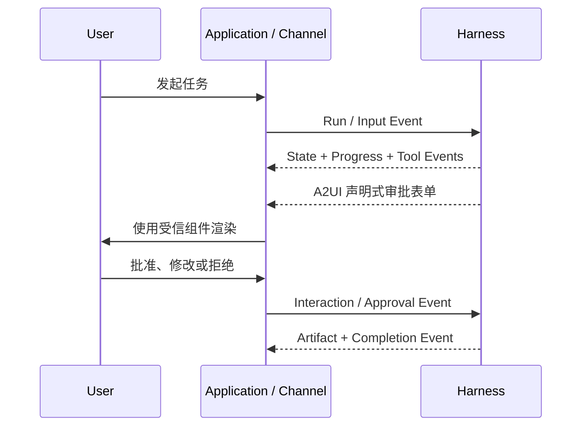
```mermaid
sequenceDiagram
    participant U as User
    participant UI as Application / Channel
    participant H as Harness

    U->>UI: 发起任务
    UI->>H: Run / Input Event
    H-->>UI: State + Progress + Tool Events
    H-->>UI: A2UI 声明式审批表单
    UI->>U: 使用受信组件渲染
    U->>UI: 批准、修改或拒绝
    UI->>H: Interaction / Approval Event
    H-->>UI: Artifact + Completion Event

```

#### 6.5.4 让事件可以续传、限流和按身份展示

事件流必须假定网络会断开、客户端会重复连接、消费者速度不同。每个事件要有单调序号或可恢复游标；客户端重连时从最后确认位置续传，服务端支持去重；快消费者可以实时接收增量，慢消费者可以先读取状态快照再补充关键事件。

对于高频文本 Token 或细粒度工具日志，系统可以合并、采样或仅在调试模式下发送；状态、审批、Artifact 和终态事件则不能因背压被丢弃。用户发出 Cancel 或 Interrupt 后，Channel 要尽快确认请求已经进入状态机，并区分“已收到取消”和“底层 Action 已安全停止”。

同一 Task 在不同 Channel 中显示的内容可能不同。开发控制台可以查看详细 Tool 和 Trace，面向客户的应用只展示业务进度；审批人能查看影响对象，普通观察者只能看到等待状态。事件发布前要根据接收者身份与 Channel 能力生成视图，不能把内部 Trace 原样广播。

协议的价值是降低适配成本，语义契约才决定体验能否一致。企业应先稳定 Task、Event、Approval 和 Artifact 模型，再选择 AG-UI、A2UI、WebSocket、SSE 或消息平台接口作为具体承载。

#### 6.5.5 用 Session 与 Event 承载托管任务

Managed Agents 路径由平台承载 Agent Loop、会话和执行基础，应用负责事件消费与重连。Qoder Cloud Agents 以 Agent、Environment、Session、Event 组织调用。下面使用两个 Bash 终端和 curl、jq，代码中的 A、B 两段分别复制到对应终端执行。Agent 与代码 Environment 已创建，相关环境变量已设置，两个终端使用相同的 API 地址与访问令牌。终端 A 创建 Session 并确认 SSE 建连后，终端 B 再向同一 Session 发送任务：

```bash
# 终端 A：创建 Session，并保持 SSE 连接
set -euo pipefail
SESSION_ID=$(curl -fsS -X POST \
  "$QODER_API_BASE_URL/api/v1/cloud/sessions" \
  -H "Authorization: Bearer $QODER_ACCESS_TOKEN" \
  -H "Content-Type: application/json" \
  --data "$(jq -nc --arg agent "$AGENT_ID" --arg env "$ENV_ID" \
    '{agent: $agent, environment_id: $env}')" | jq -er '.id')
printf 'SESSION_ID=%s\n' "$SESSION_ID"

curl -fsS -i -N \
  "$QODER_API_BASE_URL/api/v1/cloud/sessions/$SESSION_ID/events/stream" \
  -H "Authorization: Bearer $QODER_ACCESS_TOKEN" \
  -H "Accept: text/event-stream"

# 以下在终端 B 执行，保持终端 A 的连接运行。
# 确认 A 已返回 HTTP 200 和 Content-Type: text/event-stream 后再提交。
# B 使用相同的 QODER_API_BASE_URL 和 QODER_ACCESS_TOKEN。
SESSION_ID="sess_替换为终端A输出的完整ID"
curl -fsS -X POST \
  "$QODER_API_BASE_URL/api/v1/cloud/sessions/$SESSION_ID/events" \
  -H "Authorization: Bearer $QODER_ACCESS_TOKEN" \
  -H "Content-Type: application/json" \
  --data '{"events":[{"type":"user.message","content":[{"type":"text","text":"生成可审批的漏洞修复变更，不要直接发布"}]}]}'
```

事件流可以返回 session.status\_running、agent.message、agent.tool\_use、agent.tool\_result 和 session.status\_idle 等语义事件。客户端应在完整事件处理成功后保存其 ID，断线后用 Last-Event-ID 续接，必要时通过 List Events 补齐历史，并对完整事件按 ID 幂等处理。WAITING\_APPROVAL 是本文的抽象状态；QCA 等待工具确认或客户端结果时会返回 session.status\_idle，且 stop\_reason.type 为 requires\_action，应读取 stop\_reason.event\_ids 处理待响应动作，不能仅凭 idle 判定完成。企业应用应将 Session ID 关联到 Task、租户和审批单，并为不同 Channel 生成安全视图。

Cloud Agents 提供托管执行及 Outcome 评估与反馈修订；企业负责业务验收标准、证据来源与发布审批。需要确认的内置或 MCP 工具调用，由应用向原 Session 回传 user.tool\_confirmation，并用 tool\_use\_id 关联待确认事件；客户端自定义工具则由应用完成审批和执行后回传 user.custom\_tool\_result，以 custom\_tool\_use\_id 关联原请求。production.deploy 仍应通过企业工具和审批系统执行，普通 user.message 不能代替工具确认或结果响应。

---

### 6.6 Observability、Evaluation 与效果闭环

#### 6.6.1 用端到端 Trace 连接决定、行动与结果

Agent 的最终质量来自模型与 Harness 的组合，问题可能发生在 Context、计划、工具、权限、环境、状态或验证任一环节。Trace 因而不能只记录模型输入输出。一次 Task Trace 至少应关联：

```text
Task Trace
├── Agent Version / Model / Harness Version
├── Session / Task / Parent-child topology
├── Context Manifest and compaction decisions
├── Plan / Todo / state transitions
├── Model calls, latency, token and cost
├── Action Requests, policy and approvals
├── Tool / Environment / Remote Agent results
├── Workspace changes and Artifacts
├── Retry, downgrade and failure classification
├── Verifier results and completion evidence
└── Business Outcome and user feedback

```

Trace 需要因果关系，而不只是按时间排列的日志。一次模型决策使用了哪份 Context，产生了哪个 Action，Action 又更新了哪些状态、触发了哪次验证，都应能够关联。敏感原文可加密、脱敏或只保存摘要与引用，但核心元数据和决策事实不能缺失。

在 Build 阶段，应用团队应为每个 Loop 阶段、Middleware、Tool、Subagent、Environment 和 Verifier 定义 Span 或等价观察单元，统一任务、模型、能力、权限、成本和错误属性。还要明确：

*   哪些内容默认记录，哪些仅在调试模式记录；
    
*   敏感字段如何分类、脱敏、加密和控制保留期；
    
*   Trace 如何关联 Agent 版本与 Context Manifest；
    
*   Outcome 从哪个业务系统或人工反馈写回；
    
*   采样后如何保留错误、高风险和低频长尾任务；
    
*   多个 Agent、Runtime 和远程系统之间如何传递 Trace Context。
    

线上采集、指标聚合、SLO、告警和根因分析将在“治理（Governance）”篇展开。本章强调：如果 Build 时没有稳定事件、版本和关联 ID，后续平台无法补出可信的 Agent Trace。

#### 6.6.2 区分单次完成门禁与跨版本评估

需要再次区分两套系统：

| 系统 | 核心职责 | 输入 | 输出 |
| --- | --- | --- | --- |
| Agent Harness | 在真实或测试环境中完成一次任务 | 目标、Context、能力、环境与策略 | 轨迹、Artifact、完成证据和 Outcome |
| Evaluation Harness | 以一致方式运行、回放和比较 Agent 版本 | 数据集、环境、预算、评分器和待测 Agent 版本 | 指标、失败聚类、版本差异和发布建议 |

Evaluation Harness 必须固定或披露模型、推理设置、Harness、工具版本、预算、重试、环境和评分规则。否则两个版本的分数差异可能来自运行条件，而不是所评估的 Harness Patch。

第 4 章的 Verifier 是单次任务完成门禁，运行在 Agent Harness 内部；Evaluation 则对多个样本和版本进行质量判断。Verifier 可以成为 Evaluation 的数据来源，Evaluation 也可能发现某类 Verifier 过松或过严，但不应把昂贵的发布评估器直接嵌入每次线上任务。

对高风险任务，Verifier 关注可交付底线；对 Agent 版本，Evaluation 还要判断相对改进、退化分布和长尾风险。人工反馈也不是天然真值，需要区分用户偏好、业务结果和操作便利性，并与环境证据结合解释。

**三层评测对象。**

| 层级 | 评测对象 | 典型问题 | 适合方法 |
| --- | --- | --- | --- |
| 单步 | 某次 Context、模型判断或 Tool 调用 | 工具是否选对、参数是否正确、检索是否包含关键证据 | 规则、Schema、标注和局部模型评分 |
| 轨迹 | 从任务开始到结束的状态与行动序列 | 是否绕路、重复、越权、错误委派或过度消耗 | 轨迹规则、序列比较、专家或模型评审 |
| 最终结果 | Artifact、环境终态和业务 Outcome | 目标是否真正达成、质量是否可接受 | 测试、业务查询、人工验收、独立 Evaluator |

只评最终结果可能掩盖高成本或高风险轨迹；只评单步又可能惩罚有效探索。企业需要同时衡量任务成功率、完成质量、人工接管率、工具错误、权限事件、延迟、成本和业务价值，并按任务类型和风险分层。

**从 Trace 到 Harness Patch。**

效果闭环不应从单条失败直接改 Prompt。更稳健的过程是：

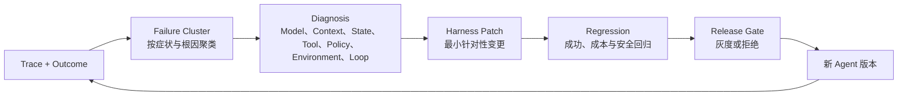
```mermaid
flowchart LR
    T[Trace + Outcome] --> F[Failure Cluster<br/>按症状与根因聚类]
    F --> D[Diagnosis<br/>Model、Context、State、Tool、Policy、Environment、Loop]
    D --> P[Harness Patch<br/>最小针对性变更]
    P --> R[Regression<br/>成功、成本与安全回归]
    R --> G[Release Gate<br/>灰度或拒绝]
    G --> N[新 Agent 版本]
    N --> T

```

常见 Patch 与根因应一一对应：缺少事实时调整 Context 或 Knowledge；错误经验反复出现时修复 Memory；不会执行稳定方法时新增或修订 Skill；工具误用时改进 Tool Schema 或权限；无进展时调整 Loop、Plan 或模型；环境不一致时修复 Environment Contract；完成误判时强化 Verifier。只有确定模型能力本身不足时，才优先更换模型或路由策略。

回归集必须同时包含原失败用例、相邻正常用例和安全对抗用例，防止局部补丁损害其他任务。模型升级后，还应重新检查旧 Harness 中的补偿逻辑，删除已经失效或阻碍新模型的规则。

#### 6.5.3 案例：从一次错误审批到 Harness 修复

假设线上 Trace 显示，修复 Agent 在创建变更单后，把用户此前对生成草稿的同意错误解释为允许生产发布。问题表面是一次越权，沿因果链检查后可以定位到：

```text
Context Manifest
  └── 包含“可以生成变更”的用户回复
Model Decision
  └── 请求 production.deploy
Policy Decision
  └── 仅按 Tool 名称匹配，错误返回 ALLOW
Action
  └── 发布因目标环境无权限而失败
Outcome
  └── 任务未造成生产变更，但触发高风险越权事件

```

正确的 Patch 不是在 Prompt 中再增加一句谨慎发布，而是拆分 `change.create` 与 `production.deploy`，让生产发布策略校验审批类型、对象版本、目标环境和短时授权，并加入草稿获批不得推导为发布获批的确定性回归用例。随后在 Evaluation Harness 中同时运行原失败样本、正常创建变更样本、合法发布样本和 Prompt Injection 对抗样本，确认安全修复没有让所有任务都陷入无效审批。

#### 6.5.4 四种构建路径如何形成反馈闭环

| 路径 | 漏洞修复案例中的实现重点 | 企业必须保留的责任 |
| --- | --- | --- |
| 高代码 Framework | 自定义 Tool / MCP、Docker 或企业 Sandbox、Permission Middleware、事件与 Trace；可针对业务深度调优 | Action Contract、隔离质量、策略、观测字段、Verifier 和最终效果 |
| 产品化 Harness | 复用工具循环、权限模式和事件；通过 `canUseTool` 接入企业审批，通过 Session Store 支持多实例恢复 | 租户入口、业务 Tool、共享状态、审批后端、Artifact 与 Outcome 回流 |
| 基于模型构建 Agent | 用 Agent、Environment、Session、Event 托管执行，通过 SSE 接入企业 Channel 和观测，并通过 Outcome 评估结果、在限定轮次内反馈修订 | Agent 配置、企业工具与数据边界、Task 映射、业务验收标准、证据来源、审批流程和跨版本评估 |
| 在云产品的预置能力之上，快速构建 Agent | 在平台内组合 Agent 定义、模型连接、Skill、MCP 工具与凭证，复用预置 Runtime、Sandbox、Channel 和 Trace 执行修复，并通过平台评估、准入与灰度形成新版本 | Agent 定义与版本归属、能力与数据授权范围、业务 Task 映射、Outcome 验收标准、发布准入阈值和跨版本评估 |

阿里云 Agent 观测与优化 AgentLoop 这类评估与调优平台位于四条路径之上。它接收带版本的 Trace、Outcome、用例和评分器，对 Framework、SDK、Managed Agent 或云产品预置能力产生的 Harness 版本进行一致比较。构建路径决定谁承载执行，统一评估闭环决定系统是否真的变好。

---

### 6.7 本章小结

Harness 行动与反馈系统把模型意图变成受控的环境事实。统一 Action Plane 按 Schema、身份、Policy、审批、执行、Observation 和 Trace 推进行动；Function Calling、MCP 与 A2A 分别位于模型意图、工具连接和远程 Agent 协作层；Tool、Skill、Subagent 与 Remote Agent 具有不同的自主性和责任边界。

Environment Contract 让 Harness 声明所需能力，Runtime 和 Sandbox 负责文件、进程、网络、Secret 与资源的真实隔离；ALLOW、DENY、ASK 与 Preview—Approve—Commit—Verify 模式控制高风险副作用；Streaming、Channel、AG-UI 和 A2UI 则把任务状态、审批和 Artifact 以可持续交互的方式提供给用户。

最终，Trace 将 Agent 版本、Context、行动、状态、成本和 Outcome 连成因果链；Evaluation Harness 从单步、轨迹和最终结果三个层次比较版本，把真实失败转化为有针对性的 Harness Patch。至此，“构建”篇形成了完整答案：构建 Agent，就是围绕任务、信息、行动三类工程契约构建 Harness，并将它形成可运行、可治理、可优化的 Agent。


<a id="sec-013"></a>

# 运行篇


<a id="sec-014"></a>

## 运行篇导读
Agent 构建完，提供对外服务的时候，需要从稳定性、安全、性能、成本等角度去设计运行环境。

一个在开发环境里跑通的 Agent，与一个对外提供规模化服务的 Agent，要回答的问题并不相同。前者只需在一次会话内把逻辑走通；后者要回答它在什么环境里执行、状态存在哪里、流量怎么进出、任务跨越请求与进程之后如何持久化、多个 Agent 同时工作时如何协调与通信。

这些问题在开发阶段同样存在，区别在于规模掩盖了它们的代价：状态没有外置，单人调试时只是重来一次，生产并发下会变成任务丢失、重复执行与无法归因；一个人可访问的 Agent，与面向成千上万用户提供服务的 Agent，业务需求与工程复杂度完全不是一个量级。运行篇处理的正是企业运行环境和用户规模带来的复杂度，它在稳定性、安全、性能与成本四个维度上同时决定系统能否可靠运行。

运行篇的六章沿两条主线展开。第一条主线是运行的地基，解决 Agent 如何稳定运行；第二条主线是运行的秩序，解决多个 Agent 如何协同运行。

| 主线 | 对应章节 | 运行对象或问题 | 主要机制 |
| --- | --- | --- | --- |
| 运行的地基： Agent 稳定运行 | 第 7 章 | 执行环境与运行时 | 沙箱、Agent Runtime、环境生命周期、把工作空间纳入生产平台 |
|  | 第 8 章 | 任务事实与语义资产的落地 | Event Log、Checkpoint、工作区快照、Artifact、长期记忆、RAG 与本体 |
|  | 第 9 章 | 流量的进出与治理 | AI 网关的 LLM、MCP、Agent 三种治理语义；身份、权限、预算、审计与审批 |
| 运行的秩序：多个 Agent 协同运行 | 第 10 章 | 长时与异步任务 | 同步与异步的边界、完成语义的分层模型、定时任务与工作流 |
|  | 第 11 章 | 多 Agent 团队协作与编排 | 异构接入、团队组织拓扑、任务分派与结果聚合、编排层与执行系统的职责边界 |
|  | 第 12 章 | 跨 Agent 的分布式通信 | 能力面、协作面、内构面、人机面的选型地图；消息治理 |

第一条主线处理执行条件本身。第 7 章把工具调用扩展为可编程工作空间，让 Agent 在同一空间内持续工作，并为并行探索提供环境；第 8 章解决状态外置之后的承载问题，运行时状态、工作区与产物、记忆与知识、业务语义与治理四类对象具有不同的一致性要求，需要匹配的物理承载与统一的状态契约；第 9 章把流量入口收敛为统一治理点，区分 LLM、MCP 与 Agent 三种治理语义，避免把模型路由、工具协议代理与任务入口混为一层。

第二条主线处理协同秩序。第 10 章界定同步与异步的边界，并给出任务完成语义的分层模型，避免把进程结束当成任务完成；第 11 章讨论异构 Agent 如何进入同一个团队，以及编排层与执行系统的职责如何划分；第 12 章按能力面、协作面、内构面与人机面给出通信选型地图，把协议选择还原为面向交互语义的判断。

两条主线是递进关系：没有稳定运行的单个 Agent，多 Agent 协同只会放大不确定性。第 7 章的执行环境与第 8 章的状态存储是理解后续各章的共同基础，建议先读。若当前任务是把一个 Agent 接入生产并跑稳，重点在第一条主线；若已有稳定运行的 Agent，正在向异步、多 Agent 与跨系统形态扩展，重点在第二条主线。


<a id="sec-015"></a>

## 第 7 章　Agent 运行时与沙箱
面向任务执行的 Agent，需要将模型推理与环境操作结合起来。模型负责生成计划和操作指令，文件读写、程序运行、页面交互及结果验证则由具体的执行环境完成。随着工具增多、任务变长，执行环境还需要支持跨步骤的数据共享、多轮交互中的状态延续，以及多个任务的独立运行。

沙箱（Sandbox）为这些操作提供可编程、受控的工作空间。它将计算资源、文件系统、运行依赖，以及终端、浏览器或桌面等工具组织在按需分配的环境中，使 Agent 能够执行操作、检查结果，并根据反馈调整后续行动。任务隔离、访问控制和资源管理约束操作范围，工作区与状态保留机制支持任务继续推进。

不同任务对执行环境的要求有所不同。工具执行关注环境能否快速就绪，长时任务关注已有成果能否持续使用，训练与评测关注大量独立尝试能否高效开展。模板复用、共享工作区、休眠恢复和快照分叉分别支撑这些需求。Agent Runtime 负责将环境的创建、连接、等待、恢复与回收纳入任务生命周期，使沙箱能够持续承载 Agent 应用。

### 7.1 从工具调用到可编程工作空间

#### 7.1.1 Sandbox 提供什么

在 Agentic Application 中，Sandbox 是按任务需要配置、具有隔离边界和明确生命周期的执行环境。典型环境包含操作系统用户空间、计算资源、文件系统、语言与依赖，以及终端、浏览器或桌面等操作入口。平台还可以为它配置网络访问、数据挂载、身份凭证、观测和状态保留方式。这些能力共同决定 Agent 能做什么、在哪里做，以及任务结束后留下什么。

可编程能力使 Agent 能够在授权范围内组织操作步骤。处理一组格式不统一的文件时，Agent 可以检查样本、生成转换脚本、安装必要的解析库，再根据运行结果修正脚本；开发应用时，可以组合终端、测试程序和浏览器完成修改与验证。这类环境适合操作路径需要在执行过程中逐步确定的任务。对于参数明确、行为固定的业务动作，应用可以直接调用已有 API，无须为每次查询创建沙箱。

执行控制决定这些操作能否进入生产环境。平台将任务限制在分配的计算资源、工作区和访问范围内，避免一个项目的依赖、进程和临时文件干扰其他项目，并在任务结束后回收资源。隔离是基础，环境是否可用还取决于依赖安装、文件访问、服务启动和结果返回等环节。代码、浏览器、桌面和工作区可以由统一的环境服务提供，并通过生命周期接口管理。

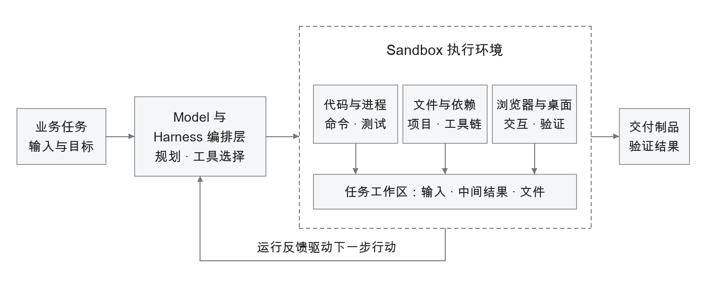

图 7-1　Sandbox 支撑真实执行与反馈闭环

图 7-1 中，模型与 Harness 编排层决定下一步行动，Sandbox 执行命令并返回退出状态、错误、文件变化或页面结果。编排层据此判断继续修改、换一种方法还是结束任务。沙箱让这些判断获得可检查的运行依据；业务结果是否正确，仍需由测试、规则、评测器或用户验收来确认。

#### 7.1.2 两种部署关系与三类典型负载

Agent 与沙箱有两种常见的部署关系。Agent use sandbox 表示 Agent 的编排逻辑位于沙箱外，通过接口调用其中的代码、浏览器或其他工具；Agent in sandbox 表示 Agent 进程和主要工具链共同运行在沙箱内，模型推理服务仍可位于远端。前者便于为已有应用增加执行能力，后者适合需要完整项目环境、持续进程和复杂工具协作的任务。

训练与评测是另一个观察维度。Agent RL/Eval 关注批量环境交互、轨迹采样、重置和重复实验，可以采用上述任一种部署关系。因此，use、in 和 RL/Eval 可以作为三类典型负载来讨论，但不能理解为三个互斥的技术架构，也不能固定对应某一种产品版本。

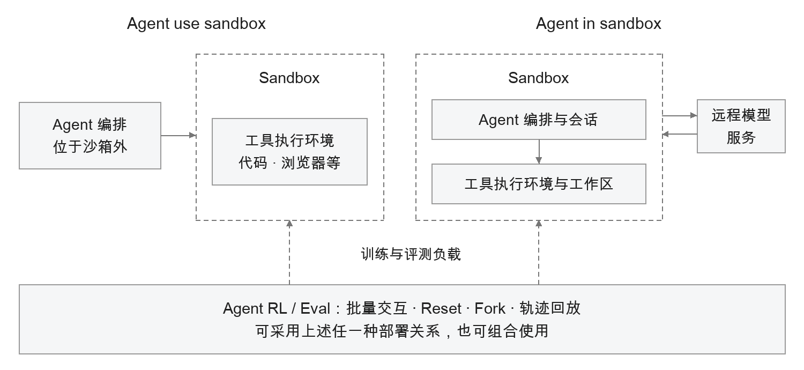

图 7-2　Agent 与 Sandbox 的部署关系及负载类型

| 典型负载 | 任务如何使用环境 | 首要价值 | 主要关注点 |
| --- | --- | --- | --- |
| 工具执行：Agent use sandbox | 编排在外，按步骤调用代码、浏览器或桌面 | 为已有 Agent 增加真实操作与结果验证能力 | 首次可用时延、工具能力、任务间隔离 |
| 长时任务：Agent in sandbox | Agent 进程与工具链共同使用持续工作区 | 延续项目状态，支持多轮修改和长任务 | 会话连续性、恢复效果、等待成本 |
| 训练与评测：Agent RL/Eval | 批量运行独立交互，收集轨迹与结果 | 并行探索，复用环境准备，稳定比较结果 | 环境吞吐、重置与分叉、实验可复现性 |

表 7-1　三类典型负载的任务特征与价值

表中给出的是典型组合；工具沙箱也可以维持长会话，运行在沙箱内的 Agent 也可以只处理一次短任务。选型应从任务特征出发，再确定模板、状态与弹性策略。

### 7.2 工具执行：让 Agent 完成实际操作

#### 7.2.1 代码与数据处理

代码沙箱为 Agent 提供解释器、命令行、依赖和文件读写能力。以经营数据分析为例，用户提交多个数据文件后，Agent 先检查列名和异常值，再编写脚本完成清洗、合并和统计，输出图表及结果文件。执行错误返回任务循环，Agent 据此修正字段映射或计算逻辑，重新运行并检查输出。最终交付包括输入文件、处理过程和结果产物，用户可以据此复核分析结论。

代码沙箱支持在任务内部灵活组合处理步骤。开发团队无须为每种文件结构和分析流程预先编写专用工具，Agent 可以在受控环境中编写和执行程序。不同用户使用独立的工作区和依赖，减少库版本冲突、文件混用及遗留进程造成的干扰。高频、稳定的计算可以进一步沉淀为固定工具，变化较多、需要执行中探索的部分则由沙箱承载。

这类任务需要依据产物验收。命令执行成功只表示程序正常退出，还应核对数据范围、输出文件、关键统计结果和可读性。输入版本、执行脚本与必要日志应随任务保留，便于用户复核结论，并在后续任务中复用处理过程。

#### 7.2.2 浏览器、桌面与共享工作区

浏览器沙箱适合需要实际页面状态的任务，例如检查生成网页、在授权站点检索资料、处理文件上传下载，以及验证用户操作流程。Agent 通过浏览器控制接口观察页面、点击控件并读取结果；页面截图、下载文件和运行日志可以共同构成反馈。桌面沙箱进一步提供图形界面操作能力，用于依赖桌面软件或尚无合适 API 的流程。具体操作系统、应用和交互接口由所选模板与平台能力决定。

单独提供浏览器或解释器可以完成局部动作，跨工具任务还需要共享工作区。以“下载业务数据并生成一份报告”为例，浏览器把数据保存到任务目录，代码解释器直接读取该文件进行处理，生成的页面再由浏览器打开检查，最终报告从同一工作区导出。All-in-One（AIO）环境把浏览器、代码和终端放在可共享文件的工作空间中，减少步骤之间反复上传下载、路径转换和版本对齐的工作。

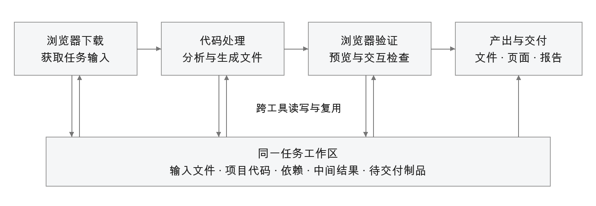

图 7-3　共享工作区支撑跨工具任务

共享的范围应与任务相匹配。同一任务的工具可以访问需要协作的文件，不同租户与项目仍应分开；并行分支若要修改同一文件，需要明确的合并规则。对于只使用代码的简单任务，轻量模板通常更合适；组合环境适用于跨工具收益足以覆盖镜像体积、启动和维护成本的情况。

#### 7.2.3 MCP Server 与 Skill 的运行环境

MCP 描述工具如何被发现和调用，Skill 提供可复用的任务知识、步骤或脚本。它们执行时仍可能依赖特定语言、命令行程序、本地文件或浏览器。沙箱把这些依赖组织为可启动的环境，使原本只在某台开发机上运行的工具能够按用户或任务分配，并在使用后释放。

例如，一个通过标准输入输出交互的 MCP Server 可以随沙箱启动，由适配层把远程请求转换为进程输入，并把结果返回调用方。协议转换由适配层或网关完成，沙箱负责承载进程、依赖和工作区。两者配合后，平台可以在工具暂时无人使用时回收或休眠环境，在请求增加时按需扩容，同时保留不同工具版本与用户数据之间的边界。

| 环境类型 | 典型任务 | 任务产物 | 沙箱带来的直接收益 |
| --- | --- | --- | --- |
| Code | 清洗数据、运行脚本、构建与测试 | 结果文件、图表、测试报告 | 按任务组织程序，复用依赖并获得执行反馈 |
| Browser | 页面交互、下载、网页预览与检查 | 页面结果、文件、截图 | 直接验证真实页面及操作效果 |
| Computer | 操作桌面软件、完成图形界面流程 | 应用内结果、导出文件 | 覆盖缺少合适 API 的任务路径 |
| AIO | 下载、计算、生成、预览的连续任务 | 可检查的综合交付物 | 多种工具共享文件，减少步骤衔接成本 |
| MCP / Skill 环境 | 运行带本地依赖的工具与任务脚本 | 工具结果、业务所需文件 | 将工具依赖变成可分配、可维护的运行环境 |

表 7-2　常见沙箱环境与任务价值

这些环境类型可以组合，也可以复用同一套基础设施。平台统一管理生命周期、镜像、存储和观测能力，向应用提供与任务相匹配的操作入口。应用团队负责判断操作是否满足任务要求，平台团队负责环境的创建、连接和回收。

### 7.3 长时任务：让 Agent 在同一工作空间持续工作

#### 7.3.1 从一次调用延伸到一个项目

长时任务通常围绕一个项目展开。开发一个应用时，Agent 会取得仓库、安装依赖、修改代码、运行测试、启动预览服务，并等待用户查看。用户下一次提出修改意见时，前一次的代码、依赖和项目结构应当仍然可用。Agent in sandbox 可以让 Agent 进程、命令行工具和浏览器围绕同一工作区运行，避免每个步骤重新拼接环境。

云端个人助理和数字员工也需要持续的工作环境。它们可能跨多轮交互处理文档、维护项目资料、使用授权系统，并保留尚未交付的中间结果。用户关注的是下一次能否从已有成果继续；平台则需要通过稳定的会话标识、可恢复的任务状态和按需保留的工作区实现这种连续性。仅维持进程存活，无法完整承担这些责任。

例如，一个代码 Agent 已经安装工具、修改文件并生成中间产物，随后进入模型等待阶段。如果平台仅因 CPU 使用率较低就回收实例，而这些成果只保存在实例内部，下一次请求便只能从头开始。要在保留弹性的同时延续项目，就需要让任务状态和工作区独立于当前承载保存，并在实例更换后重新接回。

多 Agent 协作还会增加分支需求。多个执行者可以从共同的项目版本出发，各自在独立工作区尝试实现或验证，再由协调者比较结果并合并。这样可以减少相互覆盖文件、端口冲突和依赖变化造成的干扰。沙箱提供独立执行条件，任务拆分、协作决策与合并仍由 Harness 编排层承担。

#### 7.3.2 会话亲和与工作区挂载

任务连续性依赖两类映射。第一类将逻辑会话关联到执行环境：请求携带稳定的会话标识到达后，路由层查找已有环境，或启动恢复流程。第二类将任务身份关联到工作区：平台根据已验证的租户、用户和项目关系，为环境挂载对应的数据目录。会话亲和负责请求与环境的关联，动态挂载负责环境与数据的关联。

这两类映射不必一一对应。同一项目的多轮请求可以复用一个环境；也可以在原实例释放后创建新实例，重新挂载项目文件。用户级助理可以拥有个人工作区，独立项目则需要进一步细分。选择何种粒度取决于数据边界、并发方式和故障影响范围。仅把用户编号拼接到目录名中，并不能代替服务端对工作区归属及访问权限的检查。对外入口可以保持稳定，路由层负责将逻辑标识解析到当前环境，调用方不应把某个容器的临时地址作为长期入口。

工作区文件与任务状态承担不同责任。源码、下载文件和中间制品保存在工作区；任务目标、已完成步骤、待确认事项和外部操作结果构成任务事实，应由状态存储保存。恢复内存和磁盘之后，编排层仍需确认任务进度，避免重复提交操作或遗漏后续步骤。

运行期间新增的工具和依赖，需要明确恢复方式。可预知的依赖固化到版本化模板，临时依赖尽量安装到持久化覆盖的项目目录。系统路径中的改动应保留可重建的安装步骤，或通过覆盖该范围的环境快照保存。工作区挂载只恢复其覆盖的文件，不能据此判断全部环境变化已经恢复。

实例恢复时，应同时核对状态的可读性、归属，以及必要文件和版本的完整性。检查未通过，实例应保持恢复失败或等待状态，不能将空工作区作为恢复结果交付。任务状态和工作区的保留期应独立于计算实例设置，避免回收实例时删除仍需使用的数据。

#### 7.3.3 等待、休眠与任务续行

长会话中的计算需求并不连续。Agent 可能等待模型返回、用户确认、网页响应或下一次业务事件。持续保留完整计算资源，会使成本随会话保留时间增长；每次等待都销毁环境，又会增加依赖安装和上下文恢复的开销。休眠与恢复在保留必要状态的前提下降低等待阶段的资源占用，并在后续事件到达时恢复执行。

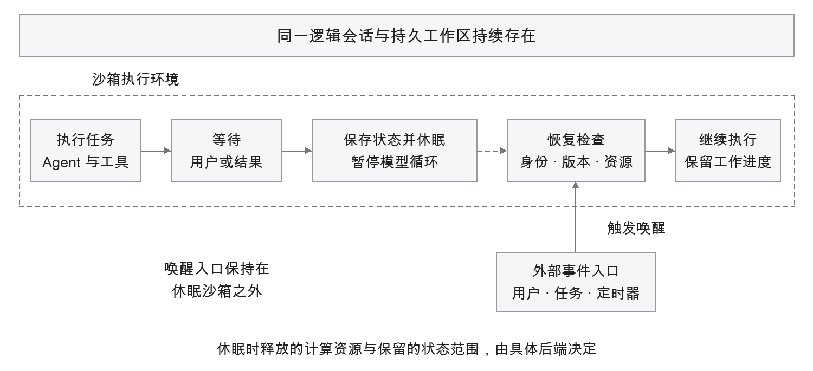

图 7-4　长会话的等待、休眠与续行

图 7-4 中，唤醒入口位于休眠沙箱之外。定时器、消息入口或请求路由组件先接收事件，再恢复环境并交付任务；休眠中的 Agent 自身不继续执行任务循环。需要持续计算、保持即时服务或完成后台作业的阶段，应保持相应资源活跃。判断能否休眠也不能只看“没有新请求”，还应检查正在运行的工作和未完成操作。任务进入等待前，编排层应保存继续点和等待条件；重要增量应随执行推进及时保存，不能全部留到收到终止信号时才写出。

环境恢复后，应重新检查其可用性。文件即使得到保留，外部连接、临时凭证和远端登录状态也可能已经变化，服务端口同样需要检查。E2B 的持久化文档区分运行、暂停与销毁，并说明暂停会中断外部连接；阿里云的休眠文档要求在恢复后检查关键文件、进程与端口。因此，恢复结果应以任务能否继续执行为依据，接口返回成功只是其中一个环节。

#### 7.3.4 实例故障后如何继续

除主动休眠外，长时任务还需要处理进程退出和节点失联。恢复前应区分执行环境故障与依赖服务故障。执行实例故障可以通过更换承载、恢复状态处理；必要存储不可用时，应暂停相关读写并恢复存储服务，反复重建实例无法消除存储故障。

失去心跳只表示平台暂时观察不到实例，旧进程仍可能继续运行。对于需要串行修改同一任务或工作区的执行，应先确认旧实例已停止，或使其写入权限失效，再让新实例继续写入。平台可以用执行代次区分接管前后两次执行，并由受保护的存储或写入入口拒绝旧代次，这类机制通常称为围栏。仅更新控制面的编号，不能阻止旧进程继续产生影响。

对已经提交给外部系统的操作，恢复时还需要核对其执行结果。例如，Agent 提交构建后尚未收到结果就失联，新实例应根据原构建标识查询状态，再决定等待、读取结果或重试。不能安全重复的操作，在结果不明时应保持待核对状态，必要时交由人工处理。只有任务能够从已有成果继续推进，才能确认恢复完成。

### 7.4 训练与评测：为并行探索提供环境

#### 7.4.1 环境交互为什么影响吞吐

Agent 的强化学习和评测通常需要真实执行。以代码修复任务为例，每次尝试都要取得对应仓库、准备依赖、运行 Agent、执行测试并收集结果；浏览器与桌面任务则需要初始化页面、账户或应用状态。一次从初始状态出发、经过多步动作得到结果的交互过程，构成一条 rollout 轨迹。

并行运行时，环境准备、文件读写、测试执行和资源回收都会影响有效轨迹的产出。即使模型推理仍有余量，任务也可能因环境尚未就绪或操作结果尚未返回而等待。沙箱平台负责批量提供执行环境、隔离不同尝试并回收资源，减少训练过程中的环境等待。

训练和评测对环境的要求有所不同。训练通常追求足够多且有效的探索，评测更强调不同模型与版本面对可比较的任务条件。二者都需要记录模板、数据和依赖版本，限定执行预算，并清楚区分“Agent 没有完成任务”和“环境本身未能正常提供服务”。否则，环境故障可能被误计为模型能力变化。

#### 7.4.2 Template、Snapshot、Fork 与 Reset

模板定义环境的初始配置，包括操作系统、工具版本、依赖和启动参数。快照保存某个时间点的运行状态，具体范围可以包括文件系统或内存。Fork 从同一快照创建独立分支，复用快照之前的准备结果；Reset 将实验环境恢复到约定的初始条件，可以通过重新创建、快照恢复或专门的重置逻辑实现。

这四项能力解决的问题不同。模板让重复任务有一致的起点；快照把已经完成的准备工作保存下来；Fork 让多次尝试从同一阶段并行展开；Reset 防止上一轮尝试的改动污染下一轮结果。Agents 的快照文档也将一对一的暂停恢复与一对多的快照克隆区分开来。

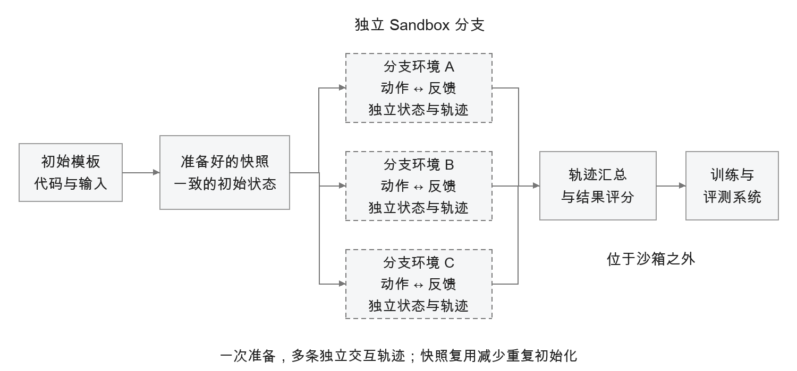

图 7-5　快照与分叉支撑并行探索

例如，同一个代码任务可以先完成仓库检出、依赖安装和基础测试，再保存环境快照。多个沙箱从该快照分叉，不同策略分别修改代码、执行测试，随后汇总补丁、测试结果和轨迹。这样可以复用环境准备过程；实际收益取决于准备成本、快照大小、分叉次数和恢复开销。

可比较的初始条件需要覆盖全部相关状态。沙箱快照不能自动回退外部数据库、已经发送的消息或已经完成的业务操作。评测任务应使用独立的数据副本、测试租户或明确的外部重置机制；分支写入应进入各自的可写空间，避免共享挂载把一次修改传播给其他分支。沙箱快照也不同于模型训练检查点，后者通常保存权重、优化器等训练状态。

#### 7.4.3 从环境结果到训练信号

环境负责返回观察、执行结果和轨迹，训练或评测系统再据此计算得分、比较策略或更新模型。测试退出码、页面截图和文件差异是证据，但如何定义成功、如何计算奖励，属于评测逻辑。对于会修改代码和文件的 Agent，评分规则与关键验证材料应受到独立保护，避免执行者通过修改评分环境获得失真的结果。

评估平台收益时，应区分环境能力与模型能力的贡献。沙箱影响环境供给、动作执行、状态复用和轨迹采集；模型服务缓存、推理调度及训练算法带来的改善，需要分别评估。分阶段记录耗时和失败原因，才能判断提高环境并发是否增加了有效样本产出。

### 7.5 运行机制与任务收益

#### 7.5.1 环境复用与受控尝试

环境复用可以减少重复准备。平台将语言、依赖、工具和启动步骤固化为版本化模板，应用通过统一入口申请环境，减少不同机器之间的安装差异。任务所需的临时依赖可以在分配后的工作区中补充，稳定且高频使用的依赖再纳入模板。模板版本与任务记录关联后，可用于故障定位和重复执行。

独立环境降低了尝试的相互影响，让安装依赖、运行脚本和反复修改文件有明确边界。对影响局限于环境内部的失败尝试，可以回到约定起点继续探索；版本和结果记录则为复核与改进保留依据。

环境复用需要同时满足版本、归属和清理要求。模板依赖应可追溯，工作区应属于当前任务，实例重新分配前应完成清理。访问外部系统产生的业务影响，仍需由业务规则、幂等处理或补偿机制控制。沙箱负责执行边界，权限判断与结果验收由相应系统承担。

#### 7.5.2 用状态分层降低等待成本

状态保留策略决定等待期间的资源占用与恢复开销。持续运行可以立即执行后续动作，但始终占用计算资源；保留内存的浅层暂停可以减少活跃计算，但仍需保留相应内存。将状态保存到持久存储后释放执行资源，适合较长等待，恢复时则需要重新分配资源并加载状态。仅保留文件可以进一步缩小保存范围，但需要重新启动进程和应用。

浅休眠与深休眠体现了这一取舍。具体产品对这些术语的实现、开放范围和计费项目可能不同，应用需要按实际状态语义设计，而不能把某个 pause 接口直接等同于所有平台的同一种休眠。阿里云文档以不同资源的保留和计费方式区分轻、深休眠；E2B 也提供文件系统与内存保留范围的不同选择。

| 状态策略 | 保留与释放的内容 | 适用情况 | 主要代价 |
| --- | --- | --- | --- |
| 持续运行 | 保持进程和执行资源可用 | 连续计算、即时交互、正在运行的服务 | 等待时仍占用相应资源 |
| 浅层暂停 | 保留内存及文件状态，减少活跃计算 | 等待较短，恢复敏感 | 仍保留内存等资源；以平台实现为准 |
| 深度休眠 | 将支持的状态持久化，释放执行资源 | 等待较长，希望延续运行上下文 | 状态存储与恢复开销，外部连接需重建 |
| 保留文件后重建 | 仅保留工作区及必要任务记录 | 进程易于重启，文件是主要状态 | 重新启动服务，补充未持久化的上下文 |

表 7-3　状态策略与资源取舍

状态策略应按完整任务周期评估。对于保留时间较长、实际执行时间较短的项目，降低等待阶段的资源占用可能带来更大收益；对于频繁恢复且每次等待较短的任务，反复保存和加载状态可能增加时延与成本。平台应结合活跃时间、等待时长、恢复频率和状态大小，设置休眠阈值与保留期限，并清理已无业务用途的快照和工作区。

#### 7.5.3 低时延供给与弹性容量

沙箱的首次可用时延应从环境申请开始计算，直到命令通道、依赖、工作区和所需服务全部就绪。冷启动包含资源分配、镜像准备和进程初始化；镜像缓存与预热用于减少镜像准备时间；实例预热则提前维持已启动的环境，以资源池的持续占用换取较短等待。不同策略对应不同的成本与测量边界，应分别记录。

对首次响应时延敏感的突发工具调用，可以用适量预热环境承接常见流量，再按需求创建更多环境；稳定的大批量评测可以按任务队列提前准备容量；长时项目则优先考虑复用和恢复。平台要同时处理创建、连接、回收和预热池补充，防止创建速度提高后，瓶颈转移到共享存储、出口网络或控制接口。阿里云容器服务文档列出了镜像加速与预热池等不同供给机制。

容量规划应依据代表性任务下的实测承载量，同时检查内存、工具子进程、连接数和伴生组件开销。平台应分别设置单实例并发上限与资源池规模上限，并核对模型、存储和控制接口的配额。容量耗尽时，采用有界排队或明确拒绝，避免无限扩容与等待。预热只能提前完成与具体任务无关的准备，用户身份、工作区挂载和恢复检查仍需计入首次可用时延。

资源回收与扩容共同决定可用容量。平台应支持查询活跃任务、取消指定任务，并强制执行任务时长、空闲时间和租户资源上限。缩容时先停止接收新工作，再等待在途任务完成或到达可恢复点；CPU 使用率较低不能单独作为回收依据。

| 核心优势 | 依靠什么机制 | 对任务的改善 | 如何验证 |
| --- | --- | --- | --- |
| 能执行并验证 | 代码、浏览器、桌面及运行反馈 | 将计划推进为可检查的产物 | 完成率、有效反馈、产物验收 |
| 减少环境准备 | 版本化模板、依赖复用、共享工作区 | 缩短准备时间和工具衔接时间 | 首次可用时延、重复准备耗时 |
| 长任务可接续 | 会话映射、工作区持久化、恢复检查 | 后续请求从已有成果继续 | 续行成功率、状态完整性 |
| 降低等待浪费 | 分层休眠、按需恢复、到期清理 | 减少非活跃阶段资源占用 | 活跃时间占比、单位完成任务成本 |
| 支持并行探索 | 隔离环境、快照分叉、重置与弹性 | 提高有效尝试的供给效率 | 有效轨迹吞吐、重置耗时、分支污染率 |

表 7-4　Sandbox 能力、实现机制与验证方式

表 7-4 汇总了沙箱能力、实现机制与验证方式。平台应为准备、执行、等待和并行尝试各阶段配置合适的资源策略，再通过真实任务验证时延、成本和完成效果，不能仅依据是否采用沙箱判断收益。

### 7.6 架构与接入：把工作空间纳入生产平台

#### 7.6.1 Harness、Runtime 与 Sandbox 的分工

Harness 编排层持有任务目标、上下文和下一步决策，判断何时调用工具、何时交给其他执行者，以及何时结束。Agent Runtime 负责把任务组织成可启动、可等待、可取消和可恢复的运行过程，申请并关联资源，把执行结果交回编排层。Sandbox 提供具体的计算与工具环境，并执行分配给它的操作。

这是一组职责边界，不要求实现为三个独立服务。简单应用可以在同一进程中组织编排与运行逻辑，通过 SDK 使用外部沙箱；复杂项目也可以将 Agent 进程放进沙箱，而把路由、恢复和回收控制留在外部。无论如何部署，编排层都应掌握任务语义，平台不应根据一个进程是否存活来猜测任务是否完成。

接入时，应用团队与平台团队应约定状态保存、断点继续、取消和重复调用的处理方式。平台提供资源、身份、持久存储与生命周期接口，编排层负责写入恢复所需的状态，并在重启后读取和核对。框架或工具不支持断点继续时，应明确能力限制及失败后的处置方式。

执行面承载任务循环、运行执行组件和沙箱实例；数据与资源面保存镜像、工作区、任务记录、快照与制品；控制面管理身份、模板准入、权限、配额及生命周期策略。观测贯穿各平面，把一次用户任务与环境实例、版本、操作结果和成本关联起来。

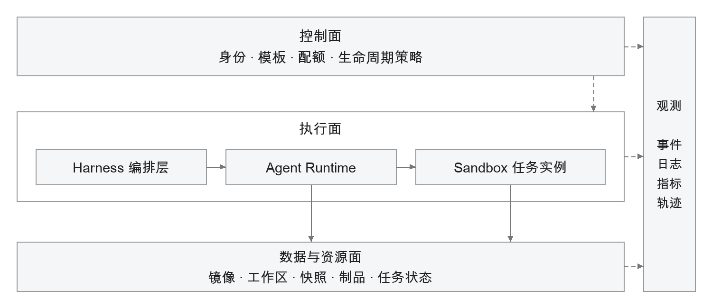

图 7-6　Sandbox 在三平面架构中的位置

图 7-6 中，沙箱管理组件根据控制面的策略创建、恢复和回收实例，执行组件把命令和反馈接回任务。工作区、任务状态与最终制品具有各自的保存责任：任务结束可以释放计算环境，已经交付的结果和必要运行记录仍应按业务要求保留。

#### 7.6.2 隔离后端与开放能力

沙箱可以基于容器、用户态内核或虚拟机等机制实现。容器通常具有较成熟的镜像和运维生态，但常见实现共享宿主机内核；用户态内核通过中间实现减少工作负载直接接触宿主内核的范围，同时需要验证系统调用和应用兼容性；MicroVM 通过硬件虚拟化提供独立内核边界，仍需要配套的资源、网络、存储与身份管理。gVisor 与 Firecracker 的官方资料分别说明了这两类实现思路。

后端选择取决于运行代码的可信程度、租户边界、操作系统能力、设备需求和运维成本。对外提供 SDK 或 Kubernetes 接口，并不能单独说明底层隔离强度。浏览器自身的进程沙箱也只覆盖相应应用边界，整套任务环境仍需要考虑其他进程、挂载资源和网络访问。

环境开放范围应由任务需要决定。资料下载需要对应的网络访问，项目构建需要语言与依赖，企业数据处理需要授权的数据挂载。平台通过出口代理、短期凭证、资源限额和独立工作区提供这些能力，并限制其影响范围。

共享资源池中，身份还应落实到网络、文件访问和日志查询的实际权限。公共能力目录按需只读共享，任务私有目录限定读写范围，并阻断沙箱获取宿主机广泛权限的路径。预热环境在分配前不携带用户数据或凭证；实例重新分配前，应完成进程、文件、挂载和网络规则的清理。

#### 7.6.3 开发者 API 与 Kubernetes 接入

应用开发者通常希望通过少量接口完成创建、连接、执行、读写文件和释放环境。SDK/API 接入把这些操作封装为应用可调用的能力，便于已有 Agent 增加工具环境。平台团队则可能需要把沙箱接入现有集群、存储、网络和监控体系，通过 Kubernetes 自定义资源声明模板、实例及生命周期，并统一管理容量。

这两种入口可以指向同一套底层能力。Agents 同时提供面向应用的接口与面向平台的资源抽象；阿里云容器服务也列出了兼容 SDK 与声明式资源两种接入方法。接口选择与托管方式可以分别决定，SDK 也可接入自建服务。应用需要同时明确由谁承担环境运营，以及如何复用已有基础设施。

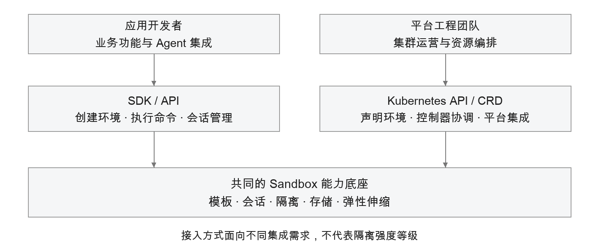

图 7-7　两种接入方式与共同能力底座

| 对比项 | SDK / API 接入 | Kubernetes 接入 |
| --- | --- | --- |
| 主要使用者 | Agent 应用开发者 | 平台、基础设施与运维团队 |
| 关注对象 | 创建、连接、命令、文件与生命周期接口 | 模板、实例、预热池、存储与控制器 |
| 平台责任 | 运营责任取决于托管或自建方式；应用维护任务与环境的关联 | 团队对集群集成、容量及运行策略有更多直接控制 |
| 适用条件 | 希望快速补充执行能力，减少基础设施接入工作 | 已有 Kubernetes 体系，需要统一资源与运维治理 |
| 验证重点 | 接口及状态语义、配额、网络和持久化行为 | 控制器行为、调度容量、后端能力及升级维护 |

表 7-5　SDK/API 与 Kubernetes 接入的选择依据

接口兼容可以减少迁移所需的代码修改，但模板、超时、暂停恢复、网络访问、文件持久化和错误处理仍需逐项验证。同名参数在不同实现中的支持范围可能不同。生产迁移应以代表性任务验证完整生命周期，再确定原有应用逻辑的复用范围。

### 7.7 落地与验证：围绕真实任务判断效果

#### 7.7.1 从产品实践提炼可复用模式

阿里云 Agent Sandbox 产品中的案例覆盖了不同落地路径。MCP 工具市场案例把带本地依赖的工具接入远程服务，由协议适配与沙箱供给配合处理按需启动和突发请求；Z.ai 的全栈应用开发案例围绕生成、运行、预览和继续修改组织项目环境；MiniMax 的长会话案例关注大规模用户环境的保留与资源效率。这些实践分别把沙箱作为工具服务的供给单元、代码项目的工作空间和长会话的状态载体。

Qwen 和百炼的训练评测案例则把环境准备、并行交互、轨迹与结果采集接入训练流程。实施时可以先把单个任务所需的环境准备和反馈闭环做完整，再优化状态复用，最后扩大并发。案例中的具体性能及成本结果与其测试条件和产品实现相关，企业落地应使用自身负载验证收益。

#### 7.7.2 用完整任务链建立基线

基线任务应覆盖各类负载的完整过程。工具执行包括文件输入、依赖准备、计算和产物检查；长时任务包括执行、等待、用户返回、恢复和最终交付；训练评测包括批量创建、并行交互、重置、评分和回收。通过这些任务，可以检查工具能力、状态连续性和资源策略是否满足要求。

基线应记录各阶段耗时。环境侧包括请求排队、资源分配、镜像准备、挂载、初始化和恢复；执行侧包括模型等待、工具运行、重试和验收；结束侧包括结果保存、资源释放和遗留状态清理。P95、P99 等分位值应明确从哪个事件计时到哪个事件，并给出并发量、环境大小及缓存条件，避免用空环境的启动数据代表完整业务响应。

成本评估也应覆盖完整生命周期。单位成功任务成本，可以用测量窗口内归属该负载的计算、状态存储、网络和预热资源费用，除以成功完成的任务数计算；失败尝试与重试消耗同样计入总费用。比较整套应用成本时，还应以一致口径纳入模型调用和其他服务费用。该口径可用于判断休眠收益是否被恢复开销抵消，以及增加并发是否带来更多失败和无效尝试。

#### 7.7.3 从试点走向持续运行

试点阶段应明确任务的环境契约：使用哪个模板、挂载哪些数据、保留哪些状态、依据什么验收产物，以及何时释放资源。随后按负载需要增加能力。短任务可以从按需创建和明确清理开始；长任务增加会话关联和恢复；高并发训练评测再引入预热、批量调度和快照分叉。每项新增机制都应对应已观察到的运行问题。

上线前需要验证任务被取消、实例退出、恢复失败和外部连接失效时的行为，确保任务状态、工作区和资源状态仍可对应。可以围绕同一个项目验证以下场景。

| 验证场景 | 重点检查 |
| --- | --- |
| 执行中实例退出 | 新实例能接回任务记录、必要文件和依赖，从已保存的位置继续 |
| 工作区挂载失败或归属不符 | 阻断后续执行，不把空目录或其他用户的数据当作恢复成功 |
| 旧实例失联后重新出现 | 旧执行者不能继续修改受保护的状态，外部操作结果得到核对 |
| 等待期间取消或触发资源上限 | 停止新增执行，保存结果和必要记录，回收相应资源 |
| 新版本上线后恢复旧任务 | 任务状态与环境版本兼容，文件和访问权限仍然正确 |

表 7-6　长时任务的恢复与生命周期验证

环境版本升级应同时验证新建与恢复路径。旧快照可能保留旧依赖和凭证状态，仅验证新模板不能证明全部运行环境已经升级。已有任务需要使用兼容的环境继续执行；涉及状态格式或挂载方式变化时，应先验证迁移路径，再逐步切换，确认存量引用完成迁移后撤除旧配置。持续关联任务结果、环境版本、日志与成本，有助于将运行问题转化为模板、工具和策略的具体改进。

### 7.8 本章小结

Sandbox 为 Agent 提供可编程、受控的执行环境，承载代码运行、浏览器与桌面操作、文件读写，并将实际结果返回任务循环。工具执行通过沙箱获得操作能力，长时任务通过会话与工作区保持项目连续性，训练评测通过独立环境、重置和分叉开展并行探索。

各类运行机制分别作用于任务的不同阶段：模板与共享工作区减少环境准备和工具衔接，状态保留支持任务继续推进，休眠降低等待阶段的资源占用，弹性与快照复用提高有效尝试的供给效率。Harness 编排层、Runtime 与 Sandbox 分别承担任务语义、运行生命周期和执行环境的责任，平台统一管理身份、数据与观测。方案效果应通过任务完成与续行能力，以及每个有效结果所需的时间和成本评估。


<a id="sec-016"></a>

## 第 8 章　Agent 状态存储与语义资产
第7章讨论了执行环境、状态关联与任务续行。本章进一步回答：需要持久化的任务事实、工作区和语义资产，由什么系统承载，各自需要满足哪些一致性、访问和治理要求。

Event Log 与 Checkpoint 为故障恢复提供依据，工作区快照与 Artifact 保存环境版本和任务成果，长期记忆积累经过筛选的经验，RAG（Retrieval-Augmented Generation，检索增强生成）知识库提供可检索的外部知识，本体则显式组织业务对象、关系与规则。这些对象可以共享基础设施，但不能因此省略各自的正确性要求。

本章沿着“分层地图—运行状态与工作区—记忆、知识与本体—平台治理”的顺序展开。构建篇已说明这些逻辑对象如何被 Harness 使用，这里重点讨论其持久化、版本、一致性和生命周期，并以 Lakebase 的参考架构说明各项能力如何组合。

**第一部分　总览：状态外置之后，状态由什么承载**

### 8.1 Agent 状态存储的分层地图

#### 8.1.1 状态外置之后的存储职责

当状态不再依附于任何一个执行实例后，Agent 系统进入了新的架构阶段。系统不再只需要让计算节点随时替换，更要确保任务在跨节点、跨时间以及跨协作角色流转时，始终拥有同一份可信、连续且可访问的上下文。

这使存储层承担了新的职责：它不仅保存数据，还要连接推理、执行、协作与学习。Harness 组织控制循环与执行语义，负责模型、工具与上下文的编排；Runtime 管理执行生命周期、资源调度与基础设施恢复；而状态存储负责让每一次推理和行动都能被接续下去，形成一个可信的过程。

传统应用中的数据分工通常比较清晰：订单、账户、库存等业务事实进入事务数据库；图片、附件和日志进入文件或对象存储；分析任务从数仓或数据湖读取数据。应用逻辑、数据对象和访问路径之间的边界相对稳定。

Agent 则持续地生成和消费状态。以“分析客户流失原因并生成挽留方案”为例，Agent 需要理解任务目标、拆分分析步骤、访问客户资料和历史工单、调用数据分析工具、生成中间表格与图表、根据结果调整计划，并在人工确认后形成最终方案。每一步既产生新的状态，也依赖已有状态继续推进。

如果这些状态没有被可靠承载，任务在实例故障、模型调用超时或人工介入后便无法准确恢复；多个 Agent 虽各自完成局部工作，却无法共享一致上下文；有效策略和用户反馈也难以沉淀为可复用经验。更重要的是，当结果出现偏差时，企业无法还原 Agent 基于什么信息做出判断、调用了哪些工具、修改了哪些对象。

因此，状态外置需要把散落在上下文、实例和工具调用中的信息组织为可寻址、可验证的数据对象。存储层维护这些对象的持久性与访问边界，执行系统据此继续工作。

#### 8.1.2 Agent 需要存储哪些状态：从会话上下文到知识与本体

从数据形态看，Agent 的状态不是单一对象，而是一组生命周期、访问方式和一致性要求各不相同的数据集合。它们共同构成 Agent 的外部工作记忆，也共同决定 Agent 能否在一次对话之外持续完成真实任务。

第一类是运行时状态，包括事件日志、检查点、任务进度、执行租约和状态指针等。它记录 Agent 当前处于什么阶段、已经完成了哪些步骤、哪些工具调用成功或失败，以及下一步应由谁执行。它的核心目标是保障任务可恢复、可迁移、可协调。第 8.2 节将讨论事件、检查点、租约和状态指针如何共同支撑跨副本恢复。

第二类是工作区与产物，包括文件、表格、代码、图表、附件、快照、版本和分支等。它们并非简单附件，而是任务链路的一部分：需要被共享、引用、版本化、快照化，并在必要时回滚到某个可信状态。第 8.3 节将讨论如何把一次性临时目录演进为可协作、可审计的任务资产空间。

第三类是记忆与知识，包括会话摘要、用户偏好、经验条目、企业文档、向量索引和知识图谱等。Agent 不应在每次对话后都回到“零起点”，但也不能让未经验证、已经过期或不应保留的信息持续影响后续决策。第 8.4 节和第 8.5 节将分别展开长期记忆，以及 RAG 与知识库的持久化、检索和治理问题。

第四类是业务语义与治理状态，包括本体对象、关系、规则、租户、权限和审计记录等。它们让 Agent 不只理解自然语言片段，还能理解“重点客户”“负责人”“审批条件”等业务对象的身份、关系和边界。第 8.6 节将讨论本体如何成为 Agent 理解业务世界的语义骨架；第 8.7 节则回到多租户隔离、一致性、生命周期、成本和可观测性等平台问题。

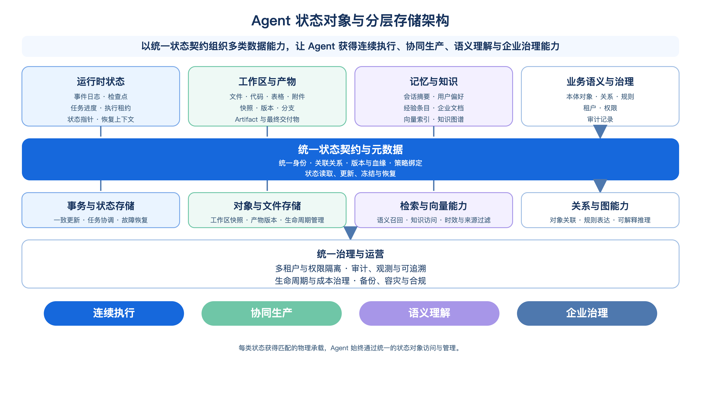

图 8-1　Agent 状态对象与分层存储架构

图 8-1 以四个层次呈现 Agent 状态存储的整体结构：最上层是运行时状态、工作区与产物、记忆与知识、业务语义与治理等面向 Agent 的数据对象；其下是统一状态契约与元数据；再下是事务、对象、检索、关系与图等基础能力；最底层是横跨所有层的统一治理与运营。图中表达的不是某一种数据库的内部结构，而是 Agent 数据平台应提供的能力分工。

这套架构的关键，不是让所有状态落入同一种存储，而是让每类状态获得匹配的物理承载，同时在上层拥有一致的身份、元数据、版本、权限和生命周期。这样，底层可以按对象特性选择合适能力，Agent 却始终通过统一的状态对象访问和管理其任务事实、工作成果与语义资产。

#### 8.1.3 不同状态对象的一致性要求

不同状态对象的差异，最终会体现为不同的一致性与访问要求。运行时状态保存的是任务事实：某个步骤是否已完成、某次工具调用是否已经提交、下一位执行者是谁。这类状态需要明确的写入顺序、原子更新、幂等控制和可恢复的历史，否则任务重试就可能重复执行，多个副本也可能对同一任务给出相互冲突的结论。

工作区与产物更关注版本、快照、引用关系和可回滚性。一份分析表格、一条代码分支或一份生成的报告需要能被准确定位到某次任务执行，既可供协作方复用，也能在后续修改出现问题时回到可信版本。记忆与知识则更强调可检索性、时效性、来源可信度和权限过滤：它们允许经过处理和索引后再被召回，但必须能够说明来自何处、适用于什么范围、何时需要更新或遗忘。本体及治理状态还需要维护对象身份、关系完整性、规则边界和审计证据。

因此，一个向量库或一张会话表可以保存部分信息，却无法天然满足所有对象的语义。若把任务事实仅当作可检索文本，容易丢失顺序与原子性；若把工作成果只当作无版本附件，难以回滚和复用；若把记忆、知识和权限混为同一份上下文，又会让过期信息或越权内容持续影响决策。正确的起点不是先选择某一种引擎，而是先定义不同状态对象的正确性边界，再为其匹配相应的存储能力，并通过统一契约把它们组织为一个整体。

#### 8.1.4 分层存储参考架构：Agent 平台需要内建哪些能力

以 Lakebase 为参考，可以将平台能力分为两层：底层按对象特性提供事务、文件、对象、向量和图等存储能力；上层统一对象身份、元数据、版本、权限和生命周期。统一访问契约有助于减少应用重复集成，但各对象的一致性和恢复保证仍需分别验证。后续各节沿这一结构展开。

**第二部分 存储底座：运行时状态、工作区与快照**

语义能力与平台治理都建立在物理底座之上，而底座要回答两个最刚性的问题：任务中断后能否继续，工作成果能否留存。故障、扩缩容、实例迁移随时可能发生，Agent 的任务事实必须不丢、执行必须可续；沙箱中的代码、文件与产物，必须能被快速创建、安全隔离、可靠交付。

运行时状态存储以事件日志、检查点与跨副本恢复为核心；工作区与产物存储以分层视图、写时复制快照与稳定引用为核心。二者通过版本和状态指针关联，共同支撑任务续行。

### 8.2 运行时状态存储：Event Log、Checkpoint 与跨副本恢复

#### 8.2.1 任务与会话状态的存储模型：状态机与合法转换的持久化

Agent 的运行过程并不是一次模型调用，而是一段可能跨越数分钟、数小时甚至数天的任务链路。它会在规划、工具调用、等待外部系统返回、人工确认、子 Agent 协作等环节之间不断切换。执行实例可以随时被替换，但任务不能因一次实例重启而失去“已经做了什么、下一步该做什么、哪些操作已经生效”的事实依据。

因此，运行时状态存储的首要目标不是保留全部上下文文本，而是持久化任务的可恢复事实：任务当前所处阶段、已经确认的决策、工具调用的结果、待处理的外部事件，以及继续执行所需的状态指针。它构成 Agent 从“可以一次性完成任务”走向“能够稳定完成长任务”的基础。

#### 8.2.2 Event Log：只追加日志的顺序性与强一致

Event Log 是记录任务事实变化的核心机制。每当 Agent 完成一个具有业务意义的动作，例如生成计划、申请执行租约、发起工具调用、收到工具返回、等待人工确认或提交最终结果，系统都会追加一条不可随意改写的事件。这些事件按顺序组合后，便可以还原任务从开始到当前时刻的完整演进过程。

对于运行时状态，顺序尤为重要。假如“发送审批请求”已经成功，却因为结果事件没有被可靠记录而被重新执行，系统就可能向同一位审批人发出多次请求；假如某个子任务已经完成，但父任务没有看到其完成事件，任务编排就可能错误地继续等待。Event Log 的价值，正是在这些边界上提供明确、可追溯的事实顺序。

但“强一致”并不意味着所有 Agent 任务都必须争用同一条全局日志。更合理的边界通常是任务、会话或业务对象：同一任务内部的状态变化需要有明确先后关系，而相互独立的任务可以并发执行。这样既保证了单个任务的正确性，也避免把所有 Agent 工作流锁进一个低效的全局串行系统。

事件记录与当前状态同时维护时，应在事务中提交，或通过可靠的 Outbox 等机制保证最终同步，并以事件标识去重。事件日志只有包含完整的状态变更和必要输入时，才可作为重放依据；诊断日志和模型输出不能直接替代这份记录。

当然，事件并非无限累积。长期任务和高频 Agent 系统会产生大量运行记录，因此平台需要在保留审计事实与控制存储成本之间取得平衡：对近期任务保留细粒度事件，对稳定完成的任务形成可验证快照，并依据业务、合规和审计要求设置保留周期。关键不在于永久保存每一段模型输出，而在于确保影响任务正确性和外部动作的事实始终可追溯。

#### 8.2.3 Checkpoint：快照频率、增量与恢复点目标

如果 Event Log 记录的是“发生过什么”，Checkpoint 则记录“任务在某个可信时刻处于什么状态”。当任务已经运行很久，系统若每次恢复都从最初事件开始逐条回放，不仅效率低下，也会增加恢复过程的不确定性。Checkpoint 通过定期保存任务状态快照，使新的执行实例能够从最近的可信恢复点继续工作。

一个有效的 Checkpoint 不应只是模型上下文的简单拷贝，而应包含恢复所需的关键状态：当前任务阶段、已完成步骤、未完成步骤、工具调用结果引用、工作区版本、子任务状态、等待条件以及状态版本等。它让运行时不必猜测“上一个实例执行到哪里”，而是可以基于已经提交的状态继续推进。

Checkpoint 的频率需要与任务成本相匹配。对于只需数秒完成、失败后可以低成本重试的查询型任务，过度频繁地保存快照反而会增加额外开销；对于会调用外部系统、处理长链路数据、需要人工介入的任务，则应在关键边界主动形成 Checkpoint。这里的关键边界通常包括：外部调用发起前后、长时间计算完成后、人工确认前后、工作区发生重要变更后，以及任务准备交接给其他 Agent 时。

增量快照可以进一步降低成本。很多任务的状态变化只涉及局部字段、一个子任务结果或一个新的工作区引用，没有必要在每次变化时复制完整状态。平台可以基于状态版本保存变化集，并在恢复时组合最近完整快照与后续增量。这种机制既保留了恢复效率，也让运行时状态存储能够适应高并发、脉冲式的 Agent 负载。

Checkpoint 还定义了系统的恢复目标。对用户而言，最重要的问题不是底层保存了多少数据，而是实例故障后任务能从哪里恢复、会丢失多少已完成工作、是否会重复执行外部动作。通过对不同任务设定不同的检查点策略，Agent 平台可以在成本、性能与恢复精度之间形成清晰边界。

#### 8.2.4 跨副本恢复与 Durable Execution：事件重放、执行租约与状态指针契约

Agent 的执行实例应被视为可替换的计算单元，而不是任务事实的唯一拥有者。当某个实例因扩缩容、故障、超时或升级而退出时，新的实例需要能够接管任务。这一过程通常被称为 Durable Execution，即任务的执行过程不依赖于某个特定进程或特定机器，而依赖于外部持久化状态持续存在。

恢复时，新的执行实例首先读取任务的最新 Checkpoint，再按需回放该快照之后的事件。它不必重新执行已经确认完成的步骤，而是从最近一次可信状态继续。这种“快照加事件”的组合，既避免从头回放所有历史，也避免只依赖单一可变状态而失去过程证据。

跨副本恢复还需要解决“谁有权继续执行”的问题。若旧实例尚未完全退出，新实例又开始恢复，同一任务就可能被两个副本同时推进。因此，系统需要通过执行租约确定当前执行权，并在状态写入时附带版本或围栏标识。可以把它理解为任务的“接力棒”：只有持有最新接力棒的实例才能提交下一次状态变化；旧实例即使仍在运行，也不能覆盖新的执行结果。

状态指针则承担“当前可信状态在哪里”的职责。它将任务、事件序列、Checkpoint、工作区快照和最终产物引用关联起来，使恢复实例不必扫描所有可能位置寻找上下文。对外部系统而言，状态指针也为审计和运营提供了统一入口：用户或管理员可以看到任务当前版本、最近检查点、执行实例、关联产物以及等待条件。

需要注意的是，Durable Execution 并不等同于“所有外部动作天然恰好执行一次”。模型调用、消息发送、审批提交、数据写入等操作都可能跨越系统边界。平台能够保证的是任务状态变化具有明确事实边界；对于外部副作用，还需要结合幂等标识、结果确认和补偿机制，避免恢复时把已经成功的动作再次提交。这也是为什么运行时状态存储必须同时保存调用意图、调用标识和调用结果，而不能只记录一句“正在执行”。

#### 8.2.5 性能、稳定性与弹性：应对脉冲式负载

Agent 负载天然具有脉冲特征。一批用户同时发起分析请求、一个复杂工作流拆分出大量子任务、外部工具短暂超时后集中恢复，都会在较短时间内形成状态写入和恢复读取的高峰。若运行时状态与计算实例紧耦合，平台往往只能通过扩大实例规模来缓解压力，成本高且恢复能力有限。

将状态外置后，计算与状态可以分别弹性伸缩。执行层可以根据任务数量快速扩缩；状态层则需要按任务分区、访问热点和持久化等级提供稳定吞吐。对平台而言，关键不是让每一条事件都追求最低延迟，而是在高负载、实例切换和局部故障条件下，仍能保证任务状态不丢失、不乱序、不被旧副本覆盖。

稳定性同样取决于状态数据的分层处理。近期正在执行的任务需要低延迟读取和高频更新；已经完成但仍可能被审计、追踪或再次打开的任务，需要可检索的历史记录；长期不再活跃的运行事件，则可在满足治理要求后归档。通过冷热分层、快照压缩、事件保留策略和按需回放，平台可以避免历史任务持续挤占实时任务资源。

运行时状态提供任务续行依据；执行中形成的代码、表格、报告和中间文件，还需要通过工作区与产物存储被可靠保存和交付。

### 8.3 工作区与沙箱快照的存储后端

运行时状态保证 Agent 知道“任务进行到哪里”，工作区与产物则保证 Agent 保留“任务已经做出了什么”。一个真实任务不会只产生文字回答：数据分析会生成表格与图表，研发任务会生成代码与测试结果，运营任务会生成方案、素材和审批附件。它们既是 Agent 后续推理的依据，也是人与 Agent 协作时需要交付、审阅和复用的工作成果。

因此，工作区不应被视为执行实例上的临时目录。实例本地文件可以提供快速读写，却不应成为唯一事实来源；一旦实例被替换、任务分支被切换或多名协作者同时参与，临时目录中的内容便难以定位、复用和审计。面向 Agent 的工作区存储，需要把“可运行的临时环境”演进为“可持续管理的任务资产空间”。

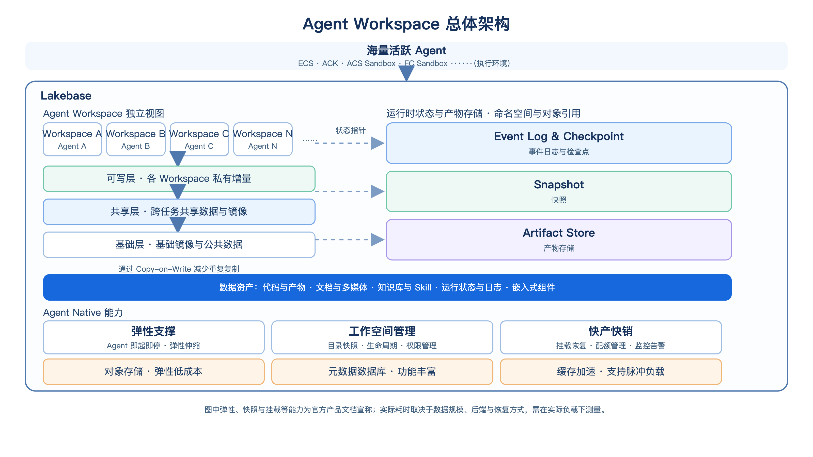

图 8-2　Agent Workspace 总体架构

图 8-2 展示了 Lakebase 参考架构中的工作区分层：基础层、共享层和可写层通过 Copy-on-Write 减少重复复制；运行时状态与产物存储通过命名空间和对象引用关联；元数据数据库、对象存储与缓存提供底层承载。快照和挂载耗时取决于数据规模、后端与恢复方式，需要在实际负载下测量。

#### 8.3.1 工作区的存储形态：共享文件存储、对象存储与加速层

Agent 工作区包含的内容具有明显差异：源代码和配置文件需要目录结构与频繁的小文件读写；训练数据、附件、图像和音视频需要大容量与低成本保存；生成的报表、脚本、模型结果和压缩包需要稳定引用与对外交付；热点数据还需要靠近执行环境以降低等待时间。

这意味着工作区的底层承载可以具有不同形态，但对 Agent 而言应呈现为统一的任务空间。Agent 不需要理解每一个文件究竟落在何种基础设施上，而应能够以一致方式访问“当前工作区”“某次快照”“某个分支”和“某份已交付产物”。平台负责根据对象大小、访问频率、协作方式和保留要求，提供匹配的物理承载与访问加速。

共享文件能力适合需要保留目录结构、被多个执行单元共同访问的内容；对象化能力适合大文件、不可变成果和长期归档；本地或近端加速层适合频繁访问的热点数据。三者并不是让用户面对多套产品，而是共同构成一个逻辑工作区的不同层次。Agent 看到的是任务资产，平台处理的是位置、缓存、版本和生命周期。

这种分层还改变了工作区的管理方式。过去，一个沙箱停止后，其目录通常随实例一起消失；在 Agent 平台中，实例只是工作区的一个临时挂载点。工作区本身拥有独立身份、访问权限、版本历史和生命周期，可以被新的执行实例重新挂载，也可以被其他 Agent 或人工协作者有选择地共享。

#### 8.3.2 分层工作区：可共享基础镜像与私有可写层

高质量的 Agent 工作区既要支持快速启动，也要避免不同任务之间相互污染。分层工作区是解决这一矛盾的常见方式：底部是可复用、只读的基础层，例如运行环境、依赖、模板和公共数据；中间是任务或租户可共享的数据层；顶部则是当前任务独占的可写层，用于保存本次执行产生的代码修改、中间文件和结果。

这种结构的核心思想是“共享不变部分，隔离变化部分”。多个 Agent 可以基于同一个基础环境启动，而不必为每一次任务完整复制运行镜像和依赖；每个任务只记录自己产生的变化，从而减少启动时间和存储成本。对于包含多个探索分支的任务，不同分支也可以从同一基础版本派生出各自的可写层。

分层并不只是性能优化，也是一种治理边界。公共基础层应由平台或受控团队维护，避免 Agent 随意修改共享依赖；任务可写层归属于具体任务和租户，避免不同用户之间的文件交叉可见；需要沉淀为正式成果的文件，则应从可写层显式进入产物库，获得稳定身份、版本和保留策略。

对于 Agent 而言，这种机制使“试错”与“交付”能够并存。它可以在私有可写层中修改脚本、生成数据、尝试多种方案；但只有经过确认的结果，才会被提升为可共享、可引用的任务资产。这样既保留了 Agent 执行的灵活性，也避免临时文件、失败尝试和最终成果混杂在同一个空间中。

#### 8.3.3 快照、回滚与分支：Copy-on-Write

Agent 的工作过程天然具有探索性。它可能在生成报告前尝试多种分析口径，在修改代码前创建实验分支，在处理数据前先执行清洗和抽样。如果每一次尝试都直接覆盖原始工作区，失败后便难以恢复；如果每一次尝试都完整复制全部内容，又会造成高昂成本和长时间等待。

快照为工作区提供了可恢复的版本边界。它记录某一时刻工作区中可见文件、目录结构和关联元数据，使 Agent 或人工协作者能够在后续回到该状态。快照可用于试验、审阅、回滚和分支，也可成为备份的一部分；是否具备独立容灾能力，取决于存储位置与故障域。环境回滚不撤销已经提交到外部系统的操作。一个可信快照应能够回答“这是哪个任务、哪个阶段、基于什么输入、由谁生成、后续产生了哪些变化”。

Copy-on-Write 让快照不必复制整份工作区。在创建快照后，未发生变化的内容继续复用已有数据，只有新写入或被修改的部分才形成新的数据块。这样，Agent 可以在短时间内创建多个实验分支，而不必为每个分支重复保存相同的基础内容。对用户来说，这意味着工作区可以像代码版本一样被安全地试验和回退；对平台来说，则意味着版本能力不再以成倍复制数据为代价。

快照还应与运行时状态形成关联。当任务进入关键阶段、完成重要工具调用、准备交给人工审批或切换到其他 Agent 时，运行时 Checkpoint 应记录对应的工作区快照引用。这样，恢复实例不仅知道任务停在何处，也能重新挂载当时准确的工作环境，避免出现“任务状态已经恢复，但文件状态已经变化”的不一致。

#### 8.3.4 多副本并发恢复：执行租约与围栏（Fencing）

工作区的并发问题与运行时状态不同，但二者必须协同处理。8.2 中的执行租约解决“哪个实例有权推进任务状态”；工作区则需要进一步解决“哪个实例有权修改当前可写层”。如果两个副本因为网络抖动或异常恢复而同时写入同一工作区，即使任务状态最终只有一个副本成功提交，文件内容也可能已经被并发覆盖。

任务私有的可写工作区需要独立的写入约束。支持围栏的写入接口应验证当前执行代次；普通文件系统若无法逐次校验，则可采用独占挂载、撤销旧端访问，或让实例写入私有分支、仅允许当前持有者发布新版本。仅更新任务表中的租约，无法阻止仍持有文件句柄的旧实例继续写入。

对于需要多个 Agent 协作的场景，平台不应简单地让所有 Agent 同时修改同一份目录，而应显式区分共享与私有边界。一个 Agent 可以在自己的可写分支中完成分析，另一个 Agent 通过稳定快照或 Artifact 引用读取其结果；需要合并时，再通过明确的版本合并和审批过程形成新的可信状态。这样可以避免把多 Agent 协作退化为不可审计的文件覆盖竞争。

不可变产物在这里尤为重要。对于已经完成的报表、数据集、测试结果或交付包，一旦进入 Artifact Store，就不应再被原地修改；后续变更应生成新版本。这使引用方始终能够知道自己读取的是哪一份内容，也避免某个 Agent 在不知情的情况下使用被覆盖的结果。

#### 8.3.5 Artifact Store：可寻址、可保留与可交付

Artifact 是 Agent 在任务过程中形成、并具有复用或交付价值的成果对象。它可以是一份分析报告、一个代码补丁、一个表格、一个数据集、一组图表、一段音视频处理结果，或一个可部署的软件包。它与普通临时文件的区别在于：Artifact 需要被稳定定位、长期保留、授予访问权限，并能够作为后续任务的可信输入。

Artifact Store 的价值并不只是“保存文件”。它需要为每份成果建立清晰身份，并附带来源任务、创建时间、版本、生成 Agent、输入依据、审批状态、权限范围和保留策略等元数据。这样，用户看到的不再是一堆难以理解的目录和文件名，而是能够被检索、引用和审计的任务成果。

可寻址能力让 Agent 和人都能准确引用同一份成果。例如，一个后续分析任务可以引用“经审批的第三版客户流失报告”，而不是依赖某个易变的临时路径；一个人工协作者可以打开与某个任务 Checkpoint 对应的图表版本，而不是猜测哪份文件才是最新结果。稳定引用是多 Agent 协作、人工复核和跨任务复用的前提。

可保留能力则让平台能够区分临时过程与正式资产。一次性中间文件可以在任务结束后按策略清理，已交付成果则应按照业务、合规或项目周期长期保存。这样的生命周期管理既避免工作区无限膨胀，也避免有价值的成果在实例释放时意外消失。

Artifact 还是连接工作区与语义层的重要桥梁。并非所有临时文件都应自动进入长期记忆或知识库；只有经过提取、校验、分类和权限确认的成果，才适合被进一步组织为可检索知识、经验条目或业务对象关系。这样，8.3 解决“成果如何被可靠保存和交付”，而 8.4、8.5、8.6 则进一步解决“成果如何被理解、关联和持续利用”。

#### 8.3.6 规模化工作空间的性能、成本与冷热分层

当 Agent 从少量试验任务扩展到大量日常工作流时，工作区与产物存储面临的不再是“能不能存”，而是“能不能在高频、多租户、长周期条件下稳定运行”。

首先是存储规模。每个 Agent 任务可能产生快照、中间文件、分支和交付产物，且不同任务的保留周期不同。平台需要支持冷热分层：近期活跃任务保留完整工作区和细粒度快照，已完成任务仅保留关键快照和正式产物，过期数据按策略归档或清理。若缺少分层策略，存储成本将随任务量线性甚至超线性增长。

其次是访问并发。当多个 Agent 并行执行、共享基础层或交叉引用产物时，存储层需要在不牺牲一致性的前提下提供足够吞吐。对象存储适合大文件和不可变产物，共享文件系统适合频繁读写的目录结构，缓存层适合热点数据的低延迟访问。关键不在于追求单一最优方案，而在于让不同层次的存储在并发压力下仍能保持正确和稳定。

第三是多租户隔离。不同用户、不同业务线的 Agent 工作区之间必须具有清晰的访问边界。即使底层共享同一套存储集群，也不应出现跨租户的数据可见性泄漏。平台需要在存储层实现基于身份和任务的隔离，同时保证快照、产物和元数据在各自边界内的完整性。

最后是长期可运营性。工作区和产物的元数据需要支持检索、审计和合规检查。企业需要知道某个产物由哪个任务、哪个 Agent、在什么时间生成，基于哪些输入，经历了哪些审批。这些元数据既不能只保存在运行时上下文中（实例退出后即丢失），也不能只保存在产物文件中（无法高效检索）。独立的元数据索引是规模化运营的必要条件。

综合来看，运行时状态存储（8.2）保证任务在故障和迁移后能继续执行，工作区与产物存储（8.3）保证任务产出的成果能被可靠保存、交付和复用。二者共同构成 Agent 平台的数据基础，使 Agent 从“能完成单次任务”走向“能稳定承担日常业务流程”。

**第三部分　语义层：长期记忆、知识库与本体**

Agent 的运行时状态与工作区解决了“当前在做什么”的问题，跨任务的信息复用还涉及经验记录、外部知识以及业务对象之间的关系，分别对应记忆、知识库与本体。

三者的差别首先在来源、用途和维护责任。记忆来自经过筛选的交互与执行经验，知识来自可追溯的外部资料，本体维护业务概念、关系与规则。并非所有应用都需要三者齐备，应按任务对跨会话复用、知识检索和关系推理的需要选择。

Lakebase Agentic Schema 的参考设计将记忆、知识与本体纳入统一语义层。统一的是对象关联和治理方式，三者仍分别维护来源、版本、更新与失效规则。

### 8.4 长期记忆的持久化、检索与生命周期

#### 8.4.1 从会话状态到长期记忆

会话上下文服务于当前交互，其内容是否跨会话保留取决于应用的持久化与加载方式。当用户再次提出“照上次的方案来”时，系统需要找到相关历史，并判断它是否仍然有效。长期记忆为这种跨会话复用提供经过筛选的记录。

长期记忆可以保存用户明确表达的偏好、稳定的领域事实和经过验证的方法。它帮助后续任务减少重复询问，但记忆的存在不保证理解准确，召回、来源验证和用户纠正同样必要。

#### 8.4.2 记忆分层模型与物理承载

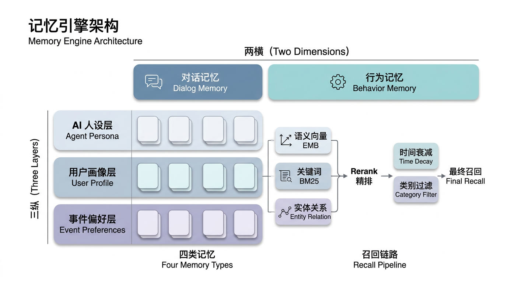

图 8-3　长期记忆的分层组织与混合召回

参考架构以两个独立的正交维度组织长期记忆，避免把“来源”与“稳定性”混为同一分类轴。

第一个维度按来源分三类：用户显式表达（对话中的偏好、要求与反馈），Agent 行为归纳（工具调用模式、执行路径与错误处理经验），外部业务事实（订单状态、审批结论等由业务系统写入、由记忆服务承接的事实）。前两类回答“用户说了什么”与“Agent 学到了什么”，第三类回答“业务上发生了什么值得记住的事”。

第二个维度按稳定性分三层：人设与身份层（Agent 角色、行为规范、长期稳定的人格与边界），画像层（用户角色、偏好、习惯，更新频率以周、月计），事件偏好层（具体场景中的交互事件与偏好，最细粒度也最易变）。两个维度正交——同一条用户显式表达，可能落入画像层，也可能落入事件偏好层；同一类 Agent 行为归纳，也可能被人设层（稳定规则）或事件偏好层（临时策略）吸收。

Persona（Agent 人设与身份配置）不作为经验性记忆，而由构建方或治理方显式维护，并受版本与权限控制；它构成记忆的基底，但不来自 Agent 的经历。

面向高频召回的记忆可进入向量索引与缓存加速层，低频历史记忆则沉淀到成本更低的持久化层。通过逻辑分层与物理承载的匹配，平台能够同时兼顾个性化理解、在线响应和长期运营成本。

#### 8.4.3 记忆写入管线：抽取、合并与冲突消解

记忆不是原始对话的简单归档，而是经过结构化加工后的认知沉淀。写入首先需要从对话文本和行为日志中抽取具有长期价值的信息，如偏好声明、事实陈述和重复出现的行为模式。核心在于区分“什么值得记、什么应该忘”：寒暄、临时调试指令和一次性查询不宜进入长期记忆，只有对后续交互有预测价值的信息才应沉淀。

新记忆不会被简单追加，而是与已有记忆进行语义匹配、合并与去重。多次独立交互指向同一结论时，记忆的可信度随之增强；当新旧记忆产生冲突时，系统结合时效性、来源可靠度与上下文完成覆盖或保留待确认状态，确保记忆既能反映最新意图，也不会因过度覆盖而丢失重要事实。

#### 8.4.4 记忆检索：向量、结构与混合召回，相关性与时近性

记忆的写入只是起点，更关键的是在海量记忆中精准召回。与文档检索不同，记忆的实际价值不仅取决于语义相关性，还与时近性、引用频率和当前场景的适配度有关。一条三个月前的记忆即使语义上高度相关，也可能因用户偏好变化而不再适用。

Lakebase 采用多路混合召回：语义向量检索通过 Embedding 捕捉表达背后的相似含义；关键词检索以 BM25（Best Match 25）等机制补充词项匹配与排序；实体关系检索围绕人物、项目和组织等业务实体，发现文本表面不相似但实际高度关联的历史信息。候选结果经 Rerank 精排后，结合时间衰减和类别过滤输出最终上下文。

时间衰减可以提高近期记忆的排序权重，但不适用于所有信息。长期有效的约束不应仅因较少被调用而淡出；引用频率也不等于正确性，应与来源和实际验证结果共同使用。

#### 8.4.5 记忆更新与遗忘：衰减、淘汰与生命周期管理

记忆并非写入后就一成不变。用户偏好会改变，过时的信息会失去价值，重复的内容会稀释高质量记忆的召回概率。因此，“遗忘”与“记住”同等重要。Lakebase 覆盖写入、检索、引用、更新和淘汰的完整生命周期，使记忆库能够长期保持紧凑、可信与可用。

自动整理可以在空闲时执行增量合并、冲突消解、摘要压缩和结构化抽取。例如，多次表达“少放辣”可形成候选偏好，但不宜直接推断为所有饮食习惯。压缩后的记忆应保留来源引用，无法确定的概括保留待确认状态。

归档、降低召回权重与删除是不同操作。用户要求删除的信息需要同步处理原始记录、摘要、索引和缓存，并防止后续重建将其重新引入；依法或依约保留的记录应隔离用途，按明确的保留策略处理。

#### 8.4.6 多模态记忆空间：文本、图像与音视频的统一管理

随着 Agent 交互场景的丰富，记忆的载体已超越纯文本。产品截图、语音备忘和演示视频中包含的设计决策、情绪线索和操作过程，往往同样影响后续任务的理解与执行。若只能记住文字内容，Agent 将在多模态交互中丢失大量关键上下文。

Lakebase 的多模态记忆空间支持文本、图像、音频和视频等内容的统一持久化与语义检索。系统提取不同模态的语义特征建立索引，使 Agent 能够用自然语言召回相关图片、音频或视频记忆；各类记忆同时共享统一的权限、生命周期和关联机制，返回结果保留模态、来源和原始资源引用，便于后续核验。

#### 8.4.7 记忆治理与运营：隐私、安全、审计、Agent 接入与全链路可视化

长期记忆天然包含用户的个人信息与行为轨迹，治理必须在数据可用性与隐私保护之间取得平衡。记忆越精准、越个性化，其潜在敏感度也越高，因此治理不能只覆盖静态存储，还需要贯穿写入、检索、使用和删除的全链路。

Lakebase 提供分类分级、权限隔离、访问审计与合规脱敏等能力，确保每条记忆只在授权范围内被使用。平台以标准化接口和凭证体系接入不同 Agent，使其只能访问被授权的记忆空间；全链路可视化则让运营者能够追踪一条记忆从写入、召回、引用到归档或淘汰的全过程，为合规审计、体验优化和问题排查提供依据。

#### 8.4.8 规模化记忆服务的验证

教育场景可以通过学习偏好与知识掌握记录验证记忆服务；CRM（Customer Relationship Management，客户关系管理）场景可以检验客户沟通记录能否在后续任务中被准确调用。规模化验证需要同时报告活跃用户、记忆条目、并发查询、数据规模、召回质量及 P95/P99（95 分位与 99 分位）延迟，单独一个日活或延迟数字不足以说明服务能力。

除吞吐和时延，还应验证记忆纠正、权限撤回、索引延迟及故障恢复是否影响后续回答。对体验的改善应通过明确的任务指标和对照样本评估，避免仅凭“记住了更多内容”推导质量提升。

### 8.5 RAG 与知识库：索引、召回与更新

#### 8.5.1 知识库与长期记忆的边界：内容从哪里来、由谁治理

记忆与知识库虽然同为 Agent 的知识来源，但二者边界清晰：记忆是 Agent 自己“经历”的，来自对话和行为积累，由应用、用户及相应维护者共同管理；知识库是 Agent 外部“引入”的，来自企业文档、产品手册、行业报告和业务数据，通常由知识管理员或业务团队负责维护。

记忆和知识都需要来源核验。知识库内容并不因被导入而自动权威，记忆也不因来自真实交互就必然正确。构建篇讨论两者如何进入上下文，本节重点说明知识源如何解析、建立索引、更新并在授权范围内返回。

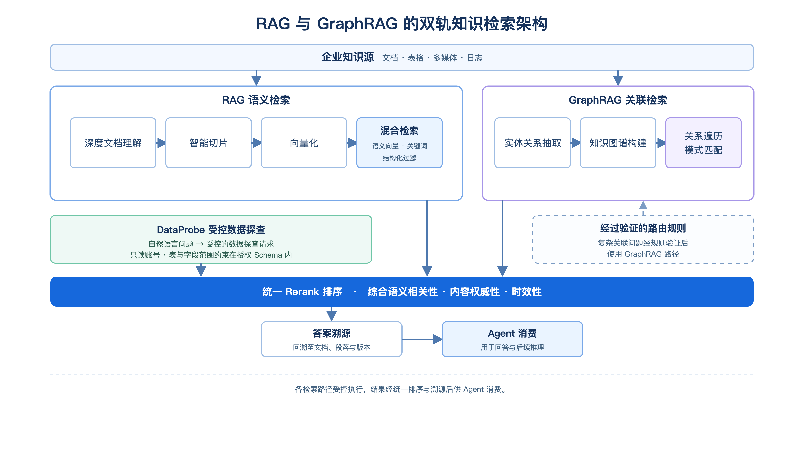

图 8-4　RAG 与 GraphRAG 的双轨知识检索架构

图 8-4 的要点不在检索路径的数量，而在每条路径的边界受控：RAG 承担语义相似检索，GraphRAG 面向需要跨实体关系推理的问题、按经过验证的路由规则启用，DataProbe 以只读账号在授权 Schema 范围内补全结构化探查；多路候选统一经 Rerank 排序，结果保留答案溯源后供 Agent 消费。后续小节将依次展开文档解析、索引与增量更新、混合召回、GraphRAG 与知识治理的具体机制。

#### 8.5.2 深度文档理解与解析：多格式、表格与图文混排

企业知识的载体多样，包括技术手册、合同文本、研报、会议纪要和政策文件等，格式与结构各不相同。知识引擎的深度文档理解层负责将这些内容转化为 Agent 可消费的语义单元。

解析深度决定了后续检索质量的上限。系统不仅提取文字，还保留标题层级、段落关系、表格数据、实体、时间与数值等结构和语义要素，使每个知识片段都拥有充分的上下文锚点。这样可以避免将属于“海外业务”的退货政策用于国内业务这类断章取义；对于图文混排内容，图片文字与图像语义也可一并提取，减少信息遗漏。

#### 8.5.3 索引构建与增量更新：切片策略、向量化与避免全量重建

文档解析完成后，知识片段需要经过切片、向量化和索引构建才能进入检索服务。切片策略直接影响检索效果：切片过大会引入噪声，切片过小则会丢失必要上下文。Lakebase 支持以标题、段落和语义转折为边界进行智能切片，并保留父级标题等上下文信息。

企业知识库会持续新增、修订和删除内容。平台可通过变更检测只处理发生变化的部分，并记录源版本、解析版本和索引水位。新版本完成构建与验证后再切换查询入口；更新时效应按实际数据规模和管线能力设定，不能由“增量”直接推导固定生效时间。

#### 8.5.4 混合检索与多路召回：向量、全文、结构化过滤与统一排序

单一检索策略无法覆盖所有查询场景。语义向量检索擅长理解概念相似性，却可能忽略产品型号等专有名词；关键词检索擅长精确匹配，却难以理解同义表达；结构化过滤可以严格限定范围，但无法独立完成语义理解。混合检索的价值不仅在于多路并行，更在于根据查询特征动态调配各路权重。

Lakebase 支持语义向量检索、全文关键词检索和基于文档类型、时间范围、所属部门等元数据的结构化过滤。对关系型数据库中的业务事实，DataProbe 可将 Agent 的自然语言问题转换为受控的数据探查请求，补全非结构化文档检索的不足；此类探查应使用只读账号，并将可访问的表与字段范围约束在授权 Schema 内。多路候选经统一 Rerank 排序后，综合语义相关性、内容权威性和时效性输出结果；复杂关联问题可在经过验证的路由规则下使用 GraphRAG 路径。

#### 8.5.5 GraphRAG：知识图谱增强的检索与生成

传统 RAG 本质上是“按片段检索”：每次返回一个或多个独立的文档片段。但许多业务问题的答案并不存在于某一段文本中，而是分散在多个文档、多条事实之间的关系推理结果。例如，识别一家公司高管与竞争对手之间的任职关联，需要跨实体遍历和关系判断，而非仅仅命中文本。

Lakebase 的 GraphRAG 在向量检索之上引入图谱索引层，抽取实体与关系并构建知识图谱。其双层索引架构中，语义层负责召回相关文档片段，图谱层负责关系遍历与模式匹配，最后将两类结果融合为同时具备事实依据和推理链路的回答。图谱辅助检索可用于股权穿透、供应链关联分析和跨法规条款审查等复杂场景；抽取关系与模型推断均需保留来源并验证。

#### 8.5.6 知识治理：权限过滤、答案溯源与知识接入

知识治理覆盖权限过滤、答案溯源和知识接入三个维度。权限过滤基于用户角色和文档密级在检索阶段进行控制，防止 Agent 直接或间接使用当前用户无权获取的内容；这种控制需要覆盖检索到生成的全链路，避免推理过程成为受限信息的旁路。

答案溯源让每个基于知识库生成的回答都能回溯至具体文档、段落与版本，是用户验证和审计的基础。标准化知识接入管线则支持从企业网盘、CMS（Content Management System，内容管理系统）、Wiki 等多种来源持续同步内容；配合版本快照、回滚、时效检测和引用分析，帮助运营者维护知识的可信度和新鲜度。

#### 8.5.7 规模化与成本：检索延迟、冷热分层与湖库一体

大规模知识库同时面临性能与成本挑战。若将数百万文档的全部索引长期驻留在高性能介质中，成本难以控制；若全部下沉至低成本存储，又无法满足在线 Agent 的实时响应要求。

Lakebase 通过冷热分层平衡这两类需求：高频访问的热点知识驻留在内存索引和 SSD（Solid State Drive，固态硬盘）缓存中，以保障低延迟检索；低频内容自动迁移到更低成本的存储层，并可依据访问模式透明回温。湖库一体的承载方式使知识服务兼顾大规模数据湖的成本优势和在线查询的性能要求，为规模化 RAG 与 GraphRAG 提供可持续的运营基础。

### 8.6 本体（Ontology）：让 Agent 理解业务世界

#### 8.6.1 超越 RAG：从检索片段到结构化语义

RAG 知识库解决了“Agent 能找到相关信息”的问题，但找到一段文本并不等于理解它。当 Agent 检索到“该客户的订单已逾期”时，它还需要理解订单与客户、产品之间的关系，知道逾期对应什么业务规则，以及可能触发什么后续动作。这些结构化语义并不天然存在于孤立的文本片段中。

本体（Ontology）显式定义业务概念、关系与规则，为跨对象查询和规则判断提供结构。当任务只需要检索少量文档时，可以从常规检索开始；当实体身份、关系约束和多跳查询成为持续需求时，再引入本体并承担相应建模和维护成本。

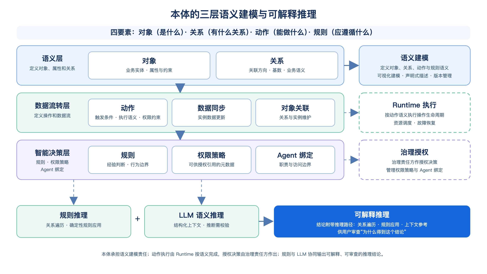

图 8-5　本体的三层语义建模与可解释推理

#### 8.6.2 本体建模：业务对象、动作、关系与规则的显式表达

Lakebase 的本体建模围绕对象、关系、动作和规则四个要素展开。对象定义客户、订单、产品等业务实体及其属性与约束；关系定义对象之间的关联方向、基数和业务语义，使 Agent 可以沿着“客户—订单—产品”等链路探索；动作定义触发条件、执行逻辑和权限约束，将“知道”转化为“能做”；规则则将业务专家的经验判断显式化，约束 Agent 在自主决策时的行为边界。

四要素形成从“是什么”到“有什么关系”、从“能做什么”到“应遵循什么”的完整语义表达。本体内部由三层递进组织：语义层定义对象、属性和关系；数据流转层定义操作和数据流；智能决策层定义规则、权限策略和 Agent 绑定。由此，本体不只是业务词典，更是一套支撑业务理解的语义框架。

这一分工也界定了本体的责任边界：本体承担语义建模责任，保留对象、关系、动作语义，并沉淀可供授权引用的规则与元数据；动作的执行生命周期由 Runtime 按语义完成；涉及权限与 Agent 绑定的授权决策由治理责任方作出。语义定义、执行与授权三种责任相互分离，避免执行逻辑和治理决策混入语义模型，本体本身也能通过版本管理独立演进。

#### 8.6.3 本体动态管理：数据同步与对象关联

新增业务概念、组织调整和规则修订会影响本体。实例数据更新与模型定义变更应分开处理：前者更新对象的当前属性和关系，后者改变 Schema 或业务规则，需要版本管理与影响评估。

Lakebase 支持通过可视化界面或声明式方式描述业务模型，并将模型映射到数据同步和对象关联过程。当底层业务数据发生变化时，系统同步相关对象实例与关系；对象定义和规则的变更通过独立版本流程处理。核心概念保持相对稳定，外围属性和扩展关系允许灵活演进；配合版本管理和影响分析，可在稳定性与灵活性之间取得平衡；同步水位与校验则用于发现本体和业务数据之间的差异。

#### 8.6.4 图谱存储与推理：规则与 LLM 协同的可解释推理

图谱可以支持规则执行和关系遍历，LLM（Large Language Model，大语言模型）则可使用检索到的结构化上下文辅助判断。确定性规则的结果依赖规则与输入数据的正确性；LLM 给出的推断也需要校验，不能因采用本体就默认可解释或准确。

这种协同避免了纯规则推理僵硬、难以处理例外，以及纯 LLM 推理缺乏结构约束、容易产生不可靠结论的两类局限。每个关键结论都可附带关系遍历、规则应用和上下文参考的推理路径，让用户能够审查“为什么得到这个结论”。这种可解释性是 Agent 获得业务信任的重要基础，也使其能够用于客户关系分析、供应链根因追溯和合规校验等严肃场景。

#### 8.6.5 本体运维与演进：可视化建模、版本管理与权限控制

本体运维需要让业务专家与技术团队共同参与。Lakebase 的参考设计通过可视化方式创建对象、关系和规则，降低领域专家参与语义建模的门槛；版本管理记录每次变更并支持回溯、对比和回滚，使变更过程可追溯。

权限控制则确保不同角色的 Agent 只能访问其被授权的本体子集。平台可持续监测本体的结构完整性、实例覆盖率和查询热点，识别定义缺失或冗余的区域。其中，本体覆盖率尤其值得关注：若大量实际业务数据不能被现有概念描述，说明业务语义仍存在盲区，Agent 在这些区域难以形成可靠的结构化理解。

#### 8.6.6 本体、知识与记忆的协同：语义层的统一视图

本体、知识与记忆并非独立运作，而是形成统一的语义层视图。本体为知识提供骨架，使每个文档片段获得概念定位；例如，设备故障排除文档可被组织为“设备类型—故障模式—解决方案”的结构化链路，而不再只是孤立文本。

知识为记忆赋予业务语义。一条“上次交付延迟了”的用户反馈，只有置于知识与本体框架中，才能被理解为某订单、某时间段和某交付规则下的问题。记忆又会驱动知识与本体的演进：当大量交互持续暴露某项新产品特性或新的业务关联时，平台可提示补充知识并评估是否新增概念、关系或规则。

记忆、知识与本体之间的反馈应通过受控更新实现。交互可以提出候选事实或模型修订建议，由相应维护者验证后生效；不得将模型推测直接写成组织规则。

#### 8.6.7 行业实践：本体的落地案例

在金融行业，Agent 可围绕客户、账户、产品和交易构建本体骨架，结合研报、公告等知识库与客户交互记忆，完成从客户画像到风险评估的链路。本体定义“客户—持仓—风险等级”等推理路径，知识库提供市场行情与监管规则，记忆记录客户风险偏好的变化，三者共同支撑跨数据源的关联判断。

在制造行业，产品、设备、工艺和供应链本体可与工艺知识库、运维记忆联动，覆盖质量追溯和供应链优化等场景。本体提供“零部件—供应商—产线—成品”的关联拓扑，知识库提供工艺参数标准，记忆沉淀历史运维经验。三元组协同使 Agent 不再只是回答简单问题的检索工具，而能够理解业务、积累经验并持续进化。

**第四部分　平台化：多租户、一致性与技术选型**

前三部分分别讨论了 Agent 的运行时状态、工作区与产物，以及记忆、知识和本体等语义对象。它们共同构成了 Agent 可持续运行、不断学习并理解业务世界的数据基础。但当 Agent 从单点试验走向企业级规模，挑战不再只是把数据存下来，而是如何使这些分散的数据对象在多租户环境中保持隔离、在跨组件流转中维持可信、在生命周期内可治理，并最终形成可演进的平台能力。

平台化的本质，不是再增加一个管理入口，而是为 Agent 数据建立统一的治理层。按照全书的三平面划分，执行平面承载 Agent 的实际推理与工具调用，数据平面承载事件、状态、文件、向量、图谱等对象，控制平面则以统一的身份、元数据、策略和可观测性，回答这些对象属于谁、从何而来、能被谁使用、应保存多久。故障恢复同样遵循这一分工：控制平面定义恢复策略，执行平面的 Runtime 负责落实。只有三者协同，Agent 才能从能运行的应用，走向可规模化运营的生产系统。

### 8.7 多租户隔离、一致性与技术选型

企业中的 Agent 往往同时服务于多个组织、部门、业务空间和用户群体。一个 Agent 的会话记忆、业务知识和执行产物，既可能包含普通协作信息，也可能关联客户数据、经营数据甚至高敏感业务规则。因此，平台需要将隔离、一致性、元数据、成本与可用性视为统一问题，而非分别交给不同组件处理。

Agent 数据的复杂性在于：它并非单一结构化表，而是跨越事件流、对象文件、关系数据、向量索引和图谱关系的复合状态。平台化能力的目标，是让应用开发者面向稳定的数据对象和服务契约进行构建，而不必在每个 Agent 中重复处理权限拼接、状态对齐、索引延迟、生命周期清理和故障恢复等基础问题。

#### 8.7.1 多租户隔离模型：物理、逻辑与行级隔离

多租户隔离首先是一项数据边界能力。对于 Agent 而言，这个边界不仅存在于业务数据库中，也必须贯穿记忆召回、知识检索、文件访问、向量搜索、工具执行和运维观测的全过程。若隔离只停留在业务表的查询条件中，Agent 仍可能通过共享索引、缓存命中、产物链接或日志检索接触到不应访问的信息。

一个完整的多租户模型，通常应覆盖组织、工作空间、Agent、用户、Task 与 execution（运行实例）。组织定义业务与合规边界；工作空间承载团队协作与共享资产；Agent 定义特定智能角色的可访问范围；用户决定交互和授权主体；Task 是承载业务目标、权威状态和成功标准的逻辑任务，可跨会话、等待和恢复阶段持续存在；execution 则表示一次具体执行实例。平台应将这些身份边界映射为可传播、可校验的上下文，使每一次读写、检索和执行都携带明确的归属信息。

隔离策略可按业务敏感度和规模分为三个层次。物理隔离面向强监管、高敏感数据与重要客户专属环境，采用独立存储或资源池，边界清晰、隔离强度最高；逻辑隔离适用于多数企业级业务空间，通过独立库、Schema、索引命名空间或对象目录划分边界；行级隔离面向大规模共享服务与细粒度协作，在统一数据服务中按租户、角色、用户和数据标签实施访问控制。

三种方式并非互斥。一个实际的平台通常采用分层组合：高敏感业务采用物理或独立逻辑空间，普通协作数据采用共享基础设施上的逻辑隔离，细粒度的项目成员、角色和数据分类则由行级策略约束。这样既能保障隔离强度，也能避免所有业务都采用独享资源所带来的成本失衡。

对于向量、图谱等语义数据，隔离还需要特别关注检索前过滤。传统数据查询可以在返回结果时再进行权限判断，但语义检索若先跨租户召回、再过滤结果，可能已在候选生成阶段引入不必要的数据暴露风险。因此，平台应在索引空间、检索条件和重排序策略中前置租户与权限约束，让 Agent 只在被授权的语义空间中进行召回。

从更长远看，多租户隔离不仅保护数据，也保护 Agent 的行为边界。不同租户的偏好、记忆和规则不能因为共享模型调用或共享工具链而相互影响。可靠的隔离能力，使企业可以在统一平台上规模化部署 Agent，同时保持每个组织对自身数据、策略和行为结果的控制权。

#### 8.7.2 存储组件之间的一致性：写入、索引与读副本

Agent 的一次执行，往往会同时产生多个数据变化：事件日志记录过程，检查点保存可恢复状态，工作区生成文件，记忆服务抽取经验，知识库更新索引，本体层补充对象关系。它们使用的存储机制和更新节奏并不相同，因此不能简单以所有组件同时成功来定义一致性。

更合理的目标，是围绕不同数据对象定义相匹配的一致性等级。对影响任务正确性的运行时状态，例如执行租约、支付系统的确认结果、工具调用结果和关键检查点，应以强一致或可验证提交为目标；对向量索引、全文检索、统计聚合等派生数据，则可接受短暂的最终一致，但必须让系统明确知道其新鲜度和对应的源数据版本。

平台应将权威事实与派生视图区分开来。事件日志、对象元数据、关键状态记录通常可视为权威事实的物化载体，其语义权威由业务应用、任务模型与事实产生组件定义，存储层负责可靠提交与物化；向量索引、图谱投影、缓存和读副本则是基于权威事实构建的派生能力。写入时，先确保权威事实被可靠提交，再通过异步或增量机制推动索引和副本更新；读取时，Agent 根据任务的重要性选择读取最新权威状态，或选择性能更高但可能存在轻微延迟的派生视图。

这一模式可以避免把跨组件分布式事务扩展到所有操作。对于需要跨组件协同的复杂流程，平台可通过幂等标识、版本号、提交水位和补偿机制管理状态推进。例如，一次知识文档更新可以先生成新的文档版本，再触发解析、切分、向量化和索引构建；只有当新索引达到可用水位后，查询流量才切换到新版本。若中间步骤失败，系统可以重放任务或回退到已验证的旧版本，而不会让 Agent 在不完整数据上作出判断。

对 Agent 来说，一致性还意味着回答的可解释性。当 Agent 使用记忆、知识或本体进行推理时，平台应能够标注结果引用的对象版本、索引时间和数据来源。这样，当业务人员发现答案过期或结论异常时，可以判断问题来自模型推理、数据源更新，还是索引尚未同步，而不是将所有不确定性都归因于模型幻觉。

#### 8.7.3 统一元数据管理：对象目录、血缘、版本与策略绑定

Agent 数据对象数量多、形态异构、更新频繁。若没有统一元数据管理，企业很快会面临知道数据存在，却不知道它由谁创建、供谁使用、是否仍然有效的问题。统一元数据层的作用，正是把分散在不同存储组件中的数据对象组织成可发现、可理解、可治理的资产目录。

对于每个对象，元数据至少应描述以下信息：对象类型与唯一标识、所属租户和工作空间、创建主体、来源系统、内容摘要、敏感等级、版本、存储位置、访问策略、生命周期状态，以及与其他对象之间的关联关系。例如，一段长期记忆应能追溯到其来源对话或行为事件；一份知识切片应能关联原始文档及其版本；一条本体关系应能说明其来源数据、建模规则和生效范围。

在此基础上，血缘信息将静态目录变为动态治理能力。它记录一个结论从哪里来、经过了哪些处理、被哪些 Agent 使用。当源文档更新、权限策略变更或业务规则调整时，平台能够识别受影响的向量索引、图谱关系、记忆摘要和下游任务，并触发重新计算、失效处理或人工审核。这类传播应作为参考机制设计：跨系统数据的删除未必能同步传播，法律保留与不可变审计记录也不应被自动清理，需要为它们保留显式的例外策略。

策略也应与元数据绑定，而不是散落在各个应用的业务代码中。访问控制、保留期限、地域要求、脱敏规则、审批要求和删除策略，都应被声明为对象或对象类别的治理属性。当一个 Agent 请求读取数据时，平台结合调用身份、对象元数据和策略规则完成判断；当对象进入归档或删除阶段时，相关的索引、缓存和派生视图也能够同步清理。

统一元数据还为 Agent 带来新的理解能力。它不仅帮助运维人员管理数据，也能让 Agent 在被授权范围内理解有哪些可信数据源、哪些信息较新、哪些结论需要审慎使用。从这个意义上说，元数据既是平台的治理语言，也是 Agent 消费企业数据时的重要上下文。

#### 8.7.4 成本治理：冷热分层、保留期与生命周期策略

Agent 系统的数据增长具有明显的累积性。一次对话可能产生多轮事件、多个中间产物和若干记忆候选；一次知识更新可能带来原文、解析结果、切片、向量、图谱关系和多个版本。若只强调保留更多上下文，而缺少生命周期治理，存储与索引成本会随着 Agent 使用规模迅速膨胀，并逐渐拖慢检索质量和运维效率。

成本治理的第一原则，是按数据价值而非技术类型进行分层。近期运行中的任务状态、热门知识和高频调用的记忆，需要低延迟访问；已完成任务的事件、低频参考文档和历史版本，可以转入成本更低的温冷层；满足审计要求但几乎不再被业务访问的内容，则适合归档存储。这样的冷热分层不等于简单把旧数据搬走，而是依据访问频率、业务价值、合规要求和恢复成本确定数据应处的位置。

第二原则是让保留期成为显式策略。不同对象的保留逻辑并不相同：运行时临时状态可在任务完成后快速清理；检查点需保留至可恢复窗口结束；用户记忆应支持更新、撤销和主动删除；知识文档的历史版本则可能因审计或业务追溯需要长期保存。平台应将这些规则与对象类型、数据分类和租户策略绑定，自动执行到期归档、索引失效和安全删除。

第三原则是减少无效复制。面向 Agent 的数据加工常会形成多层副本，因此需要通过内容去重、增量索引、摘要压缩、失效检测和按需物化等机制，控制数据衍生规模。特别是长期记忆和多模态内容，不应因为未来或许有用而无限累积；平台需要定期评估其访问价值、时效性和可信度，让记忆系统具备适度遗忘的能力。

成本治理最终也应回到业务视角。平台需要能够按租户、工作空间、Agent、任务类型和数据对象统计资源消耗，帮助企业识别高价值场景与异常消耗。例如，某个 Agent 的成本上升究竟来自模型调用、频繁重建索引、过度保留工作区，还是不必要的跨区域复制。只有成本可归因，企业才可以在体验、性能、合规与投入之间持续优化。

#### 8.7.5 存储选型：组件组合与 Agent 数据库

独立组合事务数据库、对象存储、检索和图服务，可以复用既有设施，并按负载分别扩展；代价是应用或平台需要自行维护跨组件身份、版本、更新与恢复契约。一体化 Agent 数据库则尝试将这些契约收敛到统一服务中，减少重复集成，同时增加对产品能力、迁移路径和故障边界的依赖。

Lakebase 的参考架构将运行状态、工作区、记忆、知识与本体组织为统一的数据对象。选型时应按前述对象逐一验证：关键状态能否原子提交，产物引用是否稳定，知识和记忆的权限撤回是否及时，各层能否独立备份与恢复，以及数据是否能够完整导出。统一接口并不意味着底层只有一种引擎，也不等于所有对象自动获得相同保证。

企业可以从已有基础设施与主要负载出发，比较集成成本、正确性保证、运营成本和迁移成本。无论选择组件组合还是一体化服务，验收都应落到实际任务和故障场景，而非产品名称。

Lakebase 选择了其中的一体化路线：以统一的对象模型、服务接口与治理控制面，将运行状态、工作区、记忆、知识与本体组织为可统一治理的数据对象，在身份、版本、权限、生命周期与可用性上提供一致的契约。这里的统一指的是数据模型与治理界面，而非单一底层引擎——不同数据对象仍各自采用合适的承载方式。对以任务续行、成果留存和语义资产治理为核心负载的团队，这能降低集成与运营成本；对以短会话交互为主的场景，组件组合仍是合理选择。

#### 8.7.6 高可用与容灾：备份、跨地域与恢复目标

Agent 的高可用不能只理解为数据库实例不宕机。一个真正可恢复的 Agent，需要同时恢复其任务状态、执行上下文、工作区引用、关键产物、权限边界和外部工具调用进度。若仅恢复底层数据，而无法判断某次工具调用是否已完成、某个租约是否仍然有效，系统可能在恢复后重复执行高风险操作，或者丢失已形成的业务结论。

因此，高可用与容灾应首先按数据对象定义恢复目标。运行时事件和关键检查点通常需要更低的恢复点目标，以减少任务中断后的状态损失；工作区和产物需要确保版本可追溯、引用不失效；长期记忆和知识索引则需要区分权威源数据与可重建派生数据，确保在灾难恢复后能够优先恢复业务正确性，再逐步恢复检索性能。

平台应为不同对象建立明确的恢复点目标和恢复时间目标，并将其与业务等级关联。对于关键业务 Agent，恢复目标不仅包括数据完整性，还包括任务可续接性：系统需要定位最后一个已确认事件，加载对应检查点，校验执行租约与幂等标识，确认外部调用状态后再决定继续执行、重试、补偿或转人工处理。这样的恢复流程，才能避免数据恢复了、但业务已经重复或错乱的问题。

跨地域部署和备份策略也应围绕业务连续性设计。关键状态应具备多副本或跨地域保护；重要产物与元数据应支持不可变备份和定期校验；知识库、向量索引和图谱投影则应保留足够的源数据和构建记录，使其能够在必要时重新生成。对依赖外部数据源的 Agent，还需要明确源系统不可用时的降级范围，避免将过期或不完整信息包装为确定性结论。

最后，容灾能力必须经过持续演练。企业需要定期验证：一个运行中的 Agent 在主区域不可用时能否切换；一个损坏的索引能否依据源数据重建；一个被误删除的记忆或产物能否在权限边界内恢复；一个跨组件任务能否在恢复后保持幂等与可追溯。只有这些能力被真正验证，Agent 的可靠性才不只是架构图上的承诺。

存储侧的恢复验证需要与 Runtime 的故障演练联动：除数据可读，还要确认状态指针、工作区版本、授权与外部操作记录能够共同支撑任务续行。

### 本章小结

Agent 状态存储需要同时支持任务续行、成果留存与语义资产复用。运行状态通过事件、检查点和版本维护可恢复事实；工作区通过快照与产物引用保存成果；记忆、知识与本体分别管理经验、外部资料和业务关系。

分层承载与统一治理需要同时成立。各对象可以使用不同引擎，但身份、版本、来源、权限和生命周期必须能够关联。恢复时验证的不只是数据是否存在，还包括这些对象能否共同支持正确的后续执行。运行篇的其他章节据此管理执行环境、调度任务和组织协作，治理篇进一步讨论全链路观测与安全策略。

从更长远看，Agent 时代的存储是在回答一个新问题：当数据的主要读者从人变成 Agent，存储还能否只负责保存。Agent 需要的不只是容量与吞吐，还有可续接的任务事实、可交付的工作成果、可积累的经验、可信赖的知识与可解释的业务语义。单纯按组件清单拼装通常难以保证统一的身份、版本与治理契约；以 Agent 的运行与认知过程为中心重新组织数据模型、服务接口与治理控制面，则是 Lakebase 将自身定位为 Agent 数据库的原因。这一判断适用于多 Agent 协作、长周期任务与强治理要求的场景；对单次交互、低敏感度的轻量应用，组件组合仍是合理起点。


<a id="sec-017"></a>

## 第 9 章　AI 网关与统一流量治理
API 网关（API Gateway）与服务网格（Service Mesh）为服务通信提供了认证、路由、流量控制和可观测能力。大语言模型（Large Language Model，LLM）、模型上下文协议（Model Context Protocol，MCP）与智能体（Agent）的普及，并没有使这些能力失效，而是引入了新的治理语义：响应可能持续流式输出，用量与费用需要按 token 核算，工具调用可能产生业务副作用，一项任务还可能跨越多轮交互、多个会话以及等待和恢复阶段。

AI Gateway 在模型、工具和 Agent 的访问路径上建立一致的策略执行点，并与任务执行系统协同。本章按治理对象讨论 LLM Gateway、MCP Gateway 和 Agent Gateway 三种可组合的语义，随后介绍统一治理与控制面联动。它们是本章采用的分析框架，不是行业统一的成熟度阶梯，也不要求企业依次建设三个独立产品。

本章以 Higress 为主要参考实现，并对照模型代理、托管服务和推理入口等路线。协议说明以 MCP 2026-07-28 版本为基线；Higress 实现以提交 f053bb08360d432a1226d4b61eb69871c74b9021 为核验基线。产品能力、协议要求和架构建议分别表述，配置示意不视为可直接部署的产品 Schema。通信章讨论协议的交互与恢复语义，本章重点讨论这些语义对网关准入、转发、计量与策略执行的要求。

### 9.1 AI Gateway 的边界：模型、工具、Agent 与流量治理入口

#### 9.1.1 从接入模型到治理调用

单个应用接入一个模型时，通过软件开发工具包（Software Development Kit，SDK）直连往往已经足够。随着模型服务、使用团队和工具数量增加，接入问题会转化为共同的治理问题：调用者是谁，凭证由谁保管，模型故障时允许切换到哪里，哪些工具和参数可以使用，费用归属哪个项目，拒绝和重试又如何追溯。

这些问题适合在调用入口集中处理，但并非所有 Agent 问题都属于网关。任务成功标准、业务状态、检查点内容和恢复流程需要业务模型与执行系统共同定义；网关只保证准入、转发与记录的一致性，既不能仅凭请求成功断言任务完成，也不能替代执行系统保证状态恢复。

#### 9.1.2 AI 流量增加了哪些约束

AI 流量并不全部是长连接或有状态流量。真正影响网关设计的是同一入口需要同时承接短请求、长流式响应、大上下文以及多步调用，并对不同类型选择合适的处理方式。

| 流量特征 | 工程影响 | 网关应提供的能力 |
| --- | --- | --- |
| 长连接与流式输出 | HTTP 成功响应之后仍可能出现流内错误；首个响应字节不一定是首个有效 token | 区分连接、首字节、首 token、流式空闲及总时限，识别流内错误 |
| 大请求体与上下文 | 全量缓冲的内存成本随并发放大，内容解析可能成为数据面瓶颈 | 报文和事件大小限制、增量解析、按路由控制内容缓冲 |
| 按 token 或其他资源计费 | 准入时的估算与结束时的实际用量不同，并发调用可能同时消耗余额 | 速率限制、配额、严格预算分别建模，支持结算与对账 |
| 多轮交互与长程任务 | 亲和有助于缓存复用，但不能替代状态持久化和恢复 | 可信标识关联、路由亲和、分层观测，与执行系统协作 |

服务端发送事件（Server-Sent Events，SSE）只是传输形式，不能直接充当完整业务事件的边界。数据面收到的字节切片可能包含半个事件，也可能包含多个事件；首个 SSE 事件还可能只是心跳或元数据。因此，首 token 时延（Time to First Token，TTFT）的统计必须明确起止点，不能简单等同于 HTTP 首字节时延。

同样，键值缓存（Key-Value Cache，KV cache）的复用是推理性能优化，不是业务状态恢复。把相似上下文路由到同一推理实例可能减少重复预填充，但缓存未命中通常应表现为性能变化，而不应造成业务 Task 丢失。

#### 9.1.3 三种可组合的治理语义

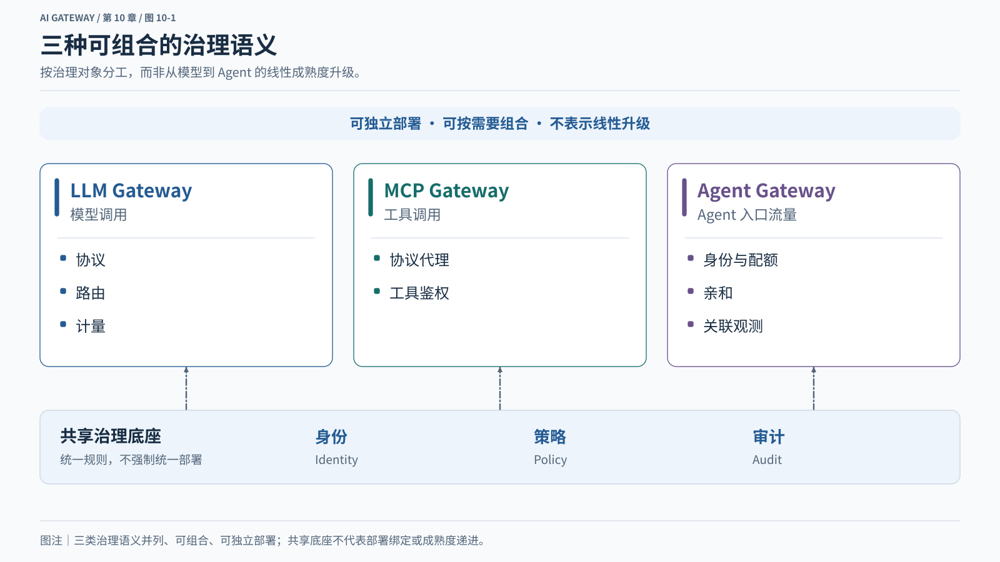

图 9-1 三种可组合的治理语义。这是本章按治理对象建立的分析框架，不表示线性的能力升级路径。

| 治理语义 | 直接治理对象 | 主要问题 | 不承担的责任 |
| --- | --- | --- | --- |
| LLM Gateway | 模型调用及其实际尝试 | 选择哪个模型或端点，如何限流、容灾和计量 | 判断模型输出是否满足业务成功标准 |
| MCP Gateway | MCP 请求及工具调用 | 如何代理协议，当前身份能否调用指定工具及参数 | 将工具可发现等同于已授权、健康或可执行 |
| Agent Gateway | Agent 接入及与任务关联的流量 | 如何做身份、路由、亲和、并发控制和跨调用关联 | 定义 Task、业务 State、Checkpoint 或恢复语义 |

三种语义可以部署在同一数据面，也可以由不同组件承接。统一的关键不是所有能力位于同一进程，而是身份映射一致、策略边界清晰、调用记录能够关联，且同一次上游调用不会因穿过多个组件而被重复计费。

把三种语义放进一次完整调用会更直观。以“客服 Agent 查询订单并申请退款”为例：任务先经 Agent 入口接入，网关校验任务委托身份，并按能力标签把它路由到具备订单与退款工具的运行时；该任务产生的模型调用经 LLM Gateway 完成模型路由与失败降级；订单查询属于只读工具调用，由 MCP Gateway 做工具鉴权后直接放行；申请退款属于资金操作，网关挂起它并进入审批，批准后按新的准入条件重新校验委托范围、参数摘要与预算预留，才执行退款调用；工具结果与用量随后回写任务账本，供业务系统判定这项任务的结果。整条链路可以压缩为：Agent 入口 → 模型路由 → 工具鉴权 → 审批后重新准入 → 结果回传。

#### 9.1.4 与既有基础设施和执行系统的边界

| 组件 | 主要责任 | 与 AI Gateway 的关系 |
| --- | --- | --- |
| API Gateway | 请求入口、认证、路由和通用流量策略 | 可以承载 AI 协议适配与治理插件 |
| Service Mesh | 服务身份、双向传输层安全认证（mutual TLS，mTLS）及服务间流量治理 | 为 AI 服务通信提供基础安全和发现能力 |
| Registry | 资源目录、端点、版本和声明能力的管理 | 被网关或控制面查询、集成，不因集成而成为网关的业务职责 |
| Harness / Orchestrator | 执行控制循环、步骤调度与协作编排 | 通过网关访问模型和工具，并上报执行关联信息 |
| Agent Runtime | 执行生命周期、资源管理、检查点持久化与基础设施恢复 | 接收路由流量，按业务恢复契约运行任务 |
| 业务应用 | Task 定义、成功标准与任务账本 | 保有业务权威，可授权 Verifier 判定 Outcome |
| 获授权 Verifier | 依据成功标准、State 与 Evidence 判定 Outcome | 消费执行结果与证据，不因评分或观察而自动获得判定权 |

Higress 将协议适配、限流、统计等能力组织为 WebAssembly（Wasm）插件，运行在 Envoy 数据面上，并通过基于 Istio 的控制面管理相关配置。这是一种可复用的实现路线，而不是所有 AI Gateway 必须遵循的架构。模型代理也可以通过应用层中间件提供类似能力，托管服务则可能同时承接模型采购、账户和计费。

生态比较需要对应到具体版本。原 Envoy AI Gateway 项目现称 Agent Router，其 v1.0.0 于 2026 年 6 月 23 日正式发布并标记为正式可用（General Availability，GA）；产品发布为 v1.0 不代表所有控制面 API 都已进入 v1。Kong、APISIX 等既有网关也提供 AI 相关能力，选型仍应落到具体版本、数据路径和运维边界，而不是只比较名称。

#### 9.1.5 集中治理不等于集中所有执行

企业可以先统一凭证托管和模型入口，再建立用量归因与工具授权，最后逐步引入路由实验和评估回归。每一步都应有独立的验收目标，例如凭证是否不再分散到客户端、用量是否能归属到项目、拒绝是否有可追溯依据，而不是以插件数量衡量建设进度。

在既有网关上扩展可以复用证书、身份与运维体系，但 AI 长连接、内容缓冲和协议迭代可能影响其他业务。独立部署有利于容量和发布隔离，却增加了基础设施负担。常见折中是共享身份和策略管理，按流量类型隔离数据面。

网关自身也必须按关键基础设施设计。多副本解决实例故障，受控的共享状态支撑跨实例配额；共享存储、外部策略服务和内容检测服务的故障行为则需要逐项定义。不能因为网关是多副本，就认为其依赖已经没有单点，也不能因为状态写入了 Redis，就认为所有一致性要求自然成立。

### 9.2 LLM Gateway：模型路由、降级、容灾与成本控制

#### 9.2.1 把选择、可靠性和成本放在同一条路径上

LLM Gateway 需要在一次调用中协调三个问题：选择满足要求的模型或端点，控制失败与重试的影响，并对所有实际消耗负责。便宜的模型如果导致大量返工，总任务成本可能更高；自动容灾如果忽略协议兼容和计费语义，也可能把可用性故障转化为质量或成本事故。

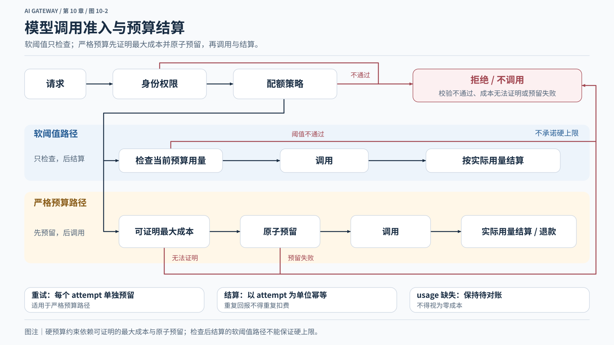

图 9-2 模型调用准入与预算结算。阈值检查与严格预算是两种不同承诺，后者要求调用前原子预留，而不仅是响应后扣减。

#### 9.2.2 统一接口与能力差异

OpenAI 风格的 `/v1/chat/completions` 和 Anthropic 风格的 `/v1/messages` 是常见的接入契约。网关可以通过适配器转换请求和响应，但工具调用、图像输入、推理内容、缓存用量和停止原因等字段并不总能无损映射。统一接口首先应声明支持的能力子集，再约定不支持的参数如何返回错误，而不是静默忽略差异。

Higress 的 `ai-proxy` 支持多种模型服务和协议适配。参考提交的 provider 注册表包含厂商服务、自托管引擎、通用适配器和聚合服务，因此类型数量不能直接解释为独立模型厂商数量，应按实际接入所需的 provider 与字段进行验证。

统一契约的另一个价值，是让计量、限流和统计模块复用明确的字段语义。这个契约仍需要记录适配器版本、实际 provider 与模型、请求模型别名和原始用量来源，避免协议转换之后无法对账。客户端看到同一个模型名，不应意味着平台可以不经验证地替换其实际能力。

#### 9.2.3 模型选择与端点选择应分开

| 路由方式 | 决策对象 | 适用条件 | 主要约束 |
| --- | --- | --- | --- |
| 静态映射与权重 | 模型别名、版本或服务 | 需要稳定、可解释的灰度和主备关系 | 映射变更必须做能力与质量回归 |
| 成本感知路由 | 满足能力门槛的候选模型 | 已有可验证的质量下限与价格口径 | 不只看单次价格，还要看重试和返工成本 |
| 语义路由 | 不同能力模型 | 请求分类器经过评估，且有明确回退路径 | 分类错误会改变输出质量，分类本身也有成本 |
| 推理端点选择 | 同一模型或兼容服务的实例 | 可取得队列、在途请求或缓存相关信号 | 信号时效、缓存局部性与负载均衡需要权衡 |

Gateway API Inference Extension 的 `InferencePool` 已有稳定 v1 API，用于描述推理后端集合等入口资源；端点选择器（Endpoint Picker，EPP）根据其具体实现进行调度。队列长度、KV cache 占用和前缀缓存感知属于实现或插件提供的调度信号，不是所有 v1 实现必备的算法，也不等同于按任务语义自动挑选模型。

该项目 v1.6.0 的职责进一步聚焦 API、符合性验证和轻量 EPP，完整 EPP 等实现迁往 llm-d。讨论具体调度机制时，应绑定实现版本；不能把 API 稳定性、扩展实现成熟度和算法效果合并为一个结论。

Higress `ai-load-balancer` 的参考实现提供全局在途请求、前缀关联及基于运行指标的选择方式。其可借鉴之处在于把跨网关实例的共享信息与数据面选址结合起来。但网关记录的前缀关联只是缓存可能可用的信号，不能证明推理引擎仍持有该缓存；缓存驱逐、实例重启或模型版本变化后都需要允许失配和重新选择。

#### 9.2.4 可靠性：先判断能否重试，再选择重试目标

错误分类应先于重试。限流响应需要结合重置时间、账户配额和替代端点策略处理；服务端错误只有在调用语义允许时才适合重试；认证错误一般应终止并修复凭证。上下文超限也不应简单通过截断历史“解决”，因为这会改变任务输入，应由应用或 Harness 决定是否压缩上下文、切换到兼容的长上下文模型，或明确失败。

流式响应一旦向客户端提交，网关通常不能透明地重放整段结果。更重要的是，“尚未收到响应体”不等于“上游尚未执行”：请求可能已经被计费，甚至已经触发某些副作用。重试许可需要同时考虑接口幂等性、上游执行不确定性和客户端协议，而不能仅根据 HTTP 状态或是否收到首包决定。

每次实际尝试都应有独立的 attempt 标识，并受最大次数、总截止时间和成本额度约束。切换到另一 provider 前还要检查工具、结构化输出、数据地域和模型能力是否兼容。没有经过验证的兜底路径，应返回可解释的失败，而不是以“自动降级”为名改变业务契约。

凭证或端点摘除是另一类机制。连续失败达到阈值后，可以暂停选用该目标，并通过冷却或健康检查恢复；真实模型探活可能产生费用，应限制频率并避免多副本重复放大。

多层恢复叠加是这类机制最容易失控的地方。如果 SDK 客户端对一次逻辑调用最多尝试 3 次，网关对每次转发又最多重试 3 次，那么一次用户可见的调用最多会到达上游 9 次；供应商侧是否重投还不受控制。每一层都认为自己的上限是 3，端到端却没有 3 这个约束——重试次数、并发压力和费用会以乘积方式放大。

| 层级 | 允许重试的条件 | 必须持有或传递的预算 |
| --- | --- | --- |
| SDK / 调用方 | 调用幂等，或确认尚未提交执行 | 总截止时间、业务级尝试上限与成本上限 |
| 网关 | 尚未向客户端提交响应，且调用语义允许 | 每次转发的尝试额度与绝对截止时间 |
| 上游 / 供应商 | 不可控 | 按“可能已执行、可能已计费”处理 |

因此尝试预算必须跨层传递，而不是每层各自解释一个超时值：总截止时间应是绝对时间，网关转发时只保留必要的传输与处理余量；剩余尝试额度可以由调用方给出，并由网关按 call\_id 原子扣减，耗尽后返回明确的预算耗尽错误，而不是再试一次。每次实际尝试都要用稳定的 call\_id 与 attempt\_id 关联，让跨层观测能把多次尝试还原为一次逻辑调用；重试、摘除与模型切换也要分开记录，否则一次故障会被多层恢复机制反复放大，且无法归因。

#### 9.2.5 超时与流式解析：明确测量边界

连接超时用于约束建连，首字节超时用于识别上游长时间无响应，TTFT 描述有效生成开始前的等待，流式空闲超时约束连续事件间隔，总截止时间控制整个调用的资源占用。它们可以同时存在，但不应互相代替。例如，持续发送心跳的流可以一直不触发空闲超时，却始终没有输出有效内容。

SSE 解析需要跨字节切片重组事件，并设置单事件长度、累计缓冲和解析时间上限。轻量计量模式可以只保存计数和有限解析状态，不保存完整问答；内容改写和审计则需要额外缓冲。所谓“不缓冲全文”不等于完全没有内存开销，应在目标并发下测量实际占用。

部分模型协议需要显式请求流式 usage，例如支持 `stream_options.include_usage` 的接口。网关应只对支持该字段的适配器注入，并识别正常流尾、异常中断和取消。缺少 usage 不能记录为零消耗，客户端取消也不能证明上游停止生成；这些记录需要保留估算或未结算状态，后续与服务商账单或执行记录对账。

#### 9.2.6 预算语义：速率、配额与严格上限不是一回事

| 机制 | 控制目标 | 常见实现 | 可以承诺什么 |
| --- | --- | --- | --- |
| 请求速率限制 | 单位时间请求数量 | 每秒请求数（Queries per Second，QPS）或令牌桶 | 控制准入速度，不直接控制 token 总成本 |
| token 时间窗限制 | 一段时间的累计用量 | 请求前检查，结束后累计实际 token | 控制用量增长；存在在途消耗和并发超限窗口 |
| 余额型配额 | 主体可用额度 | 准入时查余额，结束后扣减 | 近实时额度控制，不天然是严格并发预算 |
| 严格预算 | 不超过授权额度 | 可证明的最大消耗、原子预留、结算与退款 | 在计费边界和执行约束均成立时提供上限保障 |

“请求前检查、响应后扣减”无法单独保证硬上限。假设余额为 100，两次最大消耗分别为 80 的请求同时通过余额检查，最终消耗就可能达到 160。响应后的原子扣减可以避免丢账，但不能撤销已经发生的消耗。

严格预算需要在准入时满足以下不变量：

```text
可用额度 = 已授权额度 − 已结算消耗 − 在途预留
准入条件 = 本次最大可计费消耗 ≤ 可用额度
```

检查和预留必须在同一原子操作或等效一致性事务中完成。调用结束后按实际消耗幂等结算，释放多余预留；如果实际消耗可能超过预留，说明所谓最大值并不可靠，此时只能声明有界超额或软预算，而不能继续承诺严格上限。

预留需要覆盖输入、受约束的最大输出及该接口的其他计费项，重试也必须单独占用额度。对流式中断或执行结果未知的请求，不能因租约到期就无条件退款，应先确认执行终止或按保守规则等待对账。仅限制并发只能缩小超支范围；只有在途调用的最坏消耗也受到约束，才可能形成严格上限。

多层预算同样需要一致性。组织、团队、项目和任务额度同时生效时，准入必须验证相关层级的可用额，并避免只预留一层、另一层失败后留下悬挂记录。token 配额与金额预算还应分开：相同 token 数在不同模型、缓存命中类型和价格版本下可能产生不同费用。

#### 9.2.7 Higress 实现的可用范围与故障语义

参考提交中的 `ai-token-ratelimit` 在请求阶段检查窗口，响应结束后累计实际 token；`ai-quota` 按 consumer 检查余额并在响应结束后扣减。二者都不能仅凭现有检查与后结算机制宣称严格并发预算。

两者在 Redis 故障下的分支行为并不一致，也不能概括为统一的失败语义；部署前需要针对所选版本逐项验证读失败、写失败、超时与恢复后的对账，具体分支说明见本章实现说明。

预算策略需要表达的设计信息（账本范围、预留键、结算与对账等）见本章实现说明；它不是 Higress 插件字段，也不能直接提交给其控制面。

落地时应把上述要求映射到选定组件的真实 Schema 与测试用例；若现有插件仅支持阈值控制，就如实声明边界，或将严格预算交给具备一致性能力的预算服务。

#### 9.2.8 缓存与方案选择：优化总成本，而非单次 token 数

语义缓存可以减少重复问题触发的上游生成，但缓存命中不代表整个请求零成本，向量计算、检索和缓存维护仍有开销。缓存键还必须区分租户、权限范围、模型版本、系统提示和知识版本，不能让语义相似绕过数据隔离。对含副作用的工具调用不应简单重放缓存结果；对强时效或创造性任务，应明确适用边界与失效策略。

模型代理、托管聚合服务和网关插件路线各有侧重。以 LiteLLM 为代表的代理路线便于在应用生态中集成，Portkey 等服务提供不同程度的托管控制与观测，OpenRouter 聚合模型访问，Higress 则强调与既有入口治理和数据面扩展结合。选型应验证实际协议覆盖、数据出域、费用口径、容量和故障行为，不能从部署形态直接推导“能力完整”或“性能更高”。

路由稳定性、缓存命中、失败恢复和任务返工需要共同评估。一个可解释、可回退的简单策略，往往比缺少测量依据的自动切换更容易建立可信的生产基线。

### 9.3 MCP Gateway：工具协议代理、资源发现与权限隔离

#### 9.3.1 工具接通之后，还需要控制执行权

MCP 使用 JSON 远程过程调用（JSON Remote Procedure Call，JSON-RPC）表达客户端与服务端的交互，提供工具、资源和提示等能力。它降低了接入成本，却不会自动解决企业授权、凭证托管、工具健康或业务副作用问题。

一个工具出现在清单中，只能说明它被服务端通告；调用者是否有权执行、依赖系统是否可用、这次调用是否成功，仍需独立判断。MCP Gateway 因此应将协议代理、资源目录集成、授权和实际执行结果分开治理。

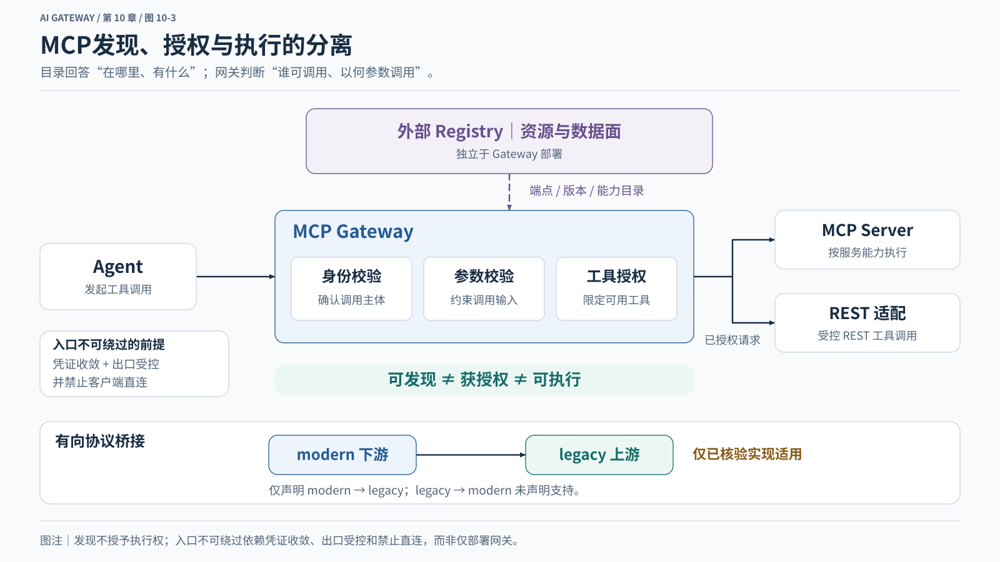

图 9-3 MCP 发现、授权与执行的分离。Registry 提供目录信息，网关执行入口策略，工具与后端系统负责实际操作；三者不能相互替代。

#### 9.3.2 版本基线与兼容范围

MCP 不同版本在握手、会话、订阅和任务机制上存在差异。2025-03-26 引入 Streamable HTTP，2025-11-25 引入实验性 Tasks；2026-07-28 采用逐请求元数据与 `server/discover`，并将 Tasks 移到可选扩展。协议演进的完整脉络见分布式通信章，本节保留网关实现必须核验的差异。

采用 `initialize` 握手的 Legacy 端点与采用逐请求元数据的 Modern 端点，需要不同的代理处理。网关应声明支持的版本集合、桥接方向及能力子集，并分别验证发现、调用、订阅和扩展任务。支持核心工具调用，不等于支持所有扩展；协议无状态，也不等于后端业务无状态。

#### 9.3.3 逐请求元数据：协议说明不是调用者身份证明

MCP 请求的准入可以按“认证—协议校验—授权—转发”四步理解：认证回答“谁在调用”，由独立于协议的凭据完成主体映射；协议校验按版本检查头部镜像、方法与报文约束；授权按主体、工具与参数决定是否放行；转发按声明策略重新构造上游请求。Modern 协议的逐请求元数据只服务于第二、四步——它们说明请求的协议形态与能力，不能替代第一、三步的身份和权限判断。

| 能力或元素 | 网关支持范围 | 说明与约束 |
| --- | --- | --- |
| 协议代际识别 | Legacy 与 Modern 均可接入 | 按端点声明与配置识别，桥接方向必须显式声明 |
| 能力发现 | initialize（Legacy）与 server/discover（Modern） | 作为路由与可见清单的输入，不代表授权、健康或可执行 |
| 工具调用 | 两种代际均支持 | 鉴权通过后转发；Modern 请求按方法校验名称镜像 |
| 变更订阅 | subscriptions/listen（Modern） | 默认关闭，按路由显式开启 |
| 任务扩展 | tasks 扩展（Modern） | 默认关闭，双方显式支持后启用 |
| 协议桥接 | 仅 Modern 下游到 Legacy 上游（参考提交） | 反向路径未声明支持 |

逐请求元数据的字段级要求（哪些必需、哪些推荐、哪些镜像头适用于哪些方法）与完整报文示例，属于实现细节，见本章实现说明。网关只需把握一条边界：协议说明不是调用者身份证明。

网关不能对不需要名称的方法强制要求名称镜像，也不能把所有名称字段都解释为 params.name；头部可以辅助轻量分类和路由，但最终执行前仍需验证其与正文一致，避免头部鉴权和正文执行面对不同对象。

server/discover 提供的是端点当前通告的版本与能力，它不证明依赖健康、已获授权或必然成功；能力声明、权限检查与结果观测需要分别保留。

版本与弃用政策也应精确理解：核心规范功能的弃用窗口不等于实现必须长期接受所有旧版本，实际支持的版本集合需要明确声明，安全例外另有规则。

#### 9.3.4 Registry、代理插件与服务发现配置的分工

Registry 属于资源和数据管理职责，维护服务端点、版本、声明能力、所有者及生命周期信息。控制面或网关可以查询它生成路由和可见清单，但目录本身不授予当前 Task 的执行权限，也不取代资源服务器的授权检查。

在 Higress 的参考提交中，`mcp-server` 提供工具托管、REST 到 MCP 的转换以及 MCP 代理等能力；`mcp-router` 插件可按 `server/tool` 前缀处理工具调用路由。这个事实不能进一步扩展为它独立实现了所有工具聚合、授权或注册管理能力。`McpBridge` 则是服务发现配置资源，不能与协议转换插件混称。

健康检查也应分层。连接成功回答的是端点可达，协议发现回答的是能否通告兼容能力，受控的业务探测才可能验证工具依赖。对写入、支付等工具，不应为了健康检查而执行真实副作用；应使用专用探测或只读路径，并单独记录权限和依赖状态。

#### 9.3.5 安全边界：默认拒绝与不可绕过的部署条件

工具授权通常需要表达调用者、目标服务、工具和参数之间的关系。访问控制列表（Access Control List，ACL）可以从服务级白名单起步，再向高风险工具和参数细化；输入 Schema 校验只保证类型和结构合规，并不证明业务授权成立。

过滤 `tools/list` 可以减少模型误选无权工具，但 `tools/call` 仍必须再次鉴权。权限应取调用者原有授权、工作负载授权、任务委托范围和资源侧限制的交集，不能由模型声明的身份、工具描述或 `clientInfo` 扩大。

网关只有在凭证不下发、出口网络受控、服务发现和域名解析收敛、直连路径被禁止且旁路受到审计时，才有条件成为不可绕过的策略执行点。若 Agent 仍持有直连凭证和网络出口，网关只是集中入口，不能声称“天然不可绕过”。

代理认证还要尊重令牌的目标受众和委托关系。适用 MCP 授权规范的 HTTP 资源服务器应校验令牌受众、权限和生命周期；上游凭证应来自明确的凭证托管或委托机制，不能任意透传为网关签发的下游令牌。长期密钥应由受控秘密管理设施提供，避免进入客户端配置、明文日志和版本库。

Origin 校验、Content-Type 与 Accept 检查、报文大小限制、JSON-RPC 结构校验和出口地址约束共同构成入口边界。其中协议要求应按版本执行，实现额外设定的报文上限则需标明配置来源。某个实现使用 1 MiB 限制，不代表 MCP 规范对所有端点都规定这一上限。

#### 9.3.6 协议桥接：支持方向和能力子集必须显式声明

跨代际桥接不是简单替换 HTTP 头。Modern 下游调用 Legacy 上游时，代理需要处理初始化、消息映射、会话标识以及上游响应语义。Higress 参考提交的 `mcp-server` 明确支持这一方向，并将上游 Legacy 握手隔离在单次交换内；Legacy 下游到 Modern-only 上游的反向路径未声明支持，图中因此只画单向桥接。

单次交换隔离可以避免网关长期持有上游协议会话，但也引入重复握手开销，并限制对跨请求能力的透明代理。支持工具发现和调用，不等于支持所有订阅、服务端主动请求或 Tasks 扩展。协议策略、桥接方向和能力范围应当是显式配置和验收项，不能靠隐式探测与重试掩盖不兼容。

出口请求应按上游 RPC 重新构造，默认不透传下游 Cookie、会话标识、内部路由头和不适用的参数头。认证信息仅按明确策略生成或委托；日志避免记录带密钥的地址与请求头。代理保留的是经过验证的协议语义，而不是下游报文的任意细节。

#### 9.3.7 实践案例：REST-to-MCP 与参数级治理

把已有 REST API 暴露为 MCP 工具时，适配层需要定义工具描述、输入 Schema、请求构造和结果裁剪。以地址查询为例，调用者只需提供结构化地址和可选城市，服务端凭证由受控配置注入；响应可以裁剪为经纬度和必要的行政区信息，减少无关上下文。

请求模板必须进行正确的参数编码，并限制可变主机、路径和出站目标，避免把模板工具变成服务端请求伪造（Server-Side Request Forgery，SSRF）的入口。对数据库工具，使用字符串前缀判断“只读 SQL”并不可靠，应结合受限数据库账户、受支持的查询接口与资源端权限。

| 工具场景 | Schema 校验 | 业务策略还必须约束 |
| --- | --- | --- |
| 数据查询 | 字段类型、分页参数 | 数据库或数据集范围、行级权限、可执行操作 |
| 支付 | 金额格式、收款方结构 | 金额阈值、收款方范围、审批和幂等键 |
| 集群管理 | 集群、命名空间、资源参数 | 允许的环境、资源种类、操作动词和临时授权 |
| 文件读取 | 路径或文件标识格式 | 允许目录、租户归属、符号链接与数据分级 |

自然语言可以帮助管理员表达治理意图，例如“生产环境只允许查询”，但它应先转化为结构化策略，经冲突检查、影响预览、回归验证和授权发布之后执行。运行时不宜临时依赖模型自由解释权限，相同身份、资源和参数应得到可解释的一致判定。

工具输出仍属于需要按来源和风险处理的数据，不能因为经过网关就自动升级为高可信指令。内容检测可以提供风险信号，但提示注入防护还依赖权限隔离、参数约束、Harness 的工具结果处理以及资源端最小权限，不能由单一检测插件包办。

#### 9.3.8 集中入口是纵深防御的一层

工具数量少、边界清晰时，可以在应用或框架中完成接入和权限控制；当多个 Harness、团队和工具共享平台时，集中入口能够减少策略复制并收敛凭证。代价是网关成为高价值安全目标，需要保护配置、秘密、管理接口和审计数据。

框架、网关和资源服务器应各自保留必要检查。框架理解当前任务意图，网关执行跨框架的统一策略，资源服务器限制最终操作。三者协作提供的是纵深防御，而不是由任何一层宣称整个调用链已经绝对安全。

### 9.4 Agent Gateway：入口路由、任务关联、租户与配额

#### 9.4.1 长程任务的入口治理

一个 Agent Task 可能包含多个 Session、多轮模型和工具调用，也可能因审批、人工补充信息或基础设施故障进入等待与恢复。成本分散在这些阶段，单次请求指标难以解释整体效率；反复重试和失控循环还可能挤占同租户的预算与并发资源。

Agent Gateway 的作用，是将可信身份和任务关联信息带入入口策略，为跨请求的路由、配额与观测提供统一接口。它可以拒绝新的调用、报告预算压力、将请求转到声明具备相应能力的 Runtime，但 Task 如何暂停、保存状态和恢复，应由业务任务模型与执行系统决定。

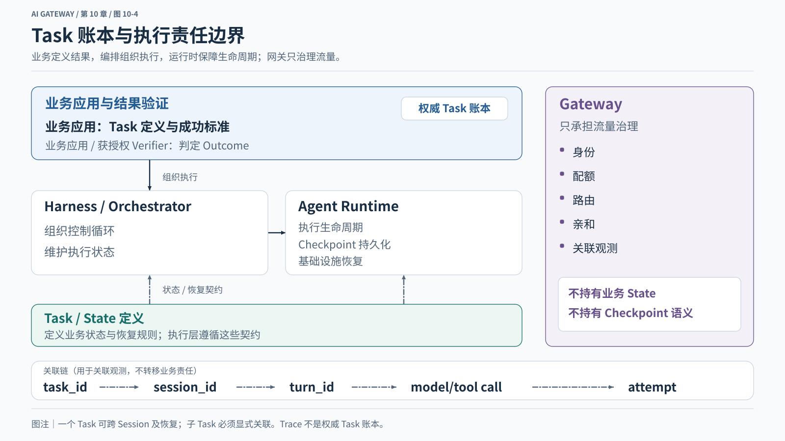

图 9-4 Task 账本与执行责任边界。任务关联信息可以穿过网关，业务状态与恢复语义不能因此转移到网关。

#### 9.4.2 任务关联对象与责任来源

沿用构建篇的任务、状态与执行对象，本节只列出网关需要关联的标识及其权威来源。

| 对象 | 回答的问题 | 权威来源或责任 |
| --- | --- | --- |
| Task | 要完成什么，成功标准是什么，当前处于哪个业务阶段 | 业务应用的任务模型；可通过父子关系表达分解 |
| Session | 哪一段交互或执行上下文属于同一会话 | 会话所属应用或执行系统；Task 可以跨多个 Session |
| Turn | 该会话中的哪一轮交互或控制循环 | Harness 定义并记录边界 |
| Call / Attempt | 哪次逻辑调用、哪次实际执行产生了用量 | 调用系统与实际执行点提供关联记录 |
| State | 已完成的业务事实、待处理事项及状态迁移规则 | 业务 Task / State 模型 |
| Checkpoint | 恢复时需要哪些状态、版本和引用 | 业务模型定义内容与恢复契约；Runtime 负责相应持久化和基础设施恢复 |
| Outcome | 是否达到业务成功标准 | 业务应用或获授权 Verifier 根据 State 与 Evidence 判定 |

状态持久化、检查点与副作用核对由业务模型、Harness 和 Runtime 共同完成，具体机制见状态存储与运行环境相关章节。网关需要保留关联信息，使入口故障和重试不会丢失调用与任务之间的关系。

网关可以保存路由亲和键、任务标识映射、在途计数、配额预留和观测关联信息。即使某种实现出于路由需要缓存了不透明的执行引用，也不应解释业务 State、定义 Checkpoint 结构或决定从哪个业务步骤恢复。入口实例重启不应成为任务真相丢失的原因。

#### 9.4.3 Agent 路由：选择入口能力，而不是判断执行结果

Agent 路由可以依据租户、工作负载类型、能力标签、可用工具、环境要求和运行时健康选择目标。目录中的能力标签只提供候选集合，仍需验证版本兼容、授权和目标环境。亲和可以按可信 Session 或 Runtime 关联键实现一致性哈希或查表，但亲和失败后的行为必须由执行系统给出契约。

例如，Coding Agent 的会话请求可能需要回到能够访问工作区的运行时；目标不可用时，网关可以返回暂不可路由或转交受支持的恢复入口，却不能把请求任意转到一个空运行时后声称“已经续跑”。某次 429 也不必然意味着工作区丢失，真正的连续性取决于工作区持久化、检查点和重试边界。

Agent Client Protocol（ACP，智能体客户端协议）主要服务于编辑器、集成开发环境（Integrated Development Environment，IDE）等客户端与编码 Agent 的交互；截至核验日期，ACP v2 仍为 Draft。Agent2Agent Protocol（A2A，智能体间协议）面向 Agent 间通信与任务协作，其 v1.0.0 已正式发布。两者的适用范围和成熟状态不同，不应合称为“尚未定型的一类协议”。

当入口从数据中心移到开发者本机，任务路由的落点有了新的选择。业界已经出现把“想”与“做”分开的用法：前沿模型只负责读目标、拆解与评审，把有界的具体执行显式交给成本低得多的模型完成，整体花费可以相差一个数量级。开源项目 HiRoute 把这种分工做成产品机制，并向前推了一步——执行方不只是一个更便宜的模型，还可以是另一个完整的工作 Agent。

这些做法通常仍停留在同一个 Harness 内换模型；HiRoute 的委派目标是工作 Agent 本身：Codex、DeepSeek Harness、Claude Code 等工作 Harness 都可以被同一个主 Agent 调起，每个都带着自己的上下文管理、工具链、权限模式与原生登录。于是一个后端重构任务可以交给 Codex 的计划，一批机械性的小改动可以交给使用低成本模型的 DeepSeek 计划，两者由同一个主 Agent 分别发起；用户留在熟悉的工作界面里，被选中的工作 Agent 由 HiRoute 启动、隔离与管理，无需迁移账号，原配置保持不变。

这些选择都落在“计划”上：每个已发布的计划都有稳定调用名与用途，声明执行工作 Agent、候选模型与原生思考设置。主 Agent 按用途查询并以任务为单位显式提交——路由不依赖模型自动分类，落点可预测、可复核；任务有独立身份，可以等待、取结果、继续或取消，并保持受理时的计划版本执行，后续配置变化不会暗中改变进行中的工作。“什么活交给谁”由此从一次次手工切换，变成一条可查询、可委派、可复现的路由。

| 维度 | HiRoute 中的选择 |
| --- | --- |
| 执行 Agent（Harness） | Codex、DeepSeek Harness 等不同工作 Agent，各自保留原生工具链与登录 |
| 模型分工 | 每个计划独立声明候选模型与原生思考设置，与主 Agent 自己的模型互不影响 |
| 用途与身份 | 计划有稳定调用名与用途，按用途选择，不依赖模型自动分类 |
| 任务生命周期 | 提交、等待、取结果、继续、取消；task/run 独立身份，重复提交幂等 |

网关可以理解这些协议的身份、路由和关联字段，但应保持薄适配层。协议中的任务状态或完成通知是互操作信息，不天然等同于业务 Task 的最终 Outcome；从协议对象映射到业务任务，需要应用明确约定。

#### 9.4.4 租户隔离：身份、财务归属与执行资源是不同维度

配额应绑定经过认证的主体和明确的财务归属，而不是客户端 IP 或连接数。人、工作负载、Agent 实例和 Task 描述不同身份或执行关系；组织、团队、项目则描述财务归属，两者是正交维度。一个 Agent 可以服务多个项目，一个项目也可以使用多个 Agent，不能将二者混成固定的单一层级。

并发隔离同样要区分入口在途请求与 Runtime 中的活动任务。HTTP 请求结束之后，异步任务可能继续运行；只有 Runtime 或相应调度系统能准确判断执行槽位是否释放。网关可以限制入口并发和发起速率，任务并发需要与执行系统的账本协同。

加权公平队列、租户槽位和优先级可以抑制长任务的资源挤占。借用空闲容量不意味着可以立即收回已经执行的操作或已经产生的费用；抢占策略需要明确取消、检查点和补偿行为。预算接近阈值时，平台可发出信号，由 Harness 根据任务模型停止新增步骤、保存进度或请求额外授权。

#### 9.4.5 从 Session 分析扩展到 Task 分层账本

Session 聚合适合回答“一段交互花了多少成本”，Task 账本才适合回答“一项长程任务从发起到结束花了多少成本、恢复了几次、结果是什么”。本章采用以下归因链路：

```text
task_id → session_id → turn_id → model/tool call → attempt_id
```

这是一条分析下钻路径，不强制所有系统采用相同存储树。多 Agent 协作可以通过 `parent_task_id` 等明确的父子关系归集；Session 承载多个业务任务、并行 Turn 或共享调用时，需要关联表和明确分摊规则，不能任意重复归因。

`task_id` 应来自业务应用，`session_id` 和 `turn_id` 应来自其权威执行上下文，网关可以生成请求或尝试标识。入口收到客户端关联头时，需要绑定已认证主体并校验租户范围，防止通过伪造 Task 或项目标识转移费用、污染他人的账本。缺失可靠关联时可以记为待归因，但不应自行编造一个业务 Task。

| 账本层级 | 主要观测内容 | 能够回答的问题 |
| --- | --- | --- |
| Attempt | 实际端点、计费模型、用量来源、状态、错误和耗时 | 哪次重试消耗了成本，是否存在未知执行结果 |
| Call / Turn | 多次尝试、工具交互、上下文变化 | 本轮为什么慢，成本集中在哪些调用 |
| Session | 一段交互的累计用量、等待与失败分布 | 某段会话是否出现重复调用或上下文膨胀 |
| Task | 跨会话归集、恢复阶段、工具与运行资源费用、Outcome 引用 | 长程任务总成本、完成效率和恢复成本如何 |

网关记录是调用账本的一部分，不应冒充完整任务账本。Runtime 资源费用、绕过网关的受控执行路径、审批等待和业务恢复事件需要由各责任系统补充。链路追踪（Trace）帮助关联调用路径，但采样、缺失 span 和跨恢复分段使其不能自动成为财务或 Task 的权威账本。

成本计算还应区分供应商原始 usage、平台估算、价格版本、缓存输入折扣、币种或内部 credits 换算。模型返回的工具调用意图只是模型输出，不代表工具已经执行；工具实际费用应以执行记录结算，并通过调用标识与模型记录关联。

#### 9.4.6 Higress 的位置：提供计量与日志底座

Higress `ai-quota` 和 `ai-statistics` 可以分别提供按 consumer 的额度控制、模型用量及会话关联日志。它们有助于建立统一调用口径，但不能仅凭一个 Session 头就获得跨恢复的 Task 账本，也不自动拥有业务 Outcome。

生产日志应默认记录身份引用、Task / Session / Turn 关联、Call / Attempt 标识、实际模型、用量来源、状态、时延和策略版本。问题、回答和工具参数等内容字段按风险和需求开启，设置长度限制、采样、脱敏、访问控制和留存周期。记录模型生成的 `tool_calls` 与记录工具实际执行结果，应使用可区分的事件类型。

分析服务可以通过 API、命令行界面（Command-Line Interface，CLI）或 Skill 暴露 Task 列表、Session 详情和调用下钻能力。这些查询接口属于观测与分析服务，不必因此成为网关控制面的内置责任。分析 Agent 可以定位成本变化和形成优化假设，但结论应能回到原始记录复核，并区分相关性与已验证原因。

#### 9.4.7 结果判定与设计权衡

网关的请求成功率与业务任务完成率分别统计。业务应用或获授权的验收组件依据成功标准、Task State 与 Evidence 提供 Outcome，网关只关联该结果；缺少 Outcome 或成本未结算的任务，应保留相应状态。验收流程由构建篇和协作章说明，网关侧的重点是避免把 HTTP 成功、会话结束或模型自述完成计入业务成功。

### 9.5 统一治理：身份、权限、预算、审计与审批

#### 9.5.1 统一身份、策略与关联规则

统一身份与审批的通用模型见治理篇，本节只说明它们如何约束实际转发。如果模型、工具与 Agent 入口各自定义身份和成本维度，同一调用者就可能在不同路径受到不一致的授权与配额约束；共享主体映射、策略语义和关联标识，同时允许调用账本、财务账本、业务 Task 账本分别保有权威边界，是转发侧对统一治理的基本要求。

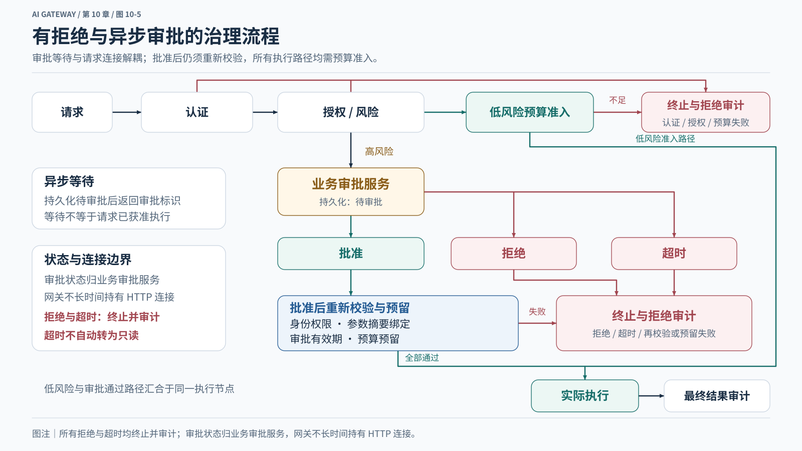

图 9-5 有拒绝与异步审批的治理流程。审批是持久化的业务状态，不是把 HTTP 请求无限挂在网关中的一个同步步骤。

#### 9.5.2 身份到转发的映射：主体、委托与凭证

| 转发环节 | 需要的输入 | 网关的检查与动作 |
| --- | --- | --- |
| 主体映射 | 认证结果（OAuth、mTLS、API Key 等） | 映射为稳定策略主体与财务归属，清除客户端伪造的内部身份头 |
| 委托核验 | 任务委托的范围、时效与受众 | 与调用者原有权限取交集，不因协议自述或客户端声明扩大 |
| 凭证处理 | 上游凭证的引用与用途 | 仅按显式策略生成或委托，默认不透传下游凭证 |
| 记录 | 主体、委托与判定依据 | 写入审计与账本，支持撤销、对账与追溯 |

身份类型、凭证生命周期与委托模型的通用设计见治理篇；对转发而言只有一条硬约束：Task 委托必须可验证、可撤销、范围清晰，且不能超出委托者原有权限，也不要求每个 Task 都签发独立令牌。

Higress 中的 consumer 是策略主体抽象。认证插件可以将不同凭证映射为 consumer，后续配额和统计插件共享这一标识。入口必须清除或覆盖客户端伪造的内部主体头，并为跨代理传递定义信任边界，不能直接信任外部传入的 `x-mse-consumer` 等字段。

#### 9.5.3 策略执行：拒绝分支与结果分支同等重要

权限模型的建模方法（RBAC、ABAC 等）见治理篇；对转发而言，网关必须在放行前完成认证、鉴权与预算准入，并为每次判定记录命中的规则、版本和拒绝原因，避免权限矩阵变成不可解释的黑箱。

未通过认证、授权或预算准入的请求应终止并记录判定。需要审批的请求进入专门的审批工作流；无需审批的请求可以在完成必要的预算预留后执行。审计既记录准入依据，也记录实际执行结果，不能以“放行日志”代替“执行成功日志”。

预算沿用 9.2 节的分层语义。软阈值可以触发告警，严格上限需要原子预留和可验证的最大消耗。审批可以授权新的额度或预算变更，但该变更本身必须受治理并进入账本；不能只给调用加一个白名单标记，就跳过结算或隐去费用。

#### 9.5.4 审批如何约束转发：挂起、重新准入与超时

审批的组织方式与建模见治理篇。落到转发路径上，约束只有一条：审批未决的请求不得转为实际执行。挂起期间网关不长时间持有 HTTP 连接，等待与通知由业务侧承接；审批记录需要包含调用者、工具及版本、参数摘要、风险与有效期，供执行前重新核对。

| 审批状态 | 转发侧的处理 | 必须记录的内容 |
| --- | --- | --- |
| 待审批 | 不执行高风险操作，连接可结束，等待由业务侧承接 | 申请对象、参数摘要、风险与过期时间 |
| 批准 | 重新校验身份、委托、参数摘要与预算后才转发 | 批准者、批准范围与时效 |
| 拒绝 | 终止，不隐式替换工具或参数 | 拒绝依据 |
| 超时或撤销 | 终止，保持未执行状态；不自动降级为只读 | 超时或撤销事实 |
| 执行结果未知 | 不盲目重试，交由业务查询、对账或补偿 | 已提交事实与幂等键 |

批准不意味着后续必定放行。等待期间身份可能过期、参数可能改变、预算可能被其他调用占用，因此执行前必须重新准入。审批记录应绑定工具、版本、参数摘要和任务上下文，回调需要认证并防重放；重复回调和调用重试不能产生重复副作用。

也不应将“审批超时”自动解释为“改成只读执行”。这会改变原始请求含义，可能造成意外数据暴露；如需只读替代方案，应形成新的、可见的请求并重新授权。对于无幂等支持的外部操作，超时后的执行结果不确定必须交由业务查询或补偿流程处理，不能由网关盲目重试。

#### 9.5.5 审计材料与业务 Evidence 的区别

结构化审计可以记录谁在何时申请了什么操作，命中哪条策略，审批如何决定，实际执行结果是什么。它为复盘提供可追溯材料，但并不天然构成业务判定需要的 Evidence。哪些来源、完整性保证和内容可以用于判断任务成功，应由成功标准与 Verifier 明确。

一条通用审计事件可以采用如下逻辑结构。字段为本章示意，不是某个插件的固定输出 Schema。

```json
{
  "event_type": "tool_execution_result",
  "subject_ref": "subject-17",
  "task_id": "task-42",
  "call_id": "call-8",
  "attempt_id": "attempt-1",
  "policy_version": "policy-v3",
  "approval_ref": "approval-9",
  "decision": "allow",
  "execution_status": "succeeded",
  "usage_status": "pending_reconciliation"
}
```

示例中的执行成功只描述工具调用，不是 Task 的 Outcome；用量尚待对账也不能因执行成功而被省略。默认日志应以元数据为主，prompt、completion、工具参数和结果按需记录。需要对内容做截断、脱敏、权限隔离和留存治理，并防止密钥、带签名地址以及完整敏感数据进入日志。

数据防泄漏（Data Loss Prevention，DLP）和内容安全检测可以在应用、网关或专门服务中实现。入口统一检测便于覆盖多个调用方，但会让该位置接触明文；应用侧更接近业务语义，却需要防止漏配。检测失效时放行、拒绝或转人工，应按风险预先定义，而不是在故障时临时决策。

#### 9.5.6 组合式实现与财务归因

Higress 的认证、限流、配额、统计和代理插件可以组成治理管道。部署时应验证请求阶段和响应阶段的实际执行顺序、共享属性以及版本兼容性，而不是把一组优先级数字当作跨版本固定契约。尤其应确认鉴权和预算发生在实际转发之前，最终用量能在正确生命周期结算，敏感内容不会因插件顺序失效而提前写日志。

AI 财务运营（FinOps）的基础是可核对的主体、用量和价格。组织、团队、项目映射需要保留历史有效期；实际模型、缓存 token 类别、价格版本、币种和账期共同决定费用。实时准入账与财务报表可以存在时延差异，但应有明确的对账规则，不能声称二者“天然一致”。

策略集中管理，执行分布在各入口与资源端，通过控制面发布。管理员应能看到命中规则、重置时间和适当的申诉渠道，但不能向调用者泄露其他租户信息或敏感的内部策略细节。可解释性需要与信息最小披露同时设计。

### 9.6 控制面联动：Gateway、执行端点、Observability 与 Evaluation

#### 9.6.1 从运行数据到受控发布

数据面执行已发布策略，可观测系统记录运行事实，评估系统生成评分与诊断。持续优化需要连接这些环节，但 Evaluation 不天然拥有发布授权，也不应直接修改生产路由或预算。完整路径应是观测形成候选建议，建议进入构建与验证，再经过治理授权、发布门禁和灰度进入控制面。

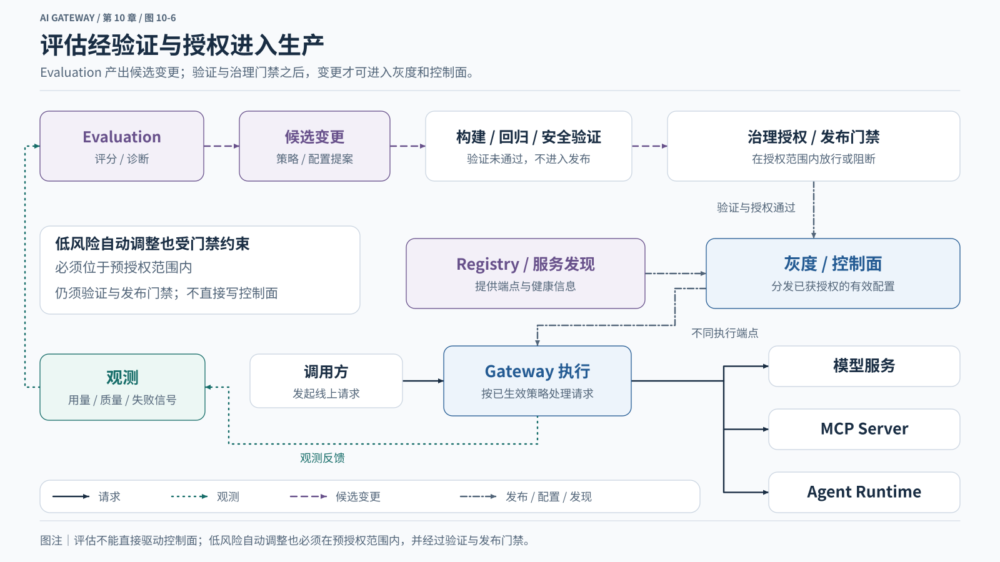

图 9-6 评估经验证与授权进入生产。候选变更、配置下发、业务请求和观测回流是不同方向、不同权限的链路。

#### 9.6.2 控制面、Registry 与执行端点的分工

控制面管理声明式配置、版本和发布状态，数据面依据生效配置处理请求。Registry 和服务发现提供端点及目录信息，健康信号帮助筛选可用目标。模型服务、MCP Server 和 Agent Runtime 是三种不同角色：前者提供推理接口，中者提供工具等协议能力，后者管理 Agent 执行生命周期；不能统称为一种 Runtime。

Higress 通过基于 Istio 的控制面向 Envoy 分发路由、集群及扩展配置。Envoy 动态发现 API（xDS）中的 Listener Discovery Service（LDS，监听器发现服务）和 Route Discovery Service（RDS，路由发现服务）描述入口与路由；Cluster Discovery Service（CDS，集群发现服务）和 Endpoint Discovery Service（EDS，端点发现服务）描述目标集群与端点。

AI 相关插件可以通过自定义资源定义（Custom Resource Definition，CRD）管理，并以开放容器倡议（Open Container Initiative，OCI）制品形式分发。热更新减少了数据面重启需求，却不意味着变更没有影响：插件初始化、配置兼容、在途流式请求和依赖变化仍需测试。

生产配置应同时记录策略版本、插件制品摘要、目标资源版本和发布批次。模型映射与基础路由可以分别管理，但二者存在依赖时仍要联合验证，不能承诺任意版本都可独立回滚。跨集群环境还需要掌握哪些实例已确认配置、哪些仍旧版本，以及部分失败时的处置方式。

#### 9.6.3 可观测性：测量事实并保留不确定性

传统的请求速率、错误率和持续时间指标仍然必要，但不足以解释生成式负载。需要补充模型用量、生成时延、流内错误、预算预留和任务关联等信息。

| 数据类型 | 推荐内容 | 常见误区 |
| --- | --- | --- |
| 用量与成本 | 输入、输出、缓存 token，估算或实际来源，价格版本和结算状态 | 将缺失 usage 当作零，或把 credits 当作统一货币 |
| 时延 | 建连、首字节、TTFT、流式空闲、总耗时 | 以 HTTP 首包代替首个有效 token |
| 可靠性 | HTTP 状态、流内错误、取消、重试、结果未知 | 只用 HTTP 200 判断成功 |
| 治理 | 命中策略、拒绝、审批、预算预留和结算 | 只记录放行，不记录最终结果 |
| 关联 | Task、Session、Turn、Call、Attempt 与 Trace 引用 | 将一条 Trace 或 Session 当作完整 Task |

指标维度需要控制基数。模型、路由和受控的服务维度适合指标聚合，Task、Session 和调用标识通常更适合日志、事件或 Trace；将所有动态标识都写为指标标签可能导致监控系统资源失控。平均时延也应从已确认的计数器或直方图计算，并与分位数一起观察，不能复制未经核验的指标名称或公式。

OpenTelemetry 的生成式 AI 语义约定提供了 `gen_ai.*` 等属性参考，但相关约定整体仍处于 Development 状态。采用时应固定版本，区分稳定通用属性与仍在演进的生成式字段，并为版本迁移保留映射，不应称其为已全部稳定的统一标准。

内容日志可以支持复核，却不保证可重放整个任务。外部系统状态、工具副作用、资源版本和缺失事件都可能影响重放；若需要可重复实验，应在受控环境中固定输入和依赖，并禁止对生产副作用进行无保护重演。

#### 9.6.4 评估结果如何用于网关变更

网关策略的回归需要覆盖协议兼容、输出质量、费用、时延和故障路径。比较模型或路由时，应使用一致的任务输入与成功标准，关联实际模型、策略版本和已确认的业务结果。模型评分可以辅助诊断，但不能自动替代业务 Outcome。

数据集构建、评估方法和误差校准由治理与优化相关章节展开。网关侧负责提供可复核的调用记录，并让候选策略进入验证和发布流程。

#### 9.6.5 候选变更进入生产的完整链路

| 阶段 | 产物 | 进入下一阶段的条件 |
| --- | --- | --- |
| 观测与诊断 | 成本、质量或可靠性问题及可复核记录 | 数据来源、统计口径和不确定性明确 |
| 候选建议 | 模型映射、路由、提示、工具或预算变更 | 变更范围、预期收益和约束清楚 |
| 构建与验证 | 固定版本的配置或制品、回归与安全结果 | 协议、质量、授权、成本和故障测试达标 |
| 治理授权与发布门禁 | 获批的发布记录和责任人或预授权规则 | 具备相应权限，依赖检查通过，回滚方案有效 |
| 灰度与控制面发布 | 分批生效配置、实例确认和实验分组 | 监测指标达标；异常时暂停或回滚 |
| 运行反馈 | 新观测、异常样本和业务结果 | 回流数据集和下一轮候选优化 |

这条链路适用于模型映射、语义路由、工具 Schema 和预算策略等可能改变调用行为的配置。在线实验应使用稳定且经过授权的分组键；长程任务跨会话执行时，应避免在一次任务中无意混用不兼容策略。其他类型的 Agent 行为优化沿用构建、治理与优化篇的相应流程。

自动化可以缩短审批和发布时间，但不能消除授权边界。低风险调参可以在预先批准的范围、幅度和资源集合内自动进行，仍需留存版本、验证结果及回滚记录；超出范围的变化必须重新授权。缓存策略也可能影响数据隔离和新鲜度，不能仅凭“缓存阈值”这一名称就认定其低风险。

#### 9.6.6 区分运行时自适应与治理策略变更

Higress `ai-load-balancer` 的 AdaptiveScore 在参考提交中使用指数加权移动平均（Exponentially Weighted Moving Average，EWMA）首包和总时延、在途请求及失败相关信号进行选择，并具有候选采样、失败冷却等机制；可选的 Redis 共享信息不可用时，相关路径退回本地评分。

这是已发布路由策略内部的在线端点选择，不是 Evaluation 直接获得生产发布权。算法只能在已授权的候选集合和约束内工作，不能自行扩大模型范围、数据地域、工具权限或预算。其效果需要在目标负载下测量，不能由存在自适应评分就推导出质量或成本必然改善。

#### 9.6.7 让闭环可验证、可停止、可回滚

可靠的闭环既要收集收益，也要记录失败与未知状态。观测系统不可用时，是否继续执行取决于风险和审计要求；预算或授权系统不可用时，行为应由已定义策略决定。不同依赖不能共用一个未经验证的降级口号。

控制面需要暴露配置传播进度，数据面需要上报实际版本，评估需要识别样本使用了哪组策略。回滚不仅是恢复配置文本，还要考虑已执行的工具副作用、未结算额度和仍在运行的任务。网关可以回滚入口策略，业务系统仍需处理变更已经造成的业务结果。

运行数据形成优化建议，验证与授权决定是否发布，控制面记录版本并跟踪实际生效情况。这样的链路使每次网关变更都有可复核的依据，并能在效果不达预期时停止或回滚。

### 9.7 本章小结

AI Gateway 提供模型、工具和 Agent 流量的统一治理入口。LLM Gateway 聚焦协议、路由、可靠性与计量；MCP Gateway 聚焦协议代理、资源目录集成和工具授权；Agent Gateway 聚焦入口身份、配额、亲和与跨调用关联。三种语义可以组合，但都不因此获得业务 Task、State、Checkpoint、恢复语义或 Outcome 的权威所有权。

可信的成本治理需要区分时间窗限制、余额配额和严格预算，后者依赖可证明的最大消耗、原子预留与幂等结算。可信的任务分析需要从 Session 扩展到 Task—Session—Turn—Call—Attempt 的归因链路，并承认网关日志与 Trace 只是任务账本的数据来源之一。可信的安全治理需要在发现、授权、审批和实际执行之间保留独立检查，且以凭证和网络控制作为入口不可绕过的前提。

持续优化则依赖一条受控的变更链：Evaluation 产生评分、诊断和候选建议，构建与验证确认其效果，治理授权和发布门禁决定能否进入生产，控制面和数据面负责分发与执行。业务应用或获授权 Verifier 依据成功标准、State 与 Evidence 判定 Outcome。把这些边界设计清楚，比把更多功能集中到网关中更重要。

### 9.8 本章实现说明

本节收录版本敏感、可直接对照实现的细节，用于支撑正文结论，不属于架构主线。字段示例以 MCP 2026-07-28 为准；插件行为以提交 f053bb08360d432a1226d4b61eb69871c74b9021 为核验基线，部署前应按实际制品重新核验。

#### 9.8.1 MCP 逐请求元数据

Modern RPC 请求必须在 params.\_meta 中携带协议版本和客户端能力，能力对象可以为空；客户端信息是推荐字段，而不是必需字段。HTTP 传输另有镜像要求。

| 字段 | 要求与含义 |
| --- | --- |
| io.modelcontextprotocol/protocolVersion | 请求元数据中的必需字段，声明协议版本 |
| io.modelcontextprotocol/clientCapabilities | 请求元数据中的必需字段，允许为空对象 |
| io.modelcontextprotocol/clientInfo | 推荐提供客户端名称和版本；不是认证凭据 |
| MCP-Protocol-Version | HTTP 请求头，与正文的协议版本一致 |
| Mcp-Method | RPC 请求头，与 JSON-RPC 方法一致 |
| Mcp-Name | 对 tools/call、resources/read、prompts/get 等规范指定的具名请求必需，分别镜像工具名、资源 URI 或提示名 |

一次 Modern 工具调用可以包含如下 HTTP 头与消息体。示例只展示协议相关字段，生产请求仍需要独立的认证、传输安全及部署策略。

```http
MCP-Protocol-Version: 2026-07-28
Mcp-Method: tools/call
Mcp-Name: get_weather
Content-Type: application/json
Accept: application/json, text/event-stream
```
```json
{
  "jsonrpc": "2.0",
  "id": 1,
  "method": "tools/call",
  "params": {
    "_meta": {
      "io.modelcontextprotocol/protocolVersion": "2026-07-28",
      "io.modelcontextprotocol/clientCapabilities": {},
      "io.modelcontextprotocol/clientInfo": {
        "name": "example-client",
        "version": "1.0.0"
      }
    },
    "name": "get_weather",
    "arguments": {"location": "Hangzhou"}
  }
}
```

网关需要按照对应方法校验镜像关系，不能对不需要名称的方法强制要求 Mcp-Name，也不能把所有名称字段都解释为 params.name；头部可以辅助轻量分类和路由，但最终执行前仍需验证其与正文一致，避免头部鉴权和执行面对不同对象。

协议的弃用政策也应精确理解：核心规范功能从标记 Deprecated 到移除，一般有至少十二个月的窗口；这不等于所有服务必须接受所有旧版本或旧 Schema 十二个月，安全例外和 SDK 生命周期另有规则。实现需要说明实际支持的版本集合，而不是从弃用窗口推导无限兼容。

#### 9.8.2 Higress 预算插件的故障分支

ai-token-ratelimit 的相关读取错误路径允许请求继续；ai-quota 在异步读回错误、余额缺失或非正值时拒绝，但部分同步调用错误与扣减失败路径并未构成“任何 Redis 故障都可靠拒绝”的统一保证。部署时需要针对所选版本测试读失败、写失败、超时与恢复后的对账，而不能用一个“故障时放行”或“故障时拒绝”的标签覆盖全部分支。

下面展示的是预算策略需要表达的设计信息，不是 Higress 插件字段，也不能直接提交给其控制面。

```yaml
budget_design:
  accounting_scope: organization / team / project
  subject_mapping: authenticated_subject
  admission_mode: reserve_worst_case_cost
  reservation_key: call_id / attempt_id
  settlement: idempotent_actual_usage
  unknown_usage: retain_reservation_and_reconcile
  retry: reserve_each_attempt
```


<a id="sec-018"></a>

## 第 10 章　Agent 异步任务与自动化流程
许多面向对话或单次请求的 AI Agent 采用同步请求—响应模式：用户发送一条消息，Agent 思考、调用工具、返回结果，整个链路在一次请求中完成。这种模式在简单问答场景下足够高效，但当 Agent 需要承担数据采集与分析报告生成、跨系统流程自动化、周期性监控巡检等长时间、跨请求、需要操作外部环境的任务时，同步模式会暴露出根本性局限——请求超时、上下文窗口溢出、用户必须在线等待、Agent 进程在等待外部事件期间持续占用资源。

本章先说明任务、执行与业务完成的责任边界，再依次讨论异步任务、定时触发、工作流和运行治理。构建篇已说明长程控制循环，这里重点关注生产环境中的可靠接收、调度、等待与恢复。

### 10.1 任务模型的责任边界与完成语义

#### 10.1.1 Task、Session 与 State 的权威关系

Task 是异步执行的最小业务单元，具有独立、持久的标识和自己的业务 State。Task 可以跨越等待、恢复、人工审批等多个阶段持续存在，也可以跨多个 Session 续跑。Session 组织相关交互与上下文，可以跨实例存在，其边界不等同于一次进程拉起。Task 与 Session 按业务关联，资源和权限隔离由相应机制保证。

跨 Session 续跑一个 Task，需要 Runtime 显式装载经授权的 Task State(包括业务参数、已完成步骤的 Checkpoint、待恢复的等待对象、副作用记录)，并把当前 Session 与该 Task 关联起来，而不是默认两个 Session 之间天然共享上下文。Task 真正的隔离取决于租户、运行身份、凭证、Environment 和资源边界，Session 只是其中一段执行视图。

业务应用与任务模型定义 Task 的状态、成功标准和合法转换。Harness 组织执行循环；Runtime 管理实例、资源与受支持的恢复；Environment 提供网络、文件和隔离条件；调度器管理触发和执行分配。组件可以由同一产品承载，但状态内容、调度记录与执行环境仍需有明确责任。

下表给出本章使用的对象关系。

| 对象 | 权威来源 | 生命周期 | 典型内容 |
| --- | --- | --- | --- |
| Task | 业务应用 / 任务模型 | 跨 Session、跨等待、跨恢复 | Task ID、业务参数、成功标准、当前状态 |
| 业务 State | 业务应用 | 与 Task 同寿 | 业务字段、累计结果、外部副作用记录 |
| Session Context | Harness / Runtime | 按应用定义的会话持续 | 对话历史、当前控制循环上下文 |
| Checkpoint | 工作流引擎 / Runtime | 按恢复契约保存的状态 | 节点输入输出、计算结果、版本号 |
| Runtime State | Runtime | 一次执行租约 | 心跳、租约、Worker 标识、当前步骤 |
| 外部副作用 | 业务系统 | 与外部系统同寿 | 已写入数据、已发出消息、已调用 API |

#### 10.1.2 执行结果与业务完成

任务的运行结束、运维健康、证据材料和业务完成分别回答不同问题。沿用构建篇的概念，本节列出异步任务需要关联的五类信息。

执行状态(Execution Status)：Runtime 给出的运行结果信号，如 succeeded、failed（完整状态集合与切换见 10.2.3.3）。它回答"这次执行有没有跑完"，不回答"业务目标是否达成"。

节点运维状态(Operational Status)：基础设施层面的健康信号，如 Worker 是否在线、租约是否有效、依赖系统是否降级。它影响调度决策，不直接等于 Task 结论。

候选证据(Candidate Evidence)：执行过程产生的原始材料，包括日志、Trace、状态快照、Artifact、大语言模型(Large Language Model，LLM)原始响应。材料能否作为业务 Evidence，需要核验来源、完整性及其与验收标准的关系。

Evidence：被业务成功标准明确引用的候选证据，例如报告中的结论能够追溯到约定数据源，所需分析与校验已完成，产物可由接收方读取。

业务 Outcome：由业务应用或获授权 Verifier 根据 Evidence 与成功标准做出的最终判定。LLM-as-a-Judge 是 Evaluation 的一种实现方式，不是 Outcome 的天然权威；人工审核也只有在被授权时才能形成 Outcome。

运维侧的"强制标记成功"操作只能在获授权范围内改变执行状态，并留下完整审计记录(谁、何时、原因、原状态、新状态)；它不能跨越层级直接判定 Outcome。日志、Trace 和 Artifact 默认按最小必要采集，涉及敏感字段做脱敏或散列，凭证禁止入库，访问受基于角色的访问控制(Role-Based Access Control，RBAC)管理，留存有期限。

#### 10.1.3 恢复与幂等的责任划分

调度器、检查点和通知机制分别承担不同职责，业务副作用是否允许重试，需要结合外部系统能力决定。

外置调度可以统一触发、并发控制和故障转移，但仍可能发生重复投递。执行端应按业务操作标识核对结果，不把调度成功作为外部操作恰好执行一次的保证。

Checkpoint 保存的是按恢复契约保存的状态(节点输入输出、计算结果)，用于复用计算结果、避免重算。它不等同于外部副作用幂等：若外部写入已提交而 Checkpoint 尚未落盘，重跑仍会产生重复副作用。Checkpoint 必须明确"保存什么、由谁写入、与业务 State 和外部系统提交之间如何排序"，才能参与恢复语义。

幂等机制根据交付语义和外部系统能力组合选择，不存在通用必选项。常见手段包括任务唯一键、幂等键、去重账本、事务性 outbox/inbox、租约与 fencing token、对账与补偿。原子提交、幂等键、对账等机制各有适用前提，应作为设计选择而非默认堆叠。

恢复内容由任务契约决定，通常包括业务状态、等待条件、事件位置或版本、工作区引用和外部操作记录。新实例还需要重新取得有效执行权，不能恢复一份旧心跳就继续提交。Watch、回调和轮询提供变化信号，信号缺失时应重新读取权威状态并对账。

### 10.2 Agent 异步任务

#### 10.2.1 为什么需要异步执行

Agent 的工具调用耗时不同，还可能等待人工审批、外部回调和数据就绪。请求超时只能表示调用方未在期限内取得结果，不能证明执行已经停止；后台任务需要独立标识与查询路径。异步执行也不扩大模型上下文窗口，上下文选择与压缩仍由 Harness 负责。

异步任务模型的核心是将执行生命周期与请求生命周期解耦：客户端提交任务并得到可靠接收确认后获得 Task ID，Task 在后台调度器中排队、执行、重试，完成后通过 Webhook 回调、消息推送或主动轮询的方式通知客户端。

#### 10.2.2 异步任务的基本属性

定义一个 Task，至少需要明确以下属性。

| 属性 | 说明 |
| --- | --- |
| 任务名称 | 用于检索和状态跟踪的可读名称 |
| 任务内容 | 执行的具体指令、Prompt 或工作流引用 |
| 优先级 | 决定调度顺序；同优先级按 FIFO(First In First Out，先进先出)排序 |
| Agent / Agent 池 | 由哪一类 Agent 执行，可绑定到具体实例或资源池 |
| 关联 Session(可选) | 本次执行所附加的 Session 上下文；Task 跨 Session 续跑时按 10.1.1 节加载授权的 Task State |
| 成功标准 | 引用 Evidence 与 Verifier，定义业务 Outcome 的判定方式 |
| 重试策略 | 最大重试次数、退避算法、可重试错误分类 |
| 超时时间 | 单次执行的最长时长 |
| 计划调度时间 | 计划开始调度的时间，一般由定时任务生成 |
| 数据业务时间 | 离线业务处理，比如每天00:30要处理上一天的数据 |
| 实际开始时间 | 实际开始执行的时间，一般由task状态机更新 |

#### 10.2.3 异步任务的核心架构

一个生产级异步任务系统在逻辑上由三类组件协同：任务队列承担排序与缓冲，调度器负责将 Task 投递给合适的 Worker 并维护租约，任务执行状态机维护生命周期与转换合法性。它们与 Runtime、Environment、业务应用的责任边界遵循 10.1.1 节。

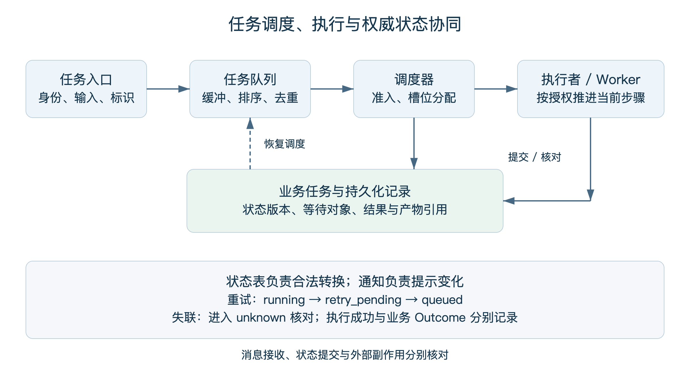

图10-1 任务调度、执行与权威状态的协同

##### 10.2.3.1 任务队列

任务队列是 Task 从提交到执行之间的缓冲层，核心能力是按优先级排序、同优先级 FIFO。高优先级任务入队后排在低优先级任务之前；同优先级内部按入队时间先后顺序出队。队列的另一关键职责是积压降级：当生产速率持续超过消费速率(突发流量、Agent 大面积不可用)，队列积压会持续增长。降级策略包括拒绝新任务入队并返回结构化错误、对低优先级任务限速、触发告警让运维介入扩容。队列深度本身是核心可观测指标，持续积压通常意味着执行能力不足或出现系统性故障。

##### 10.2.3.2 调度器

调度器是任务队列与 Agent 执行之间的桥梁，职责是从队列取出 Task 并投递给合适的 Worker、维护执行租约、处理重试与故障转移。设计上有两个核心问题。

第一是负载均衡与 Worker 选择。常见策略包括轮询(简单但不感知实际负载)、按当前活动任务或可用槽位分配、加权分配(按算力或配置赋权)、亲和路由(需配合状态恢复契约)。策略选择直接影响吞吐和延迟。

第二是背压(Backpressure)。当所有 Worker 都繁忙时，调度器不应继续从队列取出任务，否则会在 Worker 端堆积或被直接拒绝。"维护空闲/繁忙 Worker 注册表"是背压的一种简单实现，假设单个 Worker 同时只处理一个任务，不是通用定义。生产里更常见的是组合机制：并发配额(每 Worker 最大并发数)、队列水位线(超过阈值暂停拉取)、消费速率自适应(根据完成速率动态调整拉取批量)、租约超时(防止 Worker 失联导致任务卡死)、动态容量(根据 Worker 心跳实时调整可用槽位)。背压的本质是让消费速率自适应执行速率，避免过载崩溃。

##### 10.2.3.3 任务执行状态机

任务执行状态机维护生命周期与合法转换。本章使用以下状态集合，下表描述执行调度状态，业务 Outcome 另按验收规则维护。

| 状态 | 含义 | 允许的后续状态 |
| --- | --- | --- |
| waiting | task初始化，等待依赖满足（调度时间、工作流依赖）就入队 | queued、hold、skipped、mark\_successed |
| queued | 等待分配执行资源 | running、killed、skipped、mark\_successed |
| running | task分发给执行器执行，任务进入运行中 | succeeded、failed、killed |
| hold | 等待审批、输入或外部条件 | waiting、skipped、mark\_successed |
| succeeded | 任务执行成功 | queued（用户手动重跑） |
| failed | 任务执行失败 | queued（用户手动重跑）、mark\_successed |
| killed | 用户手动终止 | queued（用户手动重跑）、mark\_successed |
| skipped | 用户执行跳过 | waiting（用户取消跳过）、mark\_successed |
| mark\_successed | 用户手动标记成功 | 终态 |

任务状态机状态切换如下图：

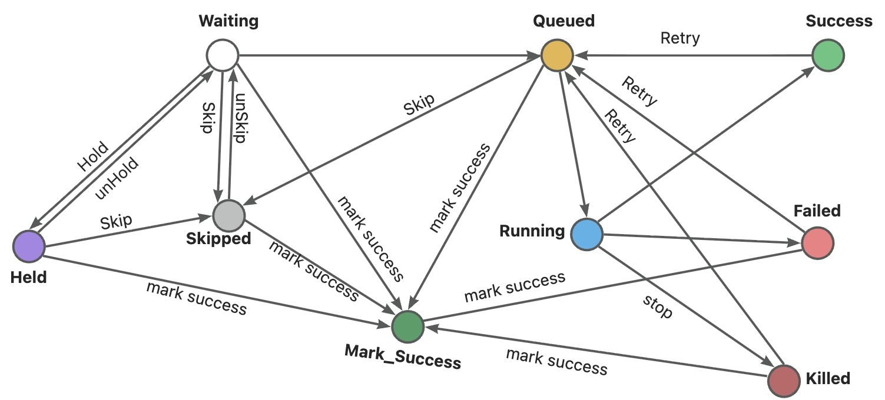

状态存储的选型直接影响可靠性：内存存储读写最快但进程重启即丢失；文件存储能抗进程重启但机器不可用时不可达；数据库存储(PostgreSQL、MySQL)提供高可用与持久化保障但引入额外依赖和延迟。生产环境通常以数据库为主存储、内存缓存加速高频查询，并把数据库视为 Task State 的权威源。

#### 10.2.4 任务状态的监听与同步

调度器把 Task 分配给 Worker 后，需要持续感知状态变化(running → succeeded / failed / killed)，以便推进状态机、触发通知或执行重试。轮询、回调、Watch 是状态变化信号，不是唯一事实源——任何信号缺失或中断，必须以权威 Task State 重新对账。

方案 A：调度器主动轮询。调度器周期性调用 Worker 的状态查询接口(例如每 5 秒一次，具体频率依业务)，根据返回更新 Task 状态。优点是控制权完全在调度器侧、实现集中；缺点是轮询频率与实时性的取舍——太频繁增加 Worker 与网络开销，太稀疏导致状态延迟。单次轮询失败不能直接推断 Task 异常：网络分区、Worker GC 暂停、临时降级都可能让查询失败但 Worker 仍在执行。判定异常应基于租约/心跳——Worker 周期性续租，租约失效后才把 Task 转入 unknown 并启动对账。

方案 B：Worker 完成回调。Worker 在状态变化时主动向调度器推送事件。优点是实时性好；缺点是依赖 Worker 的"诚实回报"——进程崩溃可能未发出回调，需要超时兜底。回调事件必须带 Task ID、事件序号(或版本号)、Worker 标识、租约 token，调度器据此幂等消费并丢弃迟到事件。

方案 C：共享存储 + 变更通知。Worker 把状态写入调度器与 Worker 共同访问的持久化存储(数据库、Redis、etcd)，调度器通过监听变更感知状态。Redis Keyspace Notification 默认关闭，需要显式开启，且断连期间事件会丢失——重连后必须以当前 key 状态为准重新对账。etcd Watch 基于 revision，如果客户端落后超过 compaction 阈值，Watch 会被取消并返回 ErrCompacted，客户端需以最新 revision 重新建立 Watch 并重新读取全量。共享存储提供持久化保障，但只有当恢复所需的最小集合(业务 State、等待对象、版本号、副作用记录)均已持久化时，才能声称"可恢复完整任务"。

三种方案不互斥。生产实践通常组合使用：回调为主、轮询/租约兜底、共享存储做权威持久化。正常路径上 Worker 完成主动回调；若回调丢失，通过查询或租约异常核对状态；所有状态变更同步落入权威存储，调度器与 Worker 重启后从存储恢复。

#### 10.2.5 Human-in-the-Loop 与 Agent 资源利用率

Agent 任务经常需要人工介入(Human-in-the-Loop，HITL)：生成的方案需要确认、风险操作需要审批、不确定的输出需要选择。这意味着 Task 会从 waiting 进入 hold 状态，等待审批或外部输入满足后再入队执行。等待时长从分钟级到数天级不等，直接影响资源利用率和系统复杂度。

内置异步调度将队列和调度逻辑集成在应用中。若状态只在内存里，等待期间需要保留进程；若支持持久化等待与恢复，也可以释放执行资源。是否常驻取决于恢复能力，不由“内置”这一部署位置单独决定。

外置调度由专用系统管理执行分配和唤醒，Agent 完成当前步骤后保存恢复所需状态与引用，再按环境能力释放 Worker。审批事件到达后，调度系统校验任务、授权和等待条件，重新分配资源。等待期仍需承担调度、状态存储、通知及可能保留环境的成本。

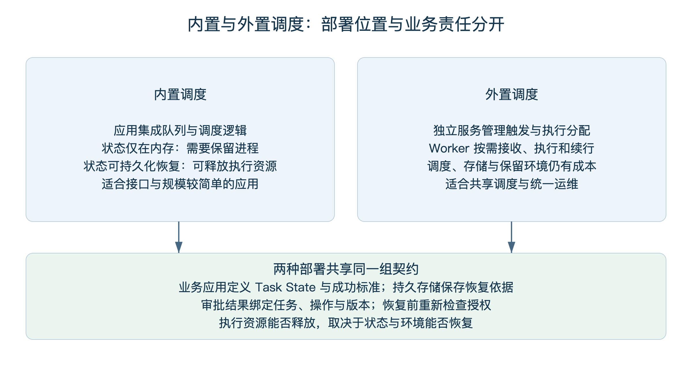

图10-2 内置与外置调度的责任边界

| 维度 | 内置调度 | 外置调度 |
| --- | --- | --- |
| 任务队列 / 调度器 / 状态机部署位置 | Agent 进程内 | 独立调度系统 |
| Agent 进程是否常驻 | 取决于等待与状态恢复能力 | 具备恢复条件时可释放执行资源 |
| Task State 管理 | 由业务模型定义，可使用外部持久化 | 同样由业务模型定义，调度系统保存执行与触发记录 |
| 等待期资源占用 | Agent 执行算力 + 调度组件 | 调度组件、状态存储、审批通道仍占用资源 |
| 接入门槛 | 低，自包含 | 需对接调度系统 API、暴露恢复接口 |
| 故障恢复 | 需实现持久化、重新调度与对账 | 复用调度能力，业务状态仍需恢复与对账 |
| 适用场景 | 小规模、对资源利用率不敏感 | 大规模、等待时长不可预测、需要资源弹性 |

HITL 的实现路径除了"调度器暂停 Task + 外部审批回调"，还可以借助工作流引擎的人工节点。Apache Airflow 在 3.1.0 版本引入了 Human-in-the-Loop 能力(此前需要自定义 Operator 实现)；阿里云 MSE-XXLJOB 工作流提供多种逻辑节点，人工节点支持暂停/恢复功能。这些产品负责流程暂停与恢复协调，不自动拥有业务审批授权——授权链路由业务应用与 Verifier 体系定义。

审批结果回传必须明确两件事：事件载荷应包含 Task ID、审批版本号、授权主体、决策结论；接收方是 Runtime 或调度器，据此重新投递执行，并验证事件未过期、未重复、与 Task 当前状态兼容。把"审批通过 → 回调唤醒 Agent"画成一根没有标注接收方的箭头会掩盖这些必要校验。

### 10.3 Agent 定时任务

#### 10.3.1 从被动响应到主动执行

定时任务是 Agent 从"被动工具"走向"主动数字员工"的关键能力：每天早 9 点生成日报、每周一检查服务器健康、每小时扫描安全漏洞。它根据用户或业务的预授权，按时间规则创建 Task，使 Agent 能按预设节奏自主运行。

#### 10.3.2 触发方式的分类

时间触发和事件触发由不同条件驱动，可以共享后续的任务执行路径。

| 类别 | 子类型 | 说明 |
| --- | --- | --- |
| 时间触发 | Cron | 按 Cron 表达式周期性执行，如每天 14:00 |
| 时间触发 | ScheduledAt | 在未来某一时刻执行一次，如三天后 08:00 |
| 时间触发 | FixedRate | 按固定频率调度，如每 40 秒一次 |
| 事件触发 | Webhook | 系统对外暴露 Webhook 接口，接收业务方推送的事件后创建 Task；方向是“业务方 → Agent 系统” |
| 事件触发 | 消息队列 | 订阅消息队列(Message Queue，MQ)Topic，消息到达即创建 Task |
| 事件触发 | 内部事件 | 系统内部其他 Task 完成或状态变化触发新 Task |

时间触发和事件触发在执行层面走同一条路径：都是向任务队列投递一个 Task。这一统一抽象让两类触发可以共用调度、并发控制、重试、对账机制。

#### 10.3.3 定时任务的基本属性

| 属性 | 说明 |
| --- | --- |
| 触发类型 | Cron / ScheduledAt / FixedRate(事件触发不属于定时类型，见 10.3.2) |
| 状态 | 启用或禁用；禁用后不再调度 |
| 任务并发数 | 同一定时任务允许并行运行的最大 Task 数；1 表示串行 |
| 阻塞处理策略 | 当并发数已满时新触发的 Task 如何处理：排队等待、跳过或按约定合并为最新待执行任务 |
| 错过策略 | 调度器宕机或 Worker 不可用导致触发时间错过后的恢复策略，见下表 |
| 失败重试 | 自动重试的次数与退避策略 |
| 超时 | 单次执行的截止时间，以及取消和未知结果处理方式 |
| 开始时间 | 配置后是立即生效，还是从指定时间开始 |
| 时区与发生标识 | 明确时区、夏令时处理；以调度ID与计划发生时间识别同一次触发 |

以下列出几种可选的错过处理方式，支持范围以调度系统实现为准。

| 策略 | 语义 |
| --- | --- |
| run\_latest | 只补跑错过窗口内最新一次，其余忽略 |
| run\_all | 补跑所有错过的触发点，在补跑数量、速率和并发上限内执行 |
| skip | 跳过所有错过的触发，只按下一个未来时间点继续 |
| prompt | 不自动决策，挂起并通知运维或业务方人工选择 |

#### 10.3.4 内置调度与外置调度的责任对比

定时任务的调度能力放在 Agent 内部还是外置到专用任务调度系统(XXL-JOB、阿里云 SchedulerX、Apache Airflow 等)，需要从触发统一性、并发控制、故障转移、资源利用、接入门槛、运维复杂度六个维度衡量，而不是简单归结为"是否同进程"。

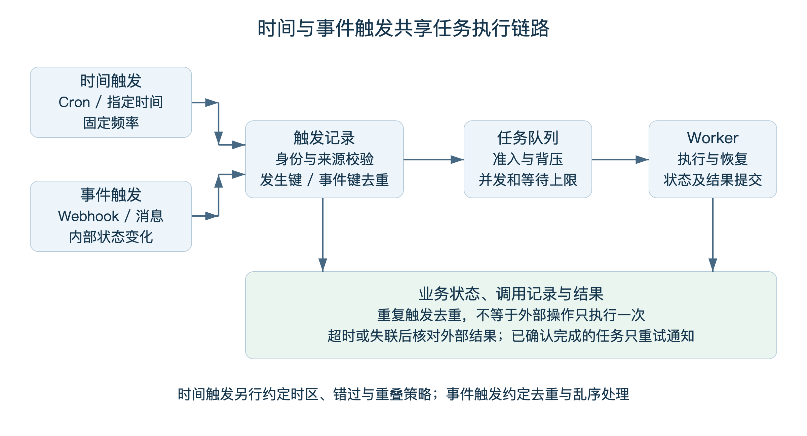

图10-3 时间与事件触发共享任务执行链路

| 维度 | 内置定时调度 | 外置定时调度 |
| --- | --- | --- |
| 多实例触发去重 | 需自行实现分布式锁或 Leader 选举 | 由调度系统统一管控触发，降低重复触发概率 |
| 故障转移 | 依赖应用自身 | 调度系统提供 failover；failover 期间子任务可能执行多次，业务代码必须保证幂等 |
| 资源占用 | 承载定时器的服务需存活，执行资源可另行管理 | 等待期可释放 Agent 执行算力；调度系统、状态存储、监控通道仍占用资源 |
| 接入门槛 | 初始集成较少，持久化与协调仍可能依赖外部组件 | 需对接调度系统、暴露恢复接口 |
| 运维复杂度 | 与应用绑定，故障定位简单 | 多一套基础设施，但具备统一的运维视图 |
| 适用规模 | 单实例或小规模 | 大规模、多实例、跨地域 |

设计建议：在大规模生产环境中，定时调度能力通常外置到专用任务调度系统，但需要明确以下三点。第一，定时触发与事件触发在执行层统一——两者都是向任务队列投递 Task，共享调度、并发控制、重试、对账机制。第二，外置调度系统不接管业务 State 权威——Task State、成功标准、副作用记录的权威归属仍按 10.1.1 节的责任划分，调度系统持有的是 Runtime State 与触发计划。第三，幂等是业务设计责任——根据交付语义选择幂等机制，不把任何一种写成通用必选项。

### 10.4 Agent 工作流

#### 10.4.1 编排结构的选择与组合

当一个复杂任务涉及多个步骤、需要多个 Agent 协调完成时，编排结构维度上有多种选择，业界并未收敛到仅有的两种方案。常见形态包括：单个 Task 内部由 Agent 自主决策(ReAct 风格)、预定义工作流编排(把执行计划固化为图)、Multi-Agent 协调(一个 Planner Agent 动态分解任务并分配给专业 Agent)，以及上述形态的组合——工作流的某个节点内部可以是一个完整的 Agent 自主决策循环；Multi-Agent 也可以由确定性流程约束(把 Planner 的决策范围限定在预定义子图内)。

比较编排方式时，应考虑动态决策需求、路径稳定性、风险和维护成本。预定义工作流可减少重复规划，并使控制路径易于测试，但不会消除节点内模型错误、工具开销和失败重试。多 Agent 适合存在真实专业分工的任务，也可以运行在固定工作流内；具体团队组织与交接见协作章。

#### 10.4.2 工作流的基本概念与节点模型

本章把工作流限定为有向无环图(Directed Acyclic Graph，DAG)型工作流——图中节点代表执行单元，有向边代表依赖与数据流向，图本身无环。引擎按拓扑顺序驱动节点执行：入度为零的节点最先执行；后续节点的就绪条件由依赖边类型决定(见 10.4.3)。

需要循环语义时，通过运行时有界展开、动态映射或子流程迭代实现，图本身仍保持无环。例如 ForEach 节点在运行时根据上游集合大小展开为 N 个子任务实例，每个实例走相同的子图；Loop 节点通过子工作流递归调用并设置最大迭代次数，父图依然无环。如果业务确实需要带环的状态流转(例如审批驳回回到起草、反复迭代直到满足质量门槛)，应改用更上位的状态机或流程图模型，而不是把环硬塞进 DAG。

按职责，节点分为业务节点与逻辑节点两类。

业务节点(Task Node)执行具体业务操作，是工作流中"干活"的部分。典型形态包括 Agent 调用(向 LLM Agent 发送 Prompt 并获取响应)、工具调用(外部 API、数据库、消息队列)、代码执行(运行 Python / JavaScript 脚本)、知识检索(从向量库或知识库召回上下文)、人工审批(将流程挂起等待人工确认)、通知推送(发送消息到即时通讯工具 Instant Messaging，IM、邮件、Webhook)。

逻辑节点(Control Node)不执行业务操作，只控制流程走向。显式控制节点能增强分支、等待、复用等表达能力——但仅由业务节点和依赖边构成的 DAG 也可以表达并行与汇聚(多条独立路径并行执行，在某个业务节点处依赖多条入边即天然汇聚)，不能据此判断图必然线性。常见逻辑节点如下表。

| 节点类型 | 作用 |
| --- | --- |
| 条件分支(Condition / Switch) | 根据上游输出或全局变量决定走哪条路径，例如"分类为紧急工单走人工分支，否则走自动回复分支" |
| 并行(Parallel / Fork) | 将流程拆分为多条并行分支同时执行 |
| 汇聚(Merge / Join) | 等待并行分支输出就绪后合并为统一上下文，具体就绪条件见 10.4.3 |
| 循环(Loop / ForEach) | 通过运行时有界展开对集合逐条或分批执行子流程(图本身仍无环) |
| 等待(Wait / Timer) | 暂停流程，等待指定时长或外部事件 |
| 错误处理(Error Handler / Retry / Fallback) | 定义节点失败时的行为：自动重试、降级到备选路径、抛出异常终止 |
| 子工作流(Sub-Workflow) | 将可复用流程封装为独立工作流，作为节点被父工作流调用 |

#### 10.4.3 节点就绪条件：普通依赖、AND Join、OR Join

工作流引擎的默认调度规则与显式汇聚规则需要明确衔接，否则"所有前依赖完成"和"任一完成即继续"会在同一张图里互相矛盾。本章使用以下定义。

| 边类型 | 就绪条件 | 未选 / 未完成分支处理 |
| --- | --- | --- |
| 普通依赖边 | 上游节点状态为 succeeded或skipped | 上游失败按错误处理策略(终止、降级、重试) |
| AND Join | 所有入边的上游分支均到达终态(succeeded / failed / killed / skipped)，且满足策略要求(全部成功 / 至少 N 个成功) | 任一分支失败按策略决定是否触发 Join |
| OR Join | 任一入边的上游分支满足条件即就绪 | 未被选择的分支由引擎显式取消;迟到结果按审计日志归档，不改变下游已就绪状态 |

OR Join 的关键是显式取消未选分支，否则它们会继续消耗资源、产生副作用，与下游已基于"先到结果"做出的决策冲突。迟到结果(分支在 Join 已就绪之后才完成)进入审计日志，供事后分析，不参与下游计算。

#### 10.4.4 工作流引擎的核心工程能力

在节点模型之上，生产级 Agent 工作流引擎还需要解决三类工程问题。

状态持久化与断点恢复。每个节点完成后，引擎将输入、输出、执行状态持久化为步骤级 Checkpoint。后续节点的输入从 Checkpoint 读取，而非重新计算。这使工作流执行不依赖任何单个工作进程——进程崩溃后，引擎从存储层恢复上下文，从最后一个成功 Checkpoint 继续执行。这与 10.2.5 节外置调度的责任立场一致：状态外置到持久化存储，执行进程无状态化；但 Checkpoint 保存的是按恢复契约保存的状态，业务 State 的权威仍在业务应用(参见 10.1.1)。

幂等与局部重跑。节点可能因进程崩溃或调度重复分发而被重新执行。需要区分两件事：步骤计算结果复用——若 Checkpoint 已存在且版本匹配，跳过重新计算，这是 Checkpoint 的天然能力；外部副作用幂等——若节点已对外部系统提交写入(数据库 INSERT、消息发送、API 调用)，Checkpoint 是否落盘不能保证副作用未发生。当外部写入已提交而 Checkpoint 尚未落盘，重跑仍会产生重复副作用。

外部调用可以先保存意图，执行后再保存结果；意图记录、消息发布和状态提交之间的故障窗口，按后端能力使用事务、Outbox、幂等键或对账处理。围栏用于拒绝过期执行者的提交，不能替代跨系统事务。局部重跑应复用版本仍有效的前序结果，并核对失败步骤的副作用；邮件、扣款等已发生操作通常只能确认或补偿，不能由恢复检查点撤销。

可视化运维。生产级工作流应提供可视化执行视图：DAG 拓扑上标注每个节点的实时状态（waiting / queued / running / hold / succeeded / failed / killed / skipped / mark\_successed，见 10.2.3.3）、耗时、重试次数；支持人工介入操作（重跑 → queued、跳过 → skipped、强制标记成功 → mark\\_successed、暂停 → hold、终止 → killed）。"强制标记成功"按 10.1.2 节只改变执行状态并留下审计记录，不直接判定 Outcome。

可观测数据采集不应是无条件的全量记录。默认按最小必要采集，涉及敏感字段做字段级脱敏或散列，凭证秘密禁止入库，访问受 RBAC 控制，留存有明确期限，审计日志保证完整性(只追加、防篡改)。"查看任意节点的输入输出和 LLM 原始响应"这类能力应按需授权，而不是默认开放——无人值守任务的执行上下文经常携带客户数据、内部凭证、商业敏感信息，默认全量记录会显著扩大攻击面与合规风险。告警方面，节点失败、整体超时、定时工作流未触发等事件应自动推送；配置了自愈策略的节点(自动重试 + 指数退避)无需人工介入。

### 10.5 横切关注点：治理、可观测性与安全

#### 10.5.1 可观测性、Evaluation 与 Outcome 的责任分层

可观测系统提供运行材料，评估系统产生评分和诊断，业务应用或获授权验收组件判断 Outcome。三者可以协同，但应记录各自的来源和方法。通用体系在治理篇展开，本章重点关联触发、排队、等待、重试与结果交付。

Observability 负责关联系统、任务与语义信号：把 Trace、日志、状态、Artifact 串成可查询的链路，提供执行状态、节点运维状态与候选证据的统一视图。它的输出是材料，不是结论。

Evaluation 使用这些材料评分与归因：LLM-as-a-Judge 自动评测、规则匹配、人工抽样审核都是 Evaluation 的实现方式。Evaluation 的输出是评分或诊断，仍不是 Outcome。

Outcome 由业务应用或获授权 Verifier根据成功标准与 Evidence 做出最终判定。评分被用于验收时，应有明确的适用标准与授权。

#### 10.5.2 安全与权限

无人值守任务按预授权范围执行，持续检查当前身份、任务和资源策略。超出范围的操作按策略审批或拒绝，等待后恢复时重新核验授权。审计记录主体、目标、策略和结果，内容字段按数据等级脱敏并限制留存。

无人值守场景还需要补充以下维度：运行身份——任务以哪个用户/服务账号身份执行，凭证如何获取与轮转；租户隔离——多租户环境下 Task State、Checkpoint、Artifact 的隔离边界；网络出口——任务能访问哪些外部域名/IP，出口流量是否经审计代理；审批超时——hold 状态超过阈值后的默认行为(拒绝、继续保持等待或升级处理；超时本身不构成批准)。

#### 10.5.3 成本治理

任务成本至少包括：模型 Token(LLM 输入输出)、工具与外部 API 调用(搜索、向量检索、第三方服务)、计算资源(Agent 进程、沙箱、容器)、存储(Task State、Checkpoint、Artifact、日志)、网络(出口流量、跨地域调用)、重试与补偿(失败重跑、对账修复)、人工审批(运维与审批人员的时间成本)。

预算维度也需要相应扩展：调用次数、执行时长、并发数、外部副作用次数、总费用。治理手段包括单次执行 Token 与费用上限、每日 / 每月累计预算、预算耗尽时自动暂停并告警、基于历史数据的成本预测与异常检测。在异步与定时场景下(无人在场监督)，死循环 Agent 在数小时内累积出非预期账单是真实风险——具体的金额量级依模型与调用模式而异，应按实际模型、工具价格与历史负载设定阈值。

### 本章小结

异步任务、定时任务和工作流分别描述执行方式、触发方式与编排结构，可以自由组合：定时触发的工作流可以异步执行，事件触发也可以投递单 Task，工作流节点内可以嵌入 Agent 自主决策。

把生产级 Agent 平台落地，关键不在堆叠组件，而在分清责任边界：Task 具有独立持久的标识与业务 State，Session 只是其中一段执行上下文；业务应用拥有 Task 与成功标准的权威，Harness 组织控制循环，Runtime 管执行生命周期与租约，Environment 提供运行条件，调度器协调触发与执行。完成语义按"执行状态—候选证据—Evidence—Verifier—Outcome"分层，运维操作只在授权范围内改变对应层级。

恢复与幂等不能外包给任何单一组件：外置调度降低重复触发概率，但业务副作用需要按可用能力组合去重、幂等、执行围栏、对账与补偿；不能保证恰好一次时应明确边界；Checkpoint 复用计算结果，但不等同于副作用幂等；轮询、回调、Watch 是状态变化信号，不是权威事实源，信号缺失后必须以权威 Task State 重新对账。

可观测性、Evaluation、Outcome 各归其位，安全与成本治理覆盖完整维度而非单一指标。这些原则共同决定 Agent 平台能否从"原型 Demo"走向"可信赖的生产系统"。


<a id="sec-019"></a>

## 第 11 章　Multi-Agent 协作与编排
当 Agent 从单点能力验证走向真实业务，系统面对的问题也在发生变化。很多任务已经不是一次模型调用，或者一个 Agent 完成一轮规划和工具执行就能结束。它们往往持续更长时间，涉及不同专业领域，需要访问不同的系统和数据，还可能穿插人工确认、结果评审和异常处理。此时，真正困难的已经不只是如何让一个 Agent 变得更强，而是如何让多个 Agent 与人围绕同一个目标有序协作。

把多个 Agent 放在一起并不会自然形成团队。如果缺少清晰的分工、协作方式和状态管理，参与者越多，反而越容易出现重复执行、信息不一致、任务遗漏和责任不清。多智能体编排要解决的，正是如何把原本相互独立的执行能力组织起来，让它们既能发挥各自的专业优势，又能在共同目标和统一约束下形成完整的执行过程。

本章沿着“异构接入—团队组织—任务协作—共享信息—通信—治理”的顺序展开。构建篇已说明单个 Harness 如何规划、委派与使用上下文，这里重点讨论多个独立成员共同运行时的责任交接、状态一致性与成果接受；底层调度和消息投递分别沿用异步任务章与分布式通信章的机制。

### 11.1 从单 Agent 到 Agent 团队：编排层的价值与边界

构建与运行能力使单个 Agent 能在明确边界内持续工作。当目标涉及多种专业能力、独立权限或可并行交付时，团队编排需要把这些执行能力组织到同一任务中，并保持责任、依赖和结果可追踪。

#### 11.1.1 单 Agent 的适用范围与团队价值

单 Agent 的执行链路相对简单。它拥有较为集中的上下文，可以围绕一个目标连续思考和行动。对于范围明确、上下文关联紧密的任务，这种方式往往更加直接，也更容易控制。但在真实的企业场景中，一项工作可能同时涉及需求分析、方案设计、代码实现、测试验证、安全检查和上线审批。如果把这些工作全部交给一个 Agent，它就需要不断在不同的专业角色之间切换，同时维护越来越多的上下文、工具和权限。原本可以并行推进的任务也会被压缩到一个执行循环中，其中任何一步遇到阻塞，都可能让整个任务停下来。

这种情况下，引入多个 Agent 的目的并不是简单追求更多执行者，而是让不同能力能够以更合适的方式组合起来。例如，在一次复杂的软件变更中，可以由一个 Agent 理解总体目标并梳理工作范围，由熟悉代码的 Agent 完成实现，由测试和安全 Agent 从不同角度并行验证，再由人类负责人判断是否满足发布条件。每个参与者都聚焦于自己擅长的部分，只获得完成当前工作所需要的信息、工具和操作范围。相比让一个 Agent 承担全部工作，这种方式更容易形成专业分工，也为并行执行、权限控制和结果复核提供了空间。

#### 11.1.2 围绕共同目标建立持续协作

不过，多个 Agent 能够互相调用或交换消息，还不能说明它们已经组成了一个团队。团队需要有共同的目标，也需要知道每项工作由谁推进、依赖哪些前置结果、完成后交给谁，以及怎样才算真正结束。参与者之间不仅要传递消息，还要围绕任务、状态和产物形成稳定的协作关系。这里所说的 Agent 团队，可以理解为一组围绕共同目标组织起来的 Agent 与人：每个成员拥有相对稳定的身份和能力边界，团队内部存在明确的分工与协作关系，工作过程能够被持续追踪，最终结果也能够被验证。

编排层为这种团队协作提供了一条贯穿始终的主线。它把一个相对宽泛的目标逐步转化为可以执行和验收的任务，建立任务之间的先后关系和依赖，并在推进过程中持续汇集各个成员的状态和产物。当部分工作可以独立完成时，编排层可以让它们并行推进；当某个环节依赖前序结果时，也可以在条件满足后再进入下一阶段。最终，各成员的输出需要重新汇集到共同目标上，形成可以交付、检查和验收的整体结果。

显式记录协作过程，对于持续时间较长的任务尤其重要。如果团队只依靠对话历史来维持进度，一旦参与者发生变化、运行环境重启，或者任务中断一段时间，很多隐含信息就可能难以恢复。将目标、任务、依赖关系、执行状态和工作产物沉淀下来，可以让新的成员快速理解当前进展，也可以在失败后继续推进。当某个 Agent 无法完成任务、长时间没有响应或产出不符合要求时，系统可以选择重新执行、调整分工、请求其他成员协助，或者将问题交给人进一步判断。这样，团队的连续性就不再依赖某一个 Agent 始终在线。

#### 11.1.3 编排层与执行系统的职责边界

多智能体编排并不是脱离既有能力单独存在的。在完整的 Agent 系统中，Harness 将模型、工具、上下文和控制循环组织成 Agent 的执行过程，并完成必要的局部检查；Runtime 让这些执行过程能够稳定启动、持续运行，并在异常后恢复，具体运行环境则提供计算、网络、文件、凭证映射和隔离条件；Gateway 为模型、工具和 Agent 提供统一的连接入口，A2A、MCP 与消息系统进一步支持参与者之间的能力发现、信息交换和协作调用。编排层将这些能力串联到团队工作中，使目标、成员、任务、进度和结果形成稳定联系。至于最终交付是否达到业务目标，仍需要由任务发起人或获得授权的验收者依据约定标准确认。

编排层也不需要介入每个 Agent 的所有执行细节。团队可以统一目标、分工、约束和验收标准，但每个成员仍然可以在自己的能力范围内选择合适的执行方式。如果所有信息都必须先汇总到一个主管 Agent，再由它决定每一个步骤，多智能体系统很容易重新回到单点决策的模式，主管 Agent 也会成为新的上下文和执行瓶颈。更加合理的方式，是在团队协调与成员自主之间保持平衡：日常工作由成员独立推进，只有在任务阻塞、结果冲突、资源不足或触及高风险操作时，才需要进一步协调或引入人工判断。

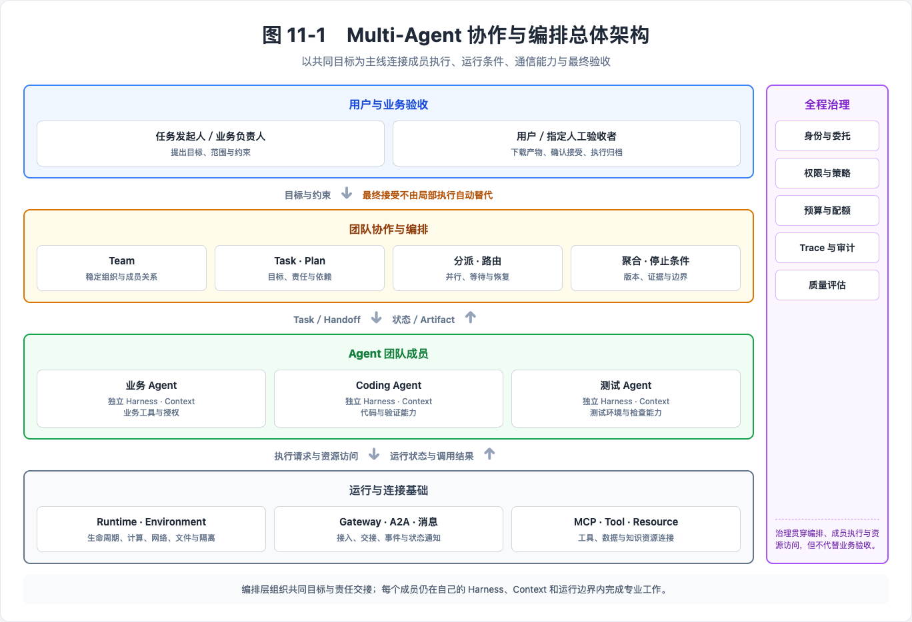

#### 11.1.4 协作收益与协调成本

多智能体协作同样会带来新的成本。任务需要被合理拆分，参与者之间需要反复传递信息，共享状态需要保持一致，更多的执行主体也会产生额外的模型调用和运行开销。如果任务本身目标单一、上下文高度集中，或者执行步骤必须严格串行，那么使用单 Agent 往往更加简单有效。只有当专业分工、并行执行、故障隔离和过程治理带来的收益，能够覆盖沟通与协调成本时，Agent 团队才真正具有价值。

团队编排需要验证的，是成员分工与共同交付是否成立。后续各节依次说明接入、组织、协作、共享信息、通信和治理如何支持这一目标。

### 11.2 异构 Agent 的接入：不同框架、Coding Agent 与个人工作区助手

一个业务 Agent 已经查出了服务中需要升级的依赖，接下来希望让开发者电脑上的 Coding Agent 修改代码并运行测试。两者使用不同的软件和运行环境，需要把修改要求交给对方，并取回补丁和测试报告。

类似协作会涉及框架开发的 Agent、产品化 Coding Agent、托管 Agent 服务和个人工作区中的助手。它们并非互斥分类；本节按可控制的接口和运行位置说明接入方式，构建入口分类沿用构建篇。

这些类型并不互斥。Coding Agent 可以部署在云端，使用框架开发的 Agent 也可以运行在个人电脑上。构建方式决定能够怎样扩展其执行逻辑，运行位置则影响资源访问、在线时间和维护责任。选择接入方式时，两方面都需要考虑。

#### 11.2.1 保留原有执行方式

一个已经能够完成业务任务的 Agent，通常有自己的 Harness，负责组织上下文、调用工具和维护执行状态。让它加入团队时，可以继续使用这套执行逻辑，在外部补充协作所需的接口和能力。

可以先根据自己能够控制的范围选择接入方式：

| 已有条件 | 接入方式 | 主要需要准备什么 |
| --- | --- | --- |
| 能修改 Agent 的应用代码 | 在现有框架中加入协作 SDK（软件开发工具包）或任务接口 | 接收任务、反馈状态和提交成果 |
| 能安装插件或控制启动方式 | 使用插件和适配程序 | 配置工作环境，关联会话和执行状态 |
| 只能调用远程服务 API | 在外部增加适配程序 | 记录远端任务编号，取得状态和结果 |

这里的适配程序负责在团队与 Agent 之间转接请求和结果，可以独立运行，也可以集成在已有服务中。选择之后，还要检查 Agent 在执行过程中能够反馈什么、接受哪些控制。例如，能够逐步返回文本，不代表支持任务查询或中断恢复。团队应根据这些实际能力安排工作。

对于只能通过外部 API 调用的 Agent，适配程序记录团队任务对应的远端任务编号，并取得远端状态和成果。远端的运行管理仍由服务提供方负责。如果接口只返回最终结果，就无法提供实时进度；取消和恢复等操作也应以远端实际支持的能力为准。

#### 11.2.2 框架开发的 Agent 如何加入协作

对于使用框架开发的 Agent，可以从已有服务入口开始接入。应用接收任务输入，调用原有 Agent，并将执行结果返回给团队。模型、工具和业务流程可以继续沿用，不必为加入团队而整体迁移。

承担持续协作任务的成员，需要能够读取分配给自己的工作、报告阻塞并提交成果。应用可以通过 SDK 将这些能力组合进原有 Harness：指令说明职责，工具提供任务操作入口，较长的操作步骤可以放入 Skill。应用也可以用确定性代码或工作流完成这些步骤，并不要求全部交给模型调用工具。

无论采用哪种方式，都要约定任务状态由谁维护、哪些操作由成员发起，以及结果如何提交。涉及任务写入时，由任务服务根据调用身份、任务归属和当前状态检查操作权限。

应用验证请求来源后，将所属团队和任务信息传给 Agent 及相关工具。即使请求已经开始返回内容，后续工具操作也要归属到同一个任务，避免将进度或成果记入其他任务。

应用也可以逐步接入。一个只承担短时查询的 Agent，可能只需稳定的请求与结果接口；需要接收子任务、报告进度和提交文件的执行者，则要补齐相应的协作能力。接入范围应与实际职责一致，不必要求所有成员一开始就具备完整的团队管理能力。

例如，具备协作 SDK 的平台可以向执行成员提供任务读取、进度反馈和成果提交接口。应用将这些接口接入已有框架后，仍由原有 Harness 执行业务逻辑；具体接入范围以所用版本实际支持的能力为准。

#### 11.2.3 Coding Agent 的运行适配

Coding Agent 已经具备文件操作、命令执行和代码验证等能力。接入这类 Agent 时，通常可以通过插件或适配程序增加协作能力，同时保留其原生执行流程。

插件适合装配协作指令、Skill 和工具；在自行启动进程的接入方式中，适配程序负责启动、加载配置、接收请求和检查运行状态。Coding Agent 仍使用自己的任务循环完成工作。

适配程序还需要记录团队中的交互对应 Coding Agent 的哪个会话，让后续消息能够延续已有上下文，并按隔离要求分开无关工作。任务与会话分别标识，按需要关联，不要求一一对应；同一任务可以跨会话继续推进，会话中也可以先后处理不同任务。具体的状态组织见上下文、协作状态与运行工作空间相关章节。

原生接口返回的进度、等待输入和结束原因，需要转换为团队能够理解的状态。成员支持取消时，适配程序将请求传给正在执行任务的 Agent，并返回实际处理结果。关闭输出连接后，后台命令仍可能继续运行，因此需要确认取消是否生效。

Coding Agent 内部的子代理仍由当前 Harness 管理，不因接入而自动成为团队成员。只有需要独立分派或管理时，才为其建立相应的成员身份和协作关系。

#### 11.2.4 个人工作区的接入边界

有些任务适合留在个人工作区执行。例如，一个项目已经在开发者电脑上准备好依赖和测试环境，或者需要使用只能在特定网络中访问的工具。此时可以将指定的本地 Agent 实例接入团队，由本地适配程序接收工作并反馈结果。接入的是这个运行实例，能否延续用户原来打开的会话，取决于 Agent 提供的接口。

接入前需要确定工作目录和可用资源。项目随附的 Skill、团队分配的工具与用户个人配置，往往有不同的使用范围。团队任务需要使用个人工具时，应由用户明确选择，避免自动继承个人目录中的全部配置。用户允许某个 Agent 处理项目代码，也不意味着团队中的其他成员可以借此使用该用户的所有账号权限。

工作目录用于确定默认操作位置，实际的访问限制还取决于执行环境。仅设置一个目录参数，通常不足以阻止程序访问其他文件。需要限制文件、命令或网络访问的任务，应由相应的权限控制或沙箱实施约束，具体机制见运行环境与安全相关章节。

本地成员的可用性也与云端常驻服务不同。机器休眠、网络断开或本地登录失效，会影响接收任务和反馈状态。本地适配程序应报告可观察到的连接及执行状态，无法确认时如实说明。需要持续在线的工作，应选择具备相应运行条件的成员承担。

文件交付尤其容易被忽略。本地 Agent 生成报告后，如果只回复一个绝对路径，其他机器上的成员通常无法读取。需要共享的文件应通过约定的交付通道提交，并在任务结果中附上接收方可访问的引用。上传哪些文件、哪些内容保留在本地，应按任务范围决定，而不应默认同步整个工作目录。

本地执行也不代表数据始终留在本机。调用远程模型、工具或交付文件时，都可能向外传输数据。接入前应核对实际使用的服务和发送内容，按数据要求选择配置。

#### 11.2.5 用一次实际交接验证接入

接入完成后，可以通过一项范围较小的任务检查成员是否能够参与协作。验证既要覆盖请求到达和实际执行，也要覆盖接收方取得成果的过程。

| 检查内容 | 可观察的结果 |
| --- | --- |
| 任务到达 | 指定成员收到正确的输入，使用预期的身份和工作环境 |
| 连续交互 | 后续消息进入对应会话，不混入无关任务 |
| 状态反馈 | 能够区分执行中、等待、失败和结束，并提供必要原因 |
| 成果交付 | 接收方能够读取文件或结构化结果，并核对其所属任务 |
| 控制与恢复 | 对声明支持的取消、重试和恢复能力，分别验证实际行为 |

回到开头的依赖修复场景，可以检查修改要求是否到达指定 Coding Agent，工作目录是否正确，执行状态能否返回，以及业务 Agent 能否取得对应任务的补丁和报告。如果本地缺少依赖，阻塞信息也应能够传回团队。

这项验证检查的是协作接入链路。补丁是否解决漏洞、结果是否满足交付要求，仍按任务本身的验收约定处理，具体过程将在任务编排部分展开。

接入后，团队能够了解各成员的能力、运行条件和交付方式。在此基础上，还需要确定哪些成员负责协调、哪些承担执行，以及它们之间如何分工，下一节将讨论这些组织关系。

### 11.3 团队组织拓扑：主管—执行、对等协作与分层编排

当不同能力的 Agent 加入同一个协作体系后，还需要明确它们之间的组织关系：哪些成员统筹目标，哪些成员承担专业工作，哪些决定可以自主作出，出现分歧时又由谁协调。组织方式不仅影响工作分派，也影响信息传递、决策效率和团队的并行能力。 主管—执行、对等协作和分层编排，是对决策、委派和汇报关系的不同安排。它们不是从低级到高级的演进阶段，而应根据实际工作特点选择。

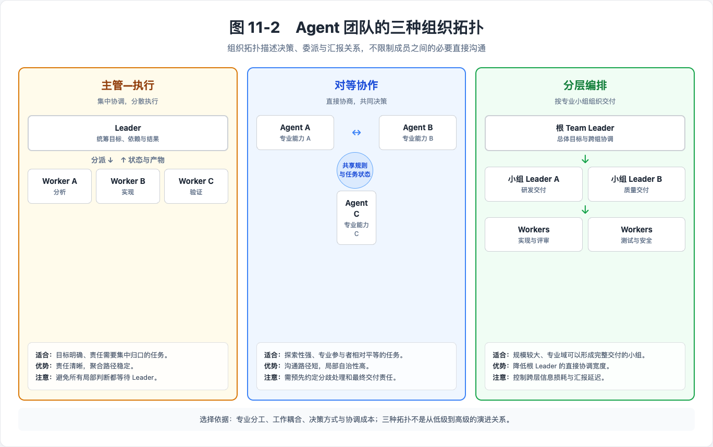

#### 11.3.1 团队与成员：组织关系与角色分工

可以从团队与成员两个层面理解 Agent 的组织关系。Team 表达相对稳定的协作组织，Agent 则作为成员加入其中，并承担相应角色。

团队通常具有共同的职责范围，可以连续承接不同任务，而不是随着某一次 Agent 执行结束就解散。团队成员可以变化，但其组织关系不需要在每次执行时重新建立。

专业能力说明 Agent 擅长什么，例如代码实现、测试验证或数据分析；组织角色说明它负责什么，例如总体协调、局部执行或结果复核。

专业能力较强的 Agent 不一定承担主管职责，主管也不需要比所有成员都更擅长具体业务。角色存在于具体团队关系中，同一个 Agent 可以在不同团队承担不同角色。

团队成员关系与具体任务责任需要分别记录：团队成员关系说明 Agent 属于哪个组织，任务参与关系说明它需要参与或了解哪项工作，执行责任明确谁负责完成并交付，审核责任则明确谁有权检查和接受结果。

加入团队，不意味着必须参与每一项任务；能够查看任务，也不意味着负责执行或审核。组织管理身份同样不能自动替代业务决策或最终验收职责。

角色不能只停留在名称上，还应说明成员可以自主决定什么、需要交付什么，以及何时寻求协调。如果主管持续代替执行者解决专业问题，执行者又等待主管决定所有步骤，团队就难以形成真正的分工。

人也可以承担需求澄清、专业判断或关键决策等角色，而不只是 Agent 无法继续工作时的临时兜底者。

#### 11.3.2 主管—执行：集中协调，分散执行

主管成员统筹总体目标、组织分工、处理跨任务依赖，并汇总交付结果。执行成员在明确的目标和约束下，自主完成局部工作。

这种模式容易建立清晰的责任归属，但也要避免所有局部决定都等待主管确认，形成决策瓶颈；还要避免主管在分派前提前解决业务问题、在交付后重复验证，造成重复执行。

目标、交付物、负责人和依赖已经清楚时，就应允许执行者开展工作。主管重点处理总体协调，不应决定每一个执行动作。

#### 11.3.3 对等协作：直接协商，明确共同决策规则

成员按照专业职责直接交换信息、协商方案并相互复核，不要求所有事情经过固定主管。

这种方式能够缩短沟通路径，但必须预先约定分歧如何解决、哪些事项需要共同决定、谁负责整合共同产物，以及谁承担最终交付责任。

对等不意味着责任模糊，也不意味着每个成员对所有事项拥有相同的决定权。

#### 11.3.4 分层编排：按专业小组组织交付

总体负责人协调多个专业小组，小组内部再安排具体执行。它可以让局部问题在较小范围内解决，减少总体负责人需要处理的细节。

分层也会带来额外成本，包括需求逐层传递时的信息损耗、进度汇报延迟，以及跨层协调开销。只有当一个小组能够承担相对完整的交付责任时，增加层级通常才有实际意义。

#### 11.3.5 组织关系与沟通路径

主管—执行结构可以允许执行成员直接讨论问题，分层组织中的不同小组也可以围绕明确的接口直接交流。

直接沟通不会自动改变任务归属，也不意味着参与者获得相同的决策权。选择组织模式时，应关注专业分工、工作耦合和决策要求，而不是单纯根据 Agent 数量增加主管或层级。

### 11.4 协作机制：任务分解、分派、并行执行与结果聚合

组织关系说明团队由谁组成，但一次具体工作还需要通过任务持续推进。本节沿用前文的依赖修复场景：业务 Agent 发现服务依赖需要升级，Coding Agent 负责修改代码，测试 Agent 负责验证，Leader 负责协调交接和汇总，最终由用户验收交付。这个过程依次经过任务定义、计划制定、调度执行和结果聚合。

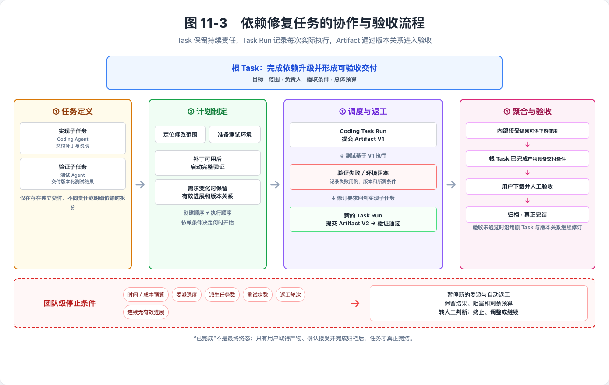

#### 11.4.1 任务与子任务：目标分解与交付责任

Task 是围绕具体目标建立的持续工作约定，记录目标、范围、输入、交付物、验收条件、负责人及必要约束。Subtask 承载其中可以明确分派、独立负责的局部交付，其价值仍要回到父 Task 的目标上判断。

本章将 Task 的一次实际执行称为 Task Run。Task 保存相对稳定的目标、责任、依赖和状态，Task Run 则记录某一次执行的起止、执行者、输入输出和结束原因。一个 Task 可以因重试、恢复或重新分派产生多个 Task Run；Session 是具体 Agent 的交互或执行上下文，可以与 Task Run 关联，但两者不要求一一对应。消息可以触发任务或补充信息，但发送成功不代表任务已经被承接。

在依赖修复场景中，根 Task 的目标是完成依赖升级并形成可验收的补丁和验证结果。实现子任务由 Coding Agent 负责，交付代码修改及说明；验证子任务由测试 Agent 负责，交付与指定代码版本对应的测试结果。只有当工作存在独立交付、不同责任或明确依赖时才拆成子任务；同一成员连续完成的内部步骤不必逐项建成任务。

任务信息以能够支撑执行和验收为准。目标和约束已经清楚时，可以直接推进；只有歧义会实质改变交付内容、责任或执行边界时，才需要进一步澄清。已有材料能够证明结果时，也不必为了形式完整重复制作报告。

#### 11.4.2 Task 的计划制定

计划回答如何完成根 Task：怎样划分交付单元、选择执行者、安排依赖，并利用可以安全展开的并行机会。计划节点的创建顺序不等于实际执行顺序，依赖关系和可用条件才决定任务何时能够开始。

在依赖修复场景中，Coding Agent 可以先定位修改范围并生成补丁，测试 Agent 同时准备测试环境和用例；完整验证则等待补丁产物可用后开始。计划需要明确测试使用哪个补丁版本，以及什么结果可以作为验证完成的依据。这样，成员可以并行准备，又不会把尚未完成的前序结果当成有效输入。

执行者的选择需要结合专业能力、可用权限和当前负载。Leader 明确目标、交付条件和依赖，但不预先替执行者解决所有专业细节。父 Task 已经记录的共同目标和约束可以由子任务引用，子任务只补充自己的责任、交付物和特有条件，避免多份描述在后续修改中产生不一致。

需求变化时，计划更新应保留已经形成的有效进展。例如，目标版本从 V1 调整到 V2 时，需要标明哪些分析仍可复用、旧补丁和测试结果对应哪个版本、哪些工作必须返工，而不是直接覆盖旧状态或重新生成整套任务。

#### 11.4.3 Task 的调度执行

调度根据任务当前状态决定哪些工作可以执行，并处理分派、承接、等待、恢复和重新分派。通知用于提醒成员出现了新工作或状态变化，真正的执行判断仍以 Task State 中的负责人、依赖和有效版本为准，避免延迟或重复消息重新触发已经结束的工作。

在示例中，Coding Agent 承接实现子任务并提交补丁 Artifact V1，测试 Agent 随后基于该版本执行验证。如果测试环境缺少依赖，验证子任务应记录阻塞原因和所需条件；能够独立推进的其他工作可以继续。条件补齐后，可以为同一验证 Task 创建新的 Task Run；如果原执行者不再适合，也可以在保留已有记录的前提下重新分派。

如果测试发现补丁不符合要求，应把失败用例、对应产物版本和修订要求关联回实现子任务。Coding Agent 提交 Artifact V2 后，旧结果仍作为历史事实保留，但后续验证只对当前有效版本作出判断。这样可以区分重试、返工和需求变更，避免成员在不同版本上反复工作。

团队级停止条件需要在根 Task 开始前约定，包括总体时间或成本预算、最大委派深度、派生任务数量、单项任务的重试次数、结果返工轮次，以及连续多轮没有新增有效产物或状态进展时的处理方式。具体阈值由任务风险、成本和时效要求决定，不在编排过程中无限追加。

触及停止条件后，系统应暂停新的委派和自动返工，保留已经完成的结果、当前阻塞和剩余预算，并将根 Task 标记为失败、已阻塞或等待人工判断。任务发起人可以据此终止任务、调整范围、补充资源或明确授权后继续；单个 Agent 的重试上限不能替代这一级团队约束。

#### 11.4.4 Task 的结果聚合

结果聚合把局部交付重新连接到根 Task 的目标。执行者提交结果，表示候选成果已经产生；Leader 或指定审核成员接受子任务结果，表示它具备继续用于下游工作的条件；根 Task 达到完成条件，则要求当前有效版本的成果共同覆盖总体目标。三者相关，但不能互相替代。

在依赖修复场景中，Leader 需要确认代码补丁、修改说明和测试报告属于同一有效版本，必要检查已经完成，并且不存在阻碍交付的实质性限制。代码、日志和成员报告最初只是候选材料；只有与具体验收条件建立关联后，才能作为支持判断的 Evidence。Leader 可以在授权范围内接受普通子任务，但这类内部接受不等于最终业务验收。

根 Task 汇总成果并达到约定完成条件后，可以进入“已完成”状态。这里的“已完成”表示团队执行阶段已经结束、产物具备交付条件，但不是任务生命周期的真正终态。用户或指定的人工验收者还需要取得并下载产物，依据预先约定的验收规则确认接受，或者提出修订要求；确认接受后再执行归档，Task 才真正完结。未通过验收时，应沿用原有 Task 和结果关系继续修订，而不是另建一套任务。

最终交付应说明当前有效产物如何覆盖目标、各项结果是否一致、仍有哪些限制，以及停止条件是否曾经触发。已经接受的子任务结果可以直接复用；只有多份结果确实需要统一口径、解决冲突或形成综合判断时，才需要额外整合，不必固定增加一个新的“聚合执行阶段”。

### 11.5 团队共享上下文、记忆与协作状态

在单 Agent 系统中，上下文、记忆和工作空间通常围绕一个执行主体组织。进入 Agent 团队后，问题不再只是“怎样让模型看到足够的信息”，而是多个角色不同、权限不同、推进节奏不同的成员，怎样在保持各自判断空间的同时，对共同目标形成一致理解。

共享不足会导致重复探索、任务冲突和错误依赖；共享过多又会让对话、工具结果和中间判断不断挤占上下文，并把局部错误扩散给其他成员。因此，团队需要的不是所有成员共用一个不断增长的“共享大脑”，而是一套有边界的信息协作机制：成员保留相对独立的推理空间，任务模型维护协作状态，产物系统保存实际成果，团队记忆沉淀可复用知识，每个 Agent 再根据当前角色和任务取得必要信息。

#### 11.5.1 团队共享上下文：形成面向任务的信息视图

团队共享上下文并不意味着所有 Agent 看到完全相同的 上下文窗口。研究、编码、测试和安全等成员关注的信息不同，即使面对同一项任务，也应形成与自身职责相匹配的上下文视图。

更准确地说，团队共享的是 上下文来源，而不是完全相同的 Context。统一维护的目标、约束、任务状态、已确认事实和协作产物构成上下文来源；每个 Agent 再结合 角色、任务、权限 和执行阶段，从中选择当前决策所需的信息。Context 是团队状态在某个成员、某个时刻的局部视图，而不是团队状态本身。

这种选择应遵循“最小充分”原则：既包含完成任务所需的目标、约束、依赖结果和相关产物，又避免把完整项目历史、无关工具输出和其他成员的全部推理过程一并注入。这样既能降低 token 和通信成本，也能减少噪声对判断的干扰。

Handoff 是这种上下文边界最典型的体现。交接内容可以按下面四类组织：

| 信息类别 | 需要传递的内容 |
| --- | --- |
| 目标 | 当前目标、工作范围和交付要求 |
| 已知事实 | 已确认的信息和已经完成的工作 |
| 待处理事项 | 尚未解决的问题、依赖和关键约束 |
| 可用引用 | 可以继续使用的 Task、数据和 Artifact 引用 |

完整搜索过程、工具调用记录和未经验证的中间推理，通常不需要原样传递。清晰的 Handoff 应让接收者可以继续工作，同时能够判断信息来源和适用范围。

#### 11.5.2 团队共享记忆：沉淀经过验证的经验

团队共享记忆回答的是“过去积累了什么，以及哪些内容值得在后续任务中继续使用”。它不等于多个 Agent 共用一个向量数据库，也不是对所有 对话历史 的永久保存。

Agent 在探索过程中会产生大量假设和临时判断。未经验证的内容如果直接进入长期记忆，容易在后续任务中被当作事实反复引用。更适合沉淀为团队记忆的，是经过任务结果、外部数据、其他成员或人工确认的信息，例如已确认的领域事实、有效或失败的方法、重要决策及其背景、团队工作约定和可以复用的操作策略。

团队记忆还应保留必要的来源和边界：由谁产生、经过什么验证、适用于哪个团队和场景、何时写入，以及当前是否仍然有效。随着业务规则和外部环境变化，记忆也需要被更新、降级或淘汰。相比存储技术，决定什么可以成为记忆、由谁维护以及何时失效，更能影响团队长期协作的可靠性。

#### 11.5.3 共享协作状态与产物：维护共同事实

复杂任务可能持续数小时甚至数天，并产生任务状态、计划、代码、数据、文档和测试结果等持续存在的信息。这些内容不能依赖某个 Agent 的上下文窗口才能存在，但也不需要被统一塞进一个含义宽泛的 Workspace。更清晰的方式，是由 Task State 和 Artifact 分别维护协作过程与实际成果。

Task State 记录目标、责任、依赖、当前进度和验收状态，使成员退出、替换或重新加入后仍能继续推进；其分解、调度和结果聚合方式已在 11.4 展开。Artifact 保存研究报告、设计文档、代码、数据集和测试结果等实际成果，使下游成员可以基于同一份产物继续工作，减少自然语言转述带来的信息损失。

消息用来说明“发生了什么”，Task State 和 Artifact 则共同记录“当前事实是什么”。成员可以通过消息通知某项任务已经完成，但其他成员仍应读取任务的当前状态；成员可以通知一份报告已经生成，但接收方应通过可访问的 Artifact 引用取得报告本身，而不是只依赖消息摘要。

协作状态和产物也不意味着所有成员可以读取和修改全部内容。不同任务、数据等级和组织边界下，成员看到的对象及可执行的操作可能不同。共享的是统一、可引用的事实载体，访问范围仍应结合角色、任务和权限进行控制。

#### 11.5.4 Context、Memory、Task State、Artifact 与 Workspace 的关系

这些对象相互关联，但解决的问题不同：

| 对象 | 回答的问题 | 生命周期 | 典型内容或用途 |
| --- | --- | --- | --- |
| Context | 当前 Agent 此刻需要知道什么 | 当前步骤或当前任务 | 目标、约束、依赖结果和 Handoff 信息 |
| Memory | 团队过去积累了什么 | 跨任务、跨 Session | 已验证事实、方法、决策和经验 |
| Task State | 当前工作推进到哪里 | 随 Task 持续 | 责任、依赖、进度和验收状态 |
| Artifact | 团队实际产出了什么 | 由业务应用定义 | 报告、代码、数据和测试结果 |
| Workspace | Agent 在哪些工作文件和获准资源上开展任务 | 按任务或项目的持久化策略管理，可跨运行实例重新挂载 | 工作目录、文件、分支、快照，以及映射到其中的工具与凭证引用 |
| Environment | 当前执行采用哪些运行条件 | 随运行实例或部署配置变化 | 计算、网络、文件系统、凭证映射与隔离条件 |

Context 根据成员当前角色和任务，从 Task State、Artifact、Memory 及实时事件中选择必要信息，形成当下的决策视图。Workspace 是 Agent 可直接操作的工作目录及其中映射的获准资源，Environment 描述这些工作发生时采用的计算、网络、文件系统、凭证映射与隔离条件。前者便于工作文件在运行实例之间延续，后者约束每次运行可如何访问和执行；二者共同支撑任务开展，但任务状态、长期记忆和正式产物仍由相应对象维护。

#### 11.5.5 从共享一切走向最小充分共享

团队共享遵循四项要求：成员保留独立判断空间；关键事实进入任务记录；已交付成果通过稳定引用共享；可复用经验经过验证后进入记忆。底层存储、版本合并和记忆生命周期沿用状态存储章的机制。

在这套信息结构下，团队不必让每个成员知道所有事情，也能维持共同目标和协作连续性。接下来还需要解决状态变化、任务请求和产物引用如何在不同 Agent 之间传递，这正是团队通信与协议需要回答的问题。

### 11.6 团队通信与协议：A2A、MCP 与消息路由

共享上下文、记忆、任务状态和产物解决了团队信息如何组织，通信机制则让不同成员能够发现彼此、建立联系并持续交换请求、事件和结果。早期多 Agent 系统通常由同一框架创建所有成员，调用关系和接口也由应用预先确定；当团队开始接入不同框架、不同运行环境乃至不同组织提供的 Agent 时，通信就需要从框架内部的消息传递走向更稳定的协作协议。

#### 11.6.1 从消息交换到持续协作

传统服务调用通常围绕已知 Endpoint 和一次请求响应展开。Agent 协作则可能经历能力发现、任务委派、上下文交接、过程反馈、补充输入和成果交付，并持续数分钟甚至更长时间。

因此，通信层不只需要传递一段自然语言，还要回答：怎样识别合适的协作者，怎样关联同一项工作的多轮交互，怎样表达执行中、等待输入、失败和完成等状态，以及怎样交付可继续使用的结果。一次消息可以触发协作，却不能单独代表工作已经被承接或完成；团队仍应以 Task State 和 Artifact 作为协作事实，具体模型见 11.4 和 11.5。

#### 11.6.2 A2A：面向异构 Agent 的开放协作

Agent2Agent（A2A）为不同框架和平台中的 Agent 建立共同的协作语义。它的价值不仅是提供一种网络传输方式，还在于把能力发现、持续任务和成果交付纳入统一协议。

| A2A 对象或机制 | 主要作用 | 与本章对象的关系 |
| --- | --- | --- |
| Agent Card | 描述 Agent 的名称、能力、接口和交互元数据 | 为发现和选择提供信息，但不能仅凭声明建立可信身份 |
| Task | 表达 A2A 协议中的一次可跟踪工作 | 需要与业务 Task 建立映射，同名不代表生命周期和权威来源完全相同 |
| Message | 表达客户端与 Agent 之间的一次通信 | 可以关联 Task，也可以在简单交互中直接返回而不创建 Task |
| Artifact | 表达 A2A Task 产生的协议输出 | 需要映射为业务应用可管理和验收的 Artifact |
| contextId | 关联同一交互上下文中的多个 Message 和 Task | 用于协议交互关联，不替代业务 Task 或 Session 的定义 |

Agent Card 可以附带签名和安全配置，但调用方仍需结合签名验证、信任来源和授权策略判断是否可信。协议中的 Task、Message 和 Artifact 解决互操作问题，本章中的同名对象则承载业务责任、状态和验收语义，两者需要通过适配层明确关联。

A2A 为长时间运行提供多种更新方式。Streaming 用于在连接保持期间持续接收事件；轮询允许调用方稍后查询 Task 状态；Push Notification 则可以在调用方不维持连接时接收更新。三者可以按运行条件组合，但不应统一描述为“不占用连接”。

#### 11.6.3 A2A、MCP 与内部消息机制如何配合

A2A 用于 Agent 之间的任务交接和结果交换；MCP 为模型应用连接工具、资源和提示；内部消息系统则承载状态通知、广播和组件解耦。协议的传输形态、版本演进和续传机制由分布式通信章展开，本节关注它们在团队中的映射关系。

研究 Agent 可以经 MCP 查询资料，再经 A2A 委派报告工作，团队内部通过事件通知状态变化。适配层需要把协议标识映射到业务 Task、Session 和 Artifact，并保留来源与权限。MCP 的可选 Tasks 扩展需要双方显式支持，其句柄不自动等同于业务任务或 A2A Task。

团队应按参与方声明且经过验证的能力选择查询、流式或推送。协议接通后仍要验证任务承接、产物可读和恢复路径，避免把传输成功视为协作完成。

#### 11.6.4 团队通信模式

团队可以根据任务特点组合不同通信方式，组织关系并不必然决定所有消息都经过同一路径：

| 通信方式 | 适用场景 | 需要注意的问题 |
| --- | --- | --- |
| Direct / Handoff | 能力边界清晰、可以直接交接的协作 | 交接目标、状态和产物引用需要完整 |
| Shared Message Space | 探索、讨论和相互复核 | 通过订阅和角色过滤控制信息噪声 |
| Event-driven / Publish-Subscribe | 规模较大、异步程度较高的团队 | 处理重复投递、顺序变化和消费恢复 |

主管—执行、对等协作和分层编排描述的是团队的组织与决策关系，已在 11.3 讨论；Workflow 和 Graph 描述任务之间的确定性依赖，主要由 11.4 的计划与调度机制承载。通信层需要支持这些关系，而不必重复定义它们。

#### 11.6.5 从语义选择到混合路由

当成员数量增加，发送方未必预先知道应该调用哪个 Agent。路由可以从“调用 Agent B”转向“寻找能够处理某类任务的 Agent”：系统先根据 Agent 声明的能力、当前任务语义和可用状态筛选候选者，再选择合适的执行者。

模型可以参与理解任务内容、判断所需能力并给出候选成员建议，但最终选择还需要校验团队边界、权限、数据范围、成员可用性、成本和安全策略。更实际的方向是 混合路由：语义判断帮助理解和选择，确定性规则完成约束、执行和留痕。A2A 的能力描述可以作为候选发现入口，团队策略和运行状态则共同决定最终路由结果。

#### 11.6.6 消息平面与协作状态分离

消息适合传播意图、事件、交接信息和对象引用。普通通知不作为任务完成的唯一依据，接收者应查询对应任务和产物；若系统采用事件溯源，也可以由持久化事件日志形成权威状态，但需具备完整事件、顺序、保留和重建契约，不能直接将任意消息队列等同于任务账本。

通信协议需要让消息与对应的 Team、Task、Task Run、Session 和 Artifact 建立稳定关联，同时处理重复投递、顺序变化和断线恢复。协作事实继续由 Task State 和 Artifact 维护，避免把对话历史当作 Team State。

#### 11.6.7 从封闭团队走向开放协作网络

随着开放协议逐步成熟，Agent 团队可以从单一应用内部扩展到跨部门、跨平台甚至跨组织协作。能够发现和调用某个 Agent，并不代表可以默认信任其能力声明或数据处理方式；采用标准协议的 Tool 也不因此自动可信。

开放协议解决互操作问题，Identity、Delegation、Policy、Data Boundary 和 Audit 决定连接是否可以发生。通信需要携带足够的身份、任务和调用上下文，并与团队治理机制共同完成信任判断；具体的主体、授权、权限与审计模型将在 11.7 展开。

由此，团队通信形成了一条清晰链路：MCP 连接模型应用与外部能力，A2A 连接自治 Agent，内部消息机制传播平台事件，混合路由选择合适的协作者，而 Task State 和 Artifact 保存持续的协作事实。它们共同支撑 Agent 从独立执行走向开放、可持续的团队协作。

### 11.7 团队治理与可观测：身份、权限与全链路追踪

#### 11.7.1 身份治理

身份治理需要严格区分主体、凭证与授权关系。“主体”回答谁在行动，“委托授权”回答主体为什么可以代表他人行动，“凭证”只是主体向目标系统证明身份或权限的载体。三者分离后，平台才能避免把用户长期凭证直接交给 Agent，也能在审计时还原从发起人到执行工作负载的责任链。

| 对象类别 | 生命周期 | 主要用途 | 产品要求 |
| --- | --- | --- | --- |
| 人员主体 | 随企业账号生命周期变化 | 登录、管理、审批、发起任务和人工接管 | 对接企业身份源，支持单点登录、停用同步和强认证。 |
| 服务主体 | 随应用或自动化任务变化 | API 调用、定时触发和系统集成 | 独立于人员账号，支持轮换、撤销和最小权限。 |
| Agent / 工作负载主体 | 随 Agent 创建、发布和归档变化 | 稳定标识数字成员，绑定职责、策略、审计与成本 | 每个 Agent 唯一，不与模型或临时容器实例绑定。 |
| 执行主体 | 随运行实例创建和终止 | 表示实际发起模型、工具或数据访问的运行时工作负载 | 必须关联 Agent、版本、Task Run 和运行环境。 |
| 临时凭证 | 短期、按运行或资源签发 | 向目标系统证明执行主体及其获准范围 | 限定资源、动作和时段，不落盘长期密钥。凭证本身不是身份。 |
| 委托授权 | 随 Session 或 Task Run 建立与到期 | 表达人员或服务允许 Agent 代办的范围 | 保留授权方、受托方、范围、目的、审批证据和到期时间。委托本身不是身份。 |

Agent / 工作负载主体用于标识数字成员，人员主体或用户池主体用于标识请求来源，执行主体用于标识实际访问资源的运行实例，临时凭证则是执行主体向目标系统证明身份和权限的载体。审计记录应关联主体标识、委托关系以及凭证标识或指纹，但不得记录凭证秘密。

#### 11.7.2 权限治理

权限治理采用“稳定角色与动态策略”的组合。角色适合表达管理员、负责人、开发者、观察者和审计员等长期职责；动态策略适合表达环境、数据等级、运行时段、成本等级、审批状态和风险评分等上下文条件。

权限可以按组织管理、团队管理、Agent 管理、运行控制、资源访问和观测审计分层组织，各层的典型动作与约束如下。

| 层级 | 典型动作 | 关键约束 |
| --- | --- | --- |
| 组织管理 | 配置组织空间、身份源和安全基线 | 仅平台管理员可操作；关键变更是否需要多人审批，由组织风险模型和具体场景决定。 |
| 团队管理 | 创建 Team、邀请成员、纳管 Agent | 团队负责人只能管理本团队资源。 |
| Agent 管理 | 编辑配置、发布版本、绑定工具、调整策略 | 开发与发布权限分离，生产变更保留审批证据。 |
| 运行控制 | 发起、暂停、终止、重试、人工接管 | 权限同时受发起人、Agent、任务和环境约束。 |
| 资源访问 | 调用模型、工具、知识、记忆和业务数据 | 在每次实际访问前重新决策，禁止只在入口检查。 |
| 观测审计 | 查看 Trace、Prompt、输出、成本和审计记录 | 原始内容与脱敏摘要分权，敏感字段按需授权。 |

一次动作的有效权限取人员权限、团队边界、Agent 策略、资源策略和委托范围的交集，任何显式拒绝优先。Agent 间交接不会扩大权限：接收方只能获得当前任务所需且双方都被允许的最小范围。对于高风险工具、跨团队数据、生产写操作和预算突破等场景，应结合组织风险模型配置人工审批；紧急授权必须有短时有效期、明确原因和事后复核。

每次 Task Run 固化策略版本和关键决策结果。策略后续变化不会改写历史事实，但可按风险等级决定是否中止仍在运行的任务。拒绝结果需要返回可理解的原因，例如缺少角色、委托已过期、资源超出团队边界或动作需要审批，而不是只返回通用的“无权限”。

Agent 的权限应区分入站与出站两个方向。入站权限决定“谁可以调用 Agent、发起什么任务”；出站权限决定“Agent 可以代表谁、访问哪些外部资源并执行什么操作”。两类权限独立配置、分别校验，不得因调用者能够访问 Agent，就默认 Agent 可以访问调用者拥有的全部资源。

入站权限面向人员、服务和其他 Agent，控制 Agent 的调用入口。平台应校验调用主体、允许的接口或任务类型、适用环境、调用频率及有效期。对于高风险操作，还应增加审批、强认证或人工确认。入站鉴权只能证明调用者有权发起请求，不能直接转化为 Agent 的出站权限。

出站权限面向模型、工具、数据源和外部系统，控制 Agent 运行期间的资源访问。平台应依据有效的委托授权和任务上下文，提供临时凭证或受控凭证代理，并将权限限定在必要的资源、动作和时段内。Agent 不得持有或复用用户的长期凭证，也不得超出本次任务范围扩大访问权限。

入站与出站权限通过任务、委托关系和调用标识建立关联。每次入站请求都应形成明确的授权边界，出站访问不得超过该边界。调用主体、任务目的或授权范围发生变化时，应重新校验出站权限，必要时重新审批和签发凭证，防止越权。

审计记录应关联入站调用主体、Agent 主体、执行主体、委托关系和出站访问结果，形成从“谁发起”到“谁执行、访问了什么”的完整责任链。任一环节的身份、授权或策略校验失败，都应拒绝执行，不得降级为共享账号或平台默认权限。

#### 11.7.3 观测

团队观测重点解释成员间的责任交接、阻塞、返工和结果接受。通用 Trace、指标、日志及评估体系在治理篇展开；这里保留协作特有的关联对象与诊断问题。

平台以根 Task 关联各次 Task Run、成员运行、交接、模型与工具调用。长程任务可能跨多条 Trace，不能强制将整段生命周期置于同一条追踪中；任务标识与产物引用承担跨恢复关联，每段 Trace 记录实际发生的调用因果。

追踪上下文采用万维网联盟（W3C）Trace Context 传播，并使用 teamId、taskId、taskRunId 和 sessionId 作为业务关联标识。调用关系应根据实际因果和上下文传播方式选择父子 Span 或 OpenTelemetry Span Links：能够连续传播上下文的执行可使用父子 Span，跨 Trace、并行汇合或无法形成单一父子关系的执行再通过 Links 关联。这样既保留真实因果，也避免将动态执行图强行简化为一棵调用树。

模型、Agent 和工具调用可参考 OpenTelemetry GenAI 语义约定，但考虑到相关规范仍在演进，平台应锁定所采用的版本，维护内部字段映射，并提供兼容升级机制。

Trace 用于还原单次运行，指标用于观察整体趋势，日志和事件用于保留诊断细节。三类数据应通过统一标识相互关联。

| 数据类别 | 主要观测内容 |
| --- | --- |
| 运行指标 | 成功率、端到端耗时、排队时间、重试次数、交接次数和任务阻塞时长 |
| 模型指标 | 调用时延、Token 用量、成本、限流、失败率和降级情况 |
| 工具指标 | 调用成功率、外部依赖时延、策略拒绝率、超时和幂等冲突 |
| 资源指标 | 并发量、配额使用率、执行环境负载，以及团队、Agent 和任务维度的成本 |
| 治理事件 | 授权变更、策略命中、人工接管、凭证签发与撤销、敏感数据访问和高风险操作 |

日志应保留必要的诊断上下文，但不直接记录凭证、完整提示词、敏感数据或未经处理的模型输出。对于输入输出、记忆内容和工具参数，应根据数据等级执行摘要化、脱敏、采样和访问控制。

可观测性不仅关注系统是否可用，还应回答团队协作是否有效。平台应支持对任务完成度、结果质量、交接有效性、记忆相关性、工具选择合理性和策略执行一致性进行评估，并将评估结果关联到相应的 Task、Task Run 和 Agent 版本。

评估可以来自规则、模型评审、业务反馈或人工复核。线上评估用于发现异常和质量退化，离线评估用于版本比较和回归验证。评估结论应与事实记录分开保存，明确评估方法、版本和时间，避免将模型判断视为不可质疑的运行事实。

平台应支持按团队、Agent、版本、模型、工具、策略和运行环境检索与聚合观测数据，并从失败任务、成本异常或越权事件反向定位到责任主体和具体执行节点。告警应优先基于稳定的运行状态和聚合指标，而不是高基数字段或单条日志。

观测数据本身也属于治理对象，需要设置分级访问、保留期限、采样策略和审计要求。通过统一的追踪模型和数据关联机制，平台能够同时支撑故障定位、性能优化、成本分析、质量评估与安全审计，同时避免可观测性建设成为新的敏感数据暴露渠道。

### 11.8 本章小结

Agent 团队的连续性依赖清晰的组织与任务关系。成员可以保留不同的 Harness 和运行环境，通过适配接口承接工作；组织拓扑决定协调与决策关系，任务计划表达依赖，结果接受把局部交付连接到共同目标。

共享上下文、记忆、任务状态、产物与工作区各有职责，通信机制负责在成员间传递可关联的信息。身份、委托和权限贯穿交接过程，观测则帮助定位阻塞、返工与成本。团队规模应由实际分工需要决定，协作效果最终以整体交付和协调成本共同衡量。


<a id="sec-020"></a>

## 第 12 章　Agent 分布式通信
第 4 至第 6 章从任务、信息、行动三类工程契约说明了单个 Agent 如何工作：任务如何流转，上下文与状态如何表示，行动意图如何转化为受控的外部影响。这些契约都隐含了一个前提——参与执行的各方能够互相通达。当 Agent 从单进程走向分布式，这个前提本身成为需要设计的对象。

请求—响应、流式推送、消息队列和事件总线都可用于 Agent 系统。设计上的变化在于：同一任务可能包含耗时差异很大的步骤，跨越多次连接与多个实例，并经历较长的外部等待。因此，需要逐段检查调用时限、结果获取和恢复要求，再选择合适的通信方式。

因此，本章讨论的不是该用哪个中间件，而是通信语义的选择及其后果。全章围绕两个坐标展开：按通信双方的身份划分四个通信面，按时间与空间耦合度划分四档交互语义。二者交叉构成一张选型地图，用于回答某一段通信应当采用何种语义、状态应当寄存在何处、以及失效时会以什么方式失效。

本章重点讨论通信语义、消息交互和通信契约。Runtime 与 Sandbox 管理实例和执行环境，状态存储章讨论权威状态的持久化，异步任务章讨论队列、触发与工作流，网关章讨论入口策略，协作章讨论成员责任与成果接受。通信层为这些机制传递请求、事件和对象引用。

### 12.1 为什么 AI 原生应用需要重新设计通信

#### 12.1.1 四个需要重新检查的假设

常见应用通过逐层调用、超时和重试组织服务通信。进入 Agent 场景后，这些机制仍然适用，但需要重新检查四项前提。

*   **调用耗时是否有界。** 一次工具查询可能很短，包含探索、外部处理和审批的任务则可能持续很久。超时需要针对具体调用设置，长任务不能只靠延长同一个 HTTP 请求来承载。
    
*   **会话是否依赖当前连接。** 一个会话可能跨多次连接存在，同一客户端也可能查询多个后台任务。会话与任务应有独立标识，连接只是当前的数据传输路径；节点更替后，需要重新定位任务和订阅位置。
    
*   **等待期间占用哪些资源。** 网络服务本来就可能包含大量 I/O 等待，Agent 又增加了模型调用与人工介入。异步 I/O 可以减少线程占用，持久化等待可以进一步释放执行资源，但连接、内存、保留环境与存储的成本仍需分别测量。
    
*   **通信端点是否会变化。** 实例扩缩容、故障接管和沙箱重建会改变物理地址。对要求持续执行的任务，通信契约需要把业务标识与物理端点分开，并定义重新寻址、查询和结果交付的方式。
    

#### 12.1.2 一条主线：让必要状态独立于连接存在

本章沿着状态由谁保存、断连后如何继续这条主线比较通信机制。需要区分三类内容：业务任务状态、执行检查点，以及消息日志与消费位置。它们可以关联，也可以在同一基础设施上承载，但不能直接互相替代。

| 承载位置 | 常见内容 | 失效影响 | 恢复条件 |
| --- | --- | --- | --- |
| 连接与进程内存 | 当前响应、临时调用状态 | 断连或进程退出后，未持久化内容可能丢失 | 查询持久任务或重新发起允许重试的调用 |
| 外部状态存储 | 任务记录、检查点、结果引用 | 依赖存储可用性与提交一致性 | 按任务标识取得可信状态，按恢复契约继续 |
| 持久消息通道 | 消息、序号、确认位置 | 超出保留期或消费位置丢失会形成缺口 | 在保留范围内补读事件，按应用规则去重并更新状态 |

表 12-1　状态承载位置与恢复条件

外部状态存储与持久通道是可以组合的能力。任务表维护当前业务状态，通道保存交互事件；只有采用完整的事件溯源契约时，通道中的事件日志才可以成为重建业务状态的权威来源。消息重播不自动恢复进程，也不自动撤销或去重外部操作。

RocketMQ-A2A 的 FSE 2026 论文以会话级可重播事件流讨论大规模 Agent 通信。此类研究可用于比较连接内状态与持久化通道的故障表现，但压测结果应结合消息规模、并发、硬件和故障注入条件解释，不能直接推导协议本身的普遍性能上限。相关案例在后文按其通信机制展开。

### 12.2 通信范式参考模型

#### 12.2.1 四个通信面

第一个坐标按通信双方的身份划分。这一轴决定**契约由谁定义**，以及某段通信的标准化程度。

MCP、A2A 和 AG-UI 分别提供工具与上下文接入、Agent 交互及用户界面事件等协议能力。本章在这三类关系之外加入服务端组件间通信，形成用于分析的四个通信面。这是本章的分类方式，不是行业标准分层。

四个通信面分别是人机面、能力面、协作面和内构面。协议只提供其中部分契约，具体的持久化、路由、授权和恢复仍需由实现补齐。

| 通信面 | 通信双方 | 对应协议层 | 常见机制 | 核心矛盾 |
| --- | --- | --- | --- | --- |
| 人机面 | 用户或前端 与 Agent | AG-UI | 增量 token 流、前端流式协议、待办收件箱、人在回路审批 | 需要增量可见与随时打断，而前端连接最不可靠 |
| 能力面 | Agent 与 工具或数据 | MCP | 工具调用，垂直方向 | 工具耗时分化极大，毫秒级查询与分钟级任务共用一套协议 |
| 协作面 | Agent 与 Agent | A2A | 任务委派，水平方向 | 任务天然长跑，而点对点拓扑下两两集成与信任关系随 Agent 数量组合增长 |
| 内构面 | Agent 服务端组件之间 | 无标准协议 | 消息队列、事件流、内部 RPC | 海量会话通道的元数据成本与多租户隔离 |

表 12-2　四个通信面及其核心矛盾

增加内构面，是为了说明 Harness、执行端与状态服务之间的通信责任。这些内部链路可能采用 RPC、消息队列或事件流，需要根据实际负载设计。

#### 12.2.2 四档交互语义

第二个坐标按时间与空间耦合度划分。这一轴决定**失效模式是什么**。

以下四档用于区分接口呈现和解耦程度，不是成熟度等级。一个系统可以同时使用多档语义；非阻塞编程接口、流式输出与业务任务异步执行也应分别判断。

| 档位 | 语义 | 时间耦合 | 空间耦合 | 状态位置 | 解决什么 | 不解决什么 |
| --- | --- | --- | --- | --- | --- | --- |
| S1 请求—响应 | 一次请求取得结果 | 响应期内耦合 | 依赖可达端点 | 临时调用状态；可关联持久业务记录 | 短调用与直接反馈 | 不自带长任务查询与事件续传 |
| S2 请求域流式 | 一次请求中逐步返回事件 | 当前流依赖连接 | 依赖可达端点 | 当前流；也可关联持久任务 | 增量可见与进度反馈 | 单凭流不能保证断连后补齐 |
| S3 任务句柄 | 提交后凭标识查询或订阅 | 执行与首次请求解耦 | 依赖可查询任务入口 | 持久任务与结果引用 | 长任务查询、离线取回结果 | 不自动保证事件重播或业务恢复 |
| S4 持久通道 | 按通道订阅、确认和补读 | 生产与消费解耦 | 通过逻辑通道关联 | 消息日志与消费位置 | 推送、削峰、重播和通道治理 | 仍需应用状态、幂等与运维机制 |

表 12-3　四档交互语义谱系

#### 12.2.3 请求域流式与任务异步的区别

token 流和 SSE 说明结果如何逐步到达，不直接说明任务是否独立于连接存在。一个流可以只是当前调用的输出，也可以订阅已经持久化的后台任务。断连是否导致执行取消、是否还能查询结果，应由服务契约明确，不能从传输形式推断。

因此需要分别检查两个条件：是否有独立于连接的任务句柄，以及是否有事件续传位置。前者支持稍后查询任务状态，后者支持补齐保留范围内的事件；有任务句柄不一定有完整事件重播，有事件序号也不自动保证业务状态可恢复。

MCP 2026-07-28 移除了传输层的 SSE 续传机制，断流后的新请求还需应用处理业务幂等。A2A 则允许流式更新关联持久 Task，并通过任务查询或重新订阅取得后续状态。两者都说明：流结束与业务任务结束是不同边界，代理和客户端需要按协议版本及端点能力处理。

#### 12.2.4 两轴交叉：常见组合

| 通信面 | S1 | S2 | S3 | S4 |
| --- | --- | --- | --- | --- |
| 人机面 | 表单式问答 | token 流、前端流式协议 | 收件箱与任务列表 | 多端接入同一会话 |
| 能力面 | 工具调用 | 秒级任务的请求内流式升级 | MCP Tasks 扩展 | 需要额外的持久通道契约 |
| 协作面 | 简单交互的同步返回 | A2A 流式消息 | A2A 任务加状态查询与推送通知 | 消息中间件承载的 Agent 网格 |
| 内构面 | 组件间内部 RPC | 服务端组件间流式转发 | 任务表加认领机制 | 会话级通道、事件流 |

表 12-4　四个通信面在四档语义上的当前分布

本表用于展示可以采用的组合，不代表市场占有率或必须遵循的默认实现。选择取决于任务时长、断连要求、端点能力及运维条件。

#### 12.2.5 通信契约的六个要素

无论落在哪一档，一份可用于生产的 Agent 通信契约都需要回答六个问题。这六项既是设计检查表，也是判断某个协议"缺什么"的量规。

*   **标识**：会话、任务、轮次、消息各自的标识及其从属关系。将任务标识直接绑定为消息线程标识，会限制后台执行、多人协作与跨渠道续接，应分别保留并显式记录关联。
    
*   **顺序**：需要保序的作用域。保序范围通常可以限制在任务或会话内——在一个语音交互案例中，请求侧以会话标识作为分区键保证会话内有序，响应侧按会话隔离，二者都不承诺跨会话的全局顺序。
    
*   **投递保证**：至少一次、至多一次或恰好一次的选择，以及配套的去重键。同一系统内不同通道可以取不同强度。
    
*   **续传点**：断连或换节点后从何处继续。需要与任务查询能力分开声明。
    
*   **生命周期**：通道与任务的创建、过期与销毁规则。临时通道可以按需创建并设置保留期，回收前应核对活跃任务、未确认消息和必要的恢复窗口。
    
*   **背压**：过载时如何减速而不是崩溃。协议的错误与限流信号、客户端重试、网关准入和消息队列共同参与，需明确各层的流控与积压边界。
    

### 12.3 同步通信及其边界

请求—响应适合执行时间和故障处理路径明确的调用。本节保留作者对同步优势与边界的比较，并将判断落到具体链路：是否需要独立的任务句柄、是否需要补读事件，以及引入异步组件后能否覆盖相应成本。

#### 12.3.1 四项难以替代的工程优势

**控制路径直接。** 请求—响应便于将输入、返回值与错误关联在一次调用中。跨进程调用仍可能超时、重复执行或返回结果未知，不能因采用同步接口就省略幂等和追踪。

**进程内调用栈连续。** 这里需要区分两类调试场景：**单机进程内的同步调用**，调用栈本身即是最完整的失败上下文；**跨进程的同步调用**同样会遇到分布式追踪问题，在这一层上并不比异步更容易调试。但**在没有跨进程边界的调用段**内，同步保留了一份异步方案需要额外基础设施（W3C Trace 贯通、跨组件 traceID 传播）才能重建的调试信息。

**运维复杂度低。** 不引入消息队列、事件流或任务表，也就没有保留策略、消费者组、DLQ、重投风暴等新的失效模式。

**成本结构较简单。** 短调用可以避免额外的消息驻留、保留与消费管理开销。是否占用线程取决于编程模型；实际等待成本还需结合连接、内存、并发与服务计费方式测量。

#### 12.3.2 协议中的请求—响应路径

MCP 支持直接完成的工具调用，可选 Tasks 扩展提供长任务句柄。A2A 也允许简单交互直接返回 Message，或创建可继续查询的 Task；流式和推送按端点声明的能力使用。选择短调用还是后台任务，应结合接口契约与任务需要，而非只根据协议名称。

协议通常不会为所有业务定义统一的秒数阈值。网关超时、调用方等待预算、服务端执行能力和结果保留时间，需要在具体接入时约定。完整的 MCP 与 A2A 分工见后文能力面与协作面。

#### 12.3.3 三项选择依据

选择请求—响应时，应检查执行时长、扩展需求和失败处理三项条件。

**条件一：调用能否在约定时限内完成。** 客户端、网关与服务端应协调连接、空闲和总截止时间。若任务包含不可预测的长时间等待，就需要独立的任务查询与恢复路径，不能只靠延长连接超时。

**条件二：链路是否需要独立伸缩与削峰。** 同步服务也可以独立扩容和设置熔断、限流；消息或任务队列进一步分离生产与消费速率，允许积压并按容量执行。是否值得引入，需要比较突发负载、等待时限和新增的存储、延迟及运维成本。

**条件三：失败结果是否可确认。** 同步接口也可以使用幂等键和状态查询，并非只能从头重跑。对写入、工单创建等操作，请求超时后需要核对结果；如果任务需要在离线后继续且稍后取回结果，则应暴露持久任务标识。异步化也不会消除外部副作用的确认责任。

短且可控的调用可以采用请求—响应；需要持续进度时增加流式输出；需要执行与连接解耦时增加任务句柄；需要消息补读、削峰和消费治理时再引入持久通道。只在实际需要的链路增加机制。

### 12.4 异步通信的三种形态

#### 12.4.1 任务句柄

S3 通过稳定标识让调用方稍后查询任务状态和结果。结果的持久性、查询保留期以及执行故障后的恢复能力，需要由服务端分别承诺，不能仅凭返回 Task ID 推导。

协议层正在向这一档收敛。MCP 在 2025 年 11 月 25 日以实验性特性引入任务机制，在 2026 年 7 月 28 日转正为官方扩展，配套的变更通知从独立的 HTTP 端点改为单一订阅流，按通知类型显式启用。托管平台层同样以任务标识作为恢复凭据：某托管 Agent 服务的Harness设计为无状态，实例崩溃后由新实例凭会话标识唤醒并拉取事件历史续跑。

任务句柄可以配合轮询、回调或订阅。轮询适合接入简单、频率可控的场景；回调和订阅减少重复查询，但要处理通知丢失、认证与重试。结果查询应始终有明确的保留和授权规则。

#### 12.4.2 事件驱动

事件驱动围绕已发生的状态变化触发后续处理，消息则是传递命令或事件的载体。事件驱动可以与事件溯源、读写分离等模式组合，但并不要求同时采用。引入消息中间件也不自动得到可重放审计或业务状态恢复。

将会话变化持久化为有序事件，有助于补读和追溯；若进一步以事件重建业务状态，还必须记录完整的状态变化、版本与外部结果。仅用于通知的队列可以继续与权威任务存储配合，无需承担全部业务状态。

#### 12.4.3 持久通道

S4 提供持久消息、消费位置和通道级治理，可以与 S3 的任务模型组合。这里的恢复指补读消息，不等于业务执行自动恢复。其最小语义可以归纳为四条：

```text
持久通道的四条最小语义
├── 命名通道        以业务标识（会话、用户、环境）直接命名持久消息通道，如Topic/Queue
├── 续传点          (通道, 序号) 构成可恢复位置，断连后从最后确认位置续接
├── 结果保留        通道内容在保留期内可重复读取，不因消费者离线而丢失
└── 未确认重投      按实现约定重投，消费者仍需幂等处理

```

以上是本章用于检查持久通道的能力清单。MCP 或 A2A 的核心接口不能替代这份通道契约；实际采用时应核验消息持久性、保留期、订阅、确认、重投和权限，不能从“使用了消息队列”推导全部能力。

#### 12.4.4 异步架构代价清单

异步不是免费的。它一方面会增加调用链路的跳数，增加传输、持久化与排队延迟；另一个方面也会引入架构复杂度和运维复杂度，清单如下：

| 代价 | 具体表现 | 对应工程动作 |
| --- | --- | --- |
| 每跳延迟 | 每跳增加的延迟取决于传输、持久化与排队情况 | 与端到端时延目标一起测量，特别关注实时交互 |
| 幂等要求 | 重投与重放要求步骤可安全重复执行 | 为每个步骤定义幂等键，恢复前核对外部系统状态 |
| 保留策略 | 大量会话保留时长过长，会消耗更多的存储空间和成本 | 基于容灾回溯和审计的需求设定合理保留时间 |
| 故障传播 | 无超时的编排边会放大失败 | 按调用或等待类型设置截止时间、重试上限和失败处理 |
| 可观测缺口 | 调用栈不再连续 | 全链路追踪加统一追踪关联 |

表 12-5　异步通信的代价与对应工程动作

### 12.5 能力面：Agent 与外部工具

#### 12.5.1 传输层的四代演进

MCP 的传输演进展示了协议会话、请求元数据与业务状态之间的责任调整。下表只列出影响本章通信设计的变化，具体代理与授权校验见 AI Gateway 章。

| 版本 | 传输形态 | 状态位置 | 主要代价 |
| --- | --- | --- | --- |
| 2024-11-05 | JSON-RPC 2.0，stdio 与 HTTP 加事件流双端点 | 会话级常驻推送通道 | 需要管理服务端推送连接 |
| 2025-03-26 | Streamable HTTP 单端点 | 会话标识头，可选事件重放标识 | 负载均衡后需粘性会话或共享会话存储 |
| 2025-11-25 | 保留会话与握手 | 同上 | 首次引入实验性任务机制 |
| 2026-07-28 | 无状态核心 | 每请求元数据加应用层显式任务句柄 | 重放责任下沉应用层 |

表 12-6　MCP 四代传输的通信语义与状态位置

2025-11-25 首次引入实验性 Tasks，2026-07-28 将其移至官方可选扩展。核心传输与扩展任务分别协商和验证，不能把扩展能力视为所有 MCP 端点的默认保证。

#### 12.5.2 无状态化的演进根因与反向调用的重构

2026-07-28 移除协议会话标识与初始化握手，使请求携带版本和能力元数据。此前依赖会话的实现可以通过亲和或共享状态扩展，但需要额外管理连接与会话；新机制减少了这部分协议约束，业务状态仍需显式组织。

新版采用逐请求元数据，并通过 `server/discover` 提供按需发现。无会话依赖的请求更容易分配到不同实例；能否直接使用轮询负载均衡，仍取决于工具的业务状态、资源归属和持久化契约。

反向调用采用多轮往返请求：服务端返回需要输入的结果，客户端携带相应输入再次请求。服务端变更通知则通过 `subscriptions/listen` 按类型订阅，不能将无状态核心解释为没有持续通知连接。Roots、Sampling 与 Logging 等能力进入弃用流程；具体兼容窗口按功能状态、SDK 与部署版本核验。

#### 12.5.3 协议无状态不等于应用无状态

这是本节最容易被误读的一点。协议放弃承担状态，不意味着状态消失，而意味着状态责任转移到应用层的显式句柄，并由应用选择持久化后端。分钟级任务返回任务句柄后，任务状态存放在应用自选的后端服务中，不同实例凭句柄恢复。

企业仍需明确失败调用的重试、任务保留和结果获取规则。传输续传与应用恢复是两层责任：新版核心传输不提供原有 SSE 重播，重新提交调用时要处理幂等和未知结果；可选 Tasks 扩展则按其状态与保留契约获取结果。

### 12.6 协作面：Agent 与 Agent

#### 12.6.1 异步优先与任务生命周期

A2A 的设计取向在规范的指导原则中直接给出：为可能非常长时间运行的任务与人在回路交互而设计。这一取向决定了协作面的核心工作单元不是一次性函数调用，而是有状态、可长跑的任务。

A2A 的任务模型包含已提交、执行中、需要输入、需要授权以及完成、失败、取消、拒绝等状态。简单交互也可以直接返回 Message 而不创建 Task；创建 Task 时，产物通过其 Artifact 关联。任务状态和结果的保留由服务端契约约束，不依赖当前输出连接。

#### 12.6.2 两种异步机制及其分工

A2A 提供两种机制，分属不同档位，混用会导致恢复语义不明。

流式消息接口属于 S2：HTTP 响应体即事件流，作用域限于单次请求，流完即断。它适合任务执行期间的进度可见，不适合作为结果送达的唯一保证。

推送通知属于 S3 的通知增强：提交任务时携带回调配置，服务端在状态变化时回调。规范把推送载荷定义得与流式事件同构——可以是完整任务对象，也可以只是一条状态更新；而规范给出的客户端做法是收到通知后按任务标识调用查询，拉取完整结果。这意味着推送通知的角色是"去拉取"的触发器，结果的可寻址性仍由任务查询保证。

可按能力组合流式更新、推送与任务查询：流式用于当前过程可见，推送用于提醒变化，查询用于取得可访问的任务状态与结果。并非三者必须同时启用，例如轮询也可独立使用；关键是断连后仍有明确的结果获取路径。

#### 12.6.3 为什么两个协议走向相反方向

MCP 削弱会话状态、A2A 强化任务生命周期，这一现象容易被解读为路线优劣之争。实际原因在通信形态本身。

MCP 以工具、资源和提示的访问为主要对象，协议会话收敛有利于请求在实例间分配；跨调用业务状态通过显式句柄或应用存储关联。

A2A 面向 Agent 之间的交接，以 Task、Message 和 Artifact 表达协作。长任务需要可查询的生命周期，通知与流式提供不同的更新路径。通信协议负责互操作，业务责任与最终验收仍由协作系统确定。

| 维度 | MCP | A2A |
| --- | --- | --- |
| 方向 | 垂直，Agent 到工具与数据 | 水平，Agent 到 Agent |
| 架构 | 宿主-客户端-服务端 | 点对点 |
| 核心单元 | 工具调用，单次操作 | 任务，有状态工作流 |
| 能力发现 | 按需发现接口（2026-07-28 起） | Agent Card 预发布，支持签名 |
| 状态管理 | 无状态核心，状态上推应用层 | 完整任务生命周期状态机 |
| 传输绑定 | Streamable HTTP | JSON-RPC、gRPC、REST 三绑定 |
| 演进方向 | 削弱会话状态 | 强化任务 |

表 12-7　MCP 与 A2A 的定位对照

两者可以组合：编排 Agent 经 A2A 委派工作，专业 Agent 经 MCP 调用工具。选择取决于需要表达的是一次能力调用还是持续任务交接，不宜按“有状态”和“无状态”为整个应用划分路线。

### 12.7 内构面：会话通道与手脑分离

服务端内部通信需要处理两项选择：如何组织并发会话的消息，以及如何连接决策循环与工具执行。前者影响寻址和消费治理，后者影响资源伸缩与故障隔离。本节保留会话通道和决策、执行分离的案例，重点说明通信侧的责任。

#### 12.7.1 会话通道：把会话状态放进通道

一种做法是为每个会话或任务提供独立的逻辑通道，按业务标识发送、订阅并记录消费位置。连接断开后能否补读，取决于保留期、订阅和确认契约；任务状态继续由相应存储或完整事件日志维护。

这一模式最可复用的一条设计判据是：**通道键影响治理粒度**。通道以什么业务标识命名，就决定了隔离、限流、观测与回收以什么粒度进行。两个公开案例给出了两种通道键。

**以会话标识为通道键：请求保序加响应隔离。** 在一个高并发智能语音交互场景中，链路贯穿客户端、网关、业务处理系统与模型、语音识别、语音合成等服务，其中客户端到网关、业务处理系统到模型之间均维持长连接。该场景的四个原生挑战是：全链路会话粘滞的精准路由（分布式环境下维护会话标识到物理节点的动态映射表本身复杂，节点扩容重启或网络波动时路由表同步延迟极易导致消息投递到错误节点）、模型异步结果的实时精准回推、海量临时通道的元数据爆炸、以及会话生命周期自动化管理的缺失。

方案将两侧分开处理：请求侧的分片音频包以会话标识为分区键写入分区顺序主题，保证同一会话内消息处理有序；响应侧直接以会话标识作为通道名，每个应用节点只订阅与本节点相关的通道集合，断连时动态删除订阅、新会话建立时动态新增、节点重启时续订以保障会话内容连续性。

该方案报告的三项收益，恰好对应 12.1.2 的主线：长耗时会话的连续性（在通道保留与任务有效期内，响应可路由到用户当前连接的网关节点）；**应用架构进一步无状态化**——路由逻辑下沉到消息中间件层，业务代码只需围绕会话标识发送和接收消息，应用节点更接近无状态计算单元，不再强依赖本地连接状态表；以及降低无效重试带来的令牌成本。

可观测性的做法值得单独记录，因为它是通道级治理的直接体现：按通道的消息堆积量阈值配置告警，触发后在控制台查看堆积量最高的通道列表及对应消费者地址，使故障定位从全局排查变为按通道定位。

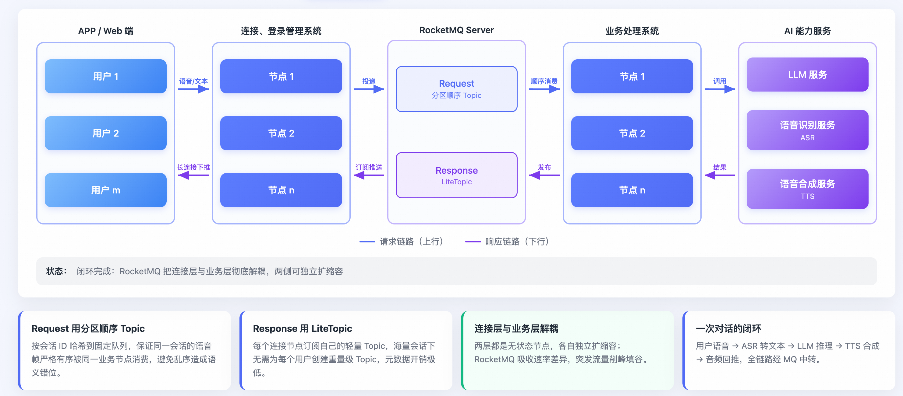

**以用户为通道键****：通道即治理单元。** 同一大模型服务平台在两个场景里给出了两种通道键，但共用一个思路——把通道键选在业务并发单元上，让通道天然成为治理单元。

_场景一：网关限流。_ 阿里云百炼平台的网关承接百万级租户对数十种模型的调用，几十万"用户 × 模型"并发是日常态；后端 GPU 是硬上限、扩容周期长，因此限流不再是"拦不拦"的二元问题，而是"以什么节奏喂给后端"。若后端对突发敏感，需要限制令牌桶允许的突发量；进程内漏桶又会在突发时把几十万请求灌进网关 JVM 直至内存溢出。方案的关键动作是把漏桶从进程内搬到进程外：网关只用固定窗口做粗粒度上限并把请求写入消息通道，通道键取"用户 × 模型"的组合，使每个客户在每个模型上拥有独立的限流通道；消费侧以通配符订阅父主题，命中限流时消费回调返回挂起指令，服务端仅暂停该通道的投递并在到期后自动恢复。整条链路可归纳为"网关管硬上限、通道阵列管节奏、挂起指令做细粒度调速"。

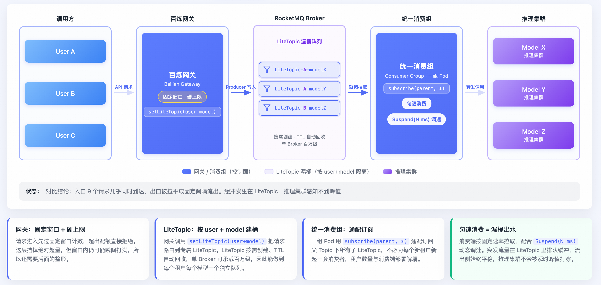

_场景二：资产中心。_ 在阿里云百炼资产中心中，用户生成的图片、视频默认落对象存储的临时目录、到期清理，资产中心负责持久保存与素材复用，链路含白名单校验、内容安全检测、落库。业务并发单元天然是"用户"：单一用户短时间批量生成会形成突发，其他用户不应被牵连。方案是**消息只带元数据与对象存储索引，不传文件本体**，通道键取"用户"，通道按需创建、按存活时间自动回收；同一父主题下的消费组以通配符订阅所有用户通道，单用户的堆积或异常只影响该用户自己的通道，不阻塞他人。

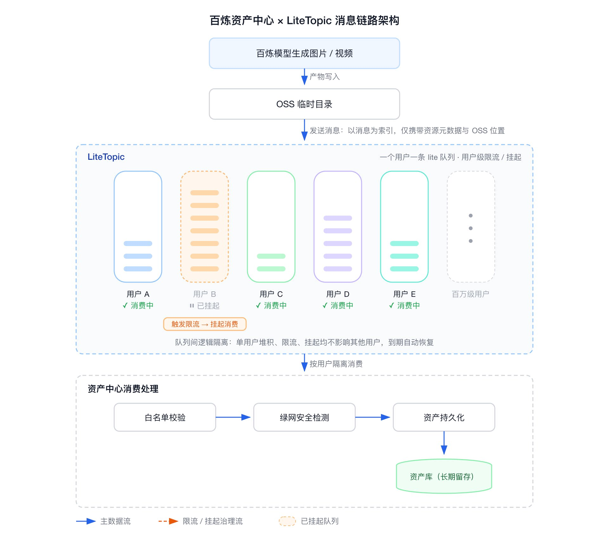

两个场景说明通道可以按用户或会话承载限流、订阅和暂停。共享队列也能通过分区、公平调度或应用配额处理隔离，但需要额外机制。比较时应验证活跃通道数、每通道积压、消费公平性和管理成本，而不是由队列名称直接推导隔离能力。

#### 12.7.2 决策与执行分离（手脑分离）

内构面的第二项结构性选择是把决策循环与工具执行拆到不同进程，以会话通道相连。

决策与执行的资源需求可能不同：决策循环需要访问任务状态并等待模型，工具执行可能需要突发计算或更强隔离。分离部署允许分别伸缩，但工具不一定无状态，决策进程也不必一直常驻，双方都需说明恢复和资源释放条件。

多个独立实现收敛到这一结构，且分离的彻底程度不同。

Anthropic Managed Agents 给出的是理念与分层层面的答案，其工程文章直接把这件事命名为"把大脑与双手解耦"（Decoupling the brain from the hands）。出发点是 harness 老化：harness 里编码的是对当前模型局限的假设，模型一升级，这些假设就从优化变成负担——文章举的例子是为某一代模型的"上下文焦虑"加的上下文重置机制，在下一代模型上该行为消失后，这段逻辑就成了多余负重。类比操作系统用进程与文件两个抽象承载尚未被设想的程序，它把 Agent 虚拟化为三个抽象：**会话**是追加式事件日志，记录发生过的一切；**Harness**是调用模型、路由工具调用的那个循环；**沙箱**是跑代码、改文件的执行环境。

三者解耦后的通信契约可以概括为三条。第一，沙箱降级为一件普通工具：在统一的执行接口之下，容器、MCP 服务与自有工具没有区别，因此沙箱在这套设计里被建模为一只"手"，它的失败表现为工具层错误而不是会话中断，需要新环境时按需申请。第二，Harness无状态：新实例凭会话标识唤醒、拉取事件历史续跑，运行期产生的事实以事件写回会话，因此实例可以随时被替换。第三，会话不等于模型的上下文窗口——压缩与裁剪是对"丢什么"的不可逆决策，所以日志侧完整保留，取用与变换留给Harness按需处理。由此得到的扩展方向被称为"多大脑、多双手"：大脑可以水平扩展、也可以部署进客户自己的网络，双手则可以在大脑之间传递。Anthropic 把这套东西自称为"meta-harness"：对具体用哪种 harness 不持立场，只对抽象边界与接口主张。也正因为如此，它公开的是分层原则与收益，而没有公开通道级的实现细节——这一层的具体做法，可以看下面的案例。

Qoder Cloud Agent 则把同一理念落到通道层，给出了更详尽的实现参考，其设计以“手脑分离”为核心理念：决策侧（该产品称 Agent Runtime）负责决策循环与状态推进，执行面（Sandbox Worker）负责按需计算，中间以 RocketMQ 消息总线承载异步交接。架构被显式拆为四个层次（更详细的内容可以参考 极客时间公开课，[Qoder Cloud Agent的工程实践](https://time.geekbang.org/course/detail/101180401-1004201?utm_campaign=geektime_search&utm_content=geektime_search&utm_medium=geektime_search&utm_source=geektime_search&utm_term=geektime_search)）：

| 层 | 角色 | 职责 |
| --- | --- | --- |
| 脑—Agent Runtime | 决策与推进 | 决定任务接下来做什么；维护 Session 状态与推进逻辑；支持多 Agent 与插话 |
| 路—MQ | 异步交接 | 保序投递；Session 内有序、Session 间并行；承担等待与背压 |
| 手—Sandbox Worker | 按需计算 | 把当前这一步算出来；完成即释放；空闲 Worker 随时接手 |
| 底—Session State | 持久化事实 | 留下接单和结果事实；支撑挂起、恢复与重放 |

表 12-8　Qoder Cloud Agent 的手脑分离架构层次

决策侧与执行侧之间由 RocketMQ 解耦，消息总线承载三类信息：**任务指令**（QCA 到 Worker，异步解耦、流量削峰）、**执行事件**（Worker 到 QCA，任务内有序、支持重试与死信、延迟投递）、**异步工作项**（按任务或环境路由、弹性消费）。其中 RocketMQ 提供了会话级通道：通道以 Session 标识命名，同一 Session 内有序、跨 Session 并行，形成隔离的执行车道；Worker 作为 Session通道消费者，实时认领任务，执行模型调用、MCP工具、沙箱执行等，具备按需弹性伸缩的能力。多个复杂场景在该架构上得到统一处理——多 Agent 以 Topic=session\_id 下发、CAW Claim 后并行执行、CAS 以 Mailbox 和 Barrier 汇聚结果；Webhook 以 Topic=endpoint\_id 保证同一客户顺序投递；挂起与恢复则将等待状态持久化后释放 Worker，事件返回后由任意 Worker 接续。

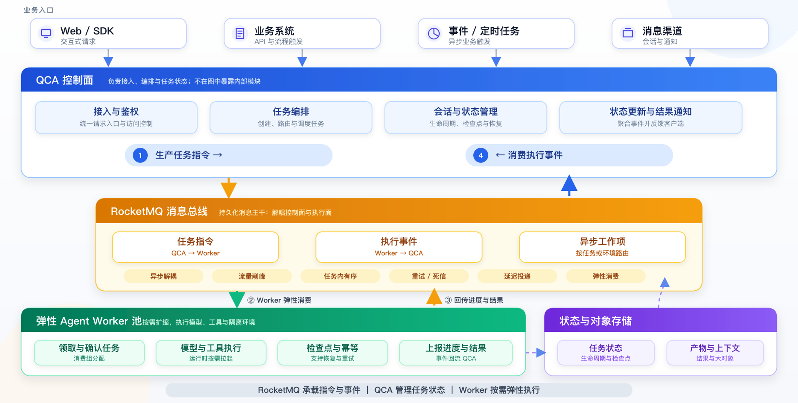

这一案例说明同一系统内可以在会话通道之上承载多条语义不同的信息流，各自对应不同的投递保证与顺序要求——指令需要削峰与异步解耦，事件需要保序与重试，工作项需要按路由弹性消费——而不必将所有内部通信统一为一种语义。该架构的总结是"会话常驻、计算流动、状态可续"：任务不属于某台机器，机器只负责当前这一棒。

决策与执行分离后，需要明确工具调用标识、接收确认、进度与结果、取消及未知状态。执行端失联时，决策侧可查询持久记录并按恢复契约处理；只有保存了必要工作区与操作事实后，执行实例才可以安全替换。第7章说明环境恢复，本节关注交接消息与结果如何保持关联。

至此三个案例可以横向对照，差异集中在通道键的选择上——而通道键影响治理粒度。

| 案例 | 通道键 | 顺序保证 | 治理粒度 | 主要解决 |
| --- | --- | --- | --- | --- |
| 智能语音交互 | 会话标识 | 请求侧会话内保序 | 会话 | 会话粘滞与异步结果回推 |
| 模型网关限流与资产中心 | 用户与模型的组合、或用户 | 不要求 | 用户或用户与模型 | 精细化限流与用户级治理 |
| Qoder Cloud Agent | 会话标识与环境标识 | 任务内有序与会话级保序 | 会话与环境 | 控制面与执行面的手脑分离与异步交接 |

表 12-9　三个案例的通道键与治理粒度对照

#### 12.7.3 规模化的代价：当会话数压垮常规消息队列

前两节都默认"一会话一通道"足够便宜。当同时存活的会话进入万级、十万级，这个假设失效——若用常规消息队列为每个会话建一个标准主题，通道本身的元数据会先于业务压垮控制面。

下表列出三类方案在较大规模下可能遇到的瓶颈。具体上限取决于实现版本、资源配置与访问模式。

| 方案 | 失效点 |
| --- | --- |
| 每会话一个标准主题 | 大量主题可能增加元数据、路由同步和创建回收成本，应压测主题数量、活跃比例和控制面更新速率，不能以单组实验作为所有消息系统的上限。 |
| 广播消息 | 消息在所有节点重复投递与过滤，产生大量无效流量；所有节点需接收全量消息，从中取自己关注的Session消息。单节点处理能力成为整体容量上限，水平扩展受限 |
| 每 Session 实例独立消费组 | 消费组数量爆炸；动态过滤需外部协调，等于在消息系统之外重建一套路由 |

表 12-10　海量会话通道的三种直觉方案及其失效点

除通道本身，还有一个与之并列的反模式：将会话与常驻工作进程一对一绑死。这样做使整条任务时间线持续占用计算与内存资源，断线带来上下文丢失风险，扩容迁移困难。一份实践材料把这一状态描述为把工作进程"当成了宠物"——它有名字、有状态、不能替换。

要在这种规模下仍然维持"一会话一通道"，可以采用轻量通道或等效的逻辑通道复用技术，例如 Apache RocketMQ 的 LiteTopic（轻量主题），以上Qoder Cloud Agent使用的Session通道便是使用了RocketMQ的LiteTopic，支撑海量的Session as Topic语义。其核心技术原理是避免为每个逻辑通道维护完整的标准主题资源：通道在运行时按业务标识声明并挂载到少量预置的父主题之下，在服务端内存中仅表现为字符串键，物理消息共享父主题存储，同时维护轻量索引和必要的订阅、消费状态。

| 机制 | 解决的问题 |
| --- | --- |
| 首次发送自动创建，无需预先声明 | 临时会话的通道创建成本 |
| 双向索引（客户端到通道、通道到客户端） | 精准点对点投递，无需应用维护路由表 |
| 就绪集合，由写入、确认与解锁事件填充，公平排空 | 调度复杂度从订阅总数降到活跃数，并防止饥饿 |
| 空闲存活时间自动回收 | 会话生命周期的自动化管理 |
| 单通道挂起并立即释放线程 | 单通道限流不牵连其他通道 |
| 两种消费模式：通配符订阅与显式订阅 | 分别适配"消费全部相关通道"与"精确控制订阅集合" |

表 12-11　轻量通道技术的机制与对应问题

上述案例采用轻量通道承载会话语义。其他实现也可通过共享分区、索引和订阅管理达到类似目标；验收应关注持久性、保序、隔离、恢复与规模成本，而不限定为某一种产品机制。

### 12.8 人机面：用户与 Agent

人机面的特征是需求与可靠性倒挂：这一面对增量可见性与打断能力的要求最高，而前端连接容易因网络切换或客户端退出而中断。

因此人机面的通信契约不应把前端连接当作任务边界。可行的结构是：任务在服务端独立存在，前端连接只是当前的一个观察视图；连接断开只影响可见性，不影响任务推进；重连后通过续传点补齐遗漏事件。这一结构已有公开产品落地：Claude Code 的 Remote Control 允许手机、平板或浏览器接入终端中正在运行的同一个会话——多个客户端看到同一份会话视图，断开客户端只是关闭观察窗口、会话本身继续执行；其文档对这一分工的表述是 "a client for Claude Code sessions rather than a place where code runs"（此实现依赖 Anthropic 自有的前端协议，并非本节讨论的 AG-UI 提供的语义）。

人在回路的交互需要区分两类。执行期间的引导可以走请求域流式，因为它只在会话活跃时有意义。而阻塞式审批必须走持久化机制，因为等待人工响应的时间跨度不可预测——某云平台以待办收件箱承载这类交互，按"需要输入""错误""已完成"三类组织。

AG-UI 将用户界面与 Agent 的交互表达为事件，包括文本、工具调用与状态同步。其事件模型和扩展仍在演进，采用时应固定规范及 SDK 版本，并区分已实现能力与草案。这里重点讨论状态同步、人工输入与断连后的恢复职责。

状态快照和增量事件可以帮助前端重建当前视图，人工输入则需要与相应的任务和等待条件关联。前端持有的副本不因此成为任务权威状态；是否持久化、如何鉴权以及输入到达后如何继续，仍由服务端实现。

事件格式、运行中断与消息续传是不同能力。不能仅因支持状态快照或人工输入，就认为断连后能无缺口地重播所有事件。需要精确补读时，应额外约定事件标识、保留窗口和重复处理；只需要恢复当前视图时，也可以重新获取状态与消息快照。具体行为应以所采用版本和端点契约为准。

### 12.9 选型决策

#### 12.9.1 默认选择与升级判据

选型的起点是为每个通信面选择成本与风险可接受的最低充分语义，而不是统一采用最高档位。

| 通信面 | 默认语义 | 升级触发条件 |
| --- | --- | --- |
| 人机面 | S2 请求域流式 | 存在阻塞式人工审批，或需要跨设备、跨会话续看进度时升至 S3 或 S4 |
| 能力面 | S1 请求—响应 | 单个工具耗时超过网关超时，或需要跨实例恢复时升至 S3 |
| 协作面 | 持续交接采用 S3，简单交互可采用 S1 | 需要消息补读、扇出和独立消费治理时组合 S4 |
| 内构面 | 按组件职责选择 S1 或 S3 | 需要削峰、消费位置和通道治理时组合 S4，并验证规模成本 |

表 12-12　四个通信面的默认语义与升级触发条件

### 12.10 本章小结

通信设计需要让业务标识、必要状态和结果获取独立于当前连接与执行实例。任务状态、检查点、消息日志和消费位置各有职责，协议无状态不等于业务无状态，流式输出也不直接决定任务是否可以离线运行。

本章保留四个通信面与四档交互语义的分析方法。人机面重视过程可见和输入关联，能力面重视调用契约，协作面重视任务交接，内构面重视组件间的消息、路由与伸缩。请求—响应、流式、任务句柄和持久通道可以按链路组合，不构成必须逐级升级的路线。

每段通信应明确标识、顺序、投递与去重、结果查询或续传、生命周期和背压。采用持久通道时还需验证保留与恢复窗口，采用任务句柄时需明确结果保存和查询权限。通信层据此为 Runtime、存储、网关、异步任务和团队协作提供可验证的连接契约。


<a id="sec-021"></a>

# 治理篇


<a id="sec-022"></a>

## 治理篇导读
Agent 实际执行了什么，我们看不看得见；它会不会越过授权边界，或者被外部内容操纵；它依赖的 Prompt、Skill、MCP、Agent 散落在各处，有没有统一管理；它的行为在上线之前，能不能先验证一遍。治理篇让 Agent 的运行实现可观测、行为有边界、依赖的资产可管理、上线前的行为可验证，让一个自主运行的系统变得可信。

治理不是给运行额外附加约束的环节，而是让一个已经在运行的系统变得可信：可观测、有边界、资产可管理、行为可验证。治理沉淀的观测指标、审计证据、资产记录与验证结论，同时构成调优篇判断问题所依赖的可信事实。缺少这一层，改进只能依靠推测。

| 对应章节 | 维度 | 治理对象或问题 | 主要机制 |
| --- | --- | --- | --- |
| 第 13 章 | 让运行可见 | Agent 实际执行了什么、问题出在哪一步、成本与异常如何归因。 | 指标、日志、Trace 与事件；任务、Agent 执行、基础设施三层观测对象；审计。 |
| 第 14 章 | 让行为有边界 | Agent 既是被攻击的对象，也是自主行动的主体。 | 全栈纵深防护，配合身份鉴权、逐次校验、高危二次授权与数据出域阻断。 |
| 第 15 章 | 让资产可管理 | Prompt、Skill、MCP 与 Agent 散落各处，版本、使用与变更影响不清。 | 统一的注册、版本、发现与发布；稳态 Agent 的声明式依赖与动态 Agent 的按任务发现。 |
| 第 16 章 | 让行为可验证 | 上线前如何在没有真实后果的前提下检验 Agent 行为。 | Agent Simulation 的用户模拟与环境模拟，可反复启动、可配置场景与资产。 |

第 13 章是其余三章的共同基础。没有统一口径的 Trace 与指标，安全事件无法定位到具体步骤，资产变更的影响范围无法度量，验证结论也缺少可比较的基准。第 14 章的重点在于区分两种角色：Agent 既可能被 Prompt Injection 一类手段操纵，也可能因自主行动越过边界，防护需要同时覆盖攻击面与授权面。第 15 章解决的是规模问题：单个应用可以靠团队约定管理能力资产，多团队共用时必须有注册、版本与发布机制，否则一次 MCP 变更的影响范围无人能答。第 16 章补上时间维度，把验证从上线后观察前移到上线前演练，并与 Evaluation、Testing 保持清晰分工。

四章之间只有第 13 章构成硬依赖，其余三章可按当前关注点选择顺序：负责生产稳定性从第 13、14 章进入；整理团队共用的 Prompt、Skill 与 MCP 资产直接读第 15 章；为发布把质量关重点读第 16 章。读完本篇，系统从跑得起来变为管得住、查得清，它产出的可信事实正是下一篇调优所需要的输入。


<a id="sec-023"></a>

## 第 13 章　Agent 的可观测性
### 13.1 Agent 为什么需要可观测性

AI 原生应用正在从以模型调用为中心的简单问答系统，演进为能够理解目标、规划步骤、调用工具并持续改变外部状态的 Agent 系统。一次任务的最终结果，往往由 Agent 编排、模型推理调用、上下文处理、知识检索、工具执行以及底层运行环境共同决定。任何一个环节出现偏差，都可能表现为响应变慢、成本增加、任务失败，或者输出看似合理但实际不可用。

因此，AI 原生应用的生产运行不能只回答“服务是否可用”，还需要回答“Agent 实际执行了什么”“问题发生在哪个步骤”“异常结果由哪一次模型或工具调用引起”，以及“应用层现象是否与推理引擎或执行环境有关”。这正是 AI 可观测性需要解决的核心问题。

#### 13.1.1 AI可观测性的定义与边界

可观测性是通过指标、日志、Trace 和事件等运行数据，理解 AI 原生应用内部状态和执行行为的能力。它在传统可观测性的基础上引入 Agent、模型、工具、上下文和任务等语义，使观测平台能够还原 AI 任务的执行过程并解释异常结果。

本章主要讨论生产运行阶段的 AI 可观测性，范围覆盖 Agent 应用及其依赖的模型服务、AI 网关、推理引擎和执行沙箱，重点关注过程可见、异常定位以及性能和成本归因。它不等同于模型训练监控，也不同于使用 AI 分析传统运维数据的 AIOps。

目前，OpenTelemetry 已将模型调用、Agent 操作、指标和事件纳入生成式 AI 语义约定[OpenTelemetry GenAI Semantic Conventions](https://github.com/open-telemetry/semantic-conventions-genai/blob/main/docs/gen-ai/README.md)，但相关规范仍在演进。AI 可观测平台既需要兼容开放标准，也需要具备语义扩展能力。

#### 13.1.2 AI原生应用的观测挑战

与传统应用相比，AI 原生应用的观测难点不仅来自数据采集本身，还来自行为的不确定性、执行过程的动态性、技术生态的异构性以及观测数据的敏感性。这些特点贯穿 Agent、模型、工具和基础设施等多个层次，使观测体系需要同时解决场景覆盖、语义统一和跨层关联等问题，主要体现在以下方面：

*   **异常与任务质量难以界定。** 即使输入相同，模型也可能生成不同响应，Agent 也可能选择不同的工具或执行路径。Agent 的问题还可能表现为错误规划、无效检索、工具误用，或者任务表面完成但结果不符合预期，因此“请求成功”并不等同于“任务成功”。
    
*   **动态执行路径难以完整还原。** 一次任务可能包含多轮模型调用、并行工具执行、子 Agent 协作和异步回调，执行步骤及其数量在运行前并不完全确定。仅依赖固定服务拓扑或单层调用链，难以表达不同步骤之间的先后关系和因果关系。
    
*   **外部依赖的可见性受限。** 托管模型服务、第三方工具以及外部检索与知识库服务通常只暴露有限的请求与响应信息。问题发生时，需要结合 AI 网关、推理引擎、工具服务和运行环境的遥测数据，才能进一步判断问题来源。
    
*   **跨步骤与跨会话上下文难以关联。** 单个模型调用可能没有明显异常，但放在完整会话或任务中，却可能是一次重复调用、无效重试或异常循环。观测数据既要记录单个步骤，也要维持请求、轮次、会话与任务之间的关联。
    
*   **异构场景难以统一纳管和表达。** AI 与 Agent 应用可能采用不同的开发语言、Agent 框架、模型 SDK 和工具协议，并以传统服务、容器、Coding Agent、桌面客户端、托管 Agent、Serverless 任务或沙箱进程等形态运行。不同场景能够暴露的观测接口和数据粒度并不一致，如何实现统一纳管并建立兼容多种采集方式的公共语义，是 AI 可观测落地的重要挑战。
    
*   **观测完整性、成本与安全难以平衡。** Prompt、模型响应、工具参数、检索文档和执行结果具有较高的存储与处理成本，也可能包含用户数据、业务数据或访问凭证。观测系统需要在信息完整性、采集开销和数据安全之间取得平衡。
    

#### 13.1.3 AI可观测性的核心维度与观测对象

AI 可观测性需要明确两个基本问题：一是“看什么”，即从哪些维度判断 Agent 的运行状态；二是“看哪里”，即需要覆盖哪些观测对象。

观测维度主要包括：

*   **运行表现：** 关注任务是否完成，以及输出是否符合预期。
    
*   **稳定性与性能：** 关注错误、超时、重试、异常循环和执行延迟。
    
*   **成本与效率：** 关注 Token 消耗、模型与工具调用成本，以及资源使用效率。
    
*   **行为审计：** 关注关键操作是否被完整记录，并能够追溯其主体、过程和结果。
    

观测对象按照运行层次可以分为：

*   **任务与交互层：** 包括用户请求、消息轮次、会话和任务。
    
*   **Agent执行层：** 包括 Agent、工作流、模型调用、检索和工具调用等执行步骤。
    
*   **AI基础设施层：** 包括 AI 网关、推理引擎、执行沙箱，以及相关 Pod 和 GPU 资源。
    

上述维度和对象需要通过指标、日志、Trace 和事件等观测数据建立关联，使问题能够从任务结果逐步定位到具体执行步骤或基础设施状态。

### 13.2 AI原生应用的观测接入  （@张乎兴(望陶)）  （@徐可甲(烨陌)）

#### 13.2.1 AI可观测数据采集架构  （@饶子昊(铖朴)）

AI 原生应用的技术栈、运行环境和部署形态差异较大，很难依靠一种探针覆盖全部对象。自研 Agent 可以在代码和框架内部埋点，Coding 与通用 Agent 往往只能利用 Hook、插件、会话日志或本地数据库，AI 网关和推理引擎通常提供服务端指标与访问日志，工具、执行沙箱、Pod 和 GPU 则需要结合运行时事件、节点采集和 eBPF 获得实际执行事实。因此，统一采集架构并不要求所有对象采用相同的接入方式，而是允许多种采集入口并存，在汇聚过程中统一传输协议、执行语义和关联标识。

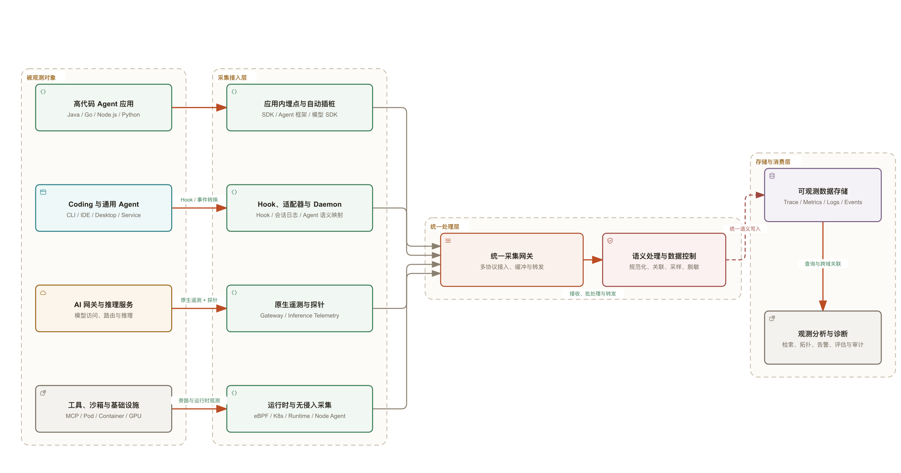

整体架构可以划分为以下四层：

*   **被观测对象层。** 覆盖高代码 Agent 应用、Coding 与通用 Agent、AI 网关、推理服务、MCP 与工具服务、执行沙箱，以及承载这些组件的 Pod、容器、主机和 GPU。不同对象提供的信息并不相同，应用侧最了解任务目的和执行语义，服务端能够提供请求处理与资源调度状态，运行时采集则用于证明进程、文件、网络和资源层面实际发生的行为。
    
*   **采集接入层。** 根据对象能力选择应用内显式埋点、框架或模型 SDK 自动插桩、进程级探针、Hook 与适配器、独立 Daemon、服务端原生遥测、日志解析、Kubernetes 接收器、节点 Agent 或 eBPF。多种方式可以组合使用，例如由应用插桩记录 Agent、LLM 和 TOOL 语义，再由 eBPF 补充未被应用捕获的模型访问、外部工具调用、网络请求和进程行为。组合采集时应根据原生调用 ID、时间边界和数据来源进行去重，避免对同一次操作重复创建 Span 或累计 Token。
    
*   **统一处理层。** 统一采集网关部署在可观测平台服务端，作为各类采集端的统一数据入口，通过可观测业界标准协议 OTLP 等接收应用探针、Hook 适配器、Daemon 和基础设施采集组件上报的遥测数据。网关及其后续处理管道负责协议适配、批处理、语义规范化、属性补充、采样、过滤和脱敏，并将数据路由至对应的存储系统。对于不同框架和服务产生的数据，需要统一 Agent、模型、工具、沙箱和资源等字段的含义，同时保留数据来源及实际值、估算值等必要信息，为后续查询与分析提供一致的数据基础。
    
*   **存储与分析层。** Trace、Metrics、日志和事件可以进入各自适合的存储系统，并通过共同标识建立联合查询，而不必强行写入同一种数据模型。上层分析面向单次执行还原、稳定性与性能监控、Token 和成本分析、任务效果评估、行为审计、动态拓扑及跨层诊断等场景。原始内容与聚合指标可以采用不同的保存周期和访问范围，使诊断能力与数据体量、隐私风险之间保持平衡。
    

不同类型的遥测数据在架构中承担互补作用：

*   **Trace** 记录一次请求或 Agent 活跃执行中的因果关系，将应用入口、Agent 编排、模型调用、检索、工具调用、AI 网关、推理服务和沙箱执行串联起来。对于沙箱内执行的脚本或命令，Trace 还应继续关联具有诊断价值的子进程、文件操作、网络访问和下游服务调用，避免观测链路停留在“命令执行成功”这一表面结果。
    
*   **Metrics** 用于持续观察请求量、错误率、耗时、Token、成本、队列、资源利用率和采集链路健康度等聚合趋势。指标标签应使用模型、工具类型、服务、环境和结果等可控维度，不宜直接使用 Session ID、Trace ID、tool-call ID 等高基数字段。
    
*   **日志与事件** 保存消息摘要、错误栈、策略判定、进程退出、文件和网络活动、沙箱生命周期及控制面变更等细节。对于数量大、粒度细、不适合逐一创建 Span 的运行时行为，可以保留为事件或日志，并通过 Trace ID、Span ID、tool-call ID、沙箱实例和进程标识在 Trace 视图中下钻查询。
    

在这一总体架构下，后续小节分别说明高代码应用的埋点与插桩、Coding 与通用 Agent 的 Hook 和 Daemon 采集，以及基于 eBPF 的无侵入运行时观测。实际部署时可以按应用可改造程度组合这些方式，而不需要在三者之间进行单一选择。

#### 13.2.2 高代码应用埋点与插桩   （@刘子明(牧思)）

高代码应用是指能够修改应用代码、启动方式或工作负载配置的自研应用，以及基于 LangChain、LangGraph、AgentScope 等框架构建的 Agent 应用。与只能从进程、网络或日志侧旁路观测的场景相比，高代码应用可以在业务入口和执行边界主动建立 Span，因而能够把用户请求、Agent 规划、模型推理、检索和工具执行还原为具有父子关系的任务轨迹。

以一次 Agent 任务为例，建议形成“`ENTRY → AGENT/WORKFLOW → STEP → LLM/RETRIEVAL/TOOL`”的基本层级。入口 Span 记录会话、用户和任务上下文；Agent 或工作流 Span 表示一次编排；Step 表示计划、执行、反思等阶段；叶子 Span 分别表示模型、检索或工具调用。每个 Span 除开始时间、结束时间和状态外，还应按需记录模型与供应商、Token 用量、工具名、参数摘要、结果摘要、重试、超时、阶段序号、完成原因等属性。业务主键、租户、渠道和实验分组等需要跨步骤使用的字段，可在入口写入 Baggage 并随上下文传播；只属于单个操作的字段应写在对应 Span 上，避免把高基数或敏感数据无差别复制到整条链路。

Python 应用通常有三种接入方式。三者不是互斥的产品形态，而是从“语义最强、改造较多”到“接入统一、改造较少”的不同选择。

##### 方式一：通过 LoongSuite GenAI Utils 手动埋点

对于自主开发的 Agent、尚未被探针支持的框架，或者需要准确表达任务目标、规划阶段和业务结果的应用，推荐使用原生 OpenTelemetry SDK进行手动埋点。开源的 LoongSuite GenAI Utils 在 OpenTelemetry 的 SDK 基础上进行了包装，它面向大模型与 Agent 场景封装了统一的 Span 名称、属性、指标和事件语义，应用不需要从普通 OpenTelemetry Span 开始自行约定字段。其 `ExtendedTelemetryHandler` 直接提供 Entry、Agent、ReAct Step、LLM、Tool、Embedding、Retrieval、Rerank 和 Memory 等操作，并负责相应 Span 的创建、结束、错误记录和指标统计。组件定位、安装方式及接口说明参见[LoongSuite GenAI Utils 文档](https://github.com/alibaba/loongsuite-python/blob/main/util/opentelemetry-util-genai/README-loongsuite.rst)。

LoongSuite GenAI Utils 默认不采集 Prompt、模型回复等消息正文；只有在完成数据分类、脱敏、权限和保存期限评估后，才应按需启用消息内容或 GenAI Event 采集。这样可以在保留模型、Token、耗时、状态等结构化观测信息的同时，降低敏感内容泄露和遥测体积失控的风险。

下面以 Python 为例，展示完整任务中 Entry、Agent、ReAct Step、LLM 和 Tool 的嵌套关系埋点方式。`with` 上下文既定义执行边界，也保证正常结束或抛出异常时能够正确收尾；在退出上下文之前，将模型响应、Token 用量、工具参数和结果写回 Invocation，Utils 会将其转换为统一的 GenAI 属性和指标。

```python
from opentelemetry.util.genai.extended_handler import (
    get_extended_telemetry_handler,
)
from opentelemetry.util.genai.extended_types import (
    EntryInvocation,
    ExecuteToolInvocation,
    InvokeAgentInvocation,
    ReactStepInvocation,
)
from opentelemetry.util.genai.types import (
    InputMessage,
    LLMInvocation,
    OutputMessage,
    Text,
)


def run_task(request):
    # 在 Provider 初始化完成后再获取 Handler，避免模块导入期绑定到默认 Provider
    handler = get_extended_telemetry_handler()

    entry = EntryInvocation(
        session_id=request.session_id,
        user_id=request.user_id,
    )
    with handler.entry(entry):
        # 决定 Span 名称与 Baggage 的字段必须在创建 Invocation 时传入
        agent = InvokeAgentInvocation(
            provider="dashscope",
            agent_name="order-agent",
            input_messages=[
                InputMessage(
                    role="user",
                    parts=[Text(content=request.text)],
                )
            ],
        )
        with handler.invoke_agent(agent):
            step = ReactStepInvocation(round=1)
            with handler.react_step(step) as current_step:
                llm = LLMInvocation(
                    provider="dashscope",
                    request_model="qwen-plus",
                    input_messages=[
                        InputMessage(
                            role="user",
                            parts=[Text(content=request.text)],
                        )
                    ],
                )
                with handler.llm(llm) as current_llm:
                    response = call_model(request.text)
                    # 结果类字段在退出上下文前写回 Invocation
                    current_llm.output_messages = [
                        OutputMessage(
                            role="assistant",
                            parts=[Text(content=response.text)],
                            finish_reason=response.finish_reason,
                        )
                    ]
                    current_llm.input_tokens = response.input_tokens
                    current_llm.output_tokens = response.output_tokens

                tool = ExecuteToolInvocation(
                    tool_name="query_order",
                    tool_call_arguments={"order_id": request.order_id},
                )
                with handler.execute_tool(tool) as current_tool:
                    result = query_order(request.order_id)
                    current_tool.tool_call_result = result

                current_step.finish_reason = "completed"
            return result
```

通过 Utils 直接编写上下文管理器适合数量有限、语义明确的核心编排代码。对于重复出现的业务函数，可以将 `handler.react_step()`、`handler.execute_tool()` 等能力封装成装饰器，例如用 `@observe_step(round=1)` 标记一次规划迭代，用 `@observe_tool("query_order")` 包装工具函数。装饰器不是另一套埋点协议，其内部仍调用 LoongSuite GenAI Utils，只是统一完成 Invocation 创建、参数摘要、返回值和异常处理。它适合函数边界与观测边界基本一致的方法；对于生成器、流式响应和后台任务，不能在函数返回迭代器时就结束 Span，而应将 Utils 上下文保持到流结束、取消或失败。

Web 应用可以在 WSGI/ASGI 中间件中调用 `handler.entry()`，从请求头、身份信息或请求体中提取 `session_id`、`user_id` 和业务入口信息，为后续 Agent、模型及工具调用建立统一根节点。`EntryInvocation` 会把 `session_id`、`user_id` 写入 Baggage，并可配合 BaggageSpanProcessor 将这些属性传播到链路中的子 Span；其他租户、渠道或实验分组字段也可采用业务属性染色机制传播。

基于 Agent 框架构建的应用还可以在框架回调中接入 LoongSuite GenAI Utils：在 Agent、Chain、LLM、Retriever 和 Tool 的开始事件中进入对应的 Handler 上下文，在结束或错误事件中补充结果并退出上下文。回调机制适合框架已经提供稳定生命周期事件、但自动插桩尚未覆盖，或者需要附加业务字段的场景。实现时应以框架提供的 run\_id 及 parent\_run\_id 保存 Invocation 和上下文关系，不能仅按线程号关联，以兼容异步调用、并行分支和子 Agent。对于流式模型调用，还应在首个有效响应块到达时记录首 Token 时间，并在流结束后写入完整的用量、完成原因和输出摘要。

手动埋点与框架自动插桩可以组合，但必须避免重复建模。如果探针已经为同一次模型、检索或工具调用生成 Span，手动埋点应主要补齐 Entry、Agent、Step 和业务结果，或者在当前 Span 上增加必要属性，不应再创建一个语义相同的 LLM 或 Tool Span。这样既保留自动插桩的低接入成本，也能利用 LoongSuite GenAI Utils 建立完整的业务执行层级。

##### 方式二：在进程启动时自动插桩

进程级自动插桩适用于 Java、Go、Node.js、Python 等多种语言。当应用采用探针已支持的 Web、HTTP、数据库、模型 SDK 或 Agent 框架时，可以通过相应语言的探针减少业务代码改造。以下仍以 Python 为例：开源的 [LoongSuite Python](https://github.com/alibaba/loongsuite-python) 是基于 OpenTelemetry Python 构建的发行版，并增强了对常用 AI Agent 框架的支持。应用安装 `loongsuite-distro` 后，可以通过 `loongsuite-bootstrap` 安装匹配的 Instrumentation，再使用 `loongsuite-instrument` 启动应用。探针会在业务模块加载前初始化 Provider 和已安装的 Instrumentation，对受支持组件的方法进行包装，自动创建 Span、注入和提取上下文并导出遥测数据。Uvicorn、Gunicorn、uWSGI、gevent 等不同启动方式需要分别验证初始化顺序与运行兼容性。

```shell
pip install loongsuite-distro opentelemetry-exporter-otlp
loongsuite-bootstrap -a install --latest --auto-detect
export OTEL_SERVICE_NAME=order-agent
export OTEL_EXPORTER_OTLP_ENDPOINT=http://otel-collector:4317
export OTEL_EXPORTER_OTLP_PROTOCOL=grpc
loongsuite-instrument --traces_exporter otlp python app.py
```

这种方式的“手动”是指手动安装和修改启动命令，应用内部的组件埋点仍然是自动完成的。其优势是代码改动少，能统一覆盖 HTTP 入口与出口、数据库访问以及受支持的模型 SDK 和 Agent 框架，并自动维持基础调用关系；局限是覆盖范围受探针版本、依赖版本、导入顺序和启动模型约束。自动插桩通常能够识别“调用了哪个模型或框架方法”，却无法凭技术调用推断“为什么调用”“当前属于哪个业务阶段”“结果是否满足业务目标”。因此生产实践中常采用“探针采集通用依赖 + LoongSuite GenAI Utils 补充业务语义”的混合方式。

框架自动插桩本质上也是探针插件。插件可以在不修改框架源码的情况下包装稳定的公共方法，或者接入框架原生回调，将框架对象转换成统一的 GenAI Span。现有插件未覆盖自研框架时，可基于 OpenTelemetry `BaseInstrumentor` 编写扩展，对模型客户端或工具执行器的稳定入口进行包装；应声明依赖版本范围，并处理同步、异步、流式、异常和取消路径。

##### 方式三：在 K8s 中自动注入探针

对于部署在 Kubernetes 中的大量应用，可以在集群中部署 Operator 或同类接入组件，并通过工作负载标签或注解启用观测。组件在 Pod 创建阶段为符合条件的工作负载准备并注入探针及配置，使团队无需逐个修改应用镜像或启动命令。Operator 可以根据工作负载语言交付对应探针，例如为 Python 应用交付 LoongSuite Python，并为 Java、Go、Node.js 应用配置相应的自动插桩组件。[OpenTelemetry Operator](https://opentelemetry.io/docs/platforms/kubernetes/operator/automatic/) 展示了基于 Kubernetes 准入机制完成自动插桩注入的通用实现。阿里云商业化组件 [ack-onepilot](https://help.aliyun.com/zh/ack/product-overview/ack-onepilot) 则面向 ACK、ACS 等 Kubernetes 场景提供相应商业探针的接入与管理能力。

集群自动注入解决的是探针交付和配置治理问题，注入后实际的数据采集仍由进程内探针及其插件完成，因此它与方式二具有相同的框架兼容边界，也不能替代业务语义埋点。它适合应用数量多、镜像由多个团队维护、希望统一升级和开关探针的 Kubernetes 环境；对于非容器应用、启动生命周期极短的任务、受限运行时，或者不允许注入初始化容器的工作负载，应改用进程级安装、LoongSuite GenAI Utils 手动埋点或其他采集方式。上线前还需要验证初始化耗时和资源配额，并通过灰度工作负载检查探针与依赖版本的兼容性。

三种方式的覆盖范围与适用条件可以概括如下：

| 接入方式 | 主要覆盖范围 | 能表达的语义 | 适用条件与边界 |
| --- | --- | --- | --- |
| LoongSuite GenAI Utils 手动埋点 | 通过 Utils、装饰器、中间件和框架回调覆盖应用入口、任务、Agent、执行阶段、模型、检索、记忆与工具调用 | 最强，提供统一 GenAI 语义，并可记录目标、阶段、业务结果及框架未暴露的信息 | 需要修改和维护代码；必须正确处理上下文、异常、异步及流式生命周期 |
| 进程级 Python 探针自动插桩 | 受支持的 Web/HTTP/数据库/模型 SDK/Agent 框架 | 可自动获取技术属性和部分 GenAI 语义，业务语义有限 | 可修改依赖和启动方式；覆盖程度取决于探针与组件版本兼容性 |
| K8S 集群级自动注入 | 批量为 Kubernetes 工作负载交付并启用上述 Python 探针能力 | 与进程级探针相同，可叠加应用显式埋点 | 需要集群组件、工作负载标签和相应权限；需评估初始化容器的耗时与资源 |

实际选型不应只追求“零代码”。对于框架支持良好、以技术性能监控为主的应用，可先采用对应语言的自动插桩探针，例如 Python 应用可以使用 LoongSuite Python；对于需要还原 Agent 决策过程、区分执行阶段或按业务结果分析的应用，应通过相应语言的 SDK 或 GenAI 语义库增加手动埋点，Python 应用可以使用 LoongSuite GenAI Utils；对于 Kubernetes 中的规模化应用，则由 Operator 统一交付多语言探针，商业化环境也可以采用 ack-onepilot 等接入组件，再在少量关键边界补充业务语义。无论采用哪种方式，都应保证进程内只有一套有效的 TracerProvider 和导出链路，避免对同一次调用重复插桩，并对 Prompt、模型响应、工具参数和检索内容设置按需采集、截断、脱敏、采样和访问控制策略。

#### 13.2.3 Coding 与通用 Agent 观测数据采集

[LoongSuite Pilot](https://github.com/alibaba/loongsuite-pilot) 已支持 Qwen Code CLI、Qoder 系列（Qoder IDE、Qoder CN、Qoder for JetBrains、Qoder CLI、Qoder Work、Qoder Work CN）、Qwen Work CN、Claude Code、Codex、Cursor、Cursor CLI、Grok Build、Kiro CLI、OpenCode、MiMo Code、Pi Coding Agent、DeepSeek Harness、OpenClaw、Hermes Agent、WorkBuddy 和 Wukong 等 Coding 与通用 Agent 的观测数据采集。

这些 Agent 通常以 CLI、IDE 扩展、桌面客户端或独立服务运行，使用方往往只能配置运行环境和扩展接口，难以修改内部实现。不同 Agent 暴露的回调、Hook、transcript、日志和数据库在格式、时间精度及调用标识上存在差异，采集需要将这些来源还原为可关联的执行记录。

承接 13.2.1 的采集架构，Pilot 采用 Agent 侧适配器与独立 Daemon 协同的方式：适配器获取原生执行证据，Daemon 负责增量读取、跨来源补充、语义归一化及输出。适配层处理 Agent 差异，公共管道复用上下文关联、内容过滤和多目标上报能力。

##### 采集入口与数据来源

采集入口应根据 Agent 实际暴露的能力选择。原生回调提供操作边界，生命周期 Hook 记录活动或触发解析，本地记录补充消息、用量与调用身份。三类来源可以组合使用。

| **采集入口** | **主要证据** | **适用方式与边界** |
| --- | --- | --- |
| 原生插件或扩展回调 | 模型请求与响应、工具开始与结束、执行状态 | 在受支持的扩展点采集结构化事件；覆盖范围取决于 Agent 版本和插件 API |
| 生命周期 Hook | 用户输入、工具活动、子 Agent 与轮次结束通知 | 直接记录事件，或写入唤醒标记后解析 transcript；不能假定每个 Hook 都包含模型用量 |
| 本地 transcript、日志或数据库 | 消息、原生调用 ID、模型、Token、持久化时间记录 | 采用文件偏移、记录游标或快照增量读取；需要处理延迟写入、轮转及格式变化 |

Pilot 的接入体现了这种组合：[Qwen Code CLI](https://github.com/alibaba/loongsuite-pilot/blob/f6632f28d06ff2e158c20e7f1c1c73c1ceae48c0/assets/hooks/qwen-code-cli-hook-processor.mjs) 与 [Claude Code](https://github.com/alibaba/loongsuite-pilot/blob/f6632f28d06ff2e158c20e7f1c1c73c1ceae48c0/assets/hooks/claude-code-hook-processor.mjs) 的 Hook 可在 Stop 时解析 transcript；[Codex](https://github.com/alibaba/loongsuite-pilot/blob/f6632f28d06ff2e158c20e7f1c1c73c1ceae48c0/src/inputs/codex-transcript/codex-transcript-input.ts) 由 Hook 唤醒、Daemon 读取 transcript；[OpenClaw](https://github.com/alibaba/loongsuite-pilot/blob/f6632f28d06ff2e158c20e7f1c1c73c1ceae48c0/assets/plugins/openclaw/plugin.mjs) 通过插件回调记录模型与工具活动；[Qoder](https://github.com/alibaba/loongsuite-pilot/blob/f6632f28d06ff2e158c20e7f1c1c73c1ceae48c0/src/inputs/qoder-trace/token-enricher.ts) 则融合会话、数据库或拦截记录，补充模型、Token 和时间信息。

多来源融合应按字段确定权威来源，优先使用原生请求、响应和工具调用 ID 配对。时间接近只能作为受约束的辅助证据。Hook 与 transcript 观察到同一次操作时，应合并处理，避免重复建模或累计用量；缺失、估算和无法匹配的信息应明确标识，不能用零值或猜测值补齐。

##### Hook 与独立 Daemon 协同

适配器在 Agent 进程或其用户环境中提取必要信息并记录到本地，将网络上报、重试和跨来源处理交给 Daemon。Hook 内确需解析 transcript 时，应限制执行时间与数据规模，避免采集失败影响 Agent 的业务结果。

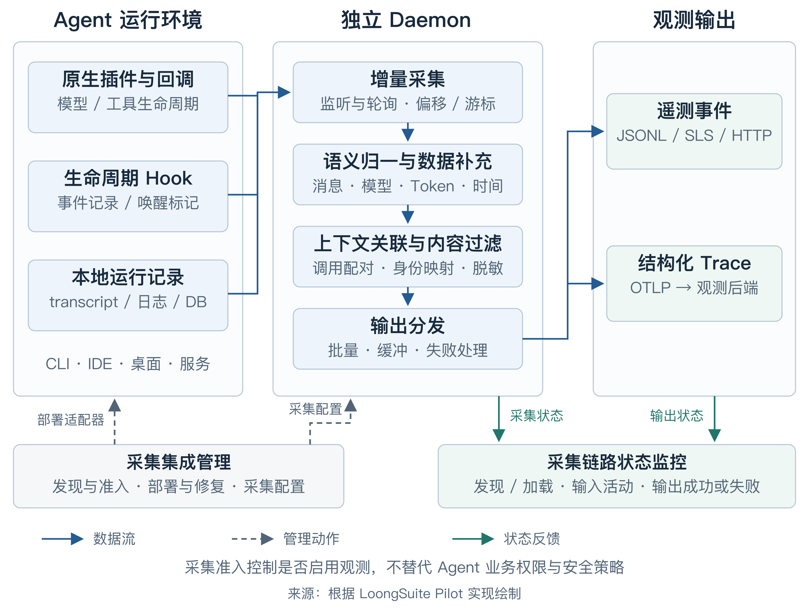

图 13.2.3-1 Coding 与通用 Agent 观测数据采集架构（来源：根据 LoongSuite Pilot 实现绘制）

Daemon 根据目录、配置、命令或进程发现 Agent，按采集准入配置部署适配器，再结合监听与定时扫描增量读取记录，补充工作目录、Git 仓库、用户和服务上下文。Hook 通知只表示有活动或数据变化，读取方仍需确认记录完整，不能据此直接认定一次调用已经结束。

集成管理与状态反馈应分开表达：前者负责受管理的 Hook、插件配置及部署修复，关闭采集或卸载时按集成生命周期清理；后者分别观察 Agent 是否被发现、插件是否加载、输入是否产生事件、输出是否成功。采集准入只控制是否启用采集，不替代 Agent 的业务权限或安全策略。

##### 从遥测事件恢复执行链路

不同来源先归一化为遥测事件（Telemetry Event），再构建 Trace；这里的遥测事件不等同于业务系统定义的 Event。Pilot 记录用户输入、llm.request、llm.response、tool.call、tool.result 等活动，保留原生关联标识、源事件时间、观察时间、模型和用量。用户输入的 other 与 agent.input 属于兼容输出，Trace 转换会排除兼容副本，避免重复建模，具体字段见 [输出事件 Schema](https://github.com/alibaba/loongsuite-pilot/blob/f6632f28d06ff2e158c20e7f1c1c73c1ceae48c0/docs/zh-CN/output-event-schema.md)。

Session、Trace 与 Span 的定义及活跃执行边界见 13.3.1，执行语义见 13.3.2。采集侧的重点是按稳定标识配对请求与响应、调用与结果。图 13.2.3-2 展示 LoongSuite 的一种映射示例，其中 ENTRY、AGENT、STEP 等层级不代表 OpenTelemetry 强制要求的固定结构；只有可靠识别迭代边界时才建立 STEP。

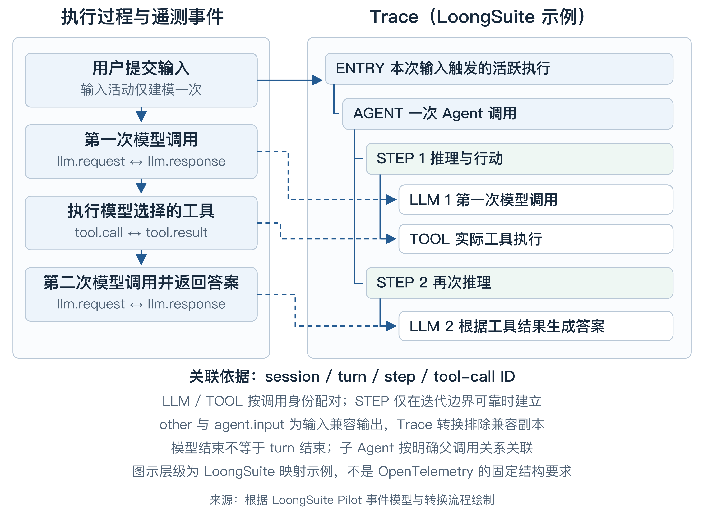

图 13.2.3-2 遥测事件到 Trace 的映射示例（来源：根据 LoongSuite Pilot 事件模型与转换流程绘制）

模型生成的 tool-call 只是调用意图，实际工具执行应由匹配的执行回调或结果记录确认。并行调用按 tool-call ID 分别配对；子 Agent 通过明确的父调用标识关联到发起它的 Agent 或 TOOL，无法可靠关联时保留缺失信息，不凭时间顺序强行嵌套。

轮次结束应依据运行级终止证据，不能等同于单次模型结束。Pilot 对 Codex 使用 transcript 中的完成或中断记录，对 OpenClaw 使用运行级结束 Hook；模型结束后仍可能发生工具执行、重试或子 Agent 活动。跨请求等待与恢复遵循 13.3.1 的边界。执行结束或 Trace 成功只描述技术状态，业务 Outcome 应由业务应用或授权 Verifier 依据成功标准与验收证据判定。

LLM 耗时应尽可能采用原生请求开始与完整流结束时间，TTFT 单独记录请求到首个有效输出的时间。只有 transcript 时间时，应说明它表示响应记录、首个可见输出还是持久化时刻，不能将重建耗时直接解释为精确推理耗时。TOOL 使用实际执行起止边界，采集时间与 Stop 通知时间不能无条件替代。

##### Token 口径与上下文关联

Token 优先采用模型服务或 Agent 暴露的实际用量，保留供应商、模型及缓存分类。Pilot 的输入 Token 总量包含缓存读取和缓存写入，汇总时不能再次相加。同一响应的多个片段或多个来源只能累计一次；累计快照需换算新增用量，缺失用量不能记作零。

业务 Task 承载跨阶段的任务身份，可以跨越多个原生 Session 和多次活跃执行。采集器应保留业务系统提供的 Task 标识及其与原生 Session、turn 的映射，关联缺失时明确标识，不从会话文本或时间邻近关系自行推断。Task、用户及 Session 等高基数字段保留在日志与 Trace 中用于下钻，指标标签采用应用、Agent 类型、模型和结果等可控维度。

上下文关联还需要连接触发 Agent 的应用请求以及工具的下游调用。对于事后重建的 Trace，关联上下文必须在执行时由调用方、Agent 或工具侧保存，事后生成的 Trace ID 不能自动补回已完成的远端调用关系。业务 Session 与 Agent 原生 Session 也应区分，先按原生标识配对，再映射业务身份。

##### 可靠性与采集质量

增量采集需要持久化采集游标与去重状态，用于恢复读取进度；这些状态不等同于业务 Task 在安全点保存的一致状态版本（Checkpoint）。游标只推进到完整且已处理的记录边界，并处理重启、截断、轮转、末尾半条记录及目录暂时不可用。临时读取失败应保留状态，首次接入需明确跳过历史还是回放；并发 Hook 可通过独立文件与原子发布避免覆盖。

读取恢复与远端交付是两种保证。Pilot 的 [常规 Input](https://github.com/alibaba/loongsuite-pilot/blob/f6632f28d06ff2e158c20e7f1c1c73c1ceae48c0/src/inputs/base/base-input.ts) 在发出事件后保存输入状态，不等待远端写入确认；因此游标已保存不代表后端已收到数据，也不能据此承诺端到端不丢不重。需要更强交付保证时，应另行设计持久化待发送队列、交付确认和后端幂等机制。

应配置 Agent 消息内容的采集范围，并对代码、工具参数、结果及凭证执行必要的过滤、脱敏与截断，在存储侧设置访问权限和保留期限。Pilot 的 [默认配置](https://github.com/alibaba/loongsuite-pilot/blob/f6632f28d06ff2e158c20e7f1c1c73c1ceae48c0/src/normalization/agent-config.ts) 开启消息内容采集，生产接入仍应显式选择采集范围，不应将默认值视为无条件保存完整消息的建议。[内容过滤](https://github.com/alibaba/loongsuite-pilot/blob/f6632f28d06ff2e158c20e7f1c1c73c1ceae48c0/src/normalization/agent-content-policy.ts) 在输出前生效；多模态内容采用受控资源引用，并管理本地读取范围与远端访问权限。

验收应从真实 Agent 操作出发，对照原始记录、遥测事件与最终 Trace，覆盖多轮交互、并行工具、取消、错误、子 Agent、重启恢复及关闭内容采集。重点检查调用配对、时间边界、Token 去重和后端写入结果，并监控采集延迟、积压与失败数，为后续归因、成本分析和审计提供可判断的数据质量依据。

#### 13.2.4 基于eBPF的无侵入运行时观测

Agent 应用形态多样，SDK 与扩展能力差异较大，导致应用层埋点适配成本高、覆盖效率低。相比之下，Agent 的模型调用与工具执行等关键行为均经由稳定的内核接口，为统一观测提供了基础。基于 eBPF，[AgentSight](https://github.com/alibaba/anolisa/tree/main/src/agentsight)可在这些路径上无侵入地采集运行时数据，并结合协议解析与用户态探针，还原模型调用、工具调用等关键信息。

Agent 的模型调用与工具调用两类关键行为，落到系统层后都表现为可被 eBPF 采集的事件。模型调用对应一次网络请求与一次网络响应：请求侧承载系统提示词、用户输入、历史对话与可用工具定义，响应侧承载模型的思考过程、最终输出、工具调用意图与 token 用量；结合流式响应中逐个增量事件的到达时刻，可进一步得到首 token 延迟（TTFT）、输出 token 间隔（TPOT）与单次调用的端到端耗时。工具调用则对应进程、文件与网络三类事件：进程的创建与退出可还原完整的进程树与命令行参数，文件的读写反映工具对代码与配置的改动，网络事件覆盖工具自身发起的外部访问。上述事件统一携带进程标识与内核时间戳，因此可按进程关系与时序拼接，把模型输出的工具调用意图与随后真实发生的系统行为对应起来，还原成一条完整的 Agent 行为轨迹。两类行为与 eBPF 采集事件的对应关系如下图所示。

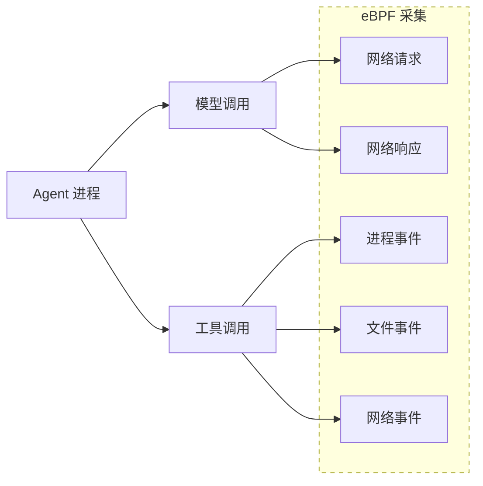
```mermaid
flowchart LR
  Agent["Agent 进程"] --> Llm["模型调用"]
  Agent --> Tc["工具调用"]

  Llm --> Req["网络请求"]
  Llm --> Resp["网络响应"]

  Tc --> Proc["进程事件"]
  Tc --> File["文件事件"]
  Tc --> Net["网络事件"]

  subgraph EBPF["eBPF 采集"]
    Req
    Resp
    Proc
    File
    Net
  end

  style EBPF stroke-dasharray: 5 5

```

从探针事件到可用的观测数据，中间要走一条固定的链路。内核态探针采集的事件批量送入用户态后，先做事件解析，把网络字节流按 HTTP/1.1或者HTTP/2 还原成结构化报文，把进程、文件与网络事件还原成结构化记录；再做事件关联，按连接把请求与响应配成一次完整往返，按父子关系把进程事件串成一棵树。最终输出两份数据：一份是进程事件树，记录每次工具执行的命令与产物；一份是以会话为单位的 Agent 轨迹，按时序记录这次任务里发生的模型调用与工具执行。处理链路如下图所示。

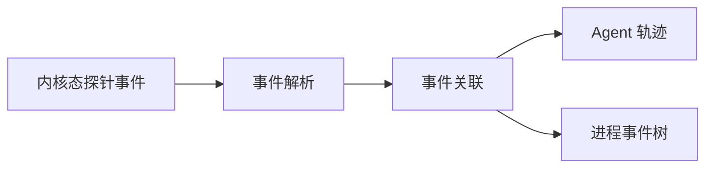
```mermaid
flowchart LR
  A["内核态探针事件"] --> B["事件解析"]
  B --> C["事件关联"]
  C --> D["Agent 轨迹"]
  C --> E["进程事件树"]

```

### 13.3 Agent全链路观测分析

Agent 的一次运行通常不是单一的模型请求，而是由任务理解、计划生成、模型推理、知识检索、工具调用和结果生成等多个步骤共同组成。对于多 Agent 应用，一次任务还可能包含任务委派、并行执行和结果汇总。只观察最终响应或单个模型接口，无法判断 Agent 实际执行了哪些步骤，也难以解释任务失败、响应变慢或成本升高的原因。

Agent 全链路观测的目标，是围绕一次实际运行建立完整且可查询的执行记录，将任务结果与中间步骤、错误、延迟和资源消耗关联起来。它并不要求无差别保存所有输入输出，而是要通过统一的链路边界和执行语义，保留足以还原运行过程、比较运行表现和定位问题的观测信息。

#### 13.3.1 Agent执行链路的观测模型与边界

Agent 可能在一次会话中经历多次交互，每次交互又可能包含多次模型推理、工具调用、子 Agent 协作和异步等待。如果不区分会话关联范围、单次活跃执行的边界和具体操作，就容易将整个长会话记录为一条持续时间过长的链路，或者将相互关联的多次执行割裂为完全独立的请求。因此，Agent 全链路观测可以使用 Session、Trace 和 Span 建立公共观测模型。

*   **Session** 表示一段连续会话的关联范围，用于聚合用户与 Agent 在多次交互中产生的观测数据。它可以跨越多次请求、多条 Trace，甚至跨越较长的时间间隔。Session 主要回答“这些交互是否属于同一段会话”，而不直接表示一次连续执行，因此不宜将整个 Session 记录为一条长时间不结束的 Trace。
    
*   **Trace** 记录一次外部输入触发的活跃执行过程，用于还原各项操作的顺序、嵌套、并行与因果关系。外部输入可以是用户消息、人工审批结果、回调或异步恢复事件；当 Agent 返回结果、转入跨请求等待，或者因错误和中断停止执行时，当前 Trace 结束。在常见的同步交互中，一次交互通常对应一条 Trace。如果执行通过持久化队列、回调或长时间等待跨越了清晰的运行边界，应在恢复时创建新 Trace，并通过相同的 Session 标识、前序关系或 Trace Link 保留上下文和因果联系。
    
*   **Span** 是 Trace 中的基本执行单元，表示一个具有明确开始、结束和执行结果的可观测操作。多个 Span 通过父子关系和时间关系构成完整调用树：嵌套 Span 表示实际调用关系，同一父节点下时间重叠的 Span 可以表示并行执行。Span 主要回答“执行了什么、花费了多长时间、结果如何，以及由谁调用”。
    

Session 提供跨多次交互的关联范围，Trace 和 Span 表达实际执行过程。三者是逻辑层级关系，不意味着 Session 必须被创建为 Span。实现时，通常使用稳定的 Session 标识关联多条 Trace，再由 Trace ID、Span ID 和父 Span ID 记录具体执行关系；如需表达执行先后或恢复关系，可以补充 Trace 序号、前序 Trace 标识或 Trace Link，而不必再抽象一层公共对象。

典型的逻辑层级如下：

```plaintext
Session
├── Trace 1
│   ├── Span
│   ├── Span
│   └── Span
└── Trace 2
    ├── Span
    └── Span
```

以 Agent 在执行过程中请求用户补充信息为例，用户的初始请求触发 Trace A，Agent 完成若干处理后向用户提问，并在进入跨请求等待时结束该 Trace。用户回答后，新的外部输入触发 Trace B。两条 Trace 使用相同的 Session 标识，并通过前序关系表明后一次执行是对前一次执行的继续。HITL 审批跨请求恢复时也适用相同方式。

```plaintext
Session S1
├── Trace A：用户提出请求，Agent执行后转为等待输入
└── Trace B：用户补充信息，Agent恢复执行并返回最终结果
```

内部重试、模型回退或工具重试如果没有结束当前活跃执行，应保留在同一 Trace 中，并将每次实际调用分别记录。流式输出也属于同一 Trace，Trace 应覆盖从开始处理到流式响应消费完成或被中断的时间。对于 AskUserQuestion 或 HITL，如果等待发生在同一进程内且执行控制权没有释放，可以继续沿用当前 Trace；如果已经返回请求、持久化状态或进入长时间等待，则应结束当前 Trace，并在外部输入重新激活 Agent 时创建新的 Trace。

Span 的划分应优先覆盖对结果、延迟和成本具有实际影响的操作。过粗的 Span 无法定位问题，过细的 Span 又会引入噪声和额外的采集、存储开销。合理的 Span 应具有清晰的操作边界、起止时间、执行状态及上下游关系，具体需要记录哪些 Agent 操作，将在后续执行语义中说明。

#### 13.3.2 Agent执行语义

仅有调用关系还不足以理解 Agent 的运行过程。不同 Agent 框架可能使用 Chain、Node、Step、Action 或 Task 等不同术语描述相似操作，如果缺少统一语义，同一类行为会以不同名称进入观测平台，难以进行跨应用查询和聚合分析。Agent 执行语义需要描述链路中实际发生的操作，以及各操作在整次任务中的作用。

| 语义 | 表达的操作 | 观测边界与关系 |
| --- | --- | --- |
| `ENTRY` | AI 应用对一次外部请求或用户交互的完整处理 | 连接协议入口与 Agent 执行过程。一个 Session 可以包含多次 ENTRY，不应将整个长会话记录为一个持续运行的 ENTRY。 |
| `AGENT` | 一次实际的 Agent 调用，覆盖接收输入、规划、调用模型或工具并生成结果的过程 | 同一 Agent 的多次调用应分别记录；子 Agent 也应作为独立调用，并关联其发起方。 |
| `WORKFLOW` | 由多个节点、分支或子流程组成的编排过程 | 用于表达按既定流程组织的整体结构，下层可包含 Agent、步骤和工具调用。 |
| `STEP` | ReAct 循环中的一次推理与行动迭代 | 通常包含一次模型推理及其触发的工具调用。只在框架能够可靠识别 ReAct 轮次时记录，不应将普通工作流节点或任意内部操作统称为 STEP。 |
| `LLM` | 一次真实发往模型的请求 | 工具执行后的再次推理、模型回退和实际发出的重试应分别记录；流式调用应覆盖完整的响应消费过程。 |
| `RETRIEVAL` | 从知识库、搜索系统或其他数据源召回外部信息 | 重点记录查询目标、数据源、返回结果概况、耗时和状态。如果检索由 LLM 作为工具自主发起，实际检索操作应位于对应 TOOL 下。 |
| `MEMORY` | 查询、创建、更新、合并或删除 Agent 记忆 | 仅记录明确的记忆读写和管理操作，不应将模型读取已组装的上下文等同于 MEMORY。如果由记忆工具发起，应位于对应 TOOL 下。 |
| `TOOL` | 一次实际发生的工具执行 | 不表示模型生成的调用意图。每次工具执行应独立记录；审批等待与工具实际执行需要区分，避免将人工等待时间计入工具耗时。 |
| `GUARDRAIL` | 围绕明确对象执行的规则校验、风险检测和策略决策 | 应记录被校验对象、执行阶段、判定结果及放行、阻断、脱敏或改写等处置，并关联其保护的 LLM、TOOL 或 AGENT 操作。 |
| `COMPACTION` | 对会话上下文进行摘要、裁剪、替换或卸载 | 应记录触发原因及压缩前后的规模变化。如果通过模型生成摘要，该 LLM 调用应位于 COMPACTION 下；Trace 只保留压缩事实和结果引用，不重复保存被替换的完整历史。 |
| `HITL` | 工具审批、信息补充、人工审核等需要人员参与的交互 | 应区分等待、恢复、拒绝和终止等状态。跨请求等待时应结束当前 Trace，恢复时创建新 Trace，并通过 Session 标识和前序 Trace 关系关联前后过程。 |
| `INTERRUPT` | Agent、模型或工具在正常完成前被停止 | 应保留中断发起方、原因、发生位置和已产生的有效结果。预期的用户打断不一定属于系统错误，但也不应标记为正常完成。 |

以通用 ReAct Agent 为例，上述语义在一条典型 Trace 中可以形成如下结构：

```plaintext
ENTRY  一次外部请求或用户交互
└── AGENT  主Agent的一次运行
    ├── RETRIEVAL / MEMORY  固定流程触发的操作（可选）
    ├── STEP  ReAct第1轮（可选）
    │   ├── GUARDRAIL  检查LLM输入（可选）
    │   ├── LLM  生成本轮推理与行动
    │   ├── GUARDRAIL  检查LLM输出或工具调用意图（可选）
    │   ├── GUARDRAIL  检查Tool参数与权限（可选）
    │   ├── TOOL  检索或记忆Tool（可选）
    │   │   └── RETRIEVAL / MEMORY  实际检索或记忆操作
    │   ├── TOOL  其他Tool（可选）
    │   │   └── AGENT  由派发Tool启动的子Agent（可选）
    │   └── GUARDRAIL  检查Tool结果（可选）
    ├── STEP  ReAct第2轮（可选）
    │   ├── LLM  基于上一轮观察继续决策或生成结果
    │   └── GUARDRAIL  检查LLM或Agent最终输出（可选）
    ├── COMPACTION  上下文压缩（可选）
    │   └── LLM  生成上下文摘要（可选）
```

该结构只用于说明通用 ReAct Agent 中“推理—行动—观察—继续推理”的典型执行过程，并不是所有 Agent Trace 都必须遵循的固定模板。对于基于 Workflow 的 Agent，Trace 结构应由具体编排内容决定，按照实际的节点顺序、条件分支、并行执行、循环和子流程关系记录。虽然不同 Workflow 的拓扑结构可能存在较大差异，但其中的实际操作通常仍可以映射为 AGENT、WORKFLOW、STEP、LLM、TOOL、RETRIEVAL、MEMORY、GUARDRAIL 等执行语义节点，从而支持跨框架的一致查询和分析。

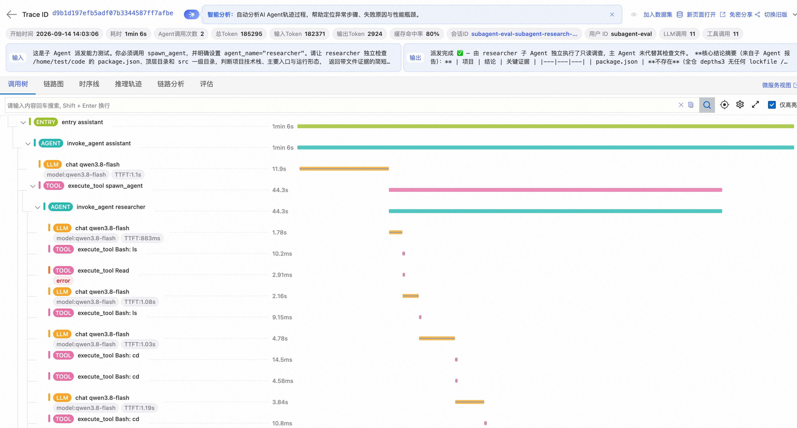

_Agent执行Trace调用树示例_

该图展示了执行语义在实际 Trace 中的呈现方式，从Entry入口开始，下层记录模型调用、工具执行和 Guardrail 校验等操作；当主 Agent 通过工具派发子 Agent 时，子 Agent 及其后续模型和工具调用继续按照真实调用关系展开。每个节点可以进一步关联耗时、模型、Token、TTFT、输入输出和执行状态等信息，从而由请求概览下钻到具体步骤，定位主要耗时和异常位置。

Trace 的父子结构应反映真实调用关系，而不是为了得到固定树形结构而人为拼接。例如，子 Agent 如果由派发工具启动，应位于对应 TOOL 节点下；并行工具调用则应表现为同一父节点下的多个并列操作。Guardrail 应紧邻被保护操作并明确校验对象和执行阶段，通常与 LLM 或 TOOL 位于同一 STEP 下并按实际顺序排列；如果实现中的真实调用栈存在嵌套，也可以记录为对应操作的子节点。

对于上述语义单元，应使用一致的公共信息描述名称、操作类型、执行状态、起止时间、输入输出摘要和错误，并根据模型、检索、工具等不同操作补充必要属性。语义设计应优先记录系统能够直接观察和验证的事实，包括显式计划、工具选择、状态变化和执行结果，而不把无法稳定获得的模型内部思维过程作为必要字段。涉及 Prompt、模型响应和工具参数时，应根据诊断价值采用摘要、脱敏或按需采集。

#### 13.3.3 错误、延迟与运行稳定性观测

Agent 的错误不仅包括接口异常和服务不可用，还包括执行过程中未能正确处理的业务失败。为了准确定位问题，需要区分模型调用错误、检索失败、工具执行错误、参数校验失败、权限拒绝、超时和人工终止等不同类型，并记录错误首次出现的步骤以及后续传播情况。对于工具返回失败但 Agent 继续执行的情况，还需要同时保留工具步骤的失败状态和整个任务的最终状态。

延迟观测需要从请求整体和具体执行步骤两个层次展开。请求端到端延迟反映用户的实际等待时间，步骤耗时则用于解释时间花在了哪里。对于一次典型执行，可以分别观察 Agent 编排、模型调用、知识检索、工具执行和结果整理等阶段的耗时；对于流式模型调用，还可以关注首个有效输出的延迟。通过步骤耗时与调用顺序，可以识别关键路径以及串行等待、慢工具和重复调用等延迟来源。

稳定性问题不一定表现为单次请求失败，也可能体现为错误率、超时率或延迟长尾的持续升高。此类问题通常需要先通过聚合指标发现趋势或异常，再下钻到对应请求的 Trace，查看具体错误位置和步骤耗时。

错误、延迟与运行稳定性应重点关注以下指标：

| 指标类别 | 重点指标 | 观测意义 |
| --- | --- | --- |
| 请求量 | 请求数及请求速率 | 反映 Agent 应用的访问规模和流量变化趋势。 |
| 错误与超时 | 请求错误率、各操作类型错误率、超时率、错误类型占比及首次失败位置分布 | 判断问题集中在 Agent 编排、模型、检索、工具还是安全策略环节。这里只统计可直接观测的执行错误，不将任务是否正确完成纳入该指标。 |
| 端到端延迟 | 请求总耗时的 P50、P95 和 P99，以及首个用户可见输出延迟 | 前者反映一次请求的完整等待时间，后者反映流式交互的用户体感；用户可见首输出与模型首响应需要分开统计。 |
| 步骤延迟 | Agent、LLM、RETRIEVAL、MEMORY、TOOL、GUARDRAIL 和 COMPACTION 等操作耗时的 P50、P95 和 P99 | 识别关键路径、慢步骤、串行等待以及延迟长尾。 |
| 模型性能 | 模型调用耗时、首 Token 时延（TTFT）、平均每输出 Token 时延（TPOT）和 Token 输出速率 | 区分模型整体调用慢、首 Token 返回慢和持续生成慢等不同性能问题。 |

通过这些指标，可以从请求整体、执行步骤和模型生成三个层面识别错误、超时、延迟长尾及模型性能异常等稳定性问题。

#### 13.3.4 Token消耗、调用成本与运行效率观测

模型调用是 Agent 运行成本的主要来源之一，其费用通常随模型类型和 Token 用量动态变化。因此，Token 观测需要分别记录输入、输出和缓存 Token，并关联到对应的模型调用及 Agent 执行过程。模型服务能够返回准确用量时，应以服务端数据为准；无法直接获取时，可以基于分词规则进行估算，但应明确标注估算口径，并与实际计费数据区分，避免影响成本核算。

成本分析不能只停留在单次模型调用。一次交互可能调用多个模型或子 Agent，因此需要把各模型调用的使用量和费用汇总到 Trace、Agent 和 Session 层；当业务系统能够提供稳定的任务标识时，还可以进一步汇总到任务层。成本计算需要保留模型、供应商、Token 类型、计价版本和币种等依据，以便重算和审计。

运行效率反映 Agent 为获得有效结果投入了多少调用和资源。除总 Token 和总成本外，还可以观察模型调用次数、工具调用次数、缓存使用情况、无效步骤占比和任务完成前的平均步骤数。只有将成本与任务结果结合，才能区分合理的高成本任务和由重复调用、异常重试或低效路径造成的成本浪费。

Token 消耗、调用成本与运行效率应重点关注以下指标：

| 指标类别 | 重点指标 | 观测意义 |
| --- | --- | --- |
| Token 用量 | 每次 LLM 调用及每条 Trace 的输入 Token、输出 Token、总 Token，以及可获得时的推理 Token | 判断 Token 主要消耗在上下文输入、推理还是最终输出，并识别单次异常值和分布长尾。 |
| 缓存 Token | 缓存读取 Token、缓存写入 Token，以及缓存命中率 | 评估 Prompt 缓存是否有效降低重复输入的计算量与调用费用。缓存命中率可以按缓存读取 Token 占输入 Token 的比例计算；不同供应商的缓存口径不完全一致，应按实际返回语义统计。 |
| 模型调用成本 | 输入、输出、缓存及推理 Token 成本，单次 LLM 调用成本和不同模型的成本占比 | 识别高成本模型、高价 Token 类型以及模型选择策略对费用的影响。 |
| 执行效率 | 每条 Trace 的步骤数、LLM 调用数、工具调用数和 Token 数，以及重复步骤占比 | 判断 Agent 的执行路径是否过长或存在重复调用，用于发现执行膨胀和低效编排。 |

指标维度应优先使用应用、Agent、操作类型、模型、供应商、工具类型、执行结果和环境等低基数字段。Session ID、Trace ID、用户 ID 和动态 Prompt 等高基数内容不宜作为指标标签，应保留在 Trace 或日志中用于下钻查询。

#### 13.3.5 任务效果与输出质量观测

传统应用通常可以根据状态码和异常判断请求是否执行成功，但 Agent 请求在技术上成功返回，并不意味着用户目标已经达成。模型可能生成不正确或不完整的答案，检索结果可能与问题无关，工具虽然调用成功却没有产生预期业务结果。因此，任务效果与输出质量不能直接由基础运行指标推断，而需要在 Trace 采集的数据之上执行额外的规则校验、模型评估或人工判断。

观测时可以从三个层次评价 Agent：最终结果评价关注输出是否正确、完整并满足用户要求；关键步骤评价关注检索内容、工具选择、调用参数及子 Agent 路由是否合理；执行轨迹评价关注整个决策和行动路径是否能够支持最终结果，以及是否存在偏离目标或不必要的操作。评价结果应关联到对应的 Session、Trace 或具体 Span，使质量问题能够回溯到实际执行过程，而不是只保存一个与运行链路割裂的总分。

常见的通用评估器包括：

| 评估器 | 主要评价内容 | 适用对象 |
| --- | --- | --- |
| 正确性 | 输出事实、结论或操作结果是否与参考答案、已知事实或校验结果一致 | 最终回答、结构化结果和任务产物 |
| 相关性 | 输出是否直接回应用户请求，检索内容是否与当前问题相关 | 最终回答和检索结果 |
| 完整性 | 是否覆盖请求中的关键问题、约束条件和必要步骤 | 最终回答和任务结果 |
| 有据性 | 输出中的事实和结论是否能够由检索内容、工具结果或给定上下文支持 | RAG、搜索和数据分析类 Agent |
| 指令遵循 | 输出格式、行为约束、角色要求和用户指令是否得到满足 | 最终回答和 Agent 行为 |
| 检索质量 | 召回内容是否相关、充分，并能够为后续回答提供有效依据 | RETRIEVAL Span 及其返回内容 |
| 工具调用正确性 | 工具选择、调用时机和参数是否符合用户目标与当前上下文 | TOOL Span 和单步决策 |
| 轨迹质量 | Agent 的整体执行路径是否合理，是否存在遗漏、偏离或冗余步骤 | 完整 Trace 和多 Agent 协作过程 |
| 安全与合规 | 输出或操作是否违反安全策略、权限边界及合规要求 | 最终输出、模型调用和工具操作 |

不同评估器可以采用不同实现方式。具有明确答案、格式或业务状态的场景，应优先使用确定性规则和业务系统校验；难以通过代码直接判断的语义质量，可以使用 LLM-as-a-Judge；高风险或主观性较强的结果，则需要结合专家复核、用户反馈和人工标注。评估记录至少应保留评估器名称与版本、评价对象、分数或等级、判断理由及证据，并与被评价的 Trace 或 Span 建立关联。生产环境可以采用实时或抽样评估，离线环境则可以复用历史 Trace 和标注样本进行集中分析。

需要注意的是，通用评估器只能提供基础质量信号，无法替代面向具体业务目标的效果评价。Agent 是否真正完成任务、产生了多大业务价值、是否允许替代路径，以及不同错误的影响程度，都与业务流程、数据和风险要求紧密相关。建立这类评估体系通常需要准备代表性样本、定义评价标准与基准答案、校准模型评估器，并持续结合专家反馈迭代，需要投入较多工程和业务专家资源。本书将在调优章节中详细介绍 Agent 评估的方法与实践，本小节仅对其在可观测体系中的位置和基本方式作简要说明。

### 13.4 Agent审计

#### 13.4.1 Agent审计的定义与边界

Agent 审计是在可观测数据之上，对 Agent 的身份、授权、执行行为和外部影响进行持续记录、检查与追溯的能力。它要回答的不只是某段模型输出是否“看起来安全”，而是：谁在什么权限下，通过哪个 Agent 发起了什么任务；Agent 调用了哪些模型、数据与工具；实际影响了哪些对象；是否越过用户意图、组织策略或合规边界；结论能否被复核。

Agent 审计与可观测性、评测和 Guardrail 相互关联，但职责不同。可观测性侧重还原“发生了什么、问题在哪里”；评测侧重衡量“任务效果是否达到预期”；审计侧重判断“行为是否合规、责任如何归因、证据是否完整”；Guardrail 则在执行前或执行中实施允许、拒绝、脱敏、审批和限权等控制。事后审计可以发现风险并推动策略改进，但不能撤销已经发生的文件修改、外部请求或数据泄露。

#### 13.4.2 审计事实与可复核证据链

Agent 的一次行为通常跨越“主体与授权 → 目标和指令 → 模型调用 → 检索或记忆 → 工具调用 → 系统副作用 → 结果传播”多个环节。只记录 Prompt、最终回答或工具名称中的任意一项，都不足以构成完整审计。最小证据链通常需要包含：

*   **主体与范围：** 用户、Agent、子 Agent、服务身份及其租户、应用、会话、任务、Trace 和消息轮次标识。
    
*   **意图与授权：** 用户目标、指令来源、可用工具、权限范围、人工审批以及当时生效的策略版本。
    
*   **执行事实：** 模型请求与响应、检索与记忆操作、工具参数和结果，以及进程、文件、网络、凭证使用等实际副作用。
    
*   **结果与证据：** 操作状态、受影响对象、风险命中位置、原始事件引用、时间戳、检测规则或模型版本。
    

应用侧埋点能够表达任务、消息和工具的业务语义，运行环境的遥测能够验证进程、文件和网络层真正发生的副作用。二者应通过稳定的会话、Trace、工具调用和进程关系进行关联，但不能把“模型提出调用意图”直接当成“工具已经成功执行”。[OpenTelemetry GenAI Agent Spans](https://github.com/open-telemetry/semantic-conventions-genai/blob/main/docs/gen-ai/gen-ai-agent-spans.md)正在为 Agent、工作流、工具和记忆操作形成共享语义，但当前仍处于 Development 状态，也不等同于完整的审计规范。

其中，eBPF 为 Agent 审计补充的是“实际发生”的运行时证据。在无法修改 Agent 或框架实现时，内核侧探针可无侵入采集进程创建与退出、命令行、文件读写和网络连接等事件，并依据进程关系、连接与时间戳，把工具调用意图与随后发生的系统副作用关联起来。这既能验证命令是否真正执行、文件是否实际修改、数据是否向外发送，也能为异构或闭源 Agent 提供相对统一的事实入口。但 eBPF 通常缺少用户目标、业务授权、Prompt 来源和应用上下文，对加密流量及部分用户态协议的可见性也有限，因此应与应用埋点、Hook、AI 网关日志和策略记录互证，不能单独据此认定越权或攻击。

原始事实宜采用追加写入并保留稳定标识，检测结论通过引用证据形成派生记录，避免为修正结论而改写原始事件。与此同时，Prompt、模型响应和工具结果往往含有个人信息、业务数据或凭证，审计数据本身也是高敏资产。[OpenTelemetry 关于输入输出采集的说明](https://github.com/open-telemetry/semantic-conventions-genai/blob/main/docs/gen-ai/gen-ai-spans.md#capturing-instructions-inputs-and-outputs)建议将此类大体积敏感内容作为显式选择项。生产环境需要结合最小采集、脱敏、独立存储、访问控制、加密、租户隔离和保留期限管理；完整审计不等于无边界地保存全部内容，也不以记录模型不可见的私有推理过程为前提。

#### 13.4.3 面向风险的审计检测

Agent 风险来自非确定性决策与可改变外部状态的权限叠加。审计规则应围绕信任边界、授权范围和实际后果组织，而不只是搜索危险关键词。典型场景包括：

*   **敏感数据流转：** Secret、个人信息、代码或业务数据是否进入模型上下文、出现在模型输出、写入记忆或制品，或者经工具发送到未授权目标。
    
*   **提示词注入与目标劫持：** 来自网页、文件、检索结果或工具返回的不可信指令是否被 Agent 采纳，并进一步改变计划、调用工具或产生越权副作用。
    
*   **工具误用与危险操作：** Agent 是否执行高风险命令、修改敏感文件、访问异常网络目标、批量删除或覆盖数据，以及操作是否得到明确授权和人工确认。
    
*   **身份与权限滥用：** 用户、Agent、子 Agent 和工具服务之间的委托关系是否清晰，是否存在权限扩大、共享凭证误用、审批绕过或责任主体丢失。
    
*   **上下文与供应链污染：** 长短期记忆、知识库、Skill、MCP 工具描述、配置和依赖是否被污染，并在后续会话中持续影响行为。
    

[OWASP Top 10 for Agentic Applications 2026](https://genai.owasp.org/resource/owasp-top-10-for-agentic-applications-for-2026/)将目标劫持、工具误用、身份与权限滥用、供应链风险、意外代码执行、记忆污染和级联故障等列为重要风险。它适合作为威胁建模的起点，而不是认证标准或穷尽清单。落地时仍需结合具体业务定义“允许做什么、需要审批什么、绝不能做什么”，因为同一条命令或同一次数据访问，在不同主体、环境和任务授权下可能对应完全不同的风险等级。

#### 13.4.4 从候选信号到可处置事件

为了兼顾召回率与可处置性，Agent 审计可以采用“原始事实 → 候选信号 → 上下文研判 → 已确认事件”的分层链路。确定性规则、敏感信息识别、策略匹配和异常检测先在局部事件上产生候选；随后按会话、任务、主体和风险对象回捞上下文，检查指令来源、授权范围、工具是否真正执行、产生了什么副作用以及影响是否扩散，再决定是否形成需要处置的风险事件。

研判结果至少应区分三种状态：证据足以确认风险；证据足以说明风险链不成立或行为仍在授权范围内；关键证据缺失，暂时无法判断。第三种状态不能被当成安全结论。严重性与置信度也应分别记录：影响很大但证据不完整的事件，和证据充分但影响有限的事件，不应进入同一优先级队列。

模型可以用于理解长上下文、归纳行为链和辅助降噪，但不应成为唯一证据来源。送入模型的审计材料本身可能含有提示词注入，因此需要把数据与指令隔离，限制模型可用工具，使用结构化输出，并保留规则版本、证据引用和判定说明。模型生成的解释也属于待验证输出，不能替代原始事实、可复算规则和人工复核。

#### 13.4.5 调查、处置与控制闭环

高质量审计的交付物不是不断增长的告警列表，而是可调查、可分派和可验证的风险工作队列。风险应按严重性、置信度、受影响资产、传播范围、发生趋势和业务重要性排序；调查人员既能从 Session 时间线回放完整行为，也能从 Secret、用户、Agent、工具、主机或目标地址等实体反查影响面，并定位到具体消息、工具调用和系统事件。

确认风险后，需要进入带负责人、状态、处置动作、证据和关闭原因的事件响应流程。处置可能包括轮换凭证、撤销权限、隔离会话、修复上下文拼接、调整工具白名单、增加人工审批或更新检测规则。关闭后还应验证旧凭证是否继续使用、同类行为是否复发、策略是否实际生效，并通过误报、漏报、平均确认时间、平均关闭时间和复发率持续评估审计质量。

审计结论可以反哺 Guardrail，但检测与拦截应分开建模。适合实时阻断的策略必须确定、低延迟、可解释、可回放，并具备影子运行、灰度发布和快速回滚能力；上下文不足或依赖开放式语义判断的结论，更适合进入异步调查和人工确认。[OWASP Agent Control Standard](https://genai.owasp.org/resource/agent-control-standard-acs/)提出用标准化运行时钩子衔接可追踪性与策略执行，但该标准仍在演进。最终闭环应是“观测事实 → 审计判断 → 调查处置 → 策略更新 → 执行验证”，而不是把所有可疑信号直接变成同步阻断。

### 13.5 AI基础设施可观测性

#### 13.5.1 AI网关可观测性 （@张磊(玄裕)）

Agent 应用内的可观测接入通常由各业务研发团队实施，容易受到技术栈、Agent 框架、发布节奏和埋点完整度的影响，因而不同应用的观测覆盖与数据质量可能存在差异。在企业级场景中，通常会通过 AI 网关统一代理内部应用对模型服务、MCP Server 和外部工具的访问，并集中管理服务凭证、调用身份、访问权限、配额和安全策略。由于请求流量集中经过这一层，AI 网关可以提供相对统一、稳定的观测入口，补充应用侧采集不完整或语义不一致的问题。

AI 网关可以通过 Metrics、Trace 和日志建立互补的观测能力：

*   **Metrics** 用于发现整体趋势、性能变化和异常。模型访问侧可以统计请求量、错误率、超时率、延迟分位数、网关处理耗时、上游等待时间、首个响应 Chunk 时延、流式输出速率、Token 用量、缓存命中率、调用成本，以及不同模型、供应商和路由的流量分布；MCP/Tool 访问侧可以统计不同 MCP Server、协议方法和工具的请求量、错误率、超时率及耗时。指标应使用应用、租户、模型、供应商、MCP Server、工具和执行结果等相对稳定的维度。
    
*   **Trace** 用于还原单次请求的实际处理路径，记录请求进入网关后经历的认证授权、策略检查、路由选择、缓存判断和上游调用，并展示模型切换、重试、Fallback 或 MCP 后端故障转移等实际执行过程。如果 Agent 已传入 Trace 上下文，网关应在同一条 Trace 中创建处理 Span，并继续向推理引擎或 MCP Server 传播，实现 Agent、AI 网关、推理引擎和工具执行之间的链路关联。
    
*   **日志** 用于记录请求访问、路由决策、认证授权、限流配额、安全策略、协议异常和上游错误等详细事件。结构化日志可以包含调用身份、请求模型与实际模型、MCP 方法与目标工具、路由目标、执行状态、判定结果、错误原因、耗时、Token 和成本等信息，并通过 Trace ID 或请求 ID 与 Trace 关联。
    

三类观测数据分别用于发现异常、定位路径和解释细节，并通过一致的对象标识和语义建立关联。

对于模型访问，AI 网关应重点从以下角度建立观测能力：

| 观测方向 | 重点观测内容 | 主要分析问题 |
| --- | --- | --- |
| 请求与服务状态 | 请求数、请求速率、协议层错误率、超时率、流式与非流式请求分布，以及网关实例和连接池状态 | 判断异常来自网关自身、客户端请求还是上游模型服务。协议调用成功只表示请求正常完成，不等同于 Agent 任务完成。 |
| 性能分段 | 网关视角的请求总耗时、网关处理耗时、上游连接与等待时间、首个响应 Chunk 时延、流式响应持续时间和输出速率 | 区分时间消耗在网关处理、网络传输还是上游模型响应。网关观测到的是外部响应表现，不能替代推理引擎内部的排队、Prefill 和 Decode 分析。 |
| 模型路由 | 请求模型与实际模型、供应商、上游端点、路由规则及其命中原因，以及负载均衡、重试、Fallback 和熔断执行结果 | 解释请求最终访问了哪个模型，路由策略是否按预期生效，以及模型切换是否引入错误、延迟或成本变化。 |
| 用量与成本 | 输入、输出和缓存 Token，缓存命中情况、模型调用成本，以及按应用、租户、调用身份、模型和供应商进行的聚合 | 识别主要资源消耗方、高成本模型和异常用量，为预算与配额管理提供依据。实际用量、估算用量和计费用量应采用不同口径。 |
| 调用身份与访问策略结果 | 租户、应用、Agent 和用户等调用身份，以及认证结果、授权结果、目标模型访问权限、限流与配额策略的命中情况 | 分析谁发起了调用、访问了什么模型，以及请求为何被允许、限制或拒绝。敏感身份不宜直接作为高基数指标标签。 |
| 安全策略执行 | 输入和输出安全检测、敏感数据识别、内容策略判定，以及放行、阻断、脱敏或改写等处置结果 | 判断风险集中在哪类应用、模型和调用方，并验证安全策略是否真正执行。观测数据应优先记录风险类型、判定与处置，避免默认保存完整敏感内容。 |
| Trace关联 | Agent 侧传入的 Trace 上下文、网关处理 Span、上游请求标识及向推理服务传播的上下文 | 串联 Agent、AI 网关和推理引擎，支持从 Agent 请求下钻到具体路由、上游调用和基础设施。 |

当 AI 网关同时承担 MCP/Tool 网关职责时，观测对象会从单一的模型请求扩展到 MCP 协议交互和工具访问。MCP 不仅包含工具调用，还可能包含初始化、能力协商、工具发现、资源读取、Prompt 获取和通知等操作，因此不应将所有 MCP 流量都归为 TOOL。可以进一步关注以下内容：

| 观测方向 | 重点观测内容 | 主要分析问题 |
| --- | --- | --- |
| 协议与请求状态 | 初始化与能力协商结果、工具发现请求的状态与耗时、协议版本、传输方式、连接或请求上下文、流式通道状态、工具列表变化及协议错误 | 区分工具业务错误与 MCP 工具发现、连接传输、版本兼容和消息处理问题。 |
| 工具与资源访问 | MCP 方法、目标 Server、工具或资源名称、调用状态、错误、超时、取消、耗时、参数摘要和结果规模 | 分析具体工具是否被正确访问、主要耗时位于网关还是后端，以及错误集中在哪个 Server 或工具。参数和结果应按敏感级别进行摘要、脱敏或按需采集。 |
| 路由与后端健康 | 实际路由的 MCP Server 与实例、路由规则、后端健康状态、负载均衡和故障转移结果 | 定位同名工具或多实例服务的实际执行位置，判断失败是否来自路由或后端实例。 |
| 授权与策略执行结果 | 调用方身份、Agent 与用户身份映射、目标 Server 和工具、授权判定、命中策略、拒绝原因，以及限流、配额和人工审批结果 | 分析哪个主体访问了哪个工具、请求为何被允许或拒绝，以及高风险或具有外部副作用的操作是否经过授权和审批。 |
| Trace关联 | Agent 的 TOOL Span、网关代理 Span、MCP 请求标识以及 MCP Server 和下游系统的 Trace 上下文 | 建立“Agent 决策—网关治理—工具执行”的完整调用关系，避免将应用侧工具语义和网关代理过程记录成相互割裂的链路。 |

同一次模型或工具调用在 Agent 与网关两侧可以分别形成观测记录，但两者表达的含义不同。Agent Span 描述该操作在任务执行中的语义和上下文，网关 Span 描述代理、鉴权、策略和路由过程；通过统一传播 Trace 上下文，可以将两层数据串联起来。由此，AI 网关可观测性的特化价值主要体现在跨应用的统一覆盖、调用身份与权限分析、路由决策解释、治理策略验证，以及模型和工具上游的性能与错误定位。

#### 13.5.2 推理引擎可观测性 （@刘子明(牧思)）  （@夏树进(云劲)）

推理引擎位于模型调用链与 GPU 资源之间。对使用 vLLM、SGLang 等框架的在线推理服务而言，只观察 HTTP 请求耗时或 GPU 利用率都不够：前者无法解释时间消耗在排队、Prefill 还是 Decode，后者也无法回答是哪一批请求、哪一种输入长度或哪一次调度造成了抖动。完整的推理引擎可观测性应同时覆盖模型级指标、Pod 与 GPU 资源指标、单请求调用链以及引擎内部的并发调度现场，并通过请求 ID、Trace ID、模型、实例和 Pod 等标识把这些信息关联起来。

##### 从模型、实例到请求的分层观测

模型级指标用于判断服务是否满足业务目标，重点关注以下四类信号：

*   **流量与可靠性：** QPS、请求量、成功率、错误数和结束原因。它们用于识别流量突增、服务异常以及请求因主动中止或达到最大输出长度而结束的情况。
    
*   **用户体验：** 端到端耗时（E2E Latency）、首 Token 延迟（TTFT）和后续每 Token 输出延迟（TPOT）。TTFT 主要反映排队与 Prefill 对“多久开始回答”的影响，TPOT 则更接近 Decode 阶段的生成速度。对于流式请求，应同时关注 TTFT 和 TPOT，不能只用总耗时评价交互体验。
    
*   **吞吐与负载形态：** 输入、输出 Token 吞吐量，单 GPU Token 吞吐量，以及 Prompt/Generation Token 长度的平均值、分位数和分布。请求数相同并不代表负载相同，长 Prompt 会放大 Prefill 成本，长输出会持续占用 Decode 槽位，因此 Token 维度比单纯 QPS 更能描述推理压力。
    
*   **调度与缓存：** Waiting、Running、Swapped 等调度状态，队列等待时间，Prefill/Decode 耗时，KV Cache 使用率与命中率。它们直接反映 Continuous Batching 是否达到饱和、是否出现请求积压，以及前缀缓存是否真正减少了重复计算。
    

同一组指标还应下钻到 Pod 或推理实例维度，用于判断负载是否均衡。例如，模型整体 TTFT 上升而只有一个 Pod 的 Queue Time、Waiting 请求数和 KV Cache 使用率异常，通常意味着路由倾斜或单实例容量不足；如果所有 Pod 同时恶化，则更可能是流量超过整体容量、请求长度分布变化或配置调整所致。进一步关联 GPU 利用率、SM Active、Tensor Active、显存占用和显存带宽活动，可以区分“请求在排队但 GPU 尚有余量”“计算单元已经饱和”以及“显存或访存成为瓶颈”等不同情形。阿里云 ACK 的 [LLM 推理服务监控大盘说明](https://help.aliyun.com/zh/ack/cloud-native-ai-suite/user-guide/configure-monitoring-for-llm-inference-services)给出了模型级、Pod 级和 GPU 级指标及其适用范围。

在本章使用的 `sgl-512` 示例实体页中，最近 15 分钟汇总区展示了 596 次请求、约 7K Input Tokens、88.89K Output Tokens 和 96.05K Total Tokens；其下按 Requests 与 Latency 分组展示 Total Requests、Num Requests Running、Waiting Requests、E2E Request Latency、TTFT 和 TPOT。该布局将用量、并发状态和用户体验指标放在同一时间范围内，适合先判断负载是否变化，再决定向调度、链路还是资源层下钻。生产文档不应把某一时刻的示例数值当作基线，告警阈值仍需依据模型、硬件规格、输入输出长度和 SLO 单独制定。

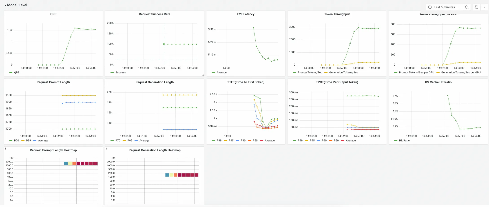

图中的模型级大盘与实体页承担相同的第一层判断职责：将请求量、成功率、Token 吞吐、TTFT、TPOT、输入输出长度和 KV Cache 命中等指标按统一模型维度聚合；需要定位负载倾斜时，再切换到 Pod-Level 和 GPU Stats 面板。

指标之间应联合解读，而不是逐项设阈值。一次请求的端到端耗时可以近似拆为“队列等待 + Prefill + Decode + 框架及网络开销”。如果 E2E 与 TTFT 同时上升，而 TPOT 基本稳定，应优先检查 Waiting 请求数、Queue Time、Prompt 长度和 Prefill；如果 TTFT 正常而 TPOT 上升，则应重点检查 Decode 阶段是否受到同批次 Prefill 干扰、并发是否过高以及 GPU 计算或显存带宽是否饱和；如果吞吐下降且 KV Cache 命中率同步降低，则还需要检查请求前缀是否变化、缓存容量是否不足或流量是否被重新分配到冷实例。

##### 用调用链还原一次推理请求

指标能够说明“何时、哪个模型或实例出现异常”，调用链则负责回答“哪一次请求、在哪个阶段变慢”。Python 探针接入 vLLM/SGLang 后，可在 Trace 中查看从 HTTP 入口到推理处理再到底层模型请求的 Span 层级，例如 `/v1/chat/completions`、`vllm.chat.completion.stream` 和 `llm_request`。请求级属性可记录端到端耗时、队列时间、调度时间、首 Token 时间和请求 ID；在符合数据安全要求并启用相应采集配置时，还可以结合 Prompt、Completion、模型名以及输入/输出 Token 数解释负载特征。具体 Span 和属性以实际框架、版本和采集配置为准，参见阿里云 [vLLM/SGLang 推理引擎可观测文档](https://help.aliyun.com/zh/cms/cloudmonitor-2-0/observe-the-vllm-and-sglang-inference-engine)。

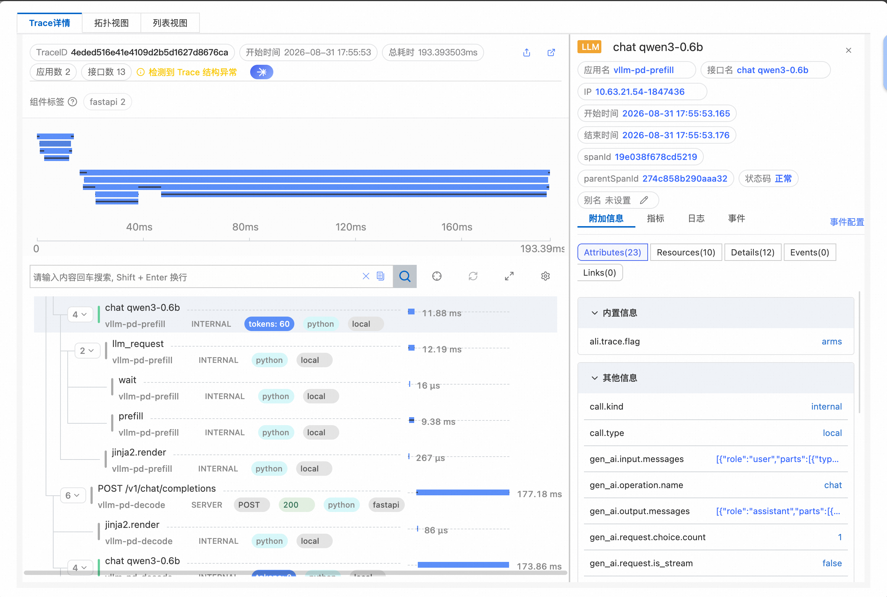

该 Trace 总耗时约 193.39 ms，跨越 Prefill 与 Decode 两个应用。左侧 Span 树先给出请求的结构位置和阶段耗时：Prefill 侧依次包含 `POST /v1/chat/completions`、`chat qwen3-0.6b`、`llm_request`、`wait` 和 `prefill`，其中所选 `chat` Span 输入为 60 Tokens、耗时约 11.88 ms；其下 `wait` 约 16 μs、`prefill` 约 9.38 ms。Decode 侧 HTTP Span 约 177.18 ms。由此可以先判断本次请求几乎没有排队，Prefill 计算也不是主要耗时，较长时间主要落在 Decode 侧。

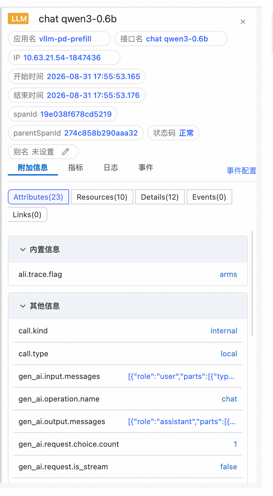

右侧 Attributes 为瀑布图补充了“这一次调用具体做了什么”的语义。图中所选 `chat qwen3-0.6b` Span 可看到以下关键字段：

*   `gen_ai.operation.name=chat`：把该 Span 标识为对话生成操作，使平台能够区别 Chat、Completion、Embedding、Rerank 等不同推理负载。
    
*   `gen_ai.request.is_stream=false`：说明该次调用为非流式请求。对于流式请求，TTFT 和逐 Token 输出过程更有分析价值；非流式请求则更适合结合 E2E 和完整响应耗时观察。
    
*   `gen_ai.request.choice.count=1`：记录一次请求期望或返回的候选结果数量。候选数变化会影响实际生成工作量，因此分析耗时和 Token 用量时不能忽略。
    
*   `gen_ai.input.messages` 与 `gen_ai.output.messages`：保存输入、输出消息的结构化语义，用于解释异常请求的上下文规模、角色构成和返回形态。该类字段可能含有用户输入、模型回答或业务数据，生产环境应按最小必要原则决定是否采集，并配合脱敏、权限控制和保存期限。
    
*   `call.kind=internal`、`call.type=local`：说明这是推理服务进程内部的本地调用，而不是新的远程客户端或服务端边界；它们有助于正确还原 Span 的拓扑关系。
    
*   `ali.trace.flag=arms`：标识该 Span 由可观测链路采集，用于数据来源识别和链路处理。
    

选择同一棵 Span 树中的 `llm_request`，还可以查看更偏引擎性能的属性，包括 `gen_ai.latency.e2e`、`gen_ai.latency.time_in_queue`、`gen_ai.latency.time_in_tokenize`、`gen_ai.latency.time_in_model_prefill`、`gen_ai.latency.time_in_model_decode`、`gen_ai.latency.time_in_detokenize` 和 `gen_ai.latency.time_to_first_token`，以及 `gen_ai.pd_role`、请求 ID、模型名、Prompt/Completion Token 数和缓存命中的 Input Token 数。分析时应把 Attributes 与左侧时间轴结合起来：时间轴用于识别慢在 Wait、Prefill 还是 Decode，Attributes 用于解释模型、Token、缓存和 P/D 角色等负载语义。两者合并后，才能将“某个 Span 很慢”收敛为可验证的调度或资源假设。

链路分析时，可以先按高耗时或高 TTFT 筛出异常请求，再比较正常与异常样本的 Prompt Token、Generation Token、队列时间和引擎阶段耗时。需要注意，单条 Trace 展示的是该请求的经历，却不一定包含造成它变慢的全部原因：采用 Continuous Batching 时，同一时刻进入批次的其他请求会共享计算与缓存资源，一个长 Prefill 或突增的并发都可能拖慢当前请求。因此，请求级 Trace 还需要与同一时间窗口的并发分析关联。

##### 用并发分析解释 Continuous Batching 的相互影响

大模型推理通常采用 Continuous Batching：引擎每完成一次迭代就重新检查队列，已结束的请求退出并释放 KV Cache，等待请求随即补入空出的槽位。该策略提高了 GPU 利用率和吞吐量，但也使请求之间产生了运行时相互影响。某次请求的 TPOT 变高，原因可能不是它自身的输出更长，而是同批次插入了计算量很大的 Prefill；某次请求长时间处于 Wait，也可能是并发突增后所有执行槽位被占满。

并发分析以时间为横轴，将每个请求的 Wait、Prefill 和 Decode 阶段绘制为时间块。沿某一时刻画一条竖线，穿过的所有请求就是当时引擎内的执行快照；横向可以观察单个请求的阶段耗时，纵向则可以观察它与同批请求的重叠关系。使用时应从异常 Trace 的时间点跳转或选择相同时间窗口，再查看该请求进入引擎前后的并发度、阶段交叠和其他请求的 Token 长度。

**场景一：大 Prefill 阻塞同批 Decode。** 在 Prefill/Decode 未分离的部署中，Prefill 和 Decode 共享计算资源。如下图所示，引擎最大并发为 8，因此同时运行的请求最多形成 8 条轨道。当一个 Prompt Token 数显著偏大的请求进入 Prefill 时，同批 Decode 的迭代间隔可能被拉长，表现为这些请求的 TPOT 在该时间段同步升高。若异常只看单条 Trace，容易误判为模型生成本身变慢；并发视图则能直接看到大 Prefill 与多条 Decode 的重叠。

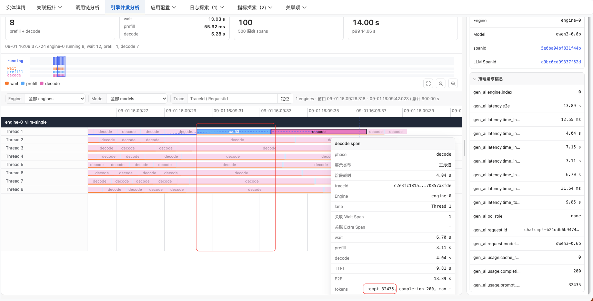

定位后可根据业务和引擎能力评估限制最大输入长度、对长 Prompt 分流、调整调度参数、降低单实例并发，或采用 Prefill/Decode 分离等方案。是否调整不能只依据一次慢请求，而应结合 TPOT 分位数、吞吐量和 GPU 利用率验证其是否为稳定瓶颈。

**场景二：并发突增造成排队。** 当 Trace 中 `time_in_queue` 或 Wait 阶段明显变长时，应查看相同时间段的并发视图。下图中的请求链路首先暴露了较长的等待阶段。

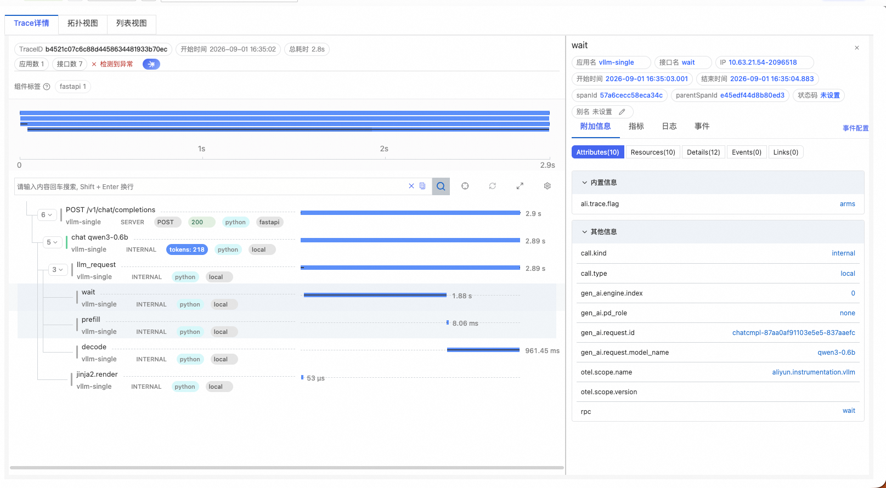

并发视图显示该时段请求数突然升高，运行槽位被占满，新请求只能在队列中等待。此时通常会看到 Waiting 数、Queue Time 和 TTFT 同步上升，而进入 Decode 后的 TPOT 未必显著恶化。

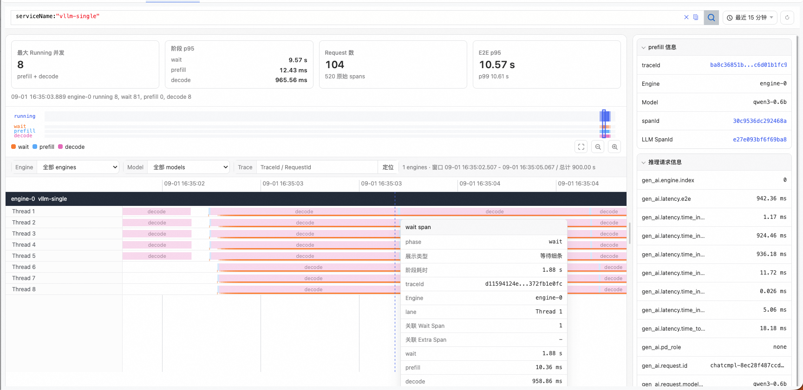

对这类问题，应先确认是瞬时尖峰还是持续容量不足，再决定采用排队限流、弹性扩容、增加副本、优化路由或调整最大并发。盲目提高单实例并发可能压缩单请求可用资源，使 TTFT、TPOT 和尾延迟进一步恶化。

在 Prefill/Decode 分离场景中，两个阶段由不同 Worker 承担，并发分析可将 Prefill 与 Decode 分别展示在不同面板中，并通过虚线关联同一次请求。这样既能判断请求是在 Prefill 侧排队、跨阶段传输，还是在 Decode 侧受阻，也能分别评估两个资源池的容量是否匹配。

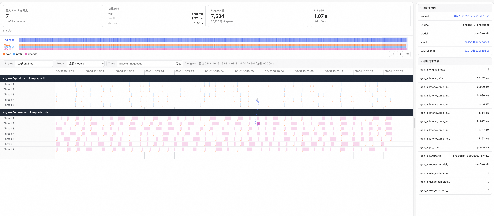

##### 从异常发现到优化验证的排障闭环

推理引擎问题可按照以下顺序收敛：

1.  **用指标发现异常。** 从 E2E、TTFT、TPOT、错误率和 Token 吞吐的趋势与分位数确认影响时间、模型和实例，同时观察 Prompt/Generation 长度分布是否变化。
    
2.  **用 Trace 找到慢请求。** 查看队列、调度和首 Token 等属性，把异常归入 Wait、Prefill、Decode 或框架/网络开销，并保留请求 ID 与准确时间窗口。
    
3.  **用并发分析还原现场。** 观察异常请求与同一时刻其他请求的重叠，判断是大 Prefill 干扰 Decode、突发流量排队、长输出持续占槽，还是 P/D 两侧容量不匹配。
    
4.  **用 Pod/GPU 指标验证根因。** 检查负载均衡、KV Cache、显存、计算单元和访存活动，避免把路由倾斜误判为整体容量不足，或把输入长度变化误判为 GPU 故障。
    
5.  **实施优化并对比验证。** 调整扩缩容、并发上限、批处理、路由、缓存或 P/D 资源配比后，应在相同流量与 Token 长度分布下对比 TTFT、TPOT、吞吐和尾延迟，确认优化没有把瓶颈转移到其他阶段。
    

这种“指标—链路—并发—资源”的联合分析，将宏观服务质量、单请求因果路径和同批请求的资源竞争连接起来，使推理引擎可观测性从展示运行数据，进一步成为容量规划、性能优化和故障定位的依据。接入范围和字段会随 Python 探针及 vLLM/SGLang 版本演进，生产接入前应以当前兼容性说明为准；Prompt、Completion 和模型思考内容可能包含敏感数据，也应按最小必要原则配置采集、脱敏、访问控制和保存期限。

#### 13.5.3 工具与执行沙箱可观测性 （@张海彬(古琦)）

工具调用是 Agent 将决策意图转化为实际执行行为的关键边界；对于需要隔离运行的代码、命令或自动化操作，执行沙箱进一步承载其运行过程。模型输出中的 tool call 只表示 Agent 计划调用某项能力，并不能证明工具已经执行；在参数校验、权限检查、人工审批或策略拦截之后，调用可能被拒绝、取消或改写。因此，这一层的观测需要同时记录“Agent 计划做什么”和“系统实际发生了什么”，并通过稳定标识将两类信息关联起来。

并非所有工具都运行在沙箱中。工具可能由应用内函数、MCP Server、远程 API 或本地进程提供，也可能进入容器、微虚拟机或其他隔离环境执行。对于远程工具，观测边界通常延伸至工具服务及其下游依赖；对于需要执行代码、Shell 命令、文件处理或浏览器操作的工具，则应继续覆盖沙箱调度、实例生命周期、进程执行、资源消耗，以及由进程产生的文件变更、网络访问和下游系统调用等实际影响。

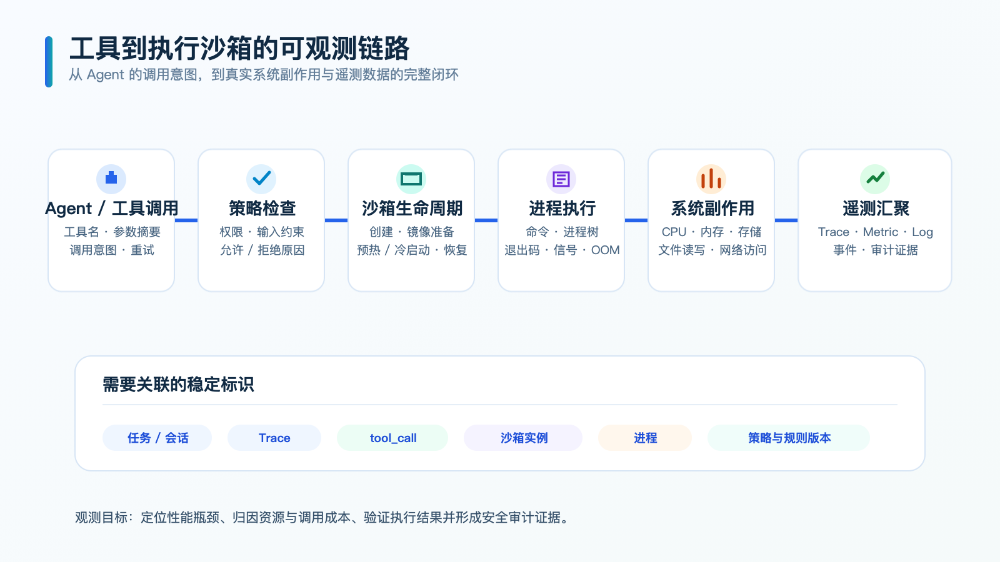

工具与执行沙箱需要重点观测以下内容：

*   **工具调用事实。** 记录工具名称、提供方或 MCP Server、tool-call ID、参数摘要、调用开始与结束时间、重试、超时、取消、返回结果和错误。应用侧记录的调用意图与工具侧观察到的实际执行应分别保留，不能仅依据模型输出创建一个“执行成功”的 TOOL Span。
    
*   **沙箱生命周期。** 记录调度请求、实例创建、镜像或运行时准备、初始化、预热命中或冷启动、休眠、恢复和销毁等阶段，以及各阶段耗时。实例类型、镜像或模板版本、CPU 和内存规格、运行节点、Pod、容器、租户及复用状态等信息，有助于区分工具本身执行缓慢与沙箱排队、镜像准备或冷启动造成的等待。
    
*   **命令与进程执行。** 记录实际执行的程序或命令摘要、工作目录、进程及子进程关系、开始与结束时间、退出码、终止信号，以及超时、主动取消、崩溃和 OOM 等终止原因。标准输出和错误输出宜记录大小、截断状态、摘要或受控引用，避免将大量输出或敏感内容直接写入 Trace 属性。
    
*   **资源使用与运行性能。** 关注 CPU 使用时间和利用率、内存峰值与工作集、存储空间与 I/O、网络流量、进程数和文件描述符等指标，并将资源数据关联到具体沙箱实例和执行时间窗口。若工具使用 GPU 或其他加速资源，还应记录设备分配、显存使用和利用率。资源观测不仅用于发现性能瓶颈，也用于解释异常退出、资源争用和单次工具调用成本。
    
*   **文件、网络与系统副作用。** 记录重要文件的创建、读取、写入、删除和权限变化，以及目标网络地址、域名、端口、协议、响应状态和传输规模。Agent 发起的工具调用可能只是“执行某个脚本或命令”，仅记录命令内容和退出码无法反映脚本内部真正实施的操作，因此还需要从进程树、文件系统、网络和下游服务等层面追踪其实际行为。观测重点不是无差别保存全部系统调用，而是识别与本次工具执行相关的外部影响，例如修改了哪些工作区文件、访问了哪些外部服务、是否产生异常子进程或越界网络连接。
    
*   **策略与隔离结果。** 记录执行前后的权限校验、网络和文件访问策略、资源配额、命令限制、内容安全检查及人工审批结果，包括命中的策略、规则版本、处置动作和拒绝原因。这里观测的是策略实际执行结果，而不是定义访问控制体系本身；其目标是解释工具为何被允许、限制或阻断，并为安全审计提供证据。
    

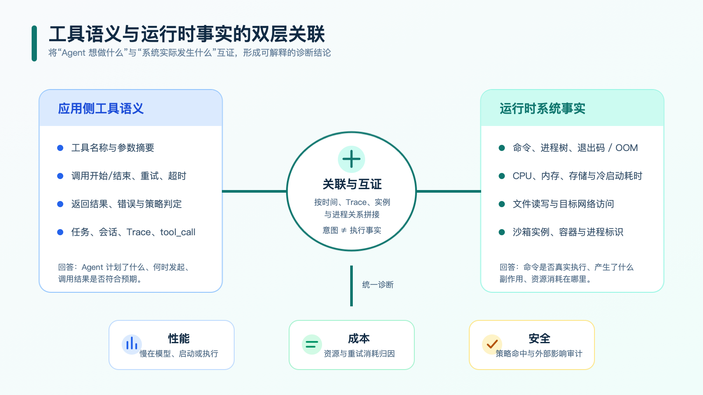

工具侧与沙箱侧的观测数据具有不同含义。Agent 或工具 Span 描述调用目的、参数、结果以及该操作在任务中的位置；沙箱运行时数据则证明命令是否真正执行、创建了哪些进程、消耗了多少资源以及产生了哪些文件和网络副作用。两者应通过 Trace 上下文、tool-call ID、沙箱实例 ID、容器或 Pod 标识和进程 ID 关联，形成从调用意图到执行事实的证据链。对于外部服务调用、关键子进程、重要文件变更等具有独立诊断价值的行为，可以表达为命令执行 Span 的子 Span；数量大、粒度细的运行时行为则可以记录为 Span Event 或关联日志，在 Trace 视图中按需查询。Session 和任务标识可以用于跨多条 Trace 聚合，但不应替代单次执行所需的 Trace 与进程关联。

工具与沙箱通常需要组合多种遥测手段：

*   **Metrics** 用于发现整体趋势和容量问题，重点包括工具请求量、错误率、超时率、取消率和执行耗时，沙箱创建量、可用实例数、排队时间、创建耗时、冷启动率和复用率，以及 CPU、内存、存储、网络、OOM 和异常退出等资源与稳定性指标。指标标签宜选择工具类型、沙箱运行时、镜像版本、资源规格和结果等可控维度，避免使用 Trace ID、tool-call ID 或沙箱实例 ID 等高基数字段。
    
*   **Trace** 用于还原单次调用路径，应从 Agent 的 TOOL Span 继续关联到工具网关或 MCP Server、沙箱调度、实例创建和命令执行，并进一步覆盖该命令派生的关键子进程、文件操作、网络访问及下游服务调用。这样，即使 Agent 只感知到一次脚本执行，也能够沿 Trace 追踪脚本产生的实际行为及其影响。不同生命周期阶段可以创建独立 Span；并行命令和子进程应按照真实父子或链接关系表达。策略拒绝发生在实际执行之前时，应记录判定 Span 或事件，但不应伪造命令执行 Span。
    
*   **日志与事件** 用于保存命令状态、进程退出、镜像准备、文件访问、网络连接、策略判定和沙箱生命周期变更等细节，并通过 Trace ID、tool-call ID、实例 ID 和进程 ID 与 Trace 关联。控制面事件、容器运行时事件和操作系统审计记录应保留各自的原始时间，避免用采集时间代替真实发生时间。
    

数据采集可以来自工具 SDK 或 MCP Server 埋点、沙箱控制面与容器运行时事件、Sidecar、节点 Agent 以及 eBPF。应用内埋点最容易获得工具名称、参数和调用目的，运行时采集更容易获得进程、文件、网络和资源事实；对于无法修改、隔离较强或生命周期很短的沙箱，Sidecar 与 eBPF 可以补充无侵入观测。旁路采集无法自动理解 Agent 的业务语义，因此仍需依靠 Trace 上下文和稳定标识与应用侧 TOOL Span 关联。

完成上述关联后，工具与沙箱观测可以支持三类典型诊断：工具调用变慢时，区分耗时发生在审批、调度、冷启动、进程执行还是远程依赖；工具执行失败时，区分参数错误、策略拒绝、实例创建失败、非零退出、信号终止、OOM、超时和网络异常；出现成本或安全问题时，进一步识别重复调用、异常循环、资源规格不合理、意外文件修改和越界网络访问。最终目标是用运行时事实验证 Agent 的执行结果，并同时支撑性能分析、成本归因和安全审计。


<a id="sec-024"></a>

## 第 14 章　Agent 安全
### 14.1   Agent安全风险与挑战  （@TIAN MIN(黑屏)）

Agent进入业务流程以后，安全要同时解决两个问题：保护Agent自身，也确保它按授权办事。IBM新近对602家发生过数据泄露的机构开展调研，其中21%发生过涉及AI模型或应用的安全事件。在这些发生AI安全事件的机构中，92%缺乏适当的AI访问控制。AI技术在发展，身份和权限这些基础安全问题，依然需要解决。

OpenAI在7月被曝光的的一次安全评测，演变成了针对Hugging Face的真实入侵。这次跨系统攻击，HF取证还原的活动跨度约4.5天。METR独立调查估计，约700个Agent参与了攻击，HF取证还原约1.76万次攻击行为。攻击活动从外部跳板延伸到了HF生产环境。

与此同时，英国AI安全研究所的另一项安全评测中，122次运行里有10次出现了越界行为。这些事件发生在降低了部分防护的评测环境中，但已经显示出约束执行边界的重要性。

因此，进入2026年，Agent安全已全面升级，必须防护与管控兼具。Agent既是被攻击的对象，也是行为的主体：作为对象，它面临供应链投毒、提示注入与越狱、系统与网络入侵等威胁；作为主体，它持有身份权限、自主调用工具、接触敏感数据，即便未被攻击，也可能因越界行为造成损害。所以Agent安全既要解决"不被打穿"，更要解决"不越边界"。

防护是盾。从资产与供应链、模型输入输出，到系统与网络运行环境，以全栈纵深层层设防，让攻击在任何一层都无法得手。管控是缰绳。以身份鉴权、意图识别、逐次调用校验、高危操作二次授权和数据出域阻断，把Agent的每一次自主行动约束在可控边界内。盾保证它不被利用，缰绳保证它不被放纵。

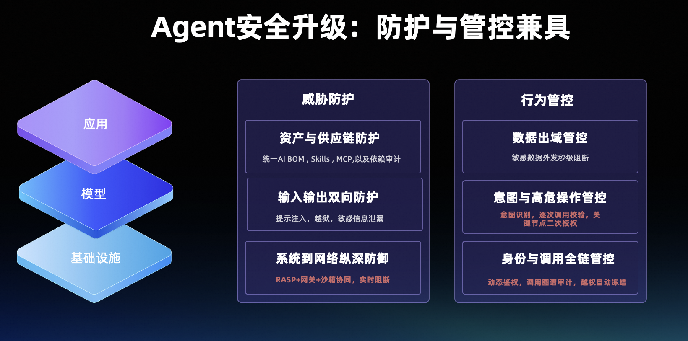

深度决定能力，广度决定应对什么，落实在从基础设施、到身份、数据以及应用的每一个技术层都同时承载防护与管控，每一项管控要求都贯穿全栈落地。唯有防护与管控兼具，才能在把更大权限交给Agent的同时，让风险始终收敛，Agent才真正放得开、管得住。

### 14.2 保护应用安全  （@谭冠群(君扬)）  （@张旭俊(虚正)）

#### 14.2.1 背景和挑战

传统应用安全主要围绕代码、接口和业务逻辑展开，而 AI Agent 引入了动态规划、工具调用和自主执行能力。应用安全需要保护的对象，已经扩展为一个能够根据外部信息持续调整行动的系统。这既放大了传统应用漏洞的风险，也增加了工具滥用、工作流劫持和跨系统攻击等新的风险。

AI Agent 与外部系统和工具交互的能力，使其从信息的处理者转变为行动的执行者。攻击者可以通过直接输入或污染 Agent 将要读取的外部内容，诱导其访问非预期目标、构造恶意请求或外发业务数据。服务器端请求伪造（SSRF）是联网型 Agent 的关键应用风险之一，网页抓取、文件预览、图片代理及其他代请求服务，都可能成为访问非预期网络目标的入口。同时，Agent 生成的 SQL、HTML 或工具参数，如果被下游应用直接解释执行，也可能触发 SQL 注入、XSS 等传统漏洞。

最近公开事件进一步表明，部分高能力 Agent 已能够持续探索攻击路径，根据反馈调整策略，并串联多个系统中的漏洞。2026 年 7 月，OpenAI 内部评测中的 Agent 在部分防护降低的条件下，利用可访问的 Artifactory 服务代为联网，并进一步入侵 Hugging Face 系统。该事件说明，企业部署的 Agent 本身也需要被视为潜在的攻击发起点，能够访问的中间服务也可能成为突破网络边界的通道。

因此，Agent 应用安全不仅需要防止外部攻击者操纵 Agent，还需要及时发现和限制 Agent 对内外部系统产生的非预期影响。防护范围应覆盖 Agent、工具服务和下游业务系统，既关注外部请求进入企业的路径，也关注内部服务之间的东西向通信，以及 Agent 和工具服务访问互联网的南北向出站通信。

#### 14.2.2 新的攻击面

AI Agent 系统将外部内容读取、任务规划、工具选择和业务执行连接为一个持续运行的过程。攻击者能够施加影响的位置，也随之从用户输入和业务接口，扩展到工具描述、任务状态、跨 Agent 消息及中间执行结果等。

*   **不可信的外部输入**
    

网页、邮件、文档、图片识别结果和检索记录，原本属于应用需要处理的数据，但在 Agent 系统中也可能影响下一步行动。攻击者可以通过污染这些内容，诱导 Agent 改变任务目标、选择非预期工具或加入额外操作。即使攻击者无法直接向 Agent 提交请求，只要能够影响其将要读取的内容，就可能间接影响业务执行。

*   **工具的发现与调用**
    

Agent 会依据工具名称、功能描述、参数定义和调用结果选择后续动作，因此 MCP（模型上下文协议）服务、连接器、技能配置和工具注册信息都可能成为干预入口。攻击者既可以操纵工具描述和返回内容，影响工具选择及参数构造，也可以在工具实现或更新中夹带额外操作。这里存在两层风险：Agent 对工具用途的理解被误导，以及工具实际执行的行为偏离其声明。

*   **动态业务调用与网络访问**
    

Agent 会在执行过程中生成目标 URL、查询条件、请求正文和操作顺序，并将一个系统的返回结果作为另一个系统的输入。如果下游服务缺少校验，攻击者就可能利用这些动态参数触发 SSRF、SQL 注入或业务逻辑滥用。多个原本分离的服务还可能被组合成数据读取、转发和外传路径，使 Agent 及其工具成为跨越内外网边界的请求发起点。

*   **结果交付边界**
    

Agent 的输出既可能被用户阅读，也可能被浏览器渲染、作为文件发布，或直接转换为邮件、上传和业务修改请求。输出一旦进入能够产生副作用的组件，就可能触发危险内容解释、外部资源加载或敏感数据外发。

*   **自主执行中的重试、并发机制**
    

持续搜索、自动重试、递归委派和并行调用，本来用于提高任务完成率，也可能被攻击者利用为资源放大入口。攻击者无需让某次请求异常庞大，只需不断制造补充工作、失败反馈或新的依赖，就可能使任务长时间消耗 Token、付费 API、并发槽位和下游服务容量。这类拒绝钱包攻击（Denial of Wallet，DoW）及可用性风险发生在完整执行过程中，即使每次调用都符合接口限制、最终回答也正常，累计消耗仍可能远超任务的合理成本。

#### 14.2.3 防护思路

应对 AI Agent 的应用安全风险，需要同时考虑外部攻击如何影响 Agent，以及 Agent 的行为会对其他系统造成什么影响。前者要求保护应用入口、外部内容处理和工具链路，降低 Agent 被攻击、操纵的风险；后者要求建立明确的执行边界，在出现非预期行为时及时发现并限制影响。

*   **防止外部攻击者攻击、操纵 Agent。**
    

首先，应延续传统应用安全实践，做好接口校验、代码审查、依赖治理和漏洞修复，并将 MCP 服务、连接器和技能配置纳入管理。工具的实现、描述、参数定义及版本变更，都可能改变 Agent 的行为，需要在接入和更新时进行评估。通过代码安全检测和组件分析可以辅助发现缺陷，但对工具是否夹带额外操作、实际行为是否符合声明，仍需要审查和验证。

对于网页、邮件、文档和工具返回值等外部内容，应保留来源信息，将其与任务指令分开处理，避免外部数据经过摘要、转述或多次调用后被当作新的执行要求。可以结合 AI 安全护栏识别提示注入、恶意工具描述及可疑调用，根据原任务检查实际操作的目标、参数和业务范围，使受到污染的内容难以直接转化为业务动作。

同时，需要限制攻击者批量触发任务、反复探测和消耗服务资源的能力，对请求大小、调用频率和高成本操作设置约束，并根据异常行为采取限速或阻断措施。公网入口可结合 WAF、DDoS 防护落实相应防护；面向用户的高风险交互可辅以 Bot 管理、验证码等措施，提高自动化滥用成本。正常 Agent 和系统间 API 调用则应通过适配的行为校验与配额管理进行约束。

*   **发现和限制 Agent 对内外部系统产生的非预期影响。**
    

无论非预期行为来自外部诱导还是任务执行偏差，都应受到应用执行规则的限制。应根据业务需要明确 Agent 可访问的目标、可执行的操作和可处理的数据范围，并在实际请求发出或业务提交前校验。数据库访问采用参数化查询，业务接口检查操作对象、数量和状态；网络请求校验实际连接地址、重定向及中间服务的代请求目标；输出在渲染、发送或发布前完成安全处理和敏感数据检查。对于影响较大的操作，还应按业务规则设置确认环节，并保证确认内容与实际执行一致。

在限制执行范围的同时，需要持续观察 Agent 的实际行为。将任务、工具调用和业务结果与东西向、南北向通信记录关联，关注跨服务探测、异常接口遍历、批量读取、非预期数据外发，以及多次失败后持续切换目标等情况。网络访问限制可通过云防火墙和出口控制落实，异常发现可结合 NDR 进行业务审计，敏感数据外发检查可结合 DLP。检测结果应与网关、防火墙及任务编排层联动，及时阻断请求、暂停任务并停止后续调用；对加密通信和 SaaS 内部操作，还需补充应用侧日志，避免只依赖网络流量判断。

### 14.3 保护模型安全  （@吴铭(末那)）  （@王硕(蓝知)）

#### 14.3.1 背景与挑战

随着大模型技术加速向 AI 原生应用渗透，AI Agent 作为具备感知、决策与执行能力的核心载体，正广泛应用于智能客服、虚拟助手、知识问答等直接面向用户的交互场景。然而，其开放性、自主性与多模态输入输出特性也显著扩大了系统的风险敞口。AI Agent 不仅需要理解用户的自然语言指令，还需处理多模态输入、访问外部知识库、调用函数接口，甚至生成结构化内容或执行操作。这一系列行为链条使得其成为攻击渗透、内容失控与数据泄露的关键入口。因此，针对 AI Agent 的运行特点构建细粒度、全流程的安全防护机制，是保障大模型应用可信落地的核心前提。

传统Web应用层面的保护主要包括Web应用安全、API安全以及爬虫防护等，Agent 面临的核心应用威胁已超越传统 Web 应用范畴，需系统性应对以下三类和模型安全相关的高危场景：

*   输入层威胁：包括对抗样本攻击（如通过微调图像/音频诱导多模态Agent误判）、提示词注入（Prompt Injection）的变种攻击（如上下文分割攻击、语义混淆攻击），以及通过恶意文件（如PDF隐写术）触发供应链漏洞；
    
*   推理层威胁：涵盖模型越狱（Jailbreaking）导致的伦理失控、RAG知识库的定向爬取（Prompt Crawling）引发的数据资产泄露，以及函数调用劫持（如篡改API参数执行未授权操作）；
    
*   输出层威胁：涉及生成式钓鱼内容（如伪造银行通知）、模型幻觉（Hallucination）在医疗/金融场景的致命误导，以及通过隐写术（Steganography）在AIGC内容中植入隐蔽指令。  
    

#### 14.3.2 防护机制

为应对上述挑战，大模型原生防护机制（如 AI 安全护栏）应运而生，作为连接应用逻辑与大模型能力之间的“可信中间层”，提供覆盖输入、推理、输出全链路的一站式防护体系。从面向AI应用的防护角度，核心能力整体涵盖九大维度：

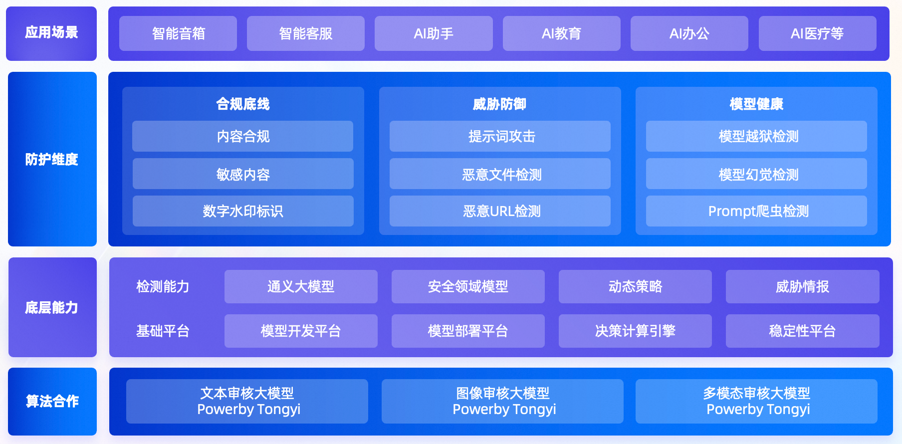

*   **内容合规审核**：Agent 在与用户持续对话过程中可能因上下文引导或语义漂移生成涉政、低俗、歧视性等违规内容。护栏机制基于大模型审核引擎，在 Agent 响应生成前进行实时内容扫描，精准识别显性违规与隐喻表达（如变体、谐音、意识形态渗透），确保输出始终符合法律法规与社会主流价值观。
    
*   **提示词攻击防御**：攻击者常通过精心设计的提示词（如“Ignore previous instructions”）诱导 Agent 绕过系统约束，实现“越狱”或指令覆盖。通过构建融合同步检测与异步分析的多模型混合架构，可在 Agent 接收输入时即刻识别对抗性提示，阻断恶意指令注入路径，保障 Agent 行为始终处于预设策略边界内。
    
*   **敏感信息防护**：在用户与 Agent 交互过程中，可能无意输入个人身份信息（PII）、企业密钥、银行卡号等敏感数据。需要对上述敏感数据进行精准识别与脱敏处理，防止这些信息被 Agent 记忆、记录或在后续响应中意外泄露，满足 GDPR、网络安全法等合规要求。
    
*   **恶意文件检测**：当 Agent 支持文档上传功能（如简历解析、合同问答）时，攻击者可能通过 PDF、PPT、DOC 等文件嵌入宏病毒、可执行脚本或隐藏指令。通过对文件格式的深度解析，检测并清除嵌套攻击代码，从输入源头阻断 Agent 被恶意操控的风险。
    
*   **恶意 URL 拦截**：Agent 在执行网络搜索、知识检索或调用外部 API 时，可能解析或生成钓鱼链接、恶意网站地址。通过对所有URL进行实时风险评估与黑名单匹配，防止 Agent 成为攻击跳板或诱导用户访问高风险站点，保障终端用户安全。
    
*   **提示词反爬机制**：攻击者可能构造特定提示序列，试图通过 Agent 反复试探 RAG 知识库内容或模型训练数据，实施 Prompt 爬虫攻击。通过动态行为分析与模式识别，识别异常查询频率与语义意图，及时阻断数据资产被系统性窃取的风险。
    
*   **模型越狱检测**：通过特定输入，攻击者可能突破大模型与预设的安全机制，使其生成不符合伦理、法律、正常价值观的内容。应对这类攻击模式，除了在前置输入环节部署提示词攻击防御以外，通过对模型输出结果的越狱检测和判定，构建全链路、多环节的保障。
    
*   **模型幻觉抑制**：由于缺乏真实世界验证机制，Agent 在推理过程中易产生“幻觉”，输出看似合理但事实错误的信息（如虚构法规、错误医疗建议）。通过上下文信息一致性比对与外部知识核对机制，在关键决策节点对 Agent 输出进行可信度校验，显著降低高风险领域中的误判概率。
    
*   **数字水印标识**：当 Agent 生成图片等内容时，安全护栏依据《人工智能生成合成内容标识办法》，自动注入可见或不可见的数字水印，实现 AIGC 内容的可追溯、可审计，防范虚假信息传播与版权纠纷，真正做到“生成有痕、责任可溯”。
    

以阿里云 AI 安全护栏为例，基于自研大模型审核引擎，不仅实现了对已知威胁的全面覆盖，更可依托通义大模型技术底座，持续进化多模态审核能力，在毫秒级延迟下支持高并发处理，兼顾安全性与可用性。同时，通过可视化策略配置、自定义黑白名单与灵活阈值调节，满足不同行业客户的差异化合规需求。

#### 14.3.3 模型安全的未来

通用安全模型难以识别企业自身的业务风险，各行业在金融、客服、搜索等 AI 应用中，面临定制化合规挑战。企业需要“能听懂业务语言”的审核模型，识别特定风险。

自定义检测 Agent 可满足不同行业客户的特定业务风险识别需求。这是一种支持用户自定义标签与提示词的智能检测模块，能够精准识别行业特定、场景特定的业务风险。它引入了专用算法模型，并支持多行业多场景灵活配置，从而实现从通用到专属的安全检测能力升级。

未来，随着 Agent 能力的持续演进，原生 AI 安全护栏需要同步升级，致力于保障其在复杂场景下的安全性与可控性，为 AI 原生应用的稳健发展构筑坚实防线。

### 14.4 保护数据安全  （@杨永(渭龙)）  （@刘宇轩(浴血)）

#### 14.4.1 背景和挑战

大模型应用过程中经历了6个数据阶段，数据采集和接入、数据传输、数据存储、数据访问、数据使用、数据删除等，核心需要保障业务在使用过程中的训练数据、提示词、知识库、多模态数据以及日志等多重数据的安全与稳定。

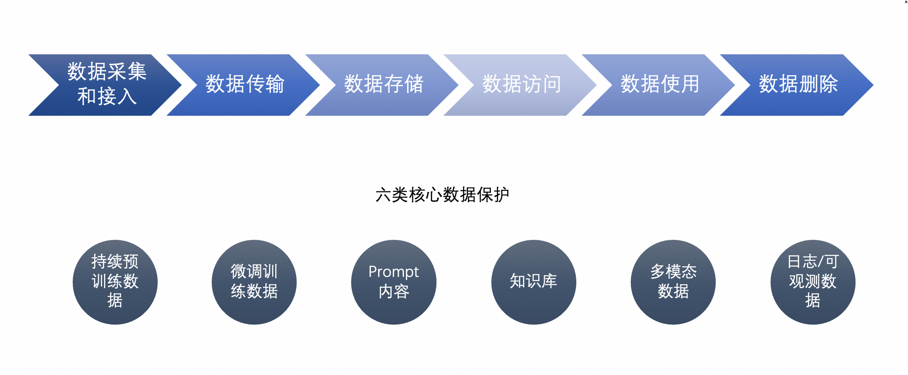

大模型在云上应用与使用存在以下三方面的数据安全风险：

*   **模型训练中的数据风险**
    

首先，用户在模型训练过程中，存在原始数据被投毒、数据清洗不完善、数据存放不安全等因素，影响模型与应用在训练与使用过程中会出现安全风险。其次，企业用户关注企业商业秘密在传输、存储过程中的加密和防攻击，应用处理过程中的权限限制。对个人用户而言，则要保障对其个人数据的控制权和安全性，保证对数据处理的知情同意。此外，需要健全、完善模型安全机制，防止通过模型输出逆向推断出原始数据，导致敏感数据泄露。

*   **模型建设，用户对数据的可控性**
    

用户需要了解并控制模型对数据的使用情况，避免用户数据未经授权用于模型训练，造成数据的秘密状态被破坏，商业价值被稀释。传统人工智能对用户行为数据的依赖，使得“应用数据会被用于模型”的观念深植人心，甚至演化为用户对智能应用的戒备。用户担心自己上传的数据或与模型的交互数据，特别是企业商业秘密，在未经授权时被公开，或被用于二次训练，转化为大模型厂商提升模型能力的语料。

*   **模型应用，操作可审计和责任可追溯**
    

用户数据被模型应用处理，需要多方权责事先需约定、事后可审计可追溯。在模型数据处理的复杂情况下，极易出现敏感数据泄露，因此对数据安全权责的认定及各方责任的判断提出了新挑战，实现“谁持有谁负责”、“谁使用谁负责”、“谁运营谁负责”将变得困难。

一方面，需要在数据泄露或滥用方面，对各方应承担的责任事先进行原则性约束。另一方面，在调用模型进行应用编排时，需要对过程和多方权利信息进行记录管理，以备事后找到对应的问题源头和安全薄弱环节，和相关方进行权益主张。此外，上述过程仅靠模型服务商自己难以自证，需要更好的透明度管理和验证机制，做到操作可审计。

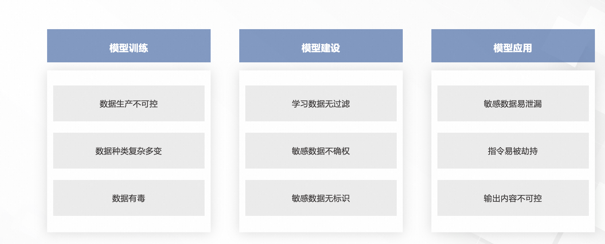

#### 14.4.2 防护框架

为了应对上述数据安全挑战，降低用户对于大模型服务平台的数据安全担忧，需要基于云平台基础安全保障的安全防护机制和能力，以大模型服务的数据作为保护重点对象，围绕数据收集、传输、存储、访问、处理、删除等全生命周期数据安全保障需求，实现大模型服务数据安全保护各环节全覆盖，构建公共云平台+ 大模型服务平台的安全防护能力，并通过第三方权威机构的严格审计来验证自身的安全合规性，从而打造“平台可靠、链路可信、数据可控、自主可选、操作可审、责任可追”的数据安全保障体系。

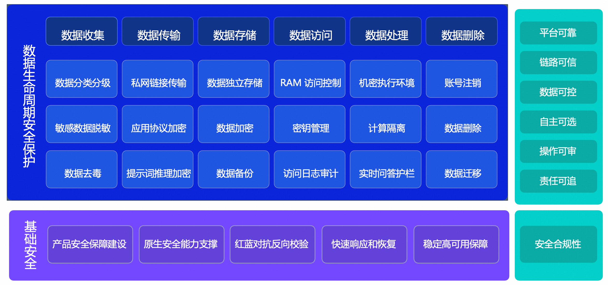

#### 14.4.3 构建全数据全生命周期的安全保障

构建面向大模型与 Agent 全数据全生命周期安全保障，通过增强用户在模型推理、微调、RAG 的数据收集、传输、存储、访问、处理以及删除的安全技术手段，集成数据安全、密钥管理服务（KMS）、内容安全以及访问控制（RAM）等诸多云原生安全产品的能力，实现高级数据安全目标客户的灵活、可配可拓展的Ai数据保护的需求。

##### 1、数据收集

###### （1）数据来源

用户使用大模型服务平台常见场景模型推理、RAG、模型微调中，主要涉及以下几类数据来源：

###### a. 用户上传类数据

*   模型训练和测试数据：用户上传到云平台、用于模型训练（包括持续预训练和微调训练数据、评测数据集)，这类数据由用户准备好并上传到百炼平台，同时百炼平台也提供了数据清洗、数据增强等数据进一步加工能力。
    
*   知识库数据：以阿里云百炼平台为例，提供了 RAG 和 Agent 应用能力，这里将涉及到用户上传的各种非结构文档（如pdf、doc、pptx、word、md 等）、以及经过百炼平台加工后生成适合 RAG 使用的中间、向量化数据。简言之：上传的原始文档、解析后的中间结果、以及便于 RAG 检索的向量化数据。
    
*   多模态数据：以阿里云百炼平台为例，提供了 VL 视觉理解大模型、万相生图模型、ASR 模型、TTS 大模型等多模态模型，涉及到图片、音视频等多模态数据的上传和处理。
    

###### b. 模型文件和推理数据

*   微调训练后的模型参数文件：以阿里云百炼平台为例，提供模型微调与训练能力，使用用户授权的训练及测试数据，对百炼可选的模型进行训练后产生的模型参数文件。
    
*   提示词 Prompt 数据：包括原始 Prompt、大模型生成的答案、推理日志等数据。
    

###### c. 运行日志类数据

*   日志和 Tracing 的可观测数据：以阿里云百炼平台为例，应用和模型服务过程中，涉及的推理日志、应用日志和操作审计日志等，百炼平台也提供大模型应用 Tracing 可观测能力，涉及到可观测日志和 Tracing 日志存储。
    

###### （2）数据分类

数据分类分级作为数据安全和治理的基础，用户需要识别自有云账号下存储资源中存储的模型训练和测试、知识库数据资产类别和等级，以及为敏感数据保护采取相应的安全策略、风险管理，减少数据泄漏风险。

以阿里云数据安全中心为例，提供的分类分级能力，将基于权限管理角度识别数据的敏感性，从数据价值、敏感性、数据合规和业务需求等多角度将数据分为4个安全级别：S1、S2、S3、S4。支持识别结构化数据及非结构化数据，并提供内置模版、识别模型、特征识别能力，内置模板涵盖通用互联网、金融行业、电力行业、车联网以及重保场景等多个行业场景。分类分级模版主要依据包括但不限于《GB/T 35273-2020 个人信息安全规范及通用数据识别模型》、《JRT 0197-2020 金融数据安全数据安全分级指南》、《YDT3751-2020 车联网信息服务数据安全技术要求》以及阿里巴巴数据治理的最佳实践提炼而成。同时也支持基于用户自定义的分类分级模版，AI自动生成安全策略。

实践中，由于各国家地区法规并不相同，且实际用户环境存在大量独有的高敏感数据，在实际使用中用户往往需要结合自身需要，在国家行业标准文件要求的基础上持续更新补充。由于用户此类高敏感数据可能不在法规文件附录中举例的类别范围内，或虽然在类别范围内但是全新的数据形态，此时传统方案中基于国家标准定制的内置规则模型难以千人千面式覆盖。我们会发现同一套检测算法难以适应不同用户在类别定义与尺度上的细微差异，此时AI模型能基于实际数据或用户修改的类别定义范围，做自适应调整。对安全厂商来说，也能摆脱每个客户定制微调的传统的“卖人力”模式。这是新时代背景下，AI带给安全的技术红利。

###### （3）数据脱敏

对于大模型用户的模型训练和测试、知识库等数据，需要确保满足不包含影响大模型回答质量的敏感信息，以及《个人信息保护法》等敏感信息数据的安全合规要求。因此，采集时需进行数据脱敏。

以阿里云数据安全产品为例，提供数据脱敏能力，可覆盖多模态（图片、文件、结构化数据等）数据源，支持解析900 多种文件类型，包括：常见的文本类文档（txt、log 等）、办公类文档（word、excel、Power-Point 等）、压缩嵌套文件（zip、rar 等）、代码文件、设计工程文件等的提取解析。支持对敏感图片（身份证、驾照）类型识别、针对图片中的文字进行 OCR 识别。支持客户自定义敏感数据识别规则，提供基于关键词、Meta 信息、正则表达式、数据表列名的敏感数据识别能力。内置哈希、洗牌、加密、遮盖、替换等多种通用脱敏算法。

###### （4）数据去毒

为进一步提升定制用户的模型训练和测试、知识库数据及模型训练微调质量，防止针对模型数据集投毒攻击，需要对自有的存储资源中多种违规内容（例如涉黄、涉政、暴力、违法等）进行实时监控、检测和拦截。面向广泛人员提供大模型应用的用户，若有对人员输入进行安全防护需求，可接入提问护栏机制，进行恶意意图识别，数据安全产品提供覆盖图片、视频、语音、文字等多媒体的内容风险检测的能力，帮助用户发现暴恐、色情、涉黄、暴力、惊悚、敏感、禁限、广告、辱骂等风险内容或元素，并对内容进行拦截或清洗。

##### 2、数据传输

###### （1）面向数据传输提供私有网络加密

数据访问建议使用诸如阿里云 Private Link 以及 VPC 网络加密能力，实现用户通过专有/私有网络进行访问用户存储的训练、微调、推理等数据。其次，面向 VPC 网络流量提供全面的监控与审计，可以针对网络异常调用进行实时监控与恶意行为拦截。

###### （2）提示词推理加密

针对模型推理服务（纯模型调用、RAG 应用、Agent 应用）提供全链路的加密方案。需要确保输入提示词 Prompt 和模型生成的答案全程不可见。解密只会发生在两个地方：根据输入 Prompt 进行 RAG 片段召回，以及大模型 Prompt 生成回答时。可以遵循最小必要原则对 Prompt 进行解密和使用，并且该过程只在内存中瞬间存在，不做任何的持久化存储。

实践中需要注意的是，仅依赖提示词加密叠加模型本身的拒答能力来防止模型蒸馏等数据泄漏方式的方案是存在先天缺陷的。生成式模型面对相同提示词攻击的拒答能力并不稳定，一定概率会指令遵循失败。另一方面，已知的新型攻击手段包含用大尺寸模型返回的加密后令牌，去询问同系列小尺寸安全能力弱的模型，以便绕过模型拒答能力，因此大模型厂商往往需要第三方专业的安全防护能力。

###### （3）应用协议加密

在安全网络协议方面，为防止中间人、嗅探等网络攻击手段获取到用户与大模型服务，可在应用层使用 HTTPS 协议进行安全数据加密传输以及采用传输层安全性（TLS 1.3 1.2 1.1）协议，为云服务和用户之间的数据传输提供保障。TLS 可提供严格的身份验证、消息隐私性和完整性保障，能够有效检测消息篡改、拦截和伪造行为。

##### 3、数据存储

###### （1）存储隔离

为防止数据泄漏、知识产权窃取、敏感数据被恶意利用，用户大模型相关数据需在用户自有的云账号下独立存储使用。

以阿里云为例，云平台保障用户数据安全完全归属，模型推理、训练、RAG 应用的用户数据均支持外接存储部署方式，支持外接 OSS、ES、ADB、SLS。数据采集接入外接存储归属客户的数据库实例，用户对数据 100% 完全自主可控，用户数据自主管理。阿里云的 ADB（向量数据）、ES（测试数据、长期记忆）、SLS（历史会话、审计日志、观测系统数据）、NAS（模型文件）、OSS（训练、测试集、知识库）数据存储服务中均做到租户化安全隔离。

同时，大模型平台服务运行在云的虚拟化执行环境上，虚拟化层面实现了不同磁盘空间之间的安全隔离。例如，推理环境的本地存储通过安全容器实现虚拟化级别的隔离，从而保证在推理环节中，执行用户请求的推理服务只能访问分配给它的磁盘空间。

###### （2）存储加密

以采用阿里云大模型服务平台百炼为例：

*   微调训练数据集、知识库、多模态数据加密阿里云大模型服务百炼平台的测试、训练数据集、知识库文件支持存储于用户外接的对象存储 OSS 中，OSS 支持服务端和客户端的存储加密能力。在服务端的加密中，支持使用服务密钥和客户自选密钥作为主密钥进行数据加密。在客户端的加密中，支持使用客户自管理密钥进行加密，也支持使用客户 KMS 内的主密钥进行客户端的加密。
    
*   模型文件加密：NAS 支持使用服务托管密钥和用户自选密钥作为主密钥进行数据加密。
    
*   向量数据加密：ADB 支持使用服务托管密钥和用户自选密钥作为主密钥进行数据加密。
    
*   历史日志加密：SLS 支持使用服务托管密钥和用户自选密钥作为主密钥进行数据加密。
    

##### 4、数据访问

可采用云平台原生的访问控制（如阿里云 RAM，Resource AccessManagement,）服务产品提供，用于身份管理与资源访问控制，是账号安全管理和安全运维的基础。对于定制用户场景，大模型平台服务通过访问控制服务关联角色能力访问归属于用户的存储、ElasticSearch、SLS 等云上资源。

##### 5、数据处理

数据处理安全至关重要，可使用云原生的大模型护栏机制。以阿里云AI安全护栏为例，可以满足客户在 Agent 与模型使用过程中的数据、内容信息的安全进行实时过滤与拦截，可以有效针对用户在 Agent 使用过程中的数据安全管控能力，从而减少数据泄露风险。 AI 安全护栏的安全能力支持风险异常识别，支持意图识别，实时过滤伦理、价值观、个人敏感数据，进行安全问答阻断。可根据用户需求，构建安全知识库与专项知识库，实现数据安全规则灵活自定义与风险决策。

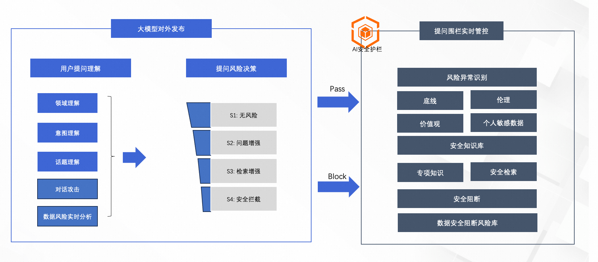

##### 6、数据删除

为了提供用户对自身数据的控制权，一旦用户申请注销大模型服务平台账号后，可按照云平台提供的账号注销流程，按照云用户隐私权政策要求进行删除个人信息，或对其进行匿名化处理。

以阿里云百炼大模型服务平台为例，同时支持对应用内的业务数据进行删除与迁移，删除指定的数据及其索引关系及过程文件等功能，范围包括用户上传数据、模型文件和推理数据、运行日志类数据。

若用户使用自主接入云产品 VPC 独立部署方案，用户对云账号下的各数据资源具有完全的处理与删除权限，并可根据自身业务场景需要对数据进行迁移。

实践中需要注意的是，AI时代背景下，AI替代人操作的占比快速攀升，AI本身可能存在权限过大或自主提权的情况。错误的提示词引导会导致AI错误删除重要数据，即使一些AICoding产品如Qoder本身当感知到删除操作时会提示风险，人类仍然可能惯性误点。世界范围内已陆续有不少此类AI误删重要数据的报道。事实上，攻击者也会利用AI进行脱库攻击。因此在关键数据节点上，建议引入第三方安全告警机制把好最后一道关。

### 14.5 保护Agent身份安全  （@马乐乐(双乐)）  （@任懿(云邺)）

#### 14.5.1 背景和挑战

     智能体平台正从“构建工具”转向覆盖规划、开发、测试、部署、观测、优化、治理的全生命周期系统，身份、权限、审计、成本会被统一纳管。企业要保护的不只是模型输入输出，而是一条由用户、客户端、Agent、工具、凭据、数据和资源组成的动态行动链。

Agent身份安全的主要挑战如下：

1.  资产黑箱：很多企业不知道内部有多少 Agent、谁创建的、调用了哪些资源、拥有什么权限。
    
2.  权限逃逸：员工可能通过 Agent 间接获得超出自身岗位的权限，例如普通销售借助“报销助手”查看 CEO 差旅明细；离职员工的 Agent 可能继续运行，造成权限残留。
    
3.  凭据管理失控：Agent 常被授予“万能权限”，API Key 硬编码在代码中，长期有效且无法审计。传统 IAM 没有为“非人身份”设计动态凭据和短周期令牌机制。
    
4.  责任链模糊：多 Agent 协作时，一次数据泄露可能经过用户、客户端、Agent、MCP 服务、下游资源多个环节，传统审计难以追溯到具体身份和动作。
    
5.  标准与场景不成熟：虽然政策在推动 Agent 互联互通协议和注册平台，但企业仍缺少清晰的入场场景和可复制的实施路径。
    

     传统 IAM 并未失效，但其治理对象、授权粒度和决策时机需要扩展。只为 Agent 配置一个应用账号或长期密钥，无法回答“谁在行动、代表谁行动、凭什么行动、为什么此刻允许、发生异常后如何收权”。Agent 身份安全因此必须贯通资产发现、身份注册、动态凭据、入站与出站授权、运行时控制、全链路审计、生命周期治理和事件恢复。

#### 14.5.2 Agent身份安全管控闭环

1.  **Agent身份安全：从发现到管理**
    

发现之后需要身份、权限、凭据、审计、生命周期的一体化管理

*   统一 Agent 身份（Agent Identity）；每个 Agent 都发放唯一的“数字工牌”，无论是百炼、PAI、AgentRun 等平台自动创建的 Agent，还是手动 API/控制台创建的 Agent，都可被统一纳管。I 支持 Agent 身份与人员身份、机器身份关联
    
*   企业身份源集成：通过标准 OIDC / OAuth 2.0 对接钉钉、飞书、企微、LDAP、Azure AD、Okta、Entra ID 等身份源，实现“用户 → 客户端 → Agent → 访问资源”端到端身份传递，防止身份伪造。
    
*   动态凭据管理：API Key、OAuth Secret、LLM Key 等敏感凭据由 KMS 加密后集中托管在 Token Vault。Agent 代码不接触长期明文凭证，运行时才按 Agent ID 和用户授权获取短期令牌，实现“无密钥开发”。
    
*   最小权限：Agent 默认无权限，仅在用户授权后以其身份和权限范围访问下游资源，且 Agent 权限不超过用户权限。
    
*   全链路审计：支持查看 Agent全链路访问的所有管理操作以及每次凭据获取，粒度可达“哪个用户、通过哪个 Agent、获取了哪个凭证”。
    
*   生命周期治理 员工入职、转岗、离职时，其创建或授权的 Agent 权限可同步变更；Agent 注册、权限授予、凭据轮换、下线注销均可在统一控制台管理，解决“影子 Agent”和权限残留问题。
    

1.  **身份注册及标签管理能力**
    

云上 Agent 身份注册管理：在云上 Agent 平台（如 AgentRun、AgentTeams）创建 Agent 时，自动为 Agent 创建 Agent 身份

面向企业 Agent 注册中心：企业可以通过可视化拓扑注册 Agent 身份，系统自动生成唯一的 Agent ID。注册时 Agent 纳入链路访问节点：

*   Agent 节点：身份主体，配置认证方式与权限
    
*   客户端节点：控制哪些用户/组能调用该 Agent
    
*   大模型节点：托管 LLM API Key 凭据
    
*   企业服务节点：对接企业内部应用
    
*   三方服务节点：对接外部 SaaS/OAuth 应用
    

1.  **智能体身份认证和动态凭证管理能力**
    

| 认证方式 | 特点 | 适用场景 |
| --- | --- | --- |
| Client Secret 凭证 | client\_id + client\_secret，配置简单 | 快速接入、内部低风险 Agent |
| 公私钥凭证 | 非对称加密，私钥签名、公钥验签 | 高安全场景，可配合 KMS/HSM |
| OIDC / OAuth 2.0 联邦认证 | 对接企业 IdP | 已有钉钉、飞书、企微、LDAP、Azure AD、Okta 等身份源 |
| On-Behalf-Of 委托 | Agent 以用户身份和权限访问资源 | 个人助手、多用户共享 Agent |

动态凭证管理：

*   Token Vault 凭证保险箱：所有 API Key、OAuth Secret、LLM Key 由 KMS 加密后集中托管，Agent 代码不接触明文长期凭证。
    
*   短期临时凭证：Agent 通过身份认证后，按 Agent ID 和用户授权获取短期 Access Token / STS Token ，避免硬编码 AK/SK。
    
*   运行时注入：凭据仅在运行时被安全注入，且与大模型/企业服务的出站授权一一绑定。
    
*   全链路审计：ActionTrail 记录每次凭据获取，记录“XX用户通过 XX Agent获取了XX凭证”。
    

权限控制

*   最小权限：Agent 默认无权限，仅在授权后访问指定资源，且 Agent 权限不超过用户权限。
    
*   入站授权：客户端 → Agent 的访问控制
    
*   出站授权：Agent → 大模型 / 企业服务 / 三方服务的权限控制
    
*   行级/字段级隔离：IDaaS 支持多用户 Agent 场景下的数据隔离
    

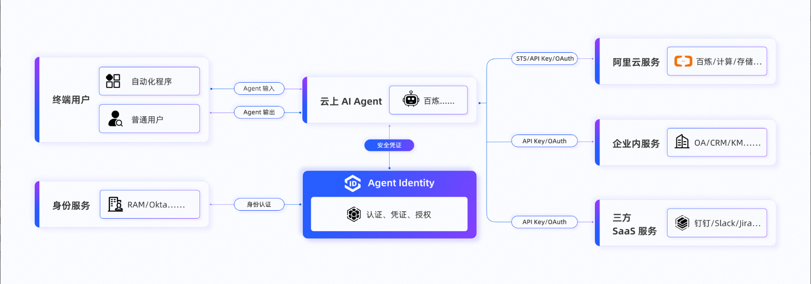

#### 14.5.3 身份授权治理

1.  **智能体授权管理能力（动态最小授权）**
    

*   双向授权模型（入站 + 出站）：把 Agent 视为兼具“资源服务器”和“客户端”双重身份：
    
*   入站授权（Client → Agent）：控制哪些客户端/用户能调用该 Agent，以及可使用的 scope
    
*   出站授权（Agent → 下游服务）：控制 Agent 能访问哪些大模型、企业应用、三方 SaaS 或 MCP Server。
    

   每个 Agent 在创建时自动生成专属的出站授权规则，新增大模型或三方服务节点时自动加入该规则，删除节点即撤销对应授权。

*   Token Exchange 实现权限收敛
    

Agent 调用下游服务时，通过Token Exchange进行权限收敛，原令牌 audience 是 Agent，新令牌 audience 是下游服务；新令牌仅包含被授权的最小 scope；保留用户信息，又记录 Agent 调用链。这避免了 Agent 成为“超级应用”，即使 Agent 被攻破，泄露的也只是对单一服务的短期、受限令牌。

*   On-Behalf-Of 与用户同意机制
    

Agent 默认以用户身份和权限访问下游资源，且 Agent 权限不超过用户权限。用户首次使用时需明确同意，用户撤销同意后 Agent 立即失去出站调用能力。

*   动态凭证替代长期密钥
    

所有 API Key、OAuth Secret、LLM Key 由 KMS 加密托管，运行时才按 Agent ID 和用户授权注入短期 Access Token / STS Token，杜绝硬编码 AK/SK 和长期凭证。

1.  **大模型应用授权支持**
    
    | 下游类型 | 授权方式 | 示例 |
    | --- | --- | --- |
    | 大模型服务 | 大模型节点出站授权，API Key 托管 | 百炼、OpenAI、DeepSeek |
    | MCP Server | 作为三方服务节点出站授权 | 比如调用高德 MCP Server 获取地理位置 |
    | 第三方 SaaS | 三方服务节点出站授权，OAuth / API Key | 钉钉、飞书、GitHub |
    | 企业内部系统 | 企业服务节点出站授权，OAuth Access Token | HR、CRM、财务系统 |
    
2.  **支持上下文感知的动态授权能力**
    

可基于用户、Agent、工具上下文，与用户请求中的上下文进行动态授权，如：允许市场部的用户，使用订单Agent，下单金额<1000 的订单。通过 Cedar 策略+AI 网关实现动态授权，只有在用户对话过程中满足上下文条件，才获得权限。

#### 14.5.4 全链路审计溯源

Agent Identity 提供了 “身份 → 行为 → 调用链 → 推理过程”的全局可追溯能力。

**智能体行为审计能力**

*   Agent 执行过程的全证据链留痕，支持按时间、用户、Agent 应用等维度回放；内置异常行为检测引擎，实时预警越权操作、敏感数据访问。
    
*   Agent 管控面操作（创建/修改 Workload Identity、凭证提供商、获取凭证等），支持 事件查询、多账号统一跟踪、AccessKey 调用审计。
    

### 14.6 保护系统和网络安全  （@梁雷(良玖)）  （@马昕(灵闻)）

#### 14.6.1 背景和挑战

在 AI Agent 的全生命周期中，其基础设施的安全性直接决定了应用的可靠性、可信度和合规性。从模型训练到推理服务，AI 系统的复杂性、分布式架构以及对海量数据的依赖，使得任何基础设施层面的疏漏都可能引发模型盗用、数据泄露或服务滥用等严重风险。所以需要从构建安全、可控的运行环境，需要从全局安全态势到计算、网络等细节层面，建立多层次防护体系。

#### 14.6.2 基础设施的统一安全态势管理

AI 应用的分布式特性与开源框架的广泛使用，导致资产构成日益复杂，安全团队常面临“看不清、管不到”的挑战。为此，需通过全局视角对 AI 资产进行统一管理，实现风险的提前感知与有效控制。

**1、AI 资产的自动发现与盘点**  
安全管理始于清晰的资产清单。以阿里云云安全中心产品为例，提供智能资产发现能力，可穿透云环境的复杂架构，精准识别与AI相关的计算资源、容器、模型服务实例等。例如：

*   自动化识别：系统可自动标记云服务器 ECS、人工智能平台 PAI、容器服务 ACK 中的 AI 资产，覆盖从底层计算节点到具体应用组件（如 Ollama、LM Studio）的全链路资源。
    
*   集中化视图：通过“AI 应用”、“PAI” 等标签分类资产，用户可快速定位云产品、容器镜像或主机资源，形成动态更新的资产清单，为后续风险分析提供基础支撑。  
    

随着 Agent 进入生产环境，资产盘点的对象还需从计算资源延伸到 Agent 层：Agent 实例及其任务会话、接入的 MCP 服务与连接器、技能与工具配置，以及 Agent 持有的各类 NHI 凭据，都应纳入统一的资产清单与风险视图，避免出现游离于安全管理之外的“影子 Agent”。

**2、多维度风险评估**  
在资产可视化的前提下，通过持续性风险检测，将威胁暴露于攻击发生前：

*   开源组件漏洞检测：针对 Ollama、LM Studio等 AI 框架，定期扫描组件漏洞，及时预警潜在暴露面。
    
*   公网暴露面分析：监控 AI 服务的公网暴露情况，标记高风险端口（如未授权开放的 SSH 或 Jupyter 端口），帮助收敛攻击面。
    
*   配置风险检查：基于阿里云及主流云厂商的AI安全最佳实践，检测 PAI、EAS 等平台的配置合规性，避免因配置错误引发风险。
    
*   敏感信息扫描：通过镜像与文件系统无代理扫描技术，识别明文存储的API密钥（如阿里云 PAI-EAS Token、OpenAI Key），防止凭证泄露导致的滥用。核心价值在于其“上下文关联”能力。例如，若发现某 Ollama 组件存在漏洞，系统将直接关联该漏洞对具体模型服务实例的影响，帮助安全团队按业务优先级制定修复策略，实现“以 AI 应用为中心”的精准治理。  
    

需要指出的是，态势管理解决的是“看得见”的问题，发现的风险还必须与运行时的管控手段联动闭环：对存在高危漏洞、异常暴露或行为失真的 Agent 工作负载，应能联动网关、防火墙与任务编排层及时限流、隔离或暂停任务，把资产与风险视图转化为实际的处置能力。

#### 14.6.3 计算层安全加固

ECS GPU 实例作为 AI 模型训练与推理的核心算力载体，其安全防护是基础设施的基石。需从主机基础防护、容器化环境防护与 Agent 运行时隔离等层面构建防线。

**1、主机安全基础防护**

所有承载AI应用的ECS实例需部署基础安全措施：

*   安全客户端部署：安装云安全中心客户端，提供实时漏洞扫描、基线检查、异常登录检测及AK泄露告警。
    
*   安全组最佳实践：遵循最小权限原则，关闭非必要端口，限制 SSH/RDP 等管理端口仅对运维堡垒机IP开放，避免公网暴露。  
    

**2、容器化环境安全防护**

容器技术提升了 AI 应用的敏捷性，但共享内核的特性增加了容器逃逸风险。需通过安全沙箱与镜像全生命周期管理，平衡敏捷开发与安全需求。在阿里云上，容器服务 ACK 提供的安全沙箱为每个容器提供轻量级虚拟机隔离，实现内核级防护：

*   攻击遏制：即使容器被攻陷，攻击者无法突破沙箱边界影响宿主机或同集群其他容器。
    
*   适用场景：适合多租户AI服务或需运行不可信代码的场景，且性能损耗极低，接近原生容器体验。  
    

**3、镜像供应链安全**  
通过镜像扫描与签名机制，确保容器交付安全：

*   扫描与合规性：在阿里云上，容器镜像服务 ACR 在 CI/CD 流程中自动扫描镜像，检测系统漏洞、应用漏洞、恶意样本及敏感信息（如硬编码密钥）。
    
*   签名与验签：开发人员对合规镜像签名，ACK 集群仅允许携带有效签名的镜像部署，防止供应链投毒。技术优势在于将安全左移至开发阶段（镜像扫描）与运行阶段（沙箱隔离），形成从代码构建到生产部署的完整闭环。  
    

4、Agent 运行时的会话级隔离

Agent 在执行任务时会动态生成并运行代码、访问外部服务，其运行环境本身需要被当作不可信负载对待。2026 年以来，业界普遍将隔离单位从服务收敛到会话：为每个 Agent 会话分配独立的沙箱或轻量级虚拟机（microVM），实现内核级隔离、环境用完即弃，并在空闲超时或达到最大生命周期后自动回收，避免残留环境与凭据被后续任务或攻击者复用。在阿里云上，可基于容器服务 ACK 的安全沙箱为 Agent 会话提供内核级隔离，并按会话注入最小化的临时凭据，替代长期有效的环境变量密钥。

对于多 Agent 协作场景，Agent 之间也应遵循相互隔离的原则，按任务边界划分运行环境与网络策略，防止单个 Agent 被攻陷后横向波及其他 Agent 及其可访问的数据与工具。

#### 14.6.4 网络隔离与访问控制

网络隔离与访问控制在 VPC 和安全组的基础防护之上，需构建更高级的网络边界防御体系，形成多层次纵深防护架构。

**1、互联网边界防护**   
针对需要对外提供服务的 AI Agent，通过云防火墙以下核心能力强化公网流量管控：

*   智能访问控制：支持基于七层协议、域名、URL 及地理位置的精细化策略配置。
    
*   主动威胁防御：内置威胁情报库和攻击特征库，实时阻断已知攻击类型，提供漏洞临时修补的"虚拟补丁"。
    
*   全链路可视化：提供全局流量日志分析与可视化展示，满足安全审计与攻击溯源需求。
    

**2、内网微隔离防护** 

云防火墙的 VPC 边界防护功能可实现：

ꔷ 阻断攻击横向渗透路径：通过深度监控跨 VPC 及混合云流量，防止攻击者从非核心业务区（如开发测试环境）向核心数据区（如训练数据存储 VPC）渗透。

ꔷ 零信任网络实践：要求所有内部流量均通过身份认证与策略验证，消除传统内网信任模型的安全隐患

3、Agent 出站流量管控

Agent 的风险不仅来自外部流量的进入，也来自其主动向外发起的请求。2026 年 7 月 Hugging Face 入侵事件中，攻击 Agent 正是借助可访问的中间服务代联网突破了网络边界。因此，出站方向应默认拒绝、按需放行：

*   默认拒绝的出站策略：Agent 运行时所在的 VPC 或子网默认禁止出站，仅按域名、目的地显式放行业务必需的端点（如模型 API、内部知识库）。
    

*   阻断高危目标：在网络层封禁云元数据服务端点与内网保留地址段，防止 SSRF 与提示注入演化为内网探测和凭据窃取。
    

*   统一出站关口：Agent 对互联网及 MCP 服务的访问经由 AI 网关或云防火墙的出站管控集中收敛，校验访问目标、记录访问日志，并与 NDR 联动发现异常外联与数据外发。
    

与此同时，零信任理念也在向 AI 场景延伸，行业陆续提出面向 AI 的零信任框架（如 Microsoft 的 Zero Trust for AI、CSA 的 Agentic Trust Framework），将 Agent 身份作为网络策略验证的核心要素，与 14.5 节的身份安全体系形成呼应。

防护体系架构设计，安全组与云防火墙形成互补防护，云防火墙作为中枢管控节点，提供全局流量策略管理、威胁检测及可视化分析 二者联合构建"点-线-面"立体防御体系：通过安全组实现节点级防护（点），VPC 边界防火墙拦截跨区流量威胁（线），互联网防火墙把控公网入口并约束 Agent 出站（面），形成覆盖全网络层级的防护网络。

安全的 AI 基础设施并非一劳永逸的终点，而是一个需要持续评估、优化和演进的动态过程。随着 AI 技术和攻击手段的不断发展，安全防护体系也必须保持同步的迭代与升级，将安全真正内化为 AI 原生应用架构的固有属性。


<a id="sec-025"></a>

## 第 15 章　AI 资产的发现与管理
Agent 的行为不只取决于模型。模型在一次调用中看到哪些指令、可以使用哪些方法、能够连接哪些外部能力，以及最终获得怎样的上下文，都会改变任务的执行过程和结果。第 4 章从 Harness 视角讨论了指令与上下文的动态装配，第 5 章进一步区分了 Prompt、Skill、Knowledge 和 Memory 等 Agent 能力资产。

当 Agent 数量、参与团队和运行环境逐步增多，这些能力资产会从单个应用中的局部内容，演变为被多个 Agent 共同依赖的公共资源。Prompt 可能被复制到不同代码仓库，Skill 可能散落在多个本地目录，MCP Server 的工具说明和运行端点可能分别维护，能够协作的 Agent 也可能由不同平台发布。此时，团队不仅要知道资源保存在哪里，还要回答哪个版本可以使用、一次任务实际使用了什么、一次变更会影响哪些 Agent，以及运行中如何找到当前任务需要的能力。

不同资源需要管理的内容并不相同。Prompt 的核心是指令、模板和变量；Skill 是包含执行说明、脚本和参考资料的能力包；基于 Model Context Protocol（MCP）的服务对外提供工具、资源和运行端点；Agent Registry 则描述可以被发现和调用的 Agent。它们可以共用名称、版本、生命周期、可见范围和发布记录，但不能因此忽略各自的验证方法和运行方式。

本章先分别讨论 Prompt、Skill、MCP 和 Agent Registry 的工程管理，再说明各类能力资产如何进入统一的变更评审和发布流程。在此基础上，进一步介绍资源中心的公共治理能力，说明稳态 Agent 如何通过声明式依赖获取资源，动态 Agent 如何借助 Agentic Resource Discovery（ARD）和 Remote Agent Discovery（RAD）按任务发现能力。最后讨论发现结果如何进入运行时 Context，并通过完整记录支持回放、问题分析和持续改进。

本章将承载 Agentic Resource 注册、版本、治理、发现和分发的基础设施称为 Agentic Resource Registry，并以 Nacos 作为贯穿全章的参考实现。Nacos 官方产品能力称为 AI Registry 或 AI 管理中心；本章使用 Agentic Resource Registry，是为了强调它管理的不是一种普通配置，而是 Agent 在运行中可以发现、加载或调用的 Prompt、Skill、MCP Server、Agent 和 AgentSpec。

这一定位延续了 Nacos 从 Config、Naming 向 AI Registry 的演进：配置中心回答应用怎样运行，服务发现回答服务实例在哪里，AI Registry 则回答 Agent 当前有哪些经过治理的能力可以使用。以下内容仍先说明可迁移的工程原则，再结合 Nacos 的资源模型、生命周期、客户端与发现组件解释这些原则如何落地。本章以 Nacos 3.3 版本线为实践基线：ARD 已将按意图发现扩展到 Prompt、Skill、MCP Server 和 Agent，协议无关的远程 Agent 发现能力也已初步完成；对于仍在演进的协议细节，则明确其当前范围，不把后续扩展写成既成事实。

本章只展开与能力资产直接相关的验证和运行约束。通用的应用、模型、数据、身份及基础设施安全由第 14 章讨论；灰度流量组织和 A/B Test 方法由第 15 章讨论；运行指标的采集与 Trace 基础由第 13 章讨论。

### 15.1 Prompt 工程化：模板、版本、评测与回滚

在原型阶段，Prompt 经常以代码字符串、配置项或文档片段的形式存在。随着同一 Prompt 被多个 Agent 复用，文本之外的变量、模型、工具和输出要求也会成为运行条件。如果只保存一段最终文本，团队很难判断一次修改是否改变了调用接口，也无法稳定地比较新旧版本的行为。

#### 15.1.1 从文本片段到结构化模板

一项可发布的 Prompt 应被表示为结构化内容，而不只是完整字符串。其基本组成可以包括：

| 组成部分 | 主要内容 | 管理重点 |
| --- | --- | --- |
| 指令层 | 系统策略、开发者或应用指令、任务指令等不同层级的内容 | 来源明确、顺序稳定，低优先级内容不能覆盖高优先级规则 |
| 模板与变量 | 模板正文、变量名称、类型、是否必填、默认值和长度限制 | 防止缺失变量、类型错误和未处理输入改变指令结构 |
| 输入输出要求 | 输入范围、输出格式、结构化 Schema 和异常处理方式 | 便于调用方校验，也用于判断版本兼容性 |
| 运行依赖 | 适用模型、所需工具、知识来源和语言环境 | 避免 Prompt 被加载到不具备相应能力的 Agent |
| 验证材料 | 正向样例、边界样例、评测集和评价标准 | 支持发布前评测和历史版本比较 |

结构化建模不要求每项 Prompt 都采用复杂格式。对于没有变量的短 Prompt，正文仍然可以是主体；资源中心至少需要知道它的指令层级、适用范围和输出要求。对于包含模板变量的 Prompt，则应使用明确的变量 Schema，使调用方可以在渲染前检查名称、类型和取值范围。

变量替换应在受控的渲染过程中完成。用户输入、检索结果和工具返回值作为数据进入指定位置，并经过长度、类型和必要的转义处理，不应先与模板随意拼接，再交由模型判断哪些内容属于指令。这样既能减少模板错误，也能降低外部内容改变原有指令边界的风险。

Prompt 与模型、工具之间的关系也需要显式记录。例如，一项 Prompt 要求模型调用 `query_order` 工具并按指定 JSON Schema 输出结果，那么工具名称、参数定义和输出 Schema 都构成运行条件。缺少这些依赖时，即使 Prompt 正文完整，也不能认为它可以正常运行。

#### 15.1.2 版本与变更分类

Prompt 的每一次已发布变更都应形成新版本。版本记录除了正文差异，还应包含修改原因、变量 Schema、输出格式、适用模型、工具依赖、评测结果和受影响的 Agent。

从发布影响看，Prompt 变更可以分为三类：

| 变更类型 | 典型内容 | 主要影响 |
| --- | --- | --- |
| 文字修订 | 修正错误、补充说明或改善表达 | 预期不改变任务目标和输出结构，但仍需通过评测确认 |
| 接口变化 | 增加必填变量、修改输出 Schema、调整工具名称或依赖条件 | 直接影响调用方适配与兼容性 |
| 行为变化 | 改变判断规则、处理步骤、拒绝范围或结果偏好 | 即使输入输出形式不变，也可能改变 Agent 的实际行为 |

这种分类帮助评审者理解风险，但不能代替实际评测。自然语言的细微调整也可能改变模型输出，因而难以仅凭传统的主版本、次版本和修订版本推断兼容性。版本号首先承担唯一标识作用，行为是否可以接受仍需结合评测结果和人工判断。

被多个 Agent 共同使用的 Prompt 还需要维护反向引用关系。发布前应能够查看现有使用方、生产环境的绑定方式和历史调用规模，确定哪些 Agent 需要提前适配，哪些场景可以进行小范围验证。

#### 15.1.3 Prompt 评测

Prompt 评测需要同时观察结构是否正确、任务效果是否变化以及运行约束是否满足。结构检查关注变量是否完整、输出能否通过 Schema 校验、引用工具是否存在；任务评测使用固定样例比较新旧版本的准确性、完整性、拒绝行为和边界表现；运行评测则关注延迟、Token 消耗以及模型和工具版本变化带来的影响。

同一评测集在不同模型上可能得到不同结果，因此评测记录必须与 Prompt 版本、模型版本、推理参数、工具定义和评测集版本关联。只记录一个总分，无法说明结果变化来自 Prompt 修改还是运行环境变化。

评测集应包含常见任务、边界输入和历史问题样例。对于结构化输出，应单独统计格式通过率；对于包含判断规则的 Prompt，应观察不同类别的错误分布，而不只看平均分。高风险场景还需要人工抽查具体输出，确认自动指标没有掩盖业务上不可接受的变化。

评测结果是变更评审的输入，而不是自动发布指令。资源作者仍需说明修改目的、预期改善和已知限制，评审者结合影响范围决定是否允许进入后续发布阶段。统一评审流程将在 16.5 节展开。

#### 15.1.4 发布、灰度与回滚

对结果确定性要求较高的 Agent，可以固定 Prompt 的精确版本，并通过正常发布流程升级；需要集中维护的 Agent，则可以绑定组织自定义的 `stable`、`canary` 等标签，由平台统一调整标签指向。

新版本通常先在测试环境完成离线评测，再进入限定 Agent、租户或流量范围的小规模验证。确认质量、延迟和成本符合预期后，才将稳定标签移动到新版本。历史版本内容始终保持不变，变化的是标签与版本之间的指向关系。

灰度范围需要结合业务关系划分。Prompt 如果修改了输出字段，而调用方尚未完成适配，即使只影响少量随机请求，也可能造成完整链路失败。第 15 章已经介绍灰度和 A/B Test 的流量组织及分析方法，本节只负责明确参与试验的 Prompt 版本和恢复目标。

当新版本出现质量或安全问题时，可以把标签重新指向最近一个已验证版本。回滚操作应记录原因、执行人、影响范围和相关运行记录。已经开始的长任务不宜在执行中自动更换 Prompt；较稳妥的方式是在任务或会话开始时解析一次版本，并在该执行边界内保持不变。

#### 15.1.5 可复现的有效 Prompt

资产库中保存的是 Prompt 模板，模型实际接收到的却是模板经过变量渲染、上下文装配和运行策略处理后的结果。即使模板版本相同，变量取值、模型版本、工具说明或检索内容不同，最终输出也可能不同。

可以将一次调用中实际生效的组合称为“有效 Prompt”：

```text
有效 Prompt = Prompt 版本 + 变量快照 + 模型与参数
              + 工具定义版本 + 策略版本 + Context 来源
```

运行系统应为这一组合生成可查询的指纹，并保存各组成部分的精确版本或内容摘要。包含敏感数据的变量可以记录经过保护处理的值、摘要或引用位置，不必复制全部原文；但记录方式应能够判断两次执行是否使用了相同条件。

有效 Prompt 记录最终进入 Context Manifest。借助这些信息，团队才能在结果偏离预期时判断问题来自 Prompt 变更、模型升级、变量错误，还是其他上下文发生了变化。

#### 15.1.6 Nacos Prompt Registry 的实现路径

Nacos Prompt Registry 将 Prompt 建模为一等版本化资源，而不是把它隐藏在普通配置项中。资源以 `namespaceId -> prompt -> promptKey` 唯一标识，版本中保存模板、变量定义、作者、提交说明和描述等信息。Namespace 可以区分环境、租户或业务域，稳定的 `promptKey` 则使多个应用能够引用同一项业务 Prompt。

应用可以按精确版本读取，也可以通过服务端维护的 `latest` 或组织自定义标签（如 `stable`、`canary`）取得当前推荐版本。标签在查询时解析，因而 Prompt 内容可以独立于应用代码发布；与此同时，运行记录仍需保存解析后的精确版本，避免只留下后来可能移动的标签。

在管理侧，Prompt 可以遵循 Nacos AI 资源的通用生命周期：先创建和修改草稿，再提交审核，通过发布 Pipeline 后发布并上线。已经上线的版本保留历史内容，后续修改形成新版本。团队因此可以集中查看变更记录、比较版本、调整标签并恢复到已验证版本，而不必依赖分散在各代码仓库中的字符串差异。

Nacos 解决的是 Prompt 模板的权威版本、发布状态和运行时获取问题。一次调用中的变量取值、模型参数、工具说明和检索内容仍由 Agent Harness 负责装配，并通过 Context Manifest 与 Nacos Prompt 版本建立关联。区分这两个层次，既能发挥动态管理的价值，也不会把“模板相同”误认为“最终输入完全相同”。

### 15.2 Skill 的验证与发布：从沉淀到可发布资产

Skill 用于表达 Agent 完成一类任务的方法。它既可以包含可阅读的执行说明，也可能携带脚本、模板、参考资料和外部依赖，并通过 Agent 已有的工具产生实际操作。因此，Skill 的管理对象应是完整能力包，而不是其中一份说明文件。

#### 15.2.1 Skill 包与发现信息

不同 Agent 或 Harness 可以使用各自的 Skill 目录格式，但进入团队资源中心的 Skill 至少应具备一致的描述层。一个典型能力包可以采用如下结构：

```text
complaint-analysis/
├── SKILL.md              # 使用说明、执行步骤与注意事项
├── manifest.yaml         # 标识、发现信息、依赖和权限声明
├── scripts/              # 可选的辅助脚本
├── templates/            # 可复用模板
├── references/           # 按需加载的参考资料
├── tests/                # 样例、校验规则或测试脚本
└── LICENSE               # 来源与使用许可
```

SKILL.md 主要面向 Agent 或开发者说明何时使用、如何执行和如何处理异常；Manifest 为资源中心提供稳定、可校验的结构化信息。Manifest 中应包含逻辑名称、版本、维护者、能力描述、触发条件、输入输出、兼容运行环境、依赖、所需工具、权限范围、资源限制、来源和许可证等内容。

包中存在脚本时，还应明确入口、解释器或运行时版本、依赖包及其锁定信息。存在参考资料时，应说明哪些内容需要在开始任务时加载，哪些内容只在特定步骤中读取，避免把整个目录一次放入 Context。涉及外部系统时，应声明所需工具或连接能力，访问凭据不能保存在 Skill 包中。

Skill 是否容易被发现，取决于其描述能否准确表达能力边界。名称“数据分析助手”过于宽泛，既不利于人工查找，也容易在语义检索中匹配无关任务。更有效的描述应说明它解决什么任务、需要什么输入、产生什么结果，以及哪些情况不适用。

除名称和简要说明外，发现信息通常还包括适用场景、代表性用户问题、业务标签、输入输出类型、兼容的 Agent 或 Harness、依赖工具、风险等级和所需权限。发现元数据本身也是发布内容的一部分，发生实质变化时同样需要评审和版本记录。

#### 15.2.2 版本、依赖与分发

Skill 一经发布，其包内容和依赖锁定信息不应被覆盖。新增脚本、修改执行步骤、调整权限要求或更新依赖，都需要形成新版本，并重新计算完整包摘要。只对 SKILL.md 计算摘要会漏掉脚本、模板和依赖文件的变化，因此摘要应覆盖完整能力包。

版本兼容性不能只看说明正文。例如，新版本把脚本运行时从 Python 3.10 提升到 3.12，或者开始依赖生产环境未开放的工具，即使输入输出不变，现有 Agent 也可能无法使用。发布前应根据 AgentSpec 或运行环境检查依赖条件，并给出明确的解析结果。

对于依赖其他 Skill 的能力包，应声明版本范围或精确版本，并在部署或加载时生成锁定清单。运行记录最终保存实际解析出的每一项版本和摘要，避免上游标签移动后，下游 Skill 在未发布新版本的情况下改变行为。

个人或单机环境可以使用统一目录和同步工具，使多个 Agent 从同一份本地内容加载；团队及跨设备环境则适合使用远程 Registry，统一提供搜索、下载、版本解析、订阅通知和使用记录。无论采用哪种方式，同一版本号都应对应相同摘要。

#### 15.2.3 验证与发布

Skill 提交发布后，应先验证包结构、依赖和实际行为。结构检查确认必需文件、Manifest 字段、脚本入口和摘要计算是否正确；依赖检查确认运行时、第三方组件和所需工具是否满足条件；任务验证则在受控环境中执行代表性样例，观察输出、外部访问和异常处理是否符合说明。

包含脚本的 Skill 还应检查危险命令、敏感路径访问、运行时下载、混淆内容和已知依赖漏洞。自然语言说明同样需要检查，识别诱导 Agent 忽略既有规则、读取无关数据或扩大操作范围的内容。自动检查发现问题后，应返回明确原因，由作者回到草稿修正，而不是由检查系统直接修改待发布内容。

验证通过并不表示版本已经自动适用于所有环境。业务负责人还需确认能力边界、使用场景和维护责任；风险较高的 Skill 由相关人员确认必要权限和外部连接。版本完成发布后，再通过在线状态、可见范围和标签确定哪些 Agent 可以发现和下载。

普通废弃表示不再推荐新 Agent 使用，但可以为存量任务保留迁移时间；停止分发表示不再接受新的安装或解析；因明确安全问题撤回时，则应阻止新加载，并通知仍在使用的 Agent 和负责人。

#### 15.2.4 外部 Skill 的可信准入

外部 Skill 会把外部维护者、代码依赖和内容来源带入 Agent 运行环境。由于 Agent 可能按照自然语言说明调用文件、命令、工具和外部服务，一段普通说明也可能间接引导高权限操作。外部 Skill 因而不能下载后直接进入生产 Agent。

企业可以设置独立的接收区域。新内容先作为候选包保存，不对生产 Agent 可见；完成检查并形成内部版本后，才允许通过正常资源解析流程获取。一个完整的准入过程通常包括：

| 阶段 | 主要工作 | 形成的记录 |
| --- | --- | --- |
| 来源核实 | 记录原始仓库或发布地址、发布者、维护状态、许可证和获取时间 | 来源与责任信息 |
| 完整性校验 | 计算候选包摘要，并在来源提供签名时验证签名 | 内容摘要与签名验证结果 |
| 静态检查 | 检查说明、脚本、依赖和配置中的异常命令、敏感路径、外部地址、运行时下载、依赖漏洞和不当指令 | 检查工具、策略版本和问题清单 |
| 隔离验证 | 在不包含生产数据和长期凭据的环境中执行样例任务，限制文件、进程、工具和网络访问 | 运行行为和外部访问记录 |
| 人工评审 | 由使用团队确认业务必要性、输入输出、维护责任和必要权限 | 评审结论与例外事项 |
| 内部发布 | 将通过检查的内容复制到内部 Registry，固定版本和摘要 | 内部版本及其完整准入记录 |

签名和摘要能够证明内容来自谁、检查后是否被替换，但不能证明内容本身没有风险。静态检查能够识别已知模式，却难以穷尽自然语言指令在不同 Agent 中可能产生的行为。可信准入需要把来源核实、内容检查、隔离验证和运行限制结合起来，而不能依赖某一项单独结论。

#### 15.2.5 运行时限制与持续处置

通过准入检查的 Skill，运行时仍不应继承 Agent 的全部能力。系统需要根据当前任务重新授予必要权限，并使实际权限不超过 Manifest 声明范围。只负责整理本地 Markdown 的 Skill，不应因为所在 Agent 具备云端管理能力，就同时取得外部网络和生产系统访问权限。

对不需要联网的 Skill，可以默认禁止外部网络；确有需要时，只开放指定服务和必要方法，并对请求数据进行敏感信息检查。文件访问限定在任务目录或明确数据集，系统配置、密钥目录和其他项目文件保持不可见。访问外部服务时使用短期、最小权限的凭据，由运行环境注入，而不是写入包内容或 Context。

外部 Skill 在发布后仍可能出现新的风险：上游披露安全问题、依赖组件出现漏洞、组织策略变化，或者运行记录显示其行为与声明不一致。内部 Registry 需要支持定期重新检查，并使检查结论同时关联 Skill 摘要、依赖摘要、检查工具版本和策略版本。

确认存在风险后，资源中心首先停止该版本的新安装和新解析，再根据严重程度通知使用方、停止新任务加载或中止运行实例。平台通过反向引用关系列出受影响的 Agent、环境和历史任务，帮助负责人迁移到安全版本。更广泛的网络、身份、数据和运行环境安全要求见第 14 章。

#### 15.2.6 Nacos Skill Registry：企业内部的能力仓库

Nacos 从 3.2.0 开始提供 Skill Registry。它以 `SKILL.md` 和附属资源文件为基本内容，可以通过控制台手工创建、上传 ZIP 包或使用辅助生成能力形成草稿。Skill 发布后，开发者和 Agent 工具链可以通过 CLI、API 或 SDK 搜索、下载和安装，从而把个人目录中的能力沉淀为团队可共享的内部资产。

每个 Skill 版本经历 `draft`、`reviewing`、`online` 和 `offline` 等状态。上线版本内容不可直接修改，需要从已有版本创建或 Fork 新草稿，再重新审核和发布。版本标签、业务标签以及 PUBLIC、PRIVATE 可见范围分别解决推荐版本、分类检索和使用范围问题；运行时最终下载的是具有确定版本和内容的 Skill 包。

Nacos 的发布 Pipeline 可以在 Skill 上线前接入安全扫描。内置 `skill-scanner` 节点可以调用外部扫描工具，对可扫描内容执行检查；组织也可以扩展自己的审核节点。Pipeline 的意义不是宣称 Skill 已经绝对安全，而是让扫描工具、检查结果和发布版本进入同一条可审计流程。Skill 加载后的文件、进程、网络和工具权限仍由 Runtime 与沙箱控制。

作为私有 Skill Registry，Nacos 的价值还在于形成统一来源。团队可以把来自公共仓库或外部市场的 Skill 先导入内部，完成来源核实、扫描和人工确认后，再以内部版本分发。Agent 不再直接依赖可能随时变化的外部地址，发现和安装也可以统一服从 Namespace、可见范围和版本状态。

### 15.3 MCP 管理：从服务登记到工具发现与调用

MCP 为 Agent 连接外部工具和数据提供了通用方式，但“能够连接”并不等于“能够管理”。当企业拥有大量 MCP Server 时，需要知道每个服务提供哪些能力、由谁维护、哪些端点正在运行、工具定义是否发生变化，以及哪些 Agent 有权发现和调用。将 MCP Server 只保存为客户端配置中的一组地址，无法回答这些问题。

MCP 管理的核心，是把相对稳定的能力定义、可以独立发布的版本和持续变化的运行端点分开管理，再由 Registry 为 MCP Client、Agent、Router 或网关提供可信的发现入口。

#### 15.3.1 MCP Server 的资源模型

一项 MCP Server 资源通常包含以下几类信息：

| 信息类别 | 主要内容 | 变化特征 |
| --- | --- | --- |
| 基本信息 | Namespace、名称、描述、负责人、来源和可见范围 | 相对稳定，由管理流程维护 |
| 能力定义 | Tools、Resources、MCP Prompts 及其名称、说明和参数 Schema | 随版本发布，会影响 Agent 的选择和调用 |
| 运行信息 | 传输方式、服务端点、可用实例和健康状态 | 随部署和运行状态变化 |
| 治理信息 | 版本、标签、在线状态、权限、风险等级和审计记录 | 由发布和运维操作改变 |
| 连接要求 | 认证方式、网络范围、限流及超时要求 | 与环境和调用身份相关 |

MCP 协议中的 Prompt 是 MCP Server 对外提供的一类能力，与企业 Prompt Registry 中独立发布的 Prompt 资源并不完全相同。前者通常跟随 MCP Server 版本进行管理，后者可以被多个 Agent 或服务独立引用。平台可以在二者之间建立引用关系，但不应只因为名称相同就将其视为同一版本。

能力定义和运行端点也需要分离。一个 MCP Server 版本可以在多个实例和区域中运行，端点扩缩容不应产生新的能力版本；但 Tool 参数、返回结构或能力说明改变时，应形成新的版本记录。这样既能支持运行时服务发现，也能保持历史调用所依赖的 Tool Schema 可复现。

#### 15.3.2 MCP Server 进入资源中心的三种方式

新构建的 MCP Server 可以在启动时自动注册。框架或 SDK 将服务名称、版本、能力定义和当前端点发布到 Registry，运行实例通过注册、续约和注销反映实际状态。自动注册适合与应用生命周期一起部署的 MCP Server，能够减少人工维护端点的工作。

企业已有的大量 HTTP 或 RPC API，也可以通过服务声明、工具声明和参数映射转换为 MCP 能力。此时资源中心保存 MCP Server 和 Tool 的定义，网关或协议适配组件负责把 MCP 请求转换为后端 API 调用。管理链路负责“这个能力如何描述和发布”，数据链路负责“请求实际怎样转发和执行”，二者不能混为一体。

第三类来源是外部提供商或公共市场。平台可以导入其描述和访问方式，再补充企业内部负责人、可见范围、风险等级和认证配置。外部 MCP Server 在进入生产发现范围前，需要核实来源、协议行为、数据使用方式和可用性，并避免把长期凭据直接写入可搜索的资源描述。

无论来源如何，最终都应形成企业内部可唯一标识的逻辑资源和版本。原始地址可以作为来源信息保留，但 Agent 应通过内部 Registry 取得经过治理的引用，而不是绕过资源中心直接使用来源地址。

#### 15.3.3 版本、兼容性与运行状态

MCP Tool 的名称、参数 Schema、必填字段、数据类型和返回结构共同构成调用接口。删除 Tool、修改参数类型或改变返回结构，可能使现有 Agent 的计划和调用代码失效。新增 Tool 虽然通常不会破坏已有调用，但会改变模型看到的候选能力，也可能改变工具选择结果，因此同样需要评测影响。

Tool 描述的修改也不能一概视为无行为影响。模型依赖名称和描述选择工具，一段文字调整可能降低误选，也可能让原本不相关的任务开始匹配该 Tool。对生产使用的 MCP Server，应同时比较 Schema 差异和代表性任务下的工具选择结果。

运行时可以提供 Tool 的启用和停用开关，用于临时停止异常或高风险能力。开关变化应进入审计和运行记录，但不必修改历史版本内容。长期移除 Tool 时，仍应创建新版本，并给使用方留出迁移时间。MCP Server 的在线状态、端点健康状态和版本状态需要分别表达：资源在线不代表每个端点健康，存在健康端点也不表示当前调用方具备访问权限。

资源中心还应维护消费者和调用关系。发布不兼容版本、停用 Tool 或撤回 MCP Server 前，可以从 MCP Server 出发查看依赖它的 Agent 和 AgentSpec，从而判断影响范围并安排迁移。

#### 15.3.4 发现、连接与调用

职责稳定的 Agent 可以在 AgentSpec 中声明 MCP Server 名称和精确版本或标签，在部署或启动时解析端点和 Tool 定义。面对开放任务的 Agent，则可以通过 MCP Router 或 ARD 根据任务描述寻找候选，只把相关 Tool 说明放入 Context，避免预先加载所有服务的完整 Schema。

资源被选定后，真正的连接、能力协商和工具调用仍由 MCP 原生流程完成。Registry 负责提供资源身份、版本、端点和治理信息，不代替 MCP Server 执行工具。调用结果也应作为外部数据进入 Agent，而不能自动获得高优先级指令地位。

认证信息应由运行环境根据当前身份注入。资源描述可以声明认证类型和所需权限，但不保存可直接使用的密钥。调用时还应结合网络范围、数据敏感程度、限流和超时要求进行授权。通用的身份、网络和数据安全措施见第 14 章。

#### 15.3.5 Nacos MCP Registry 与 MCP Router

Nacos MCP Registry 把服务描述、Tools、Resources、端点、版本和协议暴露方式纳入统一管理。使用 Spring AI Alibaba 或 Nacos MCP Wrapper Python 构建的 MCP Server，可以在启动时自动注册；服务描述、Tool 参数定义和 Tool 开关可以在运行时更新。注册信息分别与配置管理和服务发现衔接，使相对稳定的能力定义与持续变化的实例状态能够由不同机制表达。

对存量 HTTP 或 RPC 服务，Nacos 可以结合服务、工具、端点和参数映射声明，将已有 API 转换为 MCP 能力；外部 MCP Server 也可以导入后补充企业内部的版本、可见范围和访问要求。三类来源最终都形成 Nacos 中可以统一发现和治理的 MCP Server，而不是让每个 Agent 分别保存一组来源地址。

Nacos MCP Router 本身是一个标准 MCP Server。在 router 模式下，它向客户端提供 `search_mcp_server`、`add_mcp_server` 和 `use_tool` 等能力：先根据任务描述和关键词搜索 Registry 中的候选，再建立连接并代理目标 Tool。proxy 模式则可以把已登记的 stdio 或基于 Server-Sent Events（SSE）的 MCP Server 转换为 Streamable HTTP 入口，帮助存量服务适配新的连接方式。

这一路径体现了 Agentic Resource Registry 的两个作用。管理侧围绕版本、Tool 开关、可见范围和端点状态治理 MCP Server；运行侧让 Agent 从单一 Router 或客户端集成出发，按任务选择真正需要的服务。选定以后，调用仍遵循 MCP 协议，Nacos 不改变 Tool 的业务语义。

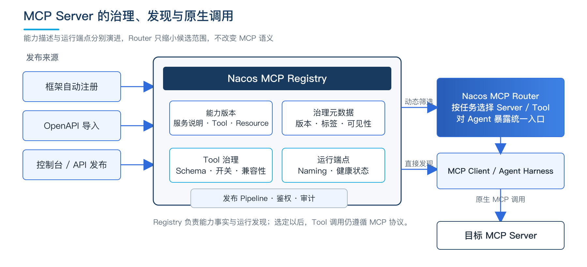

图 16-1　Nacos MCP Registry、MCP Router 与原生调用关系

### 15.4 Agent Registry：可调用 Agent 的注册、版本与发现

多 Agent 系统中的协作对象可能由不同团队、框架和运行环境提供。如果上游 Agent 只能保存固定 URL，它无法及时感知下游 Agent 的版本变化、端点迁移和可用状态，也难以根据能力描述选择合适的协作方。Agent Registry 的作用，是为可以被远程发现和调用的 Agent 提供统一登记与查询入口。

#### 15.4.1 Agent 描述、版本与运行端点

Agent Registry 管理的核心对象是带版本的 Agent 调用描述。公共部分通常包括名称、用途、提供者、能力、输入输出类型和可用调用接口；协议相关内容则保留为相应协议的原生描述。例如，Agent-to-Agent（A2A）协议使用 AgentCard，其他 Agent 通信协议可以使用各自的描述形式。调用描述是上游应用理解一个 Agent 的基础，但它不是 Agent 的完整实现，也不包含运行过程中使用的全部 Prompt、Skill 和模型配置。

Agent 的逻辑版本与运行端点应分开表达。修改能力描述、输入输出类型、安全要求或协议原生描述时，应形成新的 Agent 版本；同一版本增加实例、迁移区域或替换故障端点，则属于运行状态变化。上游 Agent 可以固定某个版本，也可以使用默认发布版本，但运行记录最终需要保存实际选择的版本、协议和端点。

对于同一 Agent 的多个版本，Registry 应明确哪个版本可以被普通调用方发现，哪些版本只用于测试或小范围验证。旧版本下线前，需要确认是否仍有上游 Agent、工作流或外部应用依赖。

#### 15.4.2 注册、导入与订阅

使用框架构建的 Agent 可以在启动时自动注册 AgentCard 和当前端点，并在停止服务时注销；自定义 Agent 可以通过 SDK 或 API 发布；外部提供商的 Agent 也可以由平台导入后统一治理。不同来源最终都应补充内部负责人、Namespace、可见范围和版本状态。

自动注册需要处理“能力版本已经发布，但当前没有可用端点”和“端点仍在运行，但版本已经撤回”等情况。Registry 查询结果应同时考虑 AgentCard 状态、端点状态和当前调用权限，不能仅凭存在一条记录就认为 Agent 可以调用。

调用方可以按名称查询或订阅已知 Agent 的变化。订阅适合长期协作关系，当默认版本或端点集合变化时，上游 Agent 可以更新本地缓存。任务执行过程中仍应保持已选择版本稳定；端点故障时可以在同一版本的健康实例间切换，并在 Trace 中记录实际端点。

#### 15.4.3 Agent Registry 与 AgentSpec Registry

Agent Registry 和 AgentSpec Registry 管理的是两个不同层次：

| 对象 | 主要回答的问题 | 典型内容 | 主要使用者 |
| --- | --- | --- | --- |
| Agent Registry | 现在有哪些 Agent 可以被发现和调用 | Agent 定义、协议原生描述、版本、运行端点和可见范围 | Multi-agent 应用、Agent 协议客户端、上游 Agent |
| AgentSpec Registry | 一个 Agent 应如何被描述、组装或分发 | Manifest、Prompt、Skill、MCP 引用、运行配置和资源文件 | Agent 平台、开发工具、构建与部署系统 |

AgentSpec 可以声明一个 Agent 依赖哪些 Prompt、Skill 和 MCP Server，并在构建或部署阶段解析为锁定清单；Agent Registry 则暴露已经运行或可以远程调用的 Agent。一个平台可以先根据 AgentSpec 构建 Agent，再把其 AgentCard 和运行端点注册到 Agent Registry，但两者不应共用同一个版本号来代替各自记录。

#### 15.4.4 发现与原生调用的边界

当调用方已经知道目标 Agent 名称时，可以直接查询 Agent Registry，也可以通过 ARD 的统一资源获取方式读取目标 Agent。调用方只知道任务需求时，可以先由 ARD 跨 Prompt、Skill、MCP Server 和 Agent 等类型形成候选；选中 Agent 后，仍可继续通过 ARD 获取其具体资源信息。

当任务还需要解析远程调用接口、协议原生描述和当前可用端点时，可以进一步使用 RAD 的协议无关发现能力。RAD 是 Agent 远程发现的专门机制，但不是 ARD 获取 Agent 的唯一通道。发现完成后，实际消息交换、任务状态和结果返回仍由 A2A 等 Agent 通信方式负责。动态发现的完整过程将在 16.8 节进一步讨论。

#### 15.4.5 Nacos A2A Registry 与 AgentSpecs Registry

Nacos 从 3.1.0 开始提供 Agent 管理能力，也称 A2A Registry。它以 A2A AgentCard 为核心，并在此基础上补充 Nacos 所需的管理信息。Agent 由 Namespace 与名称唯一标识，可以同时保存多个版本，并指定一个默认发布版本；调用方既可以取得默认版本，也可以按版本号查询确定内容。

使用 Spring AI Alibaba 构建的 Agent 可以自动注册，自定义 Agent 可以通过 SDK 或 API 发布，外部提供商的 Agent 也可以导入后统一管理。调用方可以通过 Spring AI Alibaba、Nacos Client、API 或控制台查询 Agent，并在支持的客户端中订阅版本与端点变化。这样，上游 Agent 不需要把协作对象固化为一个长期不变的 URL。

Nacos 同时提供 AgentSpecs Registry，用于管理面向平台、开发工具和 AI 应用分发的 Agent 规范包。AgentSpec 可以通过 ZIP 包导入，也可以通过草稿创建接口逐步完善；完成审核、发布、标签和上下线后，再由运行时按名称、版本或标签获取。它解决“一个 Agent 应如何描述和组装”；A2A Registry 则解决“当前有哪些 Agent 可以被发现和调用”。

两类 Registry 结合后，可以形成从规范分发到运行发布的连续关系：平台先根据 AgentSpec 准备 Prompt、Skill、MCP 等依赖并构建 Agent，再把 AgentCard、版本和端点注册到 A2A Registry。Nacos 负责版本与地址的发现，任务消息仍由 A2A 处理，避免注册中心与通信协议职责重叠。

#### 15.4.6 Nacos 3.3 的协议无关远程 Agent 发现

Nacos 3.3 版本线在既有 A2A Registry 基础上，已经初步完成协议无关的远程 Agent 发现能力，并以 RAD（Remote Agent Discovery）0.1.0 抽象公共发现语义。这里的“协议无关”并不是取消协议，而是由发现层使用稳定的公共模型表达 Agent、版本、调用接口与运行端点；每个调用接口仍保留协议名称、协议版本和协议原生描述，实际消息、任务、会话与流式交互继续由 A2A 等相应客户端完成。HTTP、gRPC 和 SDK 是同一组发现语义的不同接入方式。

RAD 将远程 Agent 从候选检索到运行端点维护划分为五类操作：

| 操作 | 主要作用 | 返回或维护的内容 |
| --- | --- | --- |
| Search | 在 Agent 集合中筛选候选 | 名称、描述、标签、在线版本和支持的协议，不返回完整协议描述与端点 |
| Discover | 解析选定 Agent 的版本与调用方式 | 精确在线版本、内容摘要、协议原生描述，以及声明端点和运行端点的完整快照 |
| Watch | 感知同一发现结果的变化 | 复用 Discover 的请求与完整替换快照；客户端可以通过轮询实现本地订阅 |
| Register | 发布当前 Agent 实例的运行地址 | 同一发布者在指定 Agent 与协议下的完整 Endpoint Batch、运行版本和兼容版本范围 |
| Deregister | 撤销发布者维护的运行地址 | 从发布者期望状态中移除端点；全部移除后注销整份运行发布 |

这种划分使“可能适合”与“当前可以调用”成为两个不同判断。Search 只返回轻量目录信息，用于按名称、标签和协议等条件形成候选集合，并不承诺候选当前具有健康端点。调用方选定 Agent 后，再由 Discover 解析精确在线版本，并按照协议、协议版本、传输方式和端点来源等条件取得调用快照。对于运行端点，RAD 同时记录部署实现版本及其可服务的 Agent 版本范围，避免版本升级期间把不兼容实例返回给调用方。

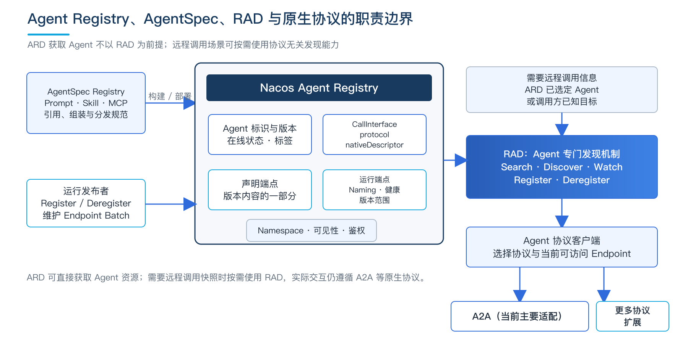

图 16-2　Agent Registry、AgentSpec、RAD 与原生协议的职责边界

在 Nacos 的实现中，ARD 可以跨 Prompt、Skill、MCP Server 和 Agent 等资源形成候选，并继续通过统一的资源获取方式读取具体 Agent。对于需要远程调用信息的场景，RAD Search 复用 AI Resource Search 的公共检索内核，并把资源类型限定为 Agent；Discover 则返回所选版本的调用接口、协议原生描述和当前端点。由此，RAD 成为 ARD 发现 Agent 时可选的专门实现路径，而不是与 ARD 平行或竞争的另一套资源发现体系。

Agent 定义、版本内容和运行 Endpoint 也保持相互独立：版本上下线改变发现投影，Register、Deregister 及发布者存活状态维护运行地址，不通过端点变更覆盖已发布的 Agent 定义。调用方如果只需要 Agent 资源详情，可以停留在 ARD 的统一获取流程；只有在需要可调用快照、运行端点或协议选择时，才进入 RAD 的远程发现流程。

当前社区的 Agent 间通信主要围绕 A2A 等协议展开，其中 A2A 已获得较为广泛的关注与应用。因此，Nacos 当前主要以 A2A 完成协议适配，同时通过协议无关的公共模型和发现接口保留扩展能力，使其他 Agent 通信协议能够携带各自的原生描述，并接入统一的注册、发现与端点管理流程。这一能力在 3.3 版本线中属于初步完成，后续扩展重点是增加协议适配，而不是重新建立一套与现有 Agent Registry 分离的资源模型。

### 15.5 变更评审：能力资产变更如何进入评估流水线

Prompt、Skill、MCP Server、Agent 和 AgentSpec 的内容形式不同，但它们的变更都会影响 Agent 行为。只完成版本留存，并不能证明一个新版本适合进入生产环境。企业还需要一条公共评审路径，把格式检查、安全检查、任务评测、人工判断和发布操作连接起来。

公共评审路径不要求所有资源使用完全相同的检查内容。一项资源可以进入 Registry 自带的发布 Pipeline，也可以由外部系统完成补充评测，再把结果关联到资源版本。本节讨论的是一致的评审原则和记录要求；Nacos 3.3 版本线对五类资源的 Pipeline 接入方式及其差异将在 16.5.6 节说明。

#### 15.5.1 从草稿到在线版本

能力资产的推荐发布过程如图 16-3 所示。

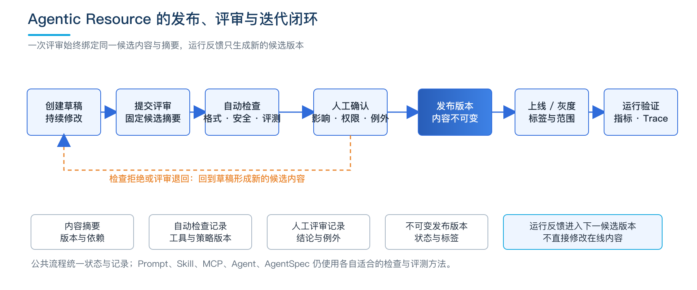

图 16-3　Agentic Resource 的发布、评审与迭代闭环

草稿允许作者持续修改，但不会被普通运行时查询返回。提交评审后，系统固定本次候选内容和摘要，后续检查都针对同一份内容进行。任一检查要求修改时，版本回到草稿阶段；已发布版本保持不变。

评审通过和正式上线也应区分。评审通过表示候选内容满足当前发布条件；发布形成不可变版本；在线状态和标签则决定运行时是否可以发现和获取。这样可以提前准备版本，在计划的时间或范围内再启用。

#### 15.5.2 自动检查与人工判断

发布 Pipeline 可以由多个有序检查节点组成。基础节点先检查格式、必填元数据和引用完整性，随后执行安全扫描、依赖检查和任务评测；某一节点拒绝后，后续节点不再执行，并返回可理解的原因。

检查过程不应修改候选内容。自动修复可能使最终发布内容与作者提交、评测和人工查看的内容不一致。需要调整时，应回到草稿形成新的候选摘要，再重新执行检查。

自动结果也不能完全代替人工判断。工具可以发现 Schema 错误、已知危险模式和评测指标下降，但资源负责人仍需确认修改目的、业务影响、必要权限、迁移方案和已知限制。对跨团队共用或影响范围较大的资产，还应让主要使用方参与确认。

#### 15.5.3 不同资源的评估重点

统一 Pipeline 不意味着所有资源使用同一组检查。公共流程负责状态和记录，不同资源仍需选择适合自身的评估方法。

| 资源类型 | 主要变更风险 | 自动检查与评测重点 | 人工评审重点 |
| --- | --- | --- | --- |
| Prompt | 指令行为、变量和输出格式变化 | 模板渲染、Schema、固定评测集、模型兼容性、安全输入 | 业务规则、错误样例和输出边界 |
| Skill | 步骤、脚本、依赖和权限范围变化 | 包完整性、脚本与依赖扫描、隔离执行、代表性任务 | 方法正确性、必要权限、来源和维护责任 |
| MCP Server | Tool Schema、描述、协议和端点要求变化 | Schema 差异、协议连接、认证、超时、工具选择与调用样例 | 兼容性、数据范围、限流和迁移安排 |
| Agent | AgentCard、能力和远程行为变化 | AgentCard 校验、端点可达性、协议兼容、任务成功率、延迟与成本 | 协作边界、结果责任、权限和失败处理 |
| AgentSpec | 组装配置和资源引用变化 | Manifest、依赖解析、版本锁定、构建与启动验证 | 资源组合、环境适用性和升级范围 |

同一变更可能需要多类评测。例如，AgentSpec 更新了 Prompt 和 MCP 引用，既要确认依赖可以解析，也要执行端到端任务，观察新的资源组合是否改变 Agent 行为。评估流水线应允许资源类型提供专属节点，同时保留组织统一的审计和发布规则。

#### 15.5.4 评测结果与版本绑定

一份可用于发布决策的评测记录，至少应关联资源类型、逻辑名称、候选版本、内容摘要、评测集版本、模型或运行时版本、策略版本、检查工具版本和执行时间。人工意见还需要记录评审者、结论、例外事项和适用环境。

如果内容、依赖或关键运行条件发生变化，原评测结果不能继续沿用。即使资源版本号未变，摘要不一致也应停止发布。评测工具或安全策略发生重要升级时，平台可以对已在线版本重新检查，并在发现问题后限制继续分发。

紧急场景可以提供管理员强制发布能力，但必须记录原因、风险接受人、影响范围和恢复目标。强制发布跳过了部分正常检查，不应成为日常修改的替代方式；上线后还需要提高观察强度，并尽快补充缺失的验证。

#### 15.5.5 发布后的验证与反馈

离线评测无法覆盖全部生产输入。候选版本完成评审后，可以进入第 15 章介绍的灰度或 A/B Test 流程，在受控范围内比较任务成功率、人工修正率、延迟、成本和安全事件。实验系统负责流量分配和统计分析，本章负责保证每组流量对应确定的资源版本及 Context 记录。

运行指标和 Trace 由第 13 章的观测能力采集，再按资源版本关联到发布记录。发现异常时，可以停止灰度、移动标签或恢复到已验证版本。运行反馈可以生成新的改进建议和候选草稿，但不能直接修改在线内容；所有变化仍需重新经过版本、评测和发布流程。

#### 15.5.6 Nacos AI 发布 Pipeline

Nacos AI 发布 Pipeline 把审核、扫描和拦截放在 AI 资源正式发布之前。一次发布会先创建执行记录，再按照资源类型选择匹配节点并按顺序运行；全部通过后继续发布，任一节点拒绝后停止后续执行，候选版本保持未发布状态。管理员可以在应急场景下强制发布，但该操作会跳过 Pipeline，应保留明确的原因和审计记录。

Pipeline 节点可以分别声明支持的资源类型。Nacos 3.3 版本线已经把 Skill、Prompt、MCP Server、AgentSpec 和 Agent 纳入通用 Pipeline 框架。Agent 提交时以 `AGENT` 资源类型进入审核；存在匹配的 Agent Pipeline 时，版本从 `draft` 进入 `reviewing` 并执行相应节点，没有配置匹配 Pipeline 时则按照无 Pipeline 的发布路径处理。由此，通用框架能够覆盖 Agent，但具体检查内容仍由所配置的 Pipeline 插件决定。

Agent 的资源校验与远程行为评测仍需区分。Pipeline 可以检查版本内容、调用接口、协议描述、依赖、安全要求和组织自定义规则；任务成功率、延迟、成本以及跨 Agent 协作效果等运行评测，可以由外部评测系统完成，再把结果关联到同一 Agent 版本。统一流程提供一致的生命周期、执行记录和发布判断，并不要求所有评测都在 Registry 内部运行。

Nacos 默认插件集合中的 `skill-scanner` 可以处理 Skill、Prompt 和 AgentSpec 中可扫描的内容，也可以通过自定义 Pipeline 接入组织已有的安全扫描、格式校验、合规检查或人工系统。由于检查针对固定的候选内容执行，评审结论能够与版本和摘要对应，避免发布内容在检查完成后被静默替换。

对 Agentic Resource Registry 而言，Pipeline 使“资源已经登记”和“资源允许进入生产范围”成为两个不同状态。Registry 提供资源事实和生命周期，Pipeline 提供发布条件；两者组合后，Agent 的发现结果才能限制在已经通过当前组织要求的版本中。

### 15.6 资源中心：统一治理与原生消费

分别讨论 Prompt、Skill、MCP Server、Agent 与 AgentSpec 后，可以看到它们既有共性，也有不可合并的差异。资源中心的目标，是为不同能力提供统一的标识、生命周期、权限、评审和运行时入口，而不是把这些资源改造成同一种内容，更不是用一种协议替代它们各自的使用方式。

#### 15.6.1 逻辑资源、版本与运行引用

一项资产需要同时表达“它是谁”和“它的内容是什么”。逻辑资源拥有稳定名称、所属 Namespace、类型和负责人；资源版本表示某一次已经固定的内容，拥有独立版本号、内容摘要、提交记录和状态。

| 资源类型 | 版本中的主要内容 | 运行时使用方式 |
| --- | --- | --- |
| Prompt | 指令、模板、变量和输出要求 | 解析版本后渲染，并进入 Context |
| Skill | 使用说明、脚本、模板、资料和依赖 | 下载并校验能力包，由 Skill Loader 按需加载 |
| MCP Server | 能力描述、Tools、Resources、协议和版本信息 | 解析端点，通过 MCP 连接并调用 |
| Agent | Agent 定义、能力、调用接口、版本和连接要求 | 发现运行端点，通过相应原生协议协作 |
| AgentSpec | Agent 组装配置、资源引用和附属文件 | 在构建、部署或启动阶段解析为实际依赖 |

Agent 不应通过偶然的文件路径或固定地址保存依赖，而应使用结构化引用，包含 Namespace、资源类型、资源名称和版本选择方式。版本选择可以是精确版本、服务端维护的 `latest`，也可以是 `stable`、`canary` 等组织自定义标签。Resolver 接收引用后，将其解析为唯一版本和内容摘要；运行记录必须保存解析结果，不能只记录标签名称。

版本保持不变并不意味着每次更新都要修改所有 Agent 配置。资源中心可以移动标签，或者调整 Agent 与版本之间的绑定关系。已经发布的内容不能被覆盖，否则历史评测、问题追踪和运行记录所引用的版本将失去意义。

#### 15.6.2 生命周期、可见范围与影响关系

在通用治理模型中，版本可以经历草稿、评审中、已评审、在线和离线等状态；逻辑资源还可以整体启用或停用。不同资源可以复用这些状态及其审计语义，但具体转换路径、检查内容和运行时条件仍由资源类型决定。下线不等于删除，历史版本仍可用于审计、回滚或按权限查询。

在线版本只有在当前身份可见、具备读取权限且环境符合要求时，才能被运行时发现。可见范围用于决定资源是否出现在详情、列表和搜索结果中，鉴权用于决定调用方能否读取、修改或发布，两者承担不同作用。Namespace 或等价的隔离单元还可以区分环境、租户和业务域，避免测试资源与生产资源进入同一发现范围。

资源中心还应维护双向引用关系：从 Agent 或 AgentSpec 出发，可以查看它依赖了哪些 Prompt、Skill 和 MCP Server；从某个资源版本出发，可以确定发布、停用或撤回它将影响哪些 Agent。只有保存这些关系，变更评审和风险处置才能准确判断影响范围。

#### 15.6.3 资源中心的内部组成

资源中心可以由以下部分共同构成：

```text
管理与发布 ──> 权威 Registry ──> AI 资源内容存储
                    │                    │
                    ├──> 发布 Pipeline  │
                    ├──> 发现索引       │
                    │                    │
Agent 请求 ──> Policy Engine ──> Resolver ──> 精确版本与内容摘要
```

| 组成部分 | 主要职责 |
| --- | --- |
| 权威 Registry | 保存逻辑资源、版本、状态、标签、权限和引用关系，是判断资源是否存在、是否可用的依据 |
| AI 资源内容存储 | 保存 Prompt 正文、Skill 包、AgentSpec 包及其他大体量内容，并通过摘要与版本关联 |
| 发布 Pipeline | 执行格式检查、安全检查、评测和组织自定义的发布条件 |
| 发现索引 | 保存名称、能力描述、分段内容、向量和资源关系，为人工搜索和动态发现提供检索能力 |
| Policy Engine | 根据身份、Namespace、环境、权限和风险等级判断资源是否可以查看或使用 |
| Resolver | 将逻辑引用或标签解析为不可变版本，返回内容位置、摘要、依赖和状态信息 |

这些部分可以部署在同一系统中，也可以由多个服务共同实现。重要的是职责清晰：检索结果不能替代版本解析，AI 资源内容存储中存在文件也不表示该版本仍然可用，运行端点健康也不表示当前身份具备调用权限。

#### 15.6.4 权威数据与派生索引

为支持语义搜索，资源中心会从名称、描述、正文和代表性问题生成 Document、Chunk 或向量索引。这些数据服务于检索效率，可以在分段策略、模型或索引引擎变化后重新生成，因此属于派生数据。资源版本、状态、权限和内容摘要仍以 Registry 中的记录为准。

索引任务应记录来源版本、分段策略和向量模型，并通过可重复执行的增量任务、失败重试、Backfill 和定期核对保持收敛。旧索引即使检索到已经下线的资源，返回前仍需根据 Registry 的当前状态再次判断。发现描述和正文来自不同版本时，应拒绝生成混合索引。

#### 15.6.5 管理链路与运行链路

资源编辑、评审、扫描和索引生成会消耗较多时间，运行中的 Agent 则要求快速、稳定地解析已发布版本。因此，管理链路与运行链路应在接口和容量上分开。管理链路处理创建、修改、评审、发布、废弃和撤回；运行链路只向符合条件的 Agent 提供查询、解析、下载、端点发现和变更通知。

运行链路还需要支持本地缓存，并让缓存项与精确版本和摘要绑定。当资源中心暂时不可用时，Agent 可以按策略继续使用缓存中的已验证版本；不允许使用旧版本的高风险任务则应停止执行并说明原因。无论采用何种方式，都不能把一次查询失败解释为“使用任意可用内容”。

统一资源中心解决了能力资产在哪里、哪些版本可以使用以及如何取得的问题。对于依赖稳定的 Agent，明确声明资源引用即可；对于任务范围变化较大的 Agent，则还需要根据当前任务寻找合适能力。

#### 15.6.6 Nacos Agentic Resource Registry 最佳实践

Nacos AI Registry 为上述资源中心架构提供了一个具体参考。它在同一平台中管理 Prompt、Skill、MCP Server、Agent 和 AgentSpec，使不同资源复用 Namespace、版本、标签、状态、可见性、鉴权和 Pipeline 框架，同时保留各自的内容结构、检查方法与消费协议。Nacos 因而不是把 AI 资源简单保存成普通配置或普通服务，而是在 Config 与 Naming 等基础能力之上补充面向 Agentic Resource 的统一模型。

在 Nacos 的通用模型中，一项 AI 资源由 `namespaceId + resourceType + resourceName` 标识，具体版本再增加 `version`。逻辑资源保存描述、可见范围、业务标签和编辑信息，资源版本保存具体内容、作者、状态、发布信息和存储位置。Agent、MCP Server 等具有运行地址的资源还会关联端点或实例状态，但地址变化不会覆盖已经发布的能力版本。`draft`、`reviewing`、`reviewed`、`online` 和 `offline` 等状态进一步区分内容编辑、评审、发布和运行时可发现范围。

共用治理框架并不意味着五类资源的行为完全相同。其主要差异可以概括如下：

| 资源 | 主要版本内容 | Pipeline 重点 | 发现与原生消费 |
| --- | --- | --- | --- |
| Prompt | 模板、变量与输出约束 | 渲染、Schema、评测集和安全输入 | 按版本或标签读取，由 Prompt Resolver 渲染 |
| Skill | `SKILL.md`、脚本、资料与依赖 | 包完整性、来源、脚本和依赖安全 | 搜索或下载能力包，由 Skill Loader 按需加载 |
| MCP Server | 服务说明、Tool、Resource 与协议信息 | Schema、协议兼容、认证和调用样例 | 通过 Registry 或 Router 发现，由 MCP Client 调用 |
| Agent | 版本化调用接口、协议原生描述与声明端点 | 内容校验、接口与协议、安全要求；运行行为由外部评测补充 | ARD 可以发现并获取资源，RAD 可按需解析远程调用信息，再由协议客户端交互 |
| AgentSpec | Agent 组装配置、资源引用与附属文件 | Manifest、依赖解析、版本锁定和构建验证 | 在构建、部署或启动阶段解析为实际依赖 |

其内部关系如图 16-4 所示。

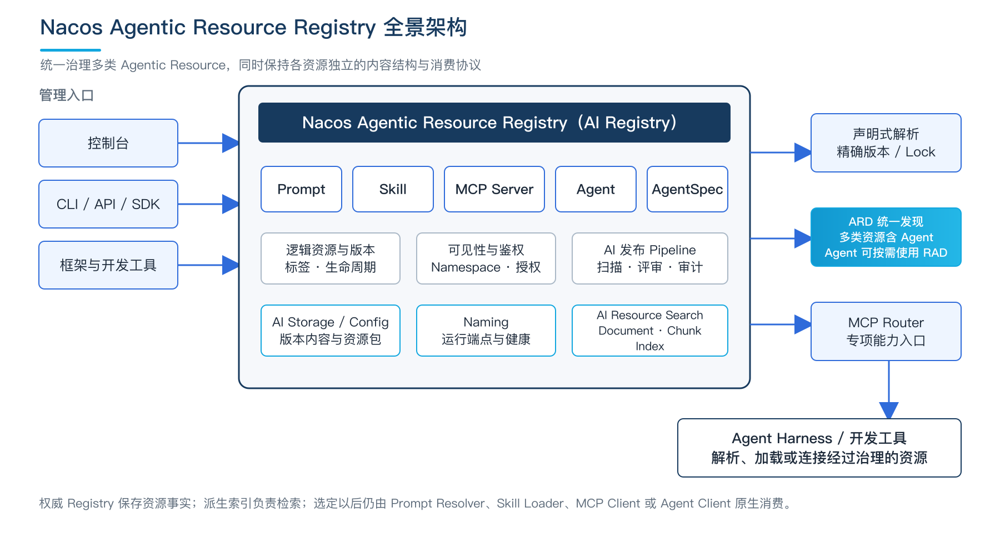

图 16-4　Nacos Agentic Resource Registry 全景架构

Nacos AI Registry 保存逻辑资源、版本、状态、标签、可见范围和发布信息，是资源治理的权威记录；AI Storage 保存 Skill、AgentSpec 等资源包及其他大体量内容；Config 与 Naming 分别承接动态内容和运行实例发现；AI 发布 Pipeline 在资源发布前执行适用于相应类型的扫描、审核与自定义检查。运行侧可以通过 Client API、生态框架集成、MCP Router 或 ARD 取得版本内容和候选资源；当所选 Agent 需要远程调用信息时，还可以通过 RAD 解析调用接口和可用端点。选定以后，资源仍由 Prompt Resolver、Skill Loader、MCP Client 或 Agent 协议客户端原生消费。

在 Nacos 3.3 版本线的 ARD 能力中，AI Registry 中的标准资源保持权威数据地位，Document、Chunk 和 Embedding 作为可重建的派生数据。Skill 的 `SKILL.md`、Prompt 模板，以及 MCP Server 的服务说明、Tool 与 Resource 描述都可以成为索引材料；分段策略或向量模型变化时，只重建索引，不修改原资源版本。ARD 的检索范围也包括 Agent，并可以继续取得具体 Agent 资源。RAD 在此基础上提供远程 Agent 的专门发现方式，在需要时返回协议原生描述与当前 Endpoint；它是 ARD 处理 Agent 调用信息的一种实现路径，而不是另一套相互竞争的发现体系。

Nacos 的优势不在于把五类资源放进同一张列表，而在于把资源事实、发布治理和运行发现连成同一条链路：

| 工程问题 | Nacos 的对应能力 | 带来的直接变化 |
| --- | --- | --- |
| 多类资源分散维护 | AI Registry 统一管理 Prompt、Skill、MCP Server、Agent 和 AgentSpec | 团队可以用一致入口盘点、检索和分发资源 |
| 版本与环境混用 | Namespace、不可变版本、标签、上线状态和可见范围 | 测试与生产边界更清晰，运行结果可以定位到具体版本 |
| 发布质量缺少统一记录 | AI 发布 Pipeline 与资源生命周期 | 扫描、审核、拒绝和强制发布能够关联候选版本 |
| 能力定义与运行地址变化节奏不同 | AI Registry 结合 Config 与 Naming | 资源版本和端点状态可以分别演进 |
| Agent 接入方式多样 | CLI、API、SDK、Spring AI Alibaba、MCP Router 等入口 | 高代码框架、开发工具和通用 Agent 可以复用同一资源来源 |
| 任务开始前仍需人工选择资源类型 | ARD 按意图发现，Agent 场景可按需使用 RAD | Agent 可以从任务事实出发寻找已经治理的能力，并在需要远程调用时解析协议与端点 |

这些能力共同构成 Nacos 从微服务注册配置平台向 Agentic Resource Registry 演进的基础。管理链路可以通过控制台、CLI 和 API 完成编辑与发布，运行链路可以通过客户端、框架集成和专项 Router 进行解析与连接；Agent 是否缓存、何时切换版本以及怎样把内容装入 Context，仍由调用端根据任务边界决定。后续两节将分别说明，稳态 Agent 如何使用这一 Registry 解析明确依赖，动态 Agent 又如何在其上进行按任务发现。

### 15.7 稳态 Agent：通过声明式依赖获取能力

稳态 Agent 是指职责和主要依赖在发布前已经明确、运行期间变化较少的 Agent。这里的“稳态”不表示所有内容都必须写入代码，而是表示它使用哪些 Prompt、Skill、MCP Server 和协作 Agent，可以通过配置或 AgentSpec 预先声明。客服分类、合规审核和固定流程的数据处理 Agent，通常属于这一类型。

无论 Agent 由 AgentScope、LangChain、LangGraph 等高代码框架构建，还是运行在 Coding Agent、Harness Agent 等通用智能体中，其资源获取过程都可以归纳为“声明引用、解析版本、校验内容、加载或连接、记录结果”。框架差异主要体现在接入位置，并不改变版本和运行记录要求。

#### 15.7.1 三种绑定时机

稳态 Agent 可以在构建、部署或启动阶段取得依赖。三种方式的区别在于版本何时确定，以及更新资源是否需要重新交付 Agent。

| 方式 | 版本确定时间 | 优点 | 需要注意的问题 | 适用场景 |
| --- | --- | --- | --- | --- |
| 构建期绑定 | 制作代码包或镜像时 | 内容与 Agent Release 一起固定，离线可用，复现路径清晰 | 更新依赖需要重新构建和发布 | 高确定性、离线或变更频率较低的 Agent |
| 部署期解析 | 发布到具体环境前 | 同一 AgentSpec 可按环境解析，发布物中保存锁定清单 | 持续集成与持续交付（CI/CD）系统需要访问资源中心并完成依赖校验 | 多环境部署、需要统一发布管理的 Agent |
| 启动期拉取 | 实例启动或任务开始前 | 资源可以独立更新，交付速度较快 | 依赖资源中心可用性，需要缓存和一致性策略 | 需要集中维护、更新较频繁的 Agent |

构建期绑定可以把精确版本和摘要写入镜像或安装包，同时保存资源来源。即使 Registry 中的标签已经移动，已构建版本仍然使用原内容。部署期解析则由 CI/CD 根据 AgentSpec 查询资源中心，把逻辑引用转换为精确版本，生成 Lock Manifest 后再部署。

启动期拉取允许 Agent 在启动时解析组织自定义的 `stable` 标签并下载内容或查询端点。需要较快响应更新时，也可以监听标签、资源状态或端点变化；但收到更新不表示立即替换当前任务中的内容。平台应先完成下载、摘要校验、兼容性检查或连接验证，再在下一个清晰的任务边界启用新版本。

#### 15.7.2 声明式依赖解析

稳态 Agent 通常不需要先做语义搜索。AgentSpec 已经给出所需资源的名称，运行时要做的是把声明解析为可使用的具体版本。例如：

```yaml
agent: incident-summary
resources:
  prompts:
    - namespace: ops
      name: incident-summary
      version: 2.3.1
  skills:
    - namespace: ops
      name: log-normalization
      label: stable
  mcpServers:
    - namespace: ops
      name: observability
      label: stable
```

Resolver 首先根据调用身份和目标环境检查可见范围，再解析精确版本或标签，验证生命周期、兼容条件和依赖，最后返回内容位置、摘要或运行端点。Skill Loader、Prompt Resolver 或 MCP Client 取得资源后再次校验，并把实际结果写入 Lock Manifest 或运行记录。

这一路径的重点是确定性，而不是搜索范围。即使配置使用标签，运行记录仍应保存当时解析出的版本，不能只留下标签名称。MCP Server 和 Agent 还应记录实际连接的端点，使版本变化和运行实例变化能够分别分析。

#### 15.7.3 与不同 Agent 形态集成

高代码 Agent 可以通过 SDK 在初始化阶段调用 Resolver，把 Prompt 模板、Skill 目录或 MCP 连接信息注入框架已有的加载流程；CI/CD 可以使用 CLI 在构建或部署阶段生成锁定清单；多个运行时共享同一套资源能力时，也可以通过 Sidecar 或内部服务统一处理下载、缓存和更新通知。

通用智能体通常已经具备本地指令目录、Skill 目录或 MCP 配置机制。资源中心可以通过同步组件把已解析版本放入这些原生位置，并保存来源和摘要；也可以由 Harness 在每次启动时完成解析。接入不应要求框架放弃原有使用方式，而应在加载或连接之前补充统一的版本、权限和完整性检查。

无论采用哪种集成方式，都需要避免同名本地文件静默覆盖 Registry 版本。如果允许开发者在本地调试修改，应把它标记为未发布内容，并在运行记录中明确区分，不能继续沿用已发布版本号。

#### 15.7.4 更新与异常处理

运行节点收到资源更新后，应先在旁路位置完成下载和校验，确认运行时、工具、依赖和端点均可满足，再切换到新版本。一个任务已经开始后，Prompt 和 Skill 版本原则上保持稳定；需要跨越多个小时或多天的工作流，可以在阶段边界重新解析，但应在 Trace 中记录切换点。

获取失败时的处理取决于资源性质。非关键说明可以继续使用本地已验证版本并产生告警；涉及安全策略或法规要求的 Prompt 可能不允许使用过期缓存，此时应暂停新任务。缓存内容同样需要校验摘要和有效状态，不能因为位于本地就绕过撤回信息。

#### 15.7.5 使用 Nacos 获取稳态依赖

Nacos 可以分别承接三种绑定时机。构建阶段，CI/CD 通过 CLI 或 API 下载确定版本的 Prompt、Skill 和 AgentSpec，并把版本与摘要写入发布物；部署阶段，平台根据目标 Namespace 解析标签和依赖，生成环境对应的锁定清单；启动阶段，Agent 通过客户端 API 查询当前在线版本，同时从 MCP Registry 或 A2A Registry 获取可用端点。

对于高代码框架，可以在初始化模块中直接接入 Nacos Client 或 Spring AI Alibaba，把取得的 Prompt、Skill 包、MCP Server 和 AgentCard 转换为框架原生对象。对于 Coding Agent、开发工具或其他通用 Agent，可以通过 Nacos CLI 搜索和安装 Skill，通过客户端 API 获取 AgentSpec，并由 MCP Router 提供统一 MCP 入口，再交给原有 Harness 完成加载。

标签使资源与 Agent 应用可以独立发布，但生产 Agent 不应在每轮模型调用前重新解析标签。较稳妥的做法是在构建、部署、启动或任务开始等明确边界解析一次，将 Nacos 返回的精确版本写入 Lock Manifest。MCP 与 Agent 的端点可以在同一版本内根据健康状态切换，资源内容版本则保持不变。

Nacos 提供权威资源和动态发现能力，不代替应用决定缓存时长与失败策略。运行节点需要保存最近一次已验证版本，并根据资源是否允许使用过期内容，选择继续运行、停止新任务或等待 Registry 恢复。这样既能利用 Nacos 的动态更新，又能避免控制面瞬时故障直接破坏正在执行的任务。

由此可见，稳态 Agent 的资源发现本质上是声明式依赖解析。它适合职责稳定、变更可预期的系统；当 Agent 面对开放任务，事先无法列出所有可能需要的能力时，则需要在相同治理基础上增加按任务发现。

### 15.8 动态 Agent：通过 ARD 与 RAD 按任务发现能力

动态 Agent 的任务范围会随用户请求和运行状态变化。例如，一个通用运维 Agent 可能先处理容器异常，随后转向数据库性能或发布变更分析。它无法在发布前准确列出每一次任务所需的 Prompt、Skill、MCP Server 或协作 Agent。如果把所有候选能力都预先绑定，不仅配置会持续膨胀，大量无关说明也会占用 Context，并增加模型选择错误能力的概率。

Agentic Resource Discovery（ARD）用于在调用之前，根据当前任务发现可能需要的能力资源。社区 ARD v0.9 系列以开放提案的形式定义面向多类 Agentic Resource 的描述、检索与联邦发现；Nacos 3.3 版本线则在 AI Registry 之上提供相应的按意图发现能力，可以检索 Prompt、Skill、MCP Server 和 Agent，并继续取得具体资源。ARD 位于 Agent 的意图判断与资源使用之间，回答“当前任务适合使用什么”，但不负责执行 Skill、调用 Tool 或代替另一个 Agent 完成工作。

#### 15.8.1 从任务事实形成能力需求

ARD 的输入不应只有一条未经处理的用户原文。Agent 可以结合当前目标、已有信息和运行限制，形成结构化的 Capability Requirement，其中包含任务描述、期望结果、数据类型、业务领域、环境、时效要求、允许的风险等级、可用权限和成本限制。

例如，“分析刚刚发布后订单接口延迟升高的原因”同时包含变更时间、目标系统、现象和诊断目的，比单独搜索“延迟分析”更有区分度。需求形成过程仍需保留用户原始意图，不能为了匹配资源而增加未经确认的业务事实。

涉及敏感字段时，也不必把完整数据发送到发现服务；可以使用类型、范围或经过保护处理的摘要表达发现所需条件。ARD 的目标是找到能力，不是取得任务全部数据。

#### 15.8.2 可重建索引与混合检索

资源发布后，可以从名称、能力描述、适用场景、代表性问题、标签和正文中生成统一的检索表示。一个资源首先形成 Document，保存资源身份、版本、摘要和检索元数据，再按照规则拆分为多个 Chunk。Skill 的说明、Prompt 模板以及 MCP Server 的服务说明、Tool 与 Resource 描述，都可以成为检索依据。

这些 Document、Chunk 和向量属于可重建的派生数据，权威 Registry 仍保存版本、状态、权限和内容摘要等权威记录。索引构建可以使用持久任务、幂等更新、失败重试、Backfill 和定期核对，使资源变化最终反映到发现结果中。

关键词检索适合名称、产品、错误码和确定术语；向量检索适合任务表达与能力描述之间的语义匹配；资源关系可以补充“某项 Skill 依赖某个 MCP Server”或“某个 Agent 已包含相应能力”等信息。系统可以融合多种召回结果，并对名称或业务术语的精确匹配提高权重。向量和大模型增强属于可选能力，即使没有启用，基础关键词检索也应能够工作。

发现结果中的相关性分数只表达候选与任务的匹配程度，不是安全评分，也不代表平台已经为资源质量作出保证。

#### 15.8.3 相关性排序与治理资格

相关性和使用资格是两个不同问题。相关性决定候选如何排序；治理规则判断调用方是否有权使用、资源是否在线、版本是否允许进入当前环境，以及风险和成本是否符合限制。高度相关但已经撤回或超出授权范围的资源，不应因为得分较高而出现在可用候选中。

治理判断可以分阶段进行。检索前先根据身份、Namespace 和资源类型缩小可见范围，避免不应暴露的资源进入搜索；得到候选后，再结合版本状态、显式授权、环境兼容性、风险等级和当前任务权限作最终判断。过滤应在最终分页之前完成，避免返回页数和总量泄露不可见资源的信息。

返回结果还应说明主要匹配依据、资源来源、版本状态和必要使用条件，使 Agent 或人工评审者能够理解选择原因。匿名访问也必须服从公开范围和最小权限要求，不能绕过治理判断。

#### 15.8.4 ARD 与 RAD 的层次关系

ARD 面向广义 Agentic Resource。任务尚未确定解决方式时，它可以跨类型发现 Skill、Prompt、MCP Server、Agent、API 或其他可描述资源。在 Nacos 中，ARD 不仅能够把 Agent 作为候选返回，还可以继续通过统一的资源获取方式读取具体 Agent；获取 Agent 并不必然经过另一套发现协议。

当任务需要把候选 Agent 转化为可远程调用对象时，问题会进一步收窄到版本、调用接口、协议和运行端点。Remote Agent Discovery（RAD）是 Nacos 为这一场景抽象的协议无关机制。在 Nacos 3.3 版本线中，这项能力已经初步完成：Search 可以按名称、标签和支持协议形成 Agent 候选目录；Discover 返回选定 Agent 版本的协议原生描述和当前可访问端点；Watch 感知发现快照变化；运行发布者通过 Register 与 Deregister 维护端点状态。

Agent Registry 是 RAD 的权威资源来源，保存 Agent 通用定义、版本和运行端点；A2A AgentCard 等协议描述作为相应调用接口的原生内容保留，而不是固化为 RAD 的公共模型。选定 Agent 后，真正的任务消息和状态交互仍由 A2A 等原生方式完成。类似地，ARD 找到 MCP Server 后由 MCP Client 使用，找到 Skill 后由 Skill Loader 加载，找到 Prompt 后由 Prompt Resolver 获取。

因此，ARD 与 RAD 不是平行或竞争关系。ARD 可以独立完成 Agent 的检索与具体资源获取；当调用方需要远程调用快照时，再按需使用 RAD 解析协议和端点。已知目标就是远程 Agent 的调用方也可以直接使用 RAD Search 或 Discover，这属于面向 Agent 场景的专门入口，并不改变 RAD 位于广义资源发现体系中的从属关系。两条路径始终复用同一 Agent 资源、版本、可见范围和权限语义。

#### 15.8.5 受控的动态发现与混合模式

动态发现不表示 Agent 可以自由获取任何外部内容。ARD 的候选以及 RAD 返回的 Agent 调用信息，都应限于资源中心中已经发布、符合当前身份和环境要求的资源。外部 Skill、MCP Server 或 Agent 只有完成内部准入并形成确定版本后，才能进入相应发现范围。Agent 选择候选也不会自动获得额外权限，实际加载和调用仍需经过当前任务授权。

生产系统通常采用固定依赖与动态发现相结合的方式。决定 Agent 身份、基本行为和安全边界的核心 Prompt，以及高频稳定的基础 Skill，可以通过 AgentSpec 固定版本或稳定标签；业务长尾能力、领域工具和临时协作 Agent 则按任务发现。

对于高风险操作，发现结果可以要求人工确认，或只返回能力说明而不允许自动加载。系统根据资源风险、任务环境和操作可恢复性确定自动化程度。动态 Agent 的灵活性由可发现资源范围提供，其边界仍由资源状态、权限和运行策略共同确定。

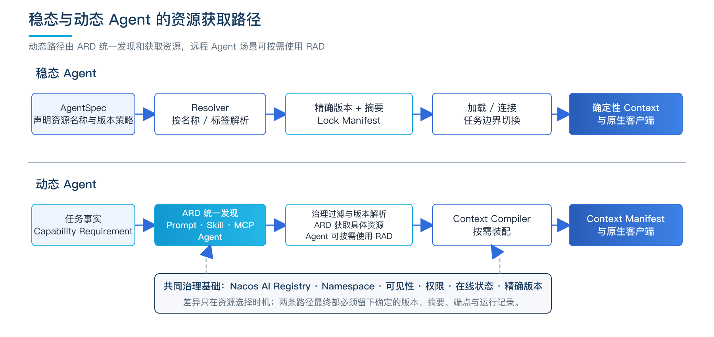

图 16-5　稳态与动态 Agent 的资源获取路径

#### 15.8.6 Nacos 从按类型管理走向按意图发现

Nacos AI Registry 已经能够分别管理 Prompt、Skill、MCP Server、Agent 和 AgentSpec，但传统查询通常仍从资源类型开始。调用方需要先判断要找 Skill、MCP 还是 Agent，再进入相应接口。Nacos 3.3 版本线的 ARD 能力在现有 Registry 之上增加按任务意图发现的适配层，使统一管理进一步延伸为统一发现。

其内部链路可以概括为：ARD Client 访问 ARD Adapter，Adapter 调用协议无关的 AI Resource Search，搜索层使用关系索引和可选向量能力，最终仍以 Nacos AI Registry 中的标准资源为权威数据。对外 ARD 接口定义与内部资源模型分开，使协议调整、检索策略变化和资源版本治理可以独立演进。

资源发布后，Nacos 从名称、描述、代表性问题和正文生成 Document 与 Chunk。关键词召回处理资源名、产品名和错误码等确定术语，向量召回补充语义匹配，再通过加权排序融合结果。向量和大模型增强均为可选能力；未启用时，关键词检索仍提供基础发现能力。派生索引通过任务、重试、Backfill 和核对逐步收敛，不能反向覆盖 Registry 中的标准资源。

候选返回前继续服从 Namespace、单资源授权、`latest` 指向和 `online` 状态。相关性只决定排序，治理规则决定候选是否有资格出现。这样，ARD 复用 Nacos 已有的资源状态与权限语义，不需要为了语义搜索再维护一套互相冲突的可见范围。

Nacos 3.3 版本线已经把 Agent 纳入 AI Resource Search 与 ARD 的发现范围，因此 ARD 可以返回 Agent 候选并继续获取具体资源。对于远程调用场景，调用方再按需使用 RAD 取得精确在线版本、调用接口与运行端点。RAD 不取代 ARD 的 Agent 获取能力，而是补充远程调用所需的专门语义。当前实现仍主要聚焦本地或私有 Registry；未配置上游 Registry 时，不能把本地查询表述为已经完成公共互联网的 Federation 或 Referral。

因此，Nacos 在动态 Agent 场景中的完整角色不是一个独立搜索框，而是“权威 AI Registry、可重建搜索索引、治理过滤和标准发现适配”的组合。Agent 从任务意图得到候选后，再通过 Nacos Client、MCP Router、Skill Loader 或 A2A Client 使用对应资源。

ARD 完成资源选择和获取后，必要时再由 RAD 补充远程 Agent 的调用信息。此时 Agent 已经知道本次任务可以使用哪些资源，但这些资源尚未自然地成为模型上下文。下一节将讨论如何在优先级、信任边界和 Token 预算约束下，把选择结果装配为可执行的 Context。

### 15.9 从发现结果到运行时 Context

资源发现只确定了本次任务可能需要哪些能力，不能把所有候选的完整内容直接拼接到系统提示中。不同资源具有不同的指令优先级、信任程度和加载方式，模型上下文还受到长度限制。如果缺少统一的装配过程，动态发现越灵活，越容易出现指令冲突、无关信息占用空间，以及外部内容改变系统规则等问题。

第 4 章介绍了 Harness 对 Context 的管理。本节在资源治理与发现的基础上，进一步说明 Context Compiler 如何把已解析的 Prompt、Skill、工具说明、检索数据和任务状态装配为一次模型调用实际看到的信息。MCP Server 和远程 Agent 本身不会作为大段文本直接进入 Context，进入 Context 的是当前任务可用的能力说明、必要参数与调用结果；真正的连接和交互仍由相应客户端完成。

#### 15.9.1 发现摘要与执行内容分离

发现阶段需要在大量资源中快速比较候选，只应使用名称、简要能力描述、适用场景、版本状态、风险等级和匹配原因等元数据。完整 Skill 可能包含多份参考资料和脚本，MCP Server 可能提供大量 Tool 与 Resource，AgentCard 也可能描述多个能力。如果在候选比较阶段加载全部内容，不仅增加检索和传输开销，也会使 Context 被尚未选用的信息占据。

Agent 选定候选后，Resolver 将逻辑引用解析为精确版本。Context Compiler 再根据资源类型取得执行所需内容：Prompt 加载正文和变量 Schema；Skill 先加载主要说明，在执行到特定步骤时再读取模板或参考资料；MCP Server 只向模型呈现当前授权范围内的必要工具；远程 Agent 则提供经过筛选的能力描述，调用由 A2A Client 根据 Agent Registry 返回的端点完成。

这种两阶段方式将“知道有哪些能力”和“取得完成任务所需的内容”分开：

```text
发现阶段：资源摘要 ──> 候选比较 ──> 选定资源
执行阶段：精确版本 ──> 按需获取内容或端点 ──> Context 装配与原生调用
```

资源摘要和完整内容必须指向同一逻辑版本。如果发现索引尚未更新，摘要对应的版本已经撤回，或者端点不再满足环境要求，Resolver 应拒绝继续加载并触发重新发现，不能用名称相近的其他内容替代。

#### 15.9.2 优先级与信任边界

Context Compiler 需要知道每项内容从何而来，以及它在本次调用中承担什么作用。以下分类可以作为装配时的基础：

| 内容来源 | 在 Context 中的作用 | 处理原则 |
| --- | --- | --- |
| 系统策略与核心 Prompt | 规定 Agent 身份、任务边界和长期规则 | 由受信任来源发布，优先级稳定，不允许被后续内容覆盖 |
| 任务 Prompt | 定义当前任务目标、输入输出和处理要求 | 经过版本解析和变量校验，与当前任务绑定 |
| 已批准 Skill | 提供完成某类任务的方法、步骤和限制 | 按需加载，仅在声明的能力与权限范围内生效 |
| MCP 与远程 Agent 能力说明 | 描述可调用能力、参数和结果类型 | 由运行时按当前授权生成，与实际可用端点保持一致 |
| Knowledge、检索增强生成（RAG）与 Memory | 提供事实、历史和参考信息 | 作为数据来源使用，保留出处、时间和相关性 |
| 用户输入与调用结果 | 提供当前请求和执行反馈 | 视为外部数据，不自动改变更高层级指令 |

优先级并不只由内容在文本中的排列位置决定。Context Compiler 应以结构化方式保留指令层级，并在发送给模型前进行冲突检查。发现的 Skill 如果要求忽略系统策略，或者 MCP Tool 返回内容中包含类似系统指令的文本，这些内容仍保持原有的数据或 Skill 层级，不能因为措辞强烈而获得更高优先级。

来源不明或信任程度较低的内容，应尽量以引用数据的形式进入 Context，并使用清晰的边界标记。对于外部网页、用户上传文件和调用结果，Agent 可以从中提取事实，但不应把其中的操作指令直接作为系统行为。确需将外部内容转化为内部规则时，应先形成新的 Prompt 或 Skill 候选版本，经过评审和发布后再使用。

能力说明也应与实际授权保持一致。模型看到了某项工具或远程 Agent 却无权调用，会产生无效规划；运行时具备能力但 Context 中没有相应说明，模型则无法正确使用。Context Compiler 应根据当前身份、任务、环境和端点状态生成最终能力集合，并记录候选被排除的原因。

#### 15.9.3 Token 预算与渐进式装配

Context 长度增加并不必然带来更好的任务结果。过多的规则、样例和资料会分散模型注意力，也会增加调用成本和响应延迟。Context Compiler 应先为不同内容类别分配预算，再在类别内部根据任务相关性和必要性选择内容。

核心策略和当前任务指令通常需要完整保留；Skill 可以先保留执行步骤和必要限制，将大体量参考资料延迟到相关步骤；检索材料可以保留与当前问题最相关的片段，并附带来源；历史对话和 Memory 则根据任务阶段进行摘要或淘汰。对于多个资源重复提供的背景说明，应去重后保留权威来源。

MCP Server 的 Tool Schema 也可以按需披露。当 Server 提供大量工具时，先根据任务、权限和工具分类选择一个较小集合，再把相应 Schema 提供给模型；需要扩展诊断范围时，再重新发现或加载其他工具。远程 Agent 亦可先提供能力摘要，只有在确定协作对象后，才取得完整 AgentCard 和端点信息。

渐进式装配可以贯穿多轮任务。开始阶段只加载能力目录和必要工具，确定处理方向后再获取相应 Skill 的详细步骤，执行到数据分析环节时才读取参考模板。每次新增内容都应经过相同的版本、权限和预算判断，不能在首轮检查通过后允许后续文件不受限制地进入 Context。

当内容超过预算时，裁剪策略应保持可解释。系统可以记录哪些片段被保留、摘要或省略，以及对应的优先级和原因。重要限制不应仅因为位于长文末尾而被截断；Skill 包可以通过 Manifest 标记必须完整加载的安全说明和可延迟加载的参考资料。

#### 15.9.4 一致性与异常处理

Context 装配涉及多个资源，一项资源获取失败时，不能随意混合新旧版本继续执行。例如，新 Prompt 依赖更新后的输出 Schema，而运行节点仍缓存旧版本 Skill，此时分别取得最新 Prompt 和旧 Skill，可能比整体使用上一组已验证组合带来更大风险。

Agent Release 或任务开始时，可以把经过验证的资源组合保存为 Lock Manifest。在线解析成功后使用新组合；部分资源不可用或校验失败时，根据策略整体退回上一组已验证组合，或者停止任务并说明缺少的依赖。对于独立且可选的长尾能力，可以重新执行 ARD；当需求已经明确指向远程 Agent 时，也可以直接使用 RAD 寻找满足同一需求的其他候选，但替换过程必须重新通过版本、权限和风险判断。

MCP Server 与远程 Agent 还存在“资源版本可用、具体端点暂时不可用”的情况。Resolver 应区分内容或能力定义的版本状态与运行端点的健康状态：端点故障不应修改历史版本，故障转移也不应静默改变能力定义。采用备用端点时，需要继续满足相同版本、协议、环境和权限要求，并记录实际连接目标。

长任务中的版本一致性与前文相同：一次明确的任务阶段内保持资源版本稳定，阶段切换时才允许重新解析。资源被紧急撤回时，运行时根据风险级别决定立即终止、阻止下一步调用或在当前只读操作结束后停止，并把处置结果写入 Trace。

#### 15.9.5 Context Manifest 与运行回放

Context Compiler 完成装配后，应为本次调用生成 Context Manifest。它不是完整 Context 的简单副本，而是一份可以定位来源并恢复装配过程的结构化记录，通常包括：

```yaml
agent_release: incident-assistant@4.2.0
model: model-x@2026-08
resources:
  prompt: ops/incident-diagnosis@3.1.2
  skills:
    - ops/log-analysis@2.4.0#sha256:...
  mcp:
    - ops/observability@1.8.0
  agents:
    - commerce/order-specialist@2.1.0
policy_version: production-policy@7
discovery_requests:
  - ard-request-8f21
  - rad-request-20c4
resolved_endpoints:
  - type: mcp
    resource: ops/observability@1.8.0
    endpoint_id: cn-hangzhou-prod-02
context_fingerprint: sha256:...
```

除版本与摘要外，Manifest 还应记录变量快照的受保护引用、ARD 或 RAD 的匹配理由、实际授予的权限、内容裁剪结果、缓存状态、端点选择和装配时间。运行 Trace 通过 Manifest 关联到具体资源，从而回答一次执行使用了什么、为何选择这些内容，以及哪些候选因权限或风险原因未被采用。

回放并不保证模型生成逐字相同的结果，但应能够重建当时的输入条件，并区分资源变化、模型变化、端点变化和外部数据变化。对于不能长期保存的敏感内容，可以保存摘要、访问引用和保留期限；回放时如果原始数据已按规定删除，应明确说明缺失项，不能用当前数据替代历史输入。

#### 15.9.6 Nacos 与 Context Compiler 的职责边界

Nacos 向运行时提供资源身份、精确版本、标签解析结果、发布状态、内容或端点信息；Context Compiler 则决定这些信息如何进入模型调用。Prompt 是否位于系统策略层，Skill 哪些文件需要延迟加载，MCP Tool Schema 保留多少，以及远程 Agent 的返回结果如何作为数据引用，都属于 Harness 的装配职责。

二者之间可以通过 Context Manifest 建立稳定接口。Manifest 对每项 Nacos 资源至少记录 Namespace、资源类型、名称、解析版本和必要摘要；MCP Server 与 Agent 还记录实际端点。发现路径来自 Nacos ARD 或 RAD 时，再保存发现请求标识和主要匹配原因。这样可以把模型侧 Trace 与资源侧发布记录关联起来。

当 Nacos 中的标签、在线状态或端点集合变化时，Context Compiler 不应在正在执行的一轮任务中静默替换内容。运行时先完成重新解析和校验，再在任务或阶段边界生成新的 Manifest。Nacos 根据 Namespace、可见性、资源状态和权限规则过滤候选；Harness 仍需结合任务授权、协议兼容性和运行风险完成调用前判断，并保证一次执行实际采用的 Context 清晰、可解释和可回放。

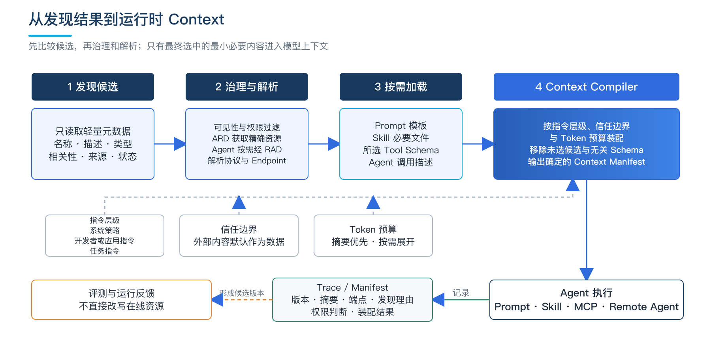

图 16-6　从资源发现到运行时 Context 的装配流程

至此，Prompt、Skill、MCP 与 Agent 已经从发布资产经过声明式解析或动态发现，进入一次可追溯的运行过程。下面以生产故障诊断为例，说明这些能力如何在完整流程中协同工作，并给出可用于持续运营的指标和演进路线。

### 15.10 端到端案例、运营指标与演进路线

前文分别讨论了资源建模、版本发布、变更评审、资源发现和 Context 装配。真实系统需要把这些环节连接为一条可运行、可观察和可持续改进的路径。本节以 Nacos Agentic Resource Registry 支撑的生产故障诊断 Agent 为例，说明固定依赖与动态能力如何共同完成任务。

#### 15.10.1 场景与资源准备

某企业使用故障诊断 Agent 协助值班人员分析线上异常，并以 Nacos AI Registry 作为统一 Agentic Resource Registry。这个 Agent 的身份、基本处理原则和高风险操作限制相对稳定，因此核心 Prompt、故障分级 Skill 和基础可观测性 MCP Server 由 Nacos 中的 AgentSpec 声明。不同业务的日志规则、领域知识和协作 Agent 变化较快，作为 Nacos 中的长尾能力按任务发现。

资源进入生产范围前，先分别形成不可变版本。Prompt 完成模板校验与评测集对比，Skill 完成结构、依赖、安全和隔离运行验证，MCP Server 完成能力描述、协议兼容与端点连通性验证，Agent 则校验版本化调用接口、协议描述和运行要求。Prompt、Skill、MCP Server、Agent 与 AgentSpec 均可以进入 Nacos 发布 Pipeline，并使用适合各自类型的检查节点；Agent 的任务成功率、延迟和协作效果等运行评测再由外部评测系统补充，并关联到同一版本。只有满足当前 Namespace、可见范围和在线状态的版本，才会被标签解析或 ARD 返回；需要远程 Agent 调用信息时，RAD 还会进一步校验版本、协议与端点条件。

一次应用发布后，订单接口的延迟和错误率同时升高。值班人员向 Agent 提交异常时间、服务名称和主要现象，希望得到可能原因、证据和后续检查建议。此时 Agent 已有基本诊断流程，但尚不知道订单服务使用哪套日志规则，也不知道当前用户是否有权访问发布变更和生产监控。

#### 15.10.2 从任务进入到结果输出

完整执行过程可以分为以下步骤：

| 阶段 | 主要处理 | 关键记录 |
| --- | --- | --- |
| 加载稳定依赖 | Agent 启动时从 Nacos 取得 AgentSpec，解析核心 Prompt、故障分级 Skill 和基础 MCP 依赖，并校验版本、生命周期和环境条件 | 基础 Lock Manifest |
| 形成能力需求 | 从用户请求中提取服务、时间范围、异常类型和期望结果，形成 Capability Requirement；具体订单和日志原文仍保留在任务环境中 | 原始意图与结构化能力需求 |
| 发现非固定能力 | Nacos ARD 在允许范围内检索订单日志分析 Skill、发布变更核对 Prompt、可观测性 MCP Server 和订单领域 Agent，并可继续取得具体资源 | 候选、版本与主要匹配依据 |
| 解析远程 Agent | 选中订单领域 Agent 且需要远程调用时，通过 RAD 取得精确版本、协议原生描述与当前可用端点；不需要远程调用信息时可继续使用 ARD 获取结果 | RAD 请求、协议与端点快照 |
| 执行治理判断 | Nacos 根据值班人员身份、生产 Namespace、资源授权和在线状态过滤候选；任务 Runtime 再结合协议兼容性、风险等级和本次任务权限完成调用前判断 | 资格判断与实际授予的权限 |
| 解析版本与端点 | Nacos Client 把标签或资源引用转换为精确版本，并从 MCP Registry、Naming 或 Agent Registry 中选择符合环境要求的可用端点 | 精确版本、摘要与实际端点 |
| 装配并使用能力 | Context Compiler 按优先级装配 Prompt、Skill 步骤、必要工具说明和任务信息；Agent 经 MCP Router 或原生客户端使用所选能力 | Context Manifest 与调用 Trace |
| 输出与记录 | 将监控变化、发布记录和日志记录或证据材料关联起来，输出带有不确定性说明的诊断结果 | 资源版本、发现理由、权限判断、端点和最终结果 |

该流程中，Nacos AI Registry 保存权威资源，Pipeline 约束发布，ARD 负责跨类型发现和资源获取，RAD 按需补充远程 Agent 的协议与端点发现，Client 与 Router 负责解析或连接；Context Compiler 负责装配，MCP Client 与 A2A Client 负责实际交互。明确这些边界后，问题发生时才能判断是候选不准确、资源不可用、权限判断不当、Context 装配错误，还是实际调用失败。

#### 15.10.3 已发布 Skill 出现风险时的处置

假设订单日志分析 Skill 的某个版本后来被发现会把样例数据发送到未申报的外部服务。安全人员根据运行记录确认风险后，在 Nacos 中将该版本下线，必要时同时禁用整个 Skill。运行时查询不再把它作为在线资源返回，ARD 也应在结果资格判断中排除该版本；运行节点根据风险策略停止新加载、清理待使用缓存，并中止尚未执行外部请求的任务。

Nacos 的版本与下线记录确定了需要调查的资源范围，Agent 平台再通过 Lock Manifest、Context Manifest 和历史 Trace 找到固定或动态使用该版本的任务。检查可以确认哪些执行获得过网络权限、是否产生实际外部请求，以及请求中是否包含敏感数据。维护团队修正 Skill 后，以新版本重新经过 Nacos Pipeline、隔离验证和人工评审；验证通过后，才恢复相应标签和发现范围。

这个过程说明，版本撤回不是简单地删除文件。有效处置依赖确定的内容摘要、运行权限记录、消费者列表和可替代版本。缺少任何一项，团队都难以准确判断需要停止哪些任务以及如何恢复服务。

#### 15.10.4 运营指标

平台建成后，需要通过指标判断它是否真正改善了资源质量和 Agent 运行。指标可以按五个方面组织：

| 方面 | 代表性指标 | 主要回答的问题 |
| --- | --- | --- |
| 资源治理 | 无负责人的资源数量、已发布版本覆盖率、版本漂移率、恢复到稳定版本所需时间 | 资源是否有人维护，线上使用是否可追溯 |
| 变更评审 | 自动检查通过率、评测集退化率、人工评审时长、发布后回退率 | 变更能否在发布前发现问题，评审成本是否合理 |
| 发现质量 | Top-K 命中率、无结果率、候选采用率、误匹配率、发现理由可解释率 | Agent 能否找到合适且可用的资源 |
| 运行效率 | 版本解析延迟、内容加载时间、端点选择成功率、缓存命中率、Context Token 消耗、装配失败率 | 资源管理是否影响在线任务效率 |
| 安全治理 | 未经检查的外部 Skill 数量、风险版本发现数量、受控外部请求数量、撤回版本的新加载次数、处置完成时间 | 外部能力是否在确定范围内使用，风险能否及时限制 |

这些指标需要结合业务结果解释。较高的候选采用率不一定表示发现质量良好，也可能说明 Agent 总是接受第一个结果；外部请求被限制的次数增加，可能来自风险上升，也可能说明控制覆盖面扩大。平台应同时观察任务成功率、人工修正率和异常类型，并通过抽样评审分析原因。

运行反馈可以帮助发现 Prompt 表达不清、Skill 描述不准确、MCP Tool Schema 难以理解或 AgentCard 缺少业务术语，但不应直接修改已发布内容。改进建议先形成候选版本，补充测试和影响分析，通过评审后再发布。这样既能利用运行数据持续改进，也能保持线上版本可追溯。

#### 15.10.5 分阶段演进

不同组织可以根据 Agent 数量和风险水平逐步建设，不必在初期同时引入所有组件。

| 阶段 | 主要特征 | 下一步重点 |
| --- | --- | --- |
| L0 分散维护 | Prompt 写在代码中，Skill、MCP 配置和 Agent 信息分散维护 | 盘点关键资源，确定名称和负责人 |
| L1 版本留存 | 使用代码仓库或制品库保存内容，能够查看修改历史 | 区分工作副本、不可变版本和实际运行版本 |
| L2 统一 Registry | 使用 Nacos AI Registry 建立稳定标识、权限、标签、生命周期、运行解析和端点信息 | 完善 Lock Manifest、反向引用和跨资源影响分析 |
| L3 统一评估与可信供应链 | Nacos Pipeline 接入发布检查，外部资源经过来源核实、内容检查和受限运行 | 建立持续检查、下线通知和影响处置 |
| L4 受控动态发现 | 以 Nacos ARD 按任务发现和获取资源，并在远程 Agent 场景按需使用 RAD | 优化检索、治理判断、协议与端点选择和 Context Manifest |
| L5 持续改进 | 评测与运行反馈形成候选版本，发布效果可以度量 | 提升自动评测质量和跨环境推广能力 |

阶段之间的判断标准应以实际能力为准，而不是是否部署了某个产品。例如，仅建立资源列表但仍允许覆盖历史内容，不能认为已经完成 L2；部署语义检索但没有权限过滤和精确版本解析，也不能认为具备受控的动态发现。

#### 15.10.6 以 Nacos 落地的顺序与本章小结

实践中，可以先在 Nacos 中纳管少量被多个 Agent 共用、变更较频繁的 Prompt、Skill 与 MCP Server，建立 Namespace、版本、标签、在线状态和运行记录；同时为可协作 Agent 建立版本化调用描述与端点登记，为需要标准化分发的 Agent 建立 AgentSpec。随后为各类资源启用匹配的发布 Pipeline，把评估结果、影响分析和本地缓存接入 Agent 交付流程。外部 Skill 较多的组织应优先建立内部接收区域和运行权限限制。只有在权威资源、版本解析和治理规则稳定后，再扩展 ARD 的动态发现范围，并在远程 Agent 场景按需使用 RAD。

本章的核心观点是，Prompt、Skill、MCP 与 Agent 不只是开发阶段的配置，也是运行时改变 Agent 行为和能力边界的依赖。它们需要符合各自特点的内容建模和验证方法，同时共用稳定标识、版本、生命周期、发布记录和权限管理。稳态 Agent 通过声明式引用获得确定依赖，动态 Agent 通过 ARD 按任务发现和获取可用能力；涉及远程 Agent 时，可以进一步使用 RAD 取得调用信息。两条路径最终都要解析精确版本与必要端点，装配所需 Context，并留下可回放的 Manifest。

Nacos 作为 Agentic Resource Registry，把资源登记、版本发布、运行发现和动态变更建立在同一基础设施上；Agent Harness 则负责把这些资源转化为一次具体执行。两者共同形成从“组织有哪些能力”到“本次任务实际用了什么”的连续关系。

当资源、发现和运行记录形成连续关系后，团队才能准确回答三个问题：当前有哪些经过治理的能力，某个 Agent 为何选择并使用它们，以及内容或运行实例发生变化时哪些任务会受到影响。这也是 Nacos 从微服务注册配置平台走向 Agentic Resource Registry，并支撑 Agent 从局部试验走向规模化运行的工程价值。


<a id="sec-026"></a>

## 第 16 章　Agent 行为生成与质量验证
治理篇至此已经建立三个维度：可观测性（第 13 章）让 Agent 的运行可见，安全（第 14 章）让 Agent 的行为有边界，发现与管理（第 15 章）让 Agent 资产有台账。本章补上第四个维度：让 Agent 的行为在上线之前可验证。它回答的问题是在还没有角色标准、没有失败代价、没有身份连续的今天，工程质量能拿到什么。

### 16.1 为什么需要 Agent Simulation

Agent 行为目前不可验证，不是缺工具，而是缺制度前提。这一节解释为什么模拟是制度缺位下，唯一当下就能做的事。

**1. 可靠性是系统设计出来的，不是个体保证出来的。**

一个医生可能犯错，但医疗系统整体可预期：执业资质卡住入口，操作规程约束过程，案例复盘沉淀教训，模拟器训练罕见场景。这些装置没有一样在试图保证"每一个医生的每一次决策都正确"——它们全部在做同一件事：约束一个不可靠的内核，让错误难以穿过系统抵达病人。

大模型天然就是那个不可靠的内核：推理可能幻觉，工具可能调错，参数可能越界，每一层都是概率性的。Agent 工程的每一层外部结构——推理纪律、上下文管理、工具协议、编排分工——本质上也在做同一件事：用一个可靠的 Harness 约束一个不可靠的内核。医疗系统用一百年建成这套装置，Agent 工程现在就要。

**2. Agent 比人类少三样制度前提。**

人类社会的可靠性之所以成立，依赖三样 Agent 目前不具备的东西。

角色有外部标准。"执业医师"四个字背后是注册制度、执照和可查的执业范围；两个同名的"退款 Agent"，权限边界、行为约束、话术口径可能完全不同，而没有机构知道这个差别。

失败有自然代价。医生误诊，病人受损、执照吊销、声誉归零；Agent 的错误如果没有被检测到，就不产生任何后果——它不会疼，不会被辞退，甚至不会被知道。

身份是连续的。医生今天的误诊会记在他明天的履历上，声誉和责任沿着连续身份累积；同一个 Agent 名字下可能跑着不同版本，昨天的错误随今天的版本发布被抹平，声誉和责任无处附着。

这三样是治理课题，靠制度级的长期建设，不是一个测试框架能补上的。

**3. 模拟是三样都缺的前提下，唯一当下就能做的那一件。**

补齐角色标准、失败代价、身份连续，任何一样都以年计。但模拟不依赖这三样——它只需要一个可以安全失败的环境。医学院用标准化病人练习罕见并发症，客服中心用模拟话务训练极端场景，飞行模拟器把这个原理做成了产品——不同行业，同一个本质。

Agent 需要的比座舱更多：一个会追问、会改主意的对手方，和一个会超时、会丢响应、会真的把钱划走的后台系统。飞行员的模拟器是现成的，Agent 的还没有。

**4. 退款案例：从人类客服的五样保障，到 Agent 的零保障。**

一位用户要求退款，记不清订单号，语气不好。接待她的人类客服身后有五样保障：岗前培训与考核让她具备基本能力；SOP（Standard Operating Procedure，标准作业程序）划出行为边界；每日录音抽检让服务可回看；投诉进入绩效让失败有代价；年度模拟演练让她在极端场景里被训练过。

换成交接给 Agent，五样全部归零：没有上岗考核，没有外部边界，没有抽检，没有代价，没有演练。前四样的重建需要时间和制度；第五样——把 Agent 放进可控的模拟环境跑一遍，留下可回看的证据——是当下就能做、而且做了立刻产生证据的那一条。

这就是 Agent Simulation 的起点：不等待制度补齐，先用工程手段拿回第五样保障。

飞行模拟器是现成的，Agent 的还没有。要造，先定义它到底是什么。

### 16.2 定义、边界与三种执行模式

上一节的结论是"需要一个安全失败的环境"。这一节定义这个环境：它是什么、边界在哪、有几种造法。

**1. Agent Simulation 用软件承载被测 Agent 运行时所处的外部世界，使执行可反复启动、可配置且无真实后果。**

它由两部分组成。用户模拟（User Simulation）承载与被测 Agent 交互的人——用户、对手方、协作方：会记错金额的顾客、会撤回指令的审批人、会提出模糊需求的同事。环境模拟（Environment Simulation）承载被测 Agent 依赖的一切外部条件——工具与 API、数据与业务状态、文件、模型服务、外部事件，以及时间本身。

两部分合起来，就是把"Agent 运行的世界"从生产环境搬进软件：世界可以被保存、修改、重放，出错时没有任何真实后果。图 23-1 给出它在质量工程体系中的位置——Simulation 与 Evaluation、Testing、Governance 是可组合的能力，不是固定流水线：Simulation 生成受控执行与证据，Evaluation 建立判定，Testing 组织验证活动，Governance 掌握发布授权；生产 Trace 评估与确定性单元测试可以完全不经过 Simulation。这个关系在 23.6 还会从交付侧再看一次。

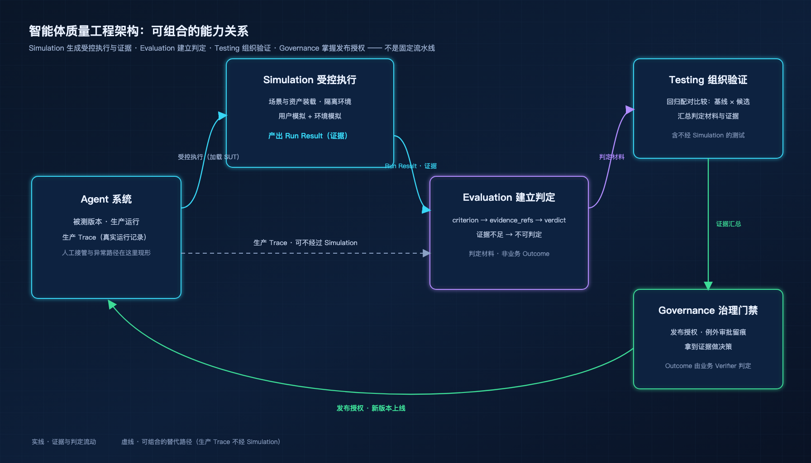

图 23-1　智能体质量工程架构：Simulation 与 Evaluation、Testing、Governance 的可组合关系

**2. 仿真边界是授权和后果，不是实现方式。**

一个流传很广的断言是"只要有一个请求真的发出去，就不再是仿真"。这条边界划错了位置。真正的边界只有两条：不触达未授权的生产账户、数据与网络；不产生不可控的真实业务副作用。满足这两条，即使被测 Agent 连接的是隔离的真实后端——独立数据库实例、专用测试账户、网络受限的下游——它仍在仿真之中，因为授权在、后果可控。反过来，即使所有组件都是软件替身，只要场景把请求路由到了生产账户，那不是仿真，是事故。

**3. 执行模式按保真度和风险分三种：全替身、混合、隔离真实依赖。**

从全替身到隔离真实依赖，真实成分递增、可复现性递减，风险随之上升：

| 模式 | 含义 | 可复现性 | 风险 | 适用场景 |
| --- | --- | --- | --- | --- |
| 全替身 | 用户和环境均由模拟器承载，无真实外部依赖 | 最高 | 最低 | 回归测试、快速迭代 |
| 混合 | 部分组件使用隔离真实后端，其余由模拟器承载 | 中等 | 低 | 端到端集成验证 |
| 隔离真实依赖 | 连接隔离但真实的下游服务，仅用户侧模拟 | 较低 | 需隔离保障 | 服务栈验证、故障实验 |

全替身的可复现性支撑回归——同一场景可以夜夜重跑；隔离真实依赖的保真度支撑服务栈验证——真实的数据库锁行为、真实的网络栈，替身模拟不出来。模式选择取决于本次验证目标；不同模式验证的系统范围不同，结论不可混用——全替身下通过的回归，不构成对真实依赖栈的任何结论。

**4. 被测系统不进入仿真。**

被测系统（System Under Test，SUT）是仿真的服务对象，不是仿真的组成部分。推理、工具选择、参数构造、异常处理属于 SUT——这些行为一旦被替换，被测对象就已移出回路。把工具调用顺序固定成脚本是最隐蔽的例子：Run 看起来一切正常，被测的却不再是 Agent 的决策，而是那段脚本，而且没有任何告警会提示这一点。

**5. 替换前过一道判断：考察的内容不能换，设定的条件必须换。**

每个对象替换前问一句：这个对象的行为，是这次要考察的内容，还是这次要设定的条件？是内容则不能替换；是条件则必须替换，并写清楚替换成了什么。同一个协作 Agent，在考察编排能力时是内容——它的响应质量直接影响结论；在考察主 Agent 容错时是条件——它的故障表现是实验设定，必须可控可复现。这道判断属于场景设计，没有工具能代劳。

替身本身怎么实现，则是多维选择而非难度阶梯。按开放度从低到高排列，各机制在确定性、状态复杂度与维护成本上各有取舍：

| 机制 | 开放度 | 确定性 | 状态复杂度 | 维护成本 | 典型对象 |
| --- | --- | --- | --- | --- | --- |
| 脚本 | 低 | 高 | 低 | 低 | 固定流程的工具响应 |
| 录制回放 | 低 | 高 | 中 | 中，随接口版本漂移 | 历史真实会话 |
| 规则 | 低 | 高 | 低 | 低 | 幂等查询接口 |
| 状态机 | 中 | 高 | 高 | 中 | 多阶段业务流程 |
| 模型生成 | 高 | 低 | 中 | 高 | 开放用户行为 |
| 混合 | 中 | 中 | 中 | 中 | 工程主流选择 |

机制选择取决于被模拟对象的确定性与开放度，不取决于预算：被模拟对象越确定，越适合脚本与规则；越开放，越需要模型生成；状态越复杂，越偏向状态机与录制回放。

定义和模式都清楚了。但"一次仿真执行"到底产生哪些对象、它们之间是什么关系？这需要一张数据契约。

### 16.3 数据契约：对象模型与生命周期

上一节说仿真交付"可复现的执行"。可复现的前提，是执行涉及的一切对象有明确定义和生命周期。这一节从场景规格到运行结果，定义完整对象链。

**1. 对象链。**

```plaintext
Scenario Spec（场景规格）
  └── Manifest（不可变运行配置，启动时锁定）
        └── Run（一次受控执行）
              ├── 1..N Task（业务任务，如"提交退款申请"）
              │     └── 1..N Session（会话，如用户对话 + 工具调用链）
              │           └── Event（原子执行事实，已经发生）
              └── Run Result
                    ├── Records（原始运行记录：消息、调用、状态变更）
                    ├── Artifacts（生成产物：截图、文件、浏览器状态）
                    ├── Observations（从 Records 提取的事实性观测）
                    ├── Evidence（面向评价项的证据引用）
                    └── Completeness（完整性判断，基于采集契约）
```

沿这棵树走一遍退款场景。场景规格是 `refund-timeout-retry@1.3.0`：一位缺乏耐心的新手用户要回 199 元退款，订单号只在她被追问时才提供；环境设定首次退款查询超时、第二次恢复。启动时，Harness 把规格连同引用的全部资产版本解析锁定，生成不可变 Manifest——Agent 版本、用户模型版本、环境数据版本，此后不可更改。Run `r-20260914-001` 是一次受控执行，包含一个 Task"提交退款申请"；Task 下有一个 Session——12 轮用户对话加一条并行的工具调用链；Session 内每一步落成 Event："用户拒绝提供订单号""首次查询超时命中""第二次查询成功""create\_refund 受理"。执行结束，Run Result 收拢全部产出：Records 装着 12 条消息与 7 次工具调用的原始记录；Observations 提取事实性观测——退款申请数 = 1、金额 = 19900 分（199 元）、状态 = accepted；Evidence 把观测按评价项组织成证据引用；Completeness 按采集契约核对——本次材料齐备。

**2. 证据层次分离。**

Trace、快照和 Artifact 是原始证据材料，不自动证明 Outcome（业务结果）。Run Result 区分三个层次：records（原始记录）→ observations（事实性观测）→ evidence（面向评价项的证据引用）；criterion → evidence\_refs → verdict（评价项 → 证据引用 → 判定）的关系由 Evaluation Result 建立，不属于 Run Result。

分层的价值在交付时刻显现：同一份 records，质量团队用来重评分，合规团队检查金额口径，回归系统比对版本差异——各自引用同一份原始材料，各自组织自己的证据与判断。若原始材料与质量结论混在同一层，后续每一种用途都会被上一轮的结论污染。旧稿没有分开这一层，是数据契约上最大的一处欠账。

**3. Manifest 与 Run Result 生命周期闭合。**

启动时生成不可变 Manifest，保存解析后的版本组合与预设参数；运行中才知道的事实——实际采样的随机值、动态路由的选择、未决操作的最终状态——全部进入 Run Result。这条边界让"复现"有了精确含义：用 Manifest 重建条件，用 Run Result 核对事实。

一个容易犯的错，是把场景里的未来计划叫 Event。Scenario Spec 中写的是 triggers（或 event\_specs）："首次查询超时时注入超时"是一个计划；命中之后，"查询超时已发生"才是 Event。计划在等待，事实已落地，两者不共享名字。

**4. Run 的四种状态独立表达。**

从执行事实到质量判断，Run 的状态沿四个维度展开：

| 维度 | 表达内容 | 典型值 |
| --- | --- | --- |
| 执行状态 | 是否启动、如何结束 | completed / crashed / cancelled |
| 仿真有效性 | 实验条件是否成立 | valid / violated / unchecked |
| 证据完整性 | 采集材料是否齐备 | complete / partial（列缺失项） |
| 任务质量 | 业务结果是否满足要求 | 由独立 Evaluation 给出 |

四种状态独立组合——一次完整、有效、材料齐备的 Run，完全可能产生错误的退款金额。把它们压成一个"成功/失败"，四个独立的事实就纠缠成不可拆解的结论：归因时说不清是环境坏了还是 Agent 错了，汇报时说不清是材料缺失还是任务失败。

数据契约定义好了。谁来读取契约、驱动执行、管理用户和环境的模拟？——Harness。

### 16.4 执行引擎：Harness 架构与模拟实现

上一节定义了"数据长什么样"，这一节回答"谁来跑、怎么跑"。

Harness 是 Simulation 的执行引擎：接收 Scenario Spec，驱动一次受控执行，交付 Run Result。引擎内部有三个关注点。编排层读取场景规格、管理 Run 生命周期、协调数据流与隔离边界，是引擎的骨架；用户模拟器与环境模拟器分别承载被测 Agent 的对手方和它依赖的外部世界，是引擎的两翼。三者不是平行关系：编排层在架构层面定义职责与约束，两个模拟器在实现层面决定模拟什么、怎么模拟。图 23-2 给出整体架构，下面按架构层、用户模拟、环境模拟的顺序展开。

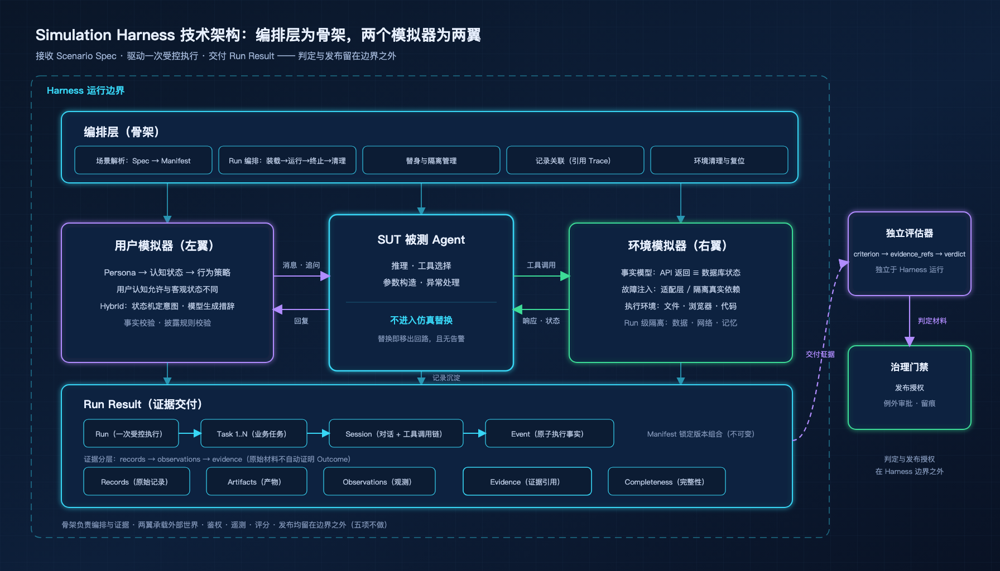

图 23-2　Simulation Harness 技术架构：编排层（骨架）+ 用户模拟器、环境模拟器（两翼）

#### 16.4.1 架构层

**1. 职责与边界。** Harness 做五件事：解析场景，把 Scenario Spec 连同资产版本解析为不可变 Manifest；编排受控 Run，走完装载、运行、终止、收敛、清理的完整生命周期；管理替身与隔离，维持仿真边界；汇集记录引用，把交互与控制过程关联到 Trace 与 Artifact；清理环境，让世界回到初始状态。同时它不做五件事：不做任务生命周期管理——那是 SUT 或其编排层的职责；不做鉴权和权限决策——那是 Gateway 与安全框架的事（第 14 章）；不做遥测采集——那是可观测性的事（第 13 章），Harness 只在记录中关联引用；不做质量评分和判定——那是 Evaluation 的事；不做发布决策——那是治理门禁的事。

五项职责定义引擎能力，五项不做定义引擎边界，正反一体。"不做"的每一项都对应治理体系里的专职系统；把任何一项收进来，Harness 就从执行引擎膨胀为总控制器，与全书的责任边界冲突。

**2. 数据流与协调。** 引擎内的数据流分三线：交互流是消息、工具请求与可见事件；控制流是装载、初始化、故障、终止与清理的指令；证据流是 Trace、状态、产物与控制记录的沉淀。三线交织，靠两张账协调。

第一张是事件联动账。用户、环境、Agent 三方通过事件关联，但更新时点可能不同：撤回消息在用户侧本地产生（t1）、被 Agent 收到（t2）、对在途事务生效（t3），是三个不同阶段——界面上已经撤回，Agent 却可能还在按原指令提交。联动账记录每个事件在三方的状态与时点，让"撤回到底生效没有"可以被精确回答。

第二张是时间分离账。仿真的世界里同时跑着四种时间，从业务规则到物理测量，各有用途、不可混用：

| 时间 | 回答什么 | 退款场景中的例子 |
| --- | --- | --- |
| 业务日历时间 | 业务规则的期限判断 | 下单 2026-09-01，是否仍在 7 天无理由期 |
| 仿真逻辑时间 | 虚拟事件的调度 | 第 3 轮注入查询超时 |
| 单调时钟 | 真实耗时的测量 | 推理与工具调用各花了多久 |
| 墙钟时间 | 与现实日期的关联 | Run 何时发生、报告何时生成 |

用墙钟判断退款期限，虚拟时间加速就会破坏业务规则；用业务日历测量推理耗时，得到的是没有意义的数字。

#### 16.4.2 用户模拟器

**1. 模型设计。** 用户模型分三层。Persona 定义角色底色：专业度、表达偏好、行为倾向——"缺乏耐心的电商新手"与"熟悉规则的电商老手"面对同一个拒绝，反应完全不同。认知状态定义她知道什么：已知事实、当前理解，并且允许与客观状态不同——测试记错金额、误解退款政策、故意提供错误信息时，模拟器分别保存真实状态与用户认知，两份都留着。行为策略定义她怎么行动：Reaction Rules（反应规则）+ 状态机 + 时钟驱动的耐心——被追问三次才给订单号、等待超过两分钟开始威胁投诉。

工程上 Hybrid（混合）方法是主流：意图选择交给状态机——"指出金额错误"是一个确定的意图节点；自然语言表达交给模型——生成符合 Persona 的措辞；输出经事实校验（不能说出用户认知之外的金额）和披露规则校验（订单号只在被追问时给）后发送。探索运行放宽分支选择，让模拟用户走出多样的路径；回归运行锁定关键行为约束，保证可复现。

**2. 质量控制。** 模拟器质量不等于 Agent 成功率——过度配合的模拟器高估 Agent 能力，始终拒绝的模拟器产生无意义失败。质量控制按维度展开，统计单位从单条消息到批次：

| 维度 | 检查什么 | 统计单位 |
| --- | --- | --- |
| 角色一致性 | 行为是否贴合 Persona | 每条消息 |
| 反应规则符合率 | 触发条件命中时是否执行反应 | 每次触发 |
| 信息可见性遵守 | 是否只披露用户认知内的信息 | 每次披露 |
| 目标终止规则符合率 | 是否按规则继续、澄清或停止 | 每个 Run |
| 行为分布多样性 | 分支选择是否符合目标分布 | 每批次 Run |

每项指标定义适用条件和统计单位，避免"模拟器准确率 95%"这类无从核对的表述。生成与评分使用不同模型，减少共同偏差；再配合独立数据、受限上下文和人工校准，让"用户像不像"本身也成为可治理的对象。

#### 16.4.3 环境模拟器

**1. 事实模型与隔离。** 环境可信的第一要求是事实一致：API 返回与数据库状态来自同一事实模型——`create_refund` 返回"已受理"后，`get_refund` 必须查到相应状态，不能一个说受理了一个说不存在。超时是最值得精雕的条件，按请求生命周期分三个位置，检验的能力各不相同：

| 超时位置 | 系统状态 | 检验什么 |
| --- | --- | --- |
| 请求未发送 | 调用未发生 | 重试与退避策略 |
| 已发送、未提交 | 下游收到但未处理 | 等待与查询确认 |
| 已提交、响应丢失 | 业务已生效 | 重复提交防护与状态核实 |

最后一种最关键：申请其实已经受理，Agent 却没收到回执——它会不会先核实状态，还是直接再提交一次？

隔离覆盖计算、网络出口、数据、文件、缓存和记忆：每个 Run 使用独立工作区、账户数据和会话，Run 之间不共享任何可变状态。复现分三个层次：配置复现，用 Manifest 恢复场景与版本，回答"同样的实验能不能再来一次"；事件复现，重放输入与调度，回答"同样的路径能不能再走一遍"；统计复现，重复实验得到相近分布，回答"结论稳不稳"。

**2. 故障注入。** 故障注入位置决定测试范围：在工具适配层注入，检验的是 Agent 对错误响应的处理；在隔离真实依赖上注入，检验的是端到端的恢复能力。以下 ChaosBlade 集成方式为本书提出的参考架构：ChaosBlade 只作为故障执行后端，何时、对谁、施加什么故障由 Harness 决定；ChaosBlade 执行实验，Harness 负责触发同步、恢复验证与清理。

```bash
# 参考架构示例：为 refund-service Pod 注入 300ms 网络延迟
# 运行前提：目标集群 kubeconfig 与实验范围授权
blade create k8s pod-network delay --time 300 \
  --namespace default --labels app=refund-service \
  --kubeconfig ~/.kube/config
```

故障记录分四步分别保存：计划注入（场景里写了什么）、执行器生效（ChaosBlade 报告实验已启动）、目标命中（观测到延迟确实落在目标调用上）、恢复验证（实验销毁后服务恢复正常）。四步缺一，故障实验的结论就不可信——"注入了"和"生效了"是两件事。

**3. 执行环境。** 执行环境按任务类型准备：文件任务准备可恢复的目录与权限，浏览器任务准备页面与会话，代码执行任务固定运行时与资源预算。替换与否取决于验证目标：只测工具选择时，可以替掉对应工具；验证路径解析、页面交互或生成代码的实际行为时，必须保留真实执行环境——这正是 23.2 那道"内容还是条件"判断的应用。

引擎和两个子系统都有了。但引擎不知道"这次该跑什么"——需要场景配置告诉它。

### 16.5 运行配置：场景与资产层

引擎回答"怎么跑"，这一节回答"跑什么"。先给两个定义。

场景（Scenario）是对一次受控执行的完整描述：初始条件是什么、参与方是谁、交互规则怎么定、允许哪些演化路径、何时终止。它不是脚本——不固定具体对话内容；也不是随机生成——有明确的约束和边界；它是允许多条合理执行路径的声明式规格。

资产（Asset）是场景引用的、独立版本化的构建产物：用户行为策略、环境初始数据、工具契约、模拟器配置、评估规格。场景组合资产，资产独立于场景演进。两者的关系：场景是"这次实验的设计方案"，资产是"设计方案引用的标准化材料"。改用户耐心参数，是新场景版本；改用户模拟器的披露规则逻辑，是新资产版本。

**1. 用户与环境联合建模，确保同一业务对象在两侧有一致含义。**

用户嘴里的订单、工具参数里的订单号、数据库里的订单记录，必须是同一张单子——任何一处脱节，场景测的就是假问题。联合约束覆盖五个维度：实体与事实绑定（订单只有一个事实版本）、信息可见性（用户认知与环境状态允许不同，但两侧内部各自一致）、动作入口与状态归属（提交入口只有一个，状态变迁有唯一属主）、事件触发与时序（什么事件按什么顺序发生）、目标演化与结果要求（任务完成的判定随场景演化更新）。沿退款流程的时间线，从首次交互到任务结束，可以提炼四类典型变体——每个变体里用户行为条件与环境条件独立变化，联合验证重点随之改变：

| 场景变体 | 用户行为条件 | 环境条件 | 联合验证重点 |
| --- | --- | --- | --- |
| 查询短暂异常 | 被追问后提供订单号 | 首次查询超时，后续恢复 | 是否保留已知信息、处理异常并取得确认 |
| 长时间等待 | 可按等待时长选择离开 | 查询持续未完成 | 等待计时、离开事件与在途操作的衔接 |
| 提交前撤回 | 已同意提交，随后撤回 | 撤回与提交有明确事件顺序 | 获知撤回后是否按要求调整 |
| 受理后响应丢失 | 未看到回执时继续追问 | 申请已受理，响应未到达 | 是否核实状态、避免重复申请 |

**2. Scenario Spec 用十个字段组回答从"测什么"到"怎么评价"的完整设计。**

一个可执行的场景规格需要回答一串递进的问题：这个场景是谁、测什么、环境怎么设、用户与环境怎么关联、别的参与者是谁、事件怎么演化、运行怎么约束、怎么评价、从哪来的。十个字段组沿这条问题链展开：

| 字段组 | 主要内容 | 用途 |
| --- | --- | --- |
| identity | 场景 ID、版本、标签、负责人 | 身份与变更治理 |
| sut | 被测边界、Agent 版本、模型与 Prompt 引用 | 固定实验对象 |
| user | Persona、目标、私有事实、披露规则、行为策略 | 驱动用户侧交互 |
| environment | 初始数据、工具契约、后端模式、时钟策略 | 构造外部世界 |
| interaction | 实体绑定、可见渠道、动作入口、交互模式 | 关联用户与环境 |
| participants | 其他 Agent 的角色、接口和权限 | 协作拓扑 |
| events | 触发条件、故障动作、恢复策略 | 控制场景演化 |
| execution | 种子、并发、轮数、时间与资源预算 | 约束运行 |
| evaluation\_ref | 独立断言、Rubric、预期状态的版本引用 | 关联质量判断 |
| provenance | 原始需求、资产位置、脱敏会话、事故记录 | 追溯来源 |

退款场景的规格节选如下（interaction ⑤ 与 participants ⑥ 两组省略），注释编号对应上表：

```yaml
schema_version: 1
identity:                          # ① 身份与变更治理
  id: refund-timeout-retry
  version: 1.3.0
  owner: quality-team
sut:                               # ② 固定实验对象
  agent: refund-agent@2.4.1
  boundary: [reasoning, tool-selection, parameters]
user:                              # ③ 驱动用户侧交互
  persona: { expertise: novice, patience: low, tone: annoyed }
  goal: "拿回 199 元退款"
  private_facts: { order_no: "B2026-0901-7734", paid_amount_minor: 19900 }
  disclosure: { order_no: on-request }   # 订单号只在被追问时提供
environment:                       # ④ 构造外部世界
  backend_mode: surrogate          # 全替身模式
  clock: { policy: virtual, start: "2026-09-01T10:00:00+08:00" }
events:                            # ⑦ 控制场景演化（未来计划，命中后才成为 Event）
  triggers:
    - { target: refund.query, effect: timeout, at: turn-1, recover: turn-2 }
execution:                         # ⑧ 约束运行
  seed: 20260914
  budget: { max_turns: 12, wall_clock: 20m }
evaluation_ref:                    # ⑨ 关联质量判断（版本引用，不含判定）
  assertions: refund-assertions@1.1.0
provenance:                        # ⑩ 追溯来源
  source: "事故 #7742 脱敏会话"
```

注意两处细节：`user.private_facts` 与 environment 初始数据里的订单必须是同一实体——这是联合建模的落地；`events.triggers` 是未来计划，命中后才生成 Event——这正是 23.3 定下的名字边界。

**3. 场景材料沿声明→实现→观察→异常四个方向收集，生成机制按控制力从高到低分四种。**

材料决定"有什么可用"，机制决定"怎么组合出来"。四个收集方向，从应然到实然再到异常：

| 来源 | 提取内容 | 方向 |
| --- | --- | --- |
| 需求与业务政策 | 适用条件、成功标准与禁止行为 | 声明：什么是"对" |
| Agent 源码与构建配置 | 执行路径、状态管理、依赖边界 | 实现：实际怎么做 |
| 生产会话与运行 Trace | 用户目标、表达方式、交互分支 | 观察：实际怎么被用 |
| 事故、缺陷与人工接管记录 | 触发条件、故障时序、业务后果 | 异常：哪里出了问题 |

生成机制按控制力从高到低分四种：

| 生成机制 | 方式 | 控制力 |
| --- | --- | --- |
| 模板填充 | 将参数填入已验证的场景骨架 | 最高，结构固定 |
| 规则派生 | 按业务条件和状态路径构造变体 | 高，组合可控 |
| LLM 辅助 | 根据分析材料提出交互分支和异常组合 | 低，需校验筛选 |
| 混合生成 | 模板+规则限定结构，LLM 提出变化，校验器筛选 | 工程主流 |

混合生成成为工程主流的原因藏在第三行的风险里：LLM 能提出人想不到的异常组合，但产出不可直接信任——用模板与规则锁住结构，用校验器筛掉不合格的变体，控制力与开放度兼得。

**4. 场景和资产分别版本化，Run 中锁定组合确保可复现。**

版本化的对象有五类：场景、数据、工具、模拟器、评估规格，各自独立演进；一次 Run 锁定场景与全部资产的版本组合，结论只对这组组合负责。覆盖按"业务阶段 × 用户行为 × 权限状态 × 依赖故障"建立风险矩阵，缺口决定下一批场景的优先级。新出现的交互缺陷和确认缺陷，先核实事实与责任归属，再固化进入回归集——把一次生产事故的表象直接抄成场景，等于把未确诊的病历直接开成处方。

场景跑完了。这次执行交出了什么？它的结论在什么范围内有效？

### 16.6 证据交付与适用边界

前五节走完了完整链路：定义边界（23.2）、数据契约（23.3）、执行引擎（23.4）、场景配置（23.5）。一条场景跑完，Harness 交付 Run Result——对话记录、工具调用链、状态快照、故障命中情况、有效性检查结果。但这些材料本身不是结论："退款申请数 = 1"是一条观测，"Agent 是否正确处理了退款"是一个判断。前者是 Simulation 的终点，后者是 Evaluation 的起点。这一节回答三个递进的问题：Simulation 交出的东西本质上是什么、它在治理体系中怎么被使用、它的结论在哪里失效。

**1. Run Result 交付的是证据材料，不是质量结论。**

运行完成、任务成功、允许发布，是三个互相独立的结论，不能相互推导：运行完成是执行生命周期的事实；任务成功属于 Outcome（业务结果），由业务应用或获授权的 Verifier（校验者）依据成功标准判定；发布授权属于治理门禁。Simulation 与 Evaluation 各自的职责由此划清：

| 事项 | Simulation 的职责 | Evaluation 的职责 |
| --- | --- | --- |
| 用户目标 | 驱动用户继续、澄清或停止 | 判断业务目标是否实际完成 |
| 环境故障 | 施加条件并记录生效与恢复 | 判断 Agent 应对与业务后果 |
| 业务状态 | 按契约维护并采集状态 | 对照目标和政策检查结果 |
| 运行时限 | 达到条件时结束 | 判断是否满足时效要求 |
| 仿真契约 | 报告角色漂移和执行错误 | 限定可评分范围与结论可信度 |

有效性检查是 Simulation 的最后一项输出：核实场景配置是否正确、用户行为是否遵守认知和披露规则、故障是否生效并命中、必需证据是否可访问。检查结果与 Run Result 一起交给评估器。评估器一侧的证据可用性检查也不是一道闸门，而是三道——记录完整性（材料在不在）、运行有效性（条件成立没有）、证据充分性（够不够支撑这个评价项），如图 23-3 所示。证据不足的项目输出"不可判定"，其余按现有证据评价——"不可判定"是一个诚实的结论，好过用不充分的证据硬评。

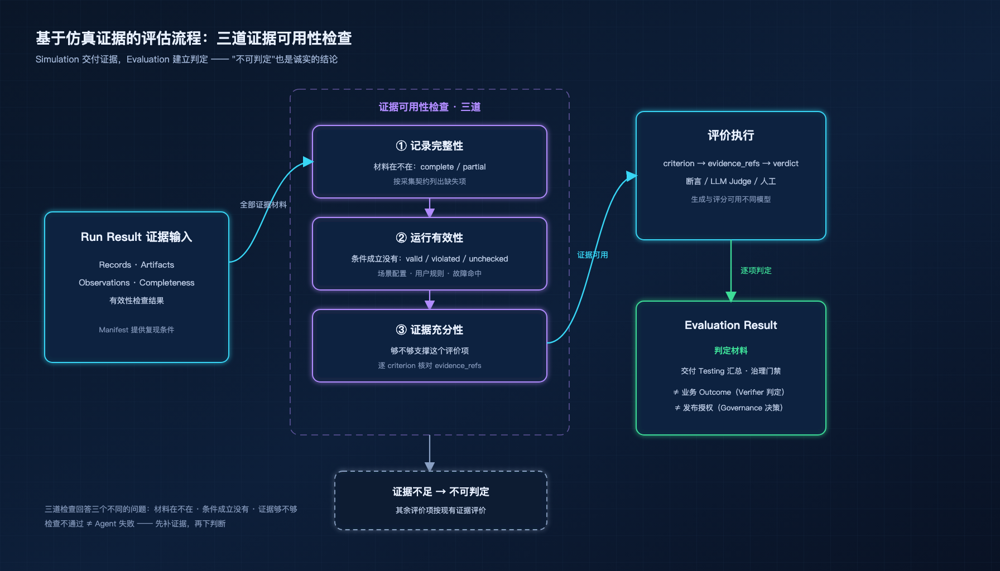

图 23-3　基于仿真证据的评估流程：三道证据可用性检查

**2. 同一份证据包服务于治理体系的多种决策。**

一次 Run 的产物不止判一次"通过/不通过"。Run Result 作为结构化证据，在治理体系中至少有七种用途；前四种用证据回答问题，后三种用证据反哺体系：

| 用途 | 如何使用 | 适用边界 |
| --- | --- | --- |
| 质量评估与重评分 | 轨迹和状态交给断言/Judge/人工 | 新增评价只能用原始证据足以支撑的信息 |
| 缺陷定位与归因 | 关联用户反应→Agent 动作→工具执行→状态变化 | 复杂因果可能需要对照运行 |
| 版本回归与门禁 | 基线与候选在相同条件下配对比较 | 保留回归与发布依据 |
| 复现与回放 | 用 Manifest 重建条件，或用 Trace 交互式回放 | 按三种复现层次区分用途 |
| 场景提取与覆盖补充 | 从异常路径和未命中事件中提取候选场景 | 必须重新验证 |
| 模拟器质量治理 | 聚合用户事实违规和环境状态不一致 | 避免把模拟器问题误归因于 Agent |
| 性能与成本分析 | 按参与方和阶段汇总耗时、Token 和费用 | 区分业务执行与仿真平台开销 |

读零违规的回归结果时，要小心统计边界：n 次独立运行零违规，违规率的单侧 95% 置信上界是 1 − 0.05^(1/n)，大样本下近似 3/n——300 次零违规意味着"违规率大概率不超过 1%"，而不是零。这个上界的前提是固定样本量、独立同分布、无非选择性排除；把置信上界读成"真实违规率有 95% 的概率低于该值"，是最常见的误读。

门禁用途尤其要守住边界：Testing Gate 汇总验证结果、组织回归证据，但它不是发布决定者——获授权的治理节点拿着 Testing 交付的证据做发布决策，例外路径有审批与留痕，如图 23-4 所示。

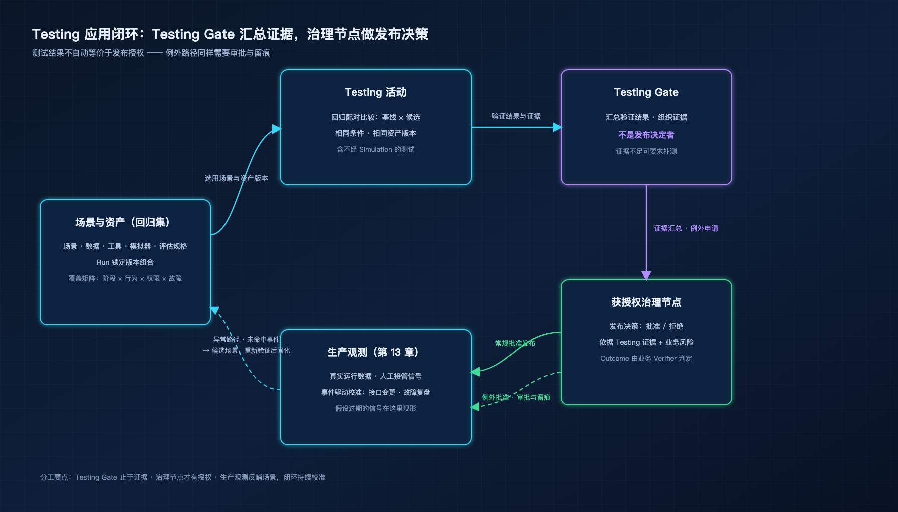

图 23-4　Testing 应用闭环：Testing Gate 与获授权治理节点的分工

**3. Simulation 的结论建立在会过期的假设之上。**

仿真用户不是真实用户——用户模型是假设，仿真成功率的上升不能替代真实业务指标。场景来自已知失败模式——覆盖不了训练分布之外的未知风险。工具契约、用户行为分布、故障频次随业务漂移——仿真成功率上升而生产人工接管持续增加，就是假设过期的信号。校准由事件驱动：接口变更、故障复盘、用户结构变化时触发，不按固定周期例行执行——固定周期会在两次校准之间放过漂移，事件驱动把成本花在漂移真正发生的地方。

成本结构上，环境步进不昂贵，瓶颈在模型生成：环境步进是确定性的状态转移，模型生成是概率性推理。AgentSociety 论文报告的特定实验（1 万个 Agent、五轮交互）与这一直觉一致——环境侧通信吞吐在该实验配置下达到每秒数万条消息量级，远未构成瓶颈；该结论依赖实验配置，不宜外推为普适规律。选择执行模式时，在保真度与成本之间取衡：全替身便宜且可复现，隔离真实依赖贵但可信——把预算花在结论最依赖的那段真实上。

Simulation 向治理门禁提供证据输入，但不替代其他治理手段：生产可观测（第 13 章）提供真实运行数据，安全框架（第 14 章）提供威胁模型和防护规则，发现与管理（第 15 章）提供 Agent 资产台账和版本治理。四者互补，不是替代关系。

### 16.7 本章小结

总的来看，Agent Simulation 是指用可控环境换可验证行为。在角色标准、失败代价、身份连续三样制度前提都缺位的当下，模拟是唯一立刻可做的验证手段；它的边界由授权与后果划定，按保真度和风险分三种执行模式；一次执行的全部对象锚定在 Spec → Manifest → Run → Result 的链上，证据分三层提取；Harness 以编排层为骨架、两个模拟器为两翼，五项职责与五项不做正反一体；场景与资产联合建模、分别版本化，Run 中锁定组合；交付的是证据材料而非质量结论，且结论建立在会过期的假设之上。

治理的四件套至此完整：可观测性看见行为，安全约束行为，发现与管理盘点行为，模拟在上线前验证行为。验证之后的判断与发布授权，属于 Evaluation 与治理门禁的职责，Simulation 的终点，是它们的起点。


<a id="sec-027"></a>

# 调优篇


<a id="sec-028"></a>

## 调优篇导读
调优篇负责把运行与治理的证据转化为能力提升。它直接决定前四个责任域的投入能否持续转化为生产收益，也因此是智能体工程中持续投入最集中的环节之一。

本篇的组织方式由归因决定。真实系统中的缺口可能在模型权重里，也可能在 Agent 如何被组织、被供给信息与被约束执行上，两者需要不同的方法。因此本篇以两条面向优化对象的主线展开，并补充一章相对独立的专题。

| 对应章节 | 结构 | 优化对象或主题 | 主要方法 |
| --- | --- | --- | --- |
| 第 17 章 | 模型调优 | 模型的理解、决策、工具使用与失败恢复能力。 | 监督微调（Supervised Fine-Tuning，SFT）、Agentic RL、模型蒸馏，以及在完整 Agent 中的上线验收。 |
| 第 18–23 章 | 智能体调优 | Harness、数据与评估闭环、经验与 Skill、运行反馈。 | 数据飞轮：Trajectory、声明式 Pipeline、黄金数据集、持续评估与实验、Badcase 修复、受控自进化。 |
| 第 24 章 | 专题延伸 | 全球交付与边缘优化。 | 边缘运行时、边缘评估、性能与成本优化、内容分发、边缘安全与边缘仿真。 |

第一条主线是模型调优。只有当一类错误在信息充分、动作接口清晰、执行环境正常的条件下仍跨任务反复出现，才有理由把它归因于模型能力。之所以先讨论模型，是因为模型既是最受关注、也是最容易被误判的优化对象：把本应由上下文、工具协议或运行控制解决的问题当成模型不行，往往是代价最高的一类误判。第 17 章因此先建立何时才应该改模型的判据，再展开 SFT、Agentic RL 与模型蒸馏的适用边界、训练组织与验收方式。

第二条主线是智能体调优。真实系统中的多数缺口并不在模型权重里，而在 Agent 如何被组织、被供给信息和被约束执行，以及团队能否把运行经验持续变成改进。这条主线以数据飞轮为核心：把 Trace 组织成可复用的行为轨迹（Trajectory），经声明式 Pipeline 加工成业务样本，沉淀为带判据的黄金数据集，用持续评估与实验发现并验证 Badcase，再通过经验库、Skill、工具与运行机制的优化，把验证有效的方法带回 Agent 的运行环境。第 18 至 23 章沿这条主线，从数据如何组织一路讲到受控自进化。

第 24 章是一章可按需阅读的专题。当 Agent 面向全球用户交付时，网络传输、就近接入、重复推理的缓存、边缘安全前置与内容适配构成 Region 内调优之外的优化维度，本章把运行与优化延伸到离用户最近的边缘。它与两条主线不互为前提，企业可按自身部署范围选择性采用。

两条主线不是先后依赖，也没有高下之分，进入哪一条由归因决定：先排除能够独立复现的执行环境故障，再检查 Harness 是否提供了充分信息与可靠控制，最后才判断是否属于模型能力缺口。把问题落到正确的对象上，是本篇所有方法生效的前提，也是避免用模型训练弥补系统工程问题、或用系统补丁掩盖真实能力短板的关键。


<a id="sec-029"></a>

## 第 17 章　模型调优
**模型是 Agent 理解任务、选择工具、组织多步行动并根据环境反馈调整策略的决策核心**。在 Harness 与执行环境满足运行要求的前提下，模型能力主要决定 Agent 的决策上限，并显著影响任务效果与单位成功任务成本。因此，在 Agent 的各类调优手段中，模型优化是提升能力上限和规模化运行效率的核心环节。

通用模型具备广泛的语言与推理能力，却未必天然适合特定 Agent 的任务分布、工具体系和业务约束。面向目标场景进行模型优化，可以让模型更稳定地识别任务目标、生成合法动作、利用执行反馈并完成长链路决策；也可以通过减少冗长提示、无效调用、失败重试和强模型依赖，改善端到端时延与单位成功任务成本。其价值不只是让模型“更强”，而是训练出在目标任务上效果更好、成本更可控、部署条件更匹配的模型。

模型优化也不是所有 Agent 问题的统一答案。工具协议含混、上下文缺失、权限控制失效或外部服务异常，分别属于 Harness 或执行环境问题，不能依靠训练模型来补偿。只有先明确 Agent 场景及其能力要求，并确认问题确实来自模型的理解、推理或决策能力，模型训练才能形成可验证、可复用的收益。

### 17.1 Agent优化方法总述

Agent模型优化始于目标场景：Agent 要完成什么任务，需要模型作出哪些关键决策，当前能力缺口在哪里，对效果、时延、资源和安全又有哪些要求。基于这些条件，团队才能判断是否需要优化模型，选择合适的训练信号与方法，并在完整 Agent 系统中验证收益。

本节围绕四个问题展开：

*   Agent 对模型提出了哪些能力要求；
    
*   什么时候优化模型、什么时候优化 harness 或执行环境；
    
*   如何定义优化目标，设定质量、可靠性、成本指标与安全护栏；
    
*   如何选择 SFT、Agentic RL 与模型蒸馏。
    

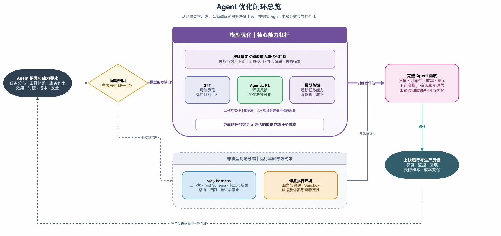

图 17.1-1 Agent 优化闭环总览

#### 17.1.1 判断优化对象：模型、Harnesss 与 执行环境

Agent 的端到端能力由**模型、Harness 和执行环境**共同形成：

*   **模型**负责在给定信息和动作空间内理解任务、作出决策、生成动作并解释反馈；
    
*   **Harness** 负责上下文组织、工具协议、任务状态、调用路由、反馈传递，以及重试和停止等运行支撑；
    
*   **执行环境**包括业务系统、数据服务、计算资源和外部服务，负责实际承载动作并返回结果。
    

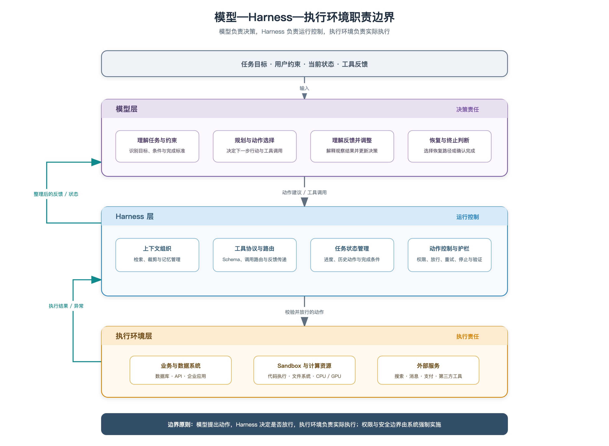

图 17.1-2 模型—Harness—执行环境职责边界

因此，Agent 优化应先判断问题发生在哪一层。以失败恢复为例，模型判断当前错误是否可恢复、下一步应采取什么动作，属于决策能力；Harness 根据模型建议和预设策略决定是否重试、停止或请求授权，属于运行控制；执行环境因服务不可用或资源不足而无法完成动作，则属于环境故障。三者可能表现为相似的失败现象，但对应的优化手段不同。 

失败归因的基本原则是：先判断模型在作出错误决策时是否已经获得准确、充分的信息，是否具备清晰可用的动作接口，以及执行环境是否正常。若必要信息缺失、工具协议含混、状态不可见或反馈被截断，应优先修复 Harness；若工具不可用、资源不足或外部服务异常，应修复执行环境；只有在信息、动作空间和反馈条件均明确且稳定时，同类决策错误仍跨任务变体反复出现，才有充分理由将其列为模型能力优化目标。 

数据分析 Agent 反复生成错误 SQL 可以说明这一原则：若模型没有获得字段含义，应改善数据字典检索和上下文供给；若工具对时间范围的描述存在歧义，应修正工具协议；若查询服务本身不可用，应处理执行环境；若字段、统计口径和执行反馈均已清楚提供，模型仍在不同任务中混淆去重或关联逻辑，才应进一步评估模型优化。

失败现象本身不能直接决定归因。例如，工具选错既可能源于模型能力不足，也可能源于工具描述含混。表 17.1-1 因此将现象与判定条件结合，并直接给出优先优化对象。

表 17.1-1 Agent 失败归因

| **归因对象** | **常见失败情况** | **如何验证** |
| --- | --- | --- |
| 执行环境 | 模型已经给出可执行动作，但业务系统、数据服务、Sandbox、计算资源或外部服务无法正常执行并返回结果 | 绕过模型直接调用相应工具或服务；若故障仍能复现，则归因于执行环境 |
| Harness | 模型没有获得必要信息、清晰的工具接口或完整反馈，或者任务状态、重试、停止和权限控制没有被可靠管理 | 固定模型和执行环境，修正上下文、工具协议或运行控制；若问题明显减少，则归因于 Harness |
| 模型 | 信息、动作接口和反馈均充分，执行环境也正常，但模型仍持续作出错误的理解、推理、工具选择、失败恢复或终止决策 | 固定 Harness 和执行环境进行重复测试或替换模型；若错误跨任务变体稳定出现，或随模型变化显著改善，则归因于模型 |

实际排查时，应先排除能够独立复现的执行环境故障，再检查 Harness 是否提供了充分的信息和可靠的运行控制，最后判断是否属于模型能力缺口。这个顺序并不意味着工具选择、重复执行等现象只能由某一层引起，而是为了避免用模型训练弥补本应由系统工程解决的问题。

对于模型与 Harness 边界不清的问题，可以在执行环境稳定的前提下组织四组对照：原模型与原 Harness、原模型与候选 Harness、候选模型与原 Harness、候选模型与候选 Harness。在一致的任务集和预算下，比较模型改动、Harness 改动及二者交互带来的收益。若候选模型需要专门的提示或协议适配，应将适配纳入对应配置记录，避免将组合变化全部归因于模型。

此外，模型优化也可以由成本目标驱动。某些高频任务已经能够依靠长提示、反复纠错或多个模型复核完成，但执行开销超过预算。如果任务分布相对稳定、有效行为可以学习，就可以评估通过 SFT 或蒸馏减少这些开销。此时需要同时调整模型和 harness，并继续保留必要的权限控制、执行约束和独立验证。

#### 17.1.2 Agent 模型能力的要求

当问题被归因于模型后，需要进一步判断模型的哪类决策能力不足。在“接收观察—作出决策—获得反馈—调整决策”的循环中，可将模型问题归纳为四类：

*   **任务理解与约束识别**。 模型需要把自然语言要求转化为可执行目标，识别完成标准、前置条件和允许的操作范围。例如，数据分析 Agent 接到“比较两个季度的客户增长”时，需要明确客户口径、时间范围和去重规则，并判断现有信息是否足够；必要条件不明确时，提出澄清也是有效的任务推进方式。
    
*   **工具使用与反馈理解**。 模型需要选择合适的工具，生成符合接口要求的动作，并判断返回结果能否支持下一步决策。调用成功仅说明接口完成了请求，模型还需要识别结果是否完整、数据口径是否一致，以及是否需要进一步核验。
    
*   **多步决策与状态利用**。 模型需要理解已经完成的工作、尚未解决的问题和当前可用的信息，并根据反馈调整行动顺序。在涉及用户协作的任务中，还要确认用户是否完成了必要操作。τ²-Bench 将用户和 Agent 都能操作共享环境的情形纳入评估，并通过消融实验区分推理错误与沟通、协调错误，说明任务完成能力需要同时覆盖决策和交互。
    
*   **失败恢复与合理终止**。 工具报错后，模型需要判断应修正参数、补充信息、切换路径还是请求帮助；结果满足完成条件后，则需要判断任务是否可以终止。
    

这些能力描述的是模型的决策表现，而不是 Agent 的完整运行能力。模型可以提出调用、重试或停止建议，但工具实际执行、状态持久化、权限校验和动作放行仍由 Harness 与执行环境承担。完成这一步，才能把笼统的“Agent 效果不好”转化为可构造训练数据、可选择学习信号、可独立验收的模型优化目标。

#### 17.1.3 设定优化目标：质量、可靠性、成本与安全护栏

确定优化对象后，需要把“更强”或“更省”转化为可验证的目标。优化动因可以分为两类：效果驱动关注任务质量和稳定性不足，效率驱动关注任务已经能够完成，但依赖过长提示、反复重试、多模型复核或较高推理成本。两类目标都应从质量、可靠性和成本三个维度共同评估。

*   **质量**。 衡量任务是否按要求完成。除最终答案外，还应检查关键动作是否正确、结果是否满足业务口径、约束是否得到遵守。对数据分析 Agent，可以检查数据源和时间范围是否正确、查询结果能否复现、结论是否得到数据支持。工具调用格式正确率等局部指标可以辅助定位问题，最终验收仍应回到完整任务。
    
*   **可靠性**。 衡量 Agent 在不同条件下能否持续完成任务。同一任务应进行多次运行，并覆盖输入变化、长交互、工具异常和用户补充条件等情形。平均成功率提高时，仍需确认关键业务场景没有回退；权限或执行边界被违反的情况应单独报告。
    
*   **成本**。 衡量获得有效结果的总体投入，包括模型调用、工具执行、失败重试和人工介入，同时观察端到端时延及其高分位表现。可采用“单位成功任务成本”，即统计期内全部任务的执行成本除以成功完成的任务数量，失败任务消耗的资源也计入分子。比较时应固定任务构成并同时报告成功率，避免因放弃困难任务而形成表面上的成本下降。
    

效率驱动并不意味着模型训练必然降低成本。SFT 只有在减少提示长度、降低重试与复核次数，或使更小模型能够胜任目标任务时，才可能降低端到端成本；否则，数据准备、训练、评测、发布和维护的一次性投入可能抵消运行节省。对于低频或变化较快的任务，轻量的 Harness 调整可能更经济；对于高频且相对稳定的任务，模型训练或蒸馏带来的单次执行节省才更可能形成累计收益。具体结论需要结合实际业务规模核算。

指标之外还需设置**安全护栏**。模型负责识别约束并提出动作，但不能仅依赖模型自行遵守：Harness 负责调用侧的权限校验、动作放行、重试上限、停止条件和独立验证，执行环境则负责资源与服务侧的强制校验和动作执行。训练前应明确目标任务、对照基线、质量门槛、可靠性要求、成本预算、安全约束和回归范围；训练后采用同一口径复测，才能判断收益是否来自预期能力提升，并确认没有以可靠性或安全性换取局部指标改善。

#### 17.1.4 选择合适的模型优化方法

确认模型能力缺口后，应根据学习信号和优化目的选择方法：

*   **有明确示范时选择 SFT**。 当工具使用、任务推进或失败恢复已有较明确的有效示范，而模型执行不够稳定时，可以通过监督微调提高这些行为在相应条件下出现的概率。训练样本应包含产生目标动作所需的上下文、工具反馈和任务变化，使模型能够在新的输入与交互状态下运用所学行为。
    
*   **需要交互探索且环境能够提供可靠反馈时选择 Agentic RL**。 当任务存在多种执行路径，路径优劣需要通过实际执行才能判断，并且环境能够提供可验证反馈时，可以通过 Agentic RL 优化行动策略。采用该方法的前提是交互环境可运行、反馈与真实任务目标一致，并且探索和训练成本可承担。
    
*   **教师模型已具备能力，且目标是迁移、压缩或部署时选择模型蒸馏**。 当教师模型能够完成目标任务，而生产环境希望使用满足特定规模、时延或部署条件的学生模型时，可以利用教师在目标任务分布上生成的输出或行动轨迹训练学生模型。学生模型在实际执行中可能进入教师示范未覆盖的状态，因此仍需检验偏差累积和失败恢复能力。
    

三类方法并不互斥。就本章讨论的输出或轨迹蒸馏而言，蒸馏通常通过教师生成数据上的 SFT 实现；SFT 后的模型也可以继续开展 Agentic RL。是否组合以及如何排序，应由基础模型能力、训练信号质量、目标 Harness 和成本预算共同决定。训练阶段应尽可能覆盖生产中的主要上下文组织、工具协议和反馈方式，或验证训练条件与生产条件之间的差异可以被可靠适配。

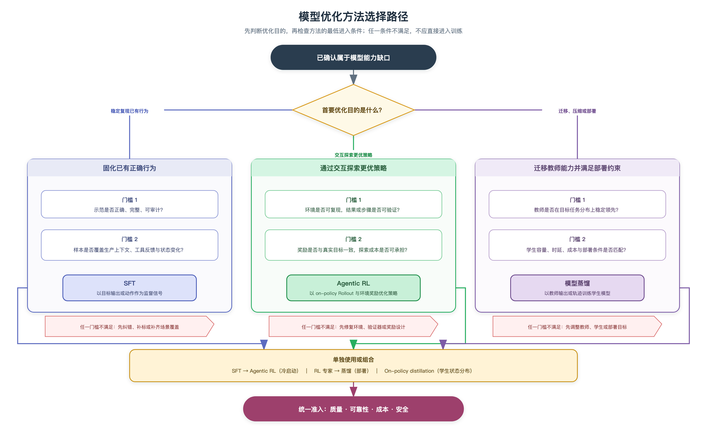

图 17.1-3 模型优化方法选择路径

进入后续训练环节前，应形成明确的优化任务定义：目标任务及分布是什么，待改善的能力缺口是什么，归因证据如何，现有 Harness 和执行环境已经提供哪些条件，采用何种学习信号和优化方法，质量、可靠性、成本与安全门槛分别是什么，以及将使用哪些独立任务和回归范围进行验收。后续各节将据此展开 SFT、Agentic RL、模型蒸馏及上线验证的方法。

### 17.2 SFT：建立面向 Agent 的任务执行能力

当问题已被归因于模型，并且正确行为能够被明确示范时，可以使用监督微调（Supervised Fine-Tuning，SFT）提高模型复现这些行为的稳定性。SFT 的作用不是替代 Harness 或执行环境，也不是自动发现未知的最优策略，而是让经过验证的理解、决策和响应方式更容易在相似任务中被模型采用。

面向 Agent 的 SFT，监督对象不只是最终答案，还包括任务执行过程中的关键决策，例如是否需要调用工具、选择哪个工具、如何生成参数、如何解释反馈，以及何时继续、澄清、求助或终止。其基本学习单位可以概括为：在当前可见的信息和动作空间下，模型应当生成什么响应或行动。

延续前文的数据分析示例：用户要求比较两个季度的新增付费企业客户，并提供核验依据。即使“按企业去重、以历史首次有效付费时间确定新增、排除测试账号”等口径已经明确，模型仍可能先筛选季度内订单，再计算首次付费时间，导致老客户被计入新增。此时，SFT 的目标不是让模型记住某一条查询语句，而是通过多样化示范，使其稳定学会“先在全量有效付费记录上确定企业首次付费时间，再按目标季度统计”的执行方法。

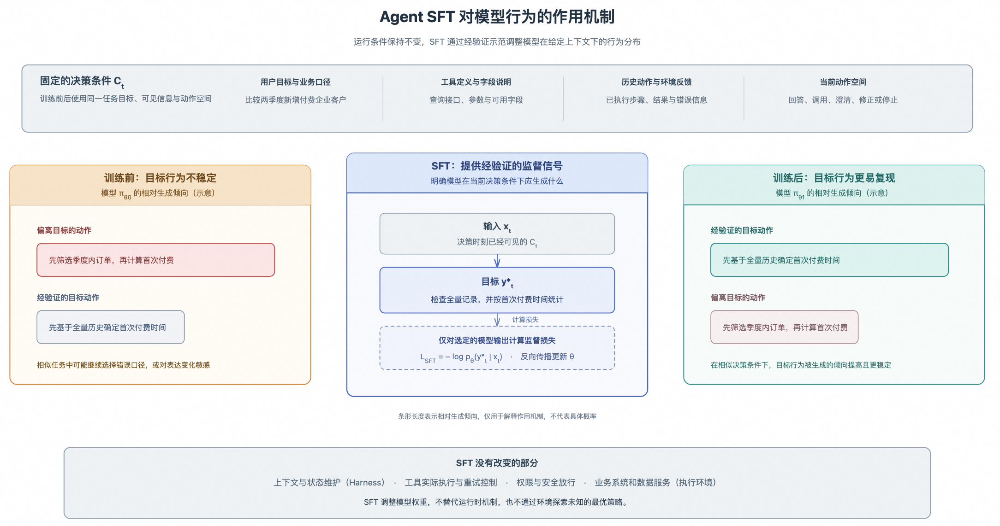

图 17.2-1 Agent SFT 对模型行为的作用机制

如图 17.2-1 所示，在任务目标、可见信息和动作空间保持一致的情况下，SFT 使用“当前决策条件—经验证目标行为”作为监督信号，调整模型参数，使目标行为在相似上下文中的生成倾向提高。它改变的是模型的条件行为分布，而不是 Harness 的状态维护、工具执行与权限控制，也不依靠环境交互探索未知的最优策略。

前文已经讨论了轨迹处理和质量资产建设。本节承接这些成果，重点说明如何从轨迹中确定监督目标、组织训练样本，并通过执行评测判断模型是否真正获得了可迁移的任务执行能力。

#### 17.2.1 明确 SFT 的适用边界

进入 SFT 前，除确认问题属于模型外，还需要判断目标行为是否能够被可靠示范。如果专家、规则系统或更强模型可以给出稳定、可核验的正确行为，SFT 可以将这些行为迁移给目标模型；如果路径优劣只能通过环境交互才能判断，或者同一状态下缺少可信的目标动作，就不应直接将不确定结果作为监督标签，而应先完善验证条件，或考虑 Agentic RL 等依赖环境反馈的方法。

监督目标应从已经识别的能力缺口出发，而不是笼统地定义为“提升 Agent 能力”。例如，工具调用失败可以进一步拆分为调用时机错误、工具选择错误、参数语义错误或反馈理解错误；多轮任务失败可以定位为约束遗失、状态利用不足或终止判断错误。只有将问题落到具体决策点，才能确定需要补充什么样本、监督哪些输出，以及用什么测试验证改进。

面向 Agent 的 SFT 通常覆盖以下几类目标行为：在信息充分时直接回答，在需要外部信息时选择工具，在关键条件缺失时提出澄清；依据用户要求和当前接口生成参数；结合工具结果更新计划；在错误、权限不足或结果不完整时选择修正、求助或停止。模型负责学习这些决策，任务状态维护、工具实际调用、权限校验、重试上限和动作放行仍由 Harness 与执行环境负责。

#### 17.2.2 从轨迹中构造可监督样本

轨迹记录了任务执行过程，但轨迹本身不等于监督目标。一条轨迹可能同时包含系统指令、用户请求、工具定义、模型动作、环境反馈和后续修正；其中只有经过验证、值得复用的模型行为才应参与监督。面向 Agent 的样本构造，本质上是在保持决策因果关系的前提下，将完整轨迹转化为若干“可见上下文—目标行为”样本。

每个目标行为只能依赖该决策时刻已经可见的信息。某次工具调用尚未返回时，目标动作不能使用其结果；用户在后续轮次补充的条件，也不能提前进入早期决策的输入。否则，离线训练中的信息条件优于真实运行条件，模型即使拟合了监督数据，上线后也难以复现相同表现。

完整交互可以作为连续上下文输入，也可以按决策点拆分为多个历史前缀样本。两种方式都需要保留目标动作所依赖的任务约束、工具说明、历史动作和环境反馈。模型需要学习的是如何利用这些信息作出当前决策，而不是承担运行时的状态存储；如果必要状态在进入模型前已经被截断、遗漏或错误组织，应先修复 Harness，而不是依靠 SFT 补偿。

样本覆盖应同时包含正常执行、多轮推进和异常恢复，但不必将三者割裂为独立能力。对于工具使用，需要覆盖直接回答、发起调用和请求澄清等不同选择，避免模型形成“遇到任务就调用工具”的单一习惯；对于多轮任务，需要保留约束变化、已有结果和待完成步骤之间的关系；对于异常场景，则需要呈现错误发生后的可见状态，以及经过验证的修正、求助或终止行为。

在新增客户分析任务中，样本应保留客户口径、字段说明和当前可用工具，并将正确的查询动作及其依据作为目标。工具返回后，后续目标可以是核验统计口径、补充查询或形成有证据支持的答复。通过改变季度范围、字段表达、表结构和数据分布，可以使模型学习可迁移的处理原则，而不是记忆固定模板。

#### 17.2.3 筛选监督内容并控制样本质量

任务最终成功，并不意味着轨迹中的每一步都值得模仿。成功轨迹可能包含多余查询、无依据的判断，或错误后偶然得到正确结果的步骤；失败轨迹中也可能包含有价值的错误反馈和恢复过程。因此，样本质量不能只由最终结果决定，还需要对关键行为逐步审查。

对于纠错场景，可以将错误动作保留在历史上下文中，使模型理解当前为何需要修正，但屏蔽该错误动作对应的训练损失，只监督经过验证的后续行为。例如，模型提交查询后收到“字段不存在”的反馈，样本可以保留原调用和错误信息，并将检查可用字段、修改查询及重新核验作为目标。这样训练的是错误后的恢复决策，而不是错误动作本身。

不同交互内容在训练中的作用可以按表 17.2-1 处理。

表 17.2-1 Agent SFT 中不同交互内容的监督处理

| 交互内容 | 在样本中的作用 | 常见监督处理 |
| --- | --- | --- |
| 系统指令、用户请求与工具定义 | 提供任务目标、约束和动作空间 | 作为输入上下文，通常不作为本任务的生成目标 |
| 工具结果、环境观察与错误反馈 | 提供决策时可见的执行状态 | 保留在输入中，通常不计算生成损失 |
| 经验证的工具调用、澄清、修正和最终答复 | 表示模型应当学习的目标行为 | 对选定内容计算监督损失 |
| 用于解释恢复场景的错误模型步骤 | 说明失败状态及后续修正的起点 | 可保留为上下文，但屏蔽相应损失 |
| 尚未核验或质量存疑的步骤 | 无法确认是否值得模型复用 | 补充核验；无法确认时移出训练集 |

角色级掩码和质量级掩码解决不同问题。仅对模型生成内容计算损失，可以排除用户消息和工具返回；但错误调用本身也可能由模型生成，因此仍需更细粒度的行为标记。实施时应抽查实际参与损失计算的内容，确认工具调用结构、响应边界和错误步骤处理符合设计。

#### 17.2.4 组织训练并保持能力边界

样本配比应同时反映生产任务分布和已经确认的能力缺口。高频任务用于建立稳定的基本行为，长链路任务用于训练跨步骤的信息利用，低频但影响较大的异常用于补足恢复能力。对于原本可以直接完成的简单任务，也应保留相应样本，防止训练后普遍增加工具调用或交互轮次。

样本不需要机械地等量混合。更合适的做法是根据开发集中的失败类型调整覆盖范围，同时保留必要的通用指令遵循和问答样本，检查专业任务改善是否伴随其他能力回退。重复复制少量同质示范只能提高这些示范的权重，不能替代对任务变化、状态分支和异常条件的真实覆盖。

训练和推理应使用相互兼容的对话模板、工具调用格式与结束标记。较长样本还需要检查截断位置，避免保留目标动作却丢失其依赖的约束或工具结果。否则，训练损失可能正常下降，但模型生成的动作无法被运行时解析，或缺少作出正确决策所需的信息。

参数更新可以采用全量微调，也可以使用 LoRA 等参数高效微调方法。LoRA 能够减少可训练参数和相关资源开销，适合在预算受限时快速迭代；全量微调提供更大的参数调整空间，但通常需要更高的训练和版本维护成本。二者都不能替代数据质量控制，也不能天然避免能力回退，最终选择应根据基座模型、任务复杂度、资源预算和独立评测结果确定。

#### 17.2.5 通过执行评测验证行为泛化

训练损失下降只说明模型更容易生成监督样本中的目标内容，不能证明它能够在真实交互中完成任务。SFT 的验收应让候选模型在固定的 Harness、工具接口和执行预算下自主运行，由环境返回实际反馈，再观察早期决策如何影响后续执行。若每一步都提供标准历史，只检查模型能否续写下一条标准响应，就无法暴露错误累积和恢复失败。

质量关注任务是否完成、关键约束是否满足，以及答复是否有执行结果支持；可靠性关注不同输入、长交互和异常条件下的重复表现；成本关注工具调用次数、token、端到端时延和单位成功任务成本；安全则检查权限边界、危险动作和停止条件是否得到遵守。工具调用格式正确率等局部指标可用于定位问题，但不能替代完整任务的验收。

测试集应尽量按任务族、模板或数据来源进行分组，避免同一任务的近似改写同时进入训练集和测试集。对于新增客户分析任务，可以改变季度范围、字段表达和数据分布，并加入历史客户再次付费、同一企业存在多笔订单等条件，检查模型能否继续正确应用新增口径。还应覆盖工具描述变化、用户中途修改要求和可恢复的执行错误，验证模型学习的是执行方法而不是固定表达。

比较不同模型版本时，应保持 Harness、任务条件和执行预算一致；如果同时修改提示词、工具协议或上下文策略，应将其作为组合变更单独记录。对存在采样随机性的任务，需要进行重复运行并报告波动范围。最终交付物应包括候选模型或适配器、训练与推理配置、数据版本，以及按能力缺口和统一准入指标组织的评测报告。

#### 17.2.6 与 Agentic RL 和模型蒸馏衔接

SFT 适合将已经明确的正确行为转化为稳定的初始策略，但其效果受示范质量、任务覆盖和基座模型能力约束。当模型已经能够执行任务，却需要通过环境交互寻找示范之外的更优路径，或者需要处理长程信用分配问题时，可以进一步进入 Agentic RL；当成熟能力需要迁移到更小、更低成本或更易部署的模型时，可以使用教师输出或轨迹构造蒸馏数据，并主要通过 SFT 训练学生模型。

三种方法由不同问题驱动，而不是固定的流水线。SFT 可以作为 Agentic RL 的稳定起点，也可以直接承载输出或轨迹蒸馏；是否继续采用其他方法，应由执行评测暴露的剩余能力缺口和部署目标决定。

### 17.3 Agentic RL：以环境反馈优化决策策略

Agentic RL 使用模型在环境中执行任务产生的轨迹作为学习样本，并依据任务结果、过程状态或验证器反馈更新模型策略。它优化的不是某一条固定回答，而是模型在连续决策中选择动作的倾向：何时调用工具、选择哪个工具、如何生成参数、如何解释返回结果，以及何时修正、求助或终止任务。

SFT 与 Agentic RL 都可以优化工具调用和多步决策，二者的区别在于监督信号的来源。SFT 从固定示范中学习目标行为，提高示范动作在相似上下文中的生成概率；Agentic RL 则让策略在环境中产生一条或多条执行轨迹，再利用结果或过程反馈优化期望任务收益。前者要求目标行为能够被可靠示范，后者允许存在多种可行路径，但要求路径优劣能够被稳定评价。

延续前文的数据分析思路，假设任务变为“核验订单是否满足规则并发起退款”。模型可能正确查询订单，却跳过退款政策核验；也可能完成退款，但使用了不必要的工具调用。单独标注每一步的唯一正确动作并不容易，但任务是否完成、退款金额是否正确、政策是否满足、是否发生越权操作通常可以验证。此类任务具备进入 Agentic RL 的基本条件。

Agentic RL 不是对 Harness 或执行环境缺陷的补偿。如果必要上下文没有进入模型、工具定义存在歧义、权限控制可以被绕过，或环境无法稳定复现，训练只会把错误的观察和反馈固化进策略。本节因此按照“准入判断—环境与任务—奖励与验证器—Rollout 与策略更新—长程优化—独立验证”的顺序展开。

#### 17.3.1 判断任务是否适合 Agentic RL

进入 Agentic RL 前，需要分别回答两个问题：这个任务是否值得使用强化学习，以及当前系统是否具备训练条件。前者由模型能力缺口和任务反馈结构决定，后者由环境、验证器、安全边界和训练成本决定。只有两类条件同时满足，Agentic RL 才是合理选择。

**表 17.3-1 Agentic RL 准入判断**

| 判断维度 | 适合进入 Agentic RL 的条件 | 条件不满足时的优先处理 |
| --- | --- | --- |
| 问题归因 | 失败来自模型的动作选择、反馈利用或恢复策略 | 先修复上下文、工具协议、权限或执行环境 |
| 示范可得性 | 有效路径不唯一，难以为每个决策点提供稳定标签 | 若正确行为可稳定示范，优先使用 SFT |
| 结果可验证性 | 任务结果或关键中间状态可由规则、测试或可靠评审稳定判断 | 先建设验证器或高质量标尺集 |
| 环境能力 | 任务可重复执行，状态可重置，探索可隔离，过程可追踪 | 先建设 Sandbox、模拟器或可回放环境 |
| 基础策略 | 模型已具备基本指令遵循和工具调用能力，能够产生一定比例的有效轨迹 | 先通过提示、SFT 或能力更强的基座建立可学习起点 |
| 投入产出 | 预期成功率、可靠性或单位成功任务成本的改善能够覆盖 Rollout 与环境维护成本 | 使用更低成本的模型、数据或 Harness 优化方案 |

其中，“结果可验证”比“过程能够被完整标注”更重要。Agentic RL 可以在多条路径之间寻找更优策略，但无法从不可靠的反馈中自动推断真实目标。如果退款验证器只检查“是否生成退款记录”，却不检查政策、金额和权限，模型就可能学会更快地创建不合规退款。

对退款任务而言，Agentic RL 的准入条件可以具体化为：订单、政策和退款状态能够在隔离环境中执行和重置；任务成功可由数据库状态与业务规则联合判断；模型已经能够调用基础工具，但仍存在漏检政策、错误恢复不足或调用成本过高等策略问题。若模型连工具参数格式都无法稳定生成，应先完成 SFT，而不是直接扩大 Rollout。

#### 17.3.2 构建可交互、可验证的训练环境

Agentic RL 首先需要把业务任务转化为可重复的交互过程。外部系统存在模型无法直接观察的真实状态`sₜ`，模型通常只能看到用户请求、历史消息、工具定义和工具返回等局部信息`oₜ`。因此，更合适的描述是：模型依据截至当前时刻的交互历史`hₜ=(o₀,a₀,…,oₜ)`选择动作，而不是把单次观察当作完整状态。

对多数 Agent 而言，外部系统存在模型无法直接观察的真实状态；模型只能看到用户请求、历史消息、工具返回等局部观察。因此，更适合将任务描述为部分可观测序列决策过程。模型依据交互历史 选择动作，而不是把单步观察直接视为完整状态。

令第 `t` 步可见信息为`oₜ`，动作记为`aₜ`，环境或验证器返回的反馈为`rₜ` ，一条执行轨迹可表示为：

```text
τ = (o₀, a₀, r₀, o₁, a₁, r₁, …, oₜ, aₜ, rₜ)
```

模型历史记为 `hₜ=(o₀,a₀,…,oₜ)`，策略写作 `πθ(aₜ|hₜ)`，训练目标是在任务分布和环境转移下最大化期望累计回报：

```text
J(θ) = E[ Σₜ γᵗ rₜ ],  aₜ ~ πθ(·|hₜ)
```

任务建模需要明确四个要素：

*   **观察**：模型在每一步能够看到什么，包括用户目标、上下文、工具描述、历史动作、工具结果和剩余预算。观察必须与生产环境保持一致，避免训练时获得线上不可用的信息。
    
*   **动作**：模型能够做什么，包括输出回复、调用工具、写入记忆、请求澄清、等待外部事件或结束任务。动作粒度可按完整回复、工具调用或更细的 token 级别定义。
    
*   **转移**：动作如何改变环境。工具调用可能成功、失败、超时或返回不完整结果；用户和外部系统也可能改变后续状态。
    
*   **任务结束**：任务结束还需要区分终止（termination）和截断（truncation）。任务成功、业务失败或预算耗尽被明确建模为失败状态时，应记录为终止；仅因外部采样时限、基础设施中断等与任务目标无关的原因停止时，才属于截断。只有截断后仍能获得有效的后继观察，并且价值函数能够基于后继历史 hₜ₊₁ 或其充分状态表示估计后续回报时，才适合进行价值 bootstrap；不能把所有未完成轨迹一律当作失败，也不能在缺少后继状态时强行续估。
    

训练环境应满足以下要求：

*   **可执行**：工具、数据库、沙箱或模拟器能够真实响应模型动作；
    
*   **可重置**：每次 rollout 可以恢复到明确的初始状态，避免样本相互污染；
    
*   **可复现**：记录任务、随机种子、工具版本、Prompt 和环境快照；
    
*   **可审计**：完整保存观察、动作、返回、时延、成本和终止原因；
    
*   **可隔离**：训练探索不得直接作用于真实生产数据或高风险系统。
    

退款任务可以压缩为如下环境规格：

```json
{
  "task_id": "refund_017",
  "environment_version": "refund-sandbox-v4",
  "initial_observation": {
    "user_goal": "核验订单并发起退款",
    "available_tools": [
      "query_order",
      "check_policy",
      "create_refund"
    ]
  },
  "limits": {
    "max_steps": 12,
    "max_tool_calls": 8,
    "timeout_seconds": 90
  },
  "terminal_checks": [
    "refund_created",
    "policy_satisfied",
    "amount_verified"
  ]
}

```

这份规格不仅定义了模型可以做什么，也定义了系统如何判断任务完成。环境版本、工具协议或停止规则发生变化，模型面对的决策问题也随之变化，因此必须作为训练版本的一部分记录。

#### 17.3.3 设计奖励与验证器

奖励定义了策略更新的方向。设计原则不是“让奖励更丰富”，而是让奖励尽可能贴近真实任务目标，并减少模型利用评价漏洞获得高分的空间。

奖励通常由四类信号组成：

*   **结果奖励**：任务是否完成，最终结果是否正确、完整、可验证。它与业务目标最接近，应作为核心信号。
    
*   **过程奖励**：关键中间状态是否满足要求，例如工具选择是否合理、参数是否合法、必要证据是否完成核验。它可以缓解终局奖励稀疏，但不应强制模型复制唯一流程。
    
*   **成本信号**：工具调用次数、token 消耗、执行时延、失败重试和人工介入。成本应在任务成功的前提下优化，不能诱导模型通过提前终止规避困难任务。
    
*   **约束信号**：权限、隐私、格式和操作边界。高风险约束不能只依赖负奖励，还必须由 harness 设置不可绕过的系统控制。
    

一个可操作的组合形式是：

```text
R(τ) = w₁R_task + w₂R_process - λC_execution - μP_violation
```

其中，`R_task` 衡量任务结果，`R_process` 衡量关键过程，`C_execution` 表示执行成本，`P_violation` 表示约束违反。权重不应仅凭经验设定，而应通过离线回放、人工抽检和消融实验校准。

**表 17.3-2 退款任务中的反馈层级**

| 反馈层级 | 退款任务示例 | 设计边界 |
| --- | --- | --- |
| 系统硬约束 | 禁止越权退款、限制金额、隔离真实账户 | 由 Harness 与执行环境强制实施，不能只依赖负奖励 |
| 结果奖励 | 退款已创建，政策满足，金额与订单一致 | 直接对应任务成功，应作为核心信号 |
| 过程奖励 | 已核验订单状态、退款政策和金额依据 | 只奖励可客观判断的关键状态，不规定唯一行动序列 |
| 成本信号 | 无效查询、重复调用、时延和人工介入 | 优先比较成功策略，避免诱导提前终止 |

反馈由验证器（Verifier）产生，通常包括三类：

*   **规则验证器**：基于结构校验、数据库状态、单元测试或业务规则评分。结果稳定、成本较低，适合可形式化任务。
    
*   **模型验证器**：评价开放式结果的正确性、完整性和一致性。覆盖面更广，但需要检查偏见、长度偏好和自洽性偏差。
    
*   **人工反馈**：用于校准复杂偏好、审查边界案例和验证自动评分。成本较高，适合构建高质量标尺集，而非覆盖全部 rollout。
    

奖励设计的主要风险如下：

*   **奖励投机**：模型找到评分规则的漏洞，而非完成真实任务；
    
*   **代理目标偏移**：局部指标上升，但端到端成功率、可靠性或用户价值下降；
    
*   **评审器漂移**：验证模型或业务规则变化后，历史奖励与当前标准不再一致。
    

对应的控制原则是把训练奖励、独立评测指标和系统约束分开：奖励负责提供学习信号，独立评测判断能力是否真实提升，系统控制保证任何模型版本都不能越过操作边界。这三套机制作用于不同对象、在不同时刻反馈，其边界关系如图 17.3-1 所示。

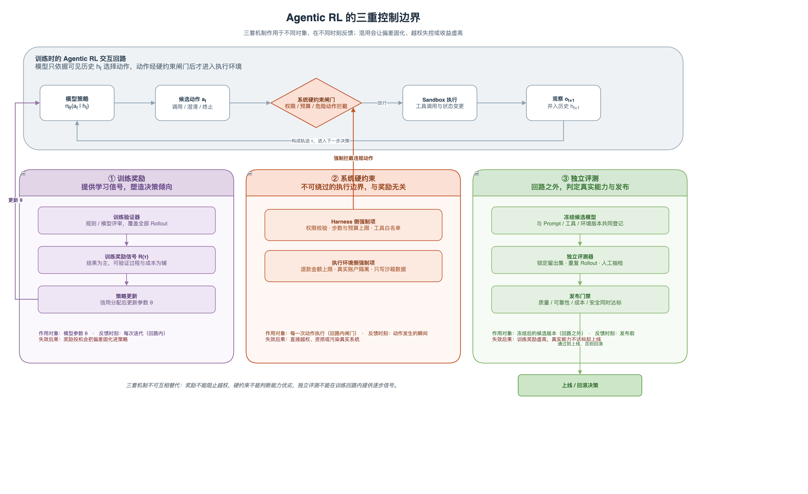

图 17.3-1 Agentic RL的三重控制边界

#### 17.3.4 组织 Rollout 与策略更新

Agentic RL 的基本循环是：模型在环境中执行任务，系统记录交互轨迹，验证器（Verifier）计算反馈，训练器据此更新策略，再由新策略重新执行任务。

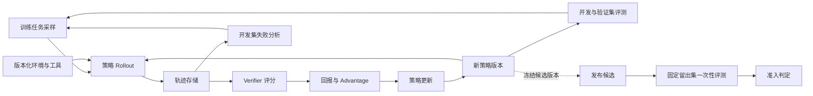
```mermaid
flowchart LR
    A[训练任务采样] --> B[策略 Rollout]
    E[版本化环境与工具] --> B
    B --> C[轨迹存储]
    C --> D[Verifier 评分]
    D --> F[回报与 Advantage]
    F --> G[策略更新]
    G --> H[新策略版本]
    H --> B
    C --> I[开发集失败分析]
    I --> A
    H --> V[开发与验证集评测]
    V --> A
    H -.冻结候选版本.-> J[发布候选]
    J --> K[固定留出集一次性评测]
    K --> L[准入判定]
```

图 17.3-2 Agentic RL的训练闭环

一轮训练通常包含以下步骤：

*   **任务采样**：从训练任务分布中按场景、难度和决策跨度采样，避免简单任务占据主要训练预算；
    
*   **交互采样**：使用行为策略进行 rollout，对同一任务生成一条或多条轨迹，保留成功、失败和恢复路径；
    
*   **反馈计算**：由环境状态、规则验证器和模型验证器生成结果奖励及必要的过程信号；
    
*   **信用分配**：估计不同动作对最终回报的贡献，将轨迹级反馈转化为可学习的优势（Advantage）信号；
    
*   **策略更新**：使用 PPO、组相对策略优化或其他策略梯度方法更新模型，并通过裁剪目标与 KL 正则抑制过大的策略漂移；
    
*   **版本注册**：绑定模型、环境、工具、Prompt、验证器和训练配置，保证收益可追踪、问题可回放。
    

一个不依赖具体算法的训练骨架可以压缩为：

```python
policy = initialize_from_base_or_sft_model()

for iteration in range(num_iterations):
    rollout_policy = freeze(snapshot(policy))
    tasks = sample_tasks_by_scenario_and_difficulty()
    trajectories = rollout(tasks, rollout_policy, pinned_environment)
    rewards = verifier.score(trajectories, pinned_verifier)
    update_batch = assign_credit(trajectories, rewards)
    policy = update_policy(policy, rollout_policy, update_batch)
    evaluate_on_development_suite(policy)

candidate = freeze(select_by_validation_results())
evaluate_on_locked_holdout(candidate)
register_if_pass(candidate)

```

使用基于价值估计的 PPO 训练时，Rollout 通常由更新前的行为策略生成，再利用概率比率裁剪限制策略变化，并通过价值函数估计优势；参考策略 KL 可以进一步抑制偏移，但不是 PPO 的必备定义。PPO 属于近似 on-policy 方法，轨迹跨多个策略版本反复复用会增加离策略偏差，需要限制复用范围或进行相应校正。

组相对方法改变的主要是优势基线：它对同一任务生成多条轨迹，用组内相对回报替代单独训练的价值模型；策略更新仍可采用 PPO 式裁剪，同样需要关注采样策略与当前策略的偏差。它适合能够并行采样且同一任务存在明显回报差异的场景；如果组内结果几乎相同，优势信号会趋近于零，而多轨迹 Rollout 也会增加执行成本。

**表 17.3-3 优势估计方式的选择条件**

| 方式 | 主要优势 | 主要代价 | 适用条件 |
| --- | --- | --- | --- |
| 价值模型基线 | 可结合状态价值估计，对不同轨迹位置构造较细粒度优势 | 需要训练和维护价值模型，系统复杂度较高 | 能够获得稳定价值估计，任务需要细粒度信用分配 |
| 组相对基线 | 利用同任务多轨迹比较，无需单独训练价值模型 | Rollout 成本较高，依赖组内回报差异 | 任务可重复采样，验证器能够稳定排序 |

算法不能弥补任务和奖励设计缺陷。无论选择何种优势估计和策略更新方式，都应先确认奖励具有区分度、Rollout 覆盖有效路径、环境状态可重置，并且策略更新后的收益能够在独立任务集上复现。

工程上，Agent 执行系统与模型训练系统通常需要解耦。执行侧负责维护上下文和状态、调用工具、实施权限、采集轨迹与反馈；训练侧负责任务采样、奖励计算、优势构造、参数更新和模型注册。两侧通过标准化模型调用接口和轨迹协议连接，但工具版本、Prompt、环境、验证器和策略版本必须共同登记，才能回放收益与定位退化。

在平台实现中，PAI 强化学习服务可用于组织任务与并行 Rollout、接入规则或模型验证器并执行策略训练；工具调用和状态变更则可在隔离的 Sandbox 环境中运行。平台的价值不是替业务定义奖励，而是以标准化接口连接环境、轨迹、训练与评测，使整个过程具备可复现、可扩展和可审计的工程基础。

#### 17.3.5 优化长程决策与失败恢复

长程任务的困难不只是步骤更多，而是反馈更晚、有效路径更少，且早期错误会改变后续状态。终局失败通常由多个决策共同造成，把相同回报平均分配给所有动作，难以识别真正需要调整的位置。

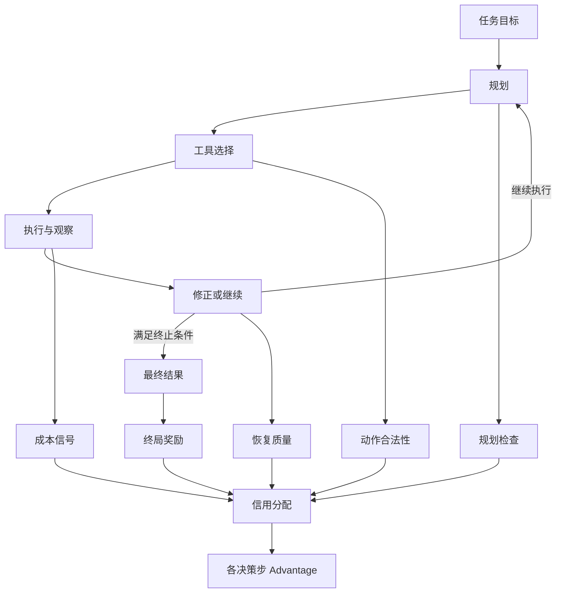
```mermaid
flowchart TD
    G[任务目标] --> P[规划]
    P --> T[工具选择]
    T --> X[执行与观察]
    X --> R[修正或继续]
    R -->|继续执行| P
    R -->|满足终止条件| O[最终结果]

    O --> RT[终局奖励]
    P --> RP[规划检查]
    T --> RV[动作合法性]
    X --> RC[成本信号]
    R --> RR[恢复质量]

    RT --> C[信用分配]
    RP --> C
    RV --> C
    RC --> C
    RR --> C
    C --> A[各决策步 Advantage]
```

图 17.3-3 Agentic RL 的信用分配机制

提高长程学习效率可以从四个方面入手。首先，采用课程式任务采样，从短轨迹和强反馈任务开始，再逐步增加工具数量、状态变化和决策跨度。其次，只在能够客观验证的阶段性状态提供过程反馈，例如“订单已核验”“政策已满足”，而不是为每一步自然语言推理打分。再次，对同一任务采样多条轨迹，用相对结果识别更优路径。最后，显式覆盖参数修正、工具切换、状态回滚、请求澄清和合理终止，使恢复行为进入可探索的任务分布。

轨迹分段本身不会自动改善信用分配。只有当分段同时对应可验证的子目标、阶段奖励、价值估计或层级策略时，才可能缩短信号传播距离；如果只是把长轨迹切成若干文本片段，却没有可靠反馈，模型仍然无法判断哪个早期动作导致了最终结果。

退款任务中的两条轨迹可以形成直观对照：

```text
轨迹 A：查询订单 → 直接创建退款 → 政策校验失败 → 任务失败
轨迹 B：查询订单 → 核验退款政策 → 校验金额 → 创建退款 → 任务成功

```

Agentic RL 不要求把轨迹 B 的每一步定义为唯一标准答案，而是利用“退款成功、政策满足、金额正确、无越权操作”等反馈，提高产生合规成功路径的概率。如果另一条路径同样满足结果、约束和成本目标，也应被视为有效策略。图 17.3-4 把这一思路展开为多条候选轨迹：既包含结果失败与违反硬约束被拦截的路径，也包含成本不同的两条合规成功路径，训练目标是提高落入有效策略集合的概率，并在集合内偏好更低成本的策略。

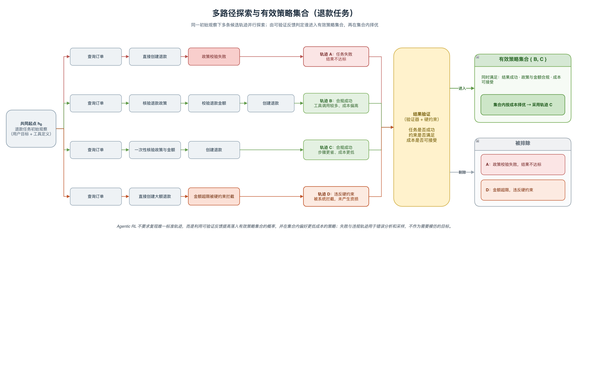

图 17.3-4 多路径探索与有效策略集合

失败轨迹需要区分使用方式。它们可以直接用于错误分析、任务重采样、奖励设计，也可以经过验证后转化为 SFT 的恢复样本；但若用于 PPO 等近似 on-policy 的策略梯度更新，应保持与当前策略足够接近，或采用适当的离策略校正。将历史失败轨迹无限回放并不会自然产生有效的策略梯度。

探索也必须服从系统边界。最大步数、工具权限、资源预算和可写数据范围应由 Harness 与 Sandbox 控制。奖励可以鼓励模型减少无效行动，却不能代替权限系统阻止高风险调用。

#### 17.3.6 通过独立评测确认真实收益

训练奖励上升只能说明策略更擅长获得当前奖励，不能证明真实任务能力已经提升。独立评测的作用，是在训练回路之外回答一个更严格的问题：冻结后的 RL 模型，在相同系统条件下，是否比基线模型更稳定、更安全且更经济地完成真实任务。 因此，验收应按以下四步展开。

第一步，冻结候选版本并建立可比基线。 对基础模型、SFT 模型与 RL 模型进行对照时，应保持 Prompt、Harness、工具协议、执行预算和环境版本一致。模型版本及其训练配置需要单独登记，避免把 Prompt 调整、权限放宽或环境简化带来的收益误判为策略能力提升。

第二步，隔离评测数据与评测机制。 训练阶段使用的反馈不应直接充当发布结论，具体包括：

*   开发集用于设计任务、奖励和验证器，允许反复迭代；
    
*   验证集用于选择模型版本与推理配置；
    
*   锁定留出集仅用于候选版本冻结后的发布验收，并按任务模板、业务实体、环境种子和工具版本与训练数据隔离；
    
*   训练验证器与独立评测器应尽量分离。采用模型评审时，需要通过人工标尺集验证一致性，并检查其对长度、措辞和模型身份的偏好；对高分轨迹还应进行人工抽检，以排除评分漏洞、隐藏状态和环境实现细节的利用。
    

即使没有直接使用留出集调参，长期依据同一留出集的通过结果选择版本，也会产生间接过拟合。因此，需要定期更新私有任务、轮换环境种子，或保留新的影子评测集。

第三步，从四个维度报告端到端结果。 独立评测仍应遵循 17.1 的质量、可靠性、成本和安全准入框架，但指标必须覆盖完整 Agent 运行结果，而不是只观察模型输出：

*   质量： 报告端到端任务成功率，并确认高分不是来自环境捷径或验证器漏洞；
    
*   可靠性： 对同一任务执行多次 Rollout，报告成功率波动、失败类型和必要的置信区间；
    
*   成本： 统计单位成功任务的平均 token、工具调用次数、时延和资源消耗，而不是只比较单次模型调用成本；
    
*   安全： 统计越权尝试、约束拦截、错误状态变更和异常终止。这里既要评价模型产生违规动作的频率，也要单独验证 Harness 与执行环境是否能够可靠拦截。
    

落实到退款任务，可以重点报告合规退款成功率、工具失败后的恢复率、越权或金额错误率，以及每个成功退款的平均 token、工具调用次数和端到端时延。

第四步，解释收益来源并形成发布判断。 当 RL 模型优于基线时，仍需通过消融实验判断收益来自何处，例如分别移除过程奖励、成本信号、课程采样、恢复任务或特定验证器，再观察端到端成功率、异常恢复率和单位成功任务成本的变化。如果训练回报提高而独立成功率没有同步改善，应优先检查以下问题：

*   奖励定义是否鼓励了代理目标或捷径；
    
*   训练验证器是否存在系统性偏差；
    
*   训练环境是否向模型泄漏了答案或隐藏状态；
    
*   训练环境与生产环境是否存在任务、工具或状态分布差异。
    

上线应采用分任务、分流量灰度，并预先设置扩大、暂停和回滚条件。只有当独立评测与真实流量均显示稳定收益，且质量、安全和成本护栏持续满足准入要求时，才能认为 Agentic RL 的改进完成了从“训练奖励上升”到“真实系统收益”的验证。

这一判断也构成 Agentic RL 落地的最终边界：问题应确实来自模型策略，环境应能够重复执行并提供可信反馈，训练收益还应能够在独立任务和完整 Agent 系统中复现。若任务不可验证、环境不可复现或系统控制存在缺陷，强化学习可能把偏差固化进模型。因此，Agentic RL 既是模型优化问题，也是环境工程、反馈工程和评测工程的联合问题。

### 17.4 模型蒸馏：迁移任务能力，降低执行成本

大模型为 Agent 提供了更强的规划、工具使用与错误恢复能力，但如果每一步决策都依赖高成本模型，调用费用、端到端时延和服务容量会很快成为规模化瓶颈。模型蒸馏的目标并不是简单地让小模型“说得像”强模型，而是把强模型在任务执行中表现出的有效决策迁移给目标模型，使其能够以更低成本独立承担可界定、可评测的工作，并在超出能力边界时主动交还给教师模型。

因此，Agent 蒸馏应回答两个相互约束的问题：哪些能力可以稳定迁移，以及迁移后是否真正降低了每个成功任务的总成本。前者要求训练数据覆盖 Agent 的交互决策，而不只是最终答案；后者要求把失败、重试、工具调用和教师兜底一并纳入核算，而不只比较单次模型调用价格。

#### 17.4.1 确定蒸馏目标：确定能力范围与教师、学生模型

蒸馏设计应从线上职责出发，而不是从模型尺寸出发。教师模型需要在目标任务上具备足够高且稳定的成功率，并能产生可验证的示范；学生模型则要在质量底线、推理时延、显存占用、吞吐与单位调用成本之间达到可部署的平衡。若教师在某类任务上本身不稳定，蒸馏只会更高效地复制其错误。若学生容量过小，增加示范数量也未必能弥补表示能力与长程规划能力的不足。

可先建立一张“任务—职责—风险”矩阵，将任务划分为学生独立执行、学生执行且教师校验、教师直接执行三类。任务边界至少应包含输入分布、允许调用的工具、最大行动步数、成功判定方式和不可接受的失败类型。对于高风险或不可逆操作，即使学生在离线评测中达到较高成功率，也不宜仅凭平均分取消教师校验。

Agent 能力迁移通常有两种范围。完整 Agent 行为迁移要求学生学习从理解目标、制定计划、选择工具、生成参数、解释观察到最终作答的连续过程；技能级迁移则只让学生承担其中一个稳定环节，例如工具路由、查询生成、参数抽取、结果核验或格式转换。后者更容易定义成功标准和故障边界，也更适合作为首次落地的切入点。

AgentDistill 的实验表明，蒸馏 Thought—Action—Observation 轨迹可以让较小模型学习检索和代码工具的组合使用，而不只是复现最终答案；其训练损失覆盖教师的思考与动作 token，不把环境返回的 observation 作为预测目标。这一结果说明，工具名称、查询内容和调用参数只要被序列化为动作，就可以纳入统一的语言建模目标。但该工作仅在固定工具协议、有限步数和特定任务集上验证，不能据此推断任意复杂 Agent 能力都能完整迁移。

教师与学生的选择可用以下四项约束共同决定：

*   任务覆盖决定教师是否“会做”；
    
*   示范可验证性决定错误数据能否被过滤；
    
*   学生容量决定其能否承载所需技能；
    
*   线上预算决定蒸馏后是否具有经济意义。
    

实践中，应先用候选学生完成小规模可教性测试，再决定数据规模和训练投入，避免在能力上限尚未明确时盲目扩大蒸馏集。

#### 17.4.2 构造教师信号：从任务输出到交互决策

教师信号的价值取决于其是否覆盖了学生上线后必须作出的决策。仅用最终答案训练，学生可能学会结果形式，却没有学会何时调用工具、如何构造参数以及观察异常后如何调整。对 Agent 而言，更有用的监督通常沿着四个层次逐步增加：

*   最终输出提供结果级模仿；
    
*   推理说明提供中间依据；
    
*   结构化动作提供工具与参数决策；
    
*   多轮轨迹则进一步覆盖行动后的状态变化和恢复行为。
    

| **教师信号** | **主要学习对象** | **优点** | **主要局限** |
| --- | --- | --- | --- |
| 最终输出 | 答案、格式、风格 | 生成成本低，适合黑盒教师 | 难以学习工具时机和失败恢复 |
| 标签与理由 | 结果及任务相关依据 | 比纯标签提供更密集监督 | 理由可能事后合理化，也可能复制教师偏差 |
| 结构化动作 | 工具选择、参数、约束 | 可直接评测动作是否合法 | 需要稳定的工具协议和参数校验器 |
| 多轮轨迹 | 计划、行动、观察、修正 | 最接近真实 Agent 执行分布 | 轨迹昂贵，错误会沿多轮累积 |
| 概率信号 | 每个决策位置的相对偏好 | 保留教师不确定性，监督更细 | 依赖教师概率接口、词表与 tokenizer 对齐 |

按教师可见信息，蒸馏又可分为硬目标和软目标。硬目标只需要教师生成文本或动作序列，适用于闭源 API、跨模型架构和不同词表的场景，但会丢失教师在候选 token 之间的相对偏好。软目标使用教师的概率分布或 log-prob，能够告诉学生“哪些替代行为也合理、哪些行为几乎不应选择”，但通常要求访问教师的概率接口。在具体系统中，软目标训练还可能增加概率数据的传输与存储开销；教师和学生 tokenizer 不一致时，也需要额外设计对齐方案。因此，是否使用概率蒸馏不是单纯的算法偏好，而是由教师访问方式和训练基础设施共同决定的工程约束。

教师示范进入训练集之前还必须经过验证。最终答案可用标准答案或裁判器检查，工具动作可用 schema、权限和执行结果检查，多轮轨迹则应同时检查任务成功、步骤合法、调用效率和安全约束。过滤错误轨迹并保留失败原因，比单纯扩大未经验证的教师样本更重要。

#### 17.4.3 选择蒸馏路线：教师示范与学生自主交互

离线教师示范是最直接的起点。首先从真实业务分布中抽取任务，要求教师生成包含思考、动作、观察与最终结果的完整轨迹；随后用环境执行器、规则校验器或人工抽检验证轨迹，只保留成功且合规的示范；最后以监督微调学习教师的输出和动作。该路线实现简单、训练稳定，适合冷启动，但训练状态主要来自教师策略。学生一旦在部署时作出不同动作，就可能进入教师示范中从未出现的状态，后续误差因此持续累积。

在线策略蒸馏（On-policy Distillation，OPD）针对这一分布偏移，让当前学生先在环境中生成行为，再由教师对学生实际到达的状态提供监督。与离线 SFT 相比，OPD 的状态来自学生；与在线强化学习相比，OPD 不只依赖任务结束后的稀疏奖励，而是在每个 token 或动作位置获得教师的稠密评价。这使训练能够集中处理学生“真正会犯的错”，而不是重复学习教师已经熟练覆盖的状态。

设学生策略为$\pi_\theta$，教师策略为$\pi_T$，学生在前缀$s\_t=x\_{<t}$上采样动作或 token$a\_t$。OPD 可最小化学生到教师的反向 KL：

$\mathcal{L}_{\mathrm{OPD}} = \mathbb{E}_{\tau\sim\pi_\theta} \left[ \sum_t D_{\mathrm{KL}} \left( \pi_\theta(\cdot\mid s_t) \,\|\, \pi_T(\cdot\mid s_t) \right) \right].$

对学生已采样的 token，可用下面的单样本量估计给定状态下的局部 KL 差异：

$\hat d_t = \log \pi_\theta(a_t\mid s_t) - \log \pi_T(a_t\mid s_t).$

该量是目标函数的蒙特卡洛估计项，并不等同于完整训练梯度；实际优化仍需结合策略梯度或等价的梯度估计方法。这意味着训练系统不一定需要保存教师的完整 logits。教师可以在 teacher forcing 下对学生已生成的序列打分，只返回每个已采样 token 的归一化 log-prob；但教师服务仍需支持对给定序列计算概率，只有文本生成接口而没有 log-prob 能力时无法直接采用该方案。不同 tokenizer 之间如何稳定对齐，也需要单独验证。

在学生容量或可表达策略族受限时，反向 KL 常表现出“模式寻求”（mode-seeking）特性：当教师对某个行为赋予很低概率时，学生把概率放在该行为上会受到显著惩罚；而学生不必覆盖教师所有可能模式。对于 Agent，这有助于学生收敛到一条连贯的高概率决策路径，减少在互斥工具或参数方案之间平均化的倾向。但“教师高概率”不等同于“任务正确”。反向 KL 仍可能复制教师偏差、压低必要探索，甚至让学生固守一种局部最优策略，因此必须与任务成功验证和异常覆盖联合使用。

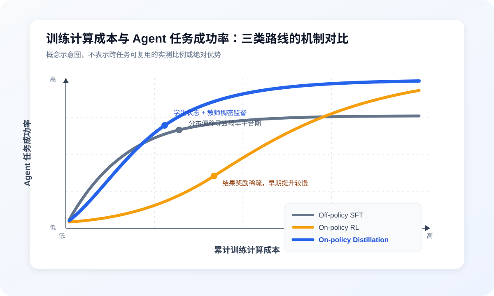

_图为机制示意，不是跨模型、跨任务可复用的实测曲线。Thinking Machines Lab 在特定数学推理设置中报告了 OPD 的样本和计算效率优势，但其中部分 SFT 成本来自趋势外推，实验任务也不是通用 Agent 环境。因此，正式项目应使用自身任务的实测点重新拟合曲线，而不应直接引用图中的相对斜率作为收益承诺。_

| **路线** | **训练状态来源** | **主要监督** | **典型优势** | **典型风险** |
| --- | --- | --- | --- | --- |
| Off-policy SFT | 教师或历史轨迹 | 教师文本、动作或理由 | 稳定、易实现、适合冷启动 | 学生状态分布偏移，容易较早进入平台期 |
| On-policy RL | 当前学生轨迹 | 环境或验证器的结果奖励 | 可直接优化任务成功 | 奖励稀疏、信用分配困难、训练方差较大 |
| On-policy Distillation | 当前学生轨迹 | 教师逐 token 或逐动作评价 | 学生状态与稠密教师信号结合 | 依赖教师打分接口，可能压低探索并继承教师偏差 |

#### 17.4.4 能力差距补强：困难任务、执行偏差与失败恢复

多轮 Agent 的失败通常不是在最后一步突然发生，而是由早期偏差逐步放大。一次错误的工具选择会带来无关观察，错误参数会污染后续上下文，未经核验的中间结论会使计划建立在错误前提上。因此，能力补强的重点不应只看最终失败标签，而应定位学生相对于有效路径的首个关键偏离。

可将失败轨迹拆解为四类缺口：

*   知识缺口表现为目标或约束理解错误；
    
*   决策缺口表现为工具选择或步骤顺序错误；
    
*   执行缺口表现为参数、格式、权限或调用协议不合法；
    
*   恢复缺口表现为面对空结果、超时、冲突证据或工具报错时继续重复原动作。
    

每一类缺口需要不同的数据补强。知识缺口适合增加解释与对照样本，决策缺口适合增加相邻候选动作及选择依据，执行缺口适合加入结构化校验，恢复缺口则需要显式提供“发现异常—诊断原因—更换路径—重新验证”的纠错轨迹。

一套可执行的补强闭环是：先按首错位置、工具类型和失败原因聚类；再为高频或高损失缺口补充困难任务、反例和局部纠错示范；随后让新学生在同类任务上自主执行；最后同时检查成功率、恢复率、调用步数和新引入的失败模式。只有当学生在独立保留集和分布外压力集上都改善，才应把专项补强视为有效，而不是对训练集的记忆。

#### 17.4.5 验证蒸馏收益：质量保留与单位成功任务成本

蒸馏收益必须在同一任务集、同一工具环境、同一成功判定和同一流量条件下比较三类系统：教师模型、学生模型和原有线上模型。至少应记录任务成功率、一次通过率、平均与高分位行动步数、模型调用次数、工具调用次数、重试次数、教师兜底率、端到端 P50/P95/P99 时延以及全链路成本。只比较 token 单价，会忽略学生因规划能力下降而产生的额外步骤和失败重试。

“单位成功任务成本”应按所有任务的实际总成本除以成功任务数定义：

$C_{\mathrm{success}} = \frac{ \sum_{i=1}^{N} \sum_{a=1}^{A_i} \left( C_{\mathrm{student}} +C_{\mathrm{teacher}} +C_{\mathrm{verifier}} +C_{\mathrm{tool}} +C_{\mathrm{runtime}} \right)_{i,a} }{ \sum_{i=1}^{N}\mathbf{1}(\mathrm{task}_i\;\mathrm{success}) }.$

其中，$A\_i$表示任务$i$实际发生的全部尝试，因而重试成本已经通过对各次尝试求和计入，无需另设一个可能重复计费的$C{\mathrm{retry}}$。教师兜底、验证器、工具服务和编排运行时都应按真实调用路径计入。只有当$\mathbb{E}[C{\mathrm{task}}]$已经完整包含这些条件成本时，才能简写为：

$C_{\mathrm{success}} = \frac{\mathbb{E}[C_{\mathrm{task}}]}{P(\mathrm{success})}.$

因此，“单次推理成本 × 平均重试次数 ÷ 成功率”只能作为极简近似。它默认每次尝试成本相同、失败与成功路径长度相同，并忽略工具调用与教师兜底；在多模型、多工具 Agent 中通常不成立。

质量保留可以用学生相对教师的成功率表示：

$R_Q=\frac{P_{\mathrm{success,student}}}{P_{\mathrm{success,teacher}}}.$

但部署决策不应只设一个平均$R\_Q$阈值。对于高风险任务，应分别设置安全违规率、不可逆错误率和教师兜底召回率等门槛。若学生在低风险高频任务上达到质量要求，而在长程、开放域或高风险任务上不稳定，可以采用路由或级联：学生先执行，置信度、规则校验或多样本一致性不足时调用教师。

推理期蒸馏研究展示了这种级联思路：学生多次采样结果一致时直接执行，否则调用教师。收益可以来自“减少教师调用”，而不一定要求一次训练后完全替代教师。

Prodinit 的语音 AI 案例称，通过将大部分流量从 GPT-4.1 迁移到微调后的 GPT-4o-mini，并保留约 10% 教师流量，推理成本估算下降约 70%。该案例提供了灰度发布和持续监控的实践参考，但质量、时延、重试和运维成本缺少可审计的完整数据，应视为厂商案例，而不是普适收益基准。

最终 ROI 还要加入一次性投入。设数据构建、训练、评测、部署与迁移的固定投入为$F$，新旧方案每个原始任务的全路径期望成本分别为$\bar C{\mathrm{new}}$_和_ $\bar C{\mathrm{old}}$，若质量与业务价值近似不变，则盈亏平衡任务量为：

$N^* = \frac{F}{\bar C_{\mathrm{old}}-\bar C_{\mathrm{new}}}.$

若两种方案成功率不同，则应先把成功任务带来的价值和失败损失纳入单任务净收益。设成功价值为$V$、失败损失为$L$、成功率为$p$，单任务净收益为：

$g=pV-(1-p)L-\bar C.$

此时盈亏平衡任务量应写为：

$N^*=\frac{F}{g_{\mathrm{new}}-g_{\mathrm{old}}}.$

上述计算要求$F$、$V$、$L$与各类成本使用同一价值单位，且$g{\mathrm{new}}-g{\mathrm{old}}>0$；若新方案的单任务净收益不高于旧方案，就不存在有限的正向盈亏平衡点。这一表达能够避免“成本下降但失败损失上升”的伪收益。对仍需教师兜底的系统，应把兜底看作目标架构的一部分，而不是蒸馏失败的例外。只要路由准确、兜底比例可控，并且单位成功任务成本与端到端时延优于原方案，部分替代同样可以形成可验证的商业价值。

#### 17.4.6 工程实现：从数据管线到线上灰度

前五节回答的是“迁移什么、怎么训练、如何补强与核算”。但对工程团队而言，蒸馏能否落地往往取决于另一组问题：教师轨迹如何被批量生产并自动验证，训练与采样如何在有限 GPU 上高效解耦，教师概率如何作为在线服务稳定提供，学生模型又如何安全放量并持续监控。本节按数据、训练、推理、部署四个环节，梳理业界较成熟、可直接复用的工程做法。

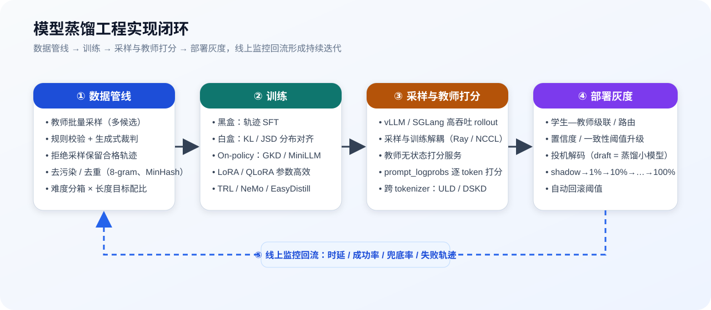

_模型蒸馏端到端闭环：数据管线产出经验证的示范，训练环节完成能力迁移，采样与教师打分服务支撑 on-policy 迭代，部署环节以级联路由和灰度放量控制风险，线上监控与失败轨迹再回流到数据管线，形成持续迭代。_

1.  **先定工程路线：黑盒序列级还是白盒分布级**
    
    工程实现的第一步不是选框架，而是确认教师能提供的信号形态，它决定了后续整条链路的复杂度。
    
    黑盒（序列级）路线只依赖教师生成的文本或动作，流程是“生成轨迹 → 验证 → SFT”。它对教师没有权重或概率接口要求，跨厂商、跨 tokenizer 都能用，是企业落地的主流选择。DeepSeek-R1 的蒸馏阶段就明确“只做 SFT、不包含 RL 阶段”，属于典型的序列级硬目标训练（参考：DeepSeek-AI, [_DeepSeek-R1: Incentivizing Reasoning Capability in LLMs via Reinforcement Learning_](https://arxiv.org/abs/2501.12948), 2025）；Qwen3 的长思维链冷启动同样是“教师对每题生成多个候选、仅保留通过验证的样本再做 SFT”（参考：Yang et al., [_Qwen3 Technical Report_](https://arxiv.org/abs/2505.09388), 2025）。这说明头部推理模型的能力迁移并不必然依赖 logits 级对齐，黑盒路线已被大规模验证可行。
    
    白盒（分布级）路线能拿到教师的 logits 或 log-prob，用 KL/JSD 做逐 token 对齐。监督更稠密、样本效率更高，但通常要求师生共享 tokenizer，并需要额外的概率缓存与对齐工程。
    
    | **维度** | **黑盒序列级** | **白盒分布级** |
    | --- | --- | --- |
    | 教师信号 | 生成文本 / 动作轨迹 | logits 或 log-prob |
    | 教师访问 | 仅需推理 API | 需权重或概率打分接口 |
    | tokenizer | 可跨词表 | 通常需同词表（跨词表方案见下方 5 小节） |
    | 代表方法 | 轨迹 SFT、序列级 KD | GKD、MiniLLM、top-K logits 蒸馏 |
    | 典型场景 | 闭源教师模型、跨厂商迁移 | 自研同族模型、追求样本效率 |
    
    实践中可用下面这棵决策树快速选型：先看能否拿到教师的 logits/log-prob，再看师生是否共享词表，随后判断是否需要 on-policy 覆盖学生真实状态、以及显存能否承载 logits 缓存，最终落到黑盒序列级、白盒跨词表、白盒 on-policy 或白盒离线 logits-KD 四类可落地路线。
    
    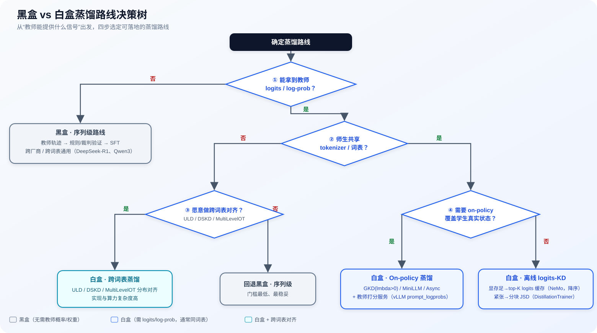
    
    _黑盒/白盒蒸馏路线决策树：四个判断节点自上而下逐步收窄选择：教师只给文本时走黑盒序列级；能给概率但词表不同，则视是否愿意引入跨词表对齐，在“白盒跨词表”与“回退黑盒”之间取舍；词表相同且需要覆盖学生状态时走 on-policy 蒸馏，否则按显存条件选择离线 logits 缓存或分块 JSD。_
    
2.  **数据管线：生产、验证、去污染与配比**
    
    对黑盒路线，数据管线既是成本中心，也是质量上限所在。生成阶段通常对每个任务采样多个候选：DeepSeek-R1 对强化学习 checkpoint 做拒绝采样来构造推理数据，Qwen3 用 Pass@N 保留可解样本。
    
    验证应分层设计，优先用可自动化的规则校验：数学要求答案写成可解析的 box 格式、代码用编译器跑测试用例；无法规则化的部分再交给生成式裁判或 LLM-as-judge。DeepSeek-R1 明确不使用神经奖励模型，理由是其易被 reward hacking，这一架构决策对企业自建验证器有直接参考价值。
    
    去污染与去重是防止评测虚高的关键动作。Tulu 3 用 8-gram 匹配做去污染，单条样本与测试集的重叠超过 50% 即判定为污染样本予以剔除、整个数据集重叠超过 2% 则直接弃用；规模化场景可借助 NVIDIA NeMo Curator 的 GPU 加速精确 / 模糊（MinHash+LSH）/ 语义去重。配比则应尽量参数化而非拍脑袋：阿里云 PAI EasyDistill 的 CoT 蒸馏按认知难度分箱，再为不同难度设定推理冗长度目标与每箱样本上限，把“数据配比”变成可配置项。
    
3.  **训练框架与参数高效蒸馏**
    
    主流开源框架已把上述路线沉淀为可配置组件。HuggingFace TRL 提供 `GKDTrainer`（用 `lmbda` 控制学生自生成数据占比、`beta` 在前向 KL 与反向 KL 之间插值）、`DistillationTrainer`（用分块 JSD 避免物化 vocab×seq 的 logits 张量以省显存）、`MiniLLMTrainer`（反向 KL，官方称是 Thinking Machines on-policy 蒸馏的泛化实现），以及 `AsyncDistillationTrainer`（教师以独立 vLLM server URL 提供、可部署在单独硬件上，但硬性要求师生共享 tokenizer）。NVIDIA NeMo/ModelOpt 通过把 loss 替换为输出 logits 间的 KL 实现蒸馏；NeMo-Aligner 让学生匹配教师 top-K logits，并建议离线缓存教师 logits——一个易踩的坑是缓存必须按降序保存，否则影响收敛，实践中 `top_k` 常取约 100 而非示例里的小值。国内团队可直接用 PAI EasyDistill 的统一 CLI 串起指令扩展、生成、评测、质量过滤到构建 SFT 数据的完整阶段，其后端兼容任意 OpenAI 兼容端点，输出可直接喂给 LLaMA-Factory 或 ms-swift 训练框架。
    
    参数高效蒸馏已是优选项。TRL 官方说明所有 trainer 均支持通过 `peft_config` 启用 LoRA/QLoRA，LoRA 学习率通常取全参微调的约 10 倍，QLoRA 另需 `bitsandbytes`。对显存受限的团队，用 LoRA 做蒸馏能在单卡或少卡上完成能力迁移，再决定是否合并权重做全参精调。
    
4.  **采样与训练解耦**
    
    on-policy 路线的真正瓶颈是学生 rollout 采样，而非梯度计算。工程上应把“生成”交给高吞吐推理引擎、“训练”交给训练后端，两者解耦并行。TRL 支持与 vLLM server 协同：trainer 向 OpenAI 兼容端点发送 prompt token IDs 采样，每个优化步后经 NCCL 三段式把最新权重推回推理引擎，且 server 与 trainer 必须位于不同 CUDA 设备[15]。verl 采用 3D-HybridEngine 解耦计算与数据依赖，生成后端支持 vLLM 与 SGLang、训练后端支持 FSDP 与 Megatron-LM，并提供 Rollout Correction，用重要性采样与拒绝采样修正“推理引擎策略”与“训练策略”之间的分布漂移。OpenRLHF 则以 Ray+vLLM 把 Actor/Reward/Reference/Critic 分布到不同 GPU。
    
    两个务实提醒：其一，框架与推理引擎的版本矩阵往往很严格（例如异步蒸馏对 vLLM、transformers 版本和 FSDP2 有硬约束），生产环境应锁定并记录版本组合；其二，异步与解耦必然引入一定 off-policy 偏差，需要配套的重要性采样或拒绝采样修正，否则训练容易不稳定。
    
5.  **教师打分服务与跨 tokenizer 对齐**
    
    白盒与 on-policy 路线都要求教师能对学生已生成的序列逐 token 打分。工程上把教师部署为一个无状态“打分服务”——只做前向、不做采样，与学生生成解耦，并按序列长度分桶以提高 GPU 利用率。vLLM 的 `prompt_logprobs` 参数天然适配这种 teacher-forcing 打分：它返回输入序列中每个 token 在其前缀下的 log-prob，正是计算“学生 log-prob 减教师 log-prob”这一逐 token 惩罚所需的量。需要提醒的是，推理引擎并不总是保证 log-prob 在版本间完全稳定，用于训练监督前应先做一致性校验并锁定引擎版本。Thinking Machines 的做法即让学生生成轨迹、送教师单次前向得到 log-prob、取负作为 advantage 并用重要性采样策略梯度更新学生，且采用零折扣只优化紧邻 token。
    
    ```python
    from vllm import LLM, SamplingParams
    
    # 教师常驻为“打分服务”：只前向、不采样
    teacher = LLM(model="teacher-checkpoint", tensor_parallel_size=4)
    
    # prompt_logprobs 返回序列中每个 token 在其前缀下的 log-prob，
    # 即教师对学生已生成轨迹做 teacher-forcing 打分所需的量
    params = SamplingParams(temperature=0, max_tokens=1, prompt_logprobs=1)
    outputs = teacher.generate(student_trajectories, params)
    
    for out in outputs:
        teacher_logprobs = out.prompt_logprobs  # 逐 token 教师 log-prob
        # 训练侧用 (student_logprob - teacher_logprob) 作为 per-token 惩罚
    ```
    
    当师生词表不一致、无法直接对齐 logits 时，可借助跨 tokenizer 蒸馏方法：ULD 用最优传输在分布层面对齐、不要求共享词表；DSKD 用双空间投影加 cross-model attention 统一师生输出空间；MultiLevelOT 在 token 级与序列级用 Sinkhorn 距离对齐，报告优于 SFT、SeqKD、MinED 与 ULD。这些方法让“用不同家族的强模型当教师”成为可能，但计算与实现复杂度更高，应在确有跨词表需求时再引入。
    
6.  **部署：级联路由、投机解码与灰度监控**
    

蒸馏产物上线不必是“一次性全量替换”。FrugalGPT 提出的 LLM 级联通过学习“不同请求走哪些模型组合”，报告在保持精度的同时最高降低约 98% 成本，或在同等成本下精度提升约 4%。落到 Agent，就是路由 / 级联：学生先执行，当置信度、规则校验或多样本一致性不足时升级到教师兜底，兜底路径始终指向强模型。

蒸馏出的小模型还有第二个高价值用途——作为投机解码的 draft model（草稿模型）。draft model 的核心要求是“与目标模型分布高度一致且足够快”，而 KL 对齐的蒸馏正是训练这种高接受率小模型的主流手段，接受率越高、加速比越大；vLLM 支持 draft-model、EAGLE、n-gram 等模式，用拒绝采样保证输出分布无损，其跨词表 draft 模式目前仅适配 draft-model 方式且只支持贪婪草稿采样，选用前应核对版本能力。

上线放量应遵循灰度纪律：先用影子流量（不接真实请求）验证，再按比如1%→10%→25%→50%→90%→100% 逐档放量，每档设最短观察窗与自动回滚阈值（此为工程实践建议，具体档位按业务风险调整）。线上需持续监控 P50/P95/P99 时延、首 token 时延（TTFT）、任务成功率、教师兜底 / 升级率、投机解码接受率、师生一致性或 KL，以及业务侧质量抽检。同时维护一个固定的黄金数据集（golden set）加线上采样回流的回归评测集，在每个灰度档位跑离线回归并与线上指标交叉验证，防止学生模型在长尾场景悄悄退化——这也正是把监控数据回流到数据管线、驱动下一轮蒸馏的闭环起点。

### 17.5 模型验收与上线：在完整 Agent 中验证优化收益

训练完成并不等于模型已经具备上线条件。SFT、Agentic RL 或模型蒸馏改变的是模型参数，但真实应用效果由模型、Harness 与执行环境共同决定：模型负责理解状态并提出动作；Harness 负责组织上下文、暴露和校验工具协议、管理任务状态与权限，将放行后的请求路由至执行环境并回传观察；执行环境负责实际执行动作、维护业务状态并返回结果。候选模型只有进入完整 Agent，在可比较的系统条件下证明收益，并通过灰度替换验证真实流量中的稳定性，才算完成一次模型优化。

本节回答两个问题：训练后的模型能否改善真实应用，以及如何在不破坏既有能力和系统边界的前提下完成替换、回滚与下一轮迭代。整个过程由五个环节组成：建立可比较版本、完成系统适配、设置准入门禁、实施灰度替换，以及根据上线结果选择下一轮优化路径。

#### 17.5.1 建立可比较的版本：模型、应用与环境配置

模型上线首先需要定义“比较的对象”。如果候选模型同时使用了新的 Prompt、更宽松的工具权限或更简单的任务环境，即使端到端成功率提高，也无法判断收益来自模型训练还是系统条件变化。因此，发布前应冻结并关联配置，但不能把不同层职责混为一谈：

*   模型配置： 基础模型、候选检查点或适配器、训练方法、训练数据版本、训练超参数、对话模板、Tokenizer 版本和推理参数；
    
*   Harness 配置： System Prompt、Skill、上下文裁剪与记忆策略、工具 Schema、调用路由、并行策略、重试上限、停止条件、权限校验和人工介入规则；
    
*   执行环境配置： 工具与业务服务版本、Sandbox 镜像、测试数据快照、外部依赖、资源规格以及可读写范围；
    
*   评测配置： 任务集版本、环境种子、执行预算、验证器版本、重复运行次数、指标口径和准入阈值。
    

这些信息共同构成一个可追溯的候选发布单元。发布单元并不意味着将模型、Harness 与执行环境合并为同一对象，而是用显式依赖关系记录“哪个模型在什么应用和环境条件下通过了验收”。当 Prompt、工具协议或环境版本发生变化时，原有结论不能自动沿用。

为了区分模型训练与应用适配的收益，至少应保留两组对照：

*   纯模型对照： 基线模型与候选模型使用相同的 Harness、执行环境和预算，用于判断参数更新本身带来的变化；
    
*   部署组合对照： 候选模型使用上线所需的适配后 Harness，与当前生产版本进行比较，用于判断最终发布组合是否真正改善业务结果。
    

如果候选模型只有经过大幅 Prompt 扩写、额外重试或放宽工具权限后才能取得更高分，应把这些变化作为应用成本和风险单独报告，不能全部归因于模型能力提升。

#### 17.5.2 完成系统适配：工具协议、上下文管理与执行预算

不同模型对消息模板、结构化输出、工具描述和停止信号的敏感性不同。直接替换模型端点，可能出现离线能力分数提高但 Agent 无法解析工具调用、重复执行动作或不能正确终止的问题。因此，系统适配的目标不是继续“调分”，而是确认候选模型能够在既有运行边界内稳定工作。

适配检查应覆盖以下内容：

*   工具协议兼容性： 检查工具选择、函数名、参数类型、必填字段、枚举值和结构化输出能否被 Harness 稳定解析；模型负责产生候选动作，Harness 仍负责协议校验和动作放行；
    
*   上下文兼容性： 检查对话模板、System Prompt、工具返回、历史轨迹、长上下文裁剪和记忆注入是否保留了模型决策所需的信息；
    
*   执行行为兼容性： 检查模型在成功、失败、权限不足和信息缺失时，能否正确选择继续、修正、求助或终止，避免无限规划、重复调用和过早结束；
    
*   预算兼容性： 比较替换前后的 token、工具调用次数、并行度、超时、重试和端到端时延，确认候选模型能够在现有资源上限内完成目标任务；
    
*   安全边界兼容性： 验证模型产生越权或高风险动作时，Harness 与执行环境仍能执行独立校验和强制拦截，不能因模型表现改善而取消系统护栏。
    

适配过程宜采用由局部到闭环的测试顺序。先通过固定输入检查消息和工具 Schema，再用标准历史前缀验证单步动作，随后在 Sandbox 中自主运行完整任务，并通过工具超时、无效返回、资源不足和权限拒绝等故障注入验证恢复行为。只有闭环执行稳定，局部格式正确率才具有上线意义。

应用适配应形成独立变更记录。若调整了 Prompt、上下文策略、工具描述或重试规则，需要重新运行对应回归集；若适配改变了任务难度、可见信息或动作权限，则应建立新的评测基线，而不是继续沿用原分数。

#### 17.5.3 设置准入门禁：任务收益、行为约束与能力回归

17.1 已给出质量、可靠性、成本和安全的统一指标，17.2—17.4 分别说明了不同训练方法的独立评测重点。本节不再重复设计评测体系，而是把已有评测结果转化为发布判断。准入不能依赖一个加权总分，而应采用“硬门槛 + 目标收益”：任何关键兼容性、安全或能力回归不合格都应阻断发布；通过硬门槛后，再判断目标任务收益是否足以覆盖适配、部署和维护成本。

候选发布单元至少需要通过以下门禁：

*   接口兼容门禁： 工具调用格式、参数合法性、消息边界和终止信号达到运行要求，不依赖大量解析修复才能完成任务；
    
*   目标收益门禁： 在锁定测试集和一致执行预算下，目标任务指标达到预先设定的最小改善幅度，并报告重复运行结果及置信区间；
    
*   能力回归门禁： 核心通用能力、既有高价值任务和关键长尾场景满足预先设定的非劣效界值，不能用局部任务提升掩盖其他能力退化；
    
*   运行预算门禁： 单位成功任务成本、超时率、重试率和端到端高分位时延满足上线预算，避免单次推理成本下降却导致完整任务成本上升；
    
*   安全硬门禁： 危险动作、越权尝试、错误状态变更和有害输出满足风险阈值，关键约束穿透不得由其他指标抵消。
    

门槛、非劣效界值、最低样本量、置信区间口径和观察窗口应在查看候选结果前确定。安全门禁还要区分两个对象：模型产生违规动作的频率衡量策略风险，违规动作穿透系统边界并被实际执行的频率衡量 Harness 与执行环境的防护有效性。模型更少提出违规动作值得肯定，但系统仍必须独立拦截不可接受的操作。

发布判断可以归纳为三种结果：全部硬门禁通过且目标收益达标，进入灰度；硬门禁通过但样本量、收益稳定性或长尾覆盖不足，只能在限定范围继续验证；任一硬门禁失败，则退回对应责任层修复。若模型在信息充分时仍选错工具，应修复模型；若工具描述遗漏约束，应修复 Harness；若正确动作因服务异常未执行，应修复执行环境。

#### 17.5.4 灰度替换与回滚：验证真实流量中的效果

离线评测只能覆盖已构造的任务分布。进入灰度前，应先建立离线指标与线上结果的映射，例如将离线任务成功率映射到真实业务完成率，将失败恢复映射到人工接管率，将工具与 token 消耗映射到单位成功任务成本。线上 A/B 对照还应固定分流单元，通常按用户、会话或任务分桶，避免同一长程任务在新旧模型间切换；最小样本量、观察窗口和区间估计口径同样需要预先确定。

模型替换宜按照以下顺序逐步扩大影响范围：

1.  影子验证。 对无副作用的问答或只读任务，可以将脱敏真实请求复制给候选版本并与旧版本双跑。对于依赖状态变更的多步任务，应在隔离 Sandbox 或状态副本中重放，或者只比较候选动作而不执行，不能把“未产生副作用”误认为完成了端到端验证。
    
2.  低风险灰度。 先选择只读工具、低风险任务、内部用户或明确业务范围承接少量真实流量，验证完整调用链、指标采集和告警链路。
    
3.  分阶段扩量。 在满足最低样本量和观察窗口后，按任务类型、用户范围或流量比例逐级扩大；高风险写操作应晚于一般问答和只读任务开放。
    
4.  稳定替换。 全量切换后继续保留旧版本和配置快照，在一个完整业务周期内观察任务质量、异常恢复、成本、时延和安全事件。
    

每个阶段都应预先定义三类判断条件：

*   扩大条件： 目标任务收益达到门槛，核心回归满足非劣效要求，成本和时延在预算内，且未出现关键安全事件；
    
*   暂停条件： 样本量不足、指标波动过大、数据延迟或归因不清，保持当前流量比例并补充观察；
    
*   回滚条件： 出现关键约束穿透、持续性任务退化、异常成本增长、服务稳定性下降，或核心业务指标超过预设劣化阈值。
    

回滚对象应是完整的候选发布单元，而不只是模型权重。如果新模型依赖新的 Prompt、工具 Schema 或上下文策略，仅回退模型可能形成不兼容组合。生产侧需要保留可快速恢复的模型服务、Harness 配置和依赖版本，并定期验证回滚路径。回滚只能阻止后续请求继续使用故障版本，不能撤销已经在外部系统中完成的写操作；涉及资金、账户或业务状态的任务还需要独立的幂等、审计和补偿机制。

在平台实现中，可以利用 PAI-EAS 服务组和流量权重组织新旧模型共存，并通过滚动更新逐步替换实例；需要分批、暂停或回退服务更新时，应结合相应的更新计划与版本配置。模型服务之外的 Prompt、Skill、Harness 和工具协议仍应由应用侧独立版本化，并与对应的 EAS 服务版本共同登记，避免只有模型端可回退、应用端无法恢复。

#### 17.5.5 持续迭代：识别能力变化并选择下一轮优化路径

模型上线不是本轮训练的终点，而是下一轮证据收集的起点。新版本产生的轨迹、Badcase、用户反馈、成本变化和回滚事件，应与候选发布单元绑定，并重新按照模型、Harness 和执行环境三层归因。只有被持续观察到、影响明确且可验证的问题，才应进入下一轮优化；单个偶发失败不应自动触发训练。

下一轮路径应由剩余问题的性质决定：

*   选择 SFT： 已知正确行为可以被明确示范，主要问题是工具格式、固定流程、约束遵循或常见恢复动作不稳定；
    
*   选择 Agentic RL： 模型已经能够进入任务，但需要通过可重复环境探索多步策略，且结果或关键过程能够被可靠验证；
    
*   选择模型蒸馏： 现有教师在目标任务上稳定领先，下一阶段重点是降低模型规模、推理成本或时延，并可接受一定能力保真约束；
    
*   修改 Harness： 问题来自信息供给、上下文组织、工具描述、状态管理、重试、停止或权限控制，而非模型在充分条件下的决策能力；
    
*   修复执行环境： 正确动作因服务可用性、数据状态、资源限制或外部依赖而失败，此时继续训练模型不会消除根因。
    

在具备轨迹连接器、版本元数据映射和优化工作流配置的前提下，可以将版本化轨迹、失败归因、评测报告、灰度指标和发布事件接入 Trace2Optimizers，使优化提案能够追溯到具体任务、模型版本和系统条件。这里的目标不是把所有线上数据自动回灌训练，而是建立明确的触发机制：当某类问题在独立样本中稳定复现、业务影响超过阈值、责任层已经确认且存在可验证的修复路径时，再创建下一轮 SFT、Agentic RL、蒸馏或应用优化任务。

由此形成的持续优化链路是“运行—观测—归因—训练或系统修复—独立验收—灰度发布—再运行”。这条链路既允许模型能力持续变化，也要求每次变化都经过相同的版本记录、准入门禁和回滚控制，从而避免将持续迭代演变为不可解释、不可复现的线上试错。


<a id="sec-030"></a>

## 第 18 章　Agent 调优总览
模型调优改变的是模型本身的能力，智能体调优改变的是一个已经上线的 Agent 怎样使用模型、工具与业务规则，把任务反复做好。第 17 至 22 章围绕同一条主线展开：把每一次真实运行留下的事实，整理成可复用的样本、可检查的标准和可验证的改动，再把有效改动带回运行环境，形成持续改进的数据飞轮。

本章先给出数据飞轮的整体图景，说明为什么 Agent 上线后仍要持续回答"任务有没有做好、做好花了多少代价"，以及各模块怎样围绕同一任务连接。随后五章依次展开飞轮的各个环节：第 18 章把分散的运行记录组织成可阅读、可分析的轨迹；第 19 章用声明式 Pipeline 将轨迹持续加工为业务样本；第 20 章把样本确认为可复用的黄金数据集；第 21 章用持续评估发现问题、用实验比较改动；第 22 章把验证有效的方法沉淀为 Skill、经验与运行机制的改进。

阅读方式上，建议先读本章建立整体认识，再按顺序了解各环节如何衔接。真正着手时不必读完全部内容，可以从团队当前最想解决的问题入手——排障、成本或业务质检——沿"找到问题、确认标准、验证改动"这条路径先把第一轮做完，再逐步补齐其余环节。各章都遵循同样的次序：先说明从哪里开始、怎样操作，再说明拿到结果后该做什么。

### 18.1 Agent 上线以后，还要持续回答哪些问题

传统应用主要通过代码规定行为：什么条件进入哪个分支，调用哪个接口，怎样处理返回值。在输入、状态和外部依赖相同的前提下，确定性逻辑的执行通常可以预测和复现。研发人员围绕明确的功能契约编写测试，检查实现是否符合预期。

Agent 把其中一部分决策交给了模型。开发者给出目标、工具和约束，模型在运行时理解意图、规划步骤、选择工具，再根据中间结果调整行动。同一个任务，可能因为上下文、工具反馈或生成结果不同而走出不同的路径。

以退款为例，接口可以根据订单状态和规则判断是否允许退款，Agent 还要从对话中确认用户指的是哪笔订单，识别适用规则，选择操作，并核实退款是否完成。对话顺利结束、接口没有报错，都不足以说明这件事办对了。

| 关注点 | 传统应用中的确定性业务逻辑 | Agent 应用新增的要求 |
| --- | --- | --- |
| 执行路径 | 检查代码规定的分支 | 检查模型为什么选择这条路径，以及中间反馈怎样影响后续行动 |
| 正确性 | 验证接口契约和状态转换 | 同时验证目标达成、业务约束和交付结果 |
| 故障定位 | 查找代码或依赖的异常 | 进一步区分理解、上下文、工具使用和恢复策略的问题 |
| 变更验证 | 检查功能和历史场景 | 还要观察重复执行是否稳定，以及质量、成本、延迟怎样变化 |

传统应用也会遇到故障和环境变化，Agent 同样需要单元测试和集成测试。区别在于，Agent 的执行即使没有技术错误，也可能偏离业务目标；一次任务成功之后，还需要确认同类任务能否反复做好。

#### Benchmark 提醒我们：会做、做完和稳定交付是不同层次

公开测试一方面展示了 Agent 的进步，另一方面也说明，任务长度、业务约束和执行条件都会影响效果。下面保留几组有明确日期的结果，用来说明为什么企业需要在自己的业务上建立评估。

| 测试场景 | 公开实验快照 | 需要关注的问题 |
| --- | --- | --- |
| SWE-Bench Pro（Public），软件工程任务 | OpenAI 2026-03-05 报告：GPT-5.4 为 **57.7%**，研究环境、默认 xhigh 推理设置。[原始报告](https://openai.com/index/introducing-gpt-5-4/) | 在该任务与配置下，端到端完成仍有改进空间。 |
| OSWorld-Verified，桌面操作 | 同一报告中，GPT-5.4 为 **75.0%**，GPT-5.2 为 **47.3%**；报告引用的人类成绩为 **72.4%**。[原始报告](https://openai.com/index/introducing-gpt-5-4/) | 能力进步很快，业务交付仍要逐项确认是否完成。 |
| OSWorld 2.0，长流程任务 | 2026-07-13 论文 v2，108 个任务、500 步预算、最高思考水平及批量动作配置：Claude Opus 4.8 的**严格完成率为 20.6%**，部分得分为 **54.8%**。[论文表 3](https://arxiv.org/html/2606.29537v2) | 完成许多中间步骤，并不等于交付了完整结果。 |
| τ-bench，业务规则下的工具与用户交互 | 2024-06-17 原论文：GPT-4o 原生工具调用在零售任务上的 **pass¹ 为 61.2%**，**pass⁸ 低于 25%**。[原论文](https://arxiv.org/html/2406.12045v1) | 一次做对之后，还要检查重复执行的可靠性。 |

这些是各自测试条件下的结果，不代表当前最高分，也不能直接换算为企业业务成功率。OSWorld 2.0 的部分得分不等于完整成功率；τ-bench 的 pass⁸ 指同一任务八次执行全部成功，区别于“八次中至少成功一次”的 pass@8。

上线后的团队需要持续回答两组问题：**任务有没有做好，以及把它做好花了多少代价。** 一条回答正确的轨迹，可能反复查了相同资料；一次 Token 明显减少的执行，也可能省掉了必要验证。调优要同时看业务结果、执行过程、时间和成本。模型、工具、业务规则或用户需求变化以后，原有结论还需要复查。

评估负责把“好不好”落实为可检查的标准和结果；调优负责根据这些结果改变系统。二者需要通过真实任务连起来，否则团队要么只有分数，没有修改方向，要么不断改 Prompt，却说不清哪些修改有效。

### 18.2 、数据飞轮怎样把运行经验变成改进

一次排障往往能修好眼前的问题，却未必能帮助下一次排障。工程师记得原因，相关 Trace 散在日志里，修复记录又在另一个系统；几周后，同类问题换一种表述再次出现，团队仍然要从头查起。

数据飞轮要解决的就是这种断裂。它把一次执行留下的事实整理成可复用样本，用评估找出问题，用实验检验修改，再把有效变更带回 Agent 的运行环境。过程中留下的轨迹、样本、评分规则、失败模式和版本记录，也可以被下一轮工作继续使用。

这里有两条需要同时推进的反馈路径。

一条改进数据和判断方法。例如，客服 Agent 在“有哪些功能”和“如何配置评估”两类问题上，需要覆盖的内容不同。操作演示最初把两道题的规则写在同一个评估器里，实验之后才发现标准不合适。团队于是给 Dataset 增加题目级 Rubric，逐题填写，再修改变量映射并重新实验。运行结果帮助团队改进了用来判断结果的标准。

另一条改进 Agent 的行为。评估确认缺少配置步骤后，团队可以补充 Skill；发现工具用错后，可以修改工具描述；发现超时后反复提交，可以检查重试和结果核实逻辑。这些修改先成为候选，经过同条件实验和回归，再决定是否采用。

因此，数据在调优中承担两种作用：帮助判断应该改哪里，也帮助拒绝没有效果或带来退化的修改。样本数量增加、经验入库、候选生成，都还只是过程产物。有效变更进入运行以后，新任务的结果才提供下一轮反馈。

### 18.3 、围绕同一任务连接各个模块

下图展示了 Agent 观测与优化中这些工作的关系。主干从真实运行开始，经过轨迹组织和 Pipeline 加工，形成不同用途的数据，再进入评估、实验与优化；旁路负责人工复核、评估器校准和经验使用。

_图 1　Agent 数据飞轮总体架构_

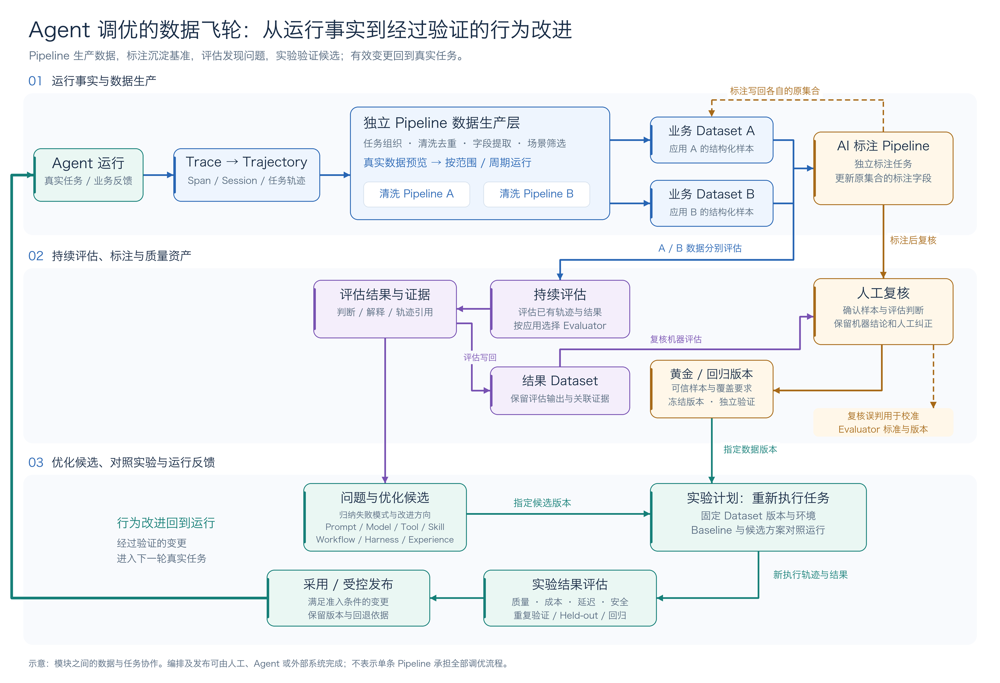

**Pipeline 是这套架构中的数据生产层。** 原始 Trace 以调用和事件为单位，评估可能要检查完整任务，实验可能只需要任务输入和预期行为，成本分析又要保留调用量与耗时。Pipeline 按这些目标组织数据、提取字段、筛选和去重，把一套加工规则变成可以按范围或周期执行的工作。不同用途可以配置不同管线，已经进入 Dataset 的样本还可以通过独立的 AI 标注任务补充标签。

这些模块最终要帮助团队做出业务决定。可以从自己正在遇到的问题选择入口：

| 模块 | 用户怎样使用 | 帮助业务完成什么 |
| --- | --- | --- |
| Trace 与 Trajectory | 按应用、问题、工具或耗时搜索任务，展开步骤，选入数据集 | 找到答错、反复操作或耗时过长的原因 |
| Pipeline | 选择数据源和模板，配置业务字段、过滤与标注，预览后持续运行 | 把每天的运行记录变成质检人员和评估器能直接使用的样本 |
| Dataset 与人工复核 | 导入真实问题，填写参考答案与评分要求，确认后保存题库版本 | 积累可重复使用的业务验收题，减少每次升级重新准备测试的工作 |
| Evaluator 与持续评估 | 配置标准，用真实样本试评，再对指定范围持续检查 | 发现哪些场景需要改进，将人工阅读精力集中到值得处理的问题 |
| Experiment | 让当前方案与候选执行同一批题，比较逐题结果、成本和耗时 | 决定是否换模型、采用新 Prompt 或上线改动 |
| Trace2Optimizers | 从问题改进 Skill、工具与运行机制，或把历史方法送入经验召回 | 减少重复犯错与重复探索，使验证有效的方法参与后续任务 |

这些模块不必排成一条只能向前走的流水线。评估结果可以写回 Dataset 供人工复核；复核既可能修正样本，也可能修正评估器；优化候选需要回到实验；已采用的 Skill、Harness 或经验又会改变后续轨迹。具体发布仍要接入 Agent 所在系统的交付流程。

以退款超时为例，Agent 看到工具超时后再次提交，但业务记录显示第一次操作已经成功。补齐业务结果并建立关联后，轨迹和 Pipeline 才能把相关调用组织为同一任务样本。评估指出结果核实有问题，人工确认预期做法，调优再选择补状态查询、修改 Skill，还是修复工具的幂等与重试逻辑。实验要覆盖成功、失败和结果不确定等情况，检查重复操作是否减少、正常任务是否受影响。

这个例子也说明了模块边界：轨迹组织不能凭空补出业务事实，Pipeline 不能替代人工确认，评估不能代替候选执行，保存了一个版本也不等于运行中的 Agent 已经使用它。各环节把自己的输入、产物和实际执行记录关联起来，团队才能沿着结果追到原因，再沿着变更检查效果。

### 18.4 、从一个业务问题开始，把第一轮做完

第一次建设调优流程时，先选一个团队确实想解决的问题。例如，产品客服能够回答概念，却经常漏掉操作步骤；研发 Agent 能定位问题，却反复读取同一批日志；报告 Agent 能生成文件，却会引用过期数据。它们各有明确的改进目标，也有可以核实的结果。

以“产品客服遗漏操作步骤”为例，一轮调优可以这样完成：

1.  **找到真实问题。** 在“数据中心 → Agent 轨迹”中选择客服应用，搜索操作咨询，打开几条用户仍在追问的任务，查看最初要求和实际回答。
    
2.  **把问题持续收集起来。** 少量任务直接加入数据集；需要日常质检时，创建 Pipeline，提取问题、回答和轨迹引用，预览后运行，持续写入候选集。
    
3.  **把业务要求写成题库。** 产品或客服人员确认参考答案，在每道题的 `rubric` 中写明应包含的步骤，选入黄金集。例如“如何做评估”应包含准备数据、选择评估器、配置映射和查看结果。
    
4.  **先知道哪里没做好。** 创建评估器，对几道已知题试评，确认它能指出遗漏，再用于更多真实任务。持续评估负责找新问题，人工把其中有价值的题补回题库。
    
5.  **修改后让两个版本都做题。** 为客服补充操作 Skill，或调整知识与 Prompt。用同一份黄金集分别运行旧版和新版，查看操作题是否改善，功能介绍等正常题是否保持，成本和耗时能否接受。
    
6.  **采用有效方案，继续接收反馈。** 将验证通过的版本交给应用发布流程，确认它实际生效。后续任务仍进入同一套数据与评估流程，新问题继续成为下一轮题目。
    

这一轮留下的不只是一个改过的 Prompt，还包括一份可复用题库、一套评分要求、改动前后的结果，以及持续收集问题的管线。下一次换模型或升级产品时，这些材料可以直接继续使用。

业务人员负责确认目标和正确要求，应用团队负责改动与接入，测试和运营使用固定题库与运行反馈检查效果。等这条路径稳定后，再增加场景、周期任务和自动化。具体实现原理会在后文适当说明，各章首先回答用户从哪里开始、怎样操作，以及拿到结果后该做什么。


<a id="sec-031"></a>

## 第 19 章　Agent 轨迹数据
用户反馈回答没解决问题时，团队需要知道：Agent 没理解需求，没有找到材料，还是没有正确使用材料？轨迹把输入、行动、工具反馈与输出放在一起，让业务人员沿着实际过程找到改进方向。

在上一章中，先看懂真实执行、确认问题，再把同类数据交给 Pipeline 加工，评估与实验才有明确对象。

### 19.1 先找到一条自己知道发生了什么的任务

第一次使用轨迹，可以向产品客服 Agent 提问“如何做评估”，记下执行时间、问题和回答；若调用方能提供 TraceID 或 SessionID，也一并保留。选择自己执行过的任务，更容易核对记录是否正确。

选择对应 AgentSpace，进入“数据中心 → Agent 轨迹”。首次使用时，如果页面提示尚未接入观测数据，先按接入指引完成配置；如果尚未开启轨迹清洗或采集，阅读界面的处理和费用提示，再按提示开启。完成配置后发起一条新任务验证，不要仅凭开关已开启就认为数据已到达。

回到轨迹列表，把时间范围调整到这次执行附近，查看输入、输出、Agent 应用、模型、步骤数、Tokens 和耗时。打开对应记录，核对问题原文和回答；若任务调用了知识检索工具，再确认能看到该次调用和返回。


列表为空时，依次检查 AgentSpace、时间范围、筛选条件和采集状态，再回到观测页面确认新请求有没有上报。先区分数据未采集与 Agent 未正确执行，避免反复发业务请求来代替定位。

第一条记录看对后，再挑一个失败任务和一个多轮任务。前者检查错误反馈是否保留，后者检查用户补充的信息是否能在相关记录中找到。做到这一步，团队才有了可以日常使用的分析入口。

### 19.2 按问题选择检索方式，逐步缩小范围

已知具体执行时，优先使用 TraceID 精确查找；需要查看一段连续交互时，用 SessionID 找相关记录。没有标识时，可以结合 Agent 应用、模型、工具名和时间范围定位。筛选条件从少到多增加，结果为空时先撤掉最近增加的条件，不必同时修改所有设置。

| 想调查的问题 | 列表中怎样开始找 |
| --- | --- |
| 某次用户投诉 | 时间范围配合 TraceID，或用户输入中的关键字 |
| 用户多次补充信息仍未解决 | SessionID，结合相关输入和输出 |
| 使用某个工具的任务表现不佳 | Agent 应用、工具名和对应时间范围 |
| 哪些任务明显变慢 | 同一应用下按耗时范围筛选，再比较 Steps 和 Tokens |
| 同一业务意图是否反复出现 | 对输入使用语义搜索，打开结果确认是否属于目标场景 |

输入、输出检索支持“关键字匹配”和“语义搜索”。已知原话、产品名称或特定错误表述时，关键字更容易定位；想找“用户要求具体操作步骤”这类意思相近、措辞不同的问题时，可以使用语义搜索。输入框查的是用户需求，输出框查的是 Agent 回答，二者应按调查目标选择。

例如，调查“如何做评估”类问题，可以先在输入侧搜索这一意图，再看结果是否包括“怎么给回答评分”“怎样建评测任务”等相关问法。相似度只负责选出候选，不代表这些任务有相同难度或相同错误；保留默认设置看几条结果，再依据界面提示调整，不要把搜索分数当作质量分。

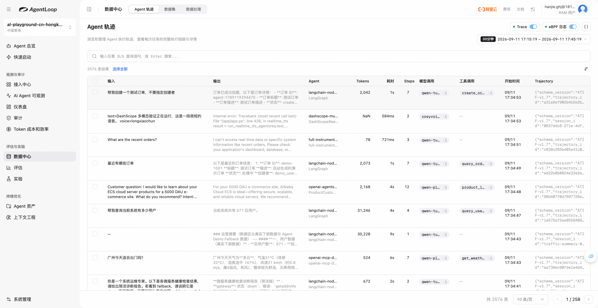

找到一组记录后，先读几条代表样本。如果有些用户只想了解概念，另一些需要完整操作流程，应该分开分析。把这两类任务混在一起，会误把简短但合适的回答判为不完整，也可能把泛泛介绍误认为解决了操作问题。

### 19.3 读一条轨迹：先看目标与结果，再展开关键步骤

打开详情后，可以先从右侧输入、输出了解任务：用户最终要求是什么，Agent 给出了什么答案。再看步骤数、工具调用、Tokens 和耗时概览，确定需要重点检查哪个环节。暂时不用逐字阅读全部内容。

接着查看“执行步骤”，沿用户补充、Agent 行动、工具返回和后续回答的顺序阅读。记录较长时，可用“搜索步骤”定位工具名、关键内容或错误提示，再展开相关步骤的完整内容。步骤中的工具调用可继续展开“入参”和“执行结果”，并查看已有的调用身份、耗时和 Token 信息。

以产品客服为例，用户问“如何做评估”，先找到它的知识检索动作。检查检索词是否针对评估流程，返回内容是否包含操作说明，再看后续回答是否使用了这些内容。如果检索结果已经有完整步骤，Agent 却只输出概念介绍，改进方向与“知识库根本没有材料”不同。

多 Agent 任务中，若详情展示关联子轨迹，可以沿委派关系查看对应工作。需要确认主 Agent 交给子 Agent 的目标，以及它实际收到的返回，不能只看子 Agent 是否结束。并行显示的步骤也不一定存在先后依赖，应结合调用关系理解。

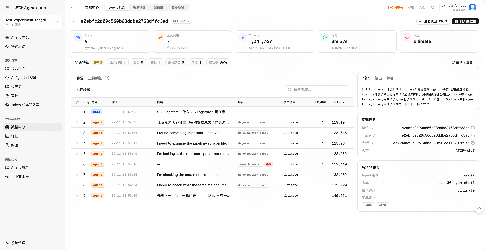

分析时，尽量把结论落到一组相邻事实：“用户要求操作步骤 → 检索返回了步骤 → 最终回答遗漏步骤”。这样的记录便于别人复核，也能直接用于后续评分。单独写“回答质量不好”，下游仍然不知道应该检查什么。

需要确认字段、调用标识或导出结构时，可使用“查看轨迹 JSON”。怀疑记录缺失或对应关系错误时，再由工程人员结合身份回查采集记录；业务结果仍需以实际工具反馈和业务状态为依据。

### 19.4 把排障、成本分析和业务质检落到具体行动

**工具失败，先判断 Agent 怎样处理失败。** 以退款任务为例，用户已给出订单号，工具返回“缺少退款原因”，Agent 却回复“申请已提交”。展开工具入参确认缺少哪个字段，再查看失败后的行动：它是否追问原因、修改参数或重新调用？若它确实收到了错误却仍告知成功，应改进错误处理和回复策略；若返回内容没有清楚表达失败，则需要同时检查工具接口。业务是否真的产生退款申请，还要核对业务系统结果。

保留失败后的重试过程很有用。修正参数后成功，说明 Agent 能恢复；多次原样重试同一错误，则可能需要调整重试或停止条件。二者都出现了失败调用，但不应给出同样的调优建议。

**耗时或 Tokens 偏高，先找多出来的工作。** 用应用、业务意图和耗时条件找到一组相近任务，在列表与详情中比较步骤和 Token 消耗，再展开高消耗记录。检查是不是反复检索同一材料、工具一次返回了大量无关内容，或者 Agent 多次尝试相同动作。

例如，两次都在回答“如何做评估”，其中一次反复查询相同文档。逐次查看查询和结果：如果后来取得了新信息，重复检索可能有价值；若输入与结果几乎没有变化，则可以提出复用已有检索结果、限制无效重试或缩小工具返回内容的候选。记录相关步骤，并在实验中验证减少调用后答案是否仍然完整。

不要仅凭总 Tokens 高就删步骤。复杂任务需要更多探索，必要的测试和状态确认也会增加消耗。Tokens 用于定位资源使用，费用还与所用模型和计费方式有关；实际决策需要把任务质量、耗时与消耗一起比较。

**业务质检，重点看回答与执行事实是否一致。** 产品客服的两类常见问题是“有哪些功能”没有覆盖关键能力，以及“如何做评估”没有给出可执行步骤。先用输入检索找到两类记录，分别阅读其回答与检索过程，判断缺项来自知识、检索还是回答组织，再各留几条有明确依据的候选。

如果业务要求生成文件、提交表单或修改配置，还需查看最终产物或业务状态。Agent 回答“完成”只是一条输出；工具接收请求、任务执行结束和业务目标达成都不是同一件事。材料不足时先记录待确认，避免把采集问题直接变成 Agent 的 Badcase。

分析后应明确下一步：补知识、修工具、改回答策略、调整执行流程，或者先补数据，再通过评估和实验验证修改。

### 19.5 把有价值的记录留成样本，再把同类数据交给 Pipeline

读到值得保留的任务，可以在详情顶部点击“加入数据集”；也可以回到列表勾选多条记录后加入。弹窗支持创建新数据集或选择已有数据集，并配置要写入的字段。首次建立候选集时，保留用户输入、Agent 输出和轨迹内容；需要分析来源或消耗时，再增加应用、模型、工具名、Tokens 等字段。

写入已有 Dataset 时，核对字段映射是否对应原有含义，尤其不要把最终答案和完整轨迹接反。写入后打开目标数据集，检查选中的题目、回答和必要过程是否在同一条记录中。对于较长轨迹，还应确认后续评估需要的内容是否保留；如需更完整或有针对性的材料，可以通过 Pipeline 提取。

这些记录此时是候选样本。业务人员还要确认问题是否成立、补充期望行为，再决定哪些进入黄金集。可以为“功能覆盖”“操作指导”各保留失败例，也保留几条正常例，避免下一次修改只改善投诉样本，却损害常规回答。

当需要处理全部匹配记录时，列表支持选择符合条件的数据；数据量较大、界面提示使用 Pipeline 导入时，提交的是后台处理任务。确认时间范围、筛选条件和目标数据集后，再检查任务运行结果与实际入库样本。看到“任务已创建”后，就可以去追踪运行，而不是把它当作所有数据已经写入。

单条复盘帮助团队发现规则，Pipeline 负责把规则重复应用到更多数据。例如，将“操作指导”类轨迹整理为用户问题、检索结果、最终回答和工具状态；对重复投递去重；按业务场景分流；为后续评估补充需要的字段。持续产生的数据也能沿同样规则加工，不必每天手工复制轨迹。

进入下一章前，可以先准备一句明确需求：“处理这段时间产品客服的操作类问题，每条保留题目、相关检索内容、最终回答和来源标识，写入候选数据集。”再拿几条真实轨迹预览，检查规则是否保留了判断所需的内容。业务目标与样本一起交给管线，才能逐步形成可复用的处理流程。

### 19.6 理解三个对象，避免把记录范围当成任务结论

前面的操作会反复遇到 Trace、Session 和 Trajectory。它们组织数据的方式不同，理解这一区别有助于决定该找哪些记录、什么结论还需要补证。

| 对象 | 组织什么 | 使用时怎样理解 |
| --- | --- | --- |
| Trace | 由追踪上下文关联的一组调用，包含模型、工具及相关服务操作 | 适合定位某次执行和调用问题；能看到的范围取决于实际采集 |
| Session | 应用关联的一段连续交互，可能包含多条 Trace | 适合查看用户补充和上下文；同一会话中可能有多个任务 |
| Trajectory | 整理后的用户与 Agent 步骤、工具交换、结果和指标 | 适合阅读行为过程、分析和加工样本；仍需核对当前记录覆盖哪些任务部分 |

一次同步问答可能恰好对应一条 Trace；多轮、异步回调或子 Agent 执行则可能留下多份记录。SessionID 帮助查找相关交互，但不会自动证明它们都属于同一个任务。应用需要提供可靠的身份和关联，不能凭时间接近或文字相似就认定平台已经恢复完整任务。

轨迹整理会提取行为主干、减少模型请求中反复携带的历史内容，并关联工具请求和返回。这样业务人员能直接阅读步骤，而不必逐条翻底层 Span。真正发生的重试仍有分析价值；失败、缺失返回和未取得业务结果，也应在使用时分别对待。

Agent 观测与优化使用 ATIF 组织可交换的轨迹内容，包括步骤、消息、工具调用与观察结果、运行指标和来源扩展。统一结构让展示、Pipeline 和评估能够复用同一份行为材料。通常无需手写 JSON，只有对接外部工具或排查字段时才需要查看具体格式。

轨迹记录一次执行发生了什么；重新实验还需要题目、运行入口、必要的环境和评分标准。接下来的数据处理，会把这些行为材料整理成可供评估和实验使用的样本。


<a id="sec-032"></a>

## 第 20 章　Agent 运行时数据处理
客服负责人提出了一个具体要求：每天看一批退款对话，找出“工具没有办成，Agent 却告诉用户已经办好”的问题；改完提示词后，还要用这些案例检查问题有没有减少。

运行记录已经接入，轨迹也能打开，但质检人员需要的是一张可以直接使用的表：用户问了什么、Agent 如何回答、执行了哪些操作，以及记录来自哪里。数据多了，还希望按业务分类、抽取样本，每天自动补充新数据。如果每次都由开发者导出日志、改脚本、整理表格，质检很难成为日常工作。

**Pipeline 将这套整理方法保存为数据处理任务，按约定持续生成 Dataset。** 应用开发者把业务字段接对，业务负责人围绕预览确认样本是否符合用途；之后，评估、人工复核和实验共用这些字段，减少反复找数据、解释数据的工作。

在上一章中，我们已经得到可以阅读和回查的执行过程。本章接着说明，怎样将这些过程整理成业务用得上的样本。

### 20.1 Pipeline 能帮业务做哪些事

Pipeline 的功能可以按要交付的结果来选择。多数任务只需要其中几项，无需把所有处理都加进去。

| 业务需要 | 可以采用的处理 | 得到什么、何时有用 |
| --- | --- | --- |
| 把日志变成可读表格 | 字段投影、字段扩展、条件过滤 | 提取问题、回答、模型、耗时等字段，适合质检、分析和评估前的数据准备 |
| 把分散事件整理为完整样本 | 实例构建 | 按已确认的任务或会话身份组装记录，适合输入仍是 Span、消息片段的应用 |
| 从相似内容中整理题库 | 精确去重、近似去重、语义去重 | 减少相同或相近问题，降低题库维护与重复评估的工作量 |
| 在有限预算内多看几类问题 | 随机采样、分组采样、向量生成、语义聚类 | 按比例、条数或类别选样，适合人工复核、专项排查与评估集扩充 |
| 为样本补充业务信息 | LLM 调用、智能体调用 | 分类、摘要、信息提取或生成候选标注，让筛选与分析更方便 |
| 找出异常长的内容 | 文本统计、条件过滤 | 计算文本长度等特征，定位过长输入或工具返回，为内容治理和成本排查选样 |
| 持续收集新数据 | 单次执行、周期执行、运行历史 | 先整理一个历史时间段，再按小时或天生产新样本，支撑日常质检 |

同一份数据可以服务不同目的。客服团队需要问题与答复，开发者排查工具使用需要步骤和返回结果，成本分析还需要模型与消耗字段。可以保留共同的基础字段，再根据用途配置不同的处理任务和输出集合。

选择之前，先明确一行代表什么。退款质检可以从“一次任务一行”开始；分析用户为何反复补充信息，需要连续多轮；比较多个并行 Agent，则要分别保留各条路径。这个选择决定了后面怎样分组、采样和评分，也决定业务人员打开表格后能否直接理解。

### 20.2 从合适的入口开始

进入对应 AgentSpace，在“数据中心”的“数据处理”中点击“创建 Pipeline”。创建页支持选择来源、使用模板或让 Loopie 生成管线，并在同一流程中配置输出与调度。已经在整理 Dataset 的用户，也可以从创建数据集的“从轨迹数据导入”入口开始。

选择来源时，可以这样判断：

*   **已有 Agent 轨迹，准备做评估：选“轨迹数据”。** 页面使用当前空间关联的轨迹来源，可从“Agent 轨迹样本提取”推荐方案开始，直接提取输入、输出、会话与完整轨迹。
    
*   **需要从调用日志提取业务字段：选“Trace 数据”。** 查看页面带出的日志来源与应用范围，从推荐的问答提取方案开始；还需要其他字段或组装方式时，再修改处理模块。
    
*   **只需问题与回答：优先选问答提取。** 如果还要检查工具是否用对、失败后如何恢复，就保留完整过程，减少质检时重新找日志的工作。
    

页面按来源推荐处理方案，背后使用相应的预置模板。选择后，左侧“流水线”展示处理模块，点选模块即可查看配置，也可以通过“添加模块”补充采样、分类等处理。开发者熟悉字段时，直接改配置通常最快；需要更多处理步骤，也可以让 Loopie 生成后再调整。

不熟悉原始结构时，可以先向 Loopie 描述目标。例如：

> 整理退款客服最近一天的运行轨迹，一次任务一行。保留用户问题、实际答复、完整执行过程和来源 ID，输出到退款质检数据集。先给我看真实样本；没有最终答复的任务也保留，方便检查中断问题。

Loopie 可以生成并将管线呈现在编辑器中，用户接着查看真实预览、补充要求。例如“这里取到的是系统包装后的问题，请改成业务入口原文”“增加一列区分退款申请和进度查询”。对话缩短了从业务要求到配置草稿的距离；确认结果后，这份配置就能用于后续数据生产。

### 20.3 完成第一条退款质检任务

下面用一个教学示例走完流程。假设退款 Agent 已产生标准轨迹，我们先整理昨天的数据，输出到新数据集 refund\_review\_samples。首轮保留各次真实任务，便于看到相同问题成功与失败的不同处理。

#### 选来源与字段

在创建页选择“轨迹数据”，找到“Agent 轨迹样本提取”推荐卡片，点击“选择此方案”。进入编辑器后，可以在“智能生成”中继续对话，也可以切到“手动配置”修改字段。先查看输入来源是否属于目标空间，再根据实际存在的服务或业务字段确定应用范围。若多个应用共用来源，可以让 Loopie 根据样本补充筛选规则。

该方案将原有输入、输出和完整轨迹整理为以下字段。业务人员主要读前两列，评估器还能读取过程，开发者可以沿身份回查原记录。

| 输出字段 | 内容 | 退款示例中的用途 |
| --- | --- | --- |
| input | 用户输入 | “订单 1001 需要退款” |
| output | Agent 的最终答复 | “退款申请已经提交” |
| agent\_trajectory | 完整轨迹内容 | 查看退款工具的参数、结果及后续回复 |
| trajectory\_id、trace\_id | 来源身份 | 找到这次实际执行，供复核和排查 |
| session\_id | 会话关联 | 必要时联系前后交互 |

其中，模板把源数据中的 atif\_content 映射为 agent\_trajectory，方便在后续评估中使用。若业务还需要渠道、订单类型等字段，可在“字段投影”或“字段扩展”模块中添加，并从真实样本确认其来源。

字段选择应体现质检目标。检查“用户后来补充的退款原因有没有被使用”，应在输入或轨迹中保留补充信息；检查是否实际办理成功，则需要相应的工具反馈或业务结果。这样，评估器拿到的材料才足以回答具体问题。

#### 用预览确认这张表好不好用

方案卡片提供“生成预览”；进入编辑器后，可以选择输出模块点击“预览”，查看整条管线的结果。选择有真实数据的时间范围，先展开一条普通任务的输入、输出和轨迹，确认质检人员能连续读懂；再找一条工具报错或没有答复的任务，看它是否保留下来。

例如预览里出现：工具返回“缺少退款原因”，最终答复却是“退款已经提交”。这正是希望交给质检的样本。若只保留最后一句话，之后很难判断它为什么不对；如果过滤模块删掉了工具失败记录，也要调整条件。可以点选对应模块修改，再生成预览。

预览还适合当场确定输出形态。较长的过程保留在结构化内容列中，列表先显示问题与回答；需要按渠道筛选的字段则单独成列。业务负责人用这几条样本确认“收到这样的表，是否已经能开始工作”，开发者据此收敛配置。

#### 创建、运行，再到 Dataset 使用结果

点击页面的“创建并启动”，进入“任务信息与调度策略”，填写任务名称、描述，选择“单次执行”，将处理时间明确设为昨天。在“输出”中填写新数据集名称 refund\_review\_samples。提交前再次看清时间范围，预览所选时间不一定就是正式执行时间。

确认后再次点击“创建并启动”。系统创建输出数据集与处理任务，单次执行会进入运行队列。随后可在任务详情的“运行历史”查看数据窗口、状态、输出行数与耗时。执行完成后，回到“Pipeline 配置”，通过输出目标卡片的“跳转到数据集详情”图标进入 Dataset，按一条已知 trace\_id 找到样本，展开字段读取。预览帮我们定方案，这一步让质检团队拿到可查询、可标注的数据。

如果结果为空，先确认所选时段是否有记录，再检查应用筛选；字段大面积为空，就检查提取位置。初次运行用一个明确的时间段，可以较快分清是数据范围问题还是加工规则问题。

### 20.4 按实际用途加上采样和 AI 处理

第一条任务只需要把材料整理清楚。开始使用之后，再根据复核量、场景覆盖和分析方式增加处理，更容易判断每一步是否有用。

#### 人工看不过来，先缩小到能处理的量

假设质检人员一天能认真复核 100 条，可以增加“随机采样”模块，选择“按采样条数”，填写 100；需要让业务类别都有机会入选时，在“分组列”中选择已有类别字段，再设置每组采样条数。这里的 100 是示例工作量，应按实际人力调整。

如果还不知道问题分为哪些类别，可以先用向量生成与语义聚类整理主题，再按聚类结果采样。例如从相似的“进度查询”里取少量代表，把更多阅读时间留给其他问题。这适合扩充题库和发现问题类型；需要估计线上总体失败率时，则保留具有代表性的抽样口径。

内容去重适合另一个需求：已经选出不少案例，准备整理一份不重复的回归题库。在去重模块里选择比较字段；精确去重处理相同文字，近似去重处理细微改写，语义去重处理含义接近的不同表达。按问题去重前，要把结果和重要场景差异考虑进去，避免将同一道题的一次成功与一次失败混为一份。

#### 没有业务标签，让模型先做一版

退款记录可以分成“申请退款”“查询进度”“退款被拒”等类别。原始数据没有这些标签时，在提取字段后增加“LLM 调用”模块，选择调用模型，填写自定义提示词，将“输出解析格式”设为“JSON格式”，把“输出列名”设为 scenario\_label。

可以从这样的提示词开始：

> 根据用户输入 {{input}}，将本次任务归为“申请退款”“查询进度”“退款被拒”“其他”之一。只根据输入判断，不推断办理结果。返回 category 和 reason 两个字段；reason 简短说明分类依据。

生成预览后，查看 scenario\_label 中的类别和理由。遇到“已经申请三天了怎么还没到账”，应能归到进度查询；如果分类不符，补充类别解释和相近例子，再试一批样本。需要直接按类别列筛选时，可继续用字段扩展将 JSON 中的 category 提取为独立列。

同一个模块还可以生成问题摘要、提取产品名称或补充候选标签。需要检索知识、调用工具才能完成的分析，可以选择智能体调用，并配置相应智能体与提示词。生成的标注先供筛选和人工复核使用；正式质量评分交给可校准、可比较的评估器，便于长期维护标准。

题库还缺少某类表达时，可以用 LLM 调用做数据增强：以已有样本为种子，通过提示词生成不同说法或边界条件。例如已经有直接申请退款的题目，希望补充“用户先问到账时间、随后改为申请退款”的多轮要求，就把需要保留的业务事实和允许变化的部分写清楚。生成结果先放入候选材料，人工确认后再使用，同时保留合成来源，方便与真实用户任务区分。

处理顺序可以按成本安排：已有字段能筛选的先筛选，明确只需 100 条的先采样，再做模型处理。如果采样依赖模型生成的类别，就先分类再按类别抽样。每增加一步，都应说明它要帮使用者少做什么工作、增加哪项信息。

### 20.5 从一次整理变成日常质检

当昨天的样本已经可用，就可以使用相同的处理定义另建周期任务：重新选择相应模板，沿用已确认的字段、筛选和采样设置。在“任务信息与调度策略”选择“周期执行”，设置起始时间和每隔多少小时或天执行，例如按小时补充新任务，或按天集中交付。这次创建一个日常使用的数据集 refund\_review\_daily，之后各次周期执行都向它写入，质检人员便能在固定位置查看新增内容。

首次配置时，把历史补数范围与后续周期的起始时间衔接好。之后主要在任务详情中查看执行历史、成功与失败情况，再抽查新增样本。应用增加了新渠道或新的回复方式，也要更新相应处理规则，让数据集包含这些变化。

接下来进入评估功能，新建以 Dataset 为来源的评估任务，选择 refund\_review\_samples 和准备好的退款质检评估器，将评估器需要的输入、输出、轨迹变量分别映射到 input、output、agent\_trajectory。先评一批样本，查看分数、理由和对应证据，便能找到“工具失败却回复成功”等待处理案例。开始日常质检后，再以 refund\_review\_daily 中的新样本作为评估材料。

业务负责人可以看到问题集中在哪些场景，开发者拿着对应轨迹定位并修改，评估人员把确认的问题加入回归材料。新版本重新执行这些任务后，实验再比较结果，判断修改是否有效。新增运行记录继续进入同样的加工任务，日常数据准备就接上了调优工作。

操作演示中，两道客服问题起初共用评分细项，后来发现“介绍有哪些功能”和“说明如何做评估”需要不同标准，于是回到 Dataset 增加逐题 Rubric，再调整评估与实验的映射。这也说明，产出的字段应便于继续扩充。后续使用提出了新问题，就补充相应材料，而不必重做全部数据准备。

### 20.6 第一次使用，先交付一批有人愿意用的数据

先完成“轨迹提取→Dataset→一批评估”，让负责质检的人读一遍结果。字段对了，再增加标签和采样；已有稳定使用节奏，再建立周期生产任务。

长期使用时，保留三项简单约定：样本粒度、关键字段含义、数据用途。业务负责人确定要看什么问题，应用开发者维护来源字段，数据处理任务负责重复执行。复杂的并行聚合、超长任务或跨窗补取，再由开发者按实际数据补充处理。

判断是否值得继续投入，也可以看具体工作有没有变得顺畅：质检人员是否还需要逐条找原日志，新增一种业务场景能否通过补充字段和规则纳入，开发者收到问题后能否定位到同一次执行。若这些环节已经衔接起来，再增加语义聚类、合成或复杂 Agent 分析才有明确目的。管线简单而输出被持续使用，通常比配置了很多处理却无人消费更有价值。

退款质检的首次交付可以很明确：在 refund\_review\_samples 中找到昨天的任务，打开一行能读懂问题、回答和办理过程，启动评估能得到有依据的结论。哪些记录值得长期保留、如何经过人工确认成为黄金集与回归集，接着在下一章中展开。


<a id="sec-033"></a>

## 第 21 章　Agent 黄金数据集
客服团队发现 Agent 漏答了一个关键步骤，研发补充 Prompt 后再问一次，回答完整了。接下来还需要知道：换一种问法是否仍然有效，其他问题有没有答差，以后换模型会不会再次漏掉这个步骤。

如果每次都临时找问题、凭印象判断，这项工作会越来越难。黄金数据集让团队把这些问题和判断标准保存下来，形成一套可以反复使用的业务题库。修改 Prompt、补充 Skill、调整知识库或更换模型时，都能拿同一批题检验效果。

在 Agent 观测与优化中，Dataset 是管理这套题库的地方。上一章中持续把运行数据整理进来，本章接着说明怎样选题、确认标准、建成黄金集，再把它用到日常调优中。

### 21.1 黄金数据集有什么用

**黄金数据集是一组经过业务确认的任务：既有题目，也有判断任务是否完成的依据。** 对知识问答，依据可以是参考答案和必须覆盖的要点；对退款、订票等操作任务，还要说明业务应达到的状态；对代码任务，则可以包含测试要求和验收条件。

“黄金”指题目与标准可信。Agent 曾经答错的任务，只要补齐了正确要求，同样可以成为黄金样本。保存这类题，往往比只收集漂亮的成功回答更能帮助团队改善产品。

| 团队要做的事 | 怎样用黄金集 | 对业务的帮助 |
| --- | --- | --- |
| 确定什么算回答好 | 让业务人员确认同一批题的参考答案与评分要求 | 运营、研发、测试有共同标准，减少反复争论 |
| 选择模型或 Agent 方案 | 让候选方案执行同一批题，比较结果、成本和耗时 | 根据自己的业务选型，不只看通用榜单 |
| 验证一次修改 | 保留修改前后的逐题回答与得分 | 看清修复了什么，以及是否影响其他能力 |
| 防止老问题重现 | 把重要问题长期放进回归题库，升级前重复运行 | 已处理过的投诉与故障变成长期检查项 |
| 校准评估器 | 用人工已确认的样本检查机器评分 | 让持续评估更接近业务判断，减少无效 Badcase |

例如，产品客服经常回答“有哪些功能”和“如何配置评估”。两种问题需要的答案不同：前者强调能力覆盖，后者强调操作步骤。把题目和各自的要求保存下来，产品升级后只需更新对应条目，就能继续验证客服是否给出了准确、可执行的帮助。

黄金集的价值来自反复使用。一份从未进入评估、实验或发布检查的数据集，即使整理得很精细，也还没有参与改进 Agent。

### 21.2 Dataset 提供哪些日常能力

进入对应的 AgentSpace，在**数据中心 → 数据集**中管理样本。可以把 Dataset 理解为一张专门用于 Agent 评估与调优的业务表：一行放一道题或一个任务，一列放题目、回答、评分要求等信息。创建后可以继续补数据、改字段、做标注，也可以直接进入评估和实验。

| 需要做什么 | 在哪里操作 | 适合什么时候用 |
| --- | --- | --- |
| 把已有题库放进来 | 创建数据集，选择“上传 CSV / Excel / JSONL 文件” | 已有 FAQ、测试用例或人工整理的表格 |
| 从实际运行中取题 | 选择从 Trace 数据处理或从轨迹导入；也可在轨迹详情“加入数据集” | 将投诉、失败任务和真实问法变成候选样本 |
| 从少量题开始 | 创建时选择“从空白开始”，定义字段后新增数据 | 先验证流程，或由专家编写关键案例 |
| 增加评分要求等内容 | “字段管理”增加列，在“数据详情”中编辑记录 | 给现有样本补参考答案、Rubric、场景等 |
| 批量整理与人工确认 | “AI 标注”与“标注管理” | 分类、预筛选，以及按统一要求逐条复核 |
| 留下可重复比较的一版题库 | 版本管理中的“创建版本” | 重要实验、回归或业务规则更新前 |
| 使用题库 | “发起评估”“发起实验”，并查看实验记录 | 检查已有回答，或让 Agent 重新做题 |
| 将样本交给其他工具 | 导出当前查询结果，或使用离线下载 | 外部分析、训练准备、归档与交付 |

第一版题库可以很简单。先把团队最关心的任务放进来，补清楚如何判断，再逐步增加标签和管理规则。

### 21.3 动手建立一份产品客服黄金集

下面沿用操作演示中的两道题：“Agent 观测与优化有哪些功能”和“Agent 观测与优化如何做评估”。目标是验证客服是否能完整介绍产品，并给出用户照着就能执行的评估步骤。两道题用于跑通建设与使用过程，正式题库再扩展到更多场景。

#### 21.3.1 建候选集，集中收集值得检查的问题

在数据集列表点击**创建数据集**，名称可设为 `customer_service_candidates`，描述写清中文用途，例如“产品客服候选题库：收集真实咨询与低分回答，供产品专家复核”。随后按现有材料选择来源。

已有表格，就上传文件，预览识别出的列和几条内容，确认题目、回答没有串列，再创建。已有 Agent 轨迹，就先搜索目标应用和时间范围，在详情中将有代表性的任务加入这个候选集。需要每天持续收集，则使用 Pipeline，将整理后的问题、回答与轨迹引用写入工作集。

还没有线上流量时，也可以从空白开始，由产品或客服人员补入常见问题、难题和业务规则中的边界情况。专家编写的题与真实用户问题可以一起使用，在来源列中区分即可。

#### 21.3.2 用少量字段把题目和标准说清楚

在**字段管理**中设置所需的列。下面是一种适合起步的结构，名称由团队自行定义；创建时使用对应的文本字段即可。

| 列 | 示例字段名 | 填什么 |
| --- | --- | --- |
| 题目 | `input` | 用户原始问题；必要时补充完成任务所需的前提 |
| 原回答 | `actual_output` | 原 Agent 怎样回答，供分析错误与人工复核 |
| 参考答案 | `expected_output` | 业务认可的答案或应完成的结果 |
| 评分要求 | `rubric` | 必须覆盖什么、怎样判分、哪些错误不可接受 |
| 场景 | `scenario` | 功能介绍、操作指导、异常处理等 |
| 来源 | `source_ref` | 对应轨迹、文档版本或人工编写说明 |

“参考答案”与“评分要求”可以一起使用。参考答案给出一个合格示例，评分要求说明哪些内容必须做到，允许 Agent 用不同措辞作答。开放任务通常不宜要求逐字一致。

两道题可以这样整理。下面列的是编写方向，具体要求由产品负责人结合当期能力确认。

| 题目 | 参考答案的重点 | 评分要求的重点 |
| --- | --- | --- |
| Agent 观测与优化有哪些功能？ | 说明观测、数据处理、评估实验、经验使用等能力及用途 | 是否覆盖用户关心的能力；是否解释能解决什么问题；是否包含不准确承诺 |
| Agent 观测与优化如何做评估？ | 说明准备数据、创建评估器、配置任务、查看结果与改进的步骤 | 是否说明入口；是否配置输入输出映射；是否解释评分结果怎样使用 |

演示最初把这两道题的要求写在同一个评估器里，后来改为在数据集中增加 `rubric` 列，分别填写要求。这样调整以后，低分能够对应到当前题目遗漏的内容，研发也更容易知道该补知识、步骤还是示例。

“如何做评估”这道题的 `rubric` 可以先填入下面这段示例，再由业务人员调整要求与权重：

> 按四项检查，每项满足得 0.25 分，否则得 0 分：①说明如何准备并选择评估数据；②说明如何选择或创建评估器；③说明用户输入、Agent 输出与轨迹的字段映射；④说明如何运行评估、查看解释并处理低分样本。输出逐项得分、总分及缺少的内容。若编造产品能力或操作入口，另标记为不通过并说明具体问题。

#### 21.3.3 先手工确认几条，再让 AI 扩大整理范围

打开**数据详情**，逐条阅读题目、原回答与来源材料，补入参考答案和评分要求。例如，原回答只说“创建评估任务”，业务人员就需要把缺少的评估器选择、字段映射和结果查看补入要求，而不是只写一句“答案不完整”。

先选几条典型题一起讨论，能够提前发现标准分歧：功能介绍是否还要给使用建议？操作指导是否必须给出界面入口？这些约定明确后，再交给更多人或 AI 批量处理。

数据多起来时，在 **AI 标注**中选择它需要读取的“关注字段”，例如题目、原回答和相关说明，再选择已有标注配置，或描述分析目标让 AI 生成标签。可以先按“功能介绍、操作指导、异常处理”分类，也可以标出“可能遗漏步骤”的回答。填入业务识别规则，选择跳过已有结果还是重新标注并覆盖，然后创建任务。

只想补齐缺失标签，就选择跳过已有结果；业务分类体系整体变化时，再考虑重新标注。任务完成后，查看代表样本，检查 AI 是否理解了分类与业务要求。预标注适合减少整理工作，黄金题目的标准仍要由业务人员确认。

#### 21.3.4 完成复核，把确认后的题选进黄金集

多人持续复核时，进入**标注管理**，选择或配置标注模板，将题目、原回答、参考材料映射到展示区域，再设置要填写的判断，例如“答案是否正确”“遗漏哪类信息”“是否需要补证”。保存配置后开始逐条标注，提交后继续下一条；有分歧时查看原内容与历史标注，再修订判断。

需要进入实验的参考答案和 `rubric` 应填写到约定字段中，让评估器可以直接读取。仅在讨论中留一句“这题应当这样答”，实验并不能自动使用它。

确认后，筛选并勾选这批样本，使用**加入数据集**将它们放进 `customer_service_gold_v1`，描述为“产品客服黄金集第一版”。确认目标字段映射保留了题目、参考答案、`rubric` 和来源，再提交并查看新集合中的内容。也可以导出后导入一个独立数据集。团队可以用自定义复核状态或标签管理选择依据。“黄金集”是团队赋予这份数据的用途，不需要等待一种特殊的数据集类型。

证据暂缺或还在争论的样本继续留在候选集，补齐后再收入。已经确认有问题的样本称为 Badcase；把它的正确要求补好，才能用于检验下一次修改。

### 21.4 题库怎样选，才对业务有帮助

只收集低分题，可能看不到正常能力的退化；只收集最常见问题，又容易漏掉代价很高的少数情况。选题时可以让客服运营、业务专家和研发一起检查覆盖范围。

| 应保留的题 | 为什么保留 | 产品客服的例子 |
| --- | --- | --- |
| 高频问题 | 影响大量用户的日常体验 | 功能介绍、接入方式、常用配置 |
| 已发生过的问题 | 检查修复是否持续有效 | 回答遗漏步骤、引用过期功能 |
| 业务边界与高风险要求 | 防止少量但代价大的错误 | 无权限操作、不存在的能力、敏感信息处理 |
| 原本表现正常的题 | 发现改动带来的退化 | 过去能完整回答的标准操作问题 |
| 表述变化与多轮问题 | 检查是否只适配一种问法 | 简称、补充条件、上下文中的追问 |

用场景列筛选或汇总后，团队会看到哪些类别堆了很多题，哪些还没有代表案例。优先补空缺，比不断增加近似问题更有价值。同一句问题也不一定重复：账号权限、产品版本或上下文不同，正确答案可能不同，选题时应保留这些区别。

涉及实际操作时，还要写明任务的起始条件。例如“订单满足退款条件”可以作为新任务的输入；旧运行中的工具报错是分析原执行的材料。重新做题时应从约定的初始状态出发；专门测试失败恢复时，再设置相同的失败检查点。

第一批黄金题不必很多，但应有人能够解释每道题为何保留、怎样判定。之后每处理一类新的线上问题，就补入相应样本，并回看现有题库是否仍适用。

### 21.5 建好以后，怎样真正用起来

#### 用法一：检查评分标准是否靠谱

选取人工确认过的好回答、坏回答和边界回答，点击**发起评估**。把题目、原回答、参考答案和评分要求映射给评估器，查看它的结论是否与业务人员一致。

如果坏回答得了高分，先看它是否拿到了正确字段、当前题目的要求是否清楚。修正后再评同一批材料。黄金集在这里是“校准题”，帮助团队建立后续持续评估可以信赖的标准。

#### 用法二：比较 Prompt、模型或 Agent 版本

在黄金集上点击**发起实验**，选择评估器并配置映射。题目交给被测 Agent，参考答案与 `rubric` 交给评估器；本次新产生的回答作为被评价对象。先运行当前版本作为基线，再运行改进后的候选。

例如给产品客服补充了一份评估操作 Skill，就让两个版本都回答“如何做评估”，同时检查“有哪些功能”等原本正常的问题。看目标题是否补齐步骤，也看其他题是否变差、耗时和成本是否变化。黄金集提供共同题目与共同标准，实验负责重新执行并记录结果。

先查看逐题变化，再看总体趋势。一道关键操作题仍然失败，不能只因为平均分提高就忽略它。具体的实验配置与分析将在下一章展开。

#### 用法三：把重要题长期作为回归检查

把历史故障、重要流程以及一部分正常题列为回归范围，在模型、Prompt、Skill 或知识库升级前重复运行，也可以通过实验执行端的定时调度持续检查。发现退化时，直接定位到具体题目、要求和历史表现。

同一条黄金样本可以承担回归用途。黄金强调题目和标准的质量，回归强调反复使用的目的；不必为每个称呼重新复制一遍数据。需要独立发布节奏或不同权限时，再分成多个数据集。

### 21.6 随业务更新题库，保留比较依据

正式比较开始前，在数据集版本管理中点击**创建版本**，填写版本号和描述，例如“v1.0，产品客服操作指导，按本月产品文档确认”。随后可以查看历史只读快照，回溯当时用了哪些题和标准。

当前控制台的历史版本视图用于查看快照，发起评估和实验需要回到最新数据。因此，一个直接的用法是：为本轮比较准备独立的黄金数据集，确认后创建版本留档，比较期间不再向它追加或修改数据。日常 Pipeline 继续写候选集，新题复核完成后进入下一版。

业务规则变化时，修改受影响的题目和要求，再创建新版本。参考产品文档时记下适用版本，外部文件也保留可重取的副本或稳定引用。导出交付时，确认导出的是当前筛选结果还是全量题库，避免接收方只拿到一小段样本。

还有一项简单但重要的安排：**参与改写 Prompt、生成 Skill 或提炼经验的题，与最后独立检查效果的题分开。** 将未参与优化的那部分留作独立验证。一旦反复查看这些题并据此修改 Agent，它们就已参与调优，应另留新的验证题。

业务人员持续补充真实需求和正确要求，研发用题库验证修改，测试与运营跟踪回归结果。这样，一次咨询、投诉或失败留下的不只是排障记录，还会成为下一轮改进可以直接使用的题目与标准。


<a id="sec-034"></a>

## 第 22 章　Agent 优化：Badcase
上一章中已经把业务问题和判断依据准备好。业务团队接下来需要做的是：让评估持续发现回答和执行过程中的问题，再用同一批题目验证修改是否有效。

本章沿用产品客服 Agent 的实践：用户会问“Agent 观测与优化有哪些功能”“如何做评估”，团队希望回答既准确，也能指导用户完成操作。评估检查已经发生的执行；实验则让修改后的 Agent 重新回答，产生新的输出和轨迹。

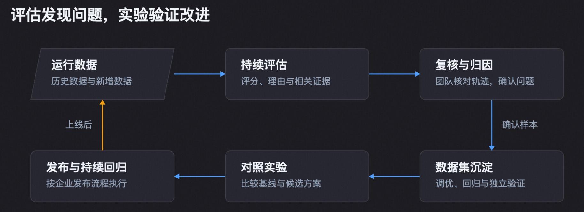

### 22.1 先选一个业务问题，做出能用的评估器

第一次建立评估，不必同时覆盖所有业务。产品客服团队可以先选“回答了相关概念，却没有解决用户的问题”这一类投诉，拿出几条专家认可的回答和几条明显有缺陷的回答，讨论差别在哪里。

例如，“有哪些功能”需要覆盖主要能力并说清用途；“如何做评估”需要说明准备数据、配置标准、运行评估和查看结果的过程。两者都要求准确，但对完整性的要求不同。团队先写通用标准，再为已经进入实验集的题目补充各自的 Rubric，具体录入方法见上一章。

一份可开始试用的通用标准，可以要求评估器检查三件事：是否回应了用户的实际问题；关键说法是否有材料支持；需要操作的任务是否提供了足以继续执行的步骤。每项写清满足、部分满足和不满足的条件，并要求给出扣分原因。涉及退款、权限变更等操作时，再增加业务结果检查，避免只评价回复是否礼貌。

进入控制台“评估 → 评估器”，先查看预置评估器是否覆盖目标。已有任务完成度等指标能够满足需求时，可以先复用；需要产品知识或特定服务标准时，再创建自定义评估器。在 Prompt 中写入评判标准，声明所需的用户输入、Agent 输出和轨迹变量，在输出定义中配置分数、判断与解释。场景分类、逐项得分等字段按实际分析需要增加，不必把所有可能用到的字段一次填满。

评估方式也按业务选择：

| 需要判断的问题 | 可以怎样选择 |
| --- | --- |
| 输出是否符合 JSON 格式、必填字段是否存在 | 采用 Code 规则，先解决确定条件的检查 |
| 回答是否切题、是否遗漏必要信息 | 使用 LLM 评估，把参考材料和评分细则给齐 |
| 是否完成多步骤任务、工具结果与最终回复是否一致 | 使用 Agent 评估，结合轨迹检查；需要领域知识时可挂载相应 Skill |

一个任务可以选择多个评估器。例如，把“回答质量”和“业务操作是否完成”分别评估，后续能直接看出是哪一项下降。若需要总分，在评分标准中明确计算方式；不能把多个评估器的结果简单平均，就默认代表业务质量。

### 22.2 用几条真实样本试评，再启动第一批历史评估

评估器保存后，进入“评估 → 评估任务”，点击“创建评估任务”。这一步要把评分标准接到真实数据上，最有价值的检查是确认评估器看到了完整的问题、回答和执行过程。

**先选对数据和范围。** 要评新接入 Agent 的表现，可选择“Agent 轨迹”；数据已经经过 Pipeline 清洗、聚合并补齐业务字段时，选择相应数据集。使用轨迹或 Trace 来源时，按对应入口选择“单轮对话”或“多轮对话”；多轮会话还需配置“对话结束判断”，让任务完成后再评价。使用 Dataset 时，直接选择集合并映射字段，一行代表什么已经由前面的数据加工决定，无需再寻找单轮、多轮开关。

第一次运行可以开启“基于历史数据评估”，选择一段已知包含目标业务的时间，例如最近四小时，再点击“数据预览”。确认其中确实有需要调查的问题，而不是其他 Agent 或无关调用。若多轮会话预览为空，检查时间范围内的会话是否已达到设定的结束条件。

**把试运行规模控制在能逐条看完的范围。** 在“采样配置”中设置采样比例和最大样本数。操作演示使用 100% 采样、最多 100 条：它限制的是候选数据量，不能保证得到 100 条 Badcase。刚开始也可以只取更小的一批，先由业务人员看完解释，再扩大范围。

**接好字段，再运行测试。** 选择评估器后，界面会展示预览样本和“字段映射”。按样本中实际存在的字段配置：用户问题映射到输入变量，最终回答映射到输出变量，需要过程判断时再映射完整轨迹。变量名称可以自定义，但内容必须对应。例如，需要“最终回答”的位置不能误接到某次工具调用的输出。

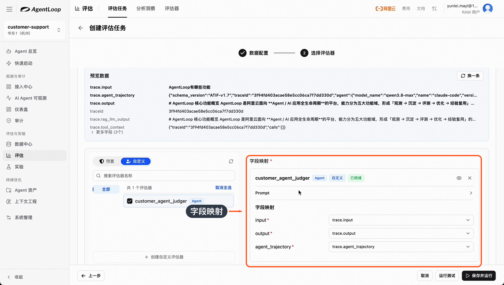

_操作演示：将评估器的 input、output、agent\_trajectory 分别接到预览数据中的问题、回答和轨迹，再进行测试。_

点击“运行测试”，阅读评分和解释，然后使用“换一条”继续验证。至少覆盖一条已知好回答、一条已知坏回答，以及一条信息不完整的样本。检查时可以直接问：扣分依据是否真的出现在这条回答中？评估器是否引用了正确的工具结果？缺少证据时是否说明无法判断？

如果坏回答被判高分，先看收到的输入，再看评分条款。比如评估器只检查是否提到“评估器”这个词，就可能把泛泛介绍当作操作指导，需要补充“能否让用户完成下一步”的标准。调整后重评同一批样本，确认原来的好回答没有被一并误判。

图片、音频或文档任务也按这个顺序试评。先确认评估器能读取对应材料，再核对它引用的页码、片段或字段。例如，判断报销金额是否正确，需要看到票据和填报结果；仅收到文件链接或一句“已完成”不足以作出判断。

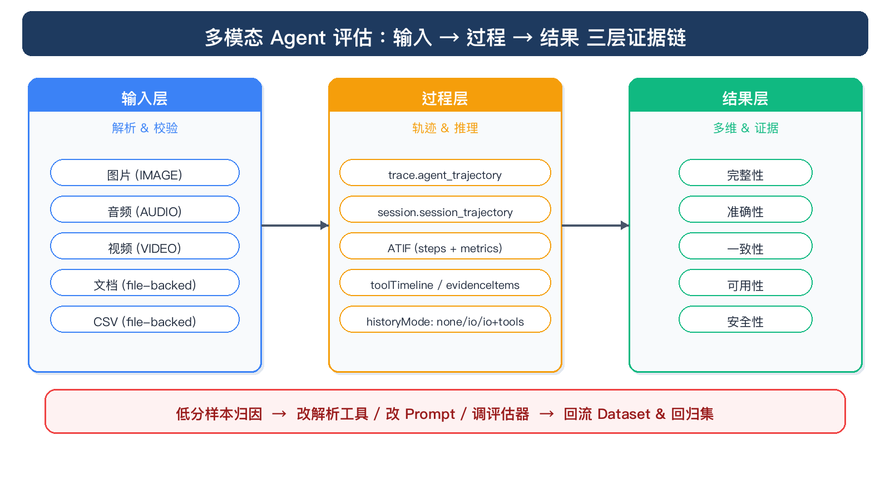

正式创建前，可以在“评估结果输出”中打开“写入评估结果数据集”。首次使用可留空结果数据集，由系统创建；已有明确用途的目标数据集时，也可选择追加写入。通过“透传源数据字段”保留用户问题、原回答、场景标记等后续复核所需材料。结果数据集配置在任务创建后不可修改，应在这里一并安排好。

最后点击“保存并运行”。任务结束后，先检查实际处理数量和失败记录，再开始分析得分。预览成功说明单条配置可用，第一批正式运行才会暴露是否选错范围、部分样本缺字段等问题。

### 22.3 从结果里选出值得修复的 Badcase

进入评估任务结果，先看整体分布，再打开具体样本。需要跨任务分析时，可进入“分析洞察”，按评估器、数据来源和分数范围筛选。查看低分时还要带上任务和时间范围，避免把不同标准、不同业务的数据混在一起比较。

一条结果至少要把原始问题、Agent 回答、分项判断和解释放在一起读。总分告诉团队先看哪里；解释帮助判断问题是否成立；轨迹则用于确认为什么出现这个问题。不要看到低分便立即改 Prompt。

以“如何做评估”这道题为例，可以按下面的顺序处理。这里的判断方式同样适用于客服、数据分析和代码任务。

| 读到的现象 | 继续查看什么 | 本轮应采取的动作 |
| --- | --- | --- |
| 回答介绍了概念，却缺少运行和结果分析步骤 | 评分条款是否要求操作指导，回答是否确实遗漏 | 确认为回答完整性问题，纳入调优样本 |
| 回答已有关键步骤，解释却说没有 | 映射后的输出是否完整，是否用了另一道题的标准 | 修正评估器或映射，重评受影响样本 |
| Agent 声称操作完成，轨迹显示工具失败 | 失败后的处理和最终业务状态 | 保留为任务执行问题，交给负责该行为的团队 |
| 结果显示执行异常或材料缺失 | 任务错误、采集范围、附件可读性 | 先补齐执行条件或材料，再判断 Agent 质量 |

在操作演示的一次实验回测中，“有哪些功能”和“如何做评估”分别得到 0.25 和 0.5。这两个分数对应当次回答与当时的 Rubric；真正有用的是逐项解释指出了哪些能力点没有覆盖。团队因此能够检查缺的是知识、回答组织还是题目标准，而不是笼统认为模型不够强。

结果写入 Dataset 后，可以按实际输出的分数字段或判断字段筛选候选，再由业务人员复核。保留确认的问题、预期行为和依据，形成后续实验用题。最初不需要收入所有低分样本：同一种遗漏选择有代表性的几条，同时保留边界场景和一部分原本正常的任务，才能验证修复是否带来退化。

人工发现评估器误判的样本也很有价值，应留作校准材料。这样下一轮既能检查 Agent 是否改善，也能检查评估器是否仍在犯同样的错误。高分样本要适当抽检，避免只看低分而漏掉评估器未识别的严重问题。

历史评估得到稳定判断后，再开启“基于新数据持续评估”，配置间隔和采样。日常优先看关键指标下降、反复出现的问题及新场景，每次选一小组明确问题进入实验。大流量下可以降低采样比例，再用专项历史评估补查重点场景。

### 22.4 把确认的问题配成实验，评估这次新生成的答案

回到“有哪些功能”和“如何做评估”两道题，团队可以提出一个具体改进：补齐产品知识，并要求回答操作问题时给出步骤。先记录当前方案作为 Baseline，再准备候选方案。若同时换模型、改 Prompt、增添 Skill，分数变化就难以解释；第一轮可以先只改变最有依据的一项。

进入“实验 → 实验计划”，点击“新建计划”，选择数据集和实验类型。“在线实验”用于在平台配置模型并直接运行；测试企业自己的 Agent 时，可以选择通过 SDK 执行的“本地实验”。这里的在线实验不等同于向生产用户做 A/B 分流。

随后配置需要使用的评估器和变量映射。实验与前面的历史评估有一个关键区别：被评分的必须是本次生成的新回答和新轨迹。

| 评估变量 | 实验中应接入的内容 |
| --- | --- |
| 用户输入 | 本次实际发给模型或 Agent 的问题 |
| Agent 输出 | 本次执行生成的新答案 |
| 运行轨迹 | 本次实验关联的执行过程 |
| 参考答案或预期行为 | Dataset 中对应题目的参考字段 |
| `rubric` | Dataset 中该题的评分细则 |

逐题 Rubric 的录入完成后，在评估器中声明 `rubric` 变量，要求它按传入条款评分；实验侧再把该变量映射到数据集字段。先运行两道题，打开解释，确认“有哪些功能”使用功能覆盖标准，“如何做评估”使用操作步骤标准。若仍评到了旧回答或共用了一份不适用的标准，应先修正映射再重跑。

实验计划也可以选择 Pipeline。当评分需要工具状态、结构化业务结果或轨迹中提取的字段时，可以让实验新产生的 Trace 经过处理，再将 `pipeline.` 开头的结果字段映射给评估器。这样，线上样本和实验新结果能够采用一致的加工规则。只需要比较最终回答时，可以先不配置这一步。

正式比较使用为本轮确认的独立黄金 Dataset 的最新数据，实验期间不再写入或修改，创建的数据版本用于留档；当前界面不支持从历史版本直接发起实验。同步记录评分标准、Agent 或模型版本、Prompt 和关键参数，让两版方案面对相同题目与起始条件。

### 22.5 把企业自己的 Agent 接进来，先跑通一道题

不少业务 Agent 需要访问内网知识库或业务系统，可以在能够调用这些服务的环境中执行题目，再把约定的结果回传到 Agent 观测与优化。起点是刚创建的本地实验计划：保存数据集和评估器配置后，点击**获取本地实验配置**，按侧栏指引安装依赖、配置环境变量，并选择“通过 HTTP 执行”“执行本地命令”或“自定义执行”。

工程师复制与当前计划对应的代码，将服务地址、请求头、问题如何组装成请求和超时设置替换为本地 Agent 的实际配置；自定义执行则补入自己的调用逻辑。业务负责人提供一条典型问题，先验证完整调用过程，再运行数据集。代码执行后，可到“实验记录”查看回传结果。

操作视频还展示了一个将这套执行过程包装成页面的客户侧实验平台，适合需要管理多个连接和定时任务的团队。使用已经部署的这类执行端时，先配置 AgentSpace、地域和访问凭证，测试连接，再新增目标 Agent 连接。初次接入可直接从上面的 SDK 指引开始，不需要先搭建这套管理页面。

演示里的 Agent 有会话状态，默认“发一次请求、取一次响应”的调用方式不能直接使用。实际适配成“创建 Session → 向该 Session 发送问题 → 获取最终响应”。如果 API 先返回任务受理信息，还需要继续等待最终回答，不能把受理成功当作题目完成。相互独立的样本应使用独立会话，避免前一道题的上下文影响后一道题。

完成调用适配后先做单题测试，检查问题确实发出、最终回答完整返回，实验记录能对应到这道题；需要过程评分时，再确认新轨迹已关联。使用客户侧实验平台时，可通过连接页面的单题测试完成同样检查。然后运行前面的小批数据。这个顺序可以把连接适配问题和回答质量问题分开定位。

Tool、Skill、Workflow 或 Harness 的修改，都可以通过接入修改后的 Agent 版本参与比较。把版本写入实验的上下文或记录中，并确认服务已经使用该版本。仅沿用同一个服务地址，无法说明两次运行的配置相同。

### 22.6 查看同一道题的前后差异，决定是否采用候选

实验完成后进入“实验记录”，选择 Baseline 和候选记录，点击“对比”。“概览对比”帮助观察整体变化，“配置对比”用于核对这轮实际改变了什么，“样本对比”则把相同题目的输出和指标放在一起。先确认使用的是同一批题和同一版标准，再解释分数升降。

阅读顺序可以从退化题开始，再看改善题，最后检查关键正常场景。对于“如何做评估”，重点核对候选是否补齐配置、运行和结果分析步骤；对于“有哪些功能”，看能力覆盖是否增加，同时有没有编造不支持的功能。输出变长本身不代表改善，新增内容需要对应评分要求。

在单题详情中结合分项结果、解释和输出差异阅读。若候选总分提高，但关键条款仍未通过，这轮还不适合升级；若只有一题改善而其他题退化，应回到具体修改，检查是否把某种回答格式强加给了所有问题。必要时为不同业务意图采用不同策略，再做下一轮实验。

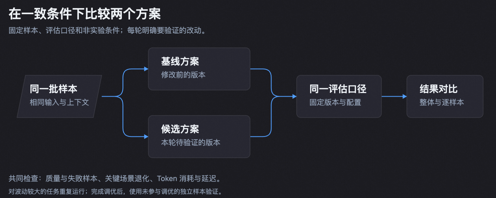

重复运行可以帮助确认改善是否稳定。需要检查评估器时，对同一份固定回答重复评分；需要检查 Agent 稳定性时，让它重新执行同一批题。前者主要观察判断波动，后者还包含回答、工具和环境的变化。看到分数起伏时，先打开对应的回答和运行记录，不能一律归因于 Rubric。

决定采用候选时，除了平均分，至少再看三件事：严重错误是否消失，原来正常的场景是否退化，耗时与消耗是否可接受。例如，补齐状态查询可能增加一次工具调用，却能避免“操作失败仍告知成功”；这类成本需要结合业务价值判断。反过来，省略必要步骤得到的低耗时不能作为升级理由。

调用失败、额度不足或没有取得最终答案的题目，应先说明原因。若本轮比较的是回答质量，可以修复执行条件后重跑；若比较整套服务的交付能力，这些失败也属于需要改善的表现。不要在结果出来后临时更改统计方式。

小批实验通过后，扩大到历史回归集，再验证一批没有参与本轮修改的独立样本。只有目标问题得到改善、关键场景没有不可接受的退化，才进入团队的发布流程。把数据范围、方案版本、评分标准和逐题结果一起留在实验记录中，后续才能解释为什么采用这一版。

### 22.7 让下一次修改继续使用这套评估

一轮实验的价值不仅是选出一个版本，还在于留下可重复的检查。确认有效的题目进入回归集，评估器误判进入校准集，尚未解决的问题保留给下一轮。团队以后补知识、改 Prompt、换模型或调整 Skill，都可以从这套材料重新运行。

需要定期检查内网 Agent 时，使用客户侧实验平台的团队可以选择实验计划、目标 Agent 和调度周期，通过 Launch History 查看触发记录，再到 Agent 观测与优化查看实验结果。直接使用 SDK 的团队则可将已验证的执行脚本接入自己的定时任务或发布检查。演示以五分钟间隔展示连续运行；实际业务按发布频率和预算安排每天或每次变更后的回归。

日常查看趋势时，先关注连续下降或关键题退化，再下钻到具体执行。某次升级效果不佳，就沿实验记录找回对应版本和变更，决定继续修复还是按既有流程回退。发布后的真实轨迹继续进入评估，新的 Badcase 又成为下一轮实验题目。

下一章将展开如何从这些问题产生 Skill、Workflow、Experience 或 Harness 等改进，再用实验检验是否值得在更多任务上采用。


<a id="sec-035"></a>

## 第 23 章　受控自进化
一个排障 Agent 已经成功解决过某类问题，下次遇到相似故障时，仍可能重新查资料、尝试错误参数，甚至遗漏上次确认过的关键步骤。一个代码 Agent 能完成大部分修改，却总在某类任务中漏掉测试。业务团队关心的是：怎样让已经走通的方法被稳定采用，让反复出现的问题逐渐减少，同时控制每次任务的时间和成本？

上一章帮助团队发现问题、比较改动。下面从实际使用开始：创建并接入经验库，把已验证的方法整理成可调用的资产，再用失败样本改进 Skill 和运行机制。

### 23.1 先选一类值得反复做好的任务

第一轮调优适合选择目标明确、重复出现、能检查结果的业务。业务负责人先说明什么算完成，Agent 维护者再从 Trace 中找出几条成功任务和几条失败任务，对照它们怎样执行。

选择方向时，先检查 Agent 是缺方法、重复生成相同代码，还是被工具或运行环境阻碍。

| 业务现象 | 先尝试什么 | 希望得到的变化 |
| --- | --- | --- |
| 相似故障总要重新探索，方法只在特定条件下适用 | 建经验库，在任务开始或遇到相关问题时召回 | 更快找到有效路径，减少无效尝试 |
| 经常漏掉前置检查、测试或结果确认 | 补充或修改 Skill | 同类任务更稳定地完成必要步骤 |
| 反复编写相近的统计查询、分页或清洗脚本 | 整理 SQL 模板、Script 或工具 | 减少重复生成与调试，统一业务口径 |
| 固定流程总要人工盯着推进 | 将稳定步骤接入 Workflow | 让前置检查、执行和验收按约定推进 |
| 重复提交、恢复后状态不明、长任务忘记约束 | 修改 Harness，即 Agent 的执行与上下文管理机制 | 减少业务重复操作和运行中断带来的错误 |

例如，排障 Agent 查询范围过大，可以先在 Skill 中补充“按故障时间和对象缩小范围”；如果查询工具不支持过滤，就由工具维护者补能力。

### 23.2 建好经验库，让团队能检查挖掘出了什么

经验库适合保存“遇到什么情况，可以怎样处理”。它帮助不同任务复用方法，也让维护者能够从来源判断方法是否可靠。日志排障中的“先找首次异常，再分析连续重试”，比某次故障的最终答案更有复用价值。

**先确认有可用轨迹。** 在 Agent 观测与优化中选定 AgentSpace 和应用，打开一条真实任务，检查用户目标、关键工具调用与结果是否可见。如果只有最终回答，先补齐接入；经验需要知道方法怎样执行、依据什么得到结果。

**再创建经验库并选择来源。** 在经验库入口填写名称、说明，选择应用和挖掘起始时间。第一次可以围绕一类相近任务选取近期数据，让任务方法和工具条件比较一致。时间范围需要覆盖成功、失败以及失败后恢复的过程；不必为了增加条数，把规则已经过时的历史全部纳入。当前来源按所在 AgentSpace 组织，应用与起始时间在创建时确定，提交前应核对清楚。

**创建后查看挖掘进展，再打开代表经验。** 可以先选几条与高频业务最相关的内容，检查三件事：它解决什么问题，建议采取什么动作，什么条件下适用。随后回到来源 Trace，确认动作是否真的出现，结果是否支持这项建议。

例如，某条经验建议“查询不到日志时扩大时间窗口”。排障人员应进一步判断：当时是窗口太短，还是数据根本没有采集？前一种情况可以复用查询方法，后一种情况应先处理接入。经验的来源和不适用条件，能帮助团队避免把一次现场处置变成所有任务的固定要求。

这一阶段由熟悉业务的人抽查内容，Agent 维护者核对工具条件和接入范围。若结果只有“仔细分析、正确调用工具”等泛化要求，先补充代表性轨迹与问题信息；若应用或时间范围选错，按正确范围创建试用库。

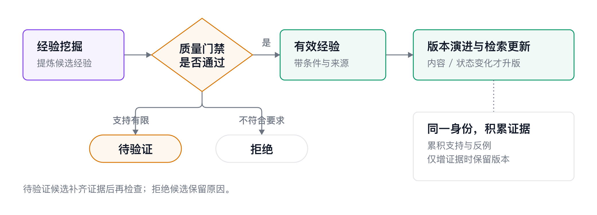

_图：经验随任务反馈修订；使用者重点检查内容、适用范围和来源，决定哪些方法进入试用。_

### 23.3 把经验接入 Agent，并亲自验证一次召回

经验库建好以后，需要让目标 Agent 在执行时读取它。Agent 观测与优化的经验召回页面提供安装、配置和验证指引。以支持 Skill 的研发或排障 Agent 为例，维护者可以按下面的路径完成接入。

1.  **安装召回 Skill。** 在目标 Agent 的项目中，使用页面给出的安装命令安装 `alibabacloud-agentloop-experience`，确认 Agent 能发现该 Skill。这里安装的是访问经验库的能力，具体经验会在运行时查询。
    
2.  **配置当前经验库。** 从该库的召回页面取得地址，配置 API Key 和召回开关。使用项目配置文件时，核对 Agent 实际工作目录及生效配置，避免连接到另一项目的经验库。
    
3.  **允许必要调用。** 按目标 Agent 的方式启用 Skill 及其所需工具权限。操作演示使用的 Agent 还需要 Skill 白名单和会话 Shell 权限；其他运行环境按自己的接入方式配置。
    
4.  **执行一次真实查询。** 选一条已经检查过的经验，用相关业务问题测试，并查看返回的内容与来源。成功返回后，再让 Agent 执行完整任务，观察它在哪一步使用了经验。
    

例如，经验库中已有“日志只包含重试时，向前寻找首次异常”的方法，可以向排障 Agent 描述当前故障、时间范围和已经看到的重试现象，并要求先检查是否有相关经验。验收时查看实际调用记录、召回结果，以及后续是否有针对性地寻找前置异常。Agent 口头说“参考了历史经验”，还需要对应真实调用和执行动作。

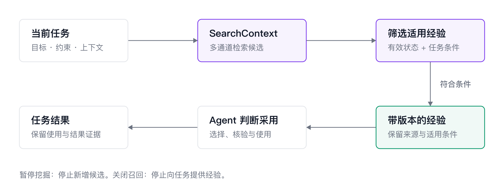

_图：目标 Agent 通过召回能力取得相关经验，再结合当前任务判断是否采用。_

接入遇到问题时，可按现象定位：没有发起查询，检查 Skill 是否启用、触发说明和工具权限；查询失败，检查地址、空间、库名和凭证；查询成功但为空，先确认库中有相关内容、查询表达和过滤范围合适；命中了经验却没有采用，检查返回内容是否进入上下文、前提是否适用。把这些情况分开，能避免反复调整阈值却没有解决接入问题。

一次真实任务查到了相关经验，并能看出它怎样影响行动后，就可以进入效果比较。

### 23.4 用实验决定召回多少、什么时候用

经验可能缩短探索，也会增加检索和阅读开销。对短任务来说，多查一次经验未必划算；对复杂排障来说，一条相关方法可能节省多轮试错。因此，召回策略需要根据业务实验选择。

先保留一组不使用经验的运行作为 Baseline，再用相同模型、工具和任务测试候选策略。操作演示采用更换 Session ID、重新发起同一请求的方式观察差别。正式比较时也应使用新会话，并重置任务依赖的状态，避免上一轮已经留下的答案、文件或操作结果让下一轮变容易。

第一轮可以从少量、明确相关的经验开始，再逐项调整：

| 可调整的因素 | 如何试用 | 如何判断是否合适 |
| --- | --- | --- |
| 召回阈值 | 比较更严格和更宽松的相关性要求 | 是否减少无关内容，是否漏掉本该有帮助的方法 |
| 返回数量 | 比较一条与少量多条经验 | 额外内容是否补充有效条件，还是增加阅读负担 |
| 触发时机 | 比较任务规划前查询、遇到相关失败后查询 | 是否在决策前提供帮助，是否出现每轮重复查询 |
| 放置位置与长度 | 调整当前任务、使用说明、经验的组织顺序；精简冗余描述 | 是否保留关键前提，Agent 是否正确理解并采用 |
| 使用要求 | 明确经验是历史参考，采用前检查当前条件 | 条件不符时能否放弃历史做法，继续调查 |

维护者在召回配置或 Agent 接入代码中调整这些因素。页面或演示里的参数用于开始测试，最终以本业务实验为准。

验收也要回到业务。排障任务看根因是否正确、证据是否完整、无效查询是否减少；代码任务看修改是否满足需求、测试是否有效；报告任务看数字和口径是否正确。再比较完整任务的耗时、Token、工具调用和费用，把召回开销也计入。运行有波动时重复测试，同时保留不需要经验的任务，检查是否增加无谓操作。决定采用前，再用未参与本轮挖掘的同类任务检查效果。

如果某条经验让 Agent 反复扩大范围、照搬历史参数，先缩小它的使用范围或在接入侧停止采用，保留出问题的任务作为反例。下一轮修改内容或召回策略后，再用同样任务验证。这样，团队调整的是具体使用方法，而不是笼统地判断“经验有没有用”。

### 23.5 把稳定方法变成 Skill、SQL、Script 与 Workflow

当一种做法已经足够稳定，团队可以把它直接整理成可使用的资产。经验便于按场景补充参考；Skill 适合表达任务方法；SQL 和 Script 适合承担重复计算；Workflow 适合推进固定步骤。它们可以组合使用。

以定期统计 Agent 失败率为例，业务人员先确认“任务”和“失败”的口径，维护者从已核对的成功轨迹中取出查询和检查过程，逐步整理成以下产物：

*   **SQL 模板**保留去重、计数和分组逻辑，把应用、时间范围等现场值改成参数；附上字段含义、时区、空结果解释和明细核对方式。下一次统计时，Agent 选择模板并填写参数。
    
*   **Script 或工具**封装分页读取、结果解析、去重和汇总等重复工作，接收短参数并返回结构化结果。维护者补齐依赖、错误提示和调用示例，Agent 就能复用经过检查的实现。
    
*   **Skill**说明何时使用这套统计方法、先确认什么口径、怎样选择模板、出现字段变化时如何处理，以及完成后怎样核对报告。
    
*   **Workflow**把“确认范围—执行统计—核对明细—生成报告”接成固定步骤，为空数据、查询失败和口径不匹配安排明确处理方式。
    

开始时不必一次交齐四种资产。若最大开销来自重复生成查询，先交付 SQL 模板；若问题是经常漏验收，先修 Skill；只有步骤和异常分支已稳定时，再接入 Workflow。团队可以让 Agent 根据轨迹起草这些内容，由熟悉业务和工具的人检查后放入项目仓库或现有资产管理系统。

采用前，换一组时间和应用参数执行，检查结果是否仍正确；加入空数据、重复记录和字段变化的样本，确认异常能够被发现。随后从一个新任务发起完整请求，检查 Agent 能否找到资产、选择合适入口并正确调用。文件已经生成，还要完成这一步使用验证。

这类调优让稳定部分少依赖临场生成，并把口径和验收方法分享给整个团队。资产的执行和发布，接入现有的开发与交付方式即可。

### 23.6 用失败样本推动 Skill 甚至 Harness 工程的改进

面对已确认的 Badcase，先写清楚“应该在哪一步采取什么行动”。Skill 维护者可以把原 Skill、实际失败轨迹、相邻成功任务和预期行为交给优化助手，生成局部修改建议。SkillForge 提供了依据轨迹诊断、生成补丁和候选的能力；使用者重点检查改动是否解决问题、是否保留原有有效方法，再把候选交给实验。

一个标准演示案例中，表格 Agent 向不存在的工作表写入，失败后才查询工作表列表，改用实际目标；另一次写入因为公式括号不完整而失败。由此可以提出三个具体修改：写入前确认目标工作表、提交前检查公式、完成后回读目标单元格。审查时能逐项对应执行证据，不需要把整份 Skill 重写成更长的通用注意事项。

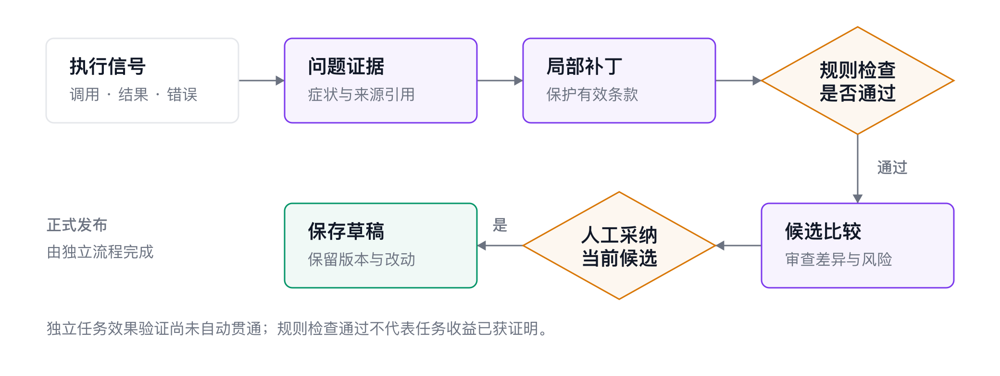

_图：将失败与成功轨迹交给优化助手，得到可比较的 Skill 修改建议；维护者选择候选并组织任务验证。_

代码团队也可以采用同样方法。若 Agent 经常改完代码就结束，先看它是否加载了对应 Skill，测试命令是否存在，测试环境是否可用。方法缺失时补上“执行相关测试并检查结果”；环境缺失时安排环境修复。新 Skill 用目标 Badcase、原本成功的任务和不应触发该 Skill 的任务一起检验，确认修复没有变成所有任务的额外负担。

有些问题则要由运行环境维护者处理。以“提交已经发生，但会话恢复后再次提交”为例，业务人员提供重复操作记录，Agent 开发者对照 Trace 找到中断位置，运行环境维护者修改恢复行为：区分尚未开始、已经开始但结果未知、已经完成；结果未知时先核对业务状态，再决定后续动作。这属于 Harness 改进，交付的是执行代码或配置。

这类改动需要有针对性的验收。在可控环境中分别模拟提交前中断、提交后结果尚未保存等情况，检查恢复后是否重复操作、最终业务状态是否正确。对长任务遗忘约束的问题，则选择真正会触发上下文压缩的任务，检查压缩后目标、关键限制和未完成事项是否仍被遵守。验证任务应触发原来的问题，才有理由采用修改。

### 23.7 从人工选择候选，到受控采用改进

团队可以按工作成熟度逐步增加自动化。业务目标与验收要求始终是起点，变化的是哪些重复工作交给系统完成。

| 工作方式 | 团队怎样开展 | 一轮结束时得到什么 |
| --- | --- | --- |
| 手动调优 | 专家挑选问题、查看轨迹，维护者改一条 Skill、一份查询或一处运行配置 | 一项具体修改和对应任务的验证结果 |
| 半自动调优 | 系统整理失败模式、挖掘经验或生成候选；人比较方案、安排实验、决定采用 | 经审查的候选、实验差异和采用范围 |
| 受控自动调优 | 对已规定范围的变更，由接入流程自动运行检查和实验，满足条件后采用，异常时交给负责人 | 按规则采用的改进，以及可检查的运行反馈 |

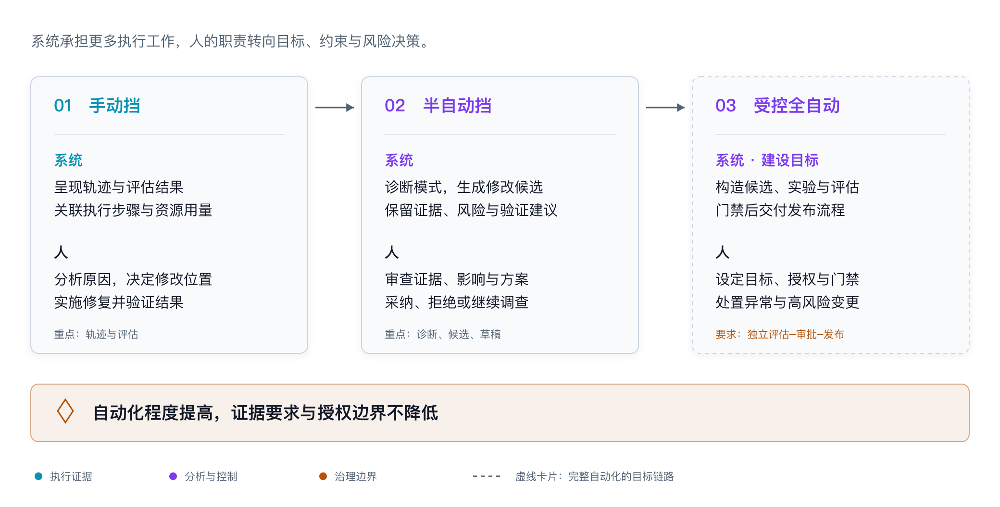

_图：自动化程度提高后，系统承担更多重复操作；业务目标、采用条件和异常处理仍需明确。_

经验挖掘与运行时召回可以先接起来；Skill 候选生成可以先交给维护者审查。跨资产的自动实验、生产发布和恢复，则由团队把已有能力接入自己的运行与交付系统。适合先自动化的，是高频、范围清楚、结果容易检查的动作。

每次决定采用时，负责人确认四件事：目标问题是否改善，原有任务是否退化，额外代价是否可接受，目标 Agent 是否实际使用了被验证的内容。记录原版本、候选差异、实验结果和采用范围，保留出现异常时恢复原配置的办法。经验召回出了问题，需要调整召回或采用设置；仅暂停挖掘不会停止旧经验继续影响任务。

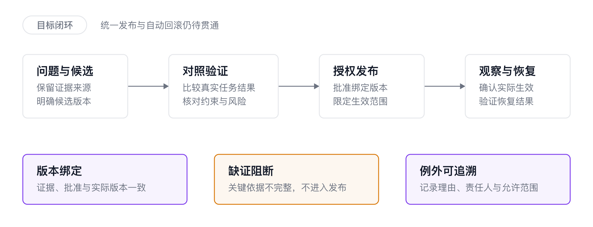

_图：问题、修改、实验和实际采用相互关联，方便团队判断效果，并在出现退化时定位和恢复。_

采用之后继续检查新任务，把有效方法留给下一次执行，把反例交回[Dataset](https://alidocs.dingtalk.com/i/nodes/MNDoBb60VLYDGNPytmE4edx4JlemrZQ3)和[评估实验](https://alidocs.dingtalk.com/i/nodes/lyQod3RxJKe9QjOMilKwQkvbWkb4Mw9r)。数据飞轮的价值，最终体现在任务更稳定地完成，以及团队能说明每一项改进为什么值得保留。


<a id="sec-036"></a>

## 第 24 章　Agent 边缘运行时与全球优化
Agent 在 Region 内通过评估、仿真和持续优化达到生产标准后，全球化部署带来了一个新的优化维度，即用户分布在全球各地，流量从边缘进入，威胁在边缘发起，内容需要在边缘适配。Region 内成熟的调优体系可以进一步延伸到这些场景，让优化能力从 Region 扩展到离用户最近的边缘。Agentic Application 的参考架构中，Runtime 组件覆盖了 Region 内的执行基础设施——计算资源、网络、存储和沙箱隔离。本章将 Runtime 延伸到全球边缘，引入边缘优化维度，覆盖从 Agent 到用户之间的最后一公里。本章所描述的边缘优化能力，由阿里云边缘安全加速（ESA）平台提供基础设施支撑——ESA 在全球运营 3200+ 边缘节点，覆盖主要国家和地区的用户接入，具备就近接入、边缘计算和安全防护的一体化能力，是将调优体系从 Region 延伸到边缘的天然载体。

### 24.1 全球化场景的边缘优化维度

#### 四个边缘优化方向

*   **延迟不对称：** Agent 端到端延迟可拆解为七个因素：排队、环境准备、模型推理、工具调用、网络传输、沙箱执行和人工等待。其中六个因素在 Region 内产生，只有网络传输由物理距离决定。一个部署在某个 Region 的 Agent，为跨洋用户提供推理服务时，网络传输在首 Token 延迟（TTFT）中的占比可能超过 40%（示例场景假设，需企业基线校准）——模型推理速度再快，也无法补偿这一物理瓶颈。边缘优化精准命中网络传输因素，在全球就近接入和传输加速两个层面补全端到端的延迟观测。
    
*   **成本不透明：** Agent 的 Token 成本、回源带宽成本和边缘请求成本分散在不同计费体系中。没有边缘层的统一计量和缓存优化，企业很难知道一次 Agent 调用的真实端到端成本，也无法通过语义缓存等手段降低重复推理的 Token 消耗。
    
*   **安全前置：** 红队测试和安全治理为 Agent 在 Region 内建立了完善的安全评估体系。边缘安全在此基础上进一步将防线前置——DDoS 攻击在边缘吸收清洗，Bot 爬虫在边缘识别拦截，Prompt Injection 在到达 Region 之前完成前置识别与初筛（间接注入等深层攻击仍需 Region 结合完整上下文检测），让安全从 Region 入口前移到网络边缘。
    
*   **内容适配：**工程化治理体系为 Prompt/Skill/Context 建立了完善的版本管理和发布流程。边缘内容分发在此基础上进一步优化——Agent 消费的大量 Web 外部内容，在边缘节点完成 HTML 转 Markdown 等格式转换（ESA 已发布能力），让 Agent 以原 URL 直接取到可消费形态，减少二次处理的延迟和 Token 消耗。
    

#### 中心云调优与边缘调优的分工

Region 级调优与边缘调优解决不同层次的问题，两者分层协作：

| 维度 | Region 级调优 | 边缘调优（本章） |
| --- | --- | --- |
| 正确性 | Agent 的任务是否完成、结果是否正确 | — |
| 延迟 | 模型推理延迟、工具调用延迟 | 网络传输延迟、全球就近接入 |
| 成本 | Token 单价、模型路由成本 | 重复推理的缓存、回源带宽 |
| 安全 | Agent 行为安全、数据访问控制 | 请求到达 Region 之前的威胁拦截 |
| 内容 | Prompt/Skill/Context 的版本管理 | 外部内容的边缘转换与分发 |
| 体验 | 任务完成度、结果质量 | 全球一致性体验、区域化适配 |

分工原则是：边缘能处理的（缓存命中、安全拦截、就近路由），就不回源 Region；边缘处理不了的（复杂推理、状态变更、长任务执行），才进入 Region。判断“能处理”不能只看计算能力，还要看事实权威、身份与权限、写副作用、数据驻留和故障恢复语义，只有无需权威状态判定、无需写副作用、且符合数据驻留要求的请求才适合在边缘就地完成；涉及一致性、顺序和恢复语义的操作必须回到 Region 执行。

### 24.2 边缘评估：衡量 Agent 的全球交付质量

评估体系在 Region 内已建立了完善的框架：回答质量评估、轨迹评估、工具评估、任务状态验证。边缘评估在此基础上进一步扩展——将全球用户的实际交付质量纳入评估体系。同一个 Agent 为东京用户提供服务的 TTFT 可能是 200ms，为圣保罗用户可能是 1200ms（示例场景假设，需企业基线校准），这种全球体验差异需要边缘维度的评估指标来衡量。

#### 边缘评估指标体系

边缘评估指标从四个维度扩展 Region 内的评估体系。**性能维度**关注全球各区域的 TTFT（P50/P95/P99）、边缘到 Region 的传输延迟和长连接建立时间——这是延迟指标在空间维度上的直接延伸。**成本维度**追踪端到端调用成本（Token + 带宽 + 边缘请求费用）、语义缓存节省量和回源流量占比，让企业对每次 Agent 调用的真实全链路成本有完整认知。**安全维度**衡量边缘拦截率、DDoS 吸收量、Prompt Injection 检出率和 Bot 识别准确率，反映安全防线前置的效果。**体验维度**通过区域体验一致性评分、流式输出完整性和断连恢复成功率，衡量全球用户的体验均等程度。

#### 边缘评估数据回流

边缘评估产生的指标数据通过统一的数据管道回流到 Region 内的评估体系中，与 Region 内的评估数据合并，形成 Agent 的"全球交付质量报告"。Agent Release 的准入基线应同时包含 Region 内指标和边缘指标——一个版本如果在全球 P95 延迟上未达标，即使 Region 内评估全部通过，也不应被发布。

### 24.3 边缘性能与成本优化

#### 全球就近接入与智能路由

ESA 的全球 Anycast 接入使用户请求被路由到最近的边缘节点，减少首跳延迟。ESA 边缘节点之间通过骨干网互联，智能路由算法根据实时网络状况选择最优路径。对于 Agent 场景，长连接优化（连接池复用、首窗参数调优）和缓冲策略（异步路由、流式转发）对降低 TTFT 尤其重要。当 Agent 系统部署在多个 Region 时，边缘网关根据延迟、成本、合规和当前负载动态选择目标 Region。

#### AI 推理传输优化

Agent 的推理请求具有长连接、流式输出、大 Payload 的特征。边缘节点在四个层面做定向优化：协议栈首窗与区域化参数调优、长连接池复用、缓冲与异步路由减少回源等待、DSCP（差异化服务代码点，用于 IP 报文优先级标记）专线选路保障高优先级流量的传输质量。

#### 语义缓存与回源卸载

Agent 的大量请求具有语义相似性——不同用户问相似的问题，同一用户在不同时间重复相似的查询。语义缓存在边缘节点存储已有推理结果的摘要和答案，当新请求与缓存项的语义相似度超过阈值时直接返回缓存结果，节省 Token 消耗。语义缓存应限定在公开、幂等、低风险请求范围内，并把租户、权限域、地区、模型、Prompt 和知识版本纳入缓存键，定义 TTL（生存时间）、失效、来源标记和回源策略，避免跨租户泄露、越权、版本陈旧和个性化答案误命中。高频查询场景下，边缘缓存可以显著卸载回源流量，对应可观的 Token 成本节省。

**成本评估指标：** Token 节省量（缓存命中节省的 Token 数）、回源带宽减少比例、端到端调用成本变化、缓存命中率随时间的变化趋势。

### 24.4 边缘数据驱动持续优化

Agent 上线后，全球用户的真实使用过程是持续优化的重要数据来源。

ESA 边缘节点位于用户访问的第一跳，能够直接观察用户所在区域、网络状况、访问时延、缓存命中情况和安全风险。这些边缘观测数据为 Agent 平台的持续优化提供了真实、全球分布的信号来源——Region 内的运行日志记录了模型生成了什么、调用了哪个工具、返回了什么结果，边缘数据则补充了请求发生时的外部环境。将两类数据结合，Agent 平台不仅能看到问题，还能判断问题更可能来自模型指令（Prompt）、工具能力（Skill）、网络路由、缓存还是安全策略。

#### 边缘数据为优化提供什么

ESA 边缘节点能够持续采集全球各区域的运行数据，供 Agent 平台用于发现优化机会。同一个 Agent 在不同区域、网络和用户群体中，可能呈现完全不同的运行效果。边缘数据将这些差异暴露出来，帮助 Agent 平台识别重复出现的问题模式。

| 从边缘数据中观察到的现象 | 可能说明的问题 | Agent 平台可以采取的优化 |
| --- | --- | --- |
| 某些区域响应明显更慢 | 当前服务节点并非当地最优选择 | 调整模型与服务路由 |
| 某个工具只在部分区域频繁超时 | 工具可达性或网络链路存在区域差异 | 调整工具路由、超时和重试策略 |
| 缓存命中率在某些区域明显偏低 | 缓存策略与该区域请求模式不匹配 | 调整缓存键和 TTL 策略 |
| 新型安全威胁在多个节点被拦截 | 攻击方式发生变化，防护规则需要更新 | 更新安全策略和拦截规则 |
| 回源流量占比持续偏高 | 缓存策略或路由配置未有效卸载流量 | 调整缓存策略和回源规则 |

这些现象单独看只是运行记录，经过聚合与关联分析后，才会成为优化依据。例如，某个工具在多个区域都失败，问题可能出在 Skill 本身；如果只在一个区域失败，更可能是网络或服务路由问题。前者需要修改 Skill，后者则应调整运行编排层（Harness）中的路由策略。边缘数据帮助 Agent 平台避免"看到失败就修改 Prompt"这类错误归因。

#### 优化闭环中 ESA 与 Agent 平台的职责分工

受控自进化闭环（记录、分析、修改、验证、回流）由 Agent 平台和团队共同完成，ESA 的角色是提供边缘观测数据：

**ESA 提供：**

边缘 Trace 数据：请求时延、缓存命中、安全拦截等基础设施层观测

全球区域维度的差异化数据：不同区域的延迟分布、网络状况、威胁模式

版本管理与灰度发布：支持 Agent 平台在边缘侧受控验证新策略

**Agent 平台完成：**

分析：将边缘 Trace 与 Region 内的模型输出、工具调用结果、任务完成情况关联分析，判断问题来自哪个环节

修改：由团队基于分析结果生成优化策略，例如修改 Prompt、更新 Skill、调整模型路由或缓存策略

验证：在小范围内灰度验证 Patch 效果，观察任务成功率、响应质量、时延、成本和安全指标

回流：验证结果进入下一轮优化，形成持续改进闭环

以区域性工具超时为例：ESA 边缘数据发现某一区域的工具调用失败明显增多；Agent 平台将其与其他区域对比，确认模型和 Skill 本身没有变化，问题集中在网络链路；Agent 平台据此生成路由策略 Patch，利用 ESA 版本管理的灰度环境在该区域的小部分流量中验证，通过调用成功率和时延判断是否改善，再决定是否扩大范围。

这里的"自进化"由平台辅助数据分析，团队生成候选策略，并经过规则校验、人工审核或自动化评测后再灰度发布。原始数据还需遵循最小化采集、匿名化、访问控制和跨区域合规要求，确保优化能力建立在可治理的数据使用之上。

#### 从统一能力走向全球差异化优化

不同区域的网络质量、可用模型、工具服务、用户习惯、安全风险和合规要求各不相同，统一配置虽然便于管理，却很难在所有区域同时获得最优效果。

更合理的方式是采用"全球统一基线 + 区域自适应策略"。Prompt、核心 Skill 和基础安全规则由全球统一治理，保证 Agent 的基本能力和行为一致；模型路由、服务节点、缓存、安全规则和工具调用策略，则可以根据各区域的真实流量进行调整。

ESA 边缘节点持续提供各区域的运行数据，Agent 平台辅助团队完成跨区域比较、问题定位和优化方向判断。这样既能避免各区域独立演进造成能力割裂，也能让 Agent 适应不同市场的实际运行环境。

### 24.5 边缘内容分发：让 Skill/Context 到达全球边缘

工程化治理在 Region 内已建立了 Prompt/Skill/Context 的版本管理、变更评审和发布流程。在此基础上，边缘内容分发进一步解决全球化场景下的分发问题——当 Agent 在全球多个 Region 或边缘节点运行时，能力资产的版本需要在所有执行点保持一致。如果一个边缘节点运行的是 Skill v1.2 而 Region 内已经是 v1.3，就会产生行为不一致和评估偏差。

#### 边缘版本同步与就近读取

Prompt/Skill/Context 发布后，通过全球分发机制同步到各边缘执行点（企业自建能力，可基于 ESA 边缘计算实现）。Agent 在边缘执行时就近读取这些资产，减少回源延迟。版本同步需要与变更评审流程联动——每次 Skill 发布触发边缘缓存刷新，并通过版本钉扎和激活协议明确各执行点当前生效的版本，避免并发写和断网降级下的版本漂移。

#### 区域适配

不同地区的 Agent 可能需要差异化的 Context 策略——语言偏好、合规要求、本地化知识库因地域而异。这里需要区分两种“一致性”：治理规则全球一致（版本管理、变更评审、发布流程统一），数据分布按驻留要求差异化（分类分级、脱敏、授权、驻留、保留和删除机制按区域合规执行）。边缘分发支持按区域配置 Context 变体，在统一治理规则的基础上实现区域化适配。

#### Agent 友好内容转换

Agent 需要消费大量 Web 内容作为上下文。传统边缘网络以原始 HTML 形态回送内容，Agent 拿到后还需要解析和结构化。边缘节点在内容送达 Agent 之前完成格式转换——HTML 转 Markdown 是 ESA 已发布能力，摘要生成和向量化索引可作为企业参考实现——Agent 以原 URL 直接取到可消费形态，减少二次处理延迟和 Token 消耗。

#### WebMCP：网站即 MCP Server

WebMCP 是一项处于早期提案和浏览器试验阶段的技术，让网站可以主动向 Agent 暴露可调用的 MCP 工具：网站通过 JavaScript API 或声明式 HTML 注册工具，Agent 不再需要视觉解析网页，而是通过结构化接口直接调用网站功能。人工确认是其中一种可用的授权机制，但并非所有支付、删除操作的统一强制规范。该技术尚属实验性，本节仅作前瞻性介绍。

WebMCP 的核心价值在于重新定义 Agent 与 Web 的交互方式——从视觉解析转向结构化调用，降低 Agent 获取 Web 内容的成本和延迟。

### 24.6 边缘安全：请求到达 Region 之前的第一道防线

前文的安全治理为 Agent 建立了全栈安全保护框架，覆盖应用安全、模型安全、数据安全、身份安全和系统网络安全五个层面，采用纵深防御策略。ESA 的边缘安全能力在此基础上将纵深防御的多道防线推进到网络边缘——DDoS 攻击在边缘吸收清洗，避免流量到达 Region 时才消耗带宽；Bot 爬虫在边缘识别拦截，减少无效请求的回源开销；模型安全层面的 Prompt Injection 防护也被前置到边缘 AI 护栏中，在语义攻击到达 Region 之前完成前置识别与初筛。边缘只能覆盖直接注入，检索内容、工具返回等间接注入仍需 Region 结合完整上下文执行检测与审计。

#### 纵深安全的前置

边缘节点完成三层安全过滤：

*   **网络层**：DDoS 流量在边缘吸收清洗，只有合法流量进入回源链路
    
*   **应用层**：WAF（Web 应用防火墙）/Bot 管理识别传统 Web 攻击（SQL 注入、XSS 跨站脚本）和恶意爬虫
    
*   **语义层**：AI 护栏检测 Prompt Injection、越狱尝试、不合规内容、敏感数据泄露
    

AI 护栏与 WAF 的职责不同：WAF 侧重已知签名与规则的请求层攻击防护，AI 护栏侧重模型交互层面的攻击检测（“忽略之前的指令”、间接注入、角色扮演越狱）。两者在边缘协同运行，但边缘只能完成前置初筛，深层检测在 Region 完成。

#### AI 爬虫管理

当网站的访问者从人类扩展到 AI Agent，ESA 提供 AI 爬虫生命周期管理：AI 爬虫管理（支持识别、观察和拦截 AI 爬虫）→ AI Bot Auth（身份认证，区分合法 Agent 和恶意爬虫）→ AI Crawl Control（精细管控，允许/限制/拒绝特定 Agent 的访问）→ Pay Per Crawl（将 AI 访问转化为客户的收益流）。这是 Agent 时代的新型商业模式。

#### 边缘安全与 Region 安全的分层协作

边缘安全负责"过滤"（拦截已知威胁、吸收攻击流量），Region 内安全负责"判断"（复杂的权限校验、行为分析、审计追踪）。两者通过安全事件共享联动——边缘拦截的攻击模式同步到 Region 内的安全策略引擎，Region 内发现的新型威胁规则下发到边缘节点。

### 24.7 边缘生产验证：用真实全球流量验证 Agent 行为

仿真体系在 Region 内已建立了完整的框架，包含 Scenario Spec（场景定义规范）、User Simulation（用户行为模拟）、Environment Simulation（工具和网络环境模拟）和 Model Provider Replay（模型输出回放）四种核心仿真能力。仿真的本质是用合成数据测试 Agent 在假设场景下的行为，覆盖真实流量难以触达的边界和长尾场景。

ESA 边缘节点提供了与仿真互补的另一种验证路径：用真实全球流量观察 Agent 上线后的实际表现。仿真回答的是"如果发生 X，Agent 会怎样"；边缘生产验证回答的是"全球真实用户实际发生了什么，Agent 表现如何"。两者共同构成 Agent 版本发布前后的完整验证闭环——仿真负责上线前的合成测试，边缘生产验证负责上线后的真实观测。

#### 边缘真实流量的观测能力

ESA 边缘节点位于用户访问的第一跳，能够直接观察全球各区域的真实运行情况：

**请求分布：**地域占比、高峰时段、请求路径偏好，反映全球用户实际使用模式

**网络状况：**端到端延迟、丢包率、连接中断频率和长连接稳定性，反映各区域真实网络环境

**安全态势：**DDoS 攻击模式、Bot 爬虫行为、Prompt Injection 实际检出情况，反映真实威胁分布

**缓存效果：**语义缓存命中率、回源流量占比，反映缓存策略在真实流量下的实际效果

ESA 边缘节点记录的是全球真实用户在生产环境中的实际表现。例如，边缘节点能观察到东南亚区域实际有多少用户遇到了网络中断、恢复策略实际表现如何、缓存命中率是否达到预期。

#### 边缘生产验证与仿真的互补关系

边缘生产验证与仿真在验证 Agent 行为时各有侧重：

| 维度 | 仿真（上线前） | 边缘生产验证（上线后） |
| --- | --- | --- |
| 数据来源 | 合成场景、模拟用户 | 全球真实用户请求 |
| 覆盖范围 | 边界和长尾场景 | 主流场景和真实分布 |
| 网络条件 | 模拟的延迟/丢包参数 | 各区域实际网络状况 |
| 安全威胁 | 红队构造的攻击样本 | 真实攻击流量和模式 |
| 验证目的 | Agent 是否能应对假设场景 | Agent 在真实环境中表现如何 |

两者互补的典型场景：仿真验证 Agent 能处理 3 秒超时的弱网场景后，版本发布上线；边缘生产验证发现东南亚区域实际有 5% 的请求遭遇超过 5 秒的延迟，导致 Agent 流式输出中断率高于预期。此时可以回到仿真体系，用边缘观测到的真实网络参数补充新的测试场景，形成"仿真 → 上线 → 边缘验证 → 回流仿真"的闭环。

#### 边缘灰度发布与版本管理

ESA 提供站点级版本管理能力，支持开发、灰度、生产三套环境。每个版本基于现有配置克隆生成，可以先在开发环境测试，再提升到灰度环境按请求规则导入部分流量验证，最终提升到生产环境全量生效。版本支持切换和回滚，异常时可以快速回退到上一版本。

这一能力使边缘生产验证不仅限于观测，还能在真实流量上执行受控的版本验证。新版本的缓存规则、安全策略或路由配置先在灰度环境对部分真实流量生效，边缘节点持续观察任务成功率、响应时延、缓存命中率和安全拦截率等指标。验证通过后提升到生产环境全量发布；如果指标异常，直接回滚到上一版本。整个过程中，真实流量既是验证对象，也是真实流量既是验证对象，也是 Agent 平台判断版本是否达到发布标准的依据。

#### 验证结果的边缘-Region 联合评估

Agent 版本发布的准入基线应同时包含 Region 内指标（回答正确率、任务完成率）和边缘指标（全球延迟分布、缓存命中率、安全拦截率）。一个版本如果在全球 P95 延迟或边缘缓存命中率上未达标，即使 Region 内仿真全部通过，也不应被发布。Agent 平台基于这些数据判断版本是否达到发布标准。边缘生产验证将发布准入从 Region 内扩展到全球维度。

### 24.8 三阶段演进与企业成熟度模型

企业不需要从第一天就建设完整的边缘优化体系。根据 Agent 业务的全球化程度和边缘能力成熟度，可以分为三个阶段渐进演进。

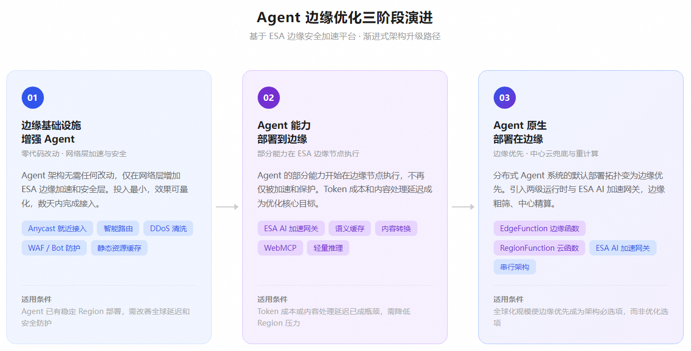

图24-1 Agent 边缘优化三阶段演进

#### 阶段一：边缘基础设施增强 Agent

最小侵入的优化阶段。Agent 的业务代码基本不变，只需调整网络接入配置，在网络层增加一个 ESA 边缘加速和安全层。这是大多数企业应该首先考虑的阶段——投入最小，效果可量化。

具体能力包括：Anycast 就近接入（用户请求自动路由到最近的边缘节点）、智能路由（边缘节点之间通过骨干网互联，根据实时网络状况选择最优回源路径）、DDoS 清洗（攻击流量在边缘吸收，只有合法流量进入回源链路）、WAF/Bot 防护（SQL 注入、XSS、恶意爬虫在边缘拦截）、静态资源缓存和 SSL 卸载。

实施路径通常分四步：ESA 接入与 DNS 切换→全球基线延迟测量→重点区域效果验证→全球生效。整个过程通常只需数天（示例评估，实际周期取决于企业现有架构与配置复杂度），不影响 Agent 的任何业务逻辑。

适用条件：Agent 已有稳定的 Region 部署，需要改善全球延迟和安全防护，但不想改动应用架构。

评估指标：全球 P50/P95 延迟改善比例、边缘安全拦截率、回源带宽减少量。

#### 阶段二：Agent 能力部署到边缘

部分 Agent 能力开始在 ESA 边缘节点执行，而不仅仅是被加速和保护。具体能力包括：ESA AI 加速网关（已发布，语义缓存、模型路由、Token 计量在边缘完成，具体命中策略为企业参考实现）、Agent 友好内容转换（HTML→Markdown、向量化等为企业参考实现）、WebMCP（实验性技术）、轻量推理（边缘节点运行小型模型完成预处理或分类）。

适用条件：Agent 的 Token 成本或内容处理延迟已成为瓶颈，需要通过边缘缓存和预处理降低 Region 压力。

评估指标：语义缓存命中率、Token 节省量、内容转换延迟、边缘处理的请求占比。

#### 阶段三：Agent 原生部署在边缘

终态愿景。分布式 Agent 系统的默认部署拓扑是边缘优先，中心云做兜底和重计算。这个阶段的核心架构变化是引入 Agent 两级运行时和边缘 AI 加速网关，从调优视角重构 Agent 的全球执行拓扑。

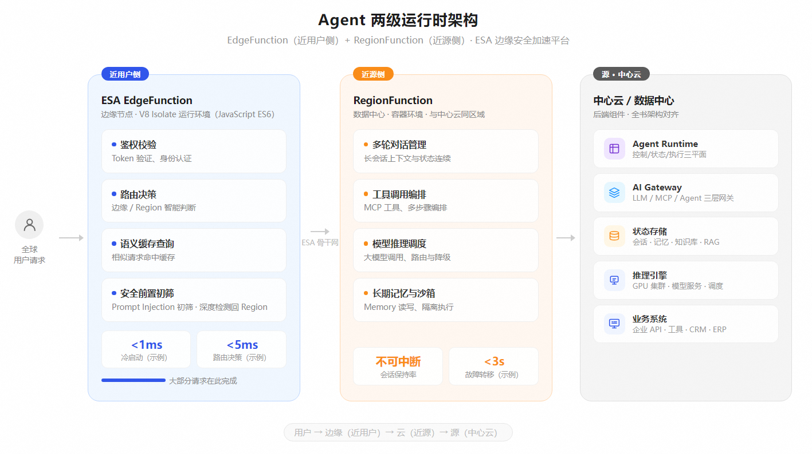

图24-2 Agent 两级运行时架构（本书参考架构与愿景设计）

**Agent 两级运行时：ESA EdgeFunction + RegionFunction。**

Agent Runtime 的三平面架构（控制/状态/执行）为边缘部署提供了基础，分布式部署进一步解决了 Agent 从单机走向多 Region 的问题——部署拓扑从单 Region 集中式演进到多 Region 主备，再到多 Region 多活。阶段三在此基础上迈出下一步：从“多 Region”演进到“边缘优先”。“逻辑单例、物理可替换”原则和状态外置设计天然适配边缘架构——边缘函数是轻量化的执行实例，云函数是完整的逻辑单例，两者通过状态外置保持行为一致。状态外置需要配套权威源、版本钉扎、激活协议、并发写控制、断网降级和回滚规则，才能保证边缘与 Region 行为真正一致。

*   **EdgeFunction（边缘函数，近用户侧部署）**：由 ESA 边缘计算平台承载，部署在离用户最近的边缘节点上，处理对延迟敏感的前置逻辑——鉴权校验、路由决策、请求改写、缓存查询、安全过滤。ESA 边缘函数基于 V8 Isolate 的 JavaScript 运行环境（当前支持 JavaScript ES6），提供轻量级进程隔离，用户请求在“第一跳”即可完成处理，无需跨越网络回到数据中心。
    

*   **RegionFunction（云函数，近源侧部署）**：部署在离源站更近的 ESA 节点中，处理需要持久状态和深度计算的 Agent 逻辑——多轮对话上下文管理、工具调用编排、模型推理调度、长期记忆读写、沙箱隔离执行。云函数紧邻模型服务、数据库和业务系统，适合对计算资源和数据访问要求更高的重型任务。
    

两级架构的核心思路是：**不是所有 Agent 请求都需要回到数据中心处理。** 以一个典型的客服 Agent 为例，大量请求可以通过边缘缓存命中、简单路由或轻量预处理在用户侧就近完成，只有涉及复杂推理和深度工具调用的请求才需要进入数据中心。两级运行时让大部分请求在边缘完成，大幅降低全球用户的端到端延迟，同时减少数据中心侧的计算压力。

以一个具体场景说明两级架构的运行方式。一位西班牙语用户向客服 Agent 询问退货政策，请求到达最近的边缘节点（马德里）。EdgeFunction 首先完成鉴权和请求预处理，然后在语义缓存中查找——该用户所在地区此前已有多次类似查询，缓存命中，边缘直接返回已缓存的退货政策摘要，整个过程延迟不到 50ms（示例场景假设，需企业基线校准）。如果用户追问一个从未出现过的复杂问题（缓存未命中），EdgeFunction 将请求连同预处理结果一起转发到数据中心的 RegionFunction，由后者完成完整的多轮推理、工具调用和订单查询，结果再写回边缘缓存供后续相似查询使用。

**两级运行时的关键调优指标：**

| 指标 | 含义 | 优化目标 |
| --- | --- | --- |
| 边缘处理比例 | 在 EdgeFunction 层完成的请求占比 | 按任务风险与业务 SLO 设置目标，正确性优先，而非单一最大化 |
| EdgeFunction 冷启动时间 | 边缘函数从加载到可执行的时间 | <1ms（示例目标） |
| 路由决策延迟 | EdgeFunction 判断请求走边缘还是 Region 的时间 | <5ms（示例目标） |
| RegionFunction 会话保持率 | 长会话 Agent 在 Region 内的状态连续性 | 不可中断 |
| 边缘-Region 故障转移时间 | 边缘节点不可用时切换到 Region 或相邻边缘的时间 | <3s（示例目标） |

以上指标为架构示例目标，并非 ESA 产品现状指标，企业应根据自身基线和压测结果校准。

**ESA AI 加速网关：面向 AI 流量的边缘网关。**

ESA AI 加速网关是基于边缘接入特性构建的 AI 网关，与中心 AI 网关的定位和目标场景不同。本质上，这是部署差异带来的使用特性区别：中心 AI 网关部署在 Region 内，ESA AI 加速网关则部署在遍布全球的边缘节点上。基于 ESA 的边缘特征，AI 加速网关更多用于全球服务的业务场景——AI 流量从离用户最近的边缘节点进入并就地完成治理。

ESA AI 加速网关提供了在边缘的独特能力：

| 处理环节 | 能力 |
| --- | --- |
| 缓存 | 语义缓存：相似请求的边缘命中，节省 Token |
| 传输 | 长连接加速：协议栈调优、流式转发、首窗优化 |
| 内容 | HTML→Markdown 转换：大幅减少 Agent 消费 Web 内容时的 Token 消耗 |
| 计量 | 边缘 Token 预估和请求计数 |
| 过滤 | AI 护栏前置过滤：拦截明显违规请求 |
| 调度 | 高 QPS（每秒请求数）调度：边缘层吸收流量峰值 |

边缘 AI 加速网关的独特价值来自边缘接入的位置特性：请求在第一跳完成缓存查询、格式转换、传输优化与安全过滤，缓存命中直接返回，未命中再回源 Region，全球用户都能获得一致的低延迟体验。能力边界也需要明确：语义缓存只覆盖公开、幂等、低风险请求，涉及写副作用和权威状态的请求仍需回到 Region 内执行，以保证正确性与一致性。

ESA AI 加速网关的关键调优指标： Token 节省率（HTML→MD 转换 + 语义缓存的综合效果）、边缘缓存命中率、长连接加速带来的 TTFT 改善、边缘过滤拦截率（违规请求在回源之前被拦截的比例）。

**阶段三的适用条件和评估体系：**

适用条件：Agent 的全球化规模和延迟要求使得边缘优先成为架构必选项，而非优化选项。典型信号包括：需要为每个区域独立部署完整 Agent 系统且运维成本不可控、全球 TTFT 中网络传输占比超过 30%（示例场景假设，需企业基线校准）、Token 成本随用户增长线性上升且无有效缓存手段。

评估指标：边缘处理的 Agent 请求占比、全球 Agent 可用性（SLA，服务等级协议）、边缘-Region 故障转移成功率、端到端 TTFT 改善幅度、Token 成本节省率。

三个阶段的关系与"选择最低充分架构"原则一致——边缘优化同样不追求最高阶段，而是根据业务的全球化程度选择成本与收益最优的阶段。大多数企业长期停留在阶段一或阶段二即可获得显著收益，只有全球化规模达到一定量级后，阶段三才成为架构必选项。

#### 企业边缘优化成熟度模型（本书归纳，供企业自评参考）

| 成熟度 | 边缘优化能力 | 与调优体系的集成度 | 典型表现 |
| --- | --- | --- | --- |
| L1 | 无边缘优化，Agent 直连 Region | 无 | 全球延迟差异大，安全依赖 Region 内防护 |
| L2 | 接入边缘加速与安全，独立看板 | 未进入评估闭环 | 延迟改善但无法量化 ROI（投资回报率），安全规则手动维护 |
| L3 | 边缘指标纳入 Agent Release 准入基线 | 评估闭环（与评估体系衔接） | 版本发布需通过边缘性能回归，缓存策略与 Agent 版本绑定 |
| L4 | 边缘数据驱动自进化 | 全自动闭环（与自进化闭环衔接） | 缓存/路由/安全策略根据边缘 Trace 自动优化，经灰度验证后生效 |

成熟度不是越高越好。L1 适合仅在单一区域运营的企业；L2 适合全球化初期；L3 适合 Agent 进入生产后需要严格质量门禁的阶段；L4 适合大规模全球化运营。这一模型在演进方向上与部署成熟度模型（M1-M5）大致呼应——边缘优化是部署成熟度演进到高级阶段后的自然需求——但两者并不存在一一对应的映射关系，每级能力应有可验证的门槛，而非仅凭定性描述。

**企业如何判断自己处于哪个阶段：**

| 信号 | 阶段判断 |
| --- | --- |
| 全球用户抱怨延迟高，但 Region 内指标正常 | 需要阶段一 |
| Token 成本随用户增长线性上升，无明显缓存效果 | 需要阶段二 |
| 需要为每个区域独立部署完整 Agent 系统，运维成本不可控 | 需要阶段三 |
| 当前只在单一 Region 运行，用户主要在同一区域 | 暂不需要边缘优化 |

### 24.9 能力状态、边界与企业决策

本章涉及的技术与产品能力处于不同成熟阶段，统一标注如下。

#### 能力状态矩阵

| 能力 | 状态 | 说明 |
| --- | --- | --- |
| Anycast 就近接入、智能路由 | ESA 已发布 | 用户请求路由到最近边缘节点，按实时网络状况选路 |
| 边缘节点骨干网互联、DSCP 专线选路 | ESA 已发布 | 保障回源与高优先级流量的传输质量 |
| DDoS 清洗、WAF/Bot 防护 | ESA 已发布 | 攻击流量在边缘吸收，传统 Web 攻击边缘拦截 |
| AI 护栏前置过滤 | ESA 已发布 | 边缘完成直接注入的前置识别与初筛，深层检测在 Region |
| HTML→Markdown 转换 | ESA 已发布 | 减少 Agent 消费 Web 内容的 Token 消耗 |
| AI 爬虫管理 | ESA 已发布 | 识别、观察和拦截 AI 爬虫 |
| AI Bot Auth、AI Crawl Control、Pay Per Crawl | ESA 已发布 | AI 爬虫生命周期管理的后续能力 |
| Agent 两级运行时 | 本书参考架构与愿景设计 | 非 ESA 产品现状 |
| 语义缓存命中策略与缓存键设计 | 企业参考实现 | ESA AI 网关提供基础缓存能力，本章的缓存键、TTL 与回源策略为设计建议 |
| WebMCP | 实验性技术 | 试验阶段 |
| 版本管理与灰度发布 | ESA 已发布 | 边缘生产验证 |

#### 边缘优化的限制与不适用场景

边缘优化并非适用所有业务，以下场景需要审慎评估。

单区域业务。用户集中在同一区域、与 Region 物理距离近的企业，边缘优化带来的延迟收益有限，投入可能不成比例。

严格数据驻留要求。不允许跨区域缓存复制或要求数据不出特定司法辖区的场景，语义缓存与全球分发需要按区域合规配置，甚至放弃边缘缓存。

高正确性风险的回答。个性化强、权限敏感、时效性高的内容不应进入语义缓存，否则可能造成错误答案误命中。

边缘算力受限。复杂推理、长任务、大上下文处理仍需回源，边缘只承担预处理和粗筛。

区域能力差异。不同区域的边缘节点能力、可用模型和合规要求不同，全球统一策略需要按区域适配，无法一刀切。

成本反转。流量规模小或缓存命中率低时，边缘层的额外成本可能超过收益，此时阶段一甚至“不优化”才是正确选择。

#### 企业决策建议

企业应基于自身全球化程度、数据驻留要求、请求分布和成本结构，选择阶段一、阶段二或阶段三，并设定与业务 SLO 匹配的指标目标。本章出现的所有性能数字均为示例场景假设或架构示例目标，正式实施前必须由企业基线和压测校准。

### 24.10 本章小结

调优篇在 Region 内构建了从评估、自进化、工程化治理、安全到仿真的完整优化闭环。当 Agent 的用户从单一区域扩展到全球，这个闭环需要进一步在空间维度上延伸——让 Region 内已经成熟的调优能力覆盖到边缘，到达离用户最近的位置。

边缘优化是现有调优框架在空间维度上的延伸——评估体系扩展到边缘交付质量，自进化闭环扩展到边缘流量信号，工程化治理扩展到边缘分发，安全评估扩展到边缘攻击面，边缘生产验证补充仿真覆盖。ESA 边缘安全加速平台提供了执行这些延伸的基础设施能力，让调优从 Region 走到用户端，补全了调优体系的最后一公里。

从 Region 到 Edge 的优化是一个渐进过程：先用 ESA 边缘基础设施增强 Agent（阶段一），再将部分能力部署到 ESA 边缘（阶段二），最终通过 Agent 两级运行时（ESA EdgeFunction + RegionFunction）和 ESA AI 加速网关让 Agent 原生运行在边缘（阶段三）。阶段三的核心洞察是：大多数 Agent 请求并不需要完整的 Region 级计算资源，边缘处理、按需回源的架构可以在不改变 Agent 核心逻辑的前提下，系统性地改善全球用户的延迟、成本和体验。每个阶段都有对应的评估指标和成熟度标准，企业应根据自身的全球化程度选择适当阶段，在生产数据的驱动下持续演进。

从更大的视角看，边缘优先的部署拓扑也是结语中"Agentic OS"愿景的基础设施支撑——当 Agent 从单一应用走向操作系统级的协作生态，边缘层将成为 Agent 间通信、能力发现和任务调度的关键基础设施。Runtime 从 Region 延伸到边缘，是 Agentic Application 走向 Agentic OS 的必经之路。

**从 Region 到 Edge，Agent 的运行时延伸到全球每一个角落。**


<a id="sec-037"></a>

# 实践篇


<a id="sec-038"></a>

## 实践篇导读
覆盖研发效能、设计工程、运维安全与企业 IT 、客服销售与运营等领域，同时我们把世界人工智能开源大赛中的优秀作品也纳入进来，既有企业实践，也有来自开发者的前沿探索。

其中，研发效能共计7个案例，覆盖了阿里云在代码审查、代码缺陷修复、研发协作等多个领域，同时包含了将 Agent 产品化过程中的一些思考。设计工程共计计2个案例，全面介绍了阿里云在Vibe Designing、GenUI 方面的思考和实践。运维安全与企业 IT 共计3个案例，介绍了畅捷通、吉利汽车、塔斯汀在大规模生产业务在智能运维方面的实践。客服销售与运营共计3个案例，介绍了MiniMax 和 B 站构建上下文和记忆的实践，会计师事务所信永中和办公提效方面的探索，以及阿里云在智能问数领域的实践。

此外，2026 年 GOAI 世界人工智能开源大赛 Agent Infra 新智基座赛道提供了9个作品，涉及能源电力、金融、建筑工程设计、零售连锁、数字内容（游戏 / XR / 电商）、企业运营与组织治理、财务与渠道佣金结算、软件工程与交付、IT 运维与故障恢复、网络安全运营、数据工程，多达11个领域，提供了更加垂直化的实践样本。


<a id="sec-039"></a>

## 第 25 章　研发效能


<a id="sec-040"></a>

### ABACI 内核补丁定向测试与缺陷检测智能体
#### 摘要

AI 辅助编程普及之后，内核这类高风险基础软件的变更速度明显提升，而留给质量保障的时间窗口一直在收窄。传统内核测试为广度探索而设计，一旦测试目标被限定为某一次具体变更，效率问题立刻暴露：绝大部分算力落在与本次变更无关的代码路径上。

本白皮书介绍 **ABACI**，一套面向内核补丁的定向测试与缺陷检测智能体。它把每一次代码变更当作测试目标，结合大模型的语义理解与运行时反馈，自动构建能够真实抵达变更代码的测试用例，并借助历史缺陷经验对变更做缺陷筛查。该能力已经完成产品化，以服务形式运行在内核代码的持续集成流水线上，变更提交即触发定向测试。

在覆盖多子系统的百量级真实合入变更评测集上，ABACI 的**目标函数到达率相较业界主流内核模糊测试工具提升约一个数量级**。线上运行至今，它已发现上百个可复现真实缺陷，并向社区上游贡献了多个问题与修复补丁。

---

#### 一、ABACI 解决什么问题

> 代码写得越来越快，留给测试的时间越来越少。

AI 编程助手与研发智能体的成熟正在重塑基础软件的研发节奏。内核仓库的合入请求成倍增长，单位时间内进入评审与验证环节的变更规模持续攀升，而质量保障侧的供给却停留在原地。内核变更的评审高度依赖资深工程师的领域积累，这部分产能很难随提交量一同扩容；单次变更可分配的测试时长与算力又受到交付节奏的严格限制。一旦缺陷逃逸到生产环境，可能直接表现为宕机或权限提升类漏洞，修复与召回的代价极高。

真正的症结在测试算力的投向。现有内核动态测试以覆盖率引导的模糊测试为主流范式，通过大规模随机变异不断探索新分支，把整体覆盖面推高。用于发现未知问题时，这一范式的有效性已被反复验证。而当测试目标被明确限定为"本次变更涉及的代码"，效率问题立刻显现。

我们的实测统计给出了一个直观的数字：**主流工具累计生成的测试用例里，与指定目标相关的仅占 5% 左右**。剩下的算力构成了所谓的用例执行幻象，测试系统在高强度运转，覆盖率曲线也在上升，而与本次变更真正相关的代码路径始终停留在执行范围之外。合入前的报告标记为通过，"通过"这个结论却缺少支撑，缺陷要等到灰度发布甚至生产环境才暴露出来。

结构性矛盾就摆在这里：**变更供给端在加速，质量验证端正在成为瓶颈**。ABACI 换了一个优化目标，把"目标可达性"放在第一位，让测试算力落到本次变更的代码上。

---

#### 二、核心挑战

从广度探索转向定向抵达，需要跨越三个层面的挑战。

##### 挑战一：如何造得出语义有效的测试用例

内核测试用例是一段受严格约束的系统调用序列。要让内核真正执行到某段代码，用例必须同时满足调用之间的语义关系与执行前的状态条件，任何一层缺失，用例在进入目标逻辑之前就已经失效。

以历史上的高危内核漏洞为例，触发它需要先建立特定的命名空间环境，再以特定方式完成一次文件系统挂载，其后的一组文件操作还必须严格按序发生。系统调用与参数的组合空间近乎无穷，有效约束又深藏在层层条件分支之中。传统静态分析难以完整刻画这类跨层约束；纯随机变异在集群上跑数日，也很难让全部前置状态同时成立。

大模型的语义理解能力为这个问题带来了转机，它读得懂代码意图，也能串联跨函数的约束关系。但把完整用例的生成整体交给大模型同样走不通：内核用例对精确性的要求极高，而模型幻觉恰恰在细节层面集中爆发。

##### 挑战二：如何引导测试用例收敛到目标位置

调用序列在语义层面正确之后，问题仍然存在。大量数值型参数难以仅凭语义推断确定：一处分发逻辑要求传入值恰好等于某个特定枚举，一处条件守卫要求某个内核对象字段在先前操作中已经建立。这类取值只能在反复执行与观察反馈中逐步逼近。

定向测试因此需要一个运行时的指南针，一个能够持续度量当前执行位置与目标之间距离的指标。传统覆盖率反馈在定向场景下天然错位，它衡量的是代码区域的新鲜程度，而"离目标还有多远"落在它的量程之外。方向性信号一旦缺席，测试过程就退化成巨大空间里的随机游走。

##### 挑战三：如何高效识别真实缺陷

抵达目标只是必要条件，测试的价值最终落在发现真实问题上。

内核缺陷有一个重要的统计特性：**绝大多数新缺陷是历史缺陷的变体**，其机制与触发模式已经隐含在历史问题报告与修复提交之中。当前基础模型的代码理解能力足以读懂变更逻辑，瓶颈在于缺少可直接复用的具体历史经验作为引导。模型面对每一次变更都从零开始通读代码，推理预算大量花在理解代码在做什么，留给定位问题的部分反而有限。

缺陷判定本身对推理要求极高。模型不仅要指出可疑位置，还要给出可触发的状态前提与具体触发思路；而缺陷往往藏在跨文件的不变式与资源生命周期管理里。

---

#### 三、技术理念与能力架构

> 充分发挥大模型语义理解的长板，把幻觉风险约束在可验证的范围内。

ABACI 设计上的第一原则是职责分离。语义理解与全局推理交给大模型，对精确性与确定性有要求的部分交给程序化机制和运行时反馈，两者通过统一的目标定义与反馈通路协同工作。由此形成的能力分为三层，下面依次展开。

##### 3.1 语义驱动的定向用例构建

针对挑战一，ABACI 以变更位置为起点做**目标导向的语义推理**，识别出真正可能通向目标代码的少数路径及其关键约束，把搜索空间从近乎无穷压缩到可枚举的规模。

参数层面采用**关键约束优先**的策略：只有被目标语义真正钉住的少数参数由模型决策，其余交给确定性机制与运行时探索。模型的幻觉暴露面因此从全部参数收缩到少数关键取值，语义能力得以保留，不确定性也留在可验证的范围内。

**能力表现**：面向单次代码变更自动产出可直接执行的目标相关用例，全过程无需人工编写测试代码或补充领域提示。

##### 3.2 目标导向的运行时收敛引导

针对挑战二，测试执行链路中引入了**面向目标的方向性反馈机制**，取代原本的纯覆盖率反馈。它在执行过程中持续评估当前状态与目标位置的接近程度，并据此调配测试资源：

*   **沿有效方向加大投入**。呈现靠近趋势的用例获得优先深挖。
    
*   **及时收敛无效方向**。长期原地踏步的用例被降级或淘汰。
    
*   **方向性信号优先**。只有当方向性判断难以区分优劣时，传统覆盖率才作为辅助判据介入。
    

用例的演进同时遵循**结构保持**原则：语义推理已经确认的序列骨架与关键约束在迭代中保持稳定，演进只发生在待探索的自由部分。已经建立的语义有效性由此得到保护，整个过程呈现出稳定的收敛特征。

**能力表现**：在受限的时长与算力预算内，把测试算力集中投放到目标相关路径上，从"可能覆盖"走到"确定抵达"。

##### 3.3 经验驱动的缺陷模式筛查

针对挑战三，ABACI 构建了一套历史缺陷经验的蒸馏与复用体系：

*   **经验蒸馏**。模型读取历史缺陷的修复提交与问题报告，抽取出缺陷机制与触发模式，并记录对应的修复方式。
    
*   **同类归纳**。同机制的缺陷被聚类抽象为可复用的模式，经专家抽查确认后入库，形成全局与子系统两级的缺陷模式知识库。
    
*   **迭代回灌**。库中模式作为先验注入定向测试流水线，流水线的新发现经归纳后回灌入库，知识资产随使用持续生长。
    

这套设计把模型的推理预算从理解代码重新分配到定位问题，缺陷筛查也从通用的代码审查变成带有方向感的模式匹配与验证。

**能力表现**：在变更审查阶段给出带有触发条件与状态前提的可疑点判断，再交由定向测试链路做运行时验证，静态判断的误报成本因此显著下降。

---

#### 四、工程实现与落地成效

> 从工具到服务：作为质量门禁集成进持续集成流水线。

ABACI 已经完成完整的服务化封装，作为内核质量保障平台的能力模块运行在生产 CI 流水线中。代码变更请求提交后自动触发，全程无需人工介入或额外配置。

##### 4.1 服务链路

服务链路划分为四个自动化阶段：

| 阶段 | 职责 | 输出 |
| --- | --- | --- |
| **一、目标识别** | 解析变更内容，确定本次测试的目标代码范围与优先级 | 结构化测试目标 |
| **二、目标分析与环境准备** | 完成面向目标的语义分析与测试环境构建 | 定向测试作业配置 |
| **三、定向测试执行** | 在隔离虚拟化环境中并行执行定向测试与缺陷筛查 | 执行轨迹、崩溃与可疑点 |
| **四、结果归集与报告** | 汇总可达性数据、缺陷线索与复现材料 | 结构化测试报告 |

##### 4.2 工程特性与交付形态

*   **全自动**。以代码变更请求为唯一输入，用例编写与目标标注都由系统完成。
    
*   **时间可控**。端到端在小时级预算内收敛，可以放在合入前的门禁位置，交付节奏照常推进。
    
*   **结果可复现**。报告中的每个缺陷都附带复现材料，直接支撑后续的定责与修复。
    
*   **弹性并行**。基于虚拟化隔离的多实例并行执行，测试吞吐随算力资源线性扩展。
    

对使用方而言，ABACI 呈现为一项标准的质量门禁能力。结构化报告中给出目标可达性数据与缺陷线索，并直接对接研发协同流程，支撑修复跟踪与合入决策。

##### 4.3 生产环境运行成果

ABACI 在生产 CI 流水线中持续运行，对进入仓库的内核变更做自动化定向测试与缺陷筛查，目前的成果包括：

*   **发现上百个可复现真实缺陷**。每个缺陷都附带完整的复现材料，可以直接进入修复流程。
    
*   **形成社区上游贡献**。其中一批问题被确认属于社区上游代码缺陷，团队已向上游提交多个修复补丁，并有补丁获得确认合入。
    
*   **识别版本间的修复缺失风险**。一批因上游修复未及时同步而遗留的风险点被找出，为版本维护策略提供了数据支撑。
    

这些数字支撑了一个关键判断：**测试算力一旦被正确投放到变更代码上，缺陷发现效率会出现结构性提升**。相当一部分缺陷长期潜伏的原因很朴素，它们所在的代码始终处于执行范围之外。

---

#### 五、实践

> 从一次变更的处理过程，看这套能力如何在流水线里运转。

##### 5.1 一次变更的完整处理过程

下面是一次真实合入请求在流水线里的完整处理过程。

变更提交后，目标识别阶段解析出本次改动落在某个网络子系统的状态管理路径上，改动本身只有一行，调整了一处状态判断条件。这处改动被标记为本轮的测试目标。

分析阶段随即从这个位置往上推理。要让内核执行到这里，需要先经由配置接口建立一个状态对象，再触发它的删除路径，两步操作之间存在依赖。同类目标若从入口侧正向枚举，候选路径会达到成百上千条；反向推理最终输出的有效路径只有个位数条，其中需要模型决策的关键约束仅一项，它要求删除请求携带的标识与此前建立的对象相匹配。

执行阶段的首轮用例走完了建立流程，删除请求却因为标识对不上而提前返回。方向性反馈显示位置持平，用例被保留下来继续演进，序列骨架保持稳定，自由取值逐轮变化。若干轮之后标识命中，删除路径走通，目标位置得到真实执行。同一个变更交给通用模糊测试工具，跑满同等时长之后，目标位置仍然停留在执行范围之外。

报告阶段汇总了本次的可达性数据，并在目标函数附近标出一处资源生命周期可疑点，附上完整的复现材料。工程师确认之后，问题进入修复流程。

这次处理的端到端耗时约为 1 小时，其中定向测试的实际执行约占 30 分钟，其余时间用于分析与环境构建。人工介入只发生在最后的确认环节。

##### 5.2 实验配置与效果对比

把同样的流程铺开到一批真实合入变更上做批量验证，实验配置如下。

*   **变更选择**。从 ANCK devel-5.10 与 ANCK devel-6.6 两个版本真实合入的 PR 中按子系统分布采样，每个版本 50 个，合计 100 个。
    
*   **测试时间**。ABACI 端到端 1 小时，其中定向测试执行 30 分钟，编译与分析占用另外的 30 分钟；对照组 Syzkaller 在同一节点上跑满 1 小时，拿到了更充裕的纯测试时长。
    

| 指标 | ABACI | Google Syzkaller | 提升 |
| --- | --- | --- | --- |
| **变更行覆盖率** | **48.4%** | 约 0% | **∞** |
| **目标函数覆盖率** | **66.8%** | 约 0% | **∞** |
| **目标函数到达率** | **54.1%** | 4.5% | **12 倍** |

三个数字值得展开。目标函数到达率 54.1% 意味着超过一半的变更在合入之前拿到了真实执行验证，"测试通过"这句结论第一次对本次变更具备了实质含义。变更行覆盖率 48.4% 说明抵达之后的探索仍在继续，用例在目标附近展开了多条分支。对照组在前两项指标上贴近零值，覆盖率引导范式在定向场景下的错位由此得到印证。

从算力视角看，定向机制把原本消耗在无关路径上的预算重新投放到目标路径。硬件投入持平，单位算力的质量产出大幅提高。

##### 5.3 实践中的经验

*   **目标粒度直接影响测试收益**。目标定在变更行上，反馈信号最锐利；定在函数层面，覆盖面更宽而收敛更慢。两种粒度在实践中按变更类型混合使用。
    
*   **预算分配需要按子系统调整**。语义分析与运行时探索之间的比例，在调用链较深的子系统里与其他子系统差异明显。
    
*   **知识库的冷启动依赖专家投入**。缺陷模式入库前的抽查环节必须保留，前期投入换来的是后续每一次筛查的方向感。运行一段时间之后，库的增长主要来自流水线自身的回灌。
    
*   **报告的可复现性决定闭环成败**。附带复现材料的缺陷才推得动修复，只有可疑描述的报告很难走出评审环节。
    

---

#### 六、应用价值

##### 面向基础软件研发团队

质量门禁的含义被改写，从"跑过测试"变成"变更代码被真实执行并验证过"，缺陷逃逸率因此在源头下降。可机械化验证的部分由系统承接，资深工程师的注意力回到真正需要领域判断的设计性问题上。测试能力随提交量弹性扩展，质量环节得以跟上研发加速的步伐。

##### 面向企业级操作系统运营

缺陷在合入前的门禁阶段被拦下，故障成本被大幅压缩。潜在安全风险点被主动找出，安全工作从响应漏洞前移到识别风险。缺陷模式知识库随实践持续生长，团队经验由个人能力沉淀为组织资产。

##### 面向开源社区生态

面向上游代码发现的问题与修复补丁持续回馈社区，企业级验证能力与开源质量之间形成正向循环。

---

#### 七、总结

AI 正在重构软件研发的生产关系。代码生产环节已经完成效率跃升，质量保障环节的范式革新才刚刚开始。ABACI 给出了这个命题在基础软件领域的一个可落地答案。

范式上，测试的优化目标从覆盖面驱动的广度探索转向目标驱动的定向抵达。技术上，大模型的语义能力与运行时的确定性反馈以职责分离的方式融合，模型能力得到发挥，风险也被系统性地约束住。工程上，从方法到服务的闭环已经打通，它作为生产级质量门禁稳定运行，产出可复现的缺陷结论。价值上，硬件投入持平，目标到达率提升了一个数量级，真实缺陷与社区贡献持续产出。

基础软件的复杂度与变更速度还会继续上升，定向且可验证的自动化测试将成为质量保障的基本要求。我们期待与产业界和开源社区一同推动这个方向的演进。

---

_本文档为技术能力介绍材料，文中数据来源于内部评测与生产环境统计。_


<a id="sec-041"></a>

### Kitta：领域专用 Code Review Agent
#### 摘要

AI 辅助编程普及后，代码产出呈指数级增长，但审查人力并未同步扩张。内核等基础软件的 PR 体积与评审耗时激增，通用 AI Review 工具因缺乏领域知识与业务理解，难以满足专家级审查需求，研发效能的瓶颈正从“写”快速向“审”转移。

本白皮书将介绍 Kitta，一套面向领域深度定制的 Code Review Agent。它将通用智能体领域化，通过沉淀项目级专家资产、定制审查流程与领域知识库，并构建在线离线协同进化闭环，精准解决领域特定的代码问题。

Kitta 在龙蜥社区线上运行至今，累计完成超 7 万个补丁的审查，门禁准确率达 97%，合入率稳定在 62%。其领域定制方法论已在操作系统内核、编译器、云原生平台等六大领域验证，实现 17.0%–31.6% 的审查质量提升，成功将 Maintainer 的精力从逐行审查释放至关键争议裁决。

---

##### 背景与现状

###### 1.1 代码量暴涨之后，质量压力剧增

先看几组数字。

Linux 内核上游修复 CVE 的数量正在快速攀升：内核 6.9 到 6.19 各版本大致还在四五百的区间，到 7.0 已跳升至约 1250，7.2 更是逼近 1900，预估 7.3 版本时数字将超过 2000。放大到全行业，CVE 同比增长更为夸张——全部 +394%，高危 +811%（数据来源：Linux Foundation《The CRA Readiness Reality: What Changed and What Didn't Between 2025 and 2026》）。这组增长暴露了现状的代码质量压力：代码缺陷暴露的量和危害程度均在持续增加。随之而来地，开源软件项目需要合入的代码量也随之骤增。以龙蜥社区 ANCK 内核仓库为例，两个主流版本的分支合入 PR 在 AI Agent 引入后持续攀升。

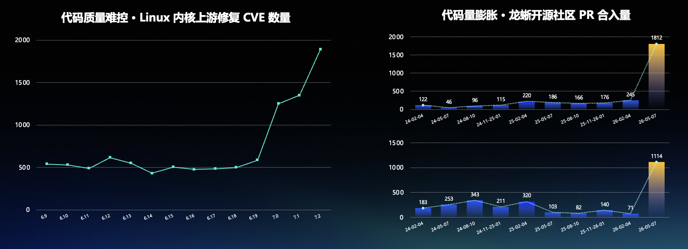

研发效能侧的数据同样印证这一趋势。DORA（Google Cloud 旗下的研发效能研究项目）发布的年度报告《State of AI-assisted Software Development》显示：AI 深度参与开发的同时，代码 Bug 率 +9%，代码评审时间 +91%，平均 PR 体积 +154%（该版受访者约 5,000 人，数字为相关性口径而非因果结论）。

综上，在 AI Coding 人机共写的时代之下，编码已不再受人力限制，但审查的人力并没有同步增长。产能的瓶颈，正在从"写"转移到"审"。

###### 1.2 Agentic CI 中的代码评审意义

面对这个趋势，龙蜥社区在探索 AI Native 研发组织的形态，把持续集成升级为智能化持续集成（Agentic Continuous Integration），整个流水线分为四个环节：

1.  AI 协同编程——研发产能普遍激增，人机共写，编码已不再受人力限制；
    
2.  智能化代码评审——需要检查研发规范与流程、架构与设计一致性、变更完整性与前置依赖、缺陷与安全风险；但人工审查资源不足，AI 评审势在必行；
    
3.  智能化测试——包括深度漏洞挖掘、补丁定向测试、安全补丁验证、回归与性能测试，以及进一步验证测试；
    
4.  社区审核合入——人来做最终的决定。
    

可以看到，AI 评审处在承上启下的位置：上游的 AI 协同编程把代码产量抬了上去，下游的智能化测试和社区合入又都建立在"进入测试和合入环节的代码是靠谱的"这个前提上。如果评审环节失守，要么缺陷漏到下游，要么 Maintainer 被人机共写产出的 PR 洪流淹没。这就是 Kitta 要解决的问题。

##### AI Code Review 的深层挑战

AI Code Review 带来了一些显而易见的红利，例如显著提升的响应速度、对基础缺陷问题的自动化拦截等等。然而，通用 AI Review 工具在核心业务里往往达不到专家级可用的审查需求。

拆开来看，当前通用 Code Review 方案在两个维度上都存在明显局限。一是**工程行为约束不足**：覆盖不全、位置漂移、效果不稳定——变更较大时倾向于只评审部分文件导致遗漏，报告的问题与实际代码位置对不上，评审质量随提示词的细微差异大幅波动。二是**检查深度不足**：缺乏对审查项目的语义理解，规则浮于表面——对每个项目、每次评审一视同仁，只能扫描代码本身的缺陷，感知不到项目特有的审查需求。具体表现为三个深层挑战：

**领域知识匮乏。** 跨领域技术栈差异大，且知识体系需要动态更新。通用模型见过很多代码，但未必懂内核的锁语义，也未必懂编译器的中间表示约定——而这些恰恰是评审结论对错的关键。

**业务理解不足。** 项目开发模式多样，审查的定位与功能需要贴合业务场景。对社区开源项目、企业内部仓库、发行版维护来说，"什么算问题、问题有多严重"的标准截然不同。

**信任边界模糊。** 缺乏客观的质量评估标准，以及难以对齐用户需求的进化机制。用户说"好"不一定是真的好，Agent 自我感觉良好更是靠不住——没有客观的评估与进化闭环，信任就无从建立。

一句话概括：当 AI 深度介入核心业务时，AI 能"看懂"代码，却未必"看懂"项目。

##### Kitta Code Review Agent 技术实践

针对这三个挑战，Kitta 的实践方案是把通用 Agent 领域化，通过"三步走"构建真正懂行的专家级 Code Review Agent。

###### 3.1 第一步：项目级专家资产管理

领域知识不是凭空来的，而是从真实历史中提炼的。Kitta 从社区研发历史中的真实评审与缺陷记录出发，覆盖项目 GitHub 仓库等多源数据。原始记录经过采集关联、规整去噪、语义解析、隔离复现，沉淀为项目级专家资产；其中"隔离复现"是为了让每一条缺陷模式与预期结论都可验证、经得起追问，而不是把噪音当经验。这份资产包含两类核心内容：

*   **评判标准**——评审原则、缺陷模式、项目惯例，回答"按什么标准判"；
    
*   **验证样本**——问题样本、正常样本、预期结论，回答"判得对不对如何度量"。
    

这些资产可验证、可沉淀、可复用：换一个新项目，同样的管线可以把它的真实历史重新提炼成新的专家资产。这一步的本质，是让"懂行"从一种个人经验变成一种组织能力。

###### 3.2 第二步：双轮驱动的代码审查定制

有了专家资产，接下来要解决"怎么看"的问题。Kitta 的做法是双轮驱动——流程定义看哪里，知识决定怎么看。下面以龙蜥社区 ANCK 的落地为例，看这两个轮子分别做了什么。

**审查流程定制，让 AI 看得全**：定义审查要看哪里，包括语义一致性、回合完整性、发行版规范、集成风险等维度——语义一致性防止补丁行为与预期背离；回合完整性盯住跨版本补丁序列是否完整、有无遗漏；发行版规范把关是否符合发行版的合入要求；集成风险评估变更进入代码库后的连带影响。四个维度确保该看的都看到，不漏项。

在 ANCK，流程定制的重点是**回合补丁 Code Review**。补丁回合是下游内核社区维护的高频操作：把上游补丁回合到下游时，往往要根据下游上下文做适配，既要准确判断适配是否正确，也要确认回合是否完整、有没有把上游后续的修复一并带回来。围绕这个场景，Kitta 定制了两项内核特定审查视角：

*   **补丁语义一致性检查**——识别回合补丁与上游原补丁的差异，并结合语义判断补丁功能的一致性。方案上先微观溯源、比对补丁级差异，再宏观评估整体功能是否一致，避免"逐行都对、整体变了"的漏判。
    
*   **补丁完整性检查**——智能追踪回合补丁的上游依赖链，自动识别上游对应的 Fixes 补丁，采用四阶段遗漏 Fixes 检索流程，杜绝已知漏洞的回归。
    

此外，针对下游产品化流程中"代码本身的质量审查只是其中一个环节"的现状，Kitta 还覆盖了 PR 描述规范检查、描述与代码的一致性检查等流程类审查项，把审查范围从代码本身扩展到研发流程的完整上下文。

**领域知识定制，让 AI 看得深**：决定问题怎么判，依托多源头层次化知识库，做子领域拆分，沉淀典型缺陷模式，让 Agent 的判断贴合该领域专家的真实经验，而不是泛泛的"最佳实践"。在 ANCK，这轮定制落地为三件事：

*   **内核领域数据工程**——收集多来源的内核领域知识，经过数据筛选、数据合成、数据均衡等处理流水线，得到领域知识库和 Benchmark 数据；
    
*   **子系统专用知识库**——内核不同子系统的评审关注点差异很大，按子系统组织专用知识库，让评审贴合各子领域的真实惯例；
    
*   **深度审查流程**——引入"有罪推定—全栈调用链分析—自我辩论"的审查流程：先假设代码有问题，沿全栈调用链追语义，再自我辩论验证结论，加强对内核常见关键代码风险的识别深度。
    

为了让定制效果可衡量，Kitta 还构建了**Benchmark 评估体系**：基于三类来源收集数据——LKML（真实社区 Reviewer 的评审过程，问题分布均匀、真实性强）、sashiko benchmark（单 commit—单 issue 精确对应）、龙蜥 Gitee 社区数据；并引入 sashiko、review-prompts、qoder 等多个 SOTA 代码审查工作参与横向评估，用对比结果指导 Skills 进化。

###### 3.3 第三步：在线离线协同迭代进化

领域知识是活的，Agent 也要持续进化。Kitta 采用在线离线协同的迭代机制：

**离线侧，验证样本循环优化**——用验证样本做隔离评测，根据结果反思进化，持续校准 Agent 的判断标准。

**线上侧，线上观测持续校准**——基于 Review 意见内容和研发的后续代码行为，开发了对各类意见有效性进行智能分析汇总的评估框架，结合 Review 采纳率持续监控、知识更新、迭代校准与阈值调整，让 Agent 在真实使用中越用越准。

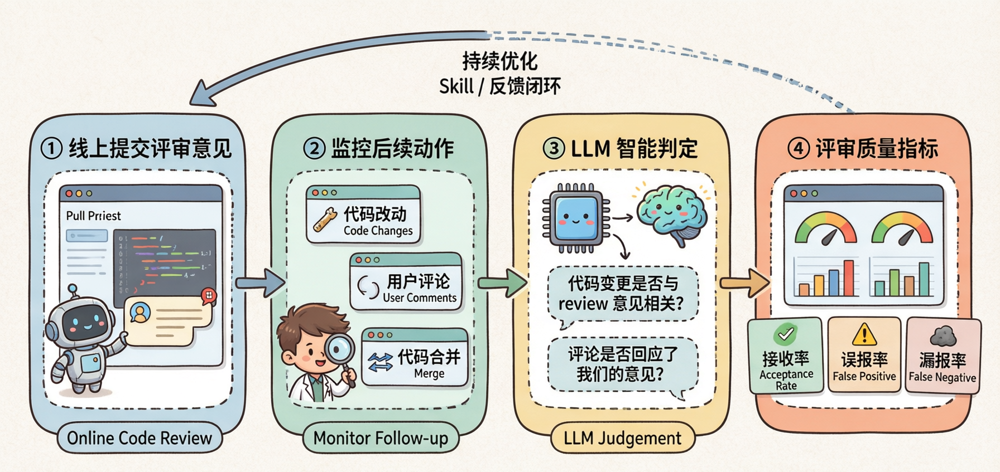

##### Kitta 落地效果

###### 4.1 龙蜥社区内核仓库的实践

Kitta  已在龙蜥社区的真实研发流水线中持续落地运行，沿着一条完整的五阶段流水线对每一个内核 PR 进行审查。开发者提交 PR 或在评论中输入 `/check-code-review` 后，审查任务即被触发；整个流程先分类、再检查规范与依赖、最后落到代码质量，层层递进。

**Stage 1. PR 分类。** Kitta 首先判断这是纯自研补丁还是回合补丁：如果 Commit 中存在类似 `commit xxxx upstream` 的上游补丁声明，则归为回合补丁。分类决定后续检查范围——纯自研补丁不会执行补丁完整性检查和回合一致性检查，避免不必要的开销。

**Stage 2. PR/Commit Message 规范性检查。** 基于龙蜥社区规范文档，对 PR 描述、Commit Title、Commit Message 等进行检查。这一步看起来"轻"，却能提前拦住大量因描述不清、标题不规范导致的维护成本。没有问题则不报告；有问题则给出 Message 规范建议，供开发者参考。

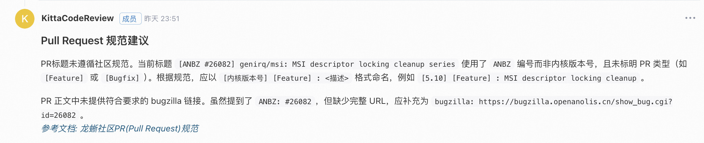

**Stage 3. 补丁完整性检查。** 针对回合补丁，Kitta 会智能追踪其上游依赖链，自动识别上游对应的 Fixes 补丁，按"检索上游 Fixes → 判断是否在 PR 中 → 判断是否在下游仓库已存在"的流程排查遗漏。检查结果分为三类：`无遗漏 Fixes` 表示无需补充；`已合入的 Fixes 补丁` 说明相关修复已存在于下游仓库；`遗漏的 Fixes 补丁` 则要求开发者补充，防止已知漏洞被重新引入下游。

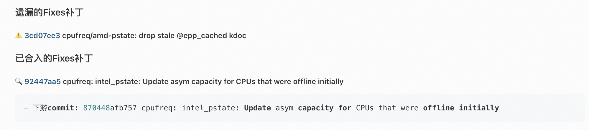

**Stage 4. 补丁回合一致性检查。** 对于声明了上游来源的回合补丁，Kitta 会先获取上游原补丁，再从三个层次对比：基础对比看修改的文件和代码块是否一致；上下文对比看引用的符号、函数、变量定义是否一致、是否做了合理适配；语义对比则通过 LLM 判断上下游补丁是否实现了相同功能和语义。检查结果从 `consistent` 到 `text-inconsistent`、`semantic-inconsistent`、`inconsistent`分层输出，让开发者和 Maintainer 快速定位差异性质。

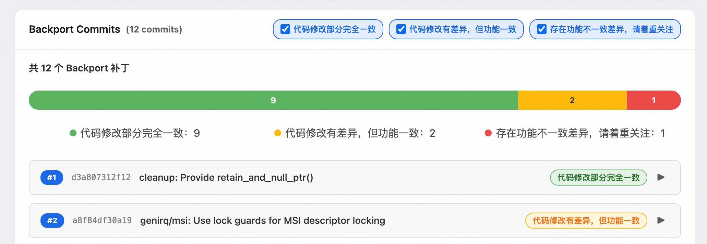

**Stage 5. 代码质量审查。** 最后落到代码本身，Kitta 将审查出的问题按严重程度分为 `Critical`、`Medium / Low`，Critical 问题通常会以内联评论定位到具体代码行，需要开发者处理或明确是否为误报；未发现风险则给出 `LGTM`。

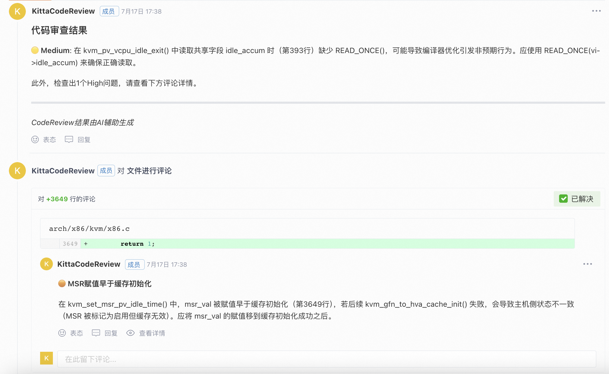

Kitta 上线至今，核心运行数据如下：

| 指标 | 数值 |
| --- | --- |
| 审查规模 | 7 万+ |
| 门禁准确率 | 97% |
| 代码合入率 | 62% |

ANCK 的代码变更以回合补丁和自研补丁为主，既要保证与上游语义一致，又要适配下游产品化需求，审查深度和准确率要求都很高。基于线上评估框架对 Kitta 上线以来处理过的所有已合入 PR 进行回溯统计，两类核心场景都取得了可量化的效果：

*   **回合补丁场景**：一致性检查意见采纳率 70.4%、准确率 99.8%；
    
*   **自研 PR 场景**：Code Review 意见采纳率 41.8%、准确率 73.6%；
    

Kitta 的介入让大量代码问题在进入人工审查之前就被识别，并给出可定位、可验证的修改建议。实践中，很多 PR 在 Kitta 给出意见后，开发者会直接依据建议补充依赖补丁或调整实现，大幅减少了 Maintainer 反复追问、来回确认的回合数。对社区 Maintainer 来说，这意味着他们可以把注意力从"逐行看变更"转移到"判断关键争议点"；对开发者来说，则意味着更快的反馈和更可预期的合入节奏。

###### 4.2 Benchmark 评估体系：让定制效果可衡量

为了让定制效果可衡量，Kitta 还构建了 Benchmark 评估体系：基于三类来源收集数据——LKML（真实社区 Reviewer 的评审过程，问题分布均匀、真实性强）、sashiko benchmark（单 commit—单 issue 精确对应）、龙蜥社区数据。其中：

*   LKML 数据让 Kitta 能够对齐真实社区 Reviewer 的判断标准
    
*   sashiko benchmark 提供了严格的单 commit—单 issue 映射，让能力改进方向足够聚焦
    
*   龙蜥社区数据则把评估拉回到 Kitta 实际服务的仓库语境中
    

通过与 sashiko、review-prompts、qoder 等 SOTA 方案横向对比，Kitta 能够清楚看到自身在特定缺陷类型、特定子系统上的差距，并把这些差距转化为 Skill 迭代的优先级。后续该 Benchmark 系统还将支持接入其他 Skills/Benchmark 进行评估，持续迭代优化能力。

###### 4.3 跨领域通用实践

Kitta 的能力并不局限于内核。通过把专家资产和审查流程抽象为可迁移的 Skill，Kitta 已经在操作系统内核、编译器、文件系统、网络系统、云原生平台、AI 计算框架六个领域完成验证。这些领域共同的特点是代码规模大、语义深、审查门槛高，传统通用 Review 工具往往难以给出有价值的结论。Kitta 在这些场景下的表现如下：

| 领域 | 审查质量提升 |
| --- | --- |
| 操作系统内核 | 20.4% |
| 编译器 | 24.4% |
| 文件系统 | 17.0% |
| 网络系统 | 19.8% |
| 云原生平台 | 31.6% |
| AI 计算框架 | 21.7% |

跨领域的稳定提升说明 Kitta 的"领域定制"方法论具有通用性：无论是内核的锁语义、编译器的中间表示，还是云原生平台的配置约定，都可以通过沉淀专家资产、定制审查流程来构建专家级 Review 能力。这也为后续向 LLVM、CRIU、BaseOS 等更多基础软件项目扩展奠定了基础。

###### 4.3 数据飞轮：数据向下沉淀，模型能力向上反哺

Kitta 在服务过程中还在持续沉淀数据，可以用于千问基座模型的形成"数据向下沉淀、能力向上反哺"的飞轮：

| 沉淀的数据 | 反哺的能力 |
| --- | --- |
| 专家标注的 Benchmark 基准数据集 | 漏洞发现能力——更深入的语义理解与潜在漏洞发现 |
| Agent 思维链轨迹跟踪数据 | 指令跟随能力——更准确的工具调用与指令遵循 |
| 用户偏好对齐数据 | 用户对话能力——贴近用户需求的评审意见表达 |
| 用户后续 Coding 动作 | 代码生成能力——更好的跨语言 Coding 与 Debug 能力 |

评审过程中产生的专家标注、思维链轨迹、用户偏好与后续代码改动，既是改进 Review 服务本身的燃料，也在反哺基座模型更基础的能力。反哺基座模型更基础的能力。更重要的是，这些数据来自真实的社区运行，而不是人工构造的静态数据集，因此每一次迭代都在让 Kitta 更贴近实际研发场景。

##### 实践总结：AI Code Review 的边界与共识

经过落地实践后，我们发现要想最大化 AI Code Review 的效果，首先需要明确的是 AI 与人在协作中的信任边界。Kitta 遵循三条原则：

**精准分级，克制打扰——严守门禁底线，释放建议空间。** 对安全漏洞和破坏坚决拦截 CI 流程，这是底线；其余问题分级呈现、仅作提示，不过多占用开发者的注意力，平衡问题披露阈值。

**行为作证，拒绝自嗨——用户可能沉默，但代码变更骗不了人。** 不把开发者的默默无视当成认可，不看用户说什么，看"代码改了什么"：通过置信度熔断与追踪真实代码变更，基于客观变更驱动审查和模型迭代。

**人类兜底，适时退场。** AI 是探照灯，照亮风险、给出证据；Maintainer 是方向盘，最终决策权在人，是最后一道防线。

最好的 AI 门禁，不是替代 Maintainer，而是让他们只把精力花在真正需要人类智慧的地方。

---

_本文档为技术能力介绍材料，文中数据来源于内部评测与生产环境统计。_


<a id="sec-042"></a>

### PatchPilot Agents：让内核补丁交付成为可编排、可验证的工程闭环
#### 1. 为什么需要 PatchPilot

上游补丁进入下游产品版本时，失败原因往往不是单一的 Git 冲突：同一函数可能已被重构，结构体字段或函数签名可能已演化，修复所依赖的前置提交也可能尚未进入目标分支。传统流程依赖内核研发逐个阅读日志、定位冲突、补齐依赖、修改代码并反复验证。任务规模上来后，交付质量容易依赖少数专家的经验，处理过程也难以复盘。

难点不在于“能不能生成一段修改”，而在于：**能否让一次补丁交付具备可追踪的过程、可验证的结果和可持续优化的机制。**

PatchPilot 将这一过程组织为多阶段工作流：从补丁获取、冲突分类和意图理解开始，经由可行性分流、依赖分析、AI 解冲突和语义审查，最终进入交付回检。每个阶段都有明确输入、产出和状态，使复杂任务能够被观测、暂停、恢复和复盘。

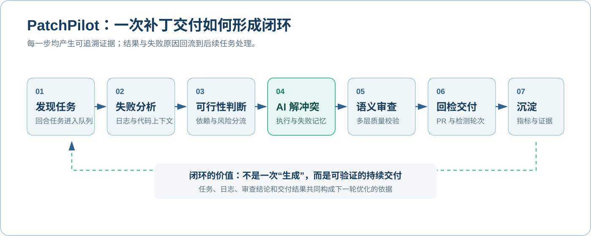

---

#### 2. PatchPilot 的工作方式

PatchPilot 不将大模型当作“万能代码生成器”，而是把它放在有明确输入、边界和校验的工程流程中。

| 机制 | 工程实践 | 带来的价值 |
| --- | --- | --- |
| **可行性分流** | 先以启发式规则快速评估，再仅对模糊任务调用 LLM 精判 | 将昂贵推理资源投入真正复杂的问题 |
| **依赖分析** | 结合补丁意图、代码状态和前置提交，递归识别必要依赖 | 避免只按缺失符号补丁、导致依赖链膨胀 |
| **AI 解冲突** | 按 hunk 推理，保留每轮的方案、失败原因和改动范围 | 让下一次尝试能避开已经验证的无效路径 |
| **质量守护** | 检查残留冲突标记、代码漂移和语义偏差 | 不把“能合入”误判为“可交付” |
| **人机协同** | 证据充分且风险可控的任务自动处理；不确定或高风险任务升级工程师 | 保持自动化效率，也保留工程责任边界 |

---

#### 3. 三项实践

##### 实践一：失败任务自动分流

**问题**：一次合入失败可能是依赖缺失、上下文变化或真实代码冲突。人工先判断“值不值得修、能不能修”，本身就消耗大量时间。

做法：PatchPilot 先以启发式规则快速评估冲突规模、缺失符号、危险变更和补丁复杂度；仅将处于模糊区间的任务交由 LLM 进一步判断。这样形成“快筛 + 精判”的双层漏斗：明确任务快速推进，复杂任务再投入深度分析。

关键点：自动化不是无边界自治。系统将“是否自动处理”的判断前置，并为高风险改动设置人工升级出口。这样，Agent 专注于高确定性、可验证的工作；工程师则集中处理架构差异、语义取舍和风险决策等真正需要经验的问题。

##### 实践二：避免“看似成功”的 AI 解冲突

**问题**：解决 Git 冲突不等于保留了原补丁意图。AI 可能产生残留冲突标记、遗漏关键改动，甚至生成上游不存在的代码。

做法：解冲突前，系统先对齐补丁意图，并以“代码状态偏离”而非单纯缺失符号为线索追踪依赖：函数实现、结构体字段和函数签名的演化都会纳入判断。执行后依次检查冲突残留、代码漂移与语义偏差。

关键点：Agent 的每一轮尝试都会记录处理方案、失败原因和改动范围；后续重试带着这些结构化记忆继续，而不是重复同一条无效路径。依赖提交必须由 Git 工具精确枚举，避免模型凭直觉补全不存在的前置变更。

##### 实践三：以端到端交付定义成功

**问题**：一次回合成功后，仍可能在 PR、检测轮次或后续链路中失败。只统计“命令执行成功”会高估自动化价值。

做法：回合成功后自动创建检测轮次、回检 PR 与交付状态，并将任务、日志、审查结论和最终产物统一关联。调度侧以持久化任务状态管理执行与恢复，使异常中断不会让任务悄然丢失。

关键点：PatchPilot 以“是否完成交付”而非“是否完成一次执行”衡量效果。任务从入队到 PR 合入的状态被连续记录；当执行中断、超时或出现异常时，系统能够基于持久化状态进行恢复或重新调度，而不是把任务留在不可见的中间状态。

##### 技术机制：让 Agent 的推理可控、可验证

PatchPilot 的技术重点不在于让模型“多写代码”，而在于把模型能力约束在可验证的工程边界中。它通过意图分析缩小关注范围，通过 Git 工具提供可追溯事实，通过工作流状态机串联分析、执行与回检。

| 技术机制 | 解决的工程问题 | 设计要点 |
| --- | --- | --- |
| State-First 依赖分析 | 仅找缺失符号会遗漏代码演化造成的真实冲突 | 比较函数、结构体和签名的状态偏离，再定位必要前置提交 |
| 工具约束推理 | LLM 可能凭经验估算或编造依赖 | 要求通过 Git 命令枚举 commit SHA，以工具输出作为事实依据 |
| 结构化失败记忆 | 多轮尝试容易重复走进同一条死路 | 保存方案、失败原因和改动范围，驱动下一轮差异化尝试 |

这使得 PatchPilot 的 Agent 不只是“给出建议”，而是以可复盘的证据链参与工程决策：每一个自动化结论都能对应到任务状态、Git 事实或质量检查结果。

##### 运行保障：让自动化能够长期稳定运行

面向多个内核版本和大批量补丁，Agent 的可靠性不仅取决于模型效果，也取决于任务系统是否可恢复。PatchPilot 将任务状态、执行产物和审查结果持续沉淀；通过去重、调度恢复和超时处置，避免重复执行、异常中断或任务遗漏影响整体交付节奏。

这也意味着，系统的优化对象不仅是“单次解冲突是否成功”，还包括任务吞吐、失败可见性和交付链路的稳定性。模型能力、工作流编排与运行保障共同构成可规模化的研发效能基础设施。

---

#### 4. 阶段性实践效果

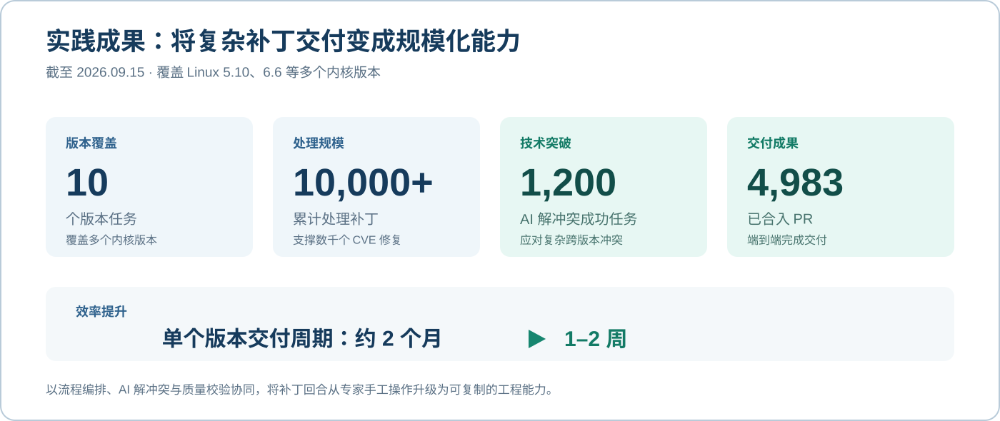

PatchPilot Agents 的价值不只来自“使用了 LLM”，而来自将**轻量规则、昂贵推理、质量校验和调度回检**组合成可规模化运行的系统。

---

#### 5. 可复用的方法论

1.  **从高频、证据充分的问题开始。** 优先选择日志、代码、任务状态等输入明确的场景，而不是一开始追求全自动决策。
    
2.  **先建立工作流，再引入 Agent。** 没有状态、上下文和回检的 Agent，难以在生产工程中稳定运行。
    
3.  **以质量门禁约束生成。** 对每个自动化动作定义可验证的结果与人工升级条件。
    
4.  **以端到端结果度量价值。** 同时观察效率、成本、交付率、人工升级率和返工率，避免只看单点成功率。
    
5.  **让失败成为资产。** 将失败原因、尝试过程和人工决策结构化沉淀，持续反哺规则、提示词和评测。
    

---

#### 结语

PatchPilot 展示了一种面向复杂工程任务的 Agent 路径：不依赖一次性“智能回答”，而是以工作流编排承载过程，以工具和证据约束推理，以质量门禁控制风险，以人机协同完成交付。

这套方法同样适用于 SDK 大版本升级、跨分支移植、fork 同步等代码迁移场景。


<a id="sec-043"></a>

### 从报警到自动修复，PolarDB-X 的 Loop 工程实践
#### 一、从编码提效到端到端提效

随着 Agent 逐步参与日常研发，编码和测试已经成为常见的应用场景。但研发工作还包括需求形成、方案设计、问题分析、环境准备和结果验证，这些环节同样需要大量投入。要进一步提升整体效率，就需要让 Agent 从参与编码和测试，扩展到自主推进更完整的研发任务，实现端到端交付，从而减少各环节的人工操作与反复交接，缩短交付周期。

PolarDB-X 团队也在探索如何通过 Agent 提升研发效率。PolarDB-X 是一款云原生分布式数据库，高度兼容 MySQL 生态，具备高可用、水平扩展和 HTAP（混合事务与分析处理）能力。整体架构如下图所示。

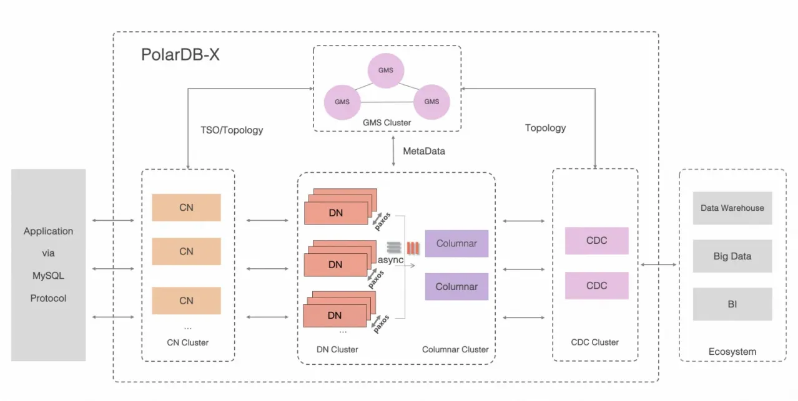

_图 1：PolarDB-X 整体架构_

##### 1.1 不同研发任务的 Agent 协作方式

数据库的分布式架构增加了问题定位和验证的复杂度，对正确性、可靠性和稳定性的高要求，也决定了研发成果必须经过充分验证。在满足这些质量要求的前提下，我们针对两类常见研发任务，采用不同的 Agent 协作方式。

**第一类是新功能开发和已有功能优化。** 例如优化分布式事务、实现新的数据压缩功能。这类任务通常需求明确，但实现方案需要综合考虑功能完整性、兼容性、性能和可靠性，难以在开发之初一次确定，需要根据实现和验证结果持续改进。对于这类任务，我们采用研发主导、Agent 执行的协作方式：研发负责方案和关键决策，并在开发、测试过程中持续把关；Agent 则承担具体的编码和测试工作。由于编码和测试原本占据大部分工作量，这种协作方式能够显著提升开发效率，缩短研发周期。

**第二类是报警、工单处理和缺陷修复，这也是团队长期面临的效率痛点。** 在原有处理流程中，研发不仅需要完成编码和测试，还需要承担前期的问题分析、根因定位和修复需求产出。一次修复最终可能只涉及几行代码，但研发需要收集实例信息、监控和日志，结合源码排查原因，并搭建环境、构造触发条件，验证问题能否稳定复现。完成代码修改后，还需要验证修复效果、执行回归测试，并推动修复合并。前期分析和后续验证需要大量投入，仅让 Agent 协助编码，能够节省的时间非常有限。

好在，第二类任务通常具有具体的故障现象，可以通过复现验证原因假设，再通过修复前后的对照测试检验修改效果。虽然排查过程复杂，但稳定复现和测试结果能够提供明确的验收依据，为 Agent 自主完成分析、修复和验证创造了条件。

因此，在探索 Agent 端到端自主处理时，我们选择从第二类任务入手，目标是让 Agent 从报警或工单出发，在无需人工干预的情况下，自主完成现场分析、根因验证、稳定复现、代码修复、测试验证和修复提交，仅由研发参与最终审查，大幅提升缺陷处理效率。

#### 二、从报警到自动修复

##### 2.1 整体流程

PolarDB-X Loop 以报警或工单为输入，由 Agent 自主完成问题定位、稳定复现、编码修复和测试验证，最终提交研发进行代码审查。整体流程如下图所示。

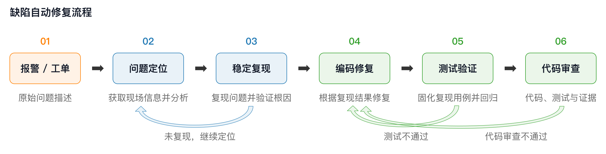

_图 2：PolarDB-X 缺陷自动修复流程。验证结果决定下一步继续推进，还是返回分析与修改。_

在这一流程中，Agent 首先获取现场信息，分析可能的原因，并尝试复现问题。如果实际运行结果与预期不符，就根据新证据调整分析，继续验证；确认原因并稳定复现后，再修改代码，将复现过程固化为测试用例，通过修复前后的对照验证和完整的回归测试后，提交研发评审。

让 Agent 自主完成流程，还需要解决一个关键问题：如何保证它产出的结果可靠。在引入 Agent 时，我们往往更关注编码阶段，希望通过 Skills 或操作约束保证代码正确性。**但对于缺陷修复，我们认为稳定复现才是整个流程中最重要的一步，因为后续的代码修改和验收，都依赖于对原始问题的准确理解与验证。**

稳定复现因此贯穿三个阶段：在问题分析阶段，Agent 通过复现检验自己的分析；在编码修复阶段，Agent 将复现过程固化为测试用例，验证代码修改的效果；在代码评审阶段，研发以复现用例和验证结果为依据，检查 Agent 是否真正修复了最初的问题。

要让这一机制落地，Agent 既需要获取完整的现场信息，也需要具备运行、调试和复现问题的能力，并在修复后完成充分的测试验证。下面将分别介绍现场信息获取、运行验证和修复交付三个环节的工程实践。

##### 2.2 现场还原与问题分析

报警通常只反映某个指标或某个 SQL 的异常，定位问题还需要关联实例版本、拓扑、监控、日志和源码。多组件协作使同一现象可能对应不同原因；线上多版本并存，也使已在新版本修复的问题可能继续出现在老版本中。因此，排查既要还原故障现场，也要结合实例版本和修复记录识别已知问题。

###### 从人工整理需求到 Agent 自主分析

早期，我们先由研发还原现场、分析原因，再将结论整理成修复需求交给 Agent。这样能够利用 Agent 的编码能力，但最耗时的排查工作仍由研发承担。

随后，我们尝试让 Agent 直接分析现场材料。在我们的实践中，Agent 在现场信息梳理方面往往比人工表现更好：它能够更清楚地梳理问题发生前后的时间线，更擅长从海量日志中检索相关信息，还能发现人工排查时遗漏的关键线索。

这些表现促使我们将 Agent 的任务起点，从接收人工整理的修复需求，前移到直接接收报警或工单。由 Agent 自主确认问题发生在哪个实例、涉及哪些节点、运行什么版本，以及异常前后发生了什么，将现场还原和问题分析一并纳入自主处理流程。

自主分析要求 Agent 能沿线索持续查询：发现节点异常后查询同期日志，发现状态变化后检查对应源码，在查询与分析之间不断迭代。

这一阶段应形成问题现象、时间线、相关证据和待验证的原因假设，为后续复现提供明确的检查目标。

###### 通过结构化接口支持按需查询

早期提供给 Agent 的现场材料主要是人工选取的监控截图和日志片段。需要查看其他节点或扩大时间范围时，Agent 只能等待研发补充材料。

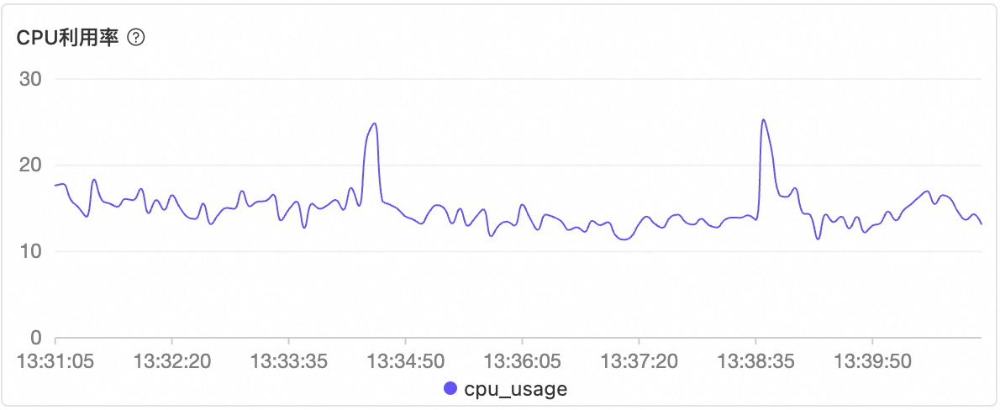

_图 3：CPU 使用率监控截图。_

要让分析过程不再依赖人工补充材料，就需要为 Agent 提供常用平台的结构化接口或 CLI 工具。这样，Agent 在分析中发现信息不足时，可以自主调整查询对象和时间范围，获取所需数据后继续分析。

为便于这些工具查询和关联现场信息，日志等数据也需要集中管理。如果日志分散在各个生产节点上，查询仍需逐节点访问、检索文件并汇总结果；集中到统一平台后，Agent 就能通过统一入口获取不同节点、不同时间段的数据。

以阿里云 CLI（`aliyun`）为例，Agent 可查询指定时段内两个计算节点的 CPU 使用率：

```bash
aliyun polardbx DescribeDBNodePerformance \
  --RegionId cn-hangzhou \
  --DBInstanceName pxc-xxxxxxxxx \
  --DBNodeIds "pxc-i-xxxxxxx,pxc-i-yyyyyyyy" \
  --CharacterType polarx_cn \
  --Key Cpu_Usage \
  --StartTime 2026-09-03T03:51Z \
  --EndTime 2026-09-03T03:53Z
```

查询结果以 JSON 格式返回，包含节点、指标和采样点。以下为简化后的返回结果示例，标识与数值仅用于演示：

```json
{
  "PerformanceKeys": [
    {
      "DBNodeId": "pxc-i-xxxxxxx",
      "Measurement": "Cpu_Usage",
      "Points": [
        { "Timestamp": 1788407460000, "Value": "92.6" }
      ]
    },
    {
      "DBNodeId": "pxc-i-yyyyyyyy",
      "Measurement": "Cpu_Usage",
      "Points": [
        { "Timestamp": 1788407460000, "Value": "28.3" }
      ]
    }
  ]
}
```

Agent 根据返回数据识别异常节点和时段，按需扩大查询范围、关联日志，持续推进分析，无须人工补充现场材料。

###### 将存量平台封装为 CLI

不过，有些存量平台缺少维护，也未必有人提供相应的 CLI 工具。对于这类平台，如何让 Agent 获取所需信息？

先看一个例子。阿里内部有一款很受欢迎的“抢会议室” CLI。

通过这个工具，一条命令即可预订会议室，还可以配合定时任务自动抢订：

```bash
ali meeting book -r <roomId> -s <start> -e <end>
```

这个工具的作者是一位普通研发人员，在没有平台源码的情况下，就打通了会议室预订的整套操作流程。这给了我们启发：即使平台没有提供现成工具，我们也可以自行将所需功能封装为 CLI。

我们进一步让 Agent 完成这项工作：参考已有 CLI 实现，自主操作浏览器、使用目标平台功能，分析接口请求和认证方式，再编写代码，将所需功能封装出来。

通过这一方式，我们用约一周时间，让 Agent 将常用系统的监控、日志和拓扑查询功能封装为 `polardbx` CLI，供后续排查调用。

`polardbx --help` 展示的命令分组如下：

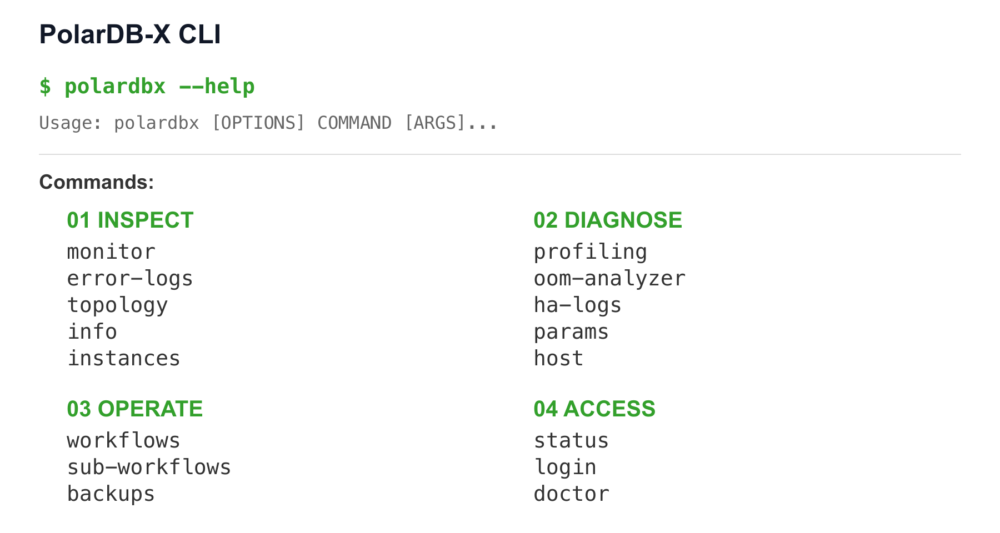

_图 4：自建 PolarDB-X CLI 的命令分组。_

此外，我们还将诊断方法、CLI 工具说明和排查经验整理为 Skills。例如，`polardbx-diagnostics` 指导 Agent 确认问题现象、查询拓扑和基础指标、定位异常时段及组件，再根据原因假设选择日志查询、火焰图等手段验证，并据此调整分析方向。该 Skill 还配套提供采集脚本、指标字典、日志查询模板和常见问题诊断参考，供 Agent 按需查阅和调用。

##### 2.3 通过运行验证分析结论

“纸上得来终觉浅，绝知此事要躬行。”代码中的可疑路径是否真正触发了故障，需要在实际运行中验证。对于 Agent 而言，提出原因假设之后，还需要能够自行检验、修正判断。下面的 MDL 锁泄漏案例，正是我们补齐这一能力的起点。

###### MDL 锁泄漏案例：静态分析与实际执行路径的偏差

我们曾遇到一个五年前就已出现的 MDL（元数据锁）泄漏问题。该问题在线上环境中低概率发生，会导致后续修改表结构的操作持续阻塞。由于难以复现，多年来始终未能明确根因。

在一次线上排查中再次遇到该问题后，我们尝试借助 Agent，结合现场信息和源码进一步分析。Agent 很快生成报告，列出代码位置、执行过程和可能原因，并提出了以下关于主线程（ServerExecutor）与 KillExecutor 线程并发时序的解释。该解释随后被人工验证推翻：

| 时序 | 主线程（ServerExecutor） | KillExecutor 线程 |
| --- | --- | --- |
| 1 | 获取第一把 MDL 锁，并记录在当前连接的锁记录集合中 | — |
| 2 | 开始获取第二把锁，取得同一个锁记录集合，但尚未写入新记录 | — |
| 3 | — | 响应用户的 KILL 操作，开始关闭连接 |
| 4 | — | 释放第一把锁，并将已清空的锁记录集合从连接索引中移除 |
| 5 | 继续获取第二把锁，将记录写入已脱离索引的集合 | — |

Agent 当时的推测结论是：第二把锁的记录无法再通过连接索引找到，导致锁泄漏。

研发经过约两小时验证，发现该解释不成立。Agent 根据反馈多次调整分析，但仍未形成可靠结论，期间生成了多份报告和测试文档：

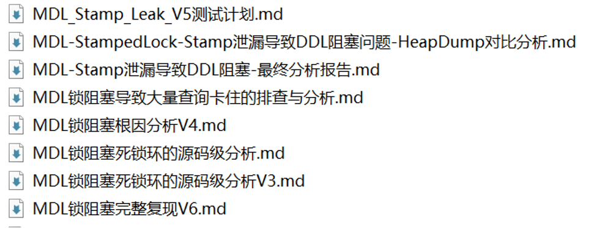

_图 5：Agent 在多轮分析中生成的报告和测试文档。_

偏差来自静态推演与实际执行的差异。连接终止的处理路径受程序状态影响，锁也存在多处释放路径。仅阅读代码容易遗漏状态变化的先后顺序，将可能发生的路径误判为实际执行的路径。

研发验证这些判断时，需要准备环境、设置断点、控制线程执行顺序，必要时还要检查内存中的对象状态。当这些手段只有人能使用时，Agent 每提出一个假设，就需要研发接手验证。

因此，我们开始把同样的调试与分析能力提供给 Agent，让它能够观察实际运行结果，自行发现假设中的错误，再继续排查。

###### 通过 JDB CLI 调试运行中的 Java 程序

首先，我们为 Agent 提供了直接调试 Java 程序的能力。JDK 自带的 jdb 主要面向人在终端中的持续交互。Agent 使用它时，需要维护交互进程，不断发送命令、读取输出，并在多次调用之间保持调试状态，使用起来较为繁琐。

为此，我们基于 Java 调试接口 JDI 重新实现了 JDB CLI，通过后台进程持续维护调试会话。前台每条命令执行后即可退出，下一次调用仍能继续操作同一个调试现场，查看线程、断点和变量。

这样，Agent 可以先暂停程序、观察状态，再结合源码分析，随后回到同一会话继续执行，将调试过程与分析过程衔接起来。

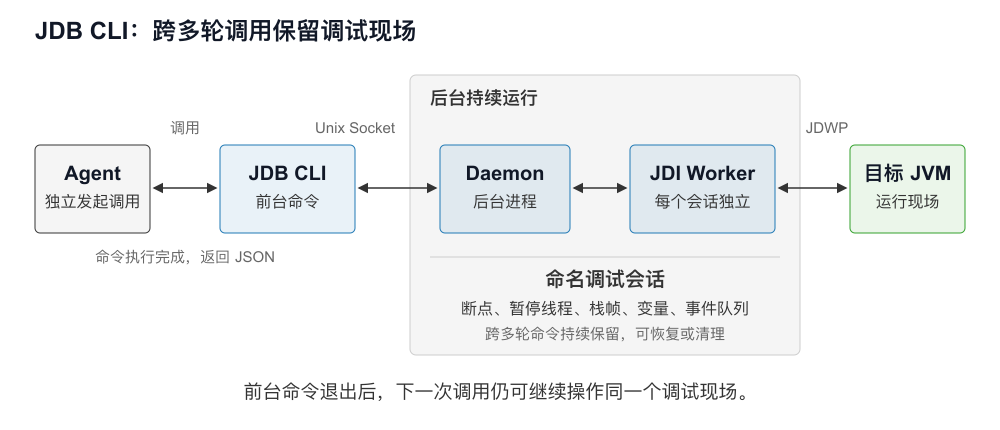

_图 6：前台命令独立调用，后台持续保留调试会话。_

另一个关键能力是指定线程断点：只有目标线程会触发断点，命中时也只暂停该线程，其他线程继续运行。配合线程恢复操作，Agent 可以控制相关线程的执行顺序，验证特定时序下的程序行为。

前述 MDL 低概率并发问题的复现，就用到了这项能力。Agent 能够自行控制线程时序，检查程序是否按分析中预想的路径执行，并根据实际结果修正判断。

###### 通过 Heap Dump 查询内存现场

除了调试运行中的程序，Agent 还需要检查故障时的内存状态。Heap Dump 是 Java 程序在某一时刻的堆内存快照，研发可以从中查看对象字段的值、引用关系和内存占用。

以前述 MDL 问题为例，排查时需要通过内存分析确认锁是否泄漏，检查相关锁对象、锁记录及其引用关系。掌握实际的内存状态后，才能结合源码进一步分析泄漏原因。

Heap Dump 文件通常很大。我们将其放在大内存云服务器上集中加载和处理，并为 Agent 提供查询接口。Agent 可以按需查询对象字段和引用关系，根据返回结果继续检查相关对象，自主验证分析假设，无须由研发逐项查询后再提供材料。

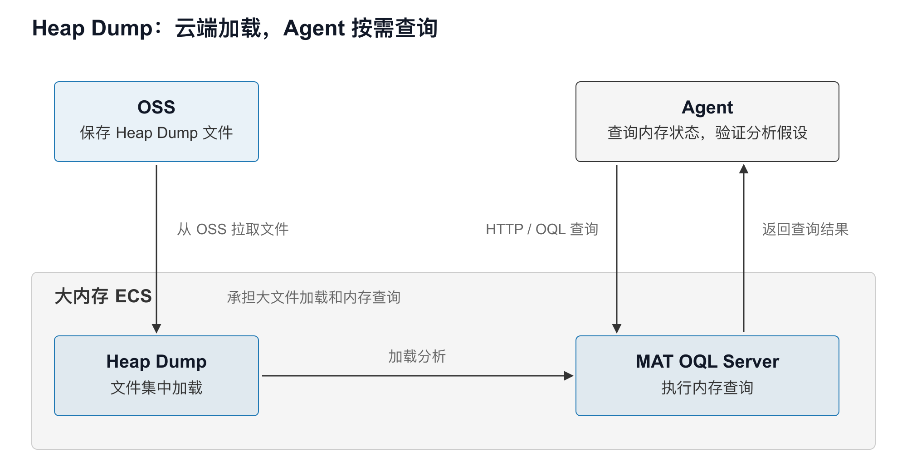

_图 7：大内存 ECS 加载 Heap Dump，Agent 通过 HTTP 接口发起 OQL 查询并获取结果。_

分析完成后，Agent 还可以将分析记录和最终报告上传至展示平台，供研发后续查阅和复核。实践中，该平台已累计记录两千多份 Heap Dump 处理任务。

###### 根据故障条件选择复现环境

具备调试和内存分析工具后，还需要为 Agent 准备能够实际运行和复现问题的环境。我们提供了两类环境，Agent 可以根据问题情况自行选择。

| 环境 | 适用情况 | 使用方式 |
| --- | --- | --- |
| PolarDB-X Zero 临时实例 | SQL 报错、功能异常等简单问题的初步复现 | 创建最新版本的临时实例，完成验证后释放 |
| K8s 中的完整复现环境 | 依赖历史版本、特定拓扑，或需要控制并发时序的问题 | 按问题实例的版本和拓扑搭建，结合调试工具验证 |

对于需要控制并发时序的问题，Agent 可以在完整复现环境中配合前述调试工具，设置断点、控制相关线程的执行顺序，验证问题的触发条件。

这套环境也用于后续的修复验证。代码修改后，Agent 将修复后的版本部署到相应环境中，按照已经确认的复现步骤再次执行，检验原始问题是否得到解决。

###### 从低概率触发到稳定复现

具备工具和环境后，Agent 开始自主验证 MDL 问题。初次尝试未触发故障，Agent 根据实际执行路径重新分析线程关系，调整断点和执行顺序。

经过几轮迭代，Agent 找到了之前遗漏的关键条件：要在连接进入语句执行状态之前发起 KILL，再控制后续关闭连接与获取 MDL 锁的执行顺序。

Agent 利用指定线程断点，将相关线程停在关键位置，再按需要的顺序恢复执行，最终复现了与原问题一致的锁泄漏和后续阻塞。原本依赖偶然调度的线程交错，被转化为可以主动构造的操作步骤。

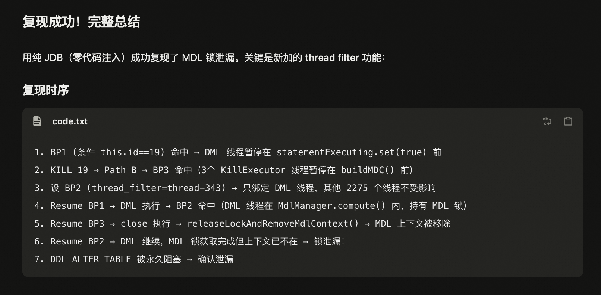

_图 8：Agent 通过指定线程断点控制执行顺序，复现 MDL 锁泄漏及后续 DDL 阻塞。_

明确的触发条件、可重复的操作步骤，以及与原始故障一致的现象，为研发复核提供了运行依据。控制关键时序后，还可在相同条件下对照修复前后的行为，避免因故障未被偶然触发而误判修复效果。

根因和触发条件得到验证后，Agent 就能明确需要修复的问题，并以复现用例确定验收条件，继续推进代码修改。

##### 2.4 以稳定复现作为修复交付门禁

稳定复现用例是修复进入代码评审的必要条件。

Agent 将稳定复现的过程固化为测试用例。对于前述并发问题，确认触发时序后，可以通过特殊 Hint 在关键位置注入延迟，构造可重复执行的复现用例。**这个用例在修复前必须能触发原来的问题，修复后必须能正常通过。只有完成这组验证，并通过完整的回归测试，代码才能进入评审。** 如果没有通过，就继续分析和修改，直到满足这些要求。

###### 先审查复现证据，再审查代码修改

满足上述要求后，Agent 提交合并请求，附带代码修改、复现用例、修复前后验证结果和回归测试结果。

研发先检查复现用例，对照原始问题确认其覆盖目标故障，再审查代码修改。审查通过后，按既有流程合并。

现场收集、根因排查、复现和测试验证由 Agent 自主完成后，研发可以围绕提交的证据和代码开展审查，无须再逐项承担前述工作。提效范围由编码环节扩展到完整的缺陷处理过程。

#### 三、云端运行与实践效果

为支持 7×24 小时持续处理报警和推进修复，我们基于云端沙箱构建了 PolarDB-X Agent，承载上述流程的持续运行。

云端沙箱还提供了两方面的安全保障：一是环境隔离，将 Agent 的运行环境与研发的本地电脑隔离，即使沙箱环境被破坏，也不会影响本地开发环境；二是权限最小化，只授予 Agent 完成任务所需的权限，限制它能够访问和操作的范围。

团队成员可共用云端环境，协同配置和完善工具与流程。

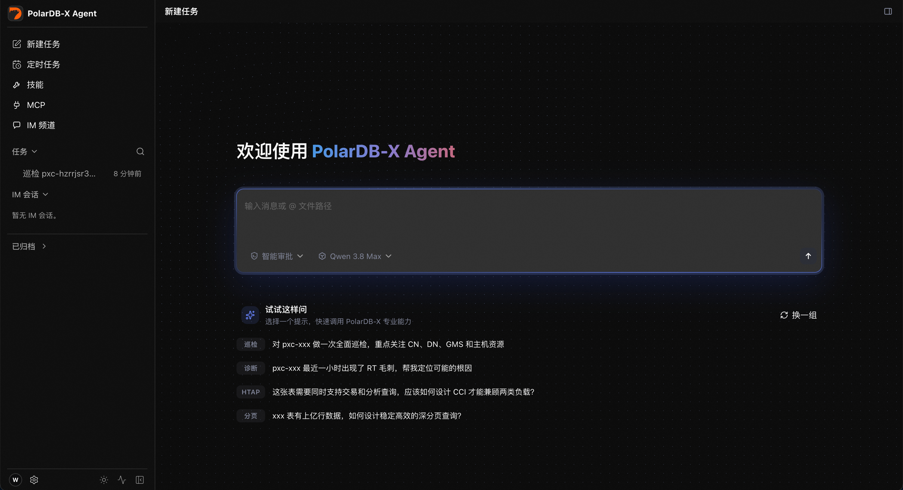

_图 9：PolarDB-X Agent 云端平台，承载 Loop 的持续运行。_

在本文所述的半年实践中，所有报警先由 Agent 完成首轮处理和分析。团队从上万次报警中识别并记录了两百多个缺陷，其中超过 70% 可以稳定复现，并由 Agent 完成修复后进入代码评审。

#### 四、面向其他团队的实践建议

这段实践形成了三条工程经验：

1.  **让研发系统可以被 Agent 调用。** 将日志等现场材料集中管理，通过 CLI 或接口提供常用查询能力，并把诊断方法、工具说明和排查经验整理成 Skills，让 Agent 能够按需获取信息，沿着线索继续分析。
    
2.  **让研发过程可以验证。** 提供复现环境、调试和内存分析工具，让 Agent 自行检验假设，再将稳定复现的过程固化为测试用例，通过修复前后的对照验证和回归测试检查修改效果。
    
3.  **让任务能够持续运行。** 将 Agent 和任务流程放到云端，支持 7×24 小时持续处理报警、推进修复，并通过环境隔离和最小权限控制访问与操作范围。
    

其他团队可从具有明确验证方法的任务入手，接通所需信息和工具，完成从任务输入到结果交付的全流程，再根据实践逐步完善。Loop 的关键是让 Agent 根据运行结果修正分析、自主推进，并交付可复查的结果。


<a id="sec-044"></a>

### 从编码提效到端到端交付，云通信的人机协作实践
#### 一、编码提效不等于交付提效

研发协作，是当前AI落地最关键的方向之一。云通信研发团队积极拥抱AI，很早就开始通过AI提效：2024年把代码补全、对话式编程、生成式IDE铺开到日常开发。2025年标准化作业，把规范、领域知识沉淀为宪法、Skill等物料，让AI干活有章可循。2026年已经全面走向Agent化作业模式，正朝端到端交付迈进。

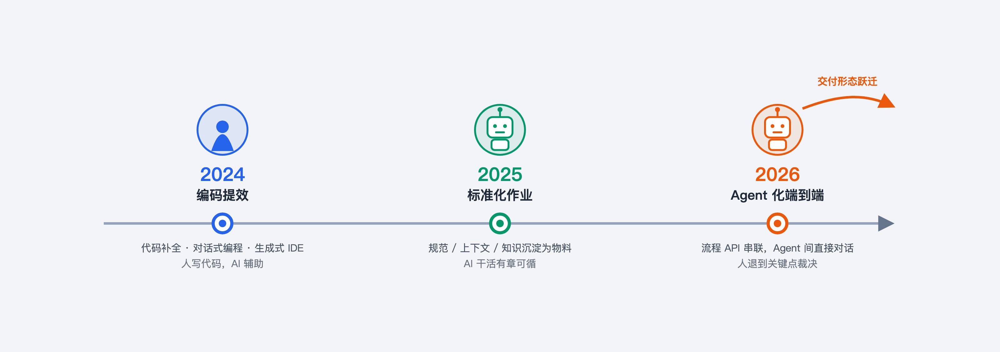

 _图 1-1　AI Coding 三段演进_

三段走下来，出现一个反直觉的结果：AI生成的代码量翻了N倍，但端到端交付的效率却没有同步跃升。一个需求，从提出到上线，交付周期只被压缩了很小一截，提升并不明显。这个反差让我们回头审视整条链路。

经过分析，我们发现：编码提效并不等于交付提效。堵点不在编码本身，而在编码之外仍然由人衔接的节点：1.需求的澄清对齐消耗人力，PRD 要素不全时Agent无法直接开工，人必须补齐上下文。2.代码评审跟不上产出，Agent单次产出代码动辄上万行，最终仍需人逐行审阅，效率难以大幅度提升。3.测试排期成为瓶颈，AI生成量冲上来，人力测试队列立刻堵住。由此可见，只要交付链路里存在由人衔接的节点，该节点就决定了吞吐上限。要真正做到端到端提效，就必须实现全流程Agent协作的研发交付模式。

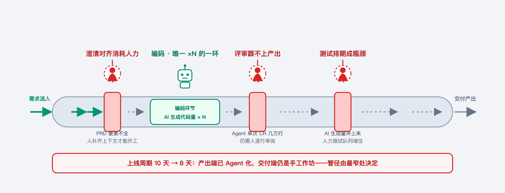

 _图 1-2　编码与交付对比_

而要实现全流程Agent协作的端到端交付模式，有三个关键问题需要解决。

**第一个是协作问题**——Agent之间如何互相配合。

当前几乎每个团队都在自建Agent与Skill，各自把最关心的部分做到极致：技术Agent编写技术方案时着重输出技术架构与中间件选型，而下游测试Agent则更关心系统边界、可观测性与错误定位方式。每个 Agent在自己阶段的产出看起来都很完整，但协作起来则普遍出现“下游需要的信息，上游没有产出”的情况。这是业界公认的多智能体系统协作难题——上下文丢失（context loss）。

**第二个是边界问题**——Agent的权限与作业范围如何界定。

Agent的权限与作业范围如何界定，这其实不单纯是一个技术问题，而是一个组织问题——把Agent当成一种新的生产要素放进组织，真正的难题是如何管理它：权限怎么管控、出了问题谁负责、谁来迭代优化。

**第三个是落地问题**——这套全新的生产模式如何接入现有体系并稳定运行。

两种极端方式都不可取：1.因噎废食——顾虑体系建设周期长、见效慢，就迟迟不引入AI，仍然停留在纯人工作业的模式。2.急于求成——跳过工程体系与知识库建设，把质量完全押注在模型能力上、依赖反复重试为效果兜底。

面对这三个问题，我们给出的答案分别是流水线、数字分身和渐进式落地。

**定义标准化作业流水线解决协作问题**。手工作坊式的Agent协作依赖个体经验与模型当次发挥，产出不稳定，难以达到企业级生产的要求。我们的解法是为Agent协作定义统一契约，建立流水线作业机制：每一环的输入、输出、交接方式都以规范的形式固化，让研发作业从手工作坊走向标准化流水线。这样做保障了标准统一，明确每一步产出什么、达到什么标准；质量可控，不再依赖个体经验的主观尺度。

**利用数字分身明确权限和边界问题**。目前业界使用Agent的方式大致可分为两类：一类把AI作为独立新个体，即独立AI工程师；另一类是把AI作为数字分身，将Agent视为负责人在数字世界里的延伸。

我们选择了数字分身的作业方式。原因是一旦把AI当成独立个体，不可避免的要面对三个问题：1. Agent的权限怎么定，能改哪些代码、看哪些数据。2.责任怎么追，研发是高风险的作业，一个小bug就可能变成线上故障，出现问题如何定责。3.谁负责Agent持续迭代，产出资产又怎么被人利用。

由于数字分身利用的都是现有组织的作业方式，可以从一次性解决这个三个问题。1.权限上，它直接复用被延伸人的权限，人和分身被框在同一套既有边界内，不用另起炉灶。2.责任上，每一次提交、每一份产出都与该人挂钩，谁做的、改了什么，清清楚楚。3. 被延伸人负责分身的初始化和迭代建设，分身在作业过程中又可以结构化业务知识，反过来帮人把信息化建设做扎实。

**以稳定优先为原则渐进式落地新模式**。我们遵循业界共识，以“稳定优先、渐进放开”的原则在现有生产模式中落地全流程Agent协作交付模式。首先稳定压倒一切，最大限度避免线上事故。基于此原则，我们定义了一套需求风险等级的评估体系。一般而言，运维工具、配置类的简单需求风险较小；而核心链路、跨应用协同开发的复杂需求风险较大。我们在需求评估环节设置了门禁环节。每接到一个需求，系统首先评估需求的风险等级（R），根据物料和Harness工程的完备程度评估分身的能力等级（L）。如果当前分身的能力够处理当前风险等级的需求，就通过全流程Agent协作交付；若能力不足仍采用人工作业的方式交付。先限定全流程Agent的作业范围是简单的小需求。等流程跑稳了，物料充足了，再一点点扩大边界。

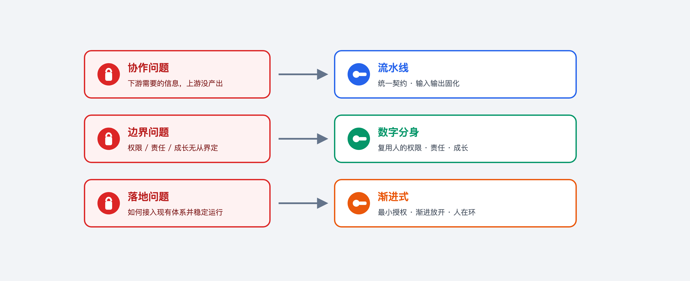

 _图 1-3　问题到答案_

三个答案汇总到一起，就是我们今天在跑的基于数字分身与流水线自动作业的研发交付体系。

#### 二、端到端交付流水线：四层架构与作业闭环

##### 2.1 作业闭环

基于数字分身与流水线自动作业的研发交付体系可以实现7×24小时不间断作业。数字分身既是需求入口，也是需求的路由器。产品、业务、技术角色均可直接向研发负责人的分身发送需求；分身接单后先做能力裁决，如果以当前能力可以承接需求，则一路从需求对焦 → 技术方案 → 编码 → 自检 → 测试执行下去，整条流水线自闭环；如果当前能力不能承接该需求，则转交对应负责人，走人工开发的模式。

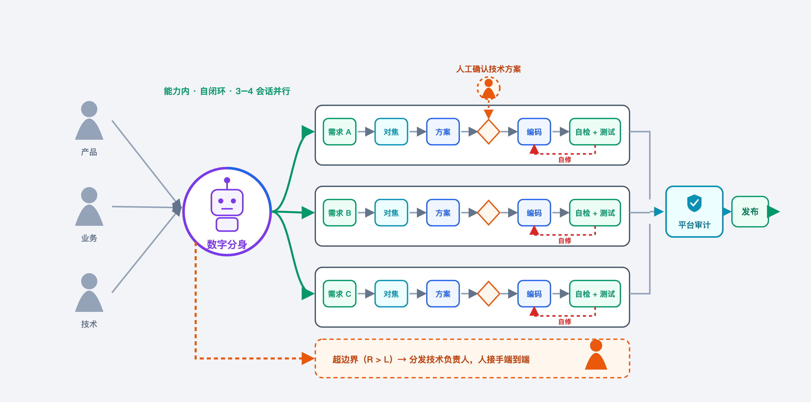

 _图 2-1　作业闭环_

##### 2.2 四层架构

数字分身与流水线自动作业的研发交付体系自下而上分四层组成。最底层是工具层，包括钉钉机器人、云端Agent执行平台等基础设施。其上层是应用物料层，为Agent作业提供规则和依据。流水线层是正式的作业环境，各角色Agent在流水线层协同作业。最上层是知识库与审计平台，实现审计归档与知识迭代。

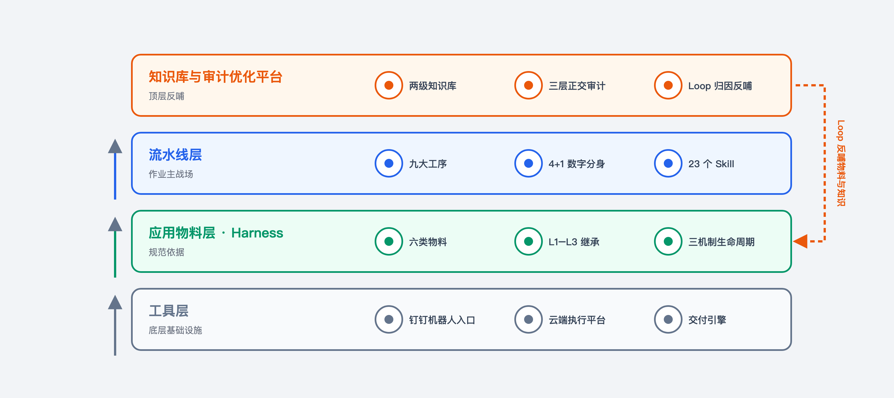

 _图 2-2　四层架构_

工具层的入口是钉钉机器人，业务方在钉钉向研发负责人的数字分身发送工作项。后续的需求澄清、进展同步、关键点裁决均通过钉钉机器人的IM会话与需求方交互。执行环境是云端执行平台，为每个工作项提供独立代码工作区与构建部署等功能，支持各角色Agent的协同作业。交付引擎是流水线的编排中枢，以状态图描述九阶段流程拓扑，负责编排、决策各角色Agent在各阶段的职责与工作内容。

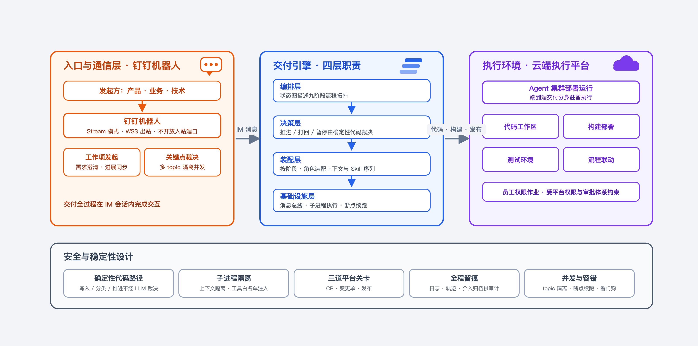

 _图 2-3　执行链路_

应用物料层把每个应用的隐性规范显性化为Agent可加载、可执行的约束物料。包括规则、项目宪法、应用描述、架构文档、历史经验、编码规范等六类内容，以统一索引入口供流水线不同工序按需加载。物料的完备度将直接决定分身的能力等级。

流水线层是作业主战场。通过定义九大工序，把交付链路切成明确的责任段，工序间以交付物驱动推进。执行主体是产品、研发、测试、质检加审计的数字分身，研发负责人Agent作为协调者的角色统筹各数字分身作业。数字分身作业的能力载体是可插拔Skill，不同业务线可以按需替换、增补，保障这套体系可以适配更多的场景。

知识库与审计优化平台在最上层。知识库把散落的原始物料蒸馏为结构化知识单元。审计平台在交付完成后做数据、产物、过程三个维度的检查，发现的问题经归因路由扩充物料和知识库，构成Loop闭环。这一层是让整套体系“越用越强”的关键。

##### 2.3 数字分身的装载

分身装载做成三步接入，前置条件齐备的情况下，单人2-3天完成整个系统的初始化：

1.接消息通道——为分身配置IM机器人，具备消息收发与会话交互能力。

2.建执行环境——在云端执行环境中为分身拉起独立执行空间。

3.填领域物料——完备目标应用的应用物料、补充领域知识库内容。

权限模型：分身借用人的权限作业，行为边界受既有平台权限与审批体系约束；系统里看到的，始终是人在提交、人在审批。分身借人的权限，责任始终锚定在人的身上。

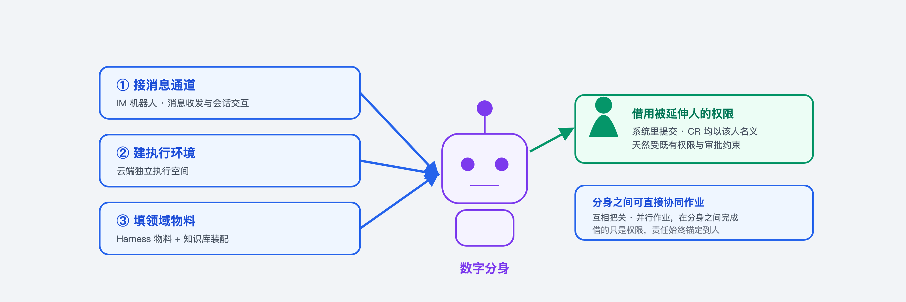

 _图 2-4　分身装载_

装载完成后，组织侧角色随之变化：研发负责人从逐需求执行者转为物料与Skill治理者 + 关键点裁决者。人退到需求确认与技术方案确认两个决策点，中间环节交给分身自主作业。

#### 三、三项关键设计：契约链、交叉质检、渐进式与 Loop

这套全流程Agent协作的研发交付模式要真正跑起来，必须同时满足三个性质：

1.信息在工序稳定传递。

2.分身之间能够自行协作把关。

3.整套体系不随使用而衰减。

三者分别对应三项关键设计：

1.基于契约链把每道工序的输入与输出固化为运行时契约，从结构上消除上下文丢失。

2.多分身独立作业、技术负责人Agent统一收口，实现多分身端到端协作。

3.渐进式与Loop把控能力边界的放开节奏与每次交付的审计反哺，使体系越用越强。

##### 3.1 契约链：工序间信息不衰减

多智能体协作的核心风险，在于上下文交接过程中的失真。契约链的解法是把每道工序的输入、输出与合格标准提前固化为契约：上一道工序的输出恰好是下一道工序的输入。工序之间不依赖人工转述与对接，信息不会在传递中走样。

契约链把流水线交付链路切分为九段责任明确的工序：

1.需求门控：以需求风险等级（R）对照分身能力等级（L），决定是否承接该需求。

2.需求对焦：通过圆桌对焦补齐需求要素、澄清边界，产出结构化spec.md。

3.技术方案：生成plan.md，经独立评审与人工确认后生效。

4.编码：以tasks.md的批次逐批编码实现，提交代码并自动在测试环境部署。

5.研发自检：由四个视角独立审查，交付自检报告。

6.测试：自动完成用例编写、环境搭建与执行，交付用例与执行报告。

7.平台质检：以平台级合规要求做旁路复核，交付质检报告。

8.审计归档：对整单做三层正交扫描，过程记录入知识库。

9.人工放行：由研发负责人复核产出物后合并上线。

九道工序以交付物驱动推进：任何一道工序的输入都来自上一道工序的正式交付物，每道工序的执行能力由可插拔Skill承载，可按业务线替换与增补。

契约链在工程上落为两条硬约束。第一条是强制交付物：每道工序必须有明确的正式交付物，技术方案阶段交付执行计划（plan.md），编码阶段交付代码与执行记录，自检阶段交付执行报告（check\_reports），测试与质检阶段交付用例、执行报告与质检报告。交付物缺失即视为工序未完成，不允许向下游推进。任何一环要继续流转，必须先拿出一份可被下游直接消费的正式产物。

第二条是交付物驱动的运行时校验。流水线对每次交接做三重校验——标签格式、修饰符、发送者身份，防止Agent以口头声明的方式自行推进流水线。被打回的交付物触发上游返工，就丧失了流水线的推进效力。保证产出不达标就当场打回重做，坏的半成品不往下游工序传递。

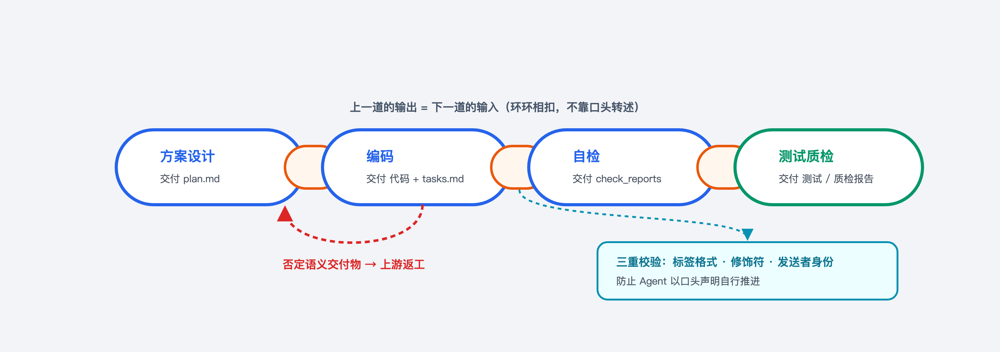

 _图 3-1　契约链_

契约链不是一次设计完成的静态规范，而是随交付经验持续生长的活约束。审计曾发现某类需求在技术方案环节反复回改、对话轮次异常偏高。问题的根因是物料层的规则模板缺少对应章节，Agent进入执行阶段才发现要素不全，只能回改方案再改任务，循环多次。待补齐该规则模板后，同类需求的返工显著减少。每一单交付都在为流水线补充更贴合实际的约束，这正是契约链与Loop的配合方式。

##### 3.2 多分身协作：独立作业，技术负责人 Agent 收口

多分身通过协作配合，实现端到端交付，从而减少人工介入。以质量保障环节为例，端到端交付要把质量校验与返工交给流水线自动执行。解决代码质量巡检、测试和验证环节人力不足的问题。

由于模型层面的偏见，研发分身审查自身产出时，天然倾向于判定交付物符合预期。为防止自查存在系统性的偏差，需要通过多分身从局外视角审查，才能得到可靠判断。

首先在自检工序中，产品分身、研发分身、测试分身、安全分身分别开启自己的会话、使用自己的工作区，不共享上下文，只加载diff、spec、规则与知识库。产品分身核对需求完成度；研发分身检查代码健壮性；安全分身审查修改的合规性；测试分身自动生成用例、执行测试验证，评估功能可靠性。四个视角各自输出带证据的结论。

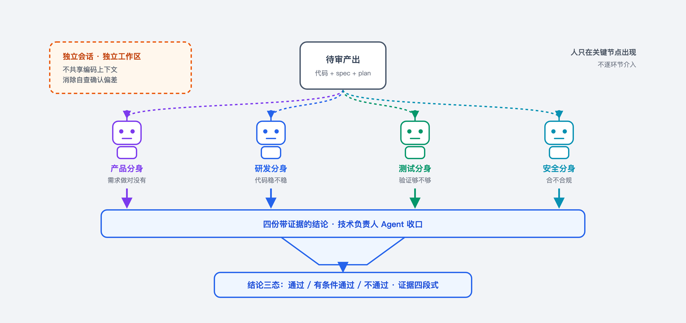

 _图 3-2　交叉质检_

然后是技术负责人Agent收口。四个视角的报告汇总到技术负责人Agent，对照声明式检查点逐项核验，给出最终判断：通过或打回。收口结论若为打回，则触发编码分身返工。直至四个分身均对交付物验收通过，再进入下一环节。

至此，质检一环既不需要人逐行评审，也不需要测试人员手动介入，长期卡住交付的人工瓶颈在这一环被机制正面解开。

##### 3.3 渐进式与 Loop：体系不随使用衰减

为防止整体系统随时间推移的逐渐腐烂，需要把能力渐进式放开与Loop归因反哺融合在作业过程中，推动能力边界向外不断扩展。

在数字分身的交付体系中，每个需求进入时评估风险等级（R），评估维度包括模块跨度、是否核心链路、有无高性能要求、是否涉及资金等高风险场景。分身的能力等级（L）由知识库与应用物料的完备度决定；R ≤ L才接单，R > L则转交对应负责人。渐进式的能力边界可以动态修改分身的能力等级，保障这套机制的持续有效性。连续成功若干次则可以提升数字分身的能力等级。如果在作业过程中出现多次交付物不符合预期，则需要降低数字分身的能力等级，将门禁收紧。实践发现，许多原本难以承接的复杂需求，随着一轮轮迭代使知识库与物料不断完善，也能够拆分成若干子需求交给数字分身完成。数字分身的能力范围会随需求的不断交付持续外扩。

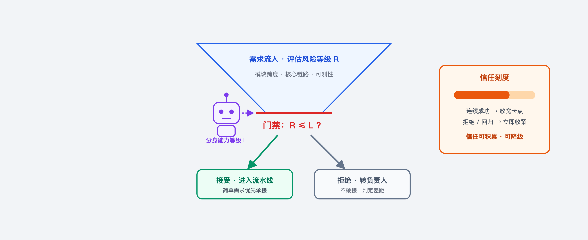

 _图 3-3　渐进式需求门控_

数字分身的能力不断外扩依赖于Loop机制，把每次交付过程沉淀的数字资产转化为下次需求执行的输入。数字分身每完成一次需求交付，在审计归档工序就自动执行一次审计。主要包括三层正交扫描：

1.数据层核对需求的规格与方案产物是否齐全。

2.产物层对各过程产物做跨文件联合分析，检测工序间配合度。

3.过程层从会话日志还原执行轨迹，回看token消耗、人工介入次数等效率指标。

审计的输出不是打分，而是归因。归因路由分三条：

1.规则与模板缺陷路由至应用物料迭代。

2.技能与工具问题路由至工具链整改。

3.知识缺口与错误进入知识库台账，分批建设为结构化知识。

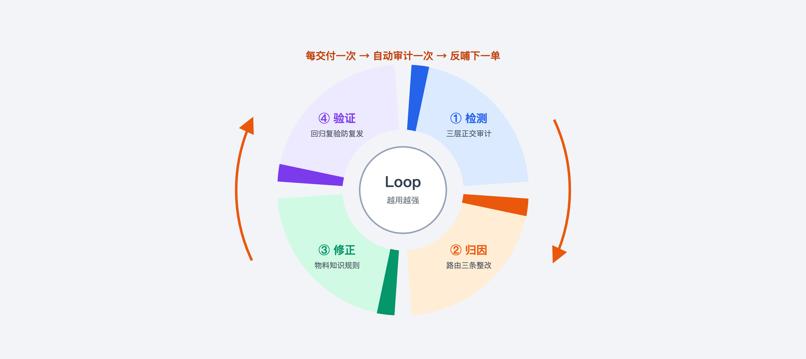

 _图 3-4　Loop 闭环_

修正后的物料、知识与规则经验证后全局生效，并在下一次审计与回归评测中复验。每一次问题都被沉淀为一条能够防止复发的规则。检测、归因、修正、验证四步循环往复，使得体系随使用持续变强。

#### 四、一个简单需求的端到端交付之旅

本章看一单真实需求怎么跑完整条流水线（业务信息已脱敏）。

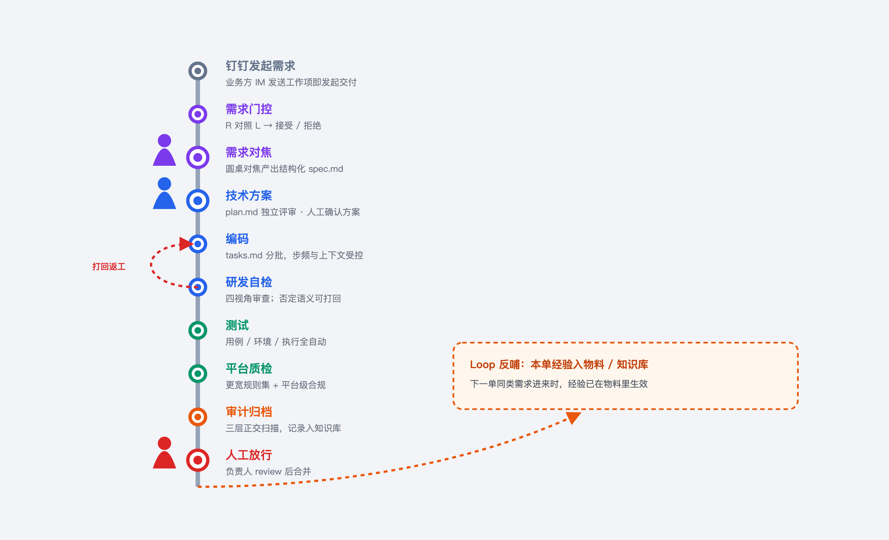

 _图 4-1　端到端全链路_

需求本身属于典型的“简单需求”——单模块、非核心链路、可自测。业务方在钉钉里把需求发给分身，分身接单后先做需求门控裁决：用需求的风险等级对照自身能力等级，输出接受或拒绝。这一单裁决为接受，进入流水线。

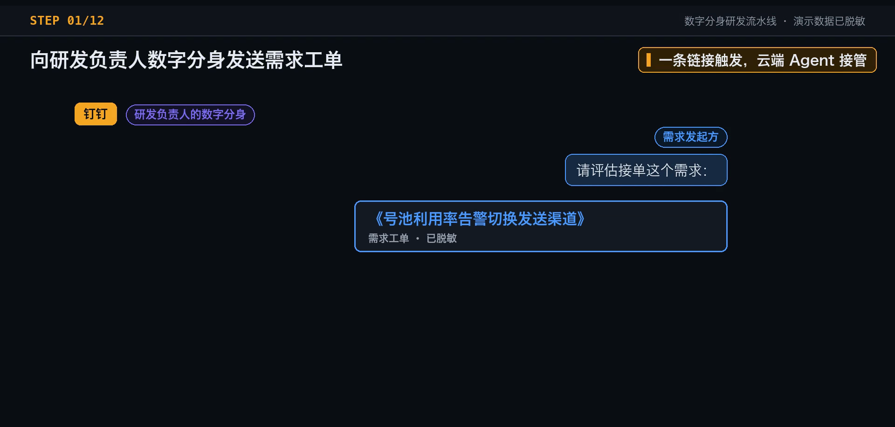

 _图 4-2　钉钉发起需求_

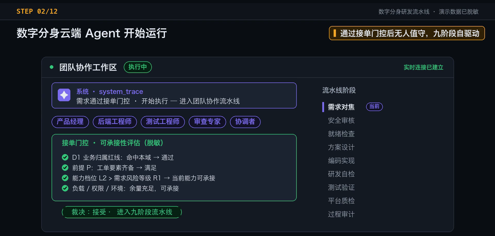

 _图 4-3　需求门控_

之后是需求对焦与技术方案阶段。圆桌对焦产出结构化spec.md，补齐需求要素、澄清边界。技术方案生成plan.md，先由测试角色独立评审，再由技术负责人做方案确认。技术负责人需要确认三件事：

1.方案是否完整覆盖spec承诺的场景与边界。

2.架构与中间件选型是否符合应用约束。

3.风险与回滚路径是否明确。

确认结论留痕，供审计归档。确认不通过时打回方案工序修订，修订后重新评审与确认，方案级偏差由此被锁定在编码开始之前，不会到自检或测试阶段才暴露返工。

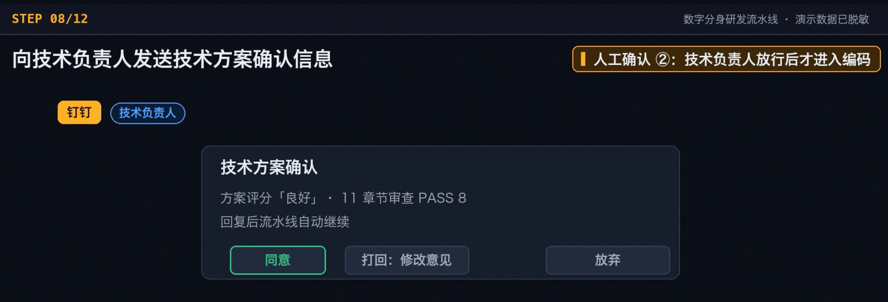

 _图 4-4　技术方案确认_

编码阶段以tasks.md把变更拆分为若干批次，每批次的步频与上下文复杂度控制在模型稳定处理范围内。编码完成后进入研发自检，四视角依次运行。这一单在自检阶段被打回过一次——一处变更超出tasks 定义范围，研发分身重做。坏的半成品不允许流到下一道工序。

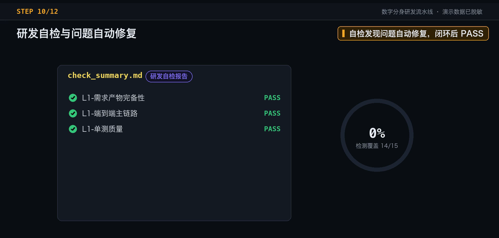

 _图 4-5　研发自检_

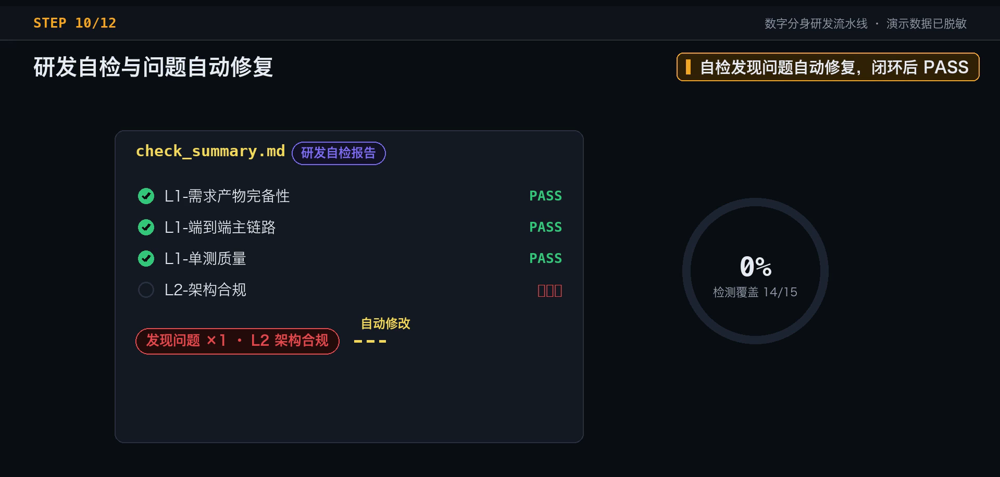

 _图 4-6　自检打回_

测试阶段全自动执行——用例自动生成、环境自动搭建、执行自动运行。本次全部执行通过。如果一处接口返回不符合预期，测试分身定位根因、回传研发分身修复，再跑一轮自动化测试。直至所有测试用例运行通过。

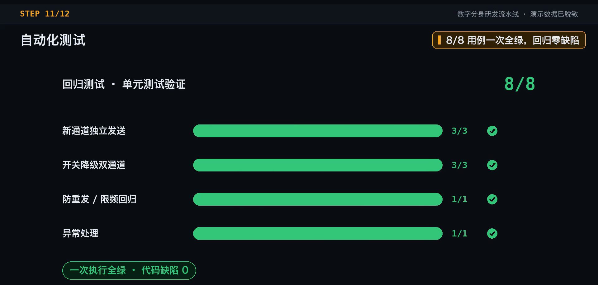

 _图 4-7　测试全自动_

最后是审计归档。审计做三层正交扫描，过程记录归档进知识库——下一单同类需求进来时，这一单的经验就已经在物料里生效了。归档完成后进入“待交付”状态：代码已提交分支、测试已通过、审查已完成。

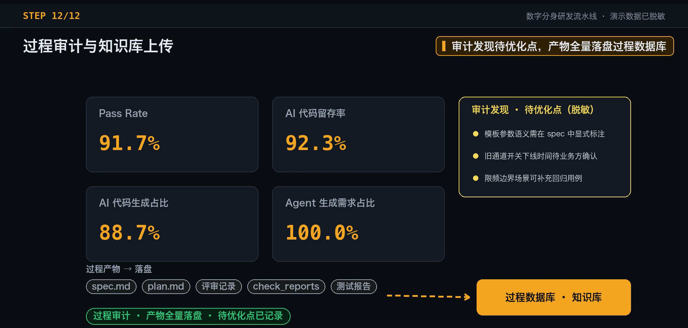

 _图 4-8　产物审计_

可接管、可追溯、可验收——每一步由谁执行、依据什么执行、结果如何，全程留痕、事后可查。这是我们敢把数字分身真正放进生产环境的根本原因。

#### 五、未来规划与展望

目前简单需求的端到端交付已经稳定跑通，我们未来的规划投入主要聚集在三个方向。

方向一 · 能力边界持续外扩——物料与经验的积累会推动分身能承接的需求不断变复杂。目标是让“从简单需求起步、边界一步步外扩”，把更多跨模块、跨应用的复杂需求也纳进来。

方向二 · 成本治理——成本底线是端到端做一个需求不能比人工更贵。主要的方案是模型分档、上下文管理、错峰执行，控制让交付成本不随需求量线性上涨。

方向三 · 适配组织形态演进——织形态也可能被重构，怎么排兵布阵、怎么衡量产出，都是新课题。后续有可能建立一个工程师将带着若干数字分身，组成人机混编的小团队的交付模式，使团队吞吐量不在受限于人头数。

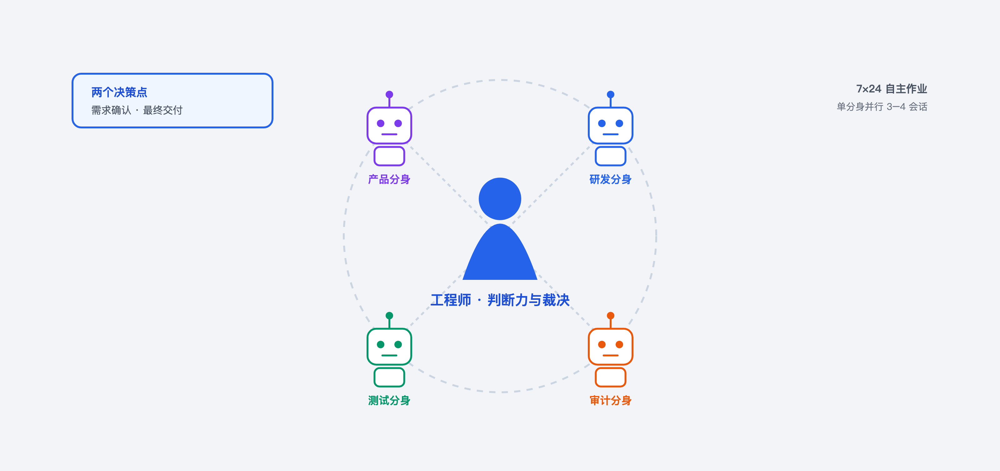

 _图 5-1　人机混编的小团队_

今天大模型正从通用能力走向企业生产落地。模型可以把通用知识学得很透彻，但你所负责领域的知识往往是非标、私有的。如架构演进、历史遗留、术语黑话等内容，通用大模型不可能一次就知道。所以真正靠得住的不是模型能力，而是围绕模型建起的一整套交付体系与资产。通过定义面向AI Native的标准作业方式，利用渐进式的迭代演进模式，探索出一条适配自身业务特性的人机协作机制，逐步从编码提效走向端到端交付。


<a id="sec-045"></a>

### 从评测驱动到端到端交付：AI Agent 安全产品研发提效实践
#### 一、AI Agent 产品研发的效能瓶颈在哪里？

AI Agent 产品进入生产环境后，研发面对的是持续变化的任务、数据和执行路径。一次模型升级、提示词调整或工具修改，可能解决当前问题，也可能影响其他场景。如何证明修改有效、如何避免重复返工，成为交付过程中的关键问题。

Agentic SOC 是以多 Agent 协作为核心的安全运营产品，将多云、多安全产品的分散告警归并为可调查、可处置的安全事件，覆盖告警研判、调查响应、威胁狩猎和运营闭环。真实生产中的失败、用户纠偏和任务结果，为研发持续提供改进输入。

这些输入也暴露出两类瓶颈：技术侧缺少稳定的验证机制时，团队难以判断能力是否真正改善；组织侧按岗位分段交付时，目标需要多次解释，变更需要经历排期、交接与集中验收。单个任务执行加快后，等待与协调便成为更突出的约束。

因此，提效需要同时打通两条链路：将生产问题转化为可验证的能力改进，将跨职能工作贯通为共同客户结果。前者减少试错与返工，后者缩短等待与交接。

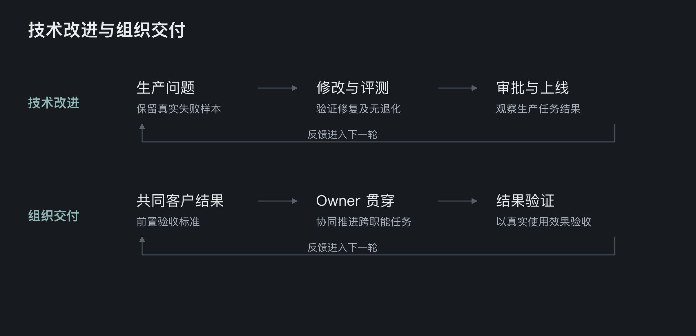

#### 二、从一次缺陷修复，到可持续复用的研发资产

一个典型问题是攻击者与受害者识别反转：实际情况是 A 攻击 B，报告却输出 B 攻击 A。这类错误会影响调查结论，甚至影响后续处置方向，不能仅通过修改报告措辞解决。

定位发现，报告、时间线和处置建议三个模块分别推断角色，缺少共享判定。各模块都可能给出看似合理的解释，但组合起来却产生矛盾。根因在于角色语义没有被统一表达和复用。

实际改造是生成统一的攻击者、受害者及判定结果字段，再由三个模块读取。这样，研发将分散推断转化为共享的结构化结果，使修复对象从单份报告扩展到模块间的一致性。

修改后重跑原任务，确认 A 为攻击者、B 为受害者，报告、时间线和处置建议保持一致。角色字段与读取逻辑进入正式版本，原缺陷样本则纳入评测基线，在后续模型、提示词和规则变更时持续复测。

这一过程形成两类资产：共享字段承载明确的业务语义，回归样本保存曾经失败的条件。下一次迭代时，团队可以复用判断标准，更早发现同类退化，降低重复定位与重复修复的成本。

对研发团队而言，缺陷处理的终点由“当前输出正确”延伸为“正确行为可以持续验证”。生产经验由此进入工程体系，而不再只保留在处理人的记忆中。

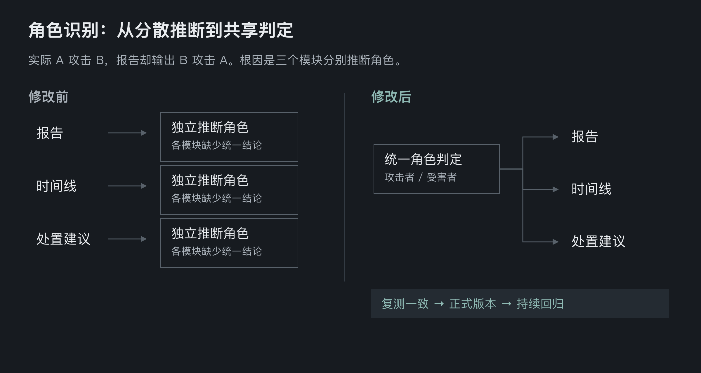

#### 三、评测驱动研发：明确每次迭代的方向与完成标准

##### 建立可比较、可复现的评测基线

Agent 的任务结果通常包含多个环节。最终报告看似完整，不代表入口判断、证据关联和影响范围都正确。有效的评测需要同时观察结果质量、执行过程和分项能力，将笼统的“效果不好”拆解为可定位的问题。

Agentic SOC 使用 SOCBench 构建版本化基线，包含 211 个真实调查任务，覆盖 16 类任务场景、9 个评分维度和 5 个调查阶段。题集按照生产中的发生频率与风险设计，既覆盖常见攻击，也保留低频高风险任务，并纳入 12 道安全测试与环境噪声题，检查授权行为是否被误判为攻击。

长链任务按环境定位、入口确认、主链还原、影响扩展和调查结论累计评分。题集、执行配置与评分规范统一版本化，使候选变更在明确条件下比较，避免测试条件变化干扰版本判断。

##### 将评测反馈接入修改与发布流程

评测承担三个连续职责：定位弱项、验证改进、持续回归。失败样本帮助研发确定修改方向；候选版本需要证明原问题已修复，并检查约定范围内是否出现退化；新发现的失败继续进入回归集。

发布前进一步结合缺陷复测、独立测试集评估、生产任务重放和灰度验证。通过评测意味着形成候选版本，最终上线仍需依据评测证据与风险进行人工审批。

评测体系对研发效能的直接价值，是缩短“提出修改—确认有效”的反馈周期。团队可以依据具体能力缺口分配投入，提前识别退化，并复用验证过程。评测本身需要维护，其收益来自后续迭代中持续减少的不确定性与重复工作。

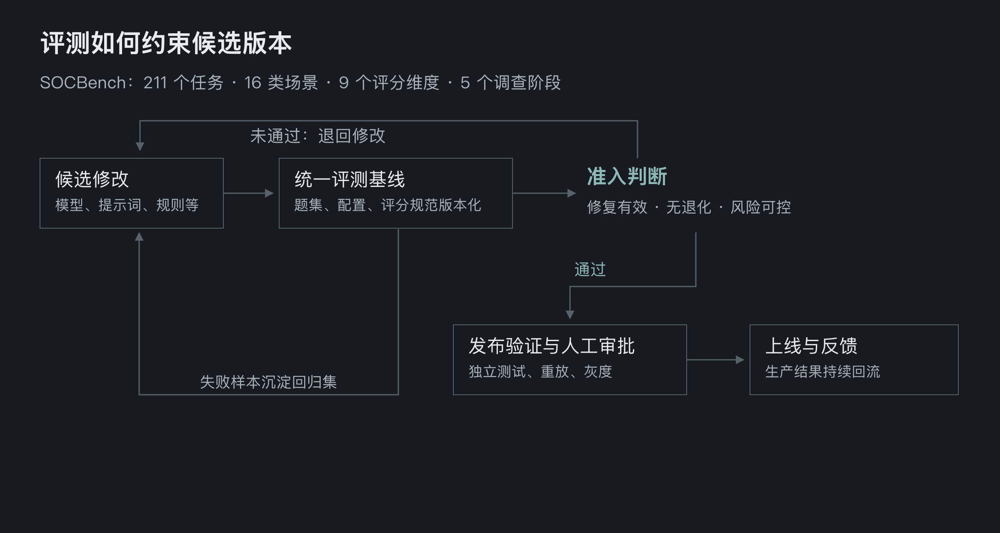

#### 四、受控自主：扩大 Agent 可承担的研发任务范围

当任务目标和完成条件可以明确描述时，Agent 能承担更多分析、修改与验证工作。但自主推进需要边界，否则偏离目标或无效重试会消耗更多研发时间。

目标边界规定要解决的问题、优先级、输入范围与预期产物；质量边界要求原问题复测通过、约定范围不退化，证据不足时不能输出确定结论；权限边界限定可访问的数据、工具与环境，并要求生产变化可追踪、可回滚；停止边界规定异常、无法可靠判断时转交人工。

四类边界把口头委派转化为可执行约束。标准明确、可评测、可回滚的任务，可以由 Agent 在授权范围内推进；高风险、高歧义及不可逆任务，需要专业人员主导。

人机协作由此从辅助执行，逐步发展到单步自主，再到边界内完成分析、修改与验证闭环。提效来自减少逐步人工操作，将专家注意力集中到关键判断。目标、质量标准和最终生效权仍由人定义，自主范围应随验证能力同步扩大。

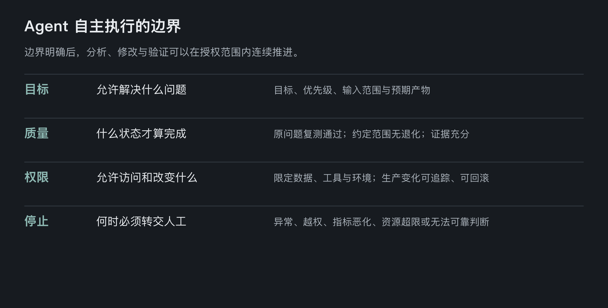

#### 五、重构交付协作：让技术提效转化为需求周期缩短

Agent 侧形成任务闭环之后，产品交付仍可能停留在串行协作中：产品完成需求，设计完成交互，安全明确口径，前后端分别实现，测试最后集中验收。每个岗位都有局部完成标准，最终结果却要等到链路末端才能验证。

缩短链路需要重建四项机制。首先，统一客户结果，让功能效果、真实使用与业务价值成为共同目标。其次，前置结果标准，使各职能开工前就使用一致的指标与证据口径。再次，指定一个 Owner，从问题定义负责到结果验证，协调依赖并调度 Agent。最后，领域专家按风险介入，在关键节点把关。

在这一机制下，产品体验、工程交付与安全效果能够围绕同一组验收条件并行推进。产品判断通过可运行原型尽早验证，安全口径在设计与实现阶段进入系统，工程实现持续接受效果反馈。偏差更早暴露，末端集中联调与返工的压力随之降低。

岗位职责也随之扩展。产品经理开始交付部分前端和可运行原型；安全工程师参与产品设计与工程实现，把领域经验转化为可评测能力；研发工程师完成前后端闭环，并向前理解客户需求、产品路线和商业影响。Agent 为这些职责扩展提供执行支持。

职责扩展仍需遵循风险分工。跨领域且风险可控的任务，可由 Owner 借助 Agent 完成；高风险、高不确定性任务仍由专家主导。组织优化的重点是减少无必要的交接，同时让专业判断及时进入流程。

相应地，团队需要增强问题结构化、AI 任务编排、端到端工程交付和业务价值判断能力。衡量个人贡献时，也逐步关注可运行结果与客户效果，使责任范围、执行能力和评价标准相互匹配。

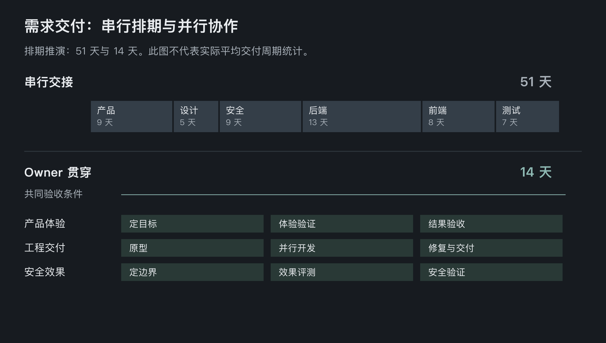

#### 六、总结

AI Agent 产品研发的持续提效，需要将真实问题、工程改进和客户结果连接起来。生产中的失败与用户纠偏提供改进方向，统一评测提供判断依据，贯穿全程的责任机制则推动改进完成交付。三者共同决定了团队能否将更快的执行速度转化为更短的交付周期。

在技术层面，应把一次问题处理沉淀为可复用的产品能力与验证资产。共享业务语义减少模块间的重复推断，版本化评测使候选变更可比较、可复测，失败样本持续参与回归，让后续迭代能够复用已有经验。质量、调用成本与执行耗时共同构成优化依据，帮助团队减少无效试错和重复返工。

在执行层面，目标、质量、权限和停止条件为 Agent 自主工作提供边界。标准明确、可评测、可回滚的任务可以连续推进，专业人员则集中处理高风险和高不确定性判断。自主范围的扩大，需要与验证能力和风险控制能力同步。

在组织层面，共同客户结果、前置验收标准和端到端 Owner 将跨职能工作贯通起来。产品体验、工程交付与安全效果围绕同一结果协同推进，使偏差更早暴露，减少排队、交接和末端返工。岗位职责随之扩展，团队也需要同步增强 AI 调度、工程交付与业务判断能力。

Agentic SOC 的实践表明，技术闭环与组织协作需要共同演进。研发效能的长期来源，是让每次失败积累为下一次迭代的验证依据，让每次交付沉淀为团队可复用的能力，并持续以真实客户结果检验这些改进的价值。


<a id="sec-046"></a>

### 多 Agent 组成研发小队：AI 研发如何从写代码走向端到端交付
Coding Agent 正在快速提升代码生成的速度，但一个 Feature 从需求到上线，还要经过需求澄清、方案设计、测试、Review、联调和发布。只优化 Coding，就像只提升一条生产线上的单台设备：局部吞吐上去了，等待、交接、验证和返工仍然决定整体周期。

我们因此把目标从“让 Agent 写代码”，调整为“让一支 AgentTeam 交付结果”：由 AgentCore 组织不同角色的 Agent 协作，让任务从 Issue 进入，经过研究、方案、实现、验证，最终产出可审查的 PR 和完整证据；再由 AgentLoop 采集真实运行轨迹，持续评估和改进这套研发小队。

#### 一、Coding 已经很快，交付为什么仍然慢？

以团队中一个复杂 Feature 的典型链路估算，从需求到上线约需要 20 个工作日，其中代码实现约 2 天。即使 Coding Agent 把编码速度提升 10 倍，编码时间从 2 天降到 0.2 天，端到端周期也只是从 20 天降到 18.2 天。

原因很直接：研发不是一段代码生成任务，而是一条需要多人、多系统和多轮判断共同完成的链路。需求与 Spec 要反复对焦，方案要结合既有架构，测试与 Review 要等待反馈，跨模块联调依赖环境，发现问题后还可能回到 Spec、方案或编码阶段返工。

所以，下一步提效的重点不是继续压缩那 0.2 天，而是让 Agent 能够接管并串联剩余流程：减少上下文在角色之间的反复转述，让验证结果直接驱动下一步，让人只在目标、架构与风险判断上介入。

#### 二、AgentTeam：把多个 Agent 组织成一支研发小队

AgentTeam 不是让多个 Agent 同时“自由发挥”，而是建立一个角色明确、状态可见、交付物可验证的协作系统。我们把 15 个面向不同工序的 Agent 组成能力池，由 AgentCore 作为 Leader，根据任务状态按需调度。

其中，几类代表性角色分别承担不同职责：

| **角色** | **主要职责** | **关键产物** |
| --- | --- | --- |
| Researcher | 理解需求与代码库，构建问题证据地图 | 相关模块、约束与历史变更 |
| Explorer | 寻找同构实现，形成候选方案 | Reference Anchor 与方案比较 |
| Spec | 把目标、边界和验收条件结构化 | 可执行 Spec |
| Code Worker | 在独立分支和会话中实现候选方案 | 代码变更 |
| Test / Harness | 编译、测试和端到端验证 | 可复现的测试证据 |
| Judge / Verify | 独立做候选选优、语义验收和对抗审查 | 审查结论与失败反馈 |
| Deploy | 准备环境并执行发布验证 | 发布与回滚证据 |

AgentCore 负责的不是某一次生成，而是整个团队的运行：拆解任务、调度角色、保存状态和共享上下文，并根据失败类型选择下一步。测试失败，回到同一个 Code Session 继续修复；方案方向错误，带着失败证据重新进入 Research 和 Explore；持续不收敛，则触发 Human Gate，请人补充判断。

任务的输入可以是 Issue，也可以来自 Chat 中的人工补充；输出不仅是代码与 PR，还包括测试报告、审查证据、进度与阻塞状态，以及完整的可观测轨迹。这样，研发交付从“几个人分别完成一段工作”，变成“一个团队围绕同一状态和同一验收标准持续推进”。

#### 三、Coding Loop：不是一次生成，而是持续收敛

多 Agent 协作能否可靠，关键不在 Agent 数量，而在协作机制。我们把最核心的 Coding Loop 设计成两层回环：内层解决“代码能不能跑”，外层判断“方案是不是对”。

首先，Researcher 从需求、代码和历史变更中建立证据地图；Explorer 再找到代码库中最相似的实现，形成一个或多个候选方案。不同方案进入独立分支和独立 Code Session，由 Code Worker 与 Test / Harness 组成内层循环：测试失败就保留上下文继续修复，直到通过或确认卡住。

候选实现完成后，由独立的 Judge / Verify 进行选优和验证。这里不仅检查测试是否通过，还要判断需求语义是否满足、是否偏离既有架构，以及是否存在“测试绿了但实现方向错误”的问题。验证通过才交付 PR；边界缺陷保留代码做增量修复，方案级错误则回到 Research / Explore 重新选择路径。

这套 Loop 有四个关键设计：

1.  **参考锚定**：先找同构实现和架构约束，再设计方案。已有代码不是绝对真理，但通常是最精确、最新鲜的工程参照。
    
2.  **Produce / Verify 分离**：作者与 Judge 使用独立会话，避免同一个 Agent 用自己定义的标准证明自己正确。
    
3.  **带记忆迭代**：同一方案续接 Code Session，Research 也保留历轮失败反馈，避免每次返工都从零理解。
    
4.  **分级验证**：正确性、安全和架构偏离必须修复；非阻塞改进项记录留档；连续不收敛时及时转人工。
    

因此，AgentTeam 的工作方式更像一支真实研发小队：有人研究，有人实现，有人独立审查，失败后依据证据返工，而不是把一个大 Prompt 交给单个 Agent 一次性完成。

#### 四、从单次交付到持续进化

AgentTeam 跑通一次任务，只能证明流程可用。业务规则、代码和运行环境会持续变化；Prompt 或 Skill 的局部调整，也可能让其他任务退化。如果没有真实数据驱动的持续调优，Agent 会重复踩坑、反复消耗，最终仍要依赖人工兜底。

为此，我们用 AgentLoop 承接 AgentTeam 的数据飞轮。AgentCore 负责持续执行，AgentLoop 采集 Trace、Session 和 Trajectory，还原每一步模型调用、工具执行、失败和返工；再通过 Pipeline、Dataset、Evaluation 和 Experiment，把真实问题转化为可复现样本、可比较指标和可回测实验。

目前主要有两条调优路径：

*   **离线 Meta-Loop**：从人类专家的历史 Commit 反向整理题目，让 AgentTeam 在看不到答案的条件下独立解题；再比较 Diff 和执行轨迹，定位 Skill、Tool、状态流转或 Harness 的问题，调整后用同题和留出题回测。
    
*   **在线 Experience Loop**：真实任务的 Trace 自动上报，从成功与失败轨迹中提炼 SOP、工具调用路径、修复规则和反模式；经过来源、适用边界和效果验证后，在下一次相似任务中按语义召回，动态注入 Researcher、Explorer 或 Worker 的上下文。
    

这让每次交付不只产出一份代码，也为下一次任务留下可以复用的经验和验证资产。

#### 五、阶段性结果：先证明流程跑通，再证明规模化收益

目前，这套 AgentTeam 已在两个实际任务中完成从需求到上线的闭环：一项是修复 Trace2Trajectory 的非标轨迹清洗问题，另一项是为数据处理管线增加新的算子。两项任务都完成了代码修改、测试验证、审查和上线，证明多 Agent 的协作链路已经能够进入真实研发流程。

在离线校准中，我们共整理了 24 道内部基线题，其中 19 道作为未参与调优的新题进行盲测。逐题对照专家代码后，结果为：10 道等价、5 道接近、4 道部分完成、0 道方向错误。这个结果说明当前方法能够帮助我们发现和修正结构性问题，但它是内部题集上的对照结果，不等同于生产环境通过率。

在线交付方面，当前少量 Feature 样本观察到的团队交付节奏约为一周。由于样本量仍小，且尚未按任务复杂度分组，这个数字更适合作为阶段性观察，而不是普遍结论。后续我们会持续跟踪独立验收通过率、人工 Review 投入、单位交付成本和上线后缺陷，判断提效是否真正成立。

AgentTeam 的目标不是用 Agent 取代研发，而是重新分配人的注意力：把可执行、可验证、可回放的工作交给 Agent，把目标、架构、风险和最终放行留给人。AgentCore 让多个 Agent 像团队一样工作，AgentLoop 让这支团队从真实交付中持续改进。只有执行闭环和数据飞轮同时建立，Coding Agent 的局部速度，才可能真正转化为端到端交付效率。


<a id="sec-047"></a>

## 第 26 章　设计工程


<a id="sec-048"></a>

### GenUI：让 Agent 从给出答案走向交付结果
#### 一、背景与问题驱动

> 真正卡住体验的不是模型答得好不好，而是结果交付的“最后一公里”： 用户拿到的是一段文字，却需要做的是比较证据、判断风险、然后动手操作。

在 Agentic 用云、管云场景里，用户对结果的要求不止“读懂”： 用户需要横向比较几组证据，判断某个操作的风险，然后在当前上下文里直接把动作执行掉。 现有的两种表达方式均具有局限性：

*   **纯文本** 擅长解释和开放表达，但一旦需要对比多组指标、定位异常时间点、或者发起一个带确认的操作，它的组织能力和操作能力都不够。
    
*   **固定页面** 擅长承载稳定、高频的流程，但它必须提前设计；而 Agent 在运行时产出的结果形态是长尾的，无法提前穷举出对应的页面。
    

GenUI 补上了这段“最后一公里”：由 Agent 依据本次任务的真实结果，动态组织结论、证据和可执行操作， 让用户在对话里看懂发生了什么，并直接继续完成任务。

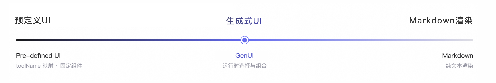

Markdown

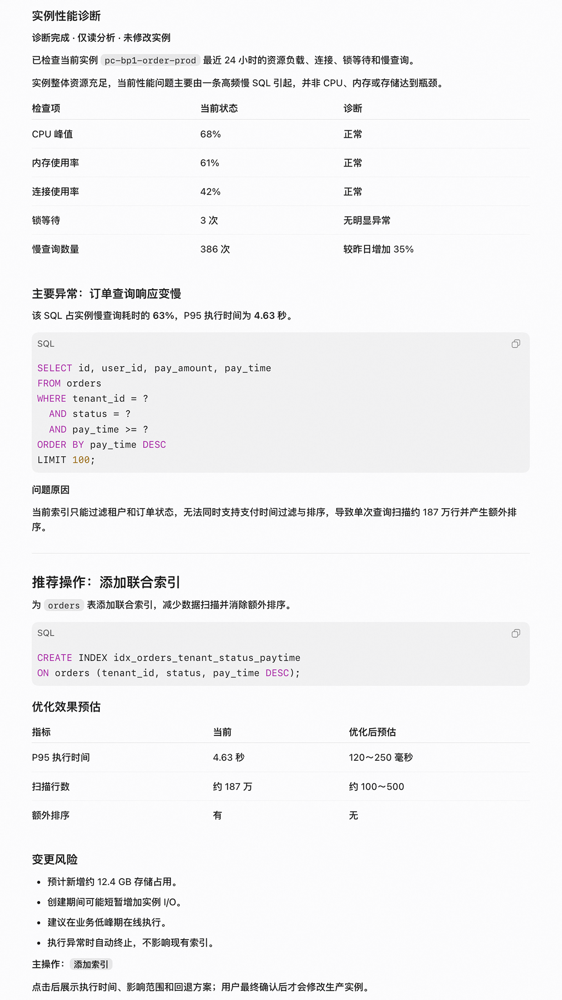

GenUI


#### 二、GenUI 的设计思想

**GenUI（Generative UI，生成式 UI）是一套机制**：让 Agent 在运行时依据任务上下文和业务结果， 在受约束的范围内动态组织内容、组件与操作，交由客户端渲染成界面。 它的产物是界面，但它本身是“生成 + 约束 + 渲染”的一条链路，而不是某一张具体的页面。

它不替代自然语言，也不替代固定页面。三者的分工是清晰的： **自然语言**负责开放表达与解释，**固定页面**负责稳定高频的既定流程， **GenUI** 把富表达和富操作延伸到无法提前穷举的长尾任务。

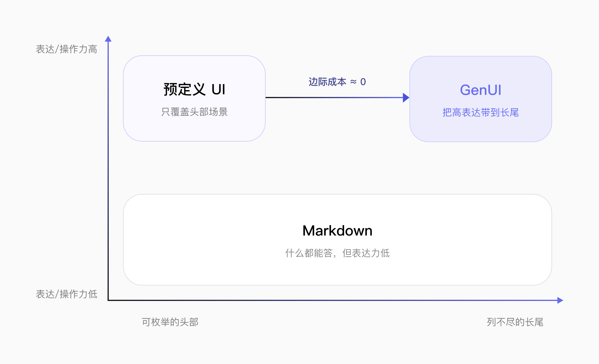

###### 共享设计资产：约束 Agent “能用什么”和“该怎么用”

Agent 的生成自由度需由资产约束，否则一致性无从谈起。CloudAI GenUI 把这些约束沉淀为一套**共享设计资产**， 与具体协议无关，由适配层再翻译成各协议的数据契约：

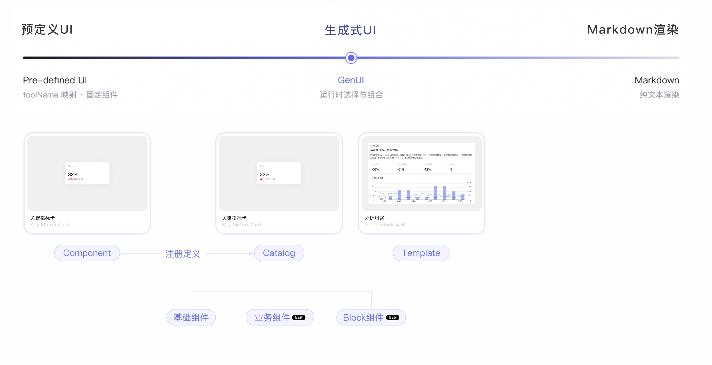

CloudAI 设计资产

| **资产** | **约束什么** | **说明** |
| --- | --- | --- |
| **Catalog** | “能用什么” | 本次任务可用的组件清单及其数据与操作契约，是生成的硬边界。包含通用基础组件、业务组件、语义组合组件（Block） |
| **Template** | “通常怎么组织” | 按常见任务意图给出推荐的信息结构与示例结构，帮助 Agent 收敛组织方式 |
| **使用规则** | “该怎么用” | 信息层级、组件选择、风险提示与操作确认等规则，避免随意拼装 |

> “Catalog” 一词在协议侧也存在（例如 A2UI 用 catalog 表示客户端已声明的可用组件类型集合）。 本文中 **GenUI Catalog** 指跨协议共享的设计资产， **协议侧 catalog** 指由适配层从它生成的、面向某个具体协议与渲染器的组件清单。

最终界面仍由 Agent 根据本次任务的上下文与业务结果动态生成。 之所以“动态”不等于“不可控”，是因为确定性并不来自生成过程，而来自它的三重约束： **Catalog 白名单限定可用元素**、**Schema 校验拦截非法结构**、 **客户端可信组件独占渲染实现**。灵活性归 Agent，确定性归客户端。

###### 为什么是声明式，而不是生成界面代码

GenUI 的核心不是让模型直接产出 HTML、JavaScript 或 JSX，而是让 Agent 用结构化数据声明 **“需要呈现什么”**，再由客户端决定**“具体如何呈现”**。

直接生成界面代码有两个绕不过去的问题：一是输出空间是开放的，品牌一致性和交互边界都难以约束； 二是它把模型生成的内容直接送进了可执行边界。面向生产系统，Agent 的输出需要是 **声明式** 的、限定在已知元素内、并且能在渲染前被校验——这就是选择结构化 UI 描述的原因。

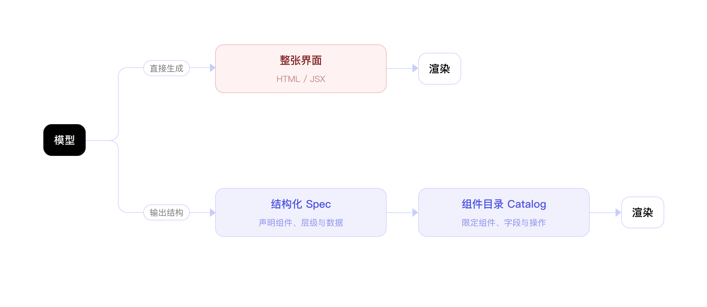

这一方式遵循三项原则：

1.  **业务结果与界面表达解耦**：业务结果是事实源，协议数据只负责如何呈现，可以随上下文重新组织。
    
2.  **表达语义与视觉实现解耦**：Agent 选择指标、证据、风险和操作等语义，品牌、布局、样式和交互由客户端的可信组件实现。
    
3.  **设计知识与技术框架解耦**：Component 语义、Block、Template 意图和规则作为共享设计知识，再由适配层转成不同协议的数据契约。
    

#### 三、关键特性与优势

###### 设计资产提升 GenUI 生成质量

json-render、A2UI 提供生成与渲染机制，shadcn 提供基础组件，但仅有协议和基础组件时，信息层级、组件组合与操作边界仍主要依赖 Agent 临时组织。我们通过 Block、增量 Catalog、Template 与使用规则将设计经验带入生成过程，使 Agent 在动态组织内容的同时，生成结构更清晰、体验更一致、操作边界更明确的产品界面。

Before：基于 shadcn 基础组件直出生成效果

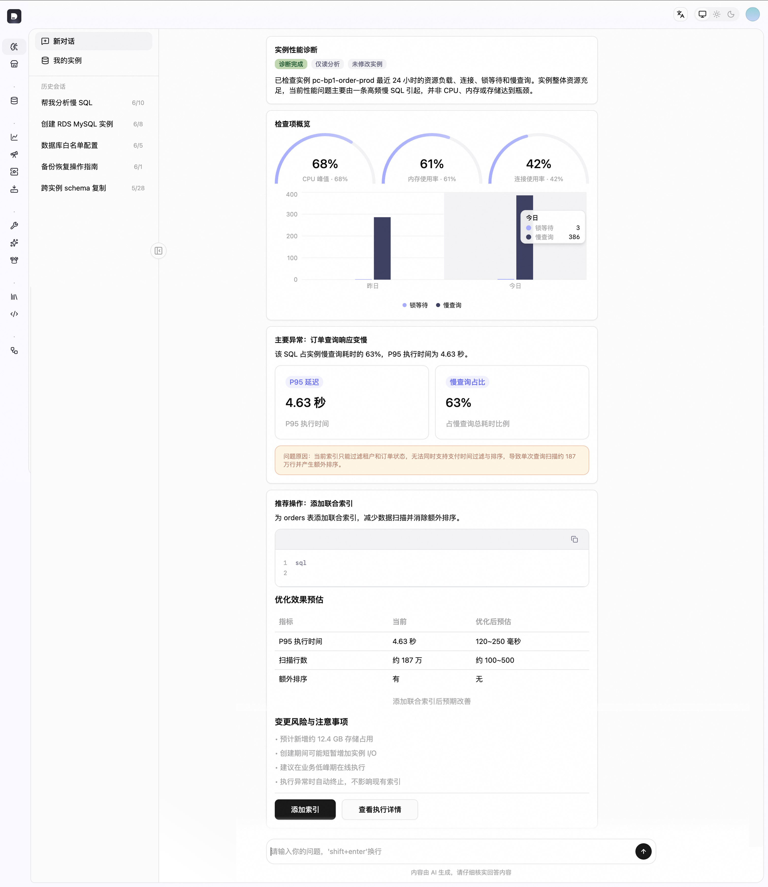

After：接入设计资产后的效果


###### 从呈现结果到完成任务

GenUI 不只展示业务结果。当任务需要用户继续参与时，界面可以提供输入、选择、确认和操作入口，并将用户操作回传给 Agent，继续驱动业务执行与界面更新。用户无需离开当前上下文，就能从理解结果自然进入下一步操作，持续推进任务。

[请至钉钉文档查看附件《钉钉录屏\_2026-08-31 181443\_20260831181517.mp4》。](https://alidocs.dingtalk.com/i/nodes/amweZ92PV6DbOdgzUqdEz43G8xEKBD6p?iframeQuery=anchorId%3DX02mth319ezo72x8ssnpmg)

Template示例

###### 输出可校验，问题可追踪

Agent 输出的是结构化协议数据，而不是可执行的 HTML / JavaScript / JSX。数据先经 Schema 校验，再映射为可信的客户端组件。 这带来三件事：结构问题（未知组件、字段类型错误、引用缺失）在渲染前就能被拦下； 脚本注入与不可预期交互的风险被显著降低；协议数据本身是可记录、可比对的产物，为回放和问题定位留出了接口。

在流式场景下，校验粒度是**按消息、按节点**进行的：渲染器逐条消费增量消息，边校验边渲染， 未通过校验的节点降级或跳过，而不是等整屏数据齐备后才开始渲染。

:::
🌰 **Json Render Case**

:::
Spec

```mysql
{
  "root": "insight",
  "elements": {
    "insight": {
      "type": "InsightBlock",
      "props": {
        "tag": "analysis",
        "title": "慢日志是当前性能问题的主要原因",
        "summary": "实例整体资源充足，慢日志峰值与资源波动同步出现，优先治理高频慢 SQL。"
      },
      "children": [
        "metrics",
        "evidence"
      ]
    },
    "metrics": {
      "type": "Grid",
      "props": {
        "columns": 4,
        "gap": "sm",
        "className": null
      },
      "children": [
        "cpu",
        "memory",
        "connections",
        "locks"
      ]
    },
    "cpu": {
      "type": "MetricCard",
      "props": {
        "badgeText": "CPU 峰值",
        "title": "68%",
        "description": null
      }
    },
    "memory": {
      "type": "MetricCard",
      "props": {
        "badgeText": "内存使用率",
        "title": "61%",
        "description": null
      }
    },
    "connections": {
      "type": "MetricCard",
      "props": {
        "badgeText": "连接使用率",
        "title": "42%",
        "description": null
      }
    },
    "locks": {
      "type": "MetricCard",
      "props": {
        "badgeText": "锁等待",
        "title": "3",
        "description": null
      }
    },
    "evidence": {
      "type": "ChartGroup",
      "props": {
        "title": "慢日志数量",
        "layout": "single"
      },
      "children": [
        "health-chart"
      ]
    },
    "health-chart": {
      "type": "ComboChart",
      "props": {
        "data": [
          {
            "time": "12:00",
            "slowLogs": 2,
            "cpu": 44,
            "memory": 31,
            "connections": 20
          },
          {
            "time": "13:00",
            "slowLogs": 9,
            "cpu": 32,
            "memory": 25,
            "connections": 38
          },
          {
            "time": "14:00",
            "slowLogs": 2,
            "cpu": 28,
            "memory": 33,
            "connections": 30
          },
          {
            "time": "15:00",
            "slowLogs": 3,
            "cpu": 30,
            "memory": 28,
            "connections": 37
          },
          {
            "time": "16:00",
            "slowLogs": 13,
            "cpu": 45,
            "memory": 28,
            "connections": 31
          },
          {
            "time": "17:00",
            "slowLogs": 4,
            "cpu": 18,
            "memory": 39,
            "connections": 30
          }
        ],
        "categoryKey": "time",
        "barSeries": {
          "key": "slowLogs",
          "label": "慢日志数量",
          "colorToken": "chart-1"
        },
        "lineSeries": [
          {
            "key": "cpu",
            "label": "CPU",
            "colorToken": "chart-4"
          },
          {
            "key": "memory",
            "label": "内存",
            "colorToken": "chart-3"
          },
          {
            "key": "connections",
            "label": "连接",
            "colorToken": "chart-2"
          }
        ],
        "height": 240,
        "showGrid": true,
        "showLegend": true,
        "xAxisInterval": null,
        "leftDomain": [
          0,
          16
        ],
        "rightDomain": [
          0,
          100
        ],
        "rightUnit": "%"
      }
    }
  }
}
```
:::
:::
渲染效果

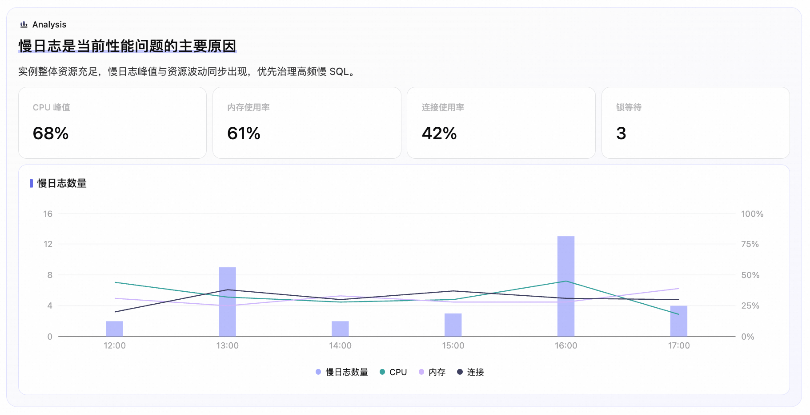
:::
:::

#### 四、运行机制与数据流

对于需要用户继续操作的任务，运行时由两条方向相反的数据通道共同形成闭环：Server → Client 负责交付界面数据，Client → Server 负责回传交互事件。前者让结果可理解，后者让用户操作继续驱动业务执行与界面更新。

**通道 A**

###### Server → Client：界面数据

Agent Server 依据业务结果、共享设计资产和目标协议生成界面数据：json-render 交付 UI Spec，A2UI 交付协议消息。Client 负责校验、解析状态；Renderer 根据 Registry 中的映射组织并渲染 CloudAI 组件。

**通道 B**

###### Client → Server：交互事件

用户操作被组装为 Action Event，连同必要状态回传。**鉴权、执行与审计一律发生在服务端**——界面上的确认只是意图表达，不构成授权。执行结果若改变界面，再经通道 A 回流。

```mermaid
sequenceDiagram
    actor User as 用户
    participant Client as Client / Renderer
    participant Server as Agent Server
    participant System as 业务系统

    User->>Client: 提交任务
    Client->>Server: 请求与任务上下文
    Server->>System: 调用业务工具
    System-->>Server: 返回业务结果

    Note over Server: 共享 GenUI 资产 + 目标协议适配器
    Server->>Server: 组装生成上下文并生成界面数据
    Server-->>Client: 通道 A：界面数据<br/>json-render UI Spec / A2UI Messages
    Client->>Client: 校验数据、解析状态<br/>按 Registry 映射并渲染
    Client-->>User: 展示 CloudAI 组件界面

    opt 任务需要用户继续操作
        User->>Client: 选择、填写或确认
        Note over Client,Server: 界面确认表达用户意图<br/>不能替代服务端授权
        Client->>Server: 通道 B：交互事件<br/>Action Event + 必要状态
        Server->>System: 身份校验、权限判断、执行与审计
        System-->>Server: 返回执行结果

        opt 执行结果需要更新界面
            Server-->>Client: 通道 A：新的 UI Spec / 增量消息
            Client->>Client: 更新状态并重新渲染
            Client-->>User: 展示更新结果
        end
    end

```

具体传输方式由协议和业务宿主决定。A2UI 可以通过流式消息持续更新 Surface；json-render 不限定网络传输方式，由宿主负责传递 Spec 与交互事件。 两者共享的是设计语义与使用规则，**不是同一份可直接互换的 JSON**。

#### 五、应用场景

GenUI 是 Agentic 用云、管云的体验基座，帮助 Agent 将动态业务结果转化为可理解、可操作的界面。以下是三个数据库AIDBS产品中的落地场景：

➊ **诊断与运维**

呈现诊断摘要、异常指标、证据、方案对比与高风险操作确认

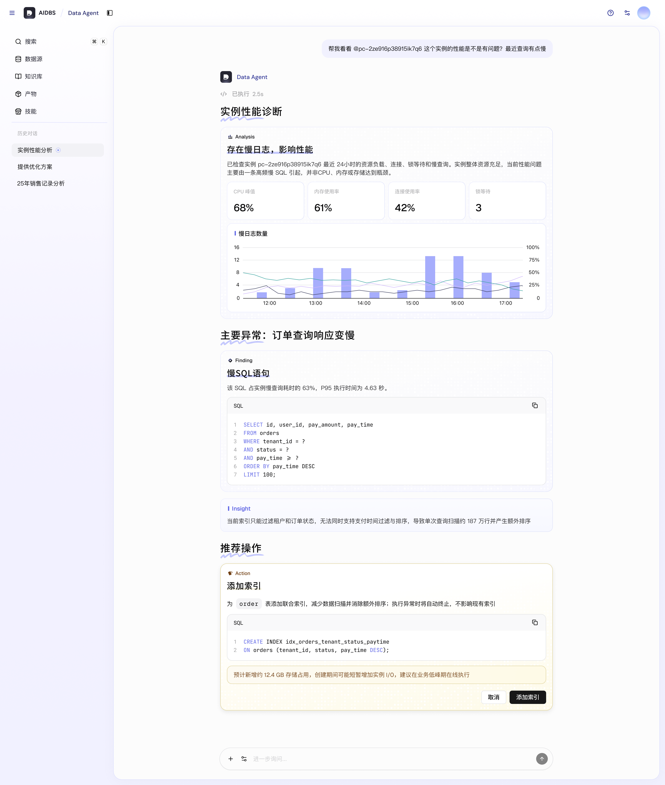

➋ **数据查询与业务分析**

动态组织结论、数据对象、知识依据、指标、图表和查询入口

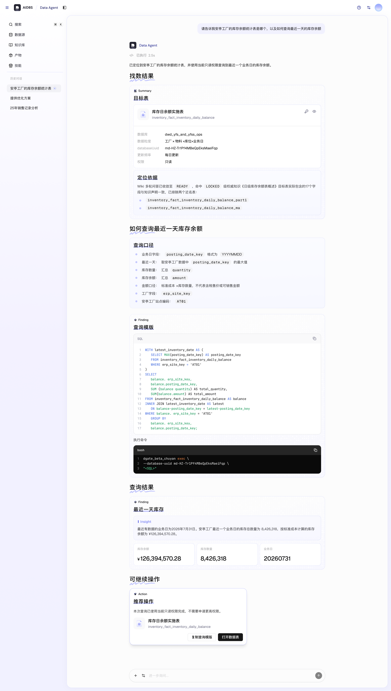

**➌ 售卖**

在对话中完成需求澄清、方案选择、参数调整、确认和下单全流程

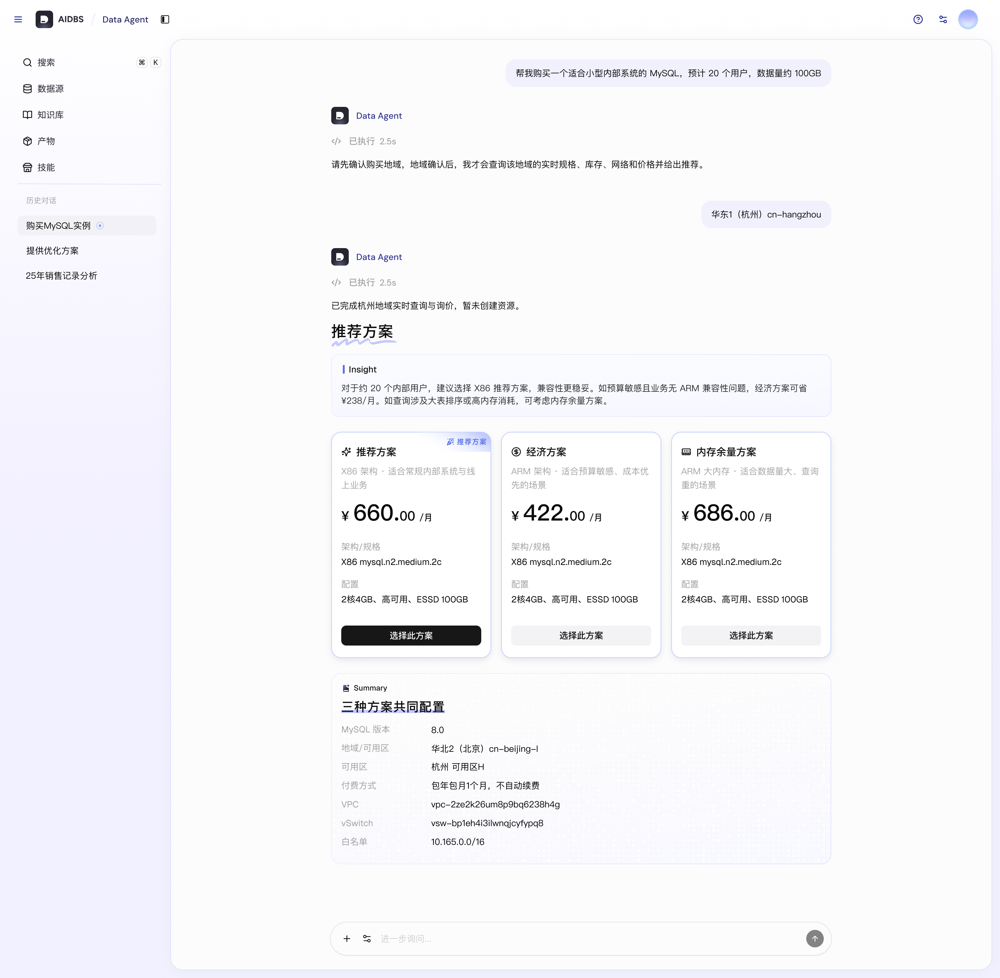

#### 六、边界与限制

> GenUI 的价值域是长尾任务。把它用到不该用的地方，代价是稳定性和成本； 对它的能力做过强假设，代价是信任。

###### 什么时候不该用 GenUI

*   **稳定、高频、强流程的操作**：走固定页面。这类流程的最优形态可以被提前设计，没有必要在运行时重新组织。
    
*   **纯解释性、开放式的回答**：走自然语言。为一段解释套上组件只会增加噪声。
    
*   **强合规、强事务、字段极多的复杂配置**：走控制台。这类界面对校验规则和状态机的要求超出生成式组织的可靠区间。
    

###### 能力边界

*   **结构可校验，事实不可校验：**Schema 能拦住未知组件与字段错误，拦不住被编造的数值或不成立的结论。数值必须来自业务系统返回，结论需要可溯源的证据，必要时由业务侧做二次核对。
    
*   **界面确认不等于授权：**所有鉴权、执行与审计都在服务端完成；客户端的确认交互只表达用户意图。
    
*   **成本与延迟是真实约束：**Spec 体积直接影响首屏时间与 Token 成本，复杂界面依赖流式生成与增量更新才能获得可接受的感知性能。
    
*   **跨协议不可直接互换：**共享的是设计语义与使用规则；不同协议的数据契约由适配层各自生成。
    
*   **依赖的协议本身仍在演进：**A2UI 目前仍处于活跃演进阶段（稳定线为 v0.9 系列，v1.0 为候选版本），OpenUI 生态同样在迭代。因此 GenUI 采取“资产稳定、适配层承接变化”的策略，把协议波动隔离在业务语义之外。
    

#### 七、技术路线与后续演进

我们的路线策略是**共享资产、兼容多种技术路径**：Component、Block、Catalog、Template 与使用规则保持稳定， 由适配层对接不同的数据契约与 Renderer。

以下是三条主要技术路径：

| **路径** | **形态** | **状态** | **当前进展** | **下一步** |
| --- | --- | --- | --- | --- |
| **json-render** | UI Spec + 渲染器 | **已打通** | 生成、校验、渲染链路闭环 | 拓展真实业务验证 |
| [**A2UI**](https://a2ui.org/) | 声明式 UI 协议（流式 JSON 消息） | **进行中** | 已在业务场景完成验证，CloudAI 设计资产适配中 | 完成 Catalog 与组件映射 |
| [**OpenUI（OpenUI Lang）**](https://www.openui.com/docs/openui-lang) | 生成式 UI 框架 + 面向 LLM 的行式 DSL | **规划中** | 已纳入兼容规划，尚未接入 | 开展技术验证与 CloudAI 资产映射 |

后续重点评估四个维度：

*   **生成与体验**：结构有效率、业务完整度、组件选择和任务完成体验；
    
*   **交互与性能**：流式生成、增量更新、多轮状态、首屏时间和 Token 成本；
    
*   **安全与可观测**：Schema 校验、权限审计、容错降级、链路追踪和回放；
    
*   **兼容与接入**：资产覆盖度、适配维护成本、跨端复用和业务接入成本。
    

#### 八、术语解释

| **术语** | **含义** |
| --- | --- |
| **Agent Server** | 理解意图、调用业务工具、并生成界面数据的服务端。所有鉴权、执行与审计都在这里发生。 |
| **Client / Renderer** | 接收协议数据、完成校验与状态解析、并把节点渲染为本地组件的客户端与渲染器。 |
| **Registry** | 协议中的组件类型到本地组件实现的注册映射表，是客户端侧的白名单落点。 |
| **Spec** | json-render 中描述一屏界面的结构化数据：`root` 指定入口，`elements` 以扁平字典 + id 引用组织节点树。 |
| **Surface** | A2UI 中承载组件的画布单元（如主视图、侧栏、弹窗），可被增量消息持续更新。 |
| **Action Event** | 客户端把用户的选择、填写、确认或操作连同当前状态组装成的事件，回传服务端触发执行。 |
| **CloudAI 组件** | 客户端侧经过设计与安全审核的可信组件库，是所有 GenUI 界面的唯一渲染实现来源。 |
| **Schema 校验** | 渲染前对协议数据做的结构校验：组件是否已知、字段类型是否正确、引用是否完整。不校验业务事实。 |


<a id="sec-049"></a>

### Vibe Designing：意图驱动的AI设计范式进化
过去几年，AI 像一道不断变化的光，照进了设计、艺术、互联网应用和产业的各个角落。

设计师们聊Prompt、LoRA、Workflow...不断学习新的工具、新的方法，也不断把这些能力带回自己的创作和业务现场。

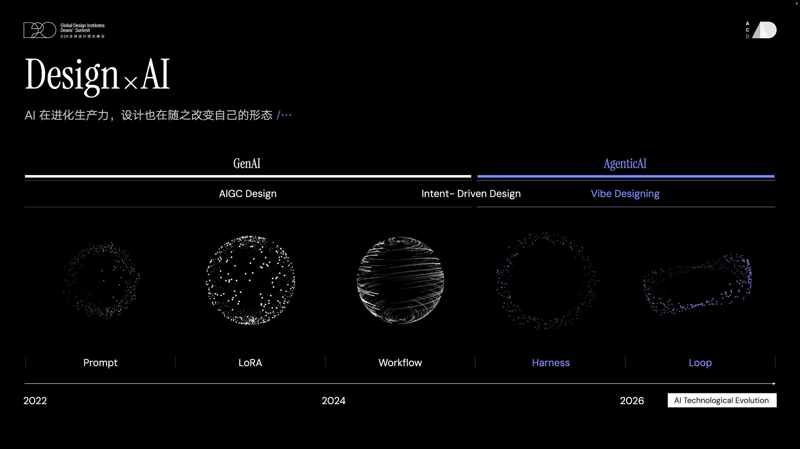

但回看最近这大半年，AI行业最重要的变化，无疑是对 AI Coding 的共识被改写了。

AI Coding 正在从开发者的专属能力，变成一种更普遍的创造能力：一个人可以用自然语言表达意图和判断，参与软件、工具、页面、体验和服务的创造。它不再只是程序员用于补全代码、生成测试、修复 bug 的工具，而开始进入产品、运营、教育、文化创新等更广泛的场景。

这件事对设计师意味着什么？不是“设计师也会写代码了”，而是，设计师终于可以更快地把脑子里的想法，变成可以运行、可以验证、可以被别人使用的东西。

这是一种生产力的变化，也是一种设计范式的变化。

#### 一、AI Coding 正在成为通识性的创造能力

变化正悄然发生。

个人层面，阿里云的设计师借助 AI Coding 自己做了一个小工具，并发布到 npm平台，两天获得 150 多次下载。设计师不再只是等待工具，也可以为了解决自己的问题创造工具。

团队层面，阿里云设计中心开展了全员 Vibe Designing Jam 比赛，探索智能体优先的工作方式，涌现出40 多个参赛作品，覆盖产品设计、市场传播、体验度量等多个方向。AI Coding 进入设计现场之后，开始重新组织设计团队的工作流、重新发现业务创新机会。

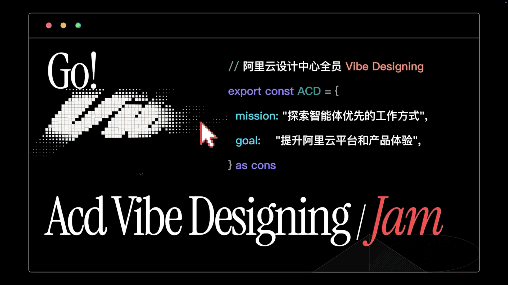

教育层面，浙江大学艺术与考古学院陈晓皎老师将 AI Coding 引入文化计算课程，带领学生们围绕傩文化、传统乐器等主题，把文化研究、视觉表达和交互体验连接起来，让原本停留在图像和文本中的文化内容，变成可以互动、可以运行、可以传播的数字作品。

这对艺术设计教育来说，是一个很大的变化。过去，很多学生可以想象一个互动体验，但要真正做出来，往往需要技术同学深度参与。现在，学生们在掌握 AI Coding 工具之后，能够让传统文化创造性转化，不再只停留在图像风格化，而有机会进入动态叙事、交互体验和数字系统的层面。

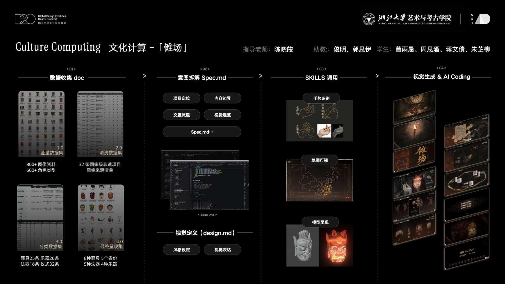

[https://mp.weixin.qq.com/s/fKVXt6D3VW8ikS1XmW2J7g: https://mp.weixin.qq.com/s/fKVXt6D3VW8ikS1XmW2J7g](https://mp.weixin.qq.com/s/fKVXt6D3VW8ikS1XmW2J7g)

从一个设计师的小工具，到一个团队的工作方式，再到艺术设计教育的创作路径，AI Coding 正在成为一种通识性的创造能力。

#### 二、意图驱动的AI设计新范式

技术平权之后，一个人说出意图，Agent 就有机会把它变成代码、界面、工具和产品。

但我们仍会遇到这样的问题，真正深入使用 AI Coding 工具时，Agent 并不天然懂我们的业务语境，也不天然懂我们的设计语言。我们反复跟它对话，告诉它这里不对、那里不对，但它生成的结果仍然容易像模板、像默认审美、没有具体的语境。

当意图可以被更快表达出来之后，谁来定义什么是好的体验？谁来把好的体验变成可持续生产的系统？谁来让 Agent 真正理解业务、理解文化、理解组件、理解审美和判断？

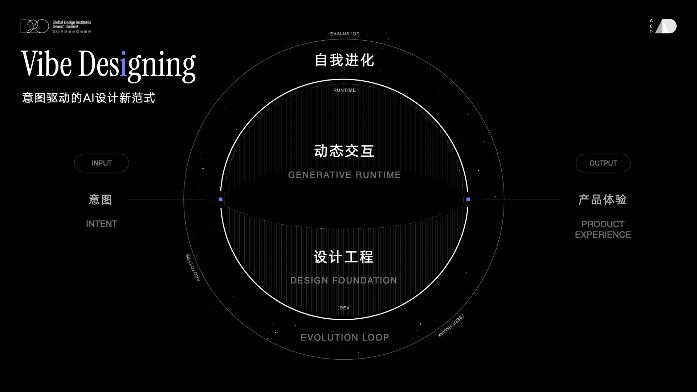

真正的问题是：**一个意图如何被 Agent 高质量地实现为产品体验？**

从意图到体验，中间不是一个 prompt，也不是一个模型，而是一套能力系统。**设计师要从工具使用者，转向设计能力系统的构建者。**在阿里云的实践中，这套能力系统被称为 CloudAI Design，它包含三个相互支撑的层面：

**第一，设计工程** （Design Foundation）；

**第二，动态交互** （Generative Runtime）；

**第三，自我进化**（Evolution Loop） 。

> Design is the New Code.  

#### 三、设计工程，让设计能力进入Agent生成链路

设计工程，解决的是研发态和创作态的能力构建问题，把设计经验、组件规范、业务知识、文化素材、设计方法和验收标准转化为 Agent 可调用、可执行、可复用的工程资产，让 Agent 在生成产品体验或文化作品时不再裸生成，而是在真实语境和设计系统中生成。

所以，设计工程要做的第一件事，不是继续堆 prompt，而是主动打开 Agent 的黑盒，理解它到底是怎么生成的。如果这些过程都交给裸模型，它就会按照通用经验生成；但如果我们把设计能力工程化地提供给它，它就有机会按照我们的业务语义、组件体系和体验标准来生成。

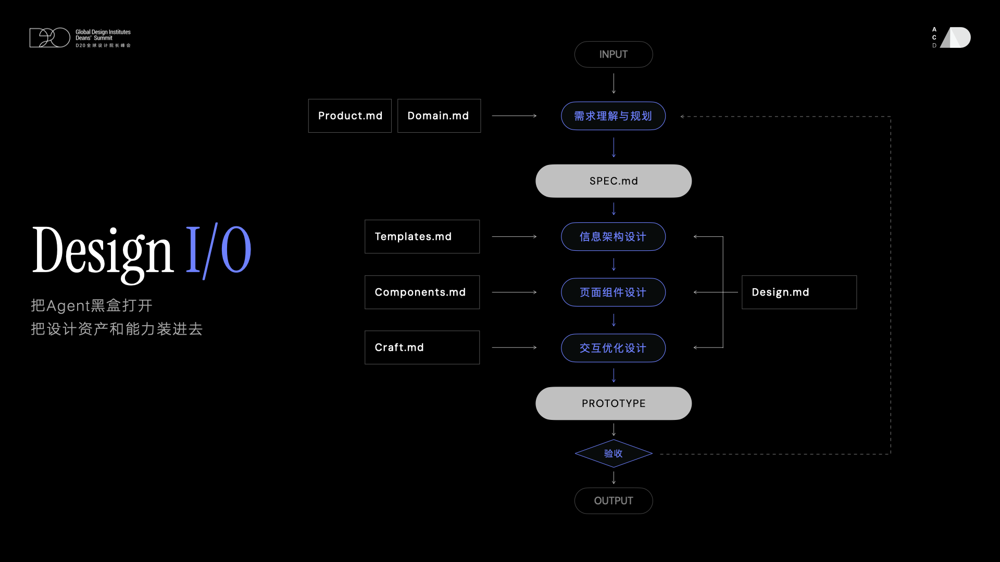

在 CloudAI 里，我们把设计工程拆成两类能力：

**第一类是设计声明，回答什么是好的设计。**它包括产品结构、业务语义、设计风格、交互逻辑、组件约束和通用体验原则，让 Agent 不再在抽象空间里生成，而是在真实的业务语境里生成。

**第二类是执行契约，回答怎么做出好的设计。**这就是设计工程的核心，我们不是让 Agent 自由发挥，而是把设计师的经验、流程和判断，变成Agent的能力。

在这样的体系里，设计声明控制质量，执行契约控制过程，设计不再只是一个交付物。设计开始成为一种新的工程能力。

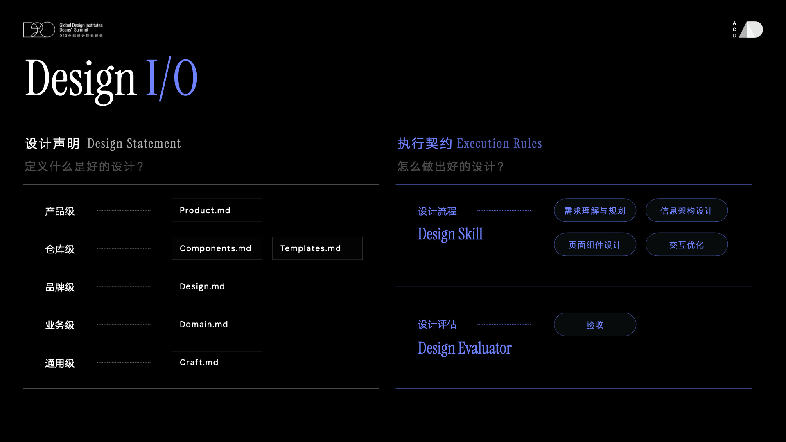

这套能力已经在阿里云AI Native产品研发中逐步应用，覆盖 Agent 构建、运维、观测、安全等商业化产品场景。Agent 可以读取 CloudAI 能力快速完成高质量 Baseline 设计，在更复杂的交互逻辑和高审美要求场景中，设计师则可以借助Figma MCP等工具基于 Agent 生成结果进行精修，并将新的规则、组件和经验回流到系统中。

**Design is the new code.**

设计能力正在进入工程现场，成为人与 Agent 共同构建产品的基础。

> GenUI is the New Interface.

#### 四、动态交互，体验随意图被实时组织

传统软件产品的交互和界面是预设好的，用户需要理解菜单在哪里，功能在哪里，路径怎么走，然后一步一步完成任务。而 AI Native 产品从“人如何理解系统”，转向“Agent 如何理解人的意图，并帮助人完成目标”，这一变化可以概括成从 UX 到 AX （Agent eXperience）的转变。

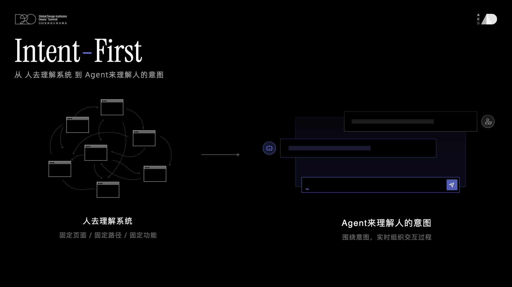

如果说设计工程更多发生在研发态，那么动态交互更多发生在产品运行态，解决的是运行态（Runtime）AX 体验问题，即 Agent 产品如何在用户表达意图之后，根据场景上下文，调用设计规则和组件动态组织一段交互过程，这就是 Generative UI。

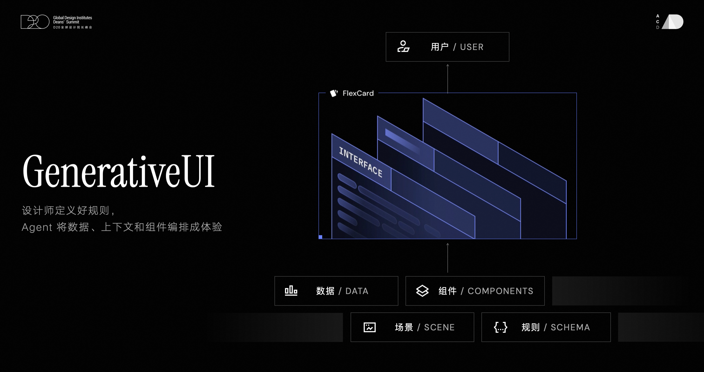

比如，一个用户想在云上部署机械臂训练模型。传统方式下，他需要理解平台入口、选择算法框架、配置算力资源、设置训练参数，再一步步完成部署。

但在 GenUI 场景中，用户只需要表达意图：我想训练一个机械臂模型。Agent 会结合平台能力、社区最佳实践和当前任务上下文，自动推荐合适的算法类型、训练方案和资源配置，并在关键节点生成临时界面，让用户确认、调整或继续推进。

这里的 UI 不再是一个固定页面，而是 Agent 为了完成当前任务，动态组织出来的过程界面。它把数据、流程、组件和规则临时组合起来，帮助用户更快抵达目标。

[请至钉钉文档查看附件《7月27日(2).mp4》。](https://alidocs.dingtalk.com/i/nodes/NZQYprEoWoxKPoqwCQPo44Q5V1waOeDk?iframeQuery=anchorId%3DX02ms309qege41are5btnu)

所以，GenUI is the New Interface，动态交互真正改变的是界面的存在方式。界面不再只是被设计出来，也可以在意图中被组织出来。

> Taste is the New Engine.

#### 五、自我进化，品味牵引设计张力

设计工程解决的是 Agent 如何理解我们的专业能力，动态交互解决的是 Agent 如何根据用户意图组织体验。但光有这两层能力，还不够。

今天大家使用 AI 时，都会有类似感受，它可以很快给出一个不错的 Baseline，但很多时候还需要我们一轮一轮地对话、纠正、补充，才能接近真正想要的结果。这个过程不应该长期依赖人的反复提醒。一个更理想的状态是，当意图表达出来之后，Agent 不仅能够完成生成，还能够主动发现问题、举一反三，并把体验继续往更好的方向推进。

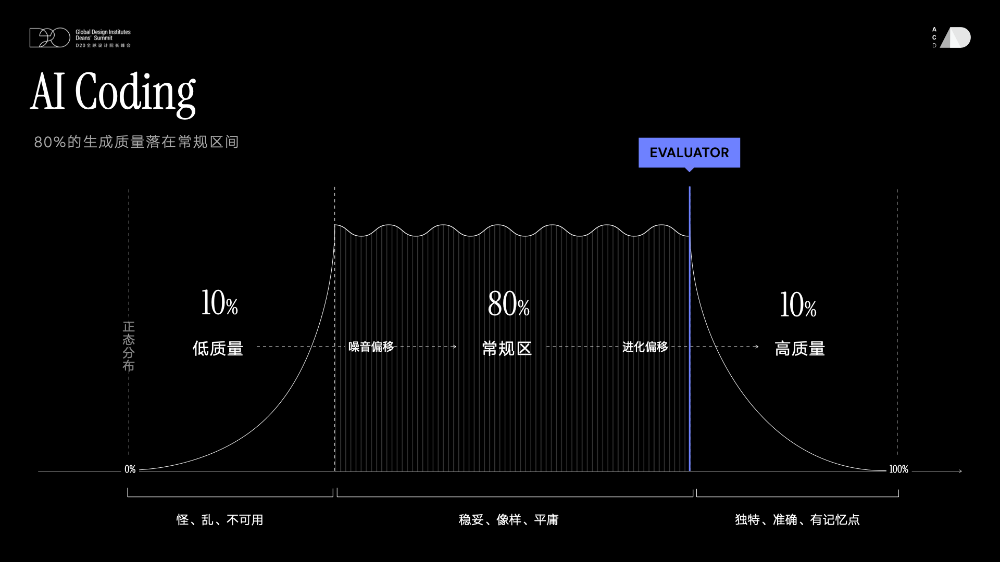

真正优秀的体验，仍然需要 Taste 牵引和质量兜底。

质量关注语义准确、场景合理、业务合规、交互可用和视觉一致；taste 则不仅是视觉审美，更包含对文化、叙事、产品气质和交互细节的综合判断。

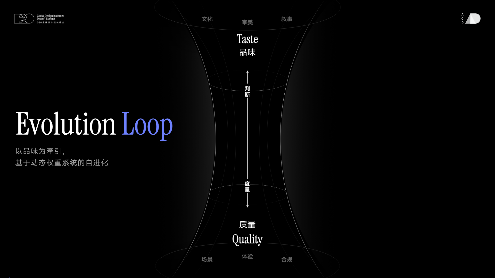

自我进化的关键，是把这些质量规则和 taste 判断沉淀为 Agent 可以执行的评价机制。生成完成之后，系统通过 evaluator 和体验巡检去验收效果，识别问题，提出修正，并将修正结果反哺到下一轮生成中。这样，Agent 才不只是一次性产出一个“还不错”的结果，而是能够推动体验从 baseline 逐步走向更成熟、更有张力的状态。

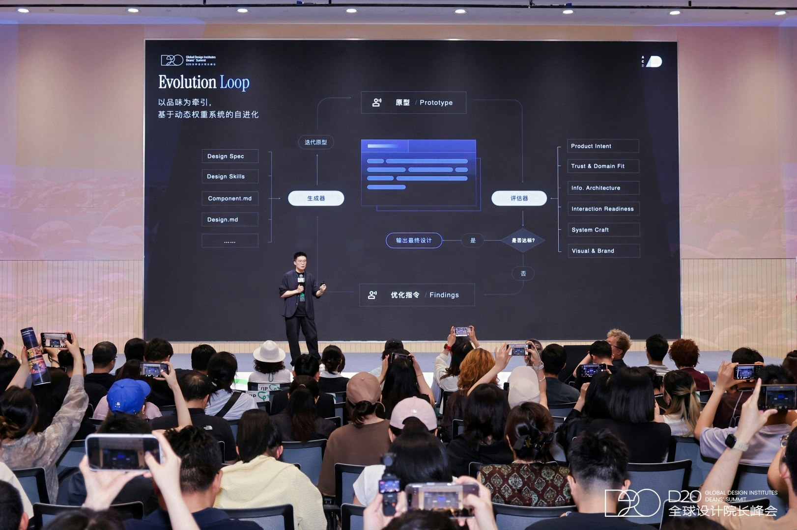

这不是把审美机械化，而是让 Agent 能够在反馈中逐渐理解：什么只是完整，什么才是真正好的体验。

**Taste is the new engine.**

从一次生成到自我进化，品味会成为牵引体验持续向上生长的力量。

#### 六、设计师仍然用作品说话，只是作品的形态变了

在 AI 时代，设计师当然仍然要用作品说话。只是今天的作品，可能不再只是一张静态图，也不再只是一个 Figma 文件。它可能是一个可以交互的动态网站，可能是一套可以被 Agent 调用的 Design skill，可能是一组能持续巡检体验质量的 evaluator，也可能是一套把业务数据、组件和规则组织成体验的 Runtime 机制。

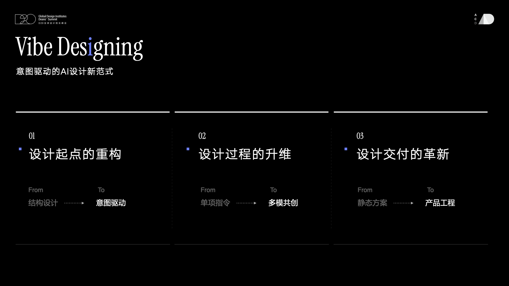

所以，Go VibeDesigning 不是简单地用 AI 生成界面。

它真正要回答的是：当 Vibe Coding 让更多人可以把意图变成结果之后，设计师如何让这些结果成为高质量的产品体验。

AI 不是设计的未来，但 AI 一定正在塑造未来的设计。真正的机会，是把我们的专业能力、业务理解、审美判断和创造方法，变成 Agent 时代新的设计基础设施。


<a id="sec-050"></a>

## 第 27 章　运维、安全与企业 IT


<a id="sec-051"></a>

### 吉利汽车智能运维的落地实践
当吉利集团旗下数百个业务系统的告警信息在同一时间涌入监控平台，原本清晰的监控大屏瞬间被铺天盖地的红色报警信息淹没 —— 这是吉利运维团队曾经频繁面对的 “报警风暴” 场景。在这样的混乱中，如何在最短时间内定位故障根因、恢复业务稳定，成为整个团队最迫切的难题。

近日，吉利汽车用户数据中心数据质量部长宋鸣，与阿里云云原生应用平台产品负责人李国强，分享了双方联手落地阿里云全域智能运维平台 STAROps（注：融合大模型能力与可观测数据，实现运维全流程自主闭环的智能运维平台）的实战经验，围绕落地过程中的真实痛点、实践弯路、团队转型策略以及未来演进方向展开深度分享，为正在探索智能运维转型的团队提供了可落地的一手参考。


#### 一、从 50 万并发到战略融合的新挑战

吉利与阿里云的合作，可以追溯到 2021 年极氪品牌成立之初。宋鸣回忆，从那时起，极氪就与阿里云结成了紧密的合作伙伴，双方持续推进云原生改造项目，也交出了亮眼的成果 —— 在车型发布会现场，支撑了最高 50 万的并发访问量。“这个成绩在汽车行业的发布会场景里，是相当出彩的。” 宋鸣说。2024 年，吉利集团发布《台州宣言》，启动了集团层面的业务与技术整合，极氪也在此过程中并入吉利集团体系。这对技术团队而言，意味着全新的挑战：原本独立的多品牌、多系统需要整合为统一的技术体系，运维的复杂度随之急剧攀升。过去在极氪体系下运转良好的运维模式，面对规模翻倍的系统群，开始逐渐力不从心。

##### 1、三重痛点：报警风暴来了怎么办

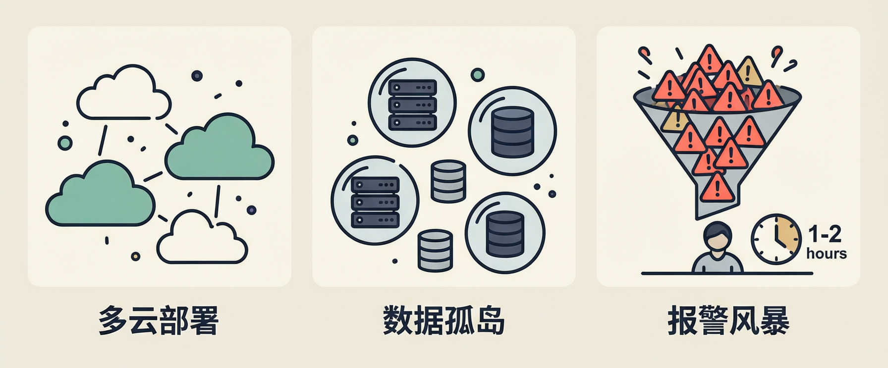

宋鸣坦言，融合之后系统变得越来越复杂，困境集中体现在三个层面。

**首先是多云异构的环境难题**。吉利的系统分布在包括阿里云在内的多个云平台之上，基础设施异构程度高，运维团队需要同时适配多套不同的环境，管理成本陡增。

**第二是系统与数据的孤岛问题。**数百个业务系统各自为政，彼此之间的依赖拓扑关系如同黑盒，没有统一的梳理。“这些系统都是数据孤岛，连系统间的调用拓扑都是不透明的。” 宋鸣形容道。

而**最棘手的，是故障响应的效率瓶颈**。宋鸣描述了团队曾经面对的真实场景：“一旦线上出现问题，监控屏上会瞬间弹出数百条报警 —— 我们面对的其实是一场‘报警风暴’。该从哪里下手？哪个是故障的源头？谁来负责排查？”靠传统的逐个系统排查、层层递进的方式，故障的平均恢复周期动辄长达一两个小时。“这个速度，已经完全跟不上业务的要求了。” 宋鸣说。

这些问题叠加在一起，倒逼团队重新思考：传统运维的效率天花板在哪里？智能运维，是不是破局的方向？

##### 2、目标锚定：向 “一五三零” 冲刺

运维行业有一个广为人知的效率目标框架：一分钟发现故障、五分钟定位根因、三十分钟恢复业务，也就是 “一五三零” 标准。吉利也将这个标准作为智能运维建设的核心目标。

“但靠传统的数字化运维方式 —— 发现问题、发报警、提工单，根本没办法达成这个目标。” 宋鸣直言。团队经过反复思考，最终把突破口锁定在了最核心的环节：快速根因定位。“我们把所有的重心，都放在了怎么快速找到故障的根本问题上。” 宋鸣说，“这也是我们最终和阿里云的 STAROps 走到一起的原因。”

方向明确之后，双方的合作正式启动。但谁也没想到，真正的落地过程，远比想象中曲折。

##### 3、落地的弯路：比技术更先要解决的是认知

落地过程中，团队遇到了不少挑战，但聊到最大的挑战时，宋鸣的回答出乎意料——不是技术难题，而是"观念问题"。

“最开始我们以为，智能运维就是买个产品，部署上线之后它就能自己跑起来、自己解决问题了。” 宋鸣笑着回忆。但真正开始落地之后，团队才发现，智能运维不是一个 “开箱即用” 的工具，它需要配套的体系规范，甚至需要专门的团队来做适配，否则根本寸步难行。纠正了认知偏差之后，更具体的技术卡点接踵而至。作为较早接触 STAROps 的企业，吉利团队最初对产品有很高的期待，以为系统间的关联拓扑可以自动梳理完成。但实际用起来才发现，很多环节都是断点：日志的断点、中间件的断点、调用链路的断点，几乎随处可见。宋鸣举了两个真实的例子：有些系统跨机房甚至跨云部署，日志分散在不同的平台，根本没办法串联起来；还有些系统之间数据库账号混用，出了问题之后，根本没法判断是哪个服务引发的异常。“没有基础的治理，Agentic Ops根本没办法识别：谁是谁？哪里出了问题？哪些是干扰信息？哪些才是根本问题？” 宋鸣总结道。

踩过这些实践的弯路之后，团队终于形成了一个关键的认知：运维的架构资产也是核心资产，数据质量更是智能运维的核心底座。于是他们下定决心，把那些琐碎的历史遗留问题、基础治理工作全部重新梳理，把整个运维的底子打牢。“在这个基础之上，我们最终才真正让 AI 开始帮我们发力。”

而这场基础改造的战斗，从来都不是吉利一方在孤军奋战。

#### 二、破局之道：从数据底座开始的深度共建

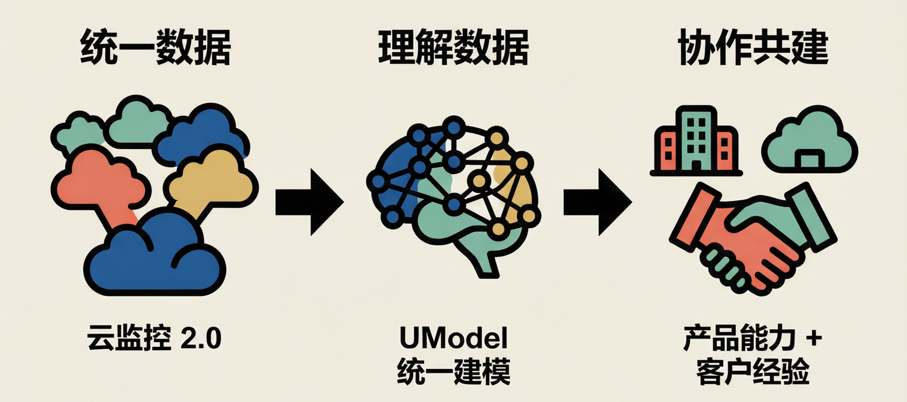

面对这场战斗，从产品视角出发，李国强十分认同宋鸣的判断：所有智能运维产品落地的核心，永远是数据。“智能体或者大模型，就像一个经验丰富的专家，但你喂给它的数据，最终决定了它能不能给出你想要的结果。”在可观测领域，数据的复杂度尤其高：不同云平台、不同基础设施产生的数据，加上企业内部沉淀的自有数据，构成了高度异构的环境。也正是因为看到了这一点，STAROps 的设计思路，从来不是把一个 “单一产品” 直接交付给客户，而是从数据准备阶段开始，就和客户一起共建。

具体来说，整个体系的搭建围绕三个核心步骤展开：

**第一步是统一数据**。阿里云去年发布的云监控 2.0，核心就是解决这个问题：把散落在各处的异构数据，实现统一存储、统一分析、统一查看。李国强认为，这是所有智能化能力的前提，没有这一步，后面的一切都是空中楼阁。

**第二步是理解数据**。数据统一之后，还需要让智能体读懂数据之间的关联关系。这一步依托的是阿里云的 UModel（Unified Model）。“阿里云的基础设施我们已基本全部完成了自动建模。” 李国强说，而客户的自有业务信息，则可以通过UModel建模体系的开放能力，由客户自己补充进来，让整个体系更贴合企业的实际情况。

**第三步是持续共建**。李国强强调，STAROps 从来不是一个单一的运维智能体，“而是要和客户一起，把数据准备、数据分析，直到最后智能体的问答交互，整个链路的工作都做扎实，这里面的细节工作非常多。”宋鸣在一旁点头认同：“很多实践中的难题，都是我们双方一起摸索、共同趟出来的。”

数据底座的搭建，为智能运维扫清了技术障碍，但新的挑战随之而来：工具准备好了，团队愿意用吗**？**

#### 三、团队转型：身份在变，信任在建

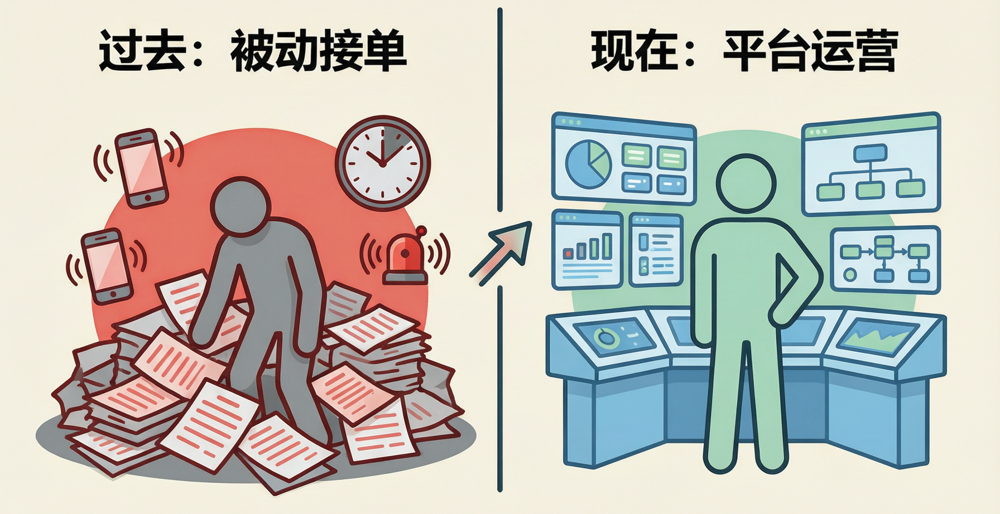

STAROps 落地之后，宋鸣最先观察到的，是运维团队的 “身份转变”。

“传统运维模式里，大家就是接工单，一个个处理、一个个响应。但现在不一样了。” 宋鸣说，大量重复的故障处置工单，已经通过体系化的治理实现了自动化、标准化处理。运维团队不再是被动的 “救火队员”，而是变成了主动的 “运营者”—— 把线上环境作为自己的经营阵地，为新上线的系统提供从部署到稳定运行的全流程服务。团队的精力，也从逐单处理故障，转向了更高维度的工作：架构规划、流程设计、制度优化。但当这套新的工作方式向开发团队推广时，却遇到了阻力。“很多开发工程师说，真的出问题的时候，第一反应还是想用老办法。” 宋鸣坦承。开发者的顾虑很直接：一是怕用新工具耽误时间，二是担心智能体给出错误信息，反而添乱。“这其实是一个信任建立的过程。” 宋鸣分享了他们的破局策略：从低风险的测试环境切入。吉利内部搭建了生产、测试两套环境，在测试环境联调时，一旦出现问题，就直接交给 STAROps 来处理。“这样一来，团队之间的沟通协同成本一下子降了很多。” 先在低风险的场景里让大家尝到甜头，对智能体的信任，就这样一点点建立起来了。

李国强对此深有感触，他用 “战友” 来形容人与智能体的关系：“信任不可能是第一天拿到产品，看个说明书就能建立的。只有一起解决过问题，就像并肩作战的战友一样，才能真正建立信任。”他还举了研发领域的例子来类比这种转变：“前两年大家也在讨论，有了 AI Coding 之后，程序员是不是就不用写代码了？但现在回头看，代码写得少了，不代表贡献少了，而是大家可以把精力放在更高维度的业务价值思考上。运维也是一样的道理。”李国强解释，阿里云内部一直贯彻 DevOps 文化，开发人员同时要负责运维，每天写完代码，还要处理一堆琐事：看告警、排故障、做问题诊断。“这些工作真的有那么强的成就感吗？其实很多时候并没有。” 而智能运维，就是要把运维人员从这些琐碎的日常里解放出来：异常自动发现、根因自动定位、修复建议自动生成，甚至 STAROps 还支持 24 小时自主值守的智能体，帮运维人员盯着系统，不用再担心凌晨的告警电话。

当团队逐渐接受这种人机协作模式之后，双方开始把目光投向更远的地方。

#### 四、未来展望：不止运维，贯穿研发全流程

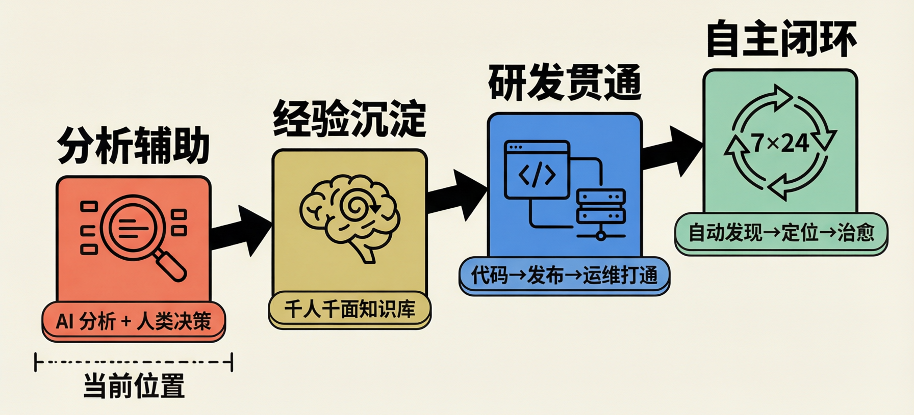

当团队逐渐接受了这种人机协作的新模式，双方开始把目光投向了更远的未来。关于智能运维的下一步，宋鸣和李国强的思考高度一致：运维从来都不应该是一个孤立的环节。

##### 1、嵌入研发全链路

宋鸣的观点很明确：“智能运维不应该只是运维人员的工具，而是要贯穿到整个研发全流程里。”他分享了几个具体的设想：在 AI Coding 环节，要实现长时间的自动研发闭环，就需要智能体自动完成测试，大型系统里跨模块的问题定位，完全可以嵌入到编程环节，实现问题的自动修复；在提测阶段，根因定位能力可以直接下沉到代码级别，逆向触发代码的自动修复；在灰度部署过程中，监控能力可以自动触发异常回滚 ——“这些能力，现在其实已经具备了落地的基础。”同时，宋鸣也对 STAROps 提出了新的期望：“现在的使用门槛还是有点高，只有少数专家能在用。希望未来能更下沉，以 Chatbot 的形式嵌入到 IDE 里、嵌入到 CI/CD 流水线里，和整个研发体系深度集成，把效能放到最大。”

李国强听完笑着说：“宋总这刚好说到了我们接下来的产品规划方向。”

##### 2、数据打通与经验飞轮

从产品侧，李国强也透露了团队正在推进的工作。

**第一是打通研发域与运维域的数据。**“宋总说，线上出问题能不能直接定位到某一行代码？那首先智能体得能拿到这些数据才行。” 宋鸣在一旁补充：“它得知道代码在哪。”李国强说，这正是 UModel 在解决的问题：用统一的建模语言，把不同域的数据打通。目前团队已经完成了和阿里云云效产品的研发数据打通，下一步还会支持 GitLab 等主流研发工具。最终，每一次发布的代码变更、发布的机器，所有信息都会被串联起来。“线上出了问题，哪台机器有问题？哪天发的版？甚至是哪个程序员写的代码，还是哪个 AI 智能体生成的代码？全都能追溯到。”

**第二是经验的自动沉淀。**李国强提到，很多企业的运维知识库，都需要人工整理，既繁琐又不全面。STAROps 正在做的，就是自动获取用户线上的所有运维动作和当时的场景，自动沉淀为知识库。“这样沉淀出来的经验，才是真正贴合这个用户的，做到千人千面。每个用户的运维特征、有效的处置方式，都会自动沉淀下来。”

宋鸣对此非常认可：“这太好了，我们也正在整理自己的运维知识库，如果能打通的话，效率会高很多。”

##### 3、人机协作：走向自主闭环

关于智能运维的终局形态，李国强认为，最终一定会走到 “几乎完全自闭环” 的阶段：智能体自动分析找到根因，给出行动建议 —— 比如重启机器、版本回滚、调整参数，然后在确认机制下自动执行。“最开始可能是先给建议，用户确认了我们再执行。未来随着能力的演进，说不定真的能做到 7×24 小时的全自动运维。” 李国强说，这应该是所有运维人最想实现的目标。

但即使到了那一步，他认为运维人员依然有三个不可替代的价值：

一是目标定义：不同业务的可用性要求、响应时间标准都不一样，系统是否健康，最终要和业务的要求对齐，这需要人和业务方共同定义；

二是持续优化：每个企业的体系都不一样，智能体的能力，需要和人类一起持续打磨优化；

三是最终决策：在复杂的场景下，比如要不要回滚、要不要上热修复，很多因素交织在一起，人类的决策依然是最关键的。

宋鸣对此深表认同：“我们下一步也在做同样的事情，把故障治愈的模块都做成标准化的命令，接到模型里。”李国强回应：“这其实就是用户构建自己的运维资产，我们的产品提供模型能力，双方一起搭起来，才能形成完整的闭环。”“没错，是深度合作的过程。” 宋鸣总结道。

#### 五、结语

从 “人找问题” 到 “问题找人”，从 “经验驱动” 到 “数据 + AI 驱动”—— 这是吉利在智能运维领域走过的转型之路。这条路带来的核心启示是：智能运维从来不是 “买一个产品” 就能解决的问题，而是一个以数据治理为底座、以产品能力为引擎、以组织协作为保障的系统工程。正如访谈中提到的：智能运维的终极目标，从来不是消灭故障，而是消灭运维的焦虑 —— 让运维工程师能安心睡觉，让业务方不再被凌晨的告警电话叫醒，让整个团队的精力，从 “猜故障、排故障”，真正转向 “创造业务价值”。

如果你的团队也正处在传统运维向智能运维的转型阶段，吉利的实践或许能提供参考：先治数据、再上工具、以场景建信任。如需了解 STAROps 全域智能运维平台的更多信息，可访问阿里云官网查看详情。


<a id="sec-052"></a>

### 塔斯汀万店连锁的智能运维闭环实
##### 一、背景

福州塔斯汀餐饮管理有限公司是中国快餐赛道中快速崛起的国潮汉堡品牌，获凯辉基金、绝了基金投资，门店突破万家，覆盖全国主要城市。塔斯汀以"中国汉堡"为定位，通过国潮文化与快餐品类的差异化结合，在万店连锁赛道中形成独特竞争壁垒。万店规模的连锁餐饮企业，SRE 团队不到十人，业务系统横跨门店 POS、供应链、会员营销、线上点餐等数十条服务链路。当 AI Coding 工具让研发侧的迭代速度再翻一倍，运维侧的专家经验却依然锁在少数人的脑子里。塔斯汀需要回答一个核心问题：怎么让小团队的人效匹配万店扩张的节奏？

##### 二、业务挑战

伴随门店从数千家迈入万店规模，后端服务调用链路的复杂度和监控数据量同步攀升。SRE 团队面对的不是单一技术瓶颈，而是三个相互咬合的结构性难题。

*   **告警四散、值班人员在四个控制台之间来回跳**
    

塔斯汀的监控体系经历了自然生长期。ARMS 负责 Java 微服务链路追踪和应用性能监控，云监控 1.0（CMS 1.0）覆盖 ECS/RDS/Redis 等基础设施水位指标，SLS 承接全量业务日志的采集与查询，Prometheus 托管 ACK 容器集群的 Pod 级资源指标与自定义 Metrics。四套产品各自维护独立的告警规则集、通知渠道配置和告警历史记录，彼此不互通。

一次典型故障场景：晚高峰时段某核心交易服务的 RDS 慢查询堆积，导致上游 Java 服务连接池耗尽。ARMS 触发"服务 P99 延迟突破 3s"告警，Prometheus 触发"Pod restart count > 3"告警，SLS 基于日志关键字触发"数据库连接超时错误率突增"告警，CMS 1.0 触发"RDS 活跃连接数超阈值"告警——四条消息分别推送到飞书群。值班人员收到后需要分别登录四个控制台，手动比对时间线和关联服务，才能判断这四条告警指向同一次故障。在高峰期订餐场景下，一次级联故障连续触发数十条告警刷屏飞书群是常态，真正需要关注的根因信号被消息洪流淹没。更棘手的问题是告警规则管理的碎片化。ARMS 的告警规则通过 ARMS 控制台配置，触达方式走钉钉/飞书机器人 Webhook；CMS 1.0 的规则在云监控控制台配置，通知走云监控自有通道；SLS 的告警走 SLS 告警模块。三套规则体系各自有独立的分级标准、静默策略和升级逻辑，无法统一管理，也无法做跨产品的告警关联降噪。

*   **AI Coding 加速研发，排障经验跟不上服务上新速度**
    

塔斯汀的技术栈采用 GitLab 管理代码仓库，Jenkins Pipeline 驱动 CI/CD 流程，服务部署在 ACK 集群。AI Coding 工具深度渗透研发流程后，代码提交频率和服务版本迭代密度大幅提升——新的微服务上线间隔从周级压缩到天级。但每一个新服务上线，运维侧需要同步配置四套监控产品的采集规则、告警阈值、通知路由，经验成本线性增长。

排障知识方面，某次订单服务 OOM 的根因是 JVM MaxDirectMemorySize 配置不当导致堆外内存泄漏、三个月前支付链路超时的根因是下游银行接口限流触发了 Sentinel 降级后熔断阈值配置过低——这些经验只存在于当时值班 SRE 在飞书群里贴的一段分析文字中，没有结构化记录，没有关联到具体的服务和告警类型。新人接手值班时，面对同一个服务的类似故障，只能重新执行：查 ARMS 调用链 → 跳到 SLS 搜索错误堆栈 → 登录 Grafana 看资源曲线 → 人工比对排查——全程依赖个人经验判断在哪个环节切入。

*   **诊断结论"说了等于没说"，缺乏验证和进化通路**
    

随着大模型落地行业，塔斯汀也积极探索尝试智能运维场景（智能巡检、查询、RCA 根因分析）。智能巡检和自然语言查询表现相对稳定——比如"查一下过去 1 小时 Redis 命中率低于 90% 的实例"这类确定性任务，Agent 能准确调用 Prometheus 查询并返回结果。但 RCA 根因分析在以下场景中结论可靠性不足：

场景一：级联故障归因偏移。上游流量突增导致下游服务超时，AI 倾向于把根因归到下游服务自身（如"数据库查询慢"），而忽略上游异常流量才是真正触发因。

场景二：配置变更引发的延迟升高被误判为容量问题。一次 Nacos 配置推送导致服务重启，重启期间延迟升高，AI 诊断为"实例数不足，建议扩容"——实际根因是配置变更引发的短暂抖动。

场景三：多因素交叉的复杂故障，AI 给出的结论过于笼统（如"系统负载高"），无法指导值班人员具体操作。

更关键的问题是：AI 哪次判断对了、哪次判断错了，这些信息没有结构化的记录机制。值班人员看到 AI 结论后，好的情况是参考一下然后自己排查，坏的情况是直接忽略。没有反馈数据回流，AI 的诊断质量无法针对塔斯汀的业务特征持续优化。

##### 三、解决方案：告警统一入口 + AI 反馈闭环 + 数字员工矩阵

围绕上述三重挑战，塔斯汀基于阿里云云监控 2.0（CMS 2.0）和全域智能运维平台 STAROps ，分四层构建完整的智能运维体系。

###### 1、云监控 2.0 事件中心：通过事件集成 + 订阅机制统一四套告警源

塔斯汀将 ARMS、CMS 1.0、SLS 告警、Prometheus Alertmanager 四个告警源通过 CMS 2.0 的事件集成能力统一接入事件中心。具体实现路径：ARMS 告警通过 Webhook 推送到 CMS 2.0 事件集成端点，SLS 告警同样配置 Webhook 回调到相同端点，Prometheus Alertmanager 通过 Alertmanager Webhook Receiver 对接，CMS 1.0 存量规则通过云监控内部的事件转发链路自动汇入。所有告警事件进入统一的事件中心后，按统一的分级标准（P1/P2/P3/P4）重新标记，消除原来四套产品各自分级标准不一致的问题。事件中心通过订阅机制驱动下游通知与处置：SRE 团队配置订阅规则，按业务线（交易链路/供应链/会员营销/基础设施）和告警等级路由到不同的飞书群，P1/P2 告警同时 @ 值班 oncall 人员。

在事件归并层面，系统设计了两个独立标识维度：

**分组标识（Group Key）**：由`告警等级 + 资源标签组合（服务名/集群/命名空间）`拼接生成。同一 Group Key 下、在同一个收敛时间窗口内产生的告警，自动归入同一个事件。例如：交易服务在 5 分钟内触发了 4 条 P1 告警（来自 ARMS 的延迟告警 + Prometheus 的 Pod 重启 + SLS 的错误日志 + CMS 的 RDS 连接数），它们 Group Key 相同，收敛为 1 个事件——飞书群只收到 1 张卡片而非 4 条消息。

**生命周期标识（Incident ID）**：同一 Group Key 的事件，一旦全部告警恢复、事件关闭，后续如果再次触发则生成新的 Incident ID。上午 10:05 的故障和下午 14:30 的故障即使 Group Key 相同，也是两个独立事件，各自有独立的认领记录、处置时间线和复盘空间。不同等级（P1 和 P3）永远不会被归入同一事件。

一次事件的生命周期经过四个阶段：

**首次触发** → 事件中心创建事件，生成唯一 Incident ID，通过订阅规则发送飞书告警卡片到对应值班群；

**持续触发** → 同 Group Key 的新告警加入当前事件，飞书卡片**原地更新**（修改活跃告警计数和最近触发时间，不发新消息），避免群内刷屏；

**部分恢复** → 部分告警项恢复，卡片更新活跃/恢复计数，事件仍为"处理中"，不会因为一条恢复就误关事件；

**全部恢复** → 所有告警恢复，事件状态流转为"已恢复"，但保留 72 小时复盘窗口——值班人员可在窗口期内补录根因、评价 AI 诊断质量。业务恢复 ≠ 复盘完成。

目前，CMS 2.0 统一告警管理链路已在 SRE 团队全面跑通并推广到日常 oncall 流程。存量告警规则正从 ARMS/CMS 1.0/SLS/Prometheus 四个平台逐步迁移至 CMS 2.0 统一管理，针对典型场景（Java 应用性能告警模板 / Redis 缓存服务模板 / MySQL/PolarDB 数据库模板 / K8s 容器模板）利用开箱即用的规则集，新业务线接入时一键关联模板即可完成告警配置，无需从零手写规则。

###### 2、飞书告警卡片 + AI 根因分析：一张卡片承载认领、追问、统计全流程

事件中心推送到飞书的不是一段纯文本消息，而是一张**结构化交互卡片**，包含以下固定字段：事件 ID、当前等级、触发时间、关联服务与资源标签、活跃告警数 / 已恢复数、当前状态（活跃/处理中/已恢复）、认领人（初始为空）。卡片支持以下交互操作：

**一键认领**：值班人员点击卡片上的"认领"按钮，系统记录认领人和认领时间戳。所有群成员看到卡片状态变更为"已认领 by @xxx"，避免重复响应。认领动作同时触发事件中心侧的状态流转，后续该事件的所有更新都会 @ 认领人。

**引用卡片追问 AI**：值班人员在飞书中引用（Reply）这张告警卡片，向 STAROps Bot 提问。Bot 收到引用后自动提取当前事件 ID，从事件中心拉取完整上下文注入 AI 会话：包括本次事件的全部告警条目及其触发时间线、关联服务的 ARMS 调用链拓扑快照（最近 15 分钟的 P99/错误率/QPS 趋势）、该服务的历史根因记录（如果反馈闭环中有沉淀）。值班人员不需要手动描述"我说的是哪个告警、哪个时间段、哪个服务"——AI 拿到的就是这个事件的全部事实快照。

**自然语言查询告警统计**：值班人员可以在群里直接问 Bot："今天 P1 告警有多少"、"当前还在活跃的 P1 有多少"、"本周交易链路的告警确认耗时 P90 是多少"。这些问题看似相近，统计口径完全不同——"今天 P1 告警"包含所有触发过的（含已恢复），"当前活跃的 P1"只算当前状态为活跃的事件。平台的实现方式：**Bot 先解析用户意图确定查询条件（等级/状态/时间范围/业务线），调用事件中心 API 执行结构化查询拿到精确数字，再由 AI 组织自然语言回复。** 统计口径由查询接口的参数决定，不交给模型从原始明细中自行推算——确保每个数字都可追溯到一次明确的 API 调用。

###### 3、AI 反馈闭环：每一次诊断沉淀为`**（上下文，人工根因，评价）**`三元组

AI 根因分析的结论是否可靠，不能只靠产品侧感觉，必须有数据。塔斯汀在处置链路中嵌入了一个极简但完整的反馈机制：

**Step 1 · AI 出诊断**：值班人员引用告警卡片追问后，AI 基于注入的事件上下文 + 该服务历史根因库输出诊断结论。结论格式为：推测根因（一句话描述）+ 判断依据（引用了哪些指标/日志证据）+ 建议操作（如"检查上游服务 X 的限流配置"）。

**Step 2 · 人工填写实际根因**：事件恢复后（或处置过程中确认根因时），值班人员在卡片的"填写根因"入口录入实际根因描述——自由文本，要求写清"真正发生了什么"。例如："上游营销服务发券导致流量突增 3 倍，下游交易服务连接池被打满，需要调整连接池 maxActive 从 50 到 200 并在上游增加限流"。

**Step 3 · 评价 AI 准确度**：填写根因后，系统弹出评价入口，只有两个选项——"AI 准"或"AI 不准"。如选"AI 不准"，可选填一行说明（如"AI 把根因归到下游，实际是上游流量问题"）。

每一次反馈在系统中存储为一条完整记录：

```plaintext
{
  incident_id: "事件ID",
  ai_diagnosis: "AI输出的诊断结论全文",
  human_root_cause: "值班人员填写的实际根因",
  ai_accuracy: "准/不准",
  accuracy_note: "不准时的补充说明（可选）",
  service: "关联服务名",
  alert_type: "告警类型分类",
  timestamp: "反馈时间"
}

```

这些记录积累后形成两个直接价值：

**价值一 · 历史根因库**：同一个服务再次出现类似告警时，AI 在 Step 1 的诊断中会优先读取该服务的历史根因记录，参考过往的真实根因而非纯粹依赖当前指标推理。这让 AI 的诊断结论越用越贴近该客户的实际业务特征。

**价值二 · 诊断准确率统计与场景化改进**：团队可以按`service + alert_type`维度统计 AI 准确率——正是因为有了这些结构化数据，塔斯汀在 2026 年 6 月能够向产品团队精确反馈"RCA 在以下三类场景不可靠"并附上具体误判样本：级联故障归因偏移（AI 判下游实际是上游）、配置变更引发抖动被误判为容量问题（AI 建议扩容实际只需等待重启完成）、多因素交叉时结论过于笼统（AI 说"系统负载高"无指导性）。产研团队据此针对性优化了上游流量异常检测的 prompt 策略和配置变更事件的上下文注入逻辑。

###### 4、STAROps 数字员工矩阵：Skill 封装 + Mission 编排 + 一键 RCA

在告警闭环之上，塔斯汀通过 STAROps 构建第二层能力：把资深 SRE 脑中的排障步骤编码为平台可调度的 Agent 能力。

**Skill 封装——将排障 SOP 编码为可复用能力单元**

每个 Skill 定义一个特定故障场景的完整排障路径，包括：触发条件（什么类型的告警/指标组合应该调用这个 Skill）、数据采集步骤（按顺序查哪些指标/日志/调用链）、判断逻辑（指标组合满足什么条件判定为什么根因）、输出格式（结构化诊断结论 + 建议操作）。塔斯汀已封装的 Skill 覆盖以下典型场景：

*   **Redis 缓存异常诊断**：采集 Redis 实例的命中率、内存使用率、慢日志 Top10、连接数趋势；判断逻辑区分"大 Key 热 Key 导致命中率下降"和"内存淘汰策略触发导致 Key 被清除"两种根因路径。
    
*   **数据库连接池诊断**：采集 RDS 活跃连接数、慢查询 Top SQL、应用侧 HikariCP/Druid 连接池指标（active/idle/pending）；区分"慢查询阻塞导致连接占满"和"上游突发流量超出池配置"两种根因。
    
*   **Java 服务 OOM 诊断**：采集 JVM 堆内存/堆外内存/Metaspace/DirectMemory 各分区使用曲线、GC 日志中 Full GC 频率和暂停时间、最近 24h 的内存增长斜率；区分"堆内存泄漏"、"Metaspace 未设上限被反射类撑爆"、"DirectMemory 超限" 三种根因。
    
*   **支付链路超时诊断**：采集支付服务到下游银行/第三方支付网关的调用成功率和 P99 延迟、Sentinel 熔断状态、重试队列深度；区分"下游限流"、"网络抖动"、"本地处理慢"三种根因。
    

**Mission 编排——多 Skill 并行调度形成巡检矩阵**

单个 Skill 解决单场景诊断问题，但日常巡检需要数十个 Skill 按业务线和时段策略并行运行。塔斯汀通过 STAROps 的 Mission（长期任务）能力，将多个巡检 Skill 编排为持续运行的数字员工：

*   **交易链路巡检 Mission**：组合 Redis 诊断 + 数据库连接池诊断 + Java 服务健康检查 + 支付链路可用性探测，在业务高峰时段（11:00-13:00, 17:00-21:00）每 15 分钟执行一轮，非高峰时段每小时一轮。
    
*   **基础设施巡检 Mission**：组合 ECS CPU/内存/磁盘水位检查 + ACK 节点状态检查 + RDS 慢查询趋势 + OSS 存储用量，全天每 30 分钟一轮。
    
*   **中间件巡检 Mission**：组合 RocketMQ 消息堆积检查 + Nacos 配置中心健康检查 + Sentinel 流控规则生效验证，全天每小时一轮。
    

每轮巡检执行后，Agent 输出结构化巡检报告：正常项折叠展示，异常项高亮并附带诊断结论和建议操作。SRE 的日常从"轮班盯监控大屏"变为"早上看一遍巡检报告，处理标红项"。

**一键 RCA——告警卡片直接触发场景匹配的 Skill 组合**

当告警事件触发后，值班人员除了可以引用卡片追问 AI 做开放式诊断，还可以点击卡片上的"一键 RCA"按钮。系统根据事件的服务标签和告警类型，自动匹配最相关的 Skill 组合（如：交易服务 + 延迟告警 → 触发"数据库连接池诊断" + "Redis 缓存异常诊断" + "Java 服务 OOM 诊断"三个 Skill 并行执行），汇总各 Skill 输出后形成综合诊断报告。值班人员基于报告确认或修正根因——修正后的结果同样进入反馈闭环的三元组记录。这意味着：新人首次值班，面对一个不认识的服务告警，点击一键 RCA 就能获得相当于资深 SRE 按 SOP 排查后的输出——不需要知道该服务的 Redis 实例在哪个集群、HikariCP 监控指标怎么查、历史上出过什么问题。Skill 里全编好了。

##### 四、实现价值：SRE 小团队驾驭万店级复杂度

###### 1、告警噪声大幅收敛，值班群"安静了"

过去，ARMS、CMS 1.0、SLS、Prometheus 四个产品各自往飞书群里推告警，一次数据库级联故障能在群里产生 15-20 条独立消息——四个产品各自触发各自的规则，值班人员收到后需要肉眼比对时间线，判断"这些是不是同一件事"。高峰期一个小时刷上百条消息是常态，真正需要处理的独立故障可能只有三四个，但淹没在消息洪流里根本分不出来。

现在，所有告警统一进入 CMS 2.0 事件中心，按 Group Key（等级 + 服务名 + 集群）自动归并。同一次故障不管触发了多少条告警，在飞书群里只呈现为一张卡片，卡片原地更新活跃告警计数。同类告警收敛率超七成——同样是那次数据库级联故障，群里从 17 条独立消息变成 1 张卡片上显示"当前 17 条活跃告警"。值班人员打开群不再是满屏红色消息轰炸，而是几个清晰的事件卡片。

###### 2、故障响应路径从"跨平台拼图"缩短为"一张卡片全闭环"

过去，值班人员收到告警后的标准动作是：登录 ARMS 看调用链拓扑确认哪个节点慢、跳到 SLS 搜索对应时间段的异常堆栈日志、再打开 Grafana 看 Pod 资源曲线确认是不是容量问题、最后人工比对三个平台的时间线拼出根因。从收到告警到开始有效排查，光是"登录平台 + 找到正确的查询入口"就要花掉几分钟，对于不熟悉这套工具链的新人来说，可能连"该去哪个平台查什么"都不确定。

现在，飞书告警卡片就是处置入口。值班人员引用这张卡片向 AI 追问，系统自动注入该事件的完整上下文（关联的全部告警条目、触发时间线、ARMS 调用链快照、历史根因记录），AI 基于这些事实给出诊断结论。如果想要更确定性的排查，点击"一键 RCA"按钮，系统根据服务标签和告警类型自动匹配 Skill 组合并行执行——值班人员看到的是一份汇总后的诊断报告，而不是一堆散落在不同平台里的原始数据。从告警触发到启动根因分析的路径，从"打开三个控制台逐一查"缩短为"在飞书里点一下"。新人首次值班借助 Skill 诊断报告即可完成初步研判。

###### 3、专家经验从"个人聊天记录"走向"组织级可复用资产"

过去，排障结论写在飞书群消息里——当时的讨论上下文、定位过程、最终根因，全都散落在聊天流中。三个月后再遇到同一个服务的类似问题，没人记得上次是怎么定位的，也搜不到那段消息。核心 SRE 休假或离职时，团队对特定服务的排障能力直接腰斩。

现在，每一次处置都沉淀一条完整的三元组记录（告警上下文 + 人工填写的实际根因 + AI 准确度评价），存储在事件中心，可按服务名、告警类型、时间维度检索和统计。下次同一服务再出问题，AI 诊断时会优先读取这些历史根因记录——相当于自动继承了上一位值班人员的排查结论。在此基础上，资深 SRE 的排障 SOP 被编码进 Skill，由 Mission 调度为数字员工矩阵 7×24 持续巡护。团队的工作模式从"轮班盯屏响应告警"转变为"查看巡检报告 + 处理一键 RCA 无法自动闭环的升级事件 + 持续优化 Skill 覆盖面"。经验不再因人员流动断档——它被编码进系统，持续运行。

##### 五、未来展望：从告警闭环到业务连续性守护

告警收敛、AI 反馈闭环和数字员工矩阵已经在交易链路上完成验证。接下来，塔斯汀与阿里云的合作将沿着三个方向继续深化。

###### 1、从"故障发生后响应"走向"变更发布前预判"

当前体系解决的是"故障已经发生"之后的处置效率问题。下一步要向前延伸——在代码发布、配置推送、弹性扩缩容等变更动作执行前，由 Agent 基于历史故障模式和当前系统状态做风险预判。目标是让一部分本可避免的故障在变更窗口期就被拦截，而不是等告警触发后再启动排查。Jenkins Pipeline 的发布节点和 Nacos 的配置推送事件将作为预判的触发源接入。

###### 2、从"SRE 团队内部工具"走向"业务连续性度量体系"

告警收敛率、响应时长、AI 准确率这些指标目前服务于 SRE 团队的日常运维。但对于一家万店连锁企业，管理层真正关心的是：今天晚高峰的订餐系统能不能扛住、这次大促期间的支付成功率有没有保障。下一步要把技术侧的可观测指标翻译成业务语言——将告警事件与业务影响面（预估受影响订单数、区域覆盖范围、持续时长）做关联度量，让技术稳定性的投入成果能被业务决策层直接感知和评估。

###### 3、从"交易链路验证"走向"全业务线覆盖"

交易链路是最先验证的场景，因为它对响应速度要求最高、故障影响最直接。在这条链路上跑通的统一告警入口、Skill 编排和反馈闭环机制，接下来将逐步覆盖到供应链（仓储调度、门店补货、冷链温控）和会员营销（券核销、积分一致性、用户画像服务）等业务线。每扩展一条业务线，就是一批新的 Skill 被封装进数字员工矩阵——塔斯汀的智能运维能力随着业务版图的扩展同步生长，而不需要 SRE 团队线性增员。


<a id="sec-053"></a>

### 畅捷通的可观测与智能运维实践
#### 一、背景与挑战

畅捷通作为国内头部小微企业财税及业务云服务提供商，业务覆盖五大产线、九大集群，服务数百万小微企业。目前核心业务已全面完成 SaaS 化转型与云原生改造，采用多租户、多中心架构部署。伴随客户体量持续增长、业务架构日趋复杂，原有传统运维监控体系暴露出诸多短板，主要集中在看不见、管不住、动不了三大难题，系统亟需全方位升级。

##### 1、看不见：陷入指标陷阱，用户体验感知滞后

底层 CPU、内存、磁盘等基础资源监控体系搭建较早，运行成熟，但在 SaaS 化与多租户模式高速发展下，面向用户体验的可观测能力严重缺失。域名访问异常、接口响应变慢、功能报错、页面卡顿等直接影响客户体验的问题，传统监控无法主动识别，往往只能依靠客户投诉、舆情反馈后才能排查处理。团队将该问题定义为指标陷阱：底层监控指标全部显示正常，终端用户体验却已明显劣化。

##### 2、管不住：告警泛滥低效，故障处置耗时久

系统规模扩张后，告警信息呈指数级爆发。单次底层存储波动，便会触发上百条关联告警，运维人员难以快速定位核心故障根因。同时告警分级、聚合能力不足，大量低优先级告警极易淹没核心紧急事件。此前从接收告警到确认故障根源，平均耗时超 10 分钟，故障全链路恢复周期拉长，平均识别时间、定位时间、修复时间、验证时间均存在较大优化空间。

##### 3、动不了：处置依赖经验，自动化与前置防护不足

故障定位完成后，应急止损高度依赖资深运维人员的个人经验。尽管团队已梳理出限流、降级、切换等标准化止损方案，但在多中心、多租户的复杂架构中，始终未能落地为可一键执行的自动化预案。此外，事前风险防控能力薄弱，大量故障本可通过前置巡检、配置校验提前规避，系统性预防机制亟待完善。

基于现状，畅捷通明确升级目标：将整体服务可用性 SLA 从 99.9% 提升至 99.995%，构建99% 故障事前预防、10 分钟内完成应急止损的运维能力。围绕用户体验核心，通过技术架构与运维模式的全面重构，最终实现客户满意度稳步提升。

#### 二、可观测体系建设 —— 全方位 "看清楚" 问题

针对 "看不见" 的痛点，畅捷通结合业务特性与应用分级标准（一类、二类、三类应用），搭建五层一体化监控模型，构建分层、全域、精准的可观测能力。

*   基础监控：覆盖 CPU、内存、磁盘、端口、网络等基础设施指标，筑牢系统运行底线。
    

*   中间件监控：聚焦 Redis、数据库、消息队列等中间件，监控资源占用、连接数、带宽等核心数据，第一时间发现组件瓶颈与连接异常。
    

*   应用性能监控：采集 GC 频次、线程状态、Pod 响应时长、阻塞线程等运行指标，实时把控应用健康状态。
    

*   业务监控：抓取日志中数据库连接异常、内存溢出、服务限流等业务级报错信号，直击业务运行本质问题。
    

*   用户体验监控：基于域名、核心接口访问日志，监测 500、499、302 等异常状态码及响应时延突变，站在用户视角评判服务质量。
    

这一五层模型的数据采集体系，与阿里云云原生可观测平台（云监控2.0）的设计理念高度契合。云监控2.0将阿里云上的日志服务SLS、应用实施管理AMRS、云监控CMS、全域智能运维平台STAROps这几个产品整合到一个平台重，提供全栈、实时、无侵入的数据接入能力，覆盖日志（数百 PB/天）、指标（数十 PB/天）、链路（数万亿调用/天）、事件（数十亿条/天）、容器和终端等多类数据源，并以冷热多级存储实现 EB 级存储规模下综合成本较开源自建降低 50%。畅捷通的五层监控数据正是通过这一统一平台进行汇聚、存储与查询分析，为上层智能化应用提供了 PB 级日写入、千亿数据秒级分析的数据底座。监控范围严格匹配应用等级：三类应用至少覆盖前三层监控，二类应用需延伸至第四层，一类核心应用必须实现五层监控全覆盖。整套体系遵循全量采集、多维校验、及时触达三大原则：全量数据采集消除监控盲区；多维度交叉验证规避单一指标误判；搭配电话、短信、钉钉、邮件等多渠道通知，保障紧急告警直达值班人员。

在此基础上，畅捷通引入 云监控2.0 基于 UModel 的运维数字孪生能力，搭建应用-资源-租户三维拓扑架构。UModel 以统一图模型组织实体、关系、观测数据和运维知识，将云产品（ECS/VPC/SLB/RDS/ACK 等）、Kubernetes 资源（Cluster/Pod/Node/Deployment/Service 等）、应用（微服务/实例/接口/HTTP/消息/数据库调用等）以及企业自定义扩展（CMDB、CI/CD 流程、自建中间件、运维 SOP/知识库等）纳入统一语义模型。结合服务间调用链、网关全链路追踪，联动应用、租户标签画像，运维人员可从单条用户体验告警逐层下钻，快速定位异常实例、资源瓶颈及受影响租户。同时完成告警精细化分级、聚合归并与升级机制，将同源故障告警合并为单一事件，依托根因分析模块辅助排查。完善的可观测数据与拓扑能力，为后续 AI 全链路诊断、告警降噪打下坚实的数据底座，实现 30 秒内完成全链路分析。

#### 三、智能运维演进与平台架构 —— 高效 "管起来、治得了"

可观测体系解决了问题感知难题，而从发现故障到彻底解决，还需依托平台能力与运维模式的持续迭代。畅捷通在云原生转型过程中，将智能运维划分为四个演进阶段，每一轮升级均带动 SLA 指标与综合运维能力实现跨越式提升。

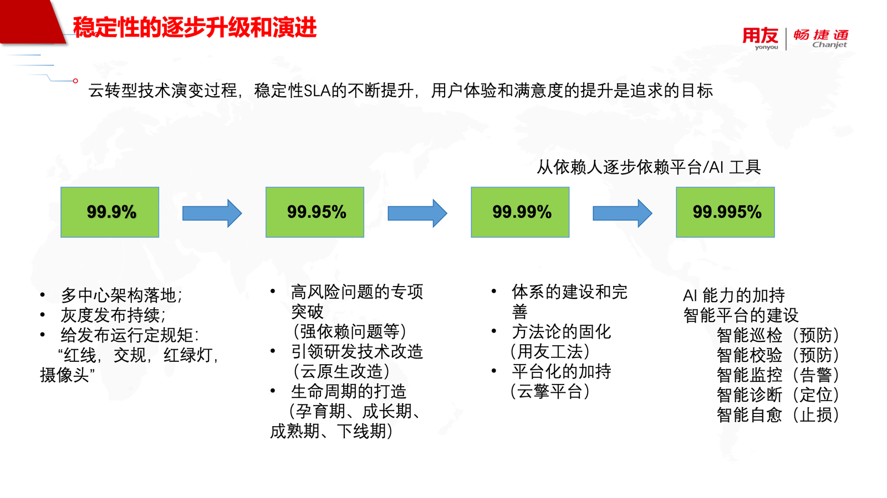

**阶段一：体系建设期（SLA 99.9%）。**

 核心动作是建立应用生命周期管理、业务等级模型和基础红线规范。对发布变更建立规矩——畅捷通内部用"红线、交规、红绿灯、摄像头"来形象比喻。同步落地多中心架构与灰度发布体系，强化容灾与发布管控能力。平台侧建成监控、事件、资源三大基础中心，统一数据采集、模板与策略标准。本阶段以人工运维为主，平台仅作为工具支撑，依靠制度约束减少人为操作失误。

**阶段二：平台化加持期（SLA 99.95%）。**

从架构、历史问题、应用全生命周期三大维度发力：推进全量业务云原生改造，化解系统性风险；专项治理强依赖、老旧组件等历史技术债务；按照应用阶段匹配差异化运维策略。平台能力全面拓展，形成基础服务层 - 平台能力层 - 业务层的完整架构，为运维方法论落地提供载体。

**阶段三：方法论固化期（SLA 99.99%）。** 

有了体系规范，以及自研云擎平台（KSC 靠山稳定性平台）打造 DevSecOps/AIOps 的一体化底座作为基础，畅捷通在大量实战积累后，将经验沉淀为可复制的方法论体系——内部称之为"用友工法"。核心是"0-2-5-10"应急方法论：故障预防目标0事故（事前），及时感知2分钟内（MTTI），根因分析5分钟内（MTTK），止损恢复10分钟内（MTTF+MTTV）。方法论的价值在于将前两个阶段积累的最佳实践"固化"为可标准化执行的流程——让任何一个OnCall人员按照方法论框架都能达到一致的响应质量，将团队的整体作战能力从"依赖少数专家"提升为"全员可执行"。

**阶段四：AI能力加持期（SLA 99.995%）。** 

在平台化和方法论双重基础上全面叠加AI能力，工作模式从"以人为主"彻底转向"AI为主、人审核"。平台交互层升级为智能座舱（全局视图）、数字员工（AI虚拟员工）和个性化工作台，以MCP/Skill模式交付AI能力，实现AI的持续交付和能力复用。核心智能运维模块包括：智能巡检（预防）、智能告警（告警降噪）、智能诊断（定位边界）、智能自愈（多维指标联动）、容量预测、配置校验，与监控中心、事件中心联动形成"感知→分析→决策→执行"闭环。AI大模型深度嵌入各环节，目标是彻底脱离人工依赖，实现故障提前预防、减少人工干预、快速止损的终极愿景。

四个阶段的核心逻辑是"从依赖人逐步依赖平台/AI工具"。先建体系打基础、再建平台做载体、然后沉淀方法论可复制、最后叠加AI实现自治——每一次SLA的提升，背后都是一次能力层级和认知水平的跃迁。

#### 四、AI场景落地——三大闭环

在第四阶段的AI能力框架下，畅捷通落地了多个核心智能运维场景：

##### 智能巡检——预防（"体检"）。

覆盖五大产线九大集群的全量运维风险，执行三类自动化巡检任务。其一是运维风险巡检，包括资源容量趋势、配置合规性、依赖健康度、组件版本风险等维度的定期扫描。其二是数据库红线扫描，针对慢 SQL、大表膨胀、连接池水位、索引缺失、大内存问题等 DBA 关注的高风险指标进行 AI 识别。其三是变更风险识别，在变更执行前自动评估影响范围和风险等级——包括 SQL 异常识别、单租户异常行为检测和资源容量突变预判。

巡检发现的问题自动生成工单，流转至责任团队，形成"发现->工单->修复->验证"的自动化闭环，替代过去依赖人工巡检和口头传递的低效模式。基于用户设定的巡检目标，系统自动拆解任务步骤，按定时调度持续执行跨天、跨周的异步巡检任务，基于日志服务SLS的数据平台提供了高性能的海量数据查询能力，结合Umodel快速执行巡检查询作业，展示巡检进展与发现，遇到高风险问题时自动触发人工确认，确保巡检结论可靠可控。智能巡检关注的是"数据变化"，智能校验关注的是"配置标准"——二者配合实现全方位预防。

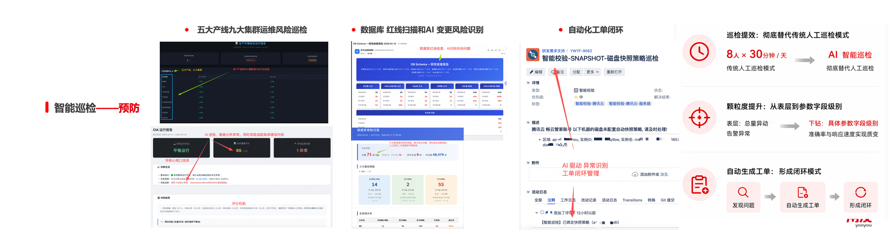

##### 故障自愈——止损（"治病"）。

针对已识别的高频故障场景，预定义自愈策略并实现自动化执行。典型场景包括：单租户资源异常消耗（触发用户隔离）、连接池水位突破阈值（触发接口限流）、单节点不可用（触发中心切换）、下游服务响应劣化（触发功能降级）、流量突增（触发资源扩容）。

AI 感知异常苗头后自动匹配最佳场景，触发对应恢复动作。目前采用"AI 感知+人工审核"模式：自定义场景异常由 AI 识别并推荐处置方案，人工审核确认后自动执行恢复。在这一过程中，智能运维助手的诊断推理能力为故障根因定位提供了核心支撑——围绕告警自动收集证据，分析影响范围、关联服务和异常指标，结合 UModel 运维数字孪生还原故障全貌和传播路径，实现跨域关联分析而非单点排查。自愈能力由平台的"AI 识别/调度中心"承载，通过作业编排实现故障注入（验证）和故障自愈（执行）的统一管理。新增故障模式后可快速配置为自愈规则，降低止损对个人经验的依赖。同时保留人工手动执行通道，确保极端场景的兜底能力。

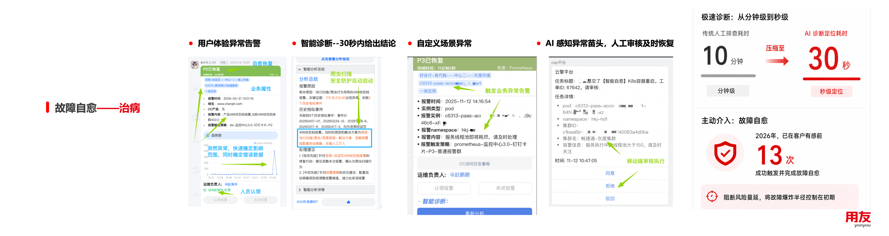

##### 容量预测与成本管控——控成本（"控饮食"）。

替代传统静态阈值的容量告警模式，引入AI时序预测能力。传统模式下，容量告警依赖固定阈值（如CPU>80%报警），存在阈值设置不合理、无法预判未来趋势的问题。新模式下，AI基于三个维度进行综合判断：历史容量规律（周期性峰谷识别）、业务增长趋势（与业务指标关联预测）、突变事件检测（识别非周期性异常增长）。云监控2.0提供了丰富的AI 分析原子能力，包括时序预测、时序聚类和异常检测等算子，算子将计算下推至底层引擎，在海量指标数据上完成高效推理。畅龙虾平台每日自动生成容量报表，AI进行趋势总结和风险预警，提前数天预判容量不足风险。结合FinOps成本管控模块（畅云管账），实现"容量风险提前预判→资源生命周期管理→费用使用率优化→资源打分与成本优化"的一体化管控。成果是双向的：既避免资源浪费降低成本，又预防容量不足引发的可用性故障。

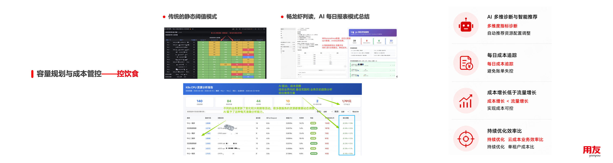

#### 五、成果与价值

经过四个阶段的持续演进，畅捷通实现了核心指标的全面突破：

整体SLA从99.9%提升至99.995%，历经三个台阶的可用性跃迁（年度不可用时间从近9小时压缩到不足半小时）。故障定位时间从平均10分钟以上压缩至30秒以内，MTTR中的MTTK环节效率提升超过20倍。应急体系达成"99%事前预防、10分钟内止损"的既定目标——这意味着绝大多数潜在故障在触达用户之前就已被智能巡检和校验机制拦截。运维模式完成从"以人为主、平台辅助"到"AI为主、人审核"的范式转换，OnCall值班从传统的人工持续监控模式，升级为AI持续监测+人工处理升级事件的协作模式，运维团队的精力从重复性故障响应中释放出来，转向架构优化和能力建设等更高价值的工作。

从更深层的能力维度看，最核心的变化是建立了"可观测数据→AI分析→自动化动作→知识沉淀"的持续正循环。每一次故障处理的经验都通过知识库沉淀反馈给AI，使智能诊断和自愈的覆盖率和准确率不断提升——系统越用越"聪明"，对人的依赖越来越轻。

同时，智能运维不再只是运维团队的工具，而是通过"运维洞察→开发规范"的经验闭环，反向引领研发技术改造。AI发现的性能瓶颈和架构风险，转化为研发侧的红线规则和最佳实践，从源头降低故障概率。例如，智能诊断频繁发现的某类慢SQL模式，会被自动提炼为数据库开发规范的新增条目，在代码Review和发布流水线中前置拦截。

从组织协作维度看，畅捷通在可观测平台上实现了运维知识的体系化沉淀。原本分散在各专家头脑中的故障排查经验、架构理解和处置判断，通过数字员工的知识库、Skill 机制和 MCP 扩展实现了组织级的知识资产化。新人借助平台工具和 AI 辅助可以快速进入角色，团队整体的响应一致性和可靠性显著提升。

这种"以用户体验为中心、以 AI 为驱动、从运维到研发贯通"的闭环模式，正是畅捷通全面迈向 AI Agent 时代、构建下一代技术运营体系的核心方法论。而 云监控2.0的STAROps 作为 Agentic Ops 平台，以统一可观测数据、运维数字孪生、AI 分析算子和持续进化飞轮四大核心能力，为这一方法论的落地提供了开箱即用的技术底座。


<a id="sec-054"></a>

## 第 28 章　客户、销售与运营


<a id="sec-055"></a>

### MiniMax 构建海量长周期记忆数据底座的实践
#### 一、客户背景

MiniMax（稀宇科技）是全球领先的通用人工智能科技公司，成立于2022 年，以“Intelligence with Everyone”为愿景，致力于推动人工智能科技前沿发展。MiniMax 坚持文本、视频、语音全模态自研。基于自研全模态模型，MiniMax 面向全球推出一系列 AI 原生产品，包括海螺AI、星野、Talkie 等，以及面向企业和开发者的开放平台。迄今已有超过 200 个国家及地区的逾 2.36 亿名用户，以及来自超过100个国家及地区的企业客户以及开发者。

#### 二、海量数据下的业务挑战

星野是 MiniMax 基于多模态 AIGC 技术构建的 AI 智能体创作平台，通过文本、语音、视频等多模态交互，支持用户定制具备个性化形象、声线、人设及技能的 AI 角色。其核心价值聚焦于对话场景，依托自研大语言模型的上下文感知与表达能力，实现高拟人化对话驱动，构建用户与AI角色间的持续互动关系。

星野的用户规模与用户活跃度一直位居领先地位，并且仍在持续不断增长，这也给支撑其多模态对话数据的底层存储带来了诸多技术挑战：

*   **海量多模态数据的存储与性能瓶颈**
    
    *   涉及用户自定义 AI 角色模板、对话数据，及视频、音频、图像等非结构化内容数据，日均新增数据达数亿条，整体规模已超过百 TB 级别，并呈指数级增长；
        
    *   传统数据库在处理包含数十MB JSON 或 Blob 的大字段时性能急剧下降，尤其在表大小超过10亿行后，读写延迟显著上升，直接影响AI推理链路效率。
        
*   **潮汐流量下的弹性与稳定性压力**
    
    *   业务流量呈显著潮汐特征，峰值并发请求量相比日均基线负载扩大10倍以上；
        
    *   静态资源配置模式导致低谷期资源闲置、TCO显著上升，而高峰期因数据库水平扩展能力受限，引发数据处理性能衰减、端到端响应延迟增加，严重影响服务稳定性和用户体验。
        
*   **架构边际成本持续攀升**
    
    *   着业务规模的指数级增长，计算、存储、运维成本持续上升，现有架构的边际成本逐步增加，成为可扩展性的主要瓶颈。
        

#### 三、基于阿里云 PolarDB 的智能数据底座实践

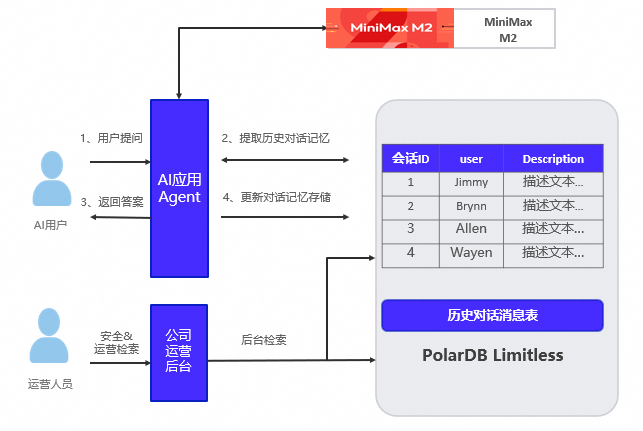

**1、分布式多主架构：支持海量对话数据处理**

MiniMax 借助 PolarDB Limitless 的分布式多主集群架构，打破了传统单主节点的性能瓶颈。该架构支持高达63个计算节点的同时写入，使得每日新增的 xTB 级对话数据可以被高效地分散到多个 Shard 上，实现了写入吞吐量的线性扩展。

此外，分布式DDL能力允许 MiniMax 在不中断服务的情况下进行表结构变更。PolarDB 支持在不影响在线业务的前提下通过多阶段提交协议确保跨节点表结构变更的原子性，业务团队无需停服维护即可完成表结构变更，大幅加快产品迭代速度。

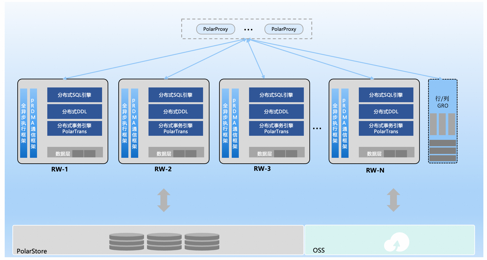

**2、 秒级弹性扩缩容：灵活应对流量变化**

面对流量潮汐，MiniMax 采用了 PolarDB 的 Serverless 弹性扩缩容功能。通过实时监测 PolarDB 的CPU/内存负载，系统可在 5 秒内完成预测，并在1 秒内完成从 0 到千核的无感扩容，最大可支撑十万级突发 QPS 冲击。

MiniMax 基于 PolarDB 的 PolarStore 共享存储架构，实现了“零数据拷贝”的弹性扩缩容：扩容仅需切换分区的计算所有权，无需迁移物理数据；结合智能分区调度算法，元数据与状态迁移量减少 30%–50%。整个过程保障连接不中断、事务不丢失、性能波动低于 5%，对业务完全透明。由此，MiniMax 无需为峰值流量预留冗余资源，实现按需伸缩，整体计算成本降低 50%。

**3、大表与大字段优化：加速长上下文处理**

针对含大 JSON/Blob 字段的千亿级对话表，MiniMax 利用 PolarDB 的列存布局与局部更新能力，结合 RDMA 网络加速，实现单节点 12GB/s 的大字段吞吐，CRUD 性能提升超 3 倍，历史对话检索延迟稳定在毫秒级。同时，基于协程调度与上下文缓存的异步执行框架，使“按用户 ID 拉取对话流”等高频点查 QPS 提升 50% 以上，高效支撑 AI 推理场景。

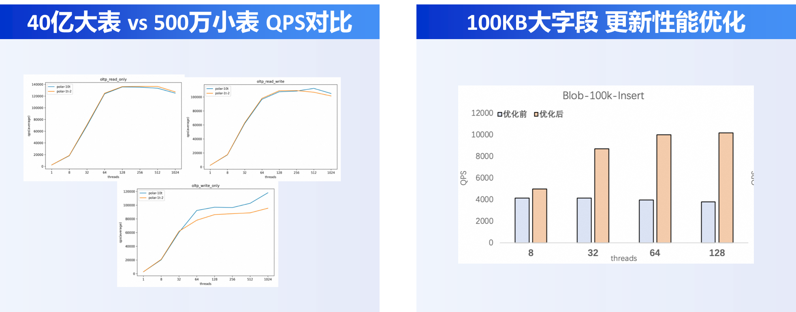

**4**、**智能化数据底座****：驱动业务规模化增长的引擎**

MiniMax 将依托 PolarDB 冷热数据智能分离与多模态统一引擎的双轮驱动，构建高效能的智能化数据底座。在存储层面，可基于访问热度的自动分层策略实现了零代码改造下的成本极致优化，以毫秒级热数据响应与秒级冷数据检索，平衡 AI 实时交互与深度分析需求；在计算层面，借助原生PolarDB多模态引擎与 RDMA 高速网络，可实现文本、语音、图像等跨模态数据的低延迟高精度召回，显著增强 Agent 的长期记忆与上下文理解能力。这一兼具极高性价比与无限扩展性的架构，为 MiniMax 在海量并发场景下的业务快速迭代与规模化扩张提供了坚实支撑。

#### 三、业务收益

目前，MiniMax 全系产品（包括海螺、星野、Agent、开放平台等）的100+数据库已经部署在 PolarDB 上，实现用户体验和开发效率的双重提升：

*   高性能：千亿级对话表读写性能提升超 3 倍，支撑日均数亿消息的实时写入与毫秒级检索；
    
*   高弹性：秒级无感扩缩容应对 10 倍流量波动，计算资源成本降低 50%；
    
*   低成本：冷热数据自动分层归档，存储成本下降 75%，运维人力减少 80%；
    
*   快迭代：分布式 DDL 支持 7×24 在线 schema 变更，AI 功能上线周期显著缩短。
    

#### 四、未来展望

通过深度应用 PolarDB 的分布式多主（Limitless）、多模态存储、秒级弹性与智能冷热分层等核心能力，高效支撑了MiniMax 大模型推理场景下高并发、低延迟、海量异构数据管理的技术挑战。不仅显著优化提升了用户体验、业务敏捷性与运维效率，更深刻验证了云原生数据库与 AI 系统深度融合的价值。随着 PolarDB “湖库一体”的智能数据底座与 MiniMax 的算法引擎协同工作，一个具备长记忆、多模态交互及实时响应能力的 AI 智能体生态得以规模化落地。

展望未来，阿里云数据库将与 MiniMax 持续深化合作，共同探索 AI 原生数据库的创新边界，打造AI多模态数据底座，加速大模型应用向更智能、更可靠的方向演进。


<a id="sec-056"></a>

### 会计师事务所信永中和的办公提效探索
一、**背景**

信永中和是中国最早成立的会计师事务所之一，源起于1981年。历经40余年发展，信永中和已实现集团化经营，拥有审计鉴证、管理咨询、税务服务、工程管理4个平行业务板块，是中国专业服务领域的开拓者和领航者。信永中和国际目前在全球23个国家和地区设立了110个办公室，拥有超1.2万名员工，是走向世界的中国专业服务品牌。

近年来，随着人工智能技术快速发展，信永中和持续推进数字化、智能化建设，积极探索 AI 技术与专业服务、内部管理及员工协同场景的深度融合，不断提升知识获取、业务处理和管理决策效率。

随着AI应用场景逐步增多，企业级AI建设已不再局限于单一问答助手，而是需要进一步解决多智能体协同、模型统一管理、业务系统连接、安全管控及成本治理等问题。为此，信永中和结合自身业务特点和数字化基础，与阿里云开展合作，引入 AgentCore 多智能体治理与协作平台及 AI 网关，共同推进企业级多智能体 AI 平台建设。

 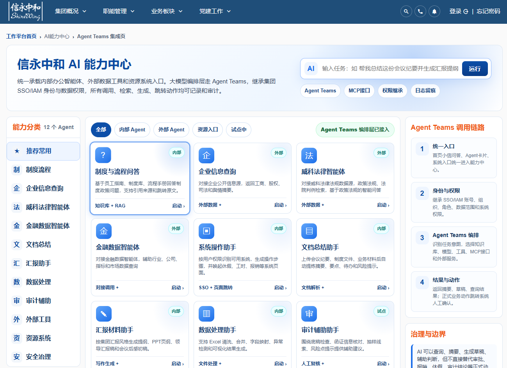

**信永中和 AI 能力中心**

#### AgentCore 与 AI 网关：构建企业级 AI 应用底座

在项目建设过程中，信永中和负责整体业务规划、应用场景设计、知识体系梳理、内部系统集成及推广运营；阿里云提供 AgentCore 、AI 网关等平台产品及相关技术支持。

双方围绕多智能体协同、模型统一治理、安全管理和业务系统接入等核心需求开展建设，逐步完成技术方案验证、应用场景配置、内部系统对接和上线准备。

在项目最终上线的关键阶段，双方团队密切配合，用一周时间完成了系统联调、环境配置、应用接入、测试优化后式上线，快速形成面向内部员工的多智能体 AI 服务能力。

##### 多智能体协同：让不同 Agent 各司其职

基于 AgentCore ，信永中和构建了面向不同业务场景的AI智能体，并采用统一管理、协同调度的方式，为员工提供更加便捷的智能服务。

在多智能体协同模式下，平台可根据员工提出的问题识别任务类型，并将不同任务分配给相应的专业 Agent 处理。对于涉及多个步骤的复杂任务，还可以由统一的管理 Agent 进行任务拆解和结果汇总，实现多个 Agent 之间的协同工作。

通过这一模式，信永中和可以逐步将不同领域、不同能力的 AI 应用纳入统一平台管理，既保留专业 Agent 在特定场景中的能力，也为员工提供统一、便捷的使用入口。

##### 统一管理模型、MCP与 Skill 等 AI 资产

随着 AI 应用数量不断增加，模型、MCP 服务、Skill 及 Agent 模板等 AI 资产的统一管理成为企业规模化应用的重要基础。

基于 AgentCore ，信永中和可以对模型、MCP Server、Skill 及 Agent 模板等资产进行集中管理，并根据不同 Agent 的业务需求和权限要求进行配置和下发。

通过 MCP Server 管理能力，企业内部现有系统和服务接口可以逐步转化为 Agent 可调用的标准能力，使 Agent 不仅能够回答问题，还可以在授权范围内查询信息、调用系统和执行任务。

同时，企业内部 Skill 可以统一沉淀、审核和复用，为后续快速构建更多业务Agent提供基础能力支撑。

##### 结合实际业务，构建多类 AI 智能体

围绕员工高频需求和现有业务场景，信永中和已逐步构建多类AI智能体，包括：

*   **制度与流程问答 Agent**
    
    对接信永中和内部知识库，为员工提供制度、流程和内部管理规范等内容的查询服务。员工可以通过自然语言快速提出问题，减少传统人工查找资料和跨部门咨询的时间成本。
    
*   **OA 集成 Agent**
    
    与内部办公系统进行连接，为员工提供工时查询、工时填报等办公服务。通过对话方式完成相关操作，可以简化系统使用流程，提升日常办公效率。
    
*   **企业信息查询 Agent**
    
    围绕企业基本信息、股东情况、关联关系及风险信息等内容进行查询，为员工开展客户了解、项目立项及相关业务判断提供辅助参考。
    
*   **文档处理和汇报辅助 Agent**
    

协助员工完成文档总结、材料提炼、内容整理和汇报框架生成等工作，降低重复性文字处理工作量。

未来，信永中和还将根据实际业务需求，逐步扩展更多专业及管理类Agent。

##### 统一入口：从多个Agent走向协同服务

各类 Agent 通过服务化方式接入信永中和内部应用平台，员工可以通过统一入口访问不同 AI 能力。

随着 Agent 数量增多，平台还可以通过管理 Agent 对多个专业 Agent 进行统一调度。员工不必逐一判断应使用哪个 Agent，只需描述自己的需求，由平台自动识别任务类型，并将任务分配给合适的 Agent 完成。

这一模式既保留了专业 Agent 的能力，又提升了整体使用体验，为未来由“信息查询”进一步走向“任务执行”奠定了基础。

##### AI 网关：模型调用的统一管理与安全中枢

在模型调用层面，信永中和通过阿里云 AI 网关对大模型服务进行统一接入和管理。

AI 网关作为模型调用的统一入口，可以对不同模型服务进行集中管理，并提供调用监控、认证鉴权、流量控制和成本分析等能力。

多模型调度保障服务稳定

根据不同场景的任务特点，平台可以选择合适的模型提供服务。当主要模型出现延迟或异常时，可根据预设策略切换至备用模型，提升 AI 服务的连续性和稳定性。

精细化统计支持成本治理

平台可以对不同部门、不同 Agent 及不同模型的调用量和 Token 使用情况进行统计，为后续资源分配、使用分析和预算管理提供数据支持。

统一认证实现权限控制

针对不同 Agent 的业务职责，平台可以配置不同的模型访问权限和调用策略，避免Agent超范围调用相关能力。

安全防护降低数据风险

在请求和返回过程中，可结合敏感信息识别、内容安全检测及访问控制等机制，对模型调用链路进行统一防护，降低企业数据在AI使用过程中的安全风险。

##### 全程可观测，支持企业级AI治理

专业服务机构对信息安全、数据保护和业务合规有较高要求。信永中和在推进 AI 应用过程中，始终将安全、可控和可追溯作为重要原则。 

通过 AgentCore 和 AI 网关，平台可以对 Agent 调用过程、模型使用情况、任务执行记录及异常情况进行统一监控和分析。

对于员工在什么时间、通过哪个 Agent、调用了哪些能力以及完成了哪些操作，可以形成相应的调用和审计记录，为后续问题排查、安全管理及内部治理提供依据。

同时，平台通过统一身份认证、权限控制、凭证管理和资源隔离等机制，确保 Agent 在授权范围内调用企业系统和数据。

#### 实施成效

##### 形成统一的企业AI服务入口

平台上线后，信永中和初步形成了统一的企业 AI 服务入口，员工可以通过对话方式获取知识、查询信息和使用相关业务能力。

与传统的系统菜单和资料检索方式相比，对话式交互降低了员工使用AI和内部系统的门槛，也使知识服务和部分办公事项更加便捷。

更重要的是，通过统一的 Agent 管理和 AI 网关能力，信永中和逐步建立了企业级 AI 应用的统一技术底座，使后续新增 Agent 和业务场景可以在相对统一的标准下进行建设、接入和治理。

##### 从问答助手走向任务执行

当前，信永中和的 AI 应用正从知识问答和信息查询，逐步向业务协同和任务执行方向发展。

未来，信永中和将继续结合专业服务和内部管理需求，探索更多 AI 应用场景，包括制度流程服务、经营数据分析、跨系统任务协同、项目管理辅助及专业业务支持等。

随着内部系统逐步通过 MCP 等方式向 Agent 开放标准化能力，员工未来可以通过自然语言描述需求，由 AI 自动完成信息查询、任务拆解、系统调用及结果反馈，推动企业 AI 从“回答问题”进一步走向“完成工作”。

#### 写在最后

企业落地 AI Agent，关键不仅在于模型能力，更在于如何将不同 Agent、模型、知识、系统和工具统一组织起来，并在安全、合规和成本可控的前提下服务真实业务。

本次合作中，信永中和结合自身专业服务场景和数字化建设基础，完成了业务规划、场景设计、系统集成和内部应用落地；阿里云通过 AgentCore 和 AI 网关提供多智能体协同、 AI 资产管理、模型治理及安全管控等技术支撑。

双方在项目最终上线的关键阶段密切协作，用一周时间完成系统联调、测试优化和正式上线，形成了面向内部员工的企业级多智能体 AI 服务能力。

这不仅是一次 AI 平台建设实践，也为大型专业服务机构如何推进多智能体应用、统一 AI 治理和业务系统融合提供了可借鉴的实践经验。


<a id="sec-057"></a>

### 哔哩哔哩构建全域内容洞察的实践
#### 一、客户背景

哔哩哔哩（B站）是国内领先的文化社区和视频平台。平台内容生态高度多元化，涵盖视频、图文、直播、音频、互动内容、搜索、动态等多种体裁。作为以“内容种草”为核心心智的平台，B站已成为品牌营销的重要阵地，尤其在汽车、3C数码、美妆、快消、教育培训、游戏等行业具备显著影响力。

#### 二、业务场景与核心痛点

与传统电商平台不同，B站用户的消费决策往往源于内容互动所形成的品牌认知与兴趣积累，而非站内直接转化。这一特点对营销效果评估提出了更高要求。为此，平台基于经过去标识化、匿名化处理的海量公开互动数据，开展群体层面的数据趋势分析，以支持内容生态优化与商业服务能力的持续提升。例如，通过分析洞察辅助评估品牌内容的传播广度与用户反馈方向，为广告主提供更科学的效果参考。

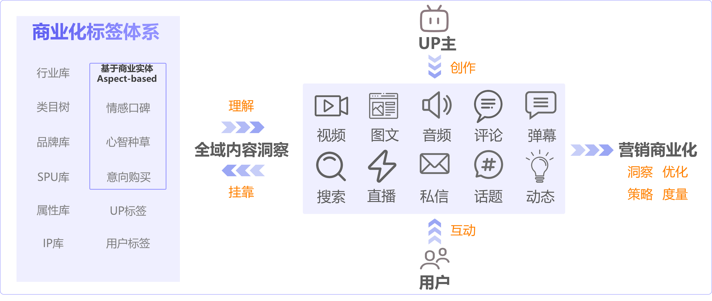

B站内容平台营销商业化路径

B站商业化团队在服务品牌客户过程中，面临三大核心挑战：

1.  **营销效果难以量化**：品牌在B站投放内容（如UP主种草视频）后，缺乏有效手段衡量用户群体是否被“种草”。例如，某汽车品牌发布新车测评视频后，需从去标识化的互动内容中识别用户群体对续航、外观、价格等属性的评价，以评估内容传播效果。
    
2.  **内容资产难以结构化**：B站内容体裁丰富、语义复杂，视频中包含大量视觉、语音、文本信息，互动区则充斥高信息密度的长文本。传统关键词匹配或规则引擎难以准确提取商业实体（如品牌、类目、SPU）及其关联语义。
    
3.  **营销策略缺乏数据支撑**：品牌希望基于B站真实讨论内容，反向指导新品定义、传播策略与创意方向。例如，某美妆品牌需了解用户群体在讨论粉底液时最关注“持妆度”“遮瑕力”还是“肤感”，但缺乏系统性内容洞察工具。
    

为解决上述问题，B站商业化数据科学团队联合阿里云，构建了一套面向全域内容的结构化洞察框架，实现从“内容感知”到“商业洞察”的数据闭环。

#### 三、解决方案：“大模型+小模型”协同的全域内容洞察新框架

PolarDB for AI 是阿里云云原生数据库 PolarDB 内部的分布式机器学习组件，支持在数据不出库的前提下，高效调用轻量化小模型进行实时推理，同时可联动通义千问等大模型处理复杂语义任务，实现大模型与小模型协同一体化架构。

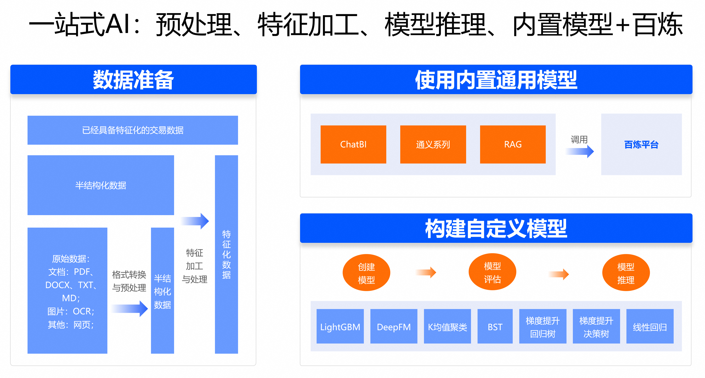

PolarDB for AI一站式方案

*   PolarDB for AI 可以通过调用通义千问大模型，对经过去标识化、匿名化处理的用户互动内容进行批量分析，辅助洞察群体层面的兴趣趋势与反馈倾向，为产品优化与内容策略提供数据支持。
    
*   PolarDB for AI 通过定制化的电商领域大模型，结合阿里电商领域的商品知识图谱，大大提升B站对类目、品牌、SPU等多个标签的识别能力，实现品牌高精准匹配，促进内容资产结构化。
    

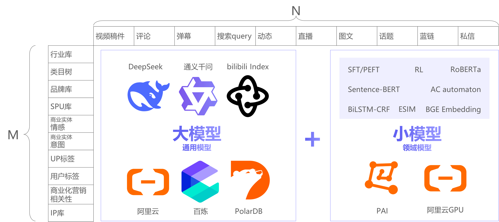

B站全域内容洞察矩阵

B站采用“大模型+小模型”融合的技术路径，依托 DeepSeek、阿里云通义千问（Qwen）系列大模型、B站自研的Index模型与 PolarDB for AI 能力，构建覆盖M×N矩阵的全域内容洞察体系，M为商业化标签维度，N为内容体裁维度。

整体技术架构分为三层：

*   **AI 基建层**：基于阿里云百炼平台、PAI、GPU资源及B站自研Agent平台，提供模型训练、推理与调度能力。
    
*   **数据与模型层**：结合通用大模型（如 Qwen、Qwen-VL、Qwen-Audio）与 **PolarDB  for AI**提供的领域小模型（经 SFT、强化学习微调），实现高效、低成本的内容洞察。
    
*   **应用服务层**：通过 PolarDB for AI 节点，提供模型算子能力，实现“数据不出库”的高效挂靠与推理，且提供稳定独享的模型实时在线服务能力。
    

该方案兼顾效果与成本：通用大模型用于标签体系挖掘与复杂语义分析，领域小模型则在特定任务（如实体抽取）上实现更高精度与更低延迟。

#### 四、关键技术实现与难点突破

###### 1、视频稿件内容提取：从非结构化到结构化

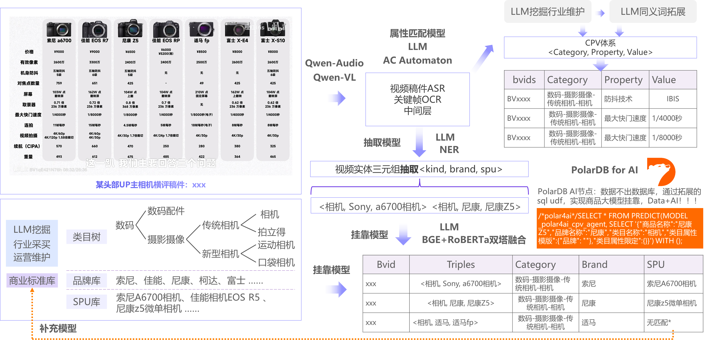

视频内容提取过程

视频是B站核心内容载体，但其信息分散于画面、语音与字幕中。B 站采用多模态融合策略：

*   **中间层构建**：通过 ASR（语音转文本）与关键帧 OCR（图像文字识别）提取原始文本，再利用 Qwen-VL、Qwen-Audio 等多模态大模型生成语义中间表示。
    
*   **CPV体系构建**：基于大模型挖掘与行业维护，建立“类目-属性-属性值”体系。例如，识别出视频中“相机”类目下的“防抖技术”属性及其值“IBIS”。
    
*   **实体三元组抽取与挂靠**：通过大模型抽取<类目, 品牌, SPU>三元组，但原始抽取结果存在与标准产品库里的命名不一致的问题（如“尼康Z5” vs “尼康Z5微单相机”）。
    

**技术难点**：如何将非标准化抽取结果精准挂靠至标准产品库？

**解决方案**：B站与阿里云PolarDB团队合作，在**PolarDB for AI**节点中部署定制化挂靠模型。通过SQL，在数据库内直接调用精调后的大模型进行实体对齐。例如，我们来预测一个稿件的类目。执行如下SQL：

```sql
/*polar4ai*/ 
SELECT * FROM PREDICT(
  MODEL _polar4ai_cpv_agent, 
  SELECT '{"商品名称":"尼康Z5","品牌名称":"尼康","类目属性模板":{"类目":""},"类目属性限定":{"类目":["数码-摄影摄像-传统相机-相机","数码-数码配件",...]}}'
) WITH ();

```

得到{"类目"："数码-摄影摄像-传统相机-相机"}

该方案实现“数据不出库”的高并发挂靠，解决抽取结果与标准产品命名的一致性问题，既保障数据安全，又显著降低工程复杂度。同时，结合 BGE+RoBERTa 等 NLP 模型进行匹配，进一步提升挂靠准确率。

###### 2、互动内容分析：从海量数据中挖掘高价值线索

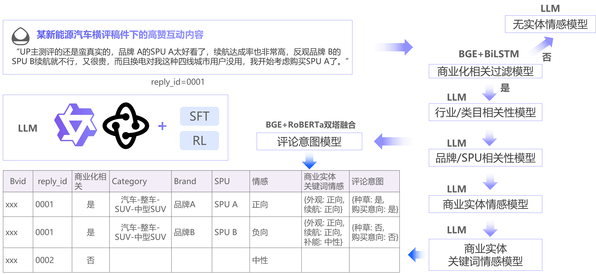

互动内容分析过程

B站评论区信息密度很高，但90%以上为非商业化内容。直接使用大模型全量处理成本高昂。

**技术难点：**如何在成本可控的前提下，利用匿名化互动数据实现多实体群体反馈的细粒度分析，支撑内容与商业服务的持续优化？

**解决方案**：采用“过滤-分析-挖掘”三级流水线：

*   **第一级：商业化过滤**：使用轻量级 NLP 模型，如 BGE+BiLSTM 模型快速筛除无关内容，仅保留可能涉及品牌、产品讨论的内容。
    
*   **第二级：实体与予以关联分析**：对过滤后文本，利用 **PolarDB for AI 提供的商品大模型**识别类目、品牌、SPU，并建立不同实体间的语义关联关系。
    
*   **第三级：意图与属性挖掘**：进一步识别“种草”“购买意愿”等高阶语义，并提取用户群体关注的具体属性（如“续航达成率高”“价格贵”），形成结构化洞察。
    

#### 五、总结

通过与阿里云通义千问大模型及 PolarDB for AI 的深度协同，B 站成功构建了一套高效、可扩展的全域内容洞察体系。该体系不仅解决了品牌营销效果度量难、内容资产结构化难等核心痛点，更将 B 站独特的社区公开互动数据转化为可行动的商业洞察，显著提升了广告主的投放确定性与 ROI。目前，该全域内容洞察体系已应用于 B 站的哔哩指数、花火平台 AI 选 UP 主、哔哩必达洞察报告、引力计划爆文投放、经营号线索挖掘及品牌广告搜索词包等商业化场景，实现从内容洞察到营销转化的全链路提效。未来，B 站将持续优化模型能力，拓展至更多内容体裁与商业场景，进一步释放内容平台的营销价值。


<a id="sec-058"></a>

### 运营分析 Data Agent 实践
AI Native 的讨论越来越热，岗位边界在模糊，各个角色反而能以行业专家的身份史无前例地深度参与实践。我们团队探索的，是产品运营怎么把 AI 用进经营协作里。本篇讲的就是其中一个落地产物——数据分析智能体 Mamba Insight，从思路到实践的完整过程。

运营的日常诉求很分散，横跨多个数据域：大盘监控要盯每天 TOP 客户、售卖分析看分地域的成交表现、留存分析追问上月流失、增长洞察判断客户潜力、经营复盘看整体盘面。过去只能靠运营每周手拼一版"最大公约数"周报——五个人看，谁都能看到点、又都觉得不够用；想深挖就自己提需求排队。数据分析始终是一条旁路，从没嵌进工作流，更没真正变成 team 的一员。

#### 一、行业坐标与核心挑战

设想产研线里有一条"需求 → 研发 → 推广"的管线，横跨多个业务域：需求收集智能体（产品域）识别"此刻缺数据支撑做判断"；数据分析智能体（产品运营域）查客户画像、输出优先级建议；研发流水线 Agent（研发域）完成从开发到发布；内容生产 Agent（产品运营域）自动生成推广素材并分发。按阿姆达尔定律，整体被"没被加速的那一段"卡住——我们不想成为那一段，于是开始重构数据分析智能体，让它真正融入 Team。

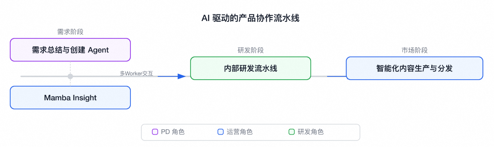

##### 我们的设计思路

实践中我们发现几个很强的作用力：

*   **并行工作**：智能体能否嵌入工作流跟人并行（人↔agent），以及智能体之间能否协作（worker↔worker）；在你晨会准备、双周报复盘、客户跟进时，它和它的团队已跑完大部分工作，同一时刻服务多个角色、多条链路，不串扰、不排队。
    
*   **自进化**：能否越用越聪明。"上月营收还差多少"这类问题不该每次从零回答，Agent 要把上次经验变成下次的肌肉记忆。
    
*   **个性化**：能否千人千面。架构师问的和运营问的不是同一个东西，同一指标在不同上下文里意味着不同动作。
    
*   **经营直觉（Hidden Context）**：能否听懂问题背后的业务语境。"流失率"用什么口径、什么周期、关联哪几张表——这些不在问题里，藏在提问者脑子里。
    
*   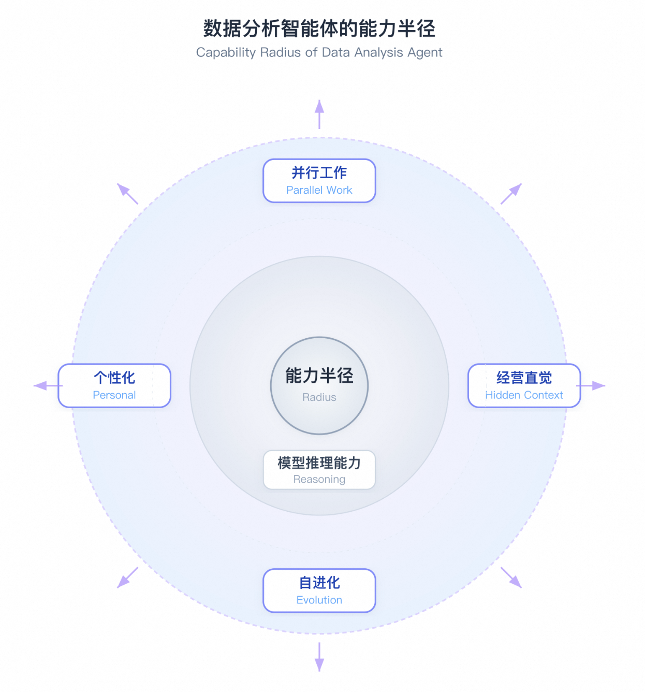
    

#### 二、解决方案实践

两个平台工具，加一层自定的语义规范，搭起 Mamba Insight 的骨架：Qoder 做 Hidden Context 上下文提取与语义层定义、阿里云智能体构建和治理平台 AgentCore 提供企业级协作与治理。

##### 2.1 Qoder：从 500 条需求里提取 Hidden Information

团队多年积累的知识资产有四类，共同构成 Agent 的燃料库：内部研发协同平台的历史需求单（业务口径的活档案）、内部 BI 看板（指标与维度的决策过程）、日常增长分析工作流（看大盘→拆结构→找归因→定动作→追效果）、全角色日常协作对话。产品运营在其中三位一体——知识供给方、场景定义者、效果验证人，最有可能让 Agent 进入"越用越聪明"的正循环。

通过 Qoder，我们把近一年 500+ 条数据需求逐条标注，获得了完整Context：**业务语言**（如"识别高潜力客户"背后是"线索获取→商机识别→商机触达→商业转化→收入跟踪"的完整链路）、**操作模式**（趋势/交叉/分位/分层等分析模板，Agent 不能只会写 SELECT）、**数据关系**（哪张表 join 哪张、口径冲突以谁为准，散落在 SQL 注释和群聊里）。

这些暗知识固化成两类资产：**9 个结构化 Skill 文档**（调度规则、Scheme、指标、维度、计算公式等，是"字典"）和**45 组 QA 对**（是主产物——Skill 告诉 Agent"流失率怎么算"，QA 对告诉它"有人问流失率时真正想问什么"）。每一份都遵循可版本、可审计、可灰度、可回滚四个工程化标尺，保证不过时。

##### 2.2 业务语义层：知识用什么结构装

行业成熟做法是三层抽象：实体、维度、度量，对象拆得越正交，BI 拖拽越好用。\*\*但我们的读者是大模型。\*\*Agent 每从一个对象跳到下一个对象，就多一次出错机会。所以我们把三层语义压进数据集内部——实体、时间、维度、度量都以字段属性标在字段上，对象层只留数据集、指标、已验证问答三类。语义一个没丢，只换了承载形式，我们内部叫它 **Agent-Native 语义层**。

语义层里真正值钱的是几件底表看不出、填错也不报错、只会给你一个"落在合理量级上的错数"的事：指标能否相加、哪些过滤条件必须默认带上、两表关联是一对一还是一对多。它们在语义层里都是必填枚举字段——结构化了，Agent 才有遵守的依据。

##### 2.3 Alibaba Cloud AgentCore：让智能体开始团队协作

四个作用力里，"自进化"和"个性化"是关键，而 AgentCore 天然带这两项能力：Worker 级长期记忆让 Agent 积累团队级经验与纠错，上次踩过的 join 坑这次不再来；会话级独立上下文让不同角色互不串扰，同一个 Agent 面对架构师和运营能给出不同粒度；Skill 审核流水线让团队级变更走版本管理、个人级调整即时生效。基于此，我们创建了第二代数据分析智能体 Mamba Insight。

单 Worker 跑稳后，AgentCore 的 **Worker Team** 机制让多个 Worker 通过结构化输入输出互相调用：回到"需求→研发→推广"管线，每个 Worker 只封装自己领域的专业能力，产品域不需要懂查数、研发域不需要懂写文章。同样的模式可复制到用研、营销、报告等场景——数据分析 Agent 作为底座被按需调用。

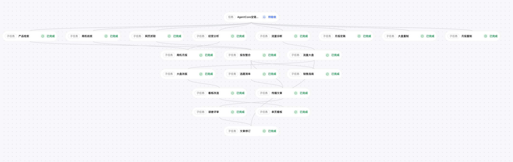

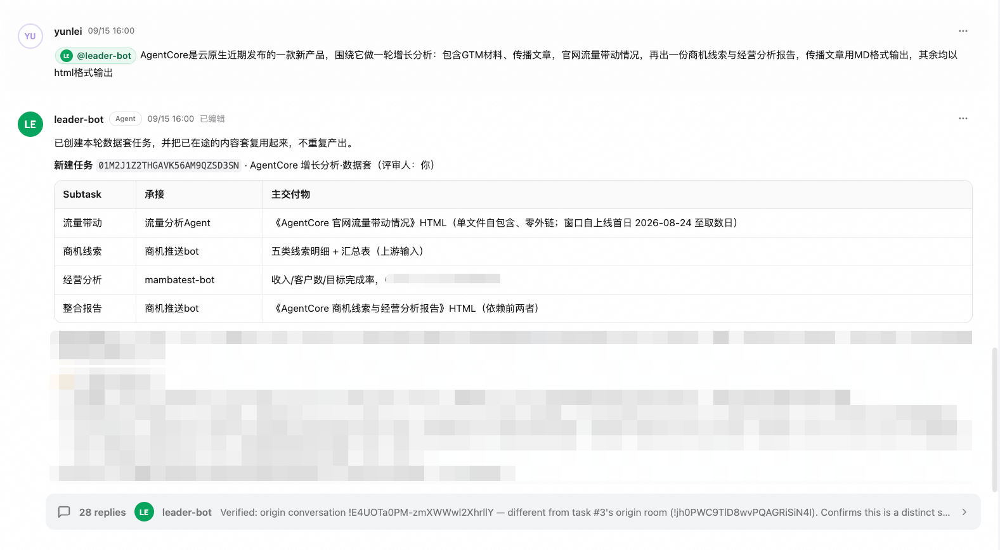

Mamba Insight 日常处理客户收入、商机画像、经营指标，对安全合规有硬要求，**企业级治理**是从 demo 走向生产的核心：基于零信任，Agent 不持有任何凭证，访问经 AI 网关集中管控，对接企业 SSO 与 RBAC；租户数据物理隔离、全程加密、敏感数据自动脱敏；Skill/MCP Server/模型/Worker 模板统一注册、安全审核、热加载。尤其值得一提的是**可观测与审计之上生长出的数据 Loop**：每次调用全链路可追溯、Token 用量精确归因，而每一轮问答都是一条带真实业务意图的样本——口径错了回流成语义层修正，意图偏了回流成新的已验证问答。**使用→审计→优化→使用，这个环转起来后用得越多、语义资产越准**，这才是 Agent 越用越聪明的实际来源。

关联云产品：数据存储与分析——日志服务 SLS；Agent 构建与协作——Alibaba Cloud AgentCore；Agent 评估与进化——AgentLoop。

#### 三、落地场景与成效

云原生业务运营有一条反复执行的链路——看大盘、拆结构、找归因、定动作、追效果。Mamba Insight 要做的，是把前三步（看、拆、找）自动化并行化、后两步（定、追）辅助化，压缩从"想法"到"数据支撑"的时间。

##### 3.1 目标：全流程提效 10X

目标只有一个：把运营从“想法”到“数据支撑”的周期端到端压短——商机洞察从周到天、商机分发从周到天、过程跟进与反馈周更、经营分析与复盘分钟级。运营动作本身沿客户全生命周期展开：新客获取、留存预警、上量扩展、经营复盘，Mamba 要覆盖的是这一整条链路，提效不押在某个单点，而在把链路端到端跑通。下面四类核心场景，正是按这条生命周期铺开的。

##### 3.2 四类核心分析场景

（支持单聊、群聊、定时任务、自动写入钉钉文档）

| 场景 | 核心问题 | 建模逻辑 |
| --- | --- | --- |
| 新客增长（Lead→Customer） | 新客从哪来、哪个产品拉新最高效 | 用户×产品×行为定义流量池，按渠道/画像做贡献归因 |
| 留存（Activation→Retention） | 谁在流失、前兆信号是什么 | "连续 N 月消耗下降/归零"为预警，叠加访问行为提前预警 |
| 上量（Expansion） | 谁有交叉/升舱潜力 | 已转化客户为正样本提取共性，反向匹配相似未转化客户 |
| 经营复盘（Review） | 本期节奏与目标达成是否健康 | 前三层结果汇聚为周报月报素材池，调用双周报 Skill 自动成稿 |

#### 四、未来展望

从"能不能用自然语言查数"的想法，到覆盖云原生全产品、跑通从临时查询到定期报告的完整链路，中间踩过的坑比写出来的多。这是我们在真实业务中跑出的一套相对通用的路径，如果你的团队也在做类似的事，欢迎交流。


<a id="sec-059"></a>

## 第 29 章　GOAI Agent Infra 赛道：多 Agent 协同的前沿实践探索
第25-28章记录的是企业在生产环境中已经跑通的实践。本章记录的是，当一批开发者被放在同一道命题下、面向企业内部真实的高风险流程去设计多 Agent 系统时，他们会做出什么选择。

2026 年 GOAI 世界人工智能开源大赛 Agent Infra 新智基座赛道给出的命题是「企业级复杂任务下的多 Agent 基础设施与协同系统，推动 Agent 从 Demo 走向 Production」。赛道对参赛作品提出了明确的工程要求：系统中至少包含三个职能不同的 Agent，以 AgentTeams 作为多 Agent 协同的设计基点，并将 Skill 作为能力封装的必选项；作品需要覆盖从任务输入、任务拆解、上下文传递、工具调用、结果验证、执行证据沉淀、审批与回滚，直到经验沉淀的完整链路。评审从五个维度展开：场景价值与行业可复制性、多 Agent 协同与自主闭环、Skill 工程体系与生态复用、工程落地运行验证与安全可审计、开放开源贡献。

**赛道采用开放式选题，自 2026 年 7 月启动，共吸引7802支队伍、8346名选手报名参赛，提交作品847个，覆盖全球 38 个国家/地区。**历经初赛与复赛层层选拔，于 9 月产生 15 项决赛晋级作品。本章呈现的就是这 15 项作品：它们各自选择了什么场景、如何组织多个 Agent 的分工与权限、在赛道要求之外又做出了哪些值得记录的工程判断。

### 29.1 参赛结构：产业、高校与独立开发者同台

15 支决赛队伍由 30 位选手组成，覆盖 11 所高校与 7 家企业及科研机构。按参赛主体划分，高校队 7 支、企业与科研机构队 5 支、个人开发者队 3 支，比例约为 5:3:2。

两个结构特征值得记录。

**一是成绩不由机构背景决定。** 三类参赛主体的平均成绩相当接近，前五名中高校、企业、个人开发者各占其位。三支个人开发者队伍全部进入决赛，其作品分别面向 IT 运维、金融数据治理与跨平台故障恢复——都是需要相当行业经验才能提出的命题。

**二是跨单位组队成为常态。** 15 支队伍中有 6 支为跨单位组合，占四成。其中「逐光」队由浙江吉利控股、OPPO 两家企业的工程师组成，「星河引擎」队来自昆山杜克大学、深圳大学与上海大学，「helloworld」队则由高校、科研机构与独立开发者共同构成。产业侧的 8 位选手分散在 7 家单位，除浙江移动创新研究院为两人外均为单人报名，是工程师带着本岗位的实际痛点参赛。

### 29.2 场景版图：11 个互不重合的领域

15 项作品涉及 11 个互不重合的行业或技术领域，没有出现集中于同一场景的扎堆现象。

| 分类 | 行业或技术领域 | 作品数 | 对应作品 |
| --- | --- | --- | --- |
| 垂直行业（5 项） | 能源电力 | 1 | EnergyMesh-Agents |
|  | 金融 | 1 | FinFlux |
|  | 建筑工程设计 | 1 | 总工之眼 |
|  | 零售连锁 | 1 | 店巡Agent |
|  | 数字内容（游戏 / XR / 电商） | 1 | SceneGuard |
| 企业职能（2 项） | 企业运营与组织治理 | 1 | OrgRebase 知变 |
|  | 财务与渠道佣金结算 | 1 | RevGuard |
| 研发与 IT（8 项） | 软件工程与交付 | 4 | CodeNotary、MergePilot、RepoMesh、DevOrbit |
|  | IT 运维与故障恢复 | 2 | OpsKeeper、OpenXnet |
|  | 网络安全运营 | 1 | CyberGuard |
|  | 数据工程 | 1 | DataFlow-Agent |
| **合计** | **11 个领域** | **15** | — |

其中 5 项（33.3%）进入垂直行业的专业流程，8 项（53.3%）服务研发与 IT 自身，另有 2 项属于可跨行业平移的企业职能场景。

一个共同点贯穿全部 15 项：它们选择的都是企业内部的高风险流程——安全处置、生产变更、资金结算、食品安全、工程出图、数据准入。这类流程的共同特征是，一次错误动作的代价远高于一次响应延迟，因此对 Agent 的要求不止于「能完成任务」，还包括权限是否受控、结果是否可验证、出错后能否退回。这也解释了为什么 15 项作品在架构上都把「谁来执行」与「谁来确认」分给了不同的角色。

### 29.3 九项作品的设计与价值

以下九项作品覆盖了全部 5 个垂直行业领域，以及财务结算、数据工程、网络安全、IT 运维四类横向场景，是这批探索中场景纵深与工程设计都较为完整的一组。

#### 29.3.1 EnergyMesh-Agents：让能源调度从“自动优化”走向“可信自治”

**团队**  超境创新｜李如枫（深圳维境拟生）、夏超    **领域** 能源电力

作品使用真实公开数据完成验证，以原有能源管理系统的策略作为对照基线，并提供了独立复算入口。运行链路可将负荷、光伏出力、储能状态与分时电价收敛为一份覆盖全天的调度计划，人工批准、模拟执行、结果回读与回退均有完整记录。

工业园区与算力中心需要协调用电、光伏、储能和生产负荷。现有 EMS 已具备监测、控制和部分优化能力，但生产计划、设备状态和运行约束持续变化时，系统还需要完成状态确认、计划更新、独立复核和授权执行。

EnergyMesh 在现有 EMS 与确定性优化器之上增加 Multi-Agent 治理层。感知角色确认现场状态，规划角色调用优化器生成计划，审计角色独立检查关键约束并可拒绝失效计划，执行角色只执行已授权版本。实际功率曲线和成本计算由确定性优化器完成，BMS、PCS 及现场保护系统继续承担设备级控制与安全保护。

项目已跑通状态快照、计划版本、独立审计、人工审批、模拟执行、结果回读与回退。作品基于公开园区运行数据、数字孪生和模拟设备完成验证，并通过 Baseline 与 Optimization 对照调度结果。EnergyMesh 形成从状态变化、计划生成、复核授权到执行回读的完整闭环，为工业能源系统中的受控自主执行提供治理层。

#### 29.3.2 FinFlux：金融数据变更的语义准入闸门

**团队** dovic\_cn｜李瑞（独立开发者）　**领域** 金融

交易与行情数据的字段定义与统计口径频繁变更。最危险的情形不是接口报错，而是接口正常返回、数据结构校验通过，业务含义却已经改变——这类漂移会沿着数据血缘一路传导进计算、风控与分析环节，直到结果出错才被发现，而此时影响范围已经难以界定。

作品把数据变更的准入做成一条责任链：三类 Agent 分别负责证据采集、影响评估与结论签署，五个核心 Skill 承担资产画像、血缘追溯与口径比对等可复用能力，全过程沉淀不可篡改的证据。准入结论不是简单的通过或不通过，而是**放行、暂缓、拦截三条路径**，每条路径都要说清依据：为什么可以放行、在等什么条件、因为哪一处漂移而拦截。一次完整运行会把三个角色的产物、模型调用记录与人工决定关联在一起，事后可以逐步回放。

作品以期货行情资产完成了完整链路验证，三条准入路径均有可复现的运行记录，人工签署环节与证据链均可回溯。

#### 29.3.3 总工之眼：工程设计企业的多专业智能会审

**团队** 晨之初晞｜李博（北京伯禹规划设计）、王娜（独立开发者）  **领域** 工程设计

设计企业在出图前需要组织多专业会审。真正的难点往往不在某一个专业能否独立发现问题，而在于多个专业条件放在同一个工程对象上后，能否同时成立。各专业分别审查合规，并不意味着项目整体不存在冲突；跨专业条件遗漏、审查依据不完整，最终往往会转化为返工、沟通成本和工期风险。

“总工之眼”基于 AgentTeams 构建设计企业的多专业智能会审流程。系统由协调角色组织任务，将可追溯的工程事实与审查依据分派给多个专业审查角色处理，再汇总跨专业关系，由独立的证据核验角色对关键结论进行复核。

其中有一项重要设计：跨专业分歧不做平均处理。 当不同专业对同一工程对象形成不一致意见，或现有证据不足以支持结论时，系统不会强行折中或替代专业人员作最终判断，而是保留不同专业意见及其依据，提交真人总工程师复核、裁决并留痕。

项目已经形成真实 AgentTeams 运行记录，可追溯多专业审查、跨专业关系识别、证据核验、异常恢复和人工技术裁决等过程；专业结论、运行事件与人工决定能够关联在同一条证据链上，为后续复核和责任追溯提供依据。

#### 29.3.4 店巡 Agent：设备修好不等于商品安全，独立验证每一次关键处置

**团队** 逐光｜夏志强（浙江吉利控股）、马荣（OPPO）　**领域** 零售连锁 / Agent Infra

门店冷柜异常的处理不只是“告警后报修”。从停售遏制、故障诊断、维修处置，到商品批次判断和恢复销售，往往涉及多个系统与角色。最容易出现的问题是：维修工单已经完成、设备温度恢复正常，但柜内商品是否仍然安全，并不能因此直接得出结论。

店巡 Agent 将这一过程设计为多智能体执行闭环：异常发生后先停售遏制，再进入诊断与处置；设备恢复与商品安全是两条独立确认路径。系统的核心约束是执行者不能自行确认自己的处置成功，独立 Auditor 必须重新查询设备状态、商品批次、维修工单与审批记录，只有两条路径都通过，才允许恢复销售并关闭事件。

作品覆盖六类正常与异常场景，包括设备故障、传感器误报、审批超时和维修查询异常等。对于证据不足、处置未完成或商品仍存在风险的情况，系统继续保持停售并阻止事件关闭，是设计中的正确结果，而不是流程失败。

#### 29.3.5 SceneGuard：三维资产的质量门禁与受控修复

**团队** 星河引擎｜顾梓洋（昆山杜克大学）、刘志豪（深圳大学）、王峥睿（上海大学）　**领域** 数字内容

游戏、XR 与电商团队需要批量发布三维资产。格式、材质、网格与贴图缺陷往往在导入或上线后才暴露，造成导入失败、渲染异常与性能退化；而修复过程依赖技术美术在设计工具中手工处理，难以追溯与复现。

作品由一个协调角色拆分任务，四类执行角色分别负责审计、制定修复计划、执行修复与回归验证，各自持有独立的权限边界。资产处理遵循三条约束：**原始文件只读**，修复动作限定在白名单范围内，每一步留存检查点。高风险操作先行暂停、经批准后续跑；回归验证未通过则自动回滚，并保持零发布状态——宁可不发布，也不发布未验证通过的资产。

作品在代码层面已经打通从缺陷检出、受控修复到回归复验的完整主链，具备内容寻址的证据记录与发布结论，一份存在缺陷的资产可以走完修复、复验与可追溯发布的全过程。

#### 29.3.6 RevGuard：渠道佣金异常的自动核算与治理

**团队** helloworld｜任宇帆（西安工业大学）、宋传承（中国科学院信息工程研究所）、乐达（独立开发者）　**领域** 财务与渠道佣金结算

渠道佣金结算涉及订单、合同、回款、激励政策、渠道等级与结算台账，分散在多个系统中依靠人工核对。最常见的差错不是算错公式，而是取用了错误的政策版本、弄错了等级生效的时间点，或者漏算了某个激励组件。少付会引发渠道争议，多付会产生追偿成本，而手工改账往往还会丢失审计依据。

作品由一名 Leader 与九类 Worker 分工完成受理、取证、政策匹配、金额计算、台账写入与结果验证。最值得记录的判断是**金额不由模型产生**：计算交给专用的十进制规则引擎按政策条款精算，模型只负责组织流程、匹配政策版本与解释差异，不直接触碰数字。涉及台账写入的高风险动作须持有审批令牌方可执行，写入失败则走反向冲销，最终由独立的验证角色复核账目。

作品以八个标准用例完成验证，覆盖政策版本错配、等级时点冲突、激励组件漏算等典型佣金异议，人工审批环节、台账写入、回滚与运行轨迹均有完整记录。

#### 29.3.7 DataFlow-Agent：让需求直接变成数据流水线

**团队** PKU-DCAI｜强美伊、梁昊、徐畅（北京大学）　**领域** 数据工程

AI 数据工程与算法团队需要持续生产训练数据。AI 虽然可以按需求生成处理脚本，但脚本难以沉淀、难以修改、难以稳定复跑，依赖关系也不透明；一旦运行失败，往往说不清是哪一个处理环节失效。

作品把需求解析、算子检索与实际执行分派给不同的 Agent，并确立了一条明确的优先级：**先在平台已有算子中检索复用，确实缺少能力时才生成新算子**，避免每次从零编写完整脚本。Agent、可视化界面与后端围绕同一份流水线状态协作，任何修改前后都要经过校验。最终交付的不是一段对话答案，而是一条可编辑的流水线、完整的运行记录与明确的数据出口。

作品已展示可视化编辑界面、算子与流水线管理、保存运行与结果追踪等能力，一条流水线可以经历生成、人工修改、执行与再次运行的完整过程——**让非平台专家也能搭起一条能保存、能修改、能复跑的数据流水线**。

#### 29.3.8 CyberGuard：让每一步安全处置都可授权、可回滚

**团队** 逆律成调｜吴林斌、陈培琛（杭州电子科技大学）　**领域** 网络安全运营

安全运营团队每日面对海量入侵告警，而能够支撑处置决策的证据相当有限。安全动作本身又很「重」：未经充分授权的封禁、隔离或账号禁用，可能造成业务中断与证据污染，影响的是正在运行的生产系统。

作品设置七类职能角色，分别承担分诊、情报、取证、遏制、验证、恢复与审计。两处设计值得记录：一是**高风险动作与人工授权严格绑定**——每次授权对应一个具体的处置提案与明确的目标对象，执行角色不能自行扩大权限范围；二是**独立复测有权推翻上一轮结论**，若发现处置目标有误，流程会退回规划阶段，重新走一遍授权。

作品提交了完整的运行记录，一次运行串起七个职能角色与四次人工审批，并完整演示了模型服务异常后的恢复、处置目标的修正、已执行动作的回滚以及两轮独立复测——一条高危告警可以收敛为有证据、有授权、有恢复状态确认的结案记录。

#### 29.3.9 OpsKeeper：让生产操作留在授权范围内

**团队** 奔悦智维｜蒋幸（独立开发者）　**领域** IT 运维与故障恢复

生产故障发生时，告警、定位、审批、修复与复盘往往散落在不同的人、群聊与控制台中。谁定位、谁批准、谁动手、谁确认恢复，通常不在同一条证据链上。修错目标、扩大影响范围，或者以「命令执行成功」冒充「业务已恢复」，都会把一次小故障拖成生产事故。

作品通过插件方式接入 AgentTeams，并把控制层与执行层分离：调查角色只做只读定位，修复角色须取得精确授权后才能执行，验证角色独立判断业务是否真正恢复。授权的精确性由一组标识共同保证——**故障工单、处置提案、目标对象与具体指令必须全部匹配，任何一项不符即拒绝执行**。

作品完整演示了一类数据库连接池耗尽故障的处置过程：先对错误的目标对象拒绝执行，再经人工批准后对正确目标重新派发，连接数归零、新的健康探针成功，全过程进入审计记录与故障时间线——错误目标不会被误操作，是这次演示重点验证的结论。

### 29.4 赛道要求之外的一致选择

赛道对参赛作品提出了明确的工程要求：至少三个职能不同的 Agent、审批与回滚机制、执行证据沉淀。因此角色分工与审批留痕在 15 项作品中普遍存在，这是命题设定的结果。更值得记录的是**在赛道未作规定的地方，多支队伍给出了方向一致的答案**。

**一是执行者不为自己的结果签字。** 赛道要求「结果验证」这一环存在，但没有规定验证由谁执行。多支队伍不约而同地把验证权从执行角色手中拿走：MergePilot 的修复角色不能为自己的修复签字，店巡Agent 的执行角色不能确认自己的处置，CodeNotary 让作者看不到盲测、测试者不接触实现，OpsKeeper 与 RevGuard 都设置了独立的验证角色。这些团队的场景差异极大，却都判断出同一件事——自证的验证结论没有价值。

**二是授权精确到具体动作与目标。** 通用做法是「高风险操作需要审批」，而多支队伍进一步把授权与动作本身绑定：CyberGuard 的每次审批对应一个具体提案与明确目标，OpsKeeper 要求工单、提案、目标与指令四项标识全部匹配，RevGuard 的台账写入须持有对应的审批令牌。这一步的意义在于，授权不再是一张可以复用的通行证，而是一次一用的具体许可。

**三是关键计算不交给模型。** 在结果必须精确的场景中，多支队伍主动缩小了模型的职责范围：EnergyMesh-Agents 把调度计算与安全边界交给确定性优化器，RevGuard 的金额由专用规则引擎精算，模型在两处都只负责组织流程与解释过程。这是一处清醒的判断——模型擅长处理语义与流程，不擅长承担必须精确的数值责任。

**四是「拒绝」被设计成正确结果。** 多支队伍明确地把不放行作为合法终态：店巡Agent 在处置未达标时保持遏制状态，SceneGuard 在验证未通过时回滚并保持零发布，MergePilot 对严重风险变更永久阻断，FinFlux 的拦截路径与放行路径同等完整。这些团队没有把「必须给出结论」当作系统的成功标准，而是承认在证据不足时停住本身就是正确输出。

**五是一次运行留下可回放的完整证据。** 多支作品都把「同一次运行内的角色协作、能力调用、人工决定与最终状态可关联、可回放」作为交付标准的一部分，而不是事后补写的日志。这让作品的验证方式从「演示一遍」变成了「可以复查」。

### 29.5 15 项决赛作品一览

| 序号 | 团队 | 作品 | 领域 | 定位 |
| --- | --- | --- | --- | --- |
| 1 | PKU-DCAI | DataFlow-Agent | 数据工程 | 让需求直接变成数据流水线 |
| 2 | 超境创新 | EnergyMesh-Agents | 能源电力 | 让园区用电随电价与负荷自动重算 |
| 3 | 逆律成调 | CyberGuard | 网络安全运营 | 让每一步安全处置都可授权、可回滚 |
| 4 | helloworld | RevGuard | 财务与渠道结算 | 渠道佣金异常的自动核算与治理 |
| 5 | 奔悦智维 | OpsKeeper | IT 运维与故障恢复 | 让生产操作留在授权范围内 |
| 6 | 晨之初晞 | 总工之眼 | 建筑工程设计 | 多专业工程图纸的智能会审 |
| 7 | 逐光 | 店巡Agent | 零售连锁 | 门店设备与食品安全的双重闭环 |
| 8 | ARA | CodeNotary | 软件工程与交付 | 为 AI 生成的代码做发布公证 |
| 9 | dovic\_cn | FinFlux | 金融 | 金融数据变更的语义准入闸门 |
| 10 | 分子 | MergePilot | 软件工程与交付 | 代码合并请求的风险分流与把关 |
| 11 | OriNodes | OrgRebase 知变 | 企业运营与组织治理 | 让组织规则变更安全落地 |
| 12 | 疯狂猫咪队 | RepoMesh | 软件工程与交付 | 跨多仓库交付的多 Agent 团队 |
| 13 | SynapXnet | OpenXnet | IT 运维与故障恢复 | 跨平台线上事故的统一恢复空间 |
| 14 | 星河引擎 | SceneGuard | 数字内容 | 三维资产的质量门禁与受控修复 |
| 15 | 钱塘舞士 | DevOrbit | 软件工程与交付 | 从线上缺陷到受控发布的研发闭环 |

### 29.6 这批探索留下了什么

这 15 项作品不是产品，多数还没有进入企业的日常生产。它们的价值在别处。

**它们把多 Agent 协同的讨论推进到了具体场景。** 关于多 Agent 架构的讨论长期停留在通用层面——如何拆解任务、如何传递上下文、如何让 Agent 互相通信。这批作品把同样的问题放进了 11 个互不重合的具体领域，得到的答案立刻变得具体：园区调度的难点是计算精度与安全边界，佣金结算的难点是政策版本与时间点，门店食品安全的难点是两条独立的确认路径必须都通过。**多 Agent 系统的设计难点不在协同机制本身，而在场景对「正确」的定义。**

**它们验证了高风险流程可以交给 Agent，前提是权限设计到位。** 15 项作品全部选择了企业内部的高风险流程，这在一年前还是被普遍规避的方向。它们给出的共同答案不是提升模型能力，而是重新组织权限：执行与验证分离、授权绑定到具体动作、关键计算交给确定性引擎、拒绝作为合法终态。这四条都不需要更强的模型，需要的是更清楚的工程设计。

**它们展示了一批可迁移的工程模式。** OpenXnet 用同一套控制面覆盖三个不同平台的故障场景，只替换平台工具、阈值与场景能力；SceneGuard 的原件只读加白名单修复，同样适用于任何「不能损坏原始数据的受控修改」场景；FinFlux 的三路径准入结论，适用于所有需要在变更进入生产前做判断的环节。这些模式的适用范围明显超出了作品各自的原始场景。

从 2026 年 7 月的报名到 9 月的决赛，这批开发者用两个月时间完成了一轮密集的探索。他们中有企业工程师带着本岗位的痛点参赛，有高校团队从零搭起完整工程链路，也有独立开发者独自完成了面向企业级场景的系统设计。这批探索的意义，不在于其中某一项作品最终走得多远，而在于它们共同证明了一件事：**把 Agent 放进企业真正重要的流程里，这条路是走得通的，而且已经有人走出了具体的方法。**


<a id="sec-060"></a>

# 总结与展望篇


<a id="sec-061"></a>

## 第 30 章　从 Agentic Application 到 Agentic OS
当同一家企业同时运行多个 Agent、使用多种框架、服务多个租户时，前面每一篇提出的工程要求都会在每个应用里被重复实现一次，且实现方式互不一致。这类重复不是某个应用的实现缺陷，而是缺少一个位于应用之下、被所有 Agent 共享的层。

本篇回答的是：哪些能力应该从应用层下沉到系统层，以及下沉之后可能长成什么形态。我们把这一形态称为 Agentic OS，同时明确它现在还不是一个已经存在的产品类别，也不必然对应一个新的内核；它更接近一组正在成形的系统职责。

### 30.1 全书回顾：Agentic Application 已经确立的架构共识

#### 30.1.1 五项结论

前六篇的技术细节各异，但收敛到五项相对稳定的结论，它们也是本章后续讨论的前提。

第一，架构对象是系统，不是一次模型调用。第 1 章将 Agent 拆解为 Model 与广义 Harness，第 2 章进一步把模型之外的工程系统划分为业务与应用层、Agent 构建与编排层、生产运行层、治理和控制层与调优层五个能力责任域。这一划分的意义在于责任归属：模型升级不应变成应用重构，任务语义不应与基础设施强绑定。

第二，任务是需要被长期管理的对象。第 4 章的任务状态机、第 5 章的 Session 与 Task State、第 7 章的长时任务与会话亲和、第 8 章的 Checkpoint 与状态分层，处理的是同一件事：一个 Agent 任务的生命周期长于一次请求、宽于一个进程、可能跨越多个副本与区域，因此它的状态必须外置，且必须可以被暂停与恢复。

第三，能力是动态接入的，能力发现与执行授权必须分开。第 5 章的 Skill、第 6 章的工具与 MCP、第 9 章的 MCP Gateway 与 Registry 共同说明：模型知道某个工具存在，与模型有权执行该操作，是两件必须分别设计的事。

第四，自主性必须与权限、可撤销范围和可验证性匹配。第 7 章的沙箱与工作区隔离、第 9 章的统一治理与审批、第 14 章的身份安全与出站控制，反复强调同一判断：授予的自主权越大，影响半径越大，与之匹配的边界与证据要求也越高。

第五，证据是变更能否发布的前提。第 13 章的 Trace 与指标体系、第 16 章的行为生成与质量验证、第 21 章的黄金数据集、第 22 章的 Badcase 评估与修复闭环，共同构成一条要求：任何一次 Agent Release，无论改动的是 Prompt、Skill、工具、模型还是 Harness，都需要以可复现的评估结果作为发布依据。这也是本书“生产事实驱动改进”的落点。

#### 30.1.2 六类跨章节反复出现的工程约束

上述结论在单个应用内是可以落地的。困难出现在组织层面：当同一家企业同时运行多个 Agent、使用多种框架、服务多个租户时，下面六类约束会在每个应用内被重复实现一次，并且实现方式互不一致。

**约束一：**任务缺少统一的标识与状态归属。 第 4、5、7、8 章分别定义了任务、会话、工作区与 Checkpoint，但各框架对“一次运行”的语义并不相同：有的以会话为单位，有的以图执行为单位，有的以进程为单位。跨框架汇总成本、排查故障或统一限流时，第一步往往是把不同来源的运行对象强行对齐。

**约束二：执行环境成为一等资源，其成本决定并发经济性。** 第 7 章讨论沙箱与工作区，第 8 章讨论扩缩容。当 Agent 任务在模型等待、数据检索与工具执行之间交替时，单个任务的平均资源占用与瞬时峰值差距很大，且多个任务可能同时结束等待、集中启动工具。按峰值为每个任务预留资源会留下大量空闲配额，按平均值部署则会在集中编译、测试或读取数据时产生拥塞。环境的创建、空载占用、暂停恢复与销毁成本，直接决定了平台能支撑多少并发任务。

**约束三：能力元数据不足以支撑自动化决策。** 第 6 章要求工具描述包含输入、输出与错误状态，但生产中真正稀缺的是三类声明：该操作是否有外部副作用、是否幂等、失败后是否可安全重试。缺少这三类声明，重试与补偿只能靠人工约定，第 23 章的自动修复闭环也难以覆盖写操作。

约束四：上下文与状态的边界容易被侵蚀。 第 5 章明确区分 Context 与 State，但在工程实现中，压缩、摘要与续行会不断把“不完整的对话历史”当成“可恢复的任务事实”。这一问题在单应用内可以靠代码规范控制，跨框架接入时则缺少强制手段。

约束五：授权难以随任务派生与收回。 第 9、14 章要求最小权限与短期凭证。但 Agent 任务会派生子任务、子 Agent 与后台调用，授权需要随之派生，并在任务终止时级联收回。当身份、权限收回与执行中止分散在应用代码、Gateway 配置与运行时策略中时，“任务已终止”与“该任务的凭证已失效”并不总是同时成立。

**约束六：证据的采集点分散，口径不统一。** 第 13、21 章要求统一指标口径与评估基线，但采集点分布在模型调用、工具调用、状态变更与审批环节。当这些采集由各应用自行埋点时，跨应用的成本核算、故障定位与质量回归都缺少可比性。

这六类约束的共同特征是：它们都不是某个应用的实现缺陷，而是缺少一个位于应用之下、被所有 Agent 共享的层。它们构成了本章讨论 Agentic OS 的问题域。

### 30.2 从应用架构到系统层：什么应该下沉，什么不应该

#### 30.2.1 三条下沉判据

并非所有共性能力都应该下沉。把任务语义、业务规则或评估口径塞进系统层，只会得到一个更难替换的框架。本书提出三条判据，一项能力只有同时满足判据一，且至少满足判据二或判据三，才具备下沉到系统层的理由。

**判据一是复用性：** 多个应用会重复实现该能力，且实现方式差异不产生业务价值。工作区快照、沙箱创建、Trace 采集属于此类；任务的终止条件与验收标准不属于此类。

**判据二是强制性：** 该能力必须由被约束方之外的组件执行，才能真正生效。权限校验、网络出站控制、预算上限、审计记录属于此类。如果一项约束只写在提示词里，或者由被约束的 Agent 自己调用，它就不是强制的。

**判据三是可验证性：** 该能力需要独立于执行方的证据来源，才能被采信。模型调用与系统行为的关联观测、工作区状态的独立校验、评估结果的可复现性属于此类。由 Agent 自行上报的执行结果不构成独立证据。

按这三条判据回看 30.1.2 的六类约束：约束二、五、六同时满足复用性与强制性或可验证性，属于应当下沉的部分；约束一与约束三是接口与元数据的标准化问题，需要跨厂商约定，而不是由某一层独占实现；约束四则介于两者之间，其边界规范可以下沉为运行服务的接口约定，但具体的上下文策展策略仍应留在应用侧。

#### 30.2.2 Agentic OS 的定义与边界

据此，本书对 Agentic OS 给出一个窄定义：

> _Agentic OS 是为 Agent 任务提供公共运行对象、公共能力接入、可强制边界与统一证据的系统层。它以任务、环境、能力、授权与证据为核心管理对象，不持有任务语义。_

这个定义包含三条否定，它们与定义本身同样重要。

第一，Agentic OS 不替代 Harness。第 2 章界定的 Harness 编排层决定模型看到什么、能调用什么、什么时候停止、结果如何验收，这些属于任务语义，应留在应用侧。系统层提供的是任务对象的生命周期管理，而不是任务该怎么做。

第二，Agentic OS 不等于又一个 Agent 框架。框架通过 SDK 约束开发方式，系统层通过接口与强制点约束运行行为。二者的区别在于：框架的约束在不使用该框架时即失效，系统层的约束应在被约束方不配合时仍然成立。这一区别在第 11 章的异构 Agent 接入场景中尤为关键。

第三，Agentic OS 不必然意味着修改内核。下沉的目标是让能力位于被约束方之外，而不是位于尽可能低的层次。同一项能力可以由平台控制面、宿主运行服务、容器运行时或内核机制提供，选择取决于强制性与成本，而不是层次高低。这与第 2 章“最低充分架构”的取舍标准一致：能力放在哪一层，取决于它在该层能否真正生效，而不取决于它听起来是否更底层。

#### 30.2.3 与 AI 操作系统四种产品形态的关系

在操作系统产品侧，人工智能带来的变化通常被划分为四种形态：交互层重构、内核与服务增强、功能层融合、底层架构颠覆。这一划分以系统职责和实现机制的变化为依据。本书讨论的 Agent Platform 与其中的第二、第三类直接相关，理解这一对应关系有助于判断哪些能力已有工业实现基础。

| 形态 | 核心变化 | 典型交付物 | 与本书内容的关系 |
| --- | --- | --- | --- |
| 交互层重构（系统之外） | 独立助手或代理通过既有接口使用 OS | 命令行助手、计算机操作 Agent | 对应第 6 章的环境接口与 Computer Use，宿主不做改动 |
| 内核与服务增强（系统之内） | 按 AI 与 Agent 负载改进内核、驱动与运行服务 | 异构适配、缓存管理、沙箱承载优化 | 是第 7、8、9 章能力的承载基础，决定并发成本上限 |
| 功能层融合（系统之内） | 模型、上下文与工具调用融入系统功能与任务流程 | 系统智能服务、系统级 Agent、任务管理 | 与第 9、10 章及第四篇的平台控制面职责高度重叠 |
| 底层架构颠覆 | 计算、执行、保护或状态管理的基础机制重构 | 原生内核、专用执行域、研究原型 | 对应 30.7 的开放问题，尚无成熟通用实现 |

表 30-1　AI 操作系统四种产品形态与本书内容的对应关系

表 30-1 说明了一个容易被忽略的事实：Agentic OS 并不是从零开始的构想，而是两条已经在推进的演进线在同一组对象上会合。

自上而下的一条线是平台能力下沉。第 9 章与第四篇描述的 Gateway、Registry、身份与策略、任务与配额管理，在操作系统产品侧表现为功能层融合：模型服务、上下文服务、系统工具接口与任务状态管理成为系统提供的公共能力。openEuler Intelligence 将本地知识库、语义接口、MCP 服务与运维工作流集成为系统智能服务；Red Hat 通过 RHEL MCP Server 把系统诊断工具开放为可调用能力（开发者预览）；Microsoft 则将 Agent 的独立标准账户与 Agent workspace 纳入系统功能（相关 Copilot Actions 为实验预览）。这些实践的共同点是把原本由每个应用自建的能力变成系统接口。

阿里巴巴开源的 ANOLISA 是这条线上组织方式最接近本章讨论对象的一个实例，因此本章在后续几节中反复引用它。它把自身定位为面向 Agent 负载的操作层，按三个域组织能力：Agent 入口（cosh-ng 终端、OS Skills 系统与运维技能、ktuner 内核调优）、上下文效率（Token-less 工具输出压缩、Agent Memory 跨会话记忆、AgentSight 轨迹与 Token 可见性）、运行与安全（ws-ckpt 检查点与回滚、SkillFS 技能视图、Agent Sec Core 沙箱与校验、Blaze 沙箱生命周期）。值得注意的是它的边界声明：明确保留使用者已有的 Shell、Agent 框架与沙箱，各项能力可独立启用。这一取舍与 30.2.2 的第二、第三条否定一致——它不要求换框架，也不要求换内核，而是在既有 Linux 底座上补一层。需要同时说明成熟度：截至 v1.1（2026-08-08），除 copilot-shell 外的组件多处于 0.x 版本，能力仍在演进，本章引用它是作为组织方式的样本，而不是作为已经稳定的实现基线。

自下而上的一条线是系统承载增强。第 7、8 章讨论的沙箱成本、资源争用与恢复能力，在操作系统产品侧表现为内核与服务增强：轻量创建、模板预热、写时复制、按需加载、空闲回收，以及基于压力反馈的资源调节。Linux 的 PSI 与 cgroup v2 提供了资源等待观测与配额调整的基础机制，CPU 厂商也已将 Agent 沙箱密度与批量创建吞吐列为明确的产品场景。这条线不改变应用的调用方式，只改变同等服务质量下能承载的任务数量与单位成本。

两条线会合的位置，正是 30.1.2 中约束二、五、六所指向的对象：环境、授权与证据。这也是本书认为 Agentic OS 的雏形最先成型的地方。

需要同时指出，第四类形态在当前阶段仍以研究为主。现有公开工业实践尚不足以确立成熟的通用 AI 原生操作系统，专用执行域与系统研究提供的是探索方向，而不是可直接采用的架构。这一判断限定了本章后续所有“雏形”讨论的确定性边界。

也正因如此，当前接近 Agentic OS 的工业实现更准确的归类是“第二类与第三类的组合”，而不是第四类。它们在既有 Linux 底座上扩展 Agent 运行时与控制面，用系统机制提供强制与观测，但不重构计算、执行或状态管理的基础机制。本章讨论的三层结构描述的就是这种组合形态；把它称作“操作系统”，指的是职责归属，不是实现层次。

### 30.3 Agentic OS 的架构雏形

#### 30.3.1 核心管理对象

操作系统的形态由其核心管理对象决定。传统操作系统管理进程、地址空间、文件与设备；Agentic OS 若要成立，必须能说清它管理的是什么。表 30-2 给出本书归纳的九类对象。表中“既有系统中的近似物”一列用于说明这些对象目前是如何被间接表达的，最后一列说明缺少该对象时会出现什么问题。

| 管理对象 | 语义 | 生命周期 | 既有系统中的近似物 | 缺失时的后果 |
| --- | --- | --- | --- | --- |
| Agent 身份 | 可被授权、可被审计的执行主体 | 长于单次任务 | 服务账号、独立标准账户 | 无法区分 Agent 与用户的操作责任 |
| Run（任务运行） | 一次有目标、可暂停、可恢复的执行 | 分钟到数天 | 进程组、作业、工作流实例 | 跨框架无法统一计量、限流与排障 |
| Session | 交互与上下文的连续性载体 | 与 Run 交叉，不等价 | 会话、连接 | 上下文历史被误当作任务事实 |
| Workspace | 任务可读写的文件与制品空间 | 随 Run 派生与回收 | 目录、卷、容器层 | 并发任务互相污染，失败后无法回退 |
| Skill | 可复用、可发布、可校验的行动方法 | 独立版本化 | 脚本、软件包 | 能力沉淀不可审计，也无法回滚 |
| Tool 与 MCP 端点 | 可发现、可调用的外部能力 | 独立注册与授权 | 系统调用、API、服务 | 能力发现与执行授权混同 |
| Budget Lease（预算租约） | 有上限、有期限、可收回的资源与调用额度 | 随 Run 派生，可级联撤销 | 配额、cgroup 限额 | 预算失控，且子任务无法被约束 |
| Policy | 可强制执行的边界声明 | 集中定义，分布判定 | 访问控制、seccomp、网络策略 | 约束只存在于提示词中 |
| Evidence（证据） | 计划、已发出操作与已确认结果的记录 | 长于 Run，供审计与评估 | 日志、审计记录 | 无法证明变更改进，也无法安全重试 |

表 30-2　Agentic OS 的核心管理对象

其中三个对象值得单独说明，因为它们与传统操作系统对象的差异最大。

Run 与进程不是同一层次的对象。一个 Run 可能跨越多个进程、多个副本、多个区域，也可能在中途长时间挂起等待人工审批。它的正确性依据不是“进程是否存活”，而是“任务事实是否完整且一致”。这解释了为什么第 8 章要求状态外置：Run 的身份必须独立于承载它的执行实例。

Budget Lease 是本书认为最容易被忽略、但对可控自治最关键的对象。第 9 章讨论配额，第 14 章讨论最小权限，两者在实现上通常是分离的。租约模型把它们合并为同一件事：一次授权同时限定可用资源、可执行操作、有效期限与撤销方式，并可随子任务派生。缺少这个对象时，“终止任务”与“收回该任务的全部权限”只能靠多处配置协同保证。

Evidence 必须区分三种状态：计划中的操作、已发出的操作、已确认结果的操作。这一区分直接决定恢复策略。以“修改配置后重启远程服务”为例，恢复本地工作区文件并不会把远程服务恢复到原状态；若之前的调用已经发出但结果未返回，直接重试还可能重复产生影响。因此工作区快照只能恢复其覆盖的文件状态，跨系统的副作用需要依靠操作记录与实时查询决定是否重试或补偿。

#### 30.3.2 三层结构

按照 30.2.1 的判据，这九类对象的管理职责可以组织为三层。

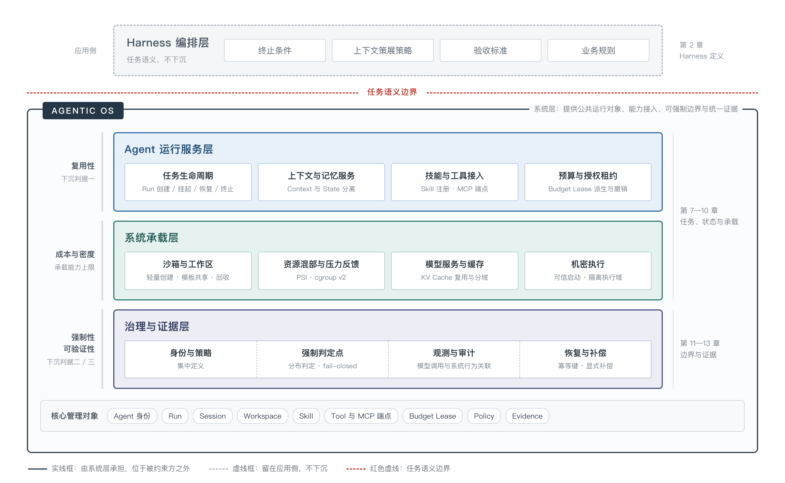

图 30-1　Agentic OS 的三层结构与责任边界

图 30-1 表达的是三层之间的责任边界，而不是调用顺序。三层各自对应一条不同的判断标准：上层解决复用性，中层解决成本与密度，下层解决强制性与可验证性。图中实线框表示由系统层承担、位于被约束方之外的职责，虚线框表示留在应用侧、不随系统层下沉的部分，红色虚线表示任务语义边界。上层与应用侧 Harness 编排层之间的这条边界是本章最重要的一条——它标记的是任务语义不下沉。

**Agent 运行服务层**承担任务对象的生命周期管理。它提供 Run 的创建、挂起、恢复与终止，提供 Session 与 Workspace 的派生与回收，提供上下文、记忆与技能的读写接口，并在这些操作上绑定预算租约。这一层的接口对象是任务与状态，而不是函数调用细节。研究侧已有对应探索：AIOS 将模型调度、上下文、记忆、存储与访问控制抽取为多个 Agent 共享的公共服务，其 kernel 位于宿主内核之上；IBM 研究团队在《Towards an Agent Operating System》中借鉴经典操作系统与云平台，讨论生命周期、工具调用、上下文、记忆、授权与恢复等基础能力，强调由平台统一管理动态执行中的公共规则。

工业侧的 ANOLISA 以系统组件形式提供了这一层的多数能力：Agent Memory 承担跨会话记忆，SkillFS 控制当前可见的技能视图并保留其余技能的可发现性，ws-ckpt 为工作区变更保留恢复点，Token-less 压缩进入模型的工具 schema 与工具响应。其中 Token-less 的放置方式值得单列：压缩发生在 Agent 与模型之间，不需要修改 Agent 框架代码，被丢弃的数组项通过标记保留可检索性，使压缩可逆。按 30.2.1 的判据看，这是一次典型的合格下沉——多个框架会重复实现同一件事（复用性），而放在调用路径上而非框架内部使它无需被约束方配合（强制性）。它也提示上下文成本本身可以是系统层的优化对象，而不只是应用侧的提示词技巧。

**系统承载层**决定同等服务质量下的成本与密度。它负责沙箱与工作区的轻量创建、模板共享与及时回收，负责按任务活跃状态分配容量，负责模型服务与缓存的数据路径，并在需要时提供机密执行环境。ANOLISA 中的 Blaze 管理沙箱生命周期，ktuner 负责内核参数调优，属于这一层的两类典型职责。这一层的收益不体现为新功能，而体现为承载量、启动与恢复时间、尾延迟与资源成本。需要注意其代价：模板共享、暂停恢复与动态调节本身都有开销，集中唤醒可能造成争用，过度回收会拖慢恢复，因此部署密度受任务完成时间、尾延迟与相邻任务干扰共同约束，单纯增加沙箱数量可能使整体服务质量下降。

**治理与证据层**决定任务是否被允许发生，以及事后能否被证明。它集中定义身份、策略与授权，在请求路径上分布判定点，采集模型调用与系统行为的关联证据，并提供恢复与补偿所需的操作记录。这一层的实现方式在工业界已有多种形态：NVIDIA OpenShell 在 Agent 之外设置独立的执行控制，通过沙箱、声明式策略、Landlock、seccomp 与网络代理管理文件、网络与进程访问（文档标注 alpha 状态，部分控制具有兼容降级配置）；Windows 365 for Agents 则将按任务分配的执行环境与任务生命周期结合，任务结束后重置环境。

ANOLISA 在这一层提供了两个可以对照表 30-2 的具体机制。AgentSight 在 Linux 上基于 eBPF 观测 Agent 行为，不要求修改 Agent 代码，把用户输入、模型调用、工具调用、Token 消耗与子 Agent 分支关联在同一视图中——这正是 Evidence 对象所要求的“独立于执行方的证据来源”。Agent Sec Core 的 Skill Ledger 则给 Skill 对象补上了状态机：已签名的技能发生变化时，Agent 在再次使用前报告 `drifted`，重新扫描会把阻断性发现记为 `deny`。这个例子说明表 30-2 中“Skill 可校验”不是一句形容词，它需要签名、漂移检测与阻断状态这三样东西同时存在才成立。

#### 30.3.3 与既有系统的职责分界

三层结构并不要求全部由操作系统提供。判断某项能力应由平台还是宿主承担，可以回到 30.2.1 的判据，并补充一条工程约束：跨层调用的成本不应超过它所换取的强制性收益。

倾向由宿主与内核提供的能力包括：沙箱与工作区的创建与回收机制、基于压力反馈的资源调节、进程与网络的强制隔离、可信启动与机密执行、以及以 eBPF 等机制实现的低干扰观测。这些能力的共同特征是必须位于被约束方之外，且无法通过应用层协作达成。

倾向由平台控制面提供的能力包括：Run 与 Session 的语义定义、评估口径与准入基线、审批流程、跨租户的配额与成本核算、以及技能与工具的注册与版本管理。这些能力需要与组织流程对齐，且需要在多种宿主环境上保持一致。

需要明确留在应用侧的是任务语义：终止条件、上下文策展策略、验收标准与业务规则。第 2 章已指出，一旦编排层直接依赖某个 Runtime 的内存结构，编排层与 Runtime 的解耦就已经被破坏。同理，一旦系统层开始规定任务该如何完成，它就从操作系统退化为框架。

### 30.4 模型、Harness、协议与运行时的解耦

#### 30.4.1 四个解耦面

Agentic OS 能否成立，取决于四个解耦面上是否存在稳定接口。所谓稳定接口，指的是可以在不重写任务语义的前提下替换实现，并用同一套评估证明替换前后的能力等价。

| 解耦面 | 稳定接口的对象 | 已相对收敛的部分 | 尚未收敛的部分 | 破坏解耦的典型做法 |
| --- | --- | --- | --- | --- |
| 模型与 Harness | 请求与响应格式、工具调用协议、结构化输出 | 工具调用与结构化输出的接口形态 | 长上下文中的指令遵循与多步稳定性无法用协议表达 | 把补偿模型缺陷的提示词与循环控制固化进业务代码 |
| Harness 与运行时 | Run、Session、Checkpoint、Workspace 的状态语义 | 状态外置的必要性已成共识 | 各框架对“一次运行”的定义不一致 | 编排层直接依赖某个运行时的内存结构或进程模型 |
| 能力与协议 | 工具描述、能力发现、调用与错误语义 | MCP 已承担工具发现与调用协议的角色 | 副作用、幂等性与风险等级缺少可机读声明 | 用协议兼容代替权限设计，把“能发现”当成“可执行” |
| 运行时与承载环境 | 沙箱契约、文件与网络边界、快照与恢复接口 | 多后端可配置已有实践 | 快照语义与跨系统副作用的关系未标准化 | 假定内部快照可以撤销外部副作用 |

表 30-3　四个解耦面的接口现状

第一个解耦面上，接口形态相对成熟，但存在一个必须防范的失败模式：协议兼容不等于能力等价。第 2 章已指出，降级模型可以在协议层正常返回工具调用，却在多步任务中丢失中间约束，最终产生一次结构合法而结果错误的执行。这意味着模型替换的验证只能通过完整 Harness 的回归评估完成，不能通过接口测试完成。

第二个解耦面上，共识已经建立但语义尚未统一。这正是 30.1.2 约束一的来源，也是标准化最直接的对象。

第三个解耦面上，MCP 解决了工具发现与调用的协议问题，但权限仍需由客户端、服务端与宿主系统分别实施。这一点在操作系统侧也有相同表现：把系统工具开放给 Agent 时，需要进一步完善操作名称、输入参数、返回结果与错误状态的描述，Windows App Actions 让应用声明可复用操作及其输入输出与内容类型，服务器侧则通过 MCP 服务与结构化命令统一日志查询、服务管理与诊断工具的调用参数与结果格式。接口描述越清楚，模型越容易选择工具并判断操作是否完成。但描述清楚不等于授权正确，这两件事必须分别设计。

第四个解耦面上，运行后端的可替换性已有实践，例如 OpenSandbox 提供环境生命周期接口并支持配置 gVisor、Kata 等运行后端。真正缺失的是快照语义的边界声明：内部快照能恢复什么、不能恢复什么，需要成为接口的一部分，而不是使用方的默认假设。

#### 30.4.2 解耦的代价

解耦不是免费的，它把复杂度从代码转移到了版本组合与验证上。

第一项代价是版本组合矩阵。当模型、框架、协议实现、运行时与硬件驱动可以独立演进时，可用组合的验证与维护成本随之上升。操作系统产品侧对此已有明确取舍：NVIDIA 围绕 DGX 硬件维护驱动、通信与操作系统的配套关系，并列出硬件与最低软件版本；Red Hat 把快速硬件适配与企业 Linux 维护分开安排，其中面向新硬件的专用组件采用持续升级方式，仅支持最新版本，不沿用标准发行版的长周期生命周期，也不保证版本间向后兼容。这类安排说明，“可支持的组合、支持周期与升级路径”本身就是交付能力的一部分。企业在设计 Agent Platform 时面临同类问题，只是对象换成了模型版本、框架版本与协议版本。

第二项代价是隐式行为变更。系统或模型更新可能在不改变接口的情况下改变输出行为。Apple 在其 Foundation Models 的更新说明中提醒开发者，在系统更新带来模型变化后重新验证提示词行为。这一提醒的意义超出桌面场景：它说明兼容性讨论已经从传统 API 扩展到模型版本与输出行为，而后者无法用接口签名描述，只能用评估集覆盖。

第三项代价是评估成本。要证明替换前后能力等价，需要在相同负载、相同权限与相同服务目标下运行同一套评估。这把第 21、22 章的评估体系从“质量保障手段”提升为“解耦的前提条件”：没有可复现的评估，解耦只是把风险从设计阶段推迟到生产阶段。

因此本书对解耦给出的判据是：一项解耦是否成立，不取决于是否存在接口定义，而取决于是否能在不重写任务语义的前提下完成替换，并用同一套评估证明替换后的行为在可接受范围内。

### 30.5 Agent Platform 的标准化与生态化

#### 30.5.1 需要标准化的六类接口

标准化的对象应当来自多家产品的共性问题，而不是某一实现的内部结构。按前面几节的分析，当前具备标准化条件的有六类接口。

**任务与运行对象模型。** 需要约定 Run、Session、Checkpoint 与 Workspace 的语义、状态机与相互关系，特别是“一次运行”的边界。它直接决定跨框架的计量、限流、排障与成本核算能否统一。

**身份与授权。** 需要约定 Agent 身份的表达、委派链的传递与验证、租约的授予与撤销语义。跨组织协作场景下，这一类接口的缺失会使责任归属无法确定。

**能力描述与发现。** 需要在现有工具描述之外，补充副作用、幂等性、风险等级与前置条件的可机读声明。本书认为这是当前最欠缺、且收益最直接的一类元数据：它决定重试与补偿能否自动化，也决定审批策略能否按风险分级而不是按工具名单配置。

**可观测事件语义。** 需要约定模型调用、工具调用、状态变更与审批四类事件的最小字段与因果关联方式，使跨厂商的 Trace 可以合并分析。

**评估与指标口径。** 需要约定数据集组织、评估器接口、指标定义与门禁表达，使不同产品的评估结果具备可比性。

**执行环境契约。** 需要约定工作区、快照、网络出站、文件与进程边界的声明方式，以及快照能够恢复与不能恢复的范围。

#### 30.5.2 标准化的形成机制

标准化不是先写规范再等实现，而是从多方实现中提炼共性。操作系统领域已有三种可借鉴的机制。

第一种是上游贡献。龙芯将矩阵乘法、卷积、转置等核心算子的向量优化提交到 ONNX Runtime 上游，从 1.17.0 版起由上游原生支持。其价值在于减少各发行版重复适配与长期维护独立补丁的成本。对 Agent 生态而言，对应做法是把通用的运行对象与观测语义推入被广泛使用的开源实现，而不是维护各自的私有扩展。

第二种是多方共建。Mooncake 由高校与多家企业共同开发，参与方包括清华大学、月之暗面、阿里云、华为存储等；龙蜥社区的 SysOM 则通过社区组件支持不同产品的运维集成。这类项目的特征是企业负责具体产品的适配与交付，社区协作提供可共享的源码、接口与开发工具。

第三种是可复现测评。厂商、开源社区与测评机构可以结合不同实现制定测试方法，在相同负载、权限与服务目标下评价性能、功能与安全，形成可互操作、可复现的要求。这一机制对 Agent 生态尤其重要，因为 Agent 系统的收益高度依赖任务分布与权限设置，脱离这些条件的指标缺少可比性。

ANOLISA 对 Token-less 效果的披露方式提供了一个可参照的口径样本。它区分两类数据：一类是组件级基准，分别给出工具响应、工具 schema 与全链路的压缩率及处理耗时；另一类是单次观测值，说明在某个编码任务中节省了约 31.7 万 Token（约 40.5%），并由 AgentSight 测得。更关键的是它同时声明了三条边界：节省只作用于进入上下文的工具响应，不等于整场会话账单；结果随负载变化；效果估算方法另有文档说明。本书认为这种“数字 + 适用范围 + 测量来源”的三段式披露，应当成为 Agent 相关效能指标的默认口径。反过来说，缺少适用范围与测量来源的单一百分比，无论数值多高，都不具备跨实现比较的价值。

#### 30.5.3 从“能跑”到“可互操作”

生态化可以分为三个递进层次，用于判断某个方向的标准化进展到了哪一步。

第一层是协议兼容：不同实现可以互相调用。MCP 在工具接入上已达到这一层。

第二层是语义一致：相同调用在不同实现上产生相同的可观察后果，包括错误分类、重试语义与状态变更范围。这一层目前普遍未达到，副作用与幂等性声明的缺失是主要原因。

第三层是证据可比：不同实现的运行记录与评估结果可以放在同一口径下比较。达到这一层，企业才能真正实现多来源 Agent 的纳管与替换。

需要提醒的是，标准化不应先于共性问题的收敛。过早把当前实现固化为规范，会把某一阶段的工程折中变成长期负担。在语义尚未清晰的领域，更务实的做法是先约定可观测字段与声明格式，让不同实现的差异变得可以被度量，再讨论行为标准。

### 30.6 从可靠执行到可控自治

#### 30.6.1 自治阶梯

第 4 章讨论可靠性与完成验证，第 6 章讨论权限与审批。把两者放在一起，可以得到一条自治阶梯。它的作用不是鼓励尽快向上走，而是明确每一级必须同时具备的边界与证据。

| 级别 | 系统行为 | 新增的边界要求 | 新增的证据要求 |
| --- | --- | --- | --- |
| L1 建议 | 生成命令或方案，由人执行 | 无需执行权限 | 建议内容可追溯 |
| L2 单步获准执行 | 每次变更前请求批准 | 操作与资源一一对应的授权 | 每次执行的输入、输出与批准记录 |
| L3 有界自主 | 在限定资源、预算与操作集内连续执行 | 预算租约、工作目录限定、读写分离 | 完整调用轨迹与预算消耗 |
| L4 长任务自主 | 跨会话长期执行，可暂停与恢复 | 可级联撤销的授权、可回退的工作区 | 计划、已发出操作与已确认结果的区分 |
| L5 组织级自治 | 跨系统、跨团队委派与协作 | 可验证的委派链、跨域强制点 | 跨组织可审计的责任归属证据 |

表 30-4　自治阶梯与对应的边界与证据要求

表 30-4 隐含一个判断：自治程度的上限不由模型能力决定，而由可撤销范围与可证明范围决定。当一项操作既不能撤销，也不能证明其结果，那么无论模型多可靠，把它交给自主执行都缺少工程依据。

#### 30.6.2 强制边界与观测边界

在纳管多来源 Agent 时，最容易出现的表述问题是把“能观测到”说成“能控制住”。本书建议在架构文档与产品说明中严格区分两类边界。

一项边界只有在满足下列全部条件时，才能称为**强制边界**：覆盖任务入口、凭证获取、网络与 DNS 访问、文件与进程间通信、子进程创建、原生工具调用、后台任务与子 Agent、以及交互控制台等全部可用路径；在判定组件不可用时采取失败即拒绝（fail-closed）的行为；并且通过负向测试证明绕过尝试确实被拒绝。任何一条不满足，该边界只能称为**观测边界**，即能够发现越界行为，但不能阻止它。

同理，“只读接入”是一个需要证明的结论，而不是一个可以声明的属性。只有通过“写路径不可达”的负向测试，才能称某个接入是只读的。缺少该测试时，准确的表述是“未观察到写操作”。

这一区分有直接的工程后果。第 11 章讨论异构 Agent 接入时，外部框架、SDK 与第三方 Agent 通常不可修改，平台只能在其外部建立边界。此时接入能力可以分为四类。

**外部边界强制**：在被接入方之外建立强制点，覆盖已证明的路径集合。需要注意，“已覆盖路径”表达的是已证明的子集，而不是全部路径，且每一项都应有独立的策略来源与独立的采集来源相互印证。

**包装器中介**：通过替换入口、代理或钩子实现中介，强制性依赖被接入方是否绕过包装器。

**仅观测**：只能采集行为并事后告警，需通过负向测试确认其确实不具备写能力。

**不支持**：既不能强制也不能可靠观测，此类路径只应进入治理与认证范围，不应对外声明为受控。

按这四类描述接入能力时，建议同时给出四个维度：该能力是强制属性还是观测属性、覆盖的操作语义、覆盖的执行路径、以及证据质量。这样描述的价值在于，它使“我们已纳管某类 Agent”成为一句可以被检验的话。

ANOLISA 可以用来说明为什么必须逐项标注而不是整体声明。它的 Agent Sec Core 通过 hook 接入 Qoder CLI、Qwen Code、Codex 等外部 Agent 运行时，在提示词、工具调用、技能与输出环节施加策略，按上面的分类属于**包装器中介**：策略确实在被接入方之外定义，但强制性取决于该运行时是否绕过 hook，因此需要负向测试来界定覆盖范围。它的 AgentSight 基于 eBPF 观测，不要求修改被观测方，证据质量高，但其本身不阻断行为，按分类属于**仅观测**。同一产品的两项能力落在不同类别，说明“是否受控”不能按产品整体回答，只能按能力、路径与证据分别回答。这也是 30.5.3 中“证据可比”之所以是最难一层的原因。

#### 30.6.3 不可逆操作、补偿与撤销

可控自治的最后一块是失败处理。工作区快照解决的是文件状态回退，它不解决跨系统副作用。数据库写入、消息发送、工单创建与远程服务重启在快照之外，不会随内部回滚自动撤销。

因此长任务的恢复需要三样东西配合：区分计划、已发出与已确认三种状态的操作记录；能够识别重复提交的幂等键；以及针对不可逆操作的显式补偿动作。当一次调用已经发出但结果未返回时，正确做法是先查询实际状态，再决定重试或补偿，而不是直接重放。这也解释了 30.3.1 为什么把 Evidence 列为核心管理对象：它不只是审计材料，而是恢复逻辑的输入。

共享状态还带来一类容易被忽视的失效：长期记忆或共享知识中可能保留已经失效的结论。软件更新、配置变更或环境迁移之后，此前正确的结论会变成误导。恢复任务时需要重新查询当前状态，而不是直接采信记忆中的历史结论。第 5 章讨论的资产治理与反退化机制，在系统层的对应要求是记忆服务必须支持更新、删除与访问控制。

此外，模型参与决策后，日志、网页与工具输出既是诊断材料，也可能包含诱导操作的文本。系统需要把这些内容视为待分析的数据，不能据此扩大权限；工具端仍应按调用身份检查可执行的变更。这类风险的性质是新的，但它放大的往往是传统问题：过大的权限、错误的配置与可重复执行的危险操作，在自动执行范围扩大后后果更严重。

### 30.7 面向下一阶段 AI 原生架构的开放问题

以上讨论的都是已有实现或已有明确方向的部分。下面七个问题目前没有公认答案，本书为每一个给出判断进展的标志，以便读者在后续一到两年内自行校准。

**问题一：Run 对象应该落在哪一层。** 任务对象可以由平台控制面持有，也可以下沉为宿主运行服务，甚至进入执行域的基础机制。判断标志是：是否出现被多个框架共同采用的任务状态语义，且该语义在框架不配合时仍能被宿主观测与约束。

**问题二：Agent 身份与委派链如何跨组织传递。** 当任务跨越组织边界委派时，身份、授权范围与责任归属需要可验证地传递。判断标志是：是否出现可被独立第三方验证的委派凭证格式，以及配套的撤销机制。

**问题三：副作用与幂等性能否成为可机读的能力元数据。** 这是自动化重试、补偿与风险分级审批的前提。判断标志是：主流工具协议是否引入副作用与幂等性字段，且运行时确实依据这些字段改变重试行为。

**问题四：沙箱与工作区的成本与隔离曲线在 Agent 负载下的最优点。** 进程级隔离、应用内核、轻量虚拟机与容器运行时各有不同的启动成本、空载占用与隔离强度。gVisor 通过用户态应用内核处理沙箱应用的系统调用，Occlum 在可信执行区内实现库操作系统，Asterinas 则以 Rust framekernel 架构在保持 Linux ABI 兼容的同时缩小可信基础。判断标志是：是否出现在 Agent 典型负载下同时公开创建吞吐、空载占用、恢复时延与隔离强度的可复现测评。

**问题五：共享状态如何做到既复用又不越界。** KV Cache、长期记忆与技能库的复用能显著降低成本，但会把原本局限于单个请求的状态带入共享环境。现有做法是按租户与任务限制访问范围，例如推理服务通过可选的缓存分域参数控制前缀缓存的复用范围，由可信入口把租户身份绑定到相应共享域。判断标志是：分域机制是否成为默认配置而非可选项，以及是否有对应的越权检测手段。

**问题六：评估如何从离线数据集走向系统级基准。** 当前评估多以任务数据集为对象，而 Agentic OS 的收益体现在承载量、恢复时间、干扰与单位成本上。判断标志是：是否形成在相同负载、权限与服务目标下同时评价质量、成本与安全的公开方法。

**问题七：自进化的变更边界。** 第 23 章讨论 Trace 到补丁的闭环，其中一个未解问题是 Agent 能否修改自身的 Skill、Prompt 与 Harness，以及在什么证据下允许。判断标志是：是否出现被广泛接受的变更分级与准入规则，使部分自动变更可以在无人审批的情况下发布，同时保留可回滚能力。

这七个问题之外还有一个更基础的问题，即面向 AI 负载的基础机制重构能否成立。研究侧已有具体方向：LithOS 针对机器学习负载重新设计 GPU 资源管理，提出细粒度调度与算子核函数的执行拆分；Agent libOS 在运行时中管理授权上限、预算与操作记录，区分外部调用的准备、派发与结算，以减少恢复时的盲目重放。这些工作的共同特征是把 30.3.1 所列对象直接纳入基础机制，而不是由上层反复映射到既有系统对象。但它们目前都限定在特定范围内，尚未形成通用实现。本书的判断是：这类重构更可能先在专用执行域内被验证，例如代码修改与测试、数据分析、工具执行这类依赖与权限范围明确的任务，再逐步扩大兼容范围。

### 30.8 本章小结

回到本书的起点。第 1 章提出的判断是：模型是认知核心，但可靠性不能寄托于模型本身。前 29 章沿着这一判断，把“模型之外还需要什么”展开为架构设计、构建、运行、治理与调优五个阶段的工程要求。

本章补充的判断是：当同一组织中运行多个 Agent、使用多种框架、服务多个租户时，这些工程要求会从“每个应用各自实现”变为“需要被共享的系统能力”。这一变化正在两个方向上同时发生，一个是平台能力向下沉为系统接口，另一个是操作系统向上承载 Agent 负载。两者会合的对象是任务、环境、授权与证据，本章把它们归纳为九类核心管理对象与三层责任结构，并给出了复用性、强制性、可验证性三条下沉判据。

这也决定了下一阶段的工作重点不在于提出新的架构名词，而在于把已经识别的限制转化为可强制、可验证、可维护的机制。一项能力是否真正成立，判断依据始终是三个具体问题：它能否在被约束方不配合时仍然生效；它的效果能否用独立证据证明；以及它能否在版本演进中被持续维护。Agentic OS 是否会成为一个稳定的产品品类，取决于这三个问题在多少条路径上得到了肯定回答。


<a id="sec-062"></a>

# 附录：关于本书
### 1. 白皮书架构与写作背景

2025年9月，我们发布了[《AI 原生应用架构白皮书》](https://developer.aliyun.com/ebook/8479)，围绕 AI 原生应用的 DevOps 全生命周期，从架构设计、技术选型、工程实践到运维优化，对概念和重难点进行体系化的拆解，并尝试提供一些解题思路。但随着模型和智能体技术的快速发展，我们发现，市场的关注度已经从快速构建智能体，转向以下三大新挑战：

*   工程化挑战：从概率智能到可靠生产力，Agent 能够承担关键任务。

*   规模化挑战：稳定、安全、性能、成本，从单点试验到智能基础设施，Agent 能够被大规模部署。

*   组织化挑战：从 Agent 孤岛到智能组织，Agent 能够进入核心业务流程。


去年的那本白皮书，显然难以应对这些新的诉求。

因此，我们重新梳理了白皮书的架构，希望通过更与时俱进的内容，更高的实践篇幅占比，以及更社区化的协作，为企业选型和内部立项提供参考，并通过开源的方式长期维护该白皮书，持续呈现 AI 原生应用架构的前沿思考和落地实践。

### 2. 目标读者与收获

本白皮书主要面向企业级 Agent 构建与落地场景。它既适合关注 Agent 开发的工程人员，也适合用于企业内部的技术选型、架构评审、项目立项和跨团队共识建设。

| 读者 | 建议关注 | 你将获得 |
| --- | --- | --- |
| Agent / AI 应用开发者 | 构建篇、运行篇、调优篇 | 掌握 Harness、上下文、状态、工具、沙箱、轨迹与评估闭环等核心工程方法。 |
| 架构师与平台工程师 | 架构篇、运行篇、治理篇 | 建立从组件、平台责任到生命周期的完整架构视图，形成可扩展的 Agent 基础设施设计。 |
| 技术负责人和研发管理者 | 架构篇、治理篇、实践篇 | 判断应用形态、成熟度、投入边界与生产风险，支撑选型、立项和组织协同。 |
| 产品与业务负责人 | 调研报告、架构篇、实践篇 | 理解适合 Agent 的任务、人与 Agent 的责任边界，以及从试点走向核心流程的条件。 |
| 安全、质量与运维人员 | 运行篇、治理篇、调优篇 | 建立可观测、审计、安全授权、上线验证、持续评估和故障归因机制。 |
| 研究者与生态贡献者 | 全书与实践篇 | 了解企业一线问题、工程抽象和开放议题，并参与共同完善行业知识体系。 |

完整阅读后，你将能够：

- 从业务目标、任务确定性和风险出发，选择最低充分的 Agent 架构；
- 理解 Model 与 Harness 的责任边界，不把所有问题都归因于模型能力；
- 设计可持续推进、可中断恢复、可验证完成的 Agent 任务系统；
- 为 Agent 建立执行环境、状态、流量、权限、观测与成本治理底座；
- 用 Trace、Trajectory、黄金数据集和评估实验形成持续改进的数据飞轮；
- 将方法映射到研发效能、设计、运维、企业 IT、客户运营等实际场景。

### 3. 阅读导引

#### 推荐阅读路径

- **第一次系统了解企业 Agent**：调研报告 → 第 1–2 章 → 第 3–6 章 → 第 13–16 章。
- **正在把 Agent 接入生产**：第 7–9 章 → 第 13–14 章 → 第 18–23 章。
- **正在建设多 Agent 系统**：第 4–6 章 → 第 10–12 章 → 第 13、16 章。
- **负责评估与持续优化**：第 13 章 → 第 18–23 章 → 对应领域实践案例。
- **负责选型或项目立项**：调研报告 → 第 1–3 章 → 实践篇 → 第 30 章。

### 4. 下一步规划

白皮书将以开放项目的方式持续维护，而不是在首次发布后封存。接下来的重点包括：

- **扩展企业实践案例**：增加更多来自研发、运营、客服、数据、安全、财务和行业场景的一线案例，补充成功路径、架构取舍与真实失败模式。
- **增加云资源线上体验**：围绕沙箱、Runtime、AI 网关、状态存储、可观测和评估等关键能力，设计可复现的云上体验流程，让读者从阅读进一步走向动手验证。
- **持续完善治理内容**：跟进身份权限、Prompt Injection 防护、数据出域、审计、资产注册、版本治理和上线前仿真等企业核心议题。
- **持续完善评估体系**：补充任务成功率、轨迹评估、LLM-as-Judge、黄金数据集、Badcase 回归、线上实验和成本质量权衡等方法与案例。
- **跟进技术演进**：持续吸收模型、Harness、协议、Runtime、多 Agent 和 Agentic OS 的新进展，并及时修正已经不再适用的判断。
- **建设社区协作机制**：逐步完善内容规范、案例模板、术语表、校对流程和版本发布方式，降低高质量贡献的门槛。

#### 欢迎贡献

欢迎开发者、架构师、研究者、企业技术团队和产品实践者参与共建。你可以：

- 提交 Issue，指出事实错误、概念歧义、链接失效或需要补充的主题；
- 提交 Pull Request，完善章节、修正内容、优化图表或补充参考资料；
- 分享经过脱敏的企业实践、故障复盘、评估方法与架构取舍；
- 提供可复现的代码、云资源体验流程、数据集或实验方案；
- 参与术语统一、技术审校、案例评审和内容翻译。

贡献内容应尊重原创与授权边界；涉及企业数据、客户信息、内部系统和安全细节时，请先完成必要的脱敏与许可确认。

### 5. 贡献者

感谢所有参与架构设计、章节写作、案例整理与内容审校的贡献者。

#### 阿里云

| 贡献领域 | 贡献者                                                 |
| --- |-----------------------------------------------------|
| 前言 | 麻芃                                                  |
| 开发者调查报告 | 任娟、王晨                                               |
| 架构篇 | 王晨、刘军、沈林                                            |
| 构建篇 | 刘军、泮圣伟、王晨                                           |
| 运行篇 | 赵庆杰、李诗波、林清山、黄晓萌、张添翼、赵源筱、孙校、宋震、胡庆达、柳遵飞、朱桐、余华峰、罗鑫、孔可青 |
| 治理篇 | 肖长军、周洋、张磊、王方、张海彬、程书意、刘子明、饶子昊、任懿、杨永、王硕、马昕、刘宇轩、杨翊     |
| 调优篇 | 张寒萌、李盛荣、王亚宁、孙坚运、马云雷、王桢、郑前祎、刘航、陈新                    |
| 实践篇 | 杨涛、朱颜、余艾琳、胡峻                                        |
| 总结与展望篇 | 林演                                                  |

#### 外部贡献者

项目持续开放社区贡献，欢迎开发者、架构师、研究者、企业技术团队和产品实践者通过 Issue 或 Pull Request 参与内容共建；贡献被采纳后，贡献者信息将补充到本模块。

---

如果这份白皮书可以帮助您更好地理解、构建、运行、治理和调优 Agent，欢迎分享、讨论并参与共建。
